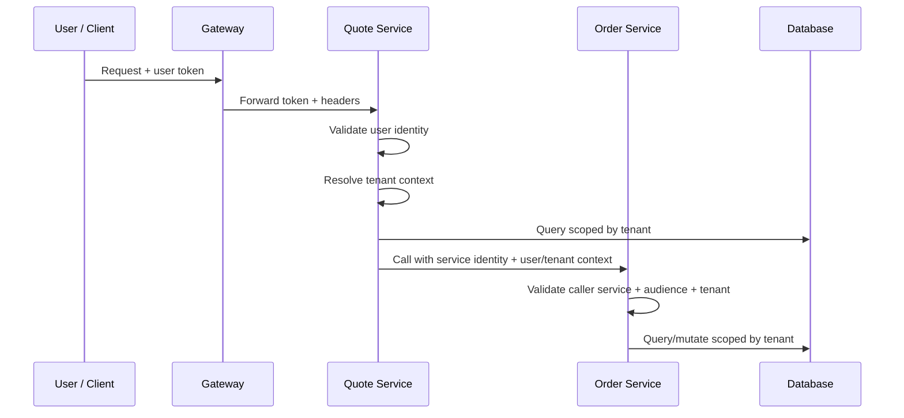
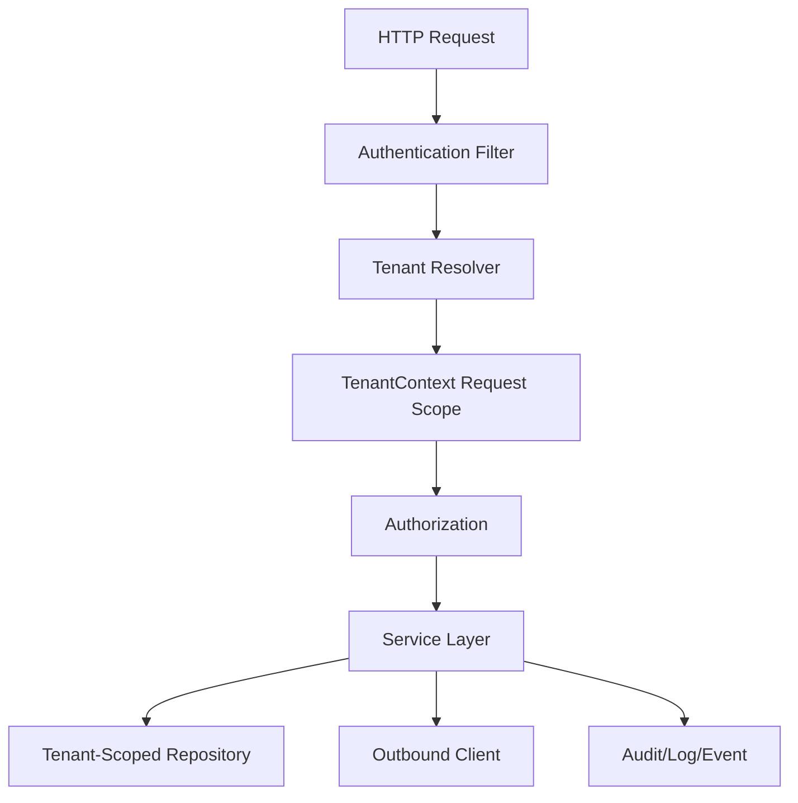

# Part 060 — Tenant Isolation and Service-to-Service Authentication

> Fokus part ini: memahami tenant isolation dan service-to-service authentication sebagai security boundary production. Kita akan membahas tenant propagation, tenant-aware routing, data isolation, service identity, audience/issuer validation, on-behalf-of calls, confused deputy problem, audit, logging, dan internal verification checklist.

Dalam sistem enterprise, bug tenant isolation sering lebih berbahaya daripada bug availability.

Availability failure membuat user tidak bisa melihat data.

Tenant isolation failure membuat user melihat data yang salah.

Itu bisa menjadi incident security, compliance, dan customer trust.

---

## 1. Core Mental Model

Tenant isolation berarti:

```text
Data, configuration, behavior, logs, events, jobs, and integrations for tenant A must not leak into tenant B.
```

Service-to-service authentication berarti:

```text
A service call must prove which service is calling, for what audience, and optionally on behalf of which user/tenant.
```

Combined model:

```text
request identity + service identity + tenant context + authorization policy + data scope
```

Mermaid view:



The invariant:

```text
Every operation must know its tenant boundary before touching data or external side effect.
```

---

## 2. Tenant Is Not Just a Header

A header can carry tenant context.

But a header alone is not trust.

Bad pattern:

```java
String tenantId = requestContext.getHeaderString("X-Tenant-Id");
quoteRepository.findByTenant(tenantId);
```

Why dangerous:

```text
caller may spoof header
proxy may forward untrusted header
internal client may accidentally send wrong tenant
header may disagree with token claim
```

Better pattern:

```text
extract tenant candidate
validate source trust
compare with authenticated principal claims
resolve effective tenant
store in trusted request context
use only resolved tenant downstream
```

A safer service-level shape:

```java
TenantContext tenantContext = tenantResolver.resolve(requestContext, principal);
Quote quote = quoteRepository.getRequired(tenantContext.tenantId(), quoteId);
```

---

## 3. Tenant Resolution Sources

Possible tenant sources:

```text
JWT claim
mTLS client certificate attribute
subdomain
path segment
trusted gateway header
session/account mapping
API key mapping
service-to-service token claim
job parameter
message header
```

Each source has different trust level.

Example:

```text
JWT tenant claim:
  trusted if token signature/issuer/audience are valid

X-Tenant-Id from public internet:
  not trusted by default

X-Tenant-Id from internal gateway:
  trusted only if gateway strips external copies and injects its own

Kafka message tenant header:
  trusted only if producer is trusted and event schema includes tenant invariant
```

Senior question:

```text
Who is allowed to assert tenant context?
```

---

## 4. Tenant Context Lifecycle in JAX-RS

Typical lifecycle:

```text
request arrives
authentication filter validates identity
tenant resolver resolves effective tenant
tenant context stored in request scope
resource method uses tenant-aware service/repository
downstream clients propagate tenant context safely
logs/traces/audit include tenant ID with redaction/cardinality rules
context is cleared after request
```



Risk points:

```text
ThreadLocal tenant not cleared
async executor loses tenant context
outbound call sends wrong tenant
repository uses global ID lookup
Kafka event missing tenant
job runs without tenant scope
```

---

## 5. Tenant-Aware Routing

Tenant-aware routing can happen at multiple layers:

```text
DNS/subdomain
API gateway route
application routing
database schema/cluster selection
catalog/pricing service selection
regional deployment selection
```

Examples:

```text
tenant-a.example.com -> tenant A
/api/{tenantId}/quotes -> tenant from path
JWT tenant claim -> application tenant context
tenant region -> route to regional service
```

Risks:

```text
path tenant differs from token tenant
subdomain tenant differs from request body tenant
gateway routes tenant A request to tenant B deployment
cache key misses tenant prefix
```

Invariant:

```text
All tenant identifiers from different sources must be reconciled or one source must be authoritative.
```

---

## 6. Tenant-Aware Data Access

Data access must enforce tenant boundary.

Unsafe:

```java
quoteRepository.findById(quoteId);
```

Safer:

```java
quoteRepository.findByTenantIdAndQuoteId(tenantId, quoteId);
```

For list/search:

```sql
WHERE tenant_id = :tenantId
  AND status = :status
ORDER BY created_at DESC
LIMIT :limit
```

Never trust client filter as tenant scope:

```sql
WHERE tenant_id = :request.tenantId
```

unless that request value is derived from validated tenant context.

For joins:

```text
Every joined table with tenant-owned data must preserve tenant boundary.
```

Example risk:

```sql
SELECT q.*, a.*
FROM quote q
JOIN account a ON a.id = q.account_id
WHERE q.tenant_id = :tenantId
```

If `account.id` is not globally unique, join must also include tenant.

```sql
JOIN account a
  ON a.tenant_id = q.tenant_id
 AND a.id = q.account_id
```

---

## 7. Data Isolation Models

Common models:

```text
shared database, shared schema, tenant_id column
shared database, schema per tenant
database per tenant
cluster/account per tenant
hybrid model by tenant tier/region/compliance
```

### 7.1 Shared Table with tenant_id

Pros:

```text
simpler operations
better resource utilization
easier cross-tenant platform analytics if allowed
```

Cons:

```text
query scoping mistakes are dangerous
index design must include tenant
large tenant can affect others
backup/restore per tenant harder
```

### 7.2 Schema Per Tenant

Pros:

```text
stronger logical isolation
per-tenant migration possible
less risk of simple WHERE clause miss
```

Cons:

```text
migration complexity
connection/search_path risk
schema drift
operational overhead
```

### 7.3 Database Per Tenant

Pros:

```text
strong isolation
per-tenant backup/restore
compliance-friendly
```

Cons:

```text
higher cost
connection management complexity
fleet migration complexity
cross-tenant operations harder
```

Internal CSG model must be verified. Do not assume one.

---

## 8. Tenant-Aware Logging

Logs should include tenant context when useful.

Example structured fields:

```text
tenantId
requestId
traceId
subject
serviceName
resourceType
resourceId
action
```

But tenant logging has risks:

```text
PII if tenant name is sensitive
high-cardinality label in metrics
log access control issue
cross-tenant log search exposure
```

Guideline:

```text
Use tenant ID in logs where needed for debugging/audit.
Avoid tenant ID as unbounded metric label unless explicitly approved.
Redact tenant-sensitive display names.
```

---

## 9. Tenant-Aware Caching

Cache keys must include tenant when data/config is tenant-specific.

Bad:

```text
catalog:product:P-123
price:offer:O-999
quote:Q-123
```

Better:

```text
tenant:T1:catalog:product:P-123
tenant:T1:price:offer:O-999
tenant:T1:quote:Q-123
```

Risks:

```text
cross-tenant cache leak
stale tenant-specific config
tenant deletion leaves cache remnants
hot tenant evicts others
```

PR review should inspect cache key construction.

---

## 10. Tenant-Specific Configuration

Tenant-specific config may include:

```text
product catalog
pricing rules
discount policy
approval threshold
tax behavior
feature flags
integration endpoint
SLA tier
regional routing
data retention
```

Important distinction:

```text
environment config = dev/stage/prod behavior
tenant config = customer/tenant-specific behavior
runtime config = dynamic control plane state
```

Bad design:

```text
if (tenantId.equals("special-customer")) { ... }
```

Better:

```text
resolve tenant config from governed config source
validate config schema
cache with TTL/invalidation
apply safe defaults
log config version
```

---

## 11. Tenant-Specific Product Catalog and Pricing

In CPQ/quote/order systems, tenant boundary often includes catalog and pricing.

Risks:

```text
tenant A sees tenant B product
wrong catalog version used
pricing rule from wrong tenant applied
feature flag enables wrong product behavior
currency/rounding policy mixed across tenants
```

Invariant:

```text
catalog lookup, pricing calculation, quote validation, and order conversion must use the same effective tenant context.
```

Useful context fields:

```text
tenantId
catalogId
catalogVersion
effectiveDate
pricingPolicyId
currencyPolicyId
channel
region
```

Do not recalculate tenant context independently in each layer.

Pass a trusted context object.

---

## 12. Service Identity

Human user identity:

```text
user:alice@example.com
```

Service identity:

```text
service:quote-service
service:order-service
job:reconciliation
```

Service-to-service authentication proves:

```text
this call came from allowed service
this token is intended for this target service
this call is within expected trust boundary
```

Do not assume internal network means trusted.

Modern production systems should treat internal calls as authenticated and authorized.

---

## 13. Audience and Issuer Validation

JWT validation must include issuer and audience.

```text
issuer = who issued token
audience = who token is intended for
```

Risk without audience validation:

```text
Token issued for Service A is accepted by Service B.
```

Risk without issuer validation:

```text
Service accepts token from untrusted identity provider.
```

Service-to-service token must usually validate:

```text
signature
issuer
audience
expiration
not-before
algorithm
key id / JWK
subject/client id
scope/permission
```

---

## 14. mTLS and Service Identity

mTLS can provide service identity via client certificate.

Common placements:

```text
service mesh sidecar
ingress/gateway
application server directly
```

mTLS answers:

```text
Which workload established the connection?
```

Token answers:

```text
Which identity/claims are authorized for this operation?
```

They can be combined.

```text
mTLS identity = service-to-service transport identity
JWT identity  = application-level subject/context
```

Risks:

```text
trusting forwarded client cert header from untrusted source
not binding token to service identity
accepting broad mesh identity without authorization
```

---

## 15. On-Behalf-Of Calls

A service can call another service:

```text
as itself
on behalf of a user
as a system job
```

### 15.1 As Itself

```text
quote-service -> catalog-service
actor = service:quote-service
```

Good for system-level lookup.

Risk:

```text
caller may use broad service privilege for user-triggered action
```

### 15.2 On Behalf of User

```text
quote-service -> pricing-service
actor = user:alice
callerService = quote-service
tenant = T1
```

Good when downstream needs user context.

Requires:

```text
token exchange or delegated token
clear actor vs caller distinction
downstream authorization based on delegated context
```

### 15.3 As System Job

```text
reconciliation-job -> quote-service
actor = job:reconciliation
```

Requires explicit system permission.

---

## 16. Confused Deputy Problem

Confused deputy happens when a privileged service is tricked into using its authority for an unprivileged caller.

Example:

```text
User cannot cancel order directly.
User can call Quote Service endpoint.
Quote Service has broad Order Service token.
Quote Service calls Order Service cancel endpoint without checking user permission.
Order gets cancelled.
```

Mitigation:

```text
check user authorization before downstream call
send user context to downstream if needed
downstream validates caller service and delegated user context
limit service token permissions
validate audience
log actor and caller separately
```

Decision model:

```text
actor = user who initiated operation
caller = service making current call
target = service receiving call
operation = requested action
resource = target object
tenant = effective tenant
```

---

## 17. Service-to-Service Authorization

Do not only authenticate service.

Authorize service action.

Example:

```text
quote-service may call pricing-service:calculatePrice
quote-service may not call pricing-service:adminReloadRules
```

Model:

```text
service identity -> service permissions/scopes -> target operation
```

Possible token scopes:

```text
pricing.calculate
catalog.read
order.create
order.cancel
```

Downstream should validate:

```text
caller service is allowed
scope/permission is present
audience matches target
request tenant is allowed
user delegation is valid if needed
```

---

## 18. Propagating Tenant Context Across HTTP

Outbound HTTP should propagate tenant context safely.

Possible headers:

```text
X-Tenant-Id
X-Correlation-Id
traceparent
baggage
X-Actor-Id
```

Do not blindly forward all incoming headers.

Use allowlist propagation.

```java
request.header("X-Tenant-Id", tenantContext.tenantId());
request.header("X-Correlation-Id", correlationId.current());
```

Better when possible:

```text
tenant claim inside signed delegated token
```

Headers are easier but weaker unless protected by trusted boundary.

---

## 19. Propagating Tenant Context Across Kafka

Events should carry tenant context in a governed way.

Options:

```text
event payload field: tenantId
Kafka header: tenantId
both payload and header with consistency validation
```

Rules:

```text
tenant must be part of event contract
tenant must be immutable for event meaning
consumer must not infer tenant from topic only unless topic is tenant-specific
replay must preserve tenant context
DLQ must preserve tenant context
```

Risk:

```text
producer publishes event with wrong tenant
consumer writes event to wrong tenant data
replay job drops tenant header
DLQ processor loses tenant context
```

---

## 20. Tenant Context Across Executors and ThreadLocal

If tenant is stored in ThreadLocal, async boundary is dangerous.

Bad:

```java
TenantContextHolder.set(tenantContext);
executor.submit(() -> processQuote(quoteId));
```

The submitted task may run:

```text
without tenant context
with stale tenant context
with tenant context from previous task if not cleared
```

Safer:

```java
TenantContext captured = tenantContext;
executor.submit(() -> {
    try {
        TenantContextHolder.set(captured);
        processQuote(quoteId);
    } finally {
        TenantContextHolder.clear();
    }
});
```

Even better:

```text
pass tenant context explicitly where practical
wrap executors centrally
verify MDC/context cleanup
```

---

## 21. Tenant-Aware Audit

Sensitive operations should audit tenant context.

Example audit fields:

```text
tenantId
actorType
actorId
callerService
resourceType
resourceId
action
decision
policyId
traceId
requestId
timestamp
```

For service-to-service:

```text
actor=user:alice
callerService=quote-service
targetService=order-service
tenant=T1
operation=order.create
```

Without actor/caller split, incident reconstruction becomes hard.

---

## 22. Tenant-Aware Metrics and Cardinality Risk

Metrics labels should be controlled.

Danger:

```text
http_requests_total{tenantId="..."}
```

If thousands of tenants, this explodes cardinality.

Options:

```text
log tenantId, not metric label
sample per tenant in tracing
use tenant tier instead of tenant ID
emit tenant-specific metrics only in approved controlled systems
```

Allowed label example:

```text
tenantTier="enterprise"
region="apac"
operation="quote_submit"
```

Use tenant ID in audit logs, not every metric.

---

## 23. Error Handling for Tenant Failures

Cases:

```text
missing tenant context
invalid tenant context
tenant mismatch between token and path/header
caller not allowed for tenant
resource not found in tenant
resource exists in another tenant
```

Mapping possibilities:

```text
missing/invalid identity -> 401
valid identity but tenant not allowed -> 403
tenant mismatch -> 403 or 400 depending policy
resource not found in effective tenant -> 404
resource exists in another tenant -> usually 404 to avoid leak, or 403 if policy allows disclosure
```

Do not expose:

```text
"quote Q-123 exists in tenant T2"
```

to tenant T1 caller.

---

## 24. Tenant Isolation Testing

Minimum test matrix:

```text
same tenant, allowed permission -> allowed
same tenant, missing permission -> denied
different tenant, same permission -> denied/not found
list endpoint returns only own tenant data
count endpoint scoped to tenant
search/filter cannot override tenant
cache key does not leak cross-tenant value
outbound call carries correct tenant
Kafka event contains correct tenant
job processes only intended tenant
```

Use seed data with at least two tenants.

```text
T1: quote Q-1
T2: quote Q-2
```

Then test direct ID substitution:

```text
T1 caller requests Q-2 -> denied/not found
```

---

## 25. Service-to-Service Testing

Test cases:

```text
no service token -> denied
wrong audience -> denied
wrong issuer -> denied
expired token -> denied
valid service token but missing scope -> denied
valid service token wrong tenant -> denied
valid service token with user context -> allowed only if delegated permission valid
service token accepted only from trusted caller path -> allowed
```

For confused deputy:

```text
user without order.cancel triggers quote endpoint that calls order.cancel -> denied
```

This should be explicit in integration/contract tests if operation is sensitive.

---

## 26. Common Failure Modes

### 26.1 Tenant Header Spoofing

```text
Public client sends X-Tenant-Id=T2 and service trusts it.
```

Mitigation:

```text
strip external headers at gateway
validate against token claim
use signed token claim for tenant
```

### 26.2 Global Repository Lookup

```text
findById(id) returns object from another tenant.
```

Mitigation:

```text
findByTenantAndId(tenantId, id)
repository API design
negative tests
```

### 26.3 Cross-Tenant Cache Key

```text
cache key lacks tenant prefix.
```

Mitigation:

```text
central cache key builder
code review checklist
tenant leak tests
```

### 26.4 Lost Tenant in Async Task

```text
ThreadLocal context not propagated or not cleared.
```

Mitigation:

```text
explicit context passing
executor wrapper
finally clear
```

### 26.5 Overbroad Service Token

```text
Internal service token accepted for all operations.
```

Mitigation:

```text
narrow scopes
audience validation
caller-service authorization
```

### 26.6 Event Missing Tenant

```text
consumer processes event into wrong tenant context.
```

Mitigation:

```text
tenant in event contract
schema validation
consumer guard
replay validation
```

---

## 27. Debugging Tenant Isolation Issues

Ask:

```text
What is the authenticated subject?
What is the caller service?
What tenant was resolved?
Where did tenant context come from?
Was path/header/body tenant reconciled?
Was repository query tenant-scoped?
Was cache key tenant-scoped?
Was outbound call tenant-scoped?
Was event/job tenant-scoped?
Was context lost across thread boundary?
What did audit log record?
```

Useful evidence:

```text
request log
trace/span attributes
security context
resolved tenant context
SQL query parameters
cache key
outbound request headers/token claims
Kafka headers/payload
job parameters
audit event
```

---

## 28. PR Review Checklist

For tenant isolation:

```text
[ ] Is effective tenant resolved from trusted source?
[ ] Are untrusted tenant headers ignored or validated?
[ ] Is path/body tenant reconciled with token tenant?
[ ] Are repository queries tenant-scoped?
[ ] Are joins tenant-safe?
[ ] Are list/count/search endpoints tenant-scoped?
[ ] Do cache keys include tenant where needed?
[ ] Are config/catalog/pricing lookups tenant-scoped?
[ ] Are logs/audit tenant-aware and redacted?
[ ] Are metrics cardinality-safe?
[ ] Do events include tenant in contract?
[ ] Do jobs run with explicit tenant scope?
[ ] Are negative cross-tenant tests present?
```

For service-to-service authentication:

```text
[ ] Is caller service authenticated?
[ ] Is token issuer validated?
[ ] Is token audience validated?
[ ] Are service scopes/permissions checked?
[ ] Is user delegation/on-behalf-of modeled if needed?
[ ] Is confused deputy risk considered?
[ ] Are service tokens narrow, not universal?
[ ] Are mTLS/service mesh assumptions verified?
[ ] Are actor and caller both logged/audited?
```

---

## 29. Internal Verification Checklist

Verify in internal CSG/codebase context:

```text
[ ] What is the tenant model: single-tenant, multi-tenant shared DB, schema per tenant, DB per tenant, hybrid?
[ ] Where is tenant context resolved?
[ ] What is the authoritative tenant source: token, gateway, path, subdomain, DB mapping, config?
[ ] Are public tenant headers stripped/replaced by gateway?
[ ] Is there a `TenantContext` object or ThreadLocal holder?
[ ] How is tenant context propagated across executors?
[ ] How is tenant context propagated across HTTP clients?
[ ] How is tenant context propagated across Kafka messages?
[ ] Are repositories tenant-aware by default?
[ ] Are global lookup methods restricted/named clearly?
[ ] Are cache keys tenant-aware?
[ ] Are catalog/pricing/rule lookups tenant-aware?
[ ] Are feature flags tenant-specific?
[ ] Are logs and audit events tenant-aware?
[ ] Are metrics protected from tenant cardinality explosion?
[ ] How are service identities issued and validated?
[ ] Is mTLS used? If yes, where is it terminated?
[ ] Are service JWT issuer/audience/scope validated?
[ ] Is token exchange/on-behalf-of used?
[ ] Is confused deputy risk covered in design reviews?
[ ] Are cross-tenant negative tests mandatory?
```

---

## 30. Senior Engineer Heuristics

Be suspicious when seeing:

```text
X-Tenant-Id used directly from request
findById without tenant
cache key without tenant
ThreadLocal tenant without clear()
list endpoint with client-supplied tenant filter
service token accepted without audience validation
internal network treated as trusted
job that scans all tenants without explicit control
Kafka event without tenant contract
logs showing tenant display name or sensitive customer data
```

Good design usually has:

```text
trusted tenant resolver
explicit TenantContext
tenant-scoped repository methods
tenant-aware cache keys
clear service identity
issuer/audience/scope validation
actor vs caller distinction
cross-tenant negative tests
audit for sensitive actions
```

---

## 31. Key Takeaways

Tenant isolation is a system invariant.

It must hold across:

```text
HTTP request
JAX-RS filters/resource methods
service layer
repository queries
cache keys
configuration
catalog/pricing rules
Kafka events
background jobs
outbound HTTP calls
logs/audit/telemetry
```

Service-to-service authentication is not just "internal call allowed".

It must prove:

```text
who is the caller service
who is the user/system actor if any
what audience the token is for
what operation is allowed
what tenant context is valid
```

The production-grade mental model:

```text
identity + tenant + permission + resource + service caller + context -> allowed side effect
```

If any part is missing, the system may still work functionally but fail security-wise.

