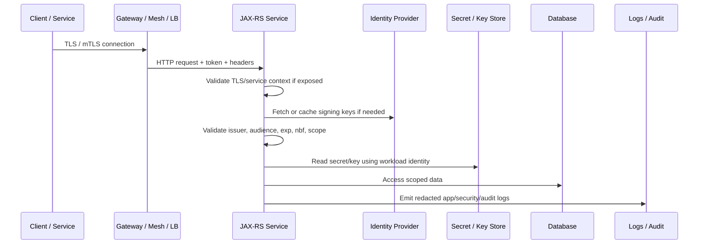
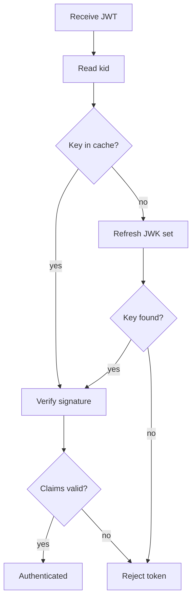

# Part 061 — Security Hardening: mTLS, Token Claims, Rotation, PII, and Retention

> Fokus part ini: memahami baseline security hardening untuk service JAX-RS enterprise. Kita akan membahas mTLS, service identity, token audience, token issuer, JWT clock skew, key rotation, secret rotation, log redaction, PII handling, audit trail, data retention, failure mode, debugging, PR review, dan checklist verifikasi internal.

Security hardening bukan aktivitas kosmetik setelah fitur selesai.

Dalam sistem enterprise, hardening adalah bagian dari lifecycle setiap request, setiap token, setiap secret, setiap log, setiap event, dan setiap data record.

Hardening yang baik membuat bug biasa tidak langsung berubah menjadi breach.

---

## 1. Core Mental Model

Security hardening berarti mempersempit ruang kesalahan.

```text
Default insecure system:
caller can reach too much
secret lives too long
logs reveal too much
tokens accepted too broadly
data retained too long
```

Hardening mengubahnya menjadi:

```text
caller identity is explicit
trust boundary is verified
token claims are constrained
secrets rotate
logs are useful but redacted
PII is classified and controlled
data retention is intentional
```

Untuk JAX-RS service, request security path biasanya seperti ini:



Senior engineer invariant:

```text
Never trust identity, tenant, permission, secret, or data classification implicitly.
Each must have a source, validation rule, lifecycle, and observable failure mode.
```

---

## 2. Threat Model Before Hardening

Hardening without threat model often becomes checklist theatre.

Start with questions:

```text
Who can call this service?
Where is identity established?
Where is authorization enforced?
What data is sensitive?
Which headers are trusted?
Which downstream systems are reachable?
What happens if token validation is bypassed?
What happens if logs leak PII?
What happens if old keys/secrets remain valid forever?
```

A simple threat mapping:

| Threat | Example | Hardening control |
|---|---|---|
| Spoofed caller | Fake service calls internal API | mTLS, service identity, token audience |
| Token confusion | Token for service A accepted by service B | Audience validation |
| Issuer confusion | Token from untrusted issuer accepted | Issuer allowlist |
| Replay | Captured request reused | TLS, short token TTL, nonce/signing for critical calls |
| Secret leak | DB password printed in logs | Redaction, secret manager, rotation |
| PII leak | Email/phone/customer data in logs | Classification, masking, audit policy |
| Over-retention | Data kept beyond legal/business need | Retention policy, purge/archive job |
| Key compromise | Signing key leaked | Key rotation, revocation, cache TTL |

Hardening must be tied to a concrete risk.

---

## 3. mTLS Mental Model

TLS authenticates the server to the client.

mTLS authenticates both sides.

```text
TLS:
client verifies server certificate

mTLS:
client verifies server certificate
server verifies client certificate
```

In service-to-service systems, mTLS may be handled by:

```text
service mesh sidecar
API gateway
ingress controller
load balancer
application runtime
```

Do not assume the JAX-RS application sees client certificate details.

In many platforms, mTLS is terminated before the request reaches the Java process.

Therefore, app-level authorization should not blindly trust:

```text
X-Forwarded-Client-Cert
X-Client-Cert
X-Service-Name
X-Forwarded-User
```

unless the platform explicitly guarantees those headers are stripped/replaced by trusted infrastructure.

---

## 4. mTLS Placement Options

### 4.1 Mesh-level mTLS

```text
client pod -> sidecar -> encrypted mesh traffic -> sidecar -> service pod
```

Pros:

```text
automatic certificate rotation
consistent policy
less app code
service identity integrated with platform
```

Risks:

```text
application may not know peer identity
policy misconfiguration can allow unexpected callers
bypass path may exist outside mesh
```

### 4.2 Gateway-level mTLS

```text
external client -> gateway validates client certificate -> service receives forwarded request
```

Pros:

```text
good for partner/client certificate auth
centralized TLS policy
simplifies application runtime
```

Risks:

```text
backend must trust only gateway
forwarded identity headers must be protected
certificate-to-principal mapping may be opaque
```

### 4.3 Application-level mTLS

```text
Java service terminates TLS and validates client certificate
```

Pros:

```text
application has direct certificate visibility
fine-grained custom validation possible
```

Risks:

```text
certificate management complexity
harder rotation
container/runtime-specific config
more app responsibility
```

For enterprise systems, prefer platform-managed mTLS plus application-level authorization.

---

## 5. Service Identity

Service identity answers:

```text
Which workload/service is calling?
```

It is not the same as user identity.

Example identity dimensions:

```text
user identity: alice@example.com
service identity: quote-api
tenant identity: tenant-123
client application: partner-portal
request identity: trace/request/correlation ID
```

Service identity may come from:

```text
mTLS certificate subject/SAN
SPIFFE ID
Kubernetes service account
cloud workload identity
OAuth2 client credentials token
API gateway client registration
```

The application must know which identity is authoritative for which decision.

Bad pattern:

```java
String caller = request.getHeaderString("X-Service-Name");
if (caller.equals("order-service")) {
    allowInternalOperation();
}
```

Better model:

```text
caller identity is established by trusted auth layer
identity source is documented
identity is validated against allowed audience/scope/policy
raw headers are not treated as proof
```

---

## 6. Token Audience

Token audience answers:

```text
Who is this token intended for?
```

If `quote-api` accepts a token intended for `billing-api`, token confusion is possible.

Example claim:

```json
{
  "iss": "https://idp.example.com/realms/enterprise",
  "sub": "service-account-order-service",
  "aud": "quote-api",
  "scope": "quote.write",
  "exp": 1730000000
}
```

Validation invariant:

```text
The service must reject tokens whose audience does not include this service/API.
```

Common bugs:

```text
only signature is checked
issuer is checked but audience is ignored
audience validation disabled for local testing and accidentally enabled in production
multiple audiences accepted too broadly
```

JAX-RS filter shape:

```java
@Provider
@Priority(Priorities.AUTHENTICATION)
public final class JwtAuthenticationFilter implements ContainerRequestFilter {
    @Override
    public void filter(ContainerRequestContext ctx) {
        String token = bearerToken(ctx);
        JwtClaims claims = jwtVerifier.verify(token);

        if (!claims.audience().contains("quote-api")) {
            throw new NotAuthorizedException("Invalid token audience");
        }

        ctx.setSecurityContext(toSecurityContext(claims));
    }
}
```

Do not hardcode this casually in real systems.

Use the configured service audience and validate it at startup.

---

## 7. Token Issuer

Token issuer answers:

```text
Who created and signed this token?
```

Issuer validation protects against accepting tokens from untrusted identity providers.

Validation invariant:

```text
Accepted issuers must be explicit, environment-specific, and observable.
```

Bad pattern:

```text
accept any token signed by any known JWK endpoint
```

Better pattern:

```text
issuer allowlist per environment
JWK endpoint derived from issuer metadata
strict HTTPS
cache with bounded TTL
key ID lookup with failure handling
```

Environment problem:

```text
dev issuer != test issuer != prod issuer
```

A production service should fail fast when issuer config is missing or inconsistent.

---

## 8. JWT Clock Skew

JWT time claims commonly include:

```text
exp: expiration time
nbf: not before
iat: issued at
```

Distributed systems have clock drift.

If validation is too strict, valid tokens may fail.

If validation is too loose, expired tokens live too long.

Recommended mental model:

```text
small allowed clock skew
short-lived tokens
synchronized nodes
observable token validation failures
```

Example policy:

```text
allowedClockSkew = 30s or 60s
not 15 minutes unless explicitly justified
```

Failure modes:

```text
node clock drift causes random 401
token accepted long after expiry
local dev disables expiry validation and pattern leaks into production
```

Internal verification:

```text
Check NTP/time sync policy.
Check JWT validation library config.
Check allowed clock skew.
Check whether tests cover expired, future nbf, and wrong iat tokens.
```

---

## 9. Key Rotation

Signing keys rotate.

A service validating JWT must handle:

```text
new key appears
old key remains valid for overlap window
old key is removed
kid does not match cached key
JWK endpoint unavailable
```

Naive behavior:

```text
cache keys forever
fail all requests after key rotation
accept old keys forever
fetch JWK on every request
```

Better behavior:

```text
cache keys with TTL
refresh on unknown kid
retain old keys only within allowed window
surface key-refresh failures as metrics/logs
fail closed when validation cannot be trusted
```

Mermaid lifecycle:



Production checklist:

```text
JWK cache TTL is documented.
Unknown kid refresh behavior is tested.
Key rotation event does not require service restart.
Key fetch failure is observable.
Old key retention window is understood.
```

---

## 10. Secret Rotation

Secret rotation is broader than JWT keys.

It includes:

```text
database credentials
Kafka credentials
cloud credentials
API keys
webhook signing secrets
encryption keys
mTLS certificates
service account tokens
```

Rotation lifecycle:

```text
create new secret
allow both old and new during overlap
roll services to use new secret
verify traffic works
revoke old secret
monitor failures
```

Common failure modes:

```text
service reads secret only at startup and never reloads
rotation requires full restart but no rollout plan exists
old secret revoked before all pods use new one
connection pools keep old credentials
logs expose secret during failure
```

JAX-RS service implication:

```text
resource method should not fetch secret repeatedly
client/repository layer must handle refreshed credentials if platform supports it
startup config validation must not print secret value
```

---

## 11. Secret Access Pattern

Bad pattern:

```java
String password = System.getenv("DB_PASSWORD");
log.info("Connecting with password={}", password);
```

Better pattern:

```java
DatabaseCredentials credentials = credentialProvider.current();
DataSource dataSource = dataSourceFactory.create(credentials);
log.info("Database credential loaded from source={} version={}",
        credentials.source(), credentials.versionLabel());
```

Do not log:

```text
secret values
private keys
tokens
authorization headers
cookie values
signed URLs if they grant access
```

Can log:

```text
secret source name
secret version label
rotation timestamp
credential expiration timestamp
load success/failure
```

Even then, ensure labels do not contain sensitive information.

---

## 12. Log Redaction

Redaction should be systemic, not ad hoc.

Sensitive input can enter through:

```text
headers
query params
request body
exception messages
downstream error payload
SQL parameters
event payload
thread context / MDC
```

Dangerous fields:

```text
Authorization
Cookie
Set-Cookie
password
secret
token
apiKey
access_token
refresh_token
privateKey
ssn
nationalId
creditCard
```

Redaction layers:

```text
logging framework filter
HTTP logging filter
exception mapper
object serializer
observability exporter
audit event builder
```

Bad pattern:

```java
log.error("Failed request body={}", requestBody, exception);
```

Better pattern:

```java
log.error("Failed request operation={} errorCode={} correlationId={}",
        operation, errorCode, correlationId, exception);
```

A senior review should ask:

```text
Can this log line reveal customer data, token, secret, price, discount, contract terms, or internal policy?
```

---

## 13. PII Handling

PII means data that can identify a person directly or indirectly.

Examples:

```text
name
email
phone
address
national identifier
account identifier
IP address in some contexts
device identifier
customer contact data
```

Enterprise systems often also have commercially sensitive data:

```text
pricing
discount
quote terms
customer contract terms
product eligibility
approval limits
```

Treat classification seriously.

Data classification should drive:

```text
whether field can be logged
whether field can be indexed
whether field can be exposed in API
whether field can be used as metric label
whether field can be sent to third-party observability tools
retention duration
audit requirement
encryption requirement
```

---

## 14. PII in API Design

API design must avoid unnecessary exposure.

Bad response shape:

```json
{
  "quoteId": "Q-123",
  "customerName": "Alice Example",
  "customerEmail": "alice@example.com",
  "customerPhone": "+1-555-0100",
  "internalRiskScore": 84,
  "approvalRule": "enterprise-discount-over-limit"
}
```

Better response shape depends on consumer need:

```json
{
  "quoteId": "Q-123",
  "customerRef": "C-456",
  "status": "DRAFT"
}
```

Only include sensitive fields when there is a legitimate consumer requirement.

Ask during PR review:

```text
Who needs this field?
Is it required for this use case?
Can it be represented by reference instead of raw value?
Is it visible to the correct permission/tenant only?
Is it documented in contract?
Is it redacted in logs and traces?
```

---

## 15. PII in Logs and Metrics

Logs often outlive application data.

That makes log PII dangerous.

Do not use PII as metric labels:

```text
customer_id
tenant_id if cardinality is unbounded and policy disallows it
email
phone
quote_id
order_id
```

Why:

```text
high-cardinality cost explosion
privacy exposure
hard deletion problem
unbounded index growth
```

Prefer:

```text
operation
endpoint template
status class
error code
dependency name
region/environment
bounded tenant tier or segment only if approved
```

Trace attributes need the same discipline.

---

## 16. Audit Trail

Audit trail is not the same as application logging.

Application log answers:

```text
What happened technically?
```

Audit trail answers:

```text
Who did what to which business object, when, from where, and under which authority?
```

Audit event shape:

```json
{
  "eventType": "QUOTE_APPROVED",
  "actorType": "USER",
  "actorId": "user-123",
  "tenantId": "tenant-456",
  "resourceType": "QUOTE",
  "resourceId": "quote-789",
  "decision": "APPROVED",
  "timestamp": "2026-07-10T03:20:00Z",
  "correlationId": "...",
  "reasonCode": "APPROVAL_LIMIT_OK"
}
```

Audit should be:

```text
structured
append-oriented
time-stamped
correlatable
protected from casual deletion/modification
retained according to policy
```

Do not put full sensitive payloads into audit unless required and approved.

---

## 17. Data Retention

Data retention defines how long data lives.

It affects:

```text
main database records
soft-deleted records
outbox/inbox tables
event topics
object storage
logs
traces
metrics
audit records
cache entries
backups
exports
local developer dumps
```

A retention policy should answer:

```text
What data category is this?
Why is it retained?
How long is it retained?
Who owns the retention rule?
How is deletion/archive executed?
How is retention verified?
What happens to backups?
```

Retention bugs often come from hidden copies.

Examples:

```text
PII deleted from main table but remains in logs
quote payload deleted from DB but remains in Kafka compacted topic
customer data archived but remains in object storage export
cache keeps old sensitive field after permission removal
```

---

## 18. Retention and Event-Driven Systems

Events complicate retention.

Kafka retention may be:

```text
time-based
size-based
compacted
infinite for audit/event-sourcing style topics
```

If event payload contains PII, retention becomes a data governance issue.

Senior design question:

```text
Should the event carry raw PII, a reference, a tokenized value, or a snapshot?
```

Trade-off:

| Event payload style | Pros | Risks |
|---|---|---|
| Full snapshot | Easy replay, fewer DB calls | Retention/privacy exposure |
| Reference only | Less sensitive payload | Replay depends on current DB state |
| Tokenized field | Limits exposure | Requires resolver and key lifecycle |
| Redacted event | Safer externally | May be insufficient for consumers |

Do not treat event retention as purely Kafka configuration.

It is contract governance.

---

## 19. Encryption Boundary

Hardening often includes encryption, but encryption has layers.

```text
in transit: TLS/mTLS
at rest: database/storage encryption
application-level: field encryption/tokenization
backup encryption
secret encryption
```

Important distinction:

```text
Encryption at rest does not prevent application-level overexposure.
```

If service can read PII and log it, disk encryption does not help.

Application-level controls are still needed:

```text
field-level permission
redaction
minimal response shape
audit
retention
```

---

## 20. JAX-RS Security Filter Placement

Typical ordering:

```text
request enters runtime
low-level container filter
JAX-RS pre-matching filter if any
authentication filter
tenant resolution filter
authorization filter
resource method
response filter
```

Security filters should fail closed.

Example shape:

```java
@Provider
@Priority(Priorities.AUTHENTICATION)
public final class AuthenticationFilter implements ContainerRequestFilter {
    @Override
    public void filter(ContainerRequestContext ctx) {
        Optional<Principal> principal = authenticator.authenticate(ctx);
        if (principal.isEmpty()) {
            throw new NotAuthorizedException("Authentication required");
        }
        ctx.setSecurityContext(new AppSecurityContext(principal.get(), ctx.getSecurityContext().isSecure()));
    }
}
```

Hardening checks:

```text
Which endpoints bypass auth?
Are health endpoints separated from business endpoints?
Are internal endpoints protected?
Are OPTIONS/CORS preflight handled safely?
Are error responses not leaking token parsing details?
```

---

## 21. Error Handling for Security Failures

Security errors must balance usability and leakage prevention.

Do not expose:

```text
which claim exactly allowed bypass
which internal service names are accepted
whether user exists
which permission rule failed in too much detail
raw token parsing exception
```

Useful internal log:

```text
security_failure type=INVALID_AUDIENCE issuer=... audience_hash=... correlationId=...
```

Useful client response:

```json
{
  "errorCode": "AUTHENTICATION_FAILED",
  "message": "Authentication failed"
}
```

For authorization:

```json
{
  "errorCode": "FORBIDDEN",
  "message": "Access denied"
}
```

Map carefully:

| Failure | HTTP status | Notes |
|---|---:|---|
| Missing/invalid token | 401 | Include `WWW-Authenticate` if appropriate |
| Valid identity but denied | 403 | Do not reveal sensitive resource existence |
| Tenant mismatch | 403 or 404 | Depends on internal policy |
| Invalid mTLS/client cert | Usually gateway-level | App may only see sanitized failure |
| Expired token | 401 | Avoid verbose token detail |

---

## 22. Local Development and Security Bypass Risk

Local dev often needs relaxed auth.

That is acceptable only if controlled.

Bad pattern:

```java
if (profile.equals("dev")) {
    return new AdminPrincipal("local-admin");
}
```

Better pattern:

```text
local auth emulator
explicit dev-only profile
startup banner showing insecure mode
cannot run in prod namespace
CI guard prevents insecure profile in release artifact
integration tests cover real auth path
```

Internal verification:

```text
Check how local tokens are generated.
Check whether auth bypass exists.
Check profile guardrails.
Check whether test helper code is excluded from production artifact.
```

---

## 23. Configuration Hardening

Security config should be explicit.

Examples:

```yaml
security:
  jwt:
    issuer: "https://idp.example.com/realms/prod"
    audience: "quote-api"
    allowedClockSkewSeconds: 60
    jwksCacheTtlSeconds: 300
  redaction:
    enabled: true
  mTLS:
    mode: "platform-managed"
```

Startup should validate:

```text
issuer is present
audience is present
clock skew is bounded
redaction is enabled in non-local environments
secret source is not local file in production
insecure bypass is disabled
```

Fail fast beats silent insecure startup.

---

## 24. Testing Security Hardening

Security tests must include negative cases.

Token tests:

```text
missing token
malformed token
expired token
not-yet-valid token
wrong issuer
wrong audience
wrong algorithm
unknown kid
valid token without required scope
valid token for wrong tenant
```

mTLS/service identity tests where applicable:

```text
unknown service identity
authorized service identity
wrong service for operation
missing forwarded identity from trusted layer
spoofed header rejected
```

Redaction tests:

```text
Authorization header not logged
password field redacted
token field redacted
PII not present in structured log
exception message sanitized
```

Retention tests:

```text
cleanup job deletes eligible data
archive job preserves required records
audit records retained according to policy
outbox/inbox retention does not break replay window
```

---

## 25. Observability for Security Hardening

Metrics should be useful but safe.

Useful metrics:

```text
authentication_failures_total{reason="expired"}
authentication_failures_total{reason="wrong_audience"}
authorization_denials_total{operation="quote.approve"}
jwks_refresh_failures_total
secret_load_failures_total
redaction_failures_total
security_filter_latency
```

Avoid labels:

```text
raw token
email
customer id
quote id
full tenant id unless policy allows and cardinality is controlled
```

Logs should include:

```text
correlation ID
security failure category
trusted issuer alias
configured audience alias
operation name
sanitized principal reference
```

Not raw sensitive data.

---

## 26. Common Failure Modes

### 26.1 Token Accepted for Wrong Audience

Symptom:

```text
service accepts token minted for another service
```

Impact:

```text
confused deputy
unauthorized internal operation
cross-service privilege escalation
```

Detection:

```text
security tests with wrong audience
logs/metrics for invalid audience
contract with identity provider
```

### 26.2 Issuer Too Broad

Symptom:

```text
token from dev/test issuer works in prod
```

Impact:

```text
production access using non-production identity
```

Detection:

```text
startup config validation
issuer allowlist review
environment-specific tests
```

### 26.3 Clock Skew Too Large

Symptom:

```text
expired token remains usable too long
```

Impact:

```text
larger compromise window
```

Detection:

```text
config review
token validation tests
security baseline scan
```

### 26.4 Secret Rotation Breaks Service

Symptom:

```text
all pods fail DB/Kafka/cloud auth after rotation
```

Impact:

```text
outage
manual rollback
security team delays future rotations
```

Detection:

```text
rotation drill
credential version metrics
connection pool behavior test
```

### 26.5 Log PII Leak

Symptom:

```text
sensitive fields appear in searchable logs
```

Impact:

```text
privacy incident
retention/remediation complexity
```

Detection:

```text
log scanning
redaction tests
observability export review
```

### 26.6 Retention Gap

Symptom:

```text
data deleted from DB but remains in events, logs, exports, backups, or cache
```

Impact:

```text
non-compliance
incorrect customer data handling
```

Detection:

```text
data inventory
retention job audit
end-to-end deletion trace
```

---

## 27. Debugging Security Failures

When a request fails security validation, debug in layers:

```text
1. Did request reach service?
2. Was TLS/mTLS terminated at gateway/mesh/app?
3. Was token present?
4. Was token parsed?
5. Was signature validated?
6. Was issuer accepted?
7. Was audience accepted?
8. Were time claims valid?
9. Was scope/permission present?
10. Was tenant context consistent?
11. Was authorization denied?
12. Was error mapped correctly?
```

Do not start by changing code.

Start by locating the failed layer.

Useful artifacts:

```text
correlation ID
request timestamp in UTC
endpoint template
caller identity alias
issuer alias
audience alias
security filter logs
IdP/JWK availability
mesh/gateway logs
```

Never paste raw production tokens into issue trackers or chat.

---

## 28. PR Review Checklist

For security hardening PRs, check:

```text
[ ] Token issuer is validated.
[ ] Token audience is validated.
[ ] JWT expiration and nbf are enforced.
[ ] Clock skew is bounded and justified.
[ ] JWK/key cache behavior is safe.
[ ] Unknown kid behavior is tested.
[ ] Auth bypass cannot run in production.
[ ] Service identity is derived from trusted source.
[ ] Raw forwarded identity headers are not trusted blindly.
[ ] mTLS assumptions are documented.
[ ] Secrets are not logged.
[ ] Authorization header/cookies are redacted.
[ ] PII fields are classified.
[ ] API response does not expose unnecessary sensitive data.
[ ] Metrics labels avoid PII/high-cardinality fields.
[ ] Audit event contains enough data but not full sensitive payload by default.
[ ] Data retention impact is understood.
[ ] Error response does not leak sensitive validation detail.
[ ] Negative security tests exist.
```

---

## 29. Internal Verification Checklist

Because internal CSG architecture must not be guessed, verify:

```text
[ ] Is mTLS used? At gateway, mesh, load balancer, app, or not at all?
[ ] What is the authoritative service identity source?
[ ] Are service-to-service calls authenticated with mTLS, OAuth2 client credentials, both, or another mechanism?
[ ] Which IdP issues user tokens?
[ ] Which IdP issues service tokens?
[ ] What issuer values are valid per environment?
[ ] What audience values should Quote & Order services validate?
[ ] What JWT validation library is used?
[ ] What is the allowed JWT clock skew?
[ ] How are JWKs cached and refreshed?
[ ] Is key rotation tested operationally?
[ ] Where are secrets stored: Kubernetes Secret, external secret, AWS Secrets Manager, Azure Key Vault, Vault, or another system?
[ ] Is secret rotation automatic or manual?
[ ] Do clients/repositories reload secrets or require pod restart?
[ ] What is the PII/data classification policy?
[ ] Which fields in quote/order/customer/catalog/pricing payloads are sensitive?
[ ] What log redaction framework/filter is used?
[ ] Are Authorization, Cookie, token, and password fields redacted by default?
[ ] What audit events are mandatory for quote/order lifecycle?
[ ] What is data retention for DB rows, events, logs, traces, metrics, object storage, backups, and exports?
[ ] Are retention jobs implemented, monitored, and tested?
[ ] Is there a security baseline checklist for new services?
```

---

## 30. Senior Engineer Heuristics

Use these heuristics:

```text
If the service accepts a token, it must validate why that token is intended for this service.
If the service logs a field, assume someone will search and export it later.
If a secret never rotates, assume it will eventually be compromised.
If data is copied to logs/events/exports, deletion becomes multi-system.
If auth is bypassed for local dev, guard the bypass like production risk.
If mTLS is platform-managed, verify what identity reaches the application.
If a security rule is not tested negatively, assume it can regress.
```

Production security is not one mechanism.

It is a chain.

The weakest unverified assumption usually wins.

---

## 31. Key Takeaways

- mTLS, token validation, secret rotation, PII handling, audit, and retention are connected hardening controls.
- Signature validation alone is not enough; issuer, audience, time claims, scope, and tenant context matter.
- Service identity and user identity are different and must not be collapsed casually.
- Secrets need source, ownership, rotation, redaction, and failure observability.
- PII must be controlled in API responses, logs, metrics, traces, events, exports, and backups.
- Data retention is a distributed-system problem, not just a database cleanup job.
- Internal runtime/platform details must be verified from codebase, deployment, gateway/mesh config, security docs, and team practices.
