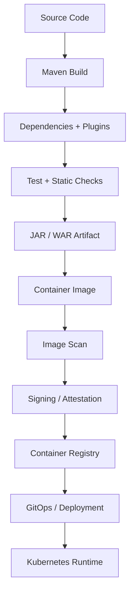
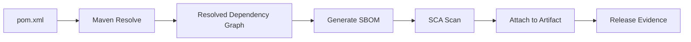

# Part 062 — Supply Chain Security: SBOM, SCA, Image Scanning, Signing, and Provenance

> Fokus part ini: memahami supply chain security untuk service Java/JAX-RS enterprise. Kita akan membahas Maven dependency governance, transitive dependency risk, vulnerability scanning, SBOM, SCA, container image scanning, artifact signing, provenance, build integrity, CI/CD gates, failure mode, debugging, PR review, dan internal verification checklist.

Aplikasi production tidak hanya terdiri dari code yang kita tulis.

Ia juga terdiri dari:

```text
source code
third-party libraries
transitive dependencies
build plugins
base container images
OS packages
generated code
CI runners
artifact repository
container registry
deployment manifests
runtime configuration
```

Supply chain security adalah disiplin menjaga seluruh jalur tersebut tetap dapat dipercaya.

---

## 1. Core Mental Model

Supply chain security menjawab pertanyaan:

```text
Can we trust what we build, what we ship, and what we run?
```

Untuk service Java/JAX-RS, jalurnya biasanya seperti ini:



Each edge can fail.

Each artifact needs identity.

Each dependency needs governance.

Each release should be traceable.

Invariant:

```text
A production deployment should be traceable from running pod back to image digest, build pipeline, source commit, dependency set, SBOM, and approval gates.
```

---

## 2. What Is the Software Supply Chain?

The software supply chain includes everything that can influence the final running service.

For Java backend:

```text
JDK distribution
Maven wrapper
Maven plugins
parent POM
BOMs
third-party dependencies
internal libraries
generated API clients
annotation processors
Docker base image
OS packages
CI runner image
build scripts
Helm charts / manifests
GitOps controller
registry policies
```

A vulnerability can enter through any of these.

Example:

```text
A safe-looking PR changes only pom.xml.
It upgrades a minor library.
That library pulls a vulnerable transitive dependency.
The build passes.
The runtime now exposes a vulnerable parser.
```

This is why dependency changes are architecture changes, not clerical changes.

---

## 3. Maven Dependency Governance

Maven gives power and risk.

Key concepts:

```text
direct dependency
transitive dependency
dependency scope
plugin dependency
parent POM
BOM
version mediation
exclusions
dependencyManagement
```

Risky patterns:

```xml
<dependency>
  <groupId>some.group</groupId>
  <artifactId>some-lib</artifactId>
  <version>LATEST</version>
</dependency>
```

```xml
<dependency>
  <groupId>some.group</groupId>
  <artifactId>some-lib</artifactId>
  <version>[1.0,)</version>
</dependency>
```

Better pattern:

```text
pinned versions
centralized dependency management
approved internal BOM
dependency convergence checks
explicit exclusions with reason
regular vulnerability review
```

Senior review questions:

```text
Why is this dependency needed?
Is it already provided by platform/runtime?
Does it duplicate an existing library?
What transitive dependencies does it bring?
Is it maintained?
What is its license?
Does it run code at build time or runtime?
```

---

## 4. Direct vs Transitive Dependency Risk

A direct dependency is visible in `pom.xml`.

A transitive dependency may be pulled indirectly.

Transitive dependency risk is dangerous because engineers may not know it exists.

Command examples:

```bash
mvn dependency:tree
mvn dependency:tree -Dincludes=org.apache.logging.log4j
mvn dependency:analyze
```

Risk categories:

```text
known CVE
abandoned library
unexpected license
duplicate classpath
version conflict
shadowed dependency
incompatible jakarta/javax namespace
runtime-provided dependency packaged accidentally
```

For JAX-RS/Jersey systems, dependency drift can cause subtle runtime failures:

```text
wrong Jackson provider version
mixed javax/jakarta APIs
HK2/Jersey version mismatch
Servlet API packaged incorrectly
validation provider mismatch
```

---

## 5. Dependency Convergence and Classpath Integrity

Java classpath conflicts create security and stability issues.

Example:

```text
library A requires jackson-databind 2.x
library B pulls older vulnerable jackson-databind
Maven chooses one based on mediation rules
runtime behavior changes silently
```

Checks:

```text
dependency convergence
duplicate classes
upper bound dependency check
banned dependencies
allowed repositories
plugin version lock
```

Maven Enforcer style controls:

```xml
<rules>
  <dependencyConvergence />
  <requirePluginVersions />
  <requireReleaseDeps />
</rules>
```

Internal verification:

```text
Check whether Maven Enforcer is used.
Check whether dependency convergence is enforced.
Check whether banned dependencies exist.
Check whether internal BOM controls versions.
```

---

## 6. SCA: Software Composition Analysis

SCA scans dependencies for:

```text
known vulnerabilities
license issues
malware indicators
outdated packages
policy violations
```

SCA tools may scan:

```text
pom.xml
resolved dependency graph
JAR/WAR artifact
container image filesystem
SBOM
```

Important distinction:

```text
A CVE finding is not automatically exploitable.
But it is not automatically irrelevant either.
```

A good triage includes:

```text
affected package
affected version
fixed version
runtime reachability
exposed attack surface
compensating controls
upgrade risk
exception owner
exception expiry
```

Bad triage:

```text
mark as false positive forever with no evidence
ignore because tests pass
upgrade blindly without compatibility review
```

---

## 7. Vulnerability Severity vs Exploitability

Severity is generic.

Exploitability is contextual.

Example:

```text
A vulnerable XML parser is high severity.
If the service accepts untrusted XML, risk is high.
If XML support is not used and dependency is unreachable, risk may be lower.
```

But be careful:

```text
"not used" must be proven, not guessed.
```

Evidence may include:

```text
no provider registered
no endpoint consumes XML
dependency only test scope
class not packaged in runtime artifact
feature disabled by config
```

For senior engineers, the right response is:

```text
classify
prioritize
fix or mitigate
record exception with expiry
verify in pipeline
```

---

## 8. SBOM Mental Model

SBOM means Software Bill of Materials.

It is an inventory of software components.

It should answer:

```text
What dependencies are in this artifact?
What versions?
What licenses?
Which package coordinates?
Which artifact/image contains them?
```

SBOM is useful for:

```text
incident response
CVE impact analysis
license review
customer/security audits
release traceability
supply chain provenance
```

Common formats:

```text
CycloneDX
SPDX
```

SBOM should be generated from the resolved build, not manually maintained.

---

## 9. SBOM in Java Build Pipeline

Typical pipeline:

```text
resolve dependencies
generate SBOM
scan SBOM
attach SBOM to build artifact
attach SBOM to container image/release
store SBOM in artifact repository or security platform
```

Mermaid:



Questions to verify:

```text
Is SBOM generated per commit, per release, or per image?
Does SBOM include transitive dependencies?
Does it include container OS packages?
Where is it stored?
Can production image digest be mapped to SBOM?
```

---

## 10. Container Image Scanning

Java app scanning is not enough.

The image also includes:

```text
base OS packages
shell/tools if present
CA certificates
JDK/JRE files
native libraries
package manager metadata
entrypoint scripts
```

Image scanner checks:

```text
OS package CVEs
language package CVEs
malware signatures
secrets accidentally baked into image
unsafe file permissions
root user
known vulnerable base image
```

Hardening checklist:

```text
use minimal base image
run as non-root
avoid package managers in final image
avoid shell if not needed
pin base image by digest where policy requires
regularly rebuild for patched base images
scan before push/deploy
block critical findings unless exception approved
```

---

## 11. Base Image Governance

A base image is a dependency.

Do not treat it as invisible infrastructure.

Questions:

```text
Who owns the base image?
How often is it patched?
Is it approved for production?
Does it include JDK or JRE?
Does it include a shell?
Does it run as root by default?
Does it include CA certificates?
Is it compatible with Java 17?
```

Risky pattern:

```dockerfile
FROM openjdk:latest
```

Better pattern:

```dockerfile
FROM registry.example.com/platform/java17-runtime@sha256:...
```

Exact internal pattern depends on platform standard.

Verify, do not assume.

---

## 12. Distroless and Minimal Images

Distroless/minimal images reduce attack surface.

Pros:

```text
fewer packages
smaller image
fewer CVEs
less shell-based post-exploitation capability
```

Trade-offs:

```text
harder interactive debugging
need better logs/metrics/traces
need separate debug image or ephemeral debug container
CA/timezone/native dependency issues can surprise teams
```

Senior heuristic:

```text
Minimal images are good only if operations and debugging workflows are mature enough.
```

Internal verification:

```text
Check whether platform standard requires distroless/minimal.
Check how production debugging is done without shell.
Check whether ephemeral debug containers are allowed.
```

---

## 13. Artifact Signing

Signing answers:

```text
Was this artifact produced by a trusted build identity and not modified afterward?
```

Artifacts that may be signed:

```text
JAR/WAR
container image
SBOM
attestation/provenance metadata
Helm chart
release bundle
```

Signing protects against:

```text
registry tampering
artifact substitution
untrusted build output
manual upload bypass
```

But signing alone is not enough.

You also need policy enforcement:

```text
cluster admits only signed images
signature identity is trusted
signature maps to approved pipeline
attestation includes source/build info
exceptions are controlled
```

---

## 14. Provenance and Attestation

Provenance answers:

```text
Where did this artifact come from?
```

A useful provenance record includes:

```text
source repository
commit SHA
branch/tag
build pipeline ID
builder identity
build timestamp
materials/dependencies
artifact digest
SBOM reference
signing identity
```

Attestation is a signed statement about the build.

Examples:

```text
this image was built from commit X
this build ran tests Y
this artifact passed scan Z
this SBOM belongs to image digest D
```

Release traceability target:

```text
running pod -> image digest -> signature -> attestation -> pipeline -> commit -> PR -> approval
```

---

## 15. CI/CD Integrity

Supply chain security depends on CI/CD integrity.

Risks:

```text
untrusted runner
mutable build environment
secrets exposed to PRs
pipeline step skipped
manual artifact upload
branch protection bypassed
unreviewed workflow changes
```

Controls:

```text
protected branches
required reviews
required checks
pinned actions/plugins/images
least-privilege pipeline tokens
separate build and deploy identities
no long-lived secrets in CI if possible
immutable build artifacts
artifact promotion instead of rebuild per environment
```

A senior engineer should review pipeline changes like production code changes.

---

## 16. Generated Code and Contract Clients

Generated code is part of the supply chain.

Sources:

```text
OpenAPI generated clients/servers
AsyncAPI generated event models
protobuf/gRPC generated stubs
MapStruct generated mappers
JPA/MyBatis generator output
```

Risks:

```text
generator version drift
unsafe generated deserialization
large generated diff hides contract change
generated code committed without source contract update
client generated from stale contract
```

Controls:

```text
pin generator version
generate in CI
check generated code freshness
review source contract first
scan generated dependencies
```

---

## 17. Repository and Artifact Source Trust

Not all repositories are equal.

Risky patterns:

```text
build pulls directly from public internet
multiple unmanaged repositories
snapshot dependencies in release
HTTP repository URLs
local developer machine publishes release artifact
```

Better controls:

```text
internal artifact proxy/repository
approved external repositories
checksum validation
blocked snapshots for release
immutable releases
artifact retention policy
malware scanning
```

Maven settings matter:

```text
settings.xml mirrors
repository credentials
plugin repositories
snapshot policy
release policy
```

Internal verification:

```text
Check whether builds use internal artifact repository.
Check whether direct Maven Central access is allowed.
Check whether plugin repositories are governed.
```

---

## 18. Secrets in Supply Chain

Secrets can leak before runtime.

Leak locations:

```text
source code
unit test fixtures
Dockerfile ARG/ENV
image layers
Maven settings
CI logs
build artifacts
SBOM metadata
helm values
GitOps manifests
```

Bad Docker pattern:

```dockerfile
ARG TOKEN
RUN curl -H "Authorization: Bearer $TOKEN" https://example.com/private-artifact
```

Even if later removed, the token may remain in image layer history.

Better:

```text
use build secret mechanism
use short-lived CI identity
avoid copying credential files into image
scan repository and image for secrets
```

---

## 19. Image Digest vs Tag

A tag is mutable.

A digest is content-addressed.

```text
registry/app:1.2.3        -> tag
registry/app@sha256:abc   -> digest
```

Risk:

```text
same tag points to different image later
rollback does not restore exact artifact
scan result no longer matches deployed content
```

Better production model:

```text
build produces immutable image digest
scan/sign digest
GitOps deploys digest or tag pinned to digest according to platform standard
runtime inventory records digest
```

Internal verification:

```text
Check whether Kubernetes manifests use tags or digests.
Check whether deployment records image digest.
Check whether release notes map version to digest.
```

---

## 20. Admission Control and Runtime Enforcement

Scanning is weak if deployment ignores results.

Runtime enforcement may include:

```text
only signed images allowed
only approved registries allowed
block root containers
require non-root user
require read-only root filesystem where possible
block privileged pods
require resource limits
require vulnerability policy pass
```

These may be enforced by:

```text
Kubernetes admission controller
OPA/Gatekeeper
Kyverno
cloud policy engine
platform deployment gate
GitOps policy
```

Internal verification:

```text
Which policies are enforced at deploy time?
Which are only advisory reports?
Who can override them?
Are overrides audited and expiring?
```

---

## 21. Dependency Upgrade Strategy

Security upgrades can break systems.

But avoiding upgrades creates compounding risk.

A healthy strategy:

```text
small regular dependency upgrades
automated PRs with CI
compatibility tests
contract tests
performance smoke tests
clear owner for exceptions
emergency patch path for critical CVEs
```

For JAX-RS/Jersey services, pay attention to:

```text
Jersey version alignment
HK2 version alignment
Jackson provider compatibility
Jakarta vs javax namespace
Servlet API compatibility
validation provider compatibility
PostgreSQL JDBC driver behavior
Kafka client behavior
```

Upgrade review should include runtime behavior, not only compilation.

---

## 22. CVE Response Workflow

When a CVE appears:

```text
1. Identify affected package/version.
2. Identify affected artifacts/images/services.
3. Check whether package is runtime, test, plugin, or base image.
4. Assess exploitability from service exposure.
5. Find fixed version or mitigation.
6. Patch and run tests.
7. Scan again.
8. Release through safe rollout.
9. Record exception if not patched immediately.
10. Track expiry and customer/security communication if required.
```

Do not rely on memory.

Use artifact inventory and SBOM.

---

## 23. License Governance

Supply chain security often includes license risk.

Dependency review should check:

```text
license type
internal policy compatibility
transitive license
copyleft risk
commercial restriction
unknown license
```

A dependency can be technically safe but legally unacceptable.

Internal verification:

```text
Check license scanning tool.
Check policy for allowed/blocked licenses.
Check exception process.
Check whether generated SBOM includes license metadata.
```

---

## 24. Build Reproducibility

A reproducible build means the same source inputs produce the same artifact output.

This improves trust.

Sources of non-reproducibility:

```text
timestamps inside JAR
unlocked dependency versions
remote generated content
non-pinned plugins
system-dependent file order
local machine build differences
```

Controls:

```text
Maven wrapper
pinned plugin versions
locked dependency versions
controlled build image
no dynamic versions
build metadata separated from binary content where possible
```

At minimum, production artifact should be built by CI, not a developer laptop.

---

## 25. Runtime Inventory

During incident response, you need to know what is running.

Inventory should answer:

```text
which service version is deployed?
which image digest?
which commit?
which dependencies?
which SBOM?
which config version?
which cluster/namespace?
which signing identity?
```

Without inventory, CVE response becomes manual grep and guesswork.

Kubernetes labels/annotations can help:

```yaml
metadata:
  labels:
    app.kubernetes.io/name: quote-api
    app.kubernetes.io/version: "1.2.3"
  annotations:
    build.commit: "abc123"
    build.pipeline: "pipeline-456"
    image.digest: "sha256:..."
```

Avoid putting sensitive metadata in labels/annotations.

---

## 26. Common Failure Modes

### 26.1 Vulnerable Transitive Dependency

Symptom:

```text
SCA flags a library not visible in pom.xml
```

Cause:

```text
transitive dependency from another library
```

Fix options:

```text
upgrade parent library
add dependencyManagement override
exclude and replace dependency
remove unused library
```

### 26.2 Scanner Reports Critical CVE in Base Image

Symptom:

```text
application code unchanged, image scan fails
```

Cause:

```text
base image OS package vulnerability
```

Fix options:

```text
rebuild with patched base image
switch approved base image
remove unnecessary OS package
request time-bound exception if not exploitable and no fix exists
```

### 26.3 SBOM Does Not Match Running Image

Symptom:

```text
SBOM exists but cannot be mapped to production pod
```

Cause:

```text
SBOM generated for JAR but not image
image rebuilt later
tag moved
release metadata missing
```

Fix:

```text
attach SBOM to image digest
record digest in deployment
avoid mutable tag-only release evidence
```

### 26.4 Unsigned Image Deployed

Symptom:

```text
cluster runs image without trusted signature
```

Cause:

```text
admission policy missing or bypassed
manual deploy path
registry exception
```

Fix:

```text
enforce signature at admission
remove bypass
use exception workflow with audit and expiry
```

### 26.5 Dependency Upgrade Breaks Runtime

Symptom:

```text
build passes but endpoint fails at startup/runtime
```

Cause:

```text
Jersey/HK2/Jackson/Jakarta version mismatch
```

Fix:

```text
align BOM
run integration tests
check provider registration
verify runtime dependency tree
```

### 26.6 Secret Baked into Image

Symptom:

```text
scanner detects token/API key in image layer
```

Cause:

```text
Docker build ARG/ENV, copied config, CI credential leakage
```

Fix:

```text
revoke secret immediately
rebuild clean image
remove secret from build process
scan image layers
```

---

## 27. Debugging Supply Chain Findings

When a scanner fails a build:

```text
1. Identify artifact: source dependency, plugin, JAR, image OS package, or secret.
2. Identify scope: compile/runtime/test/provided/plugin/base image.
3. Identify version selected by actual build.
4. Trace why it is included.
5. Check fixed version or policy exception.
6. Assess runtime exposure.
7. Patch or document exception.
8. Verify scan passes or exception is recorded.
```

Useful commands:

```bash
mvn dependency:tree
mvn dependency:tree -Dverbose
mvn help:effective-pom
docker image inspect <image>
docker history <image>
```

In Kubernetes:

```bash
kubectl get pod <pod> -o jsonpath='{.status.containerStatuses[*].imageID}'
kubectl describe pod <pod>
```

The running image digest matters more than the tag displayed in a deployment file.

---

## 28. PR Review Checklist

For dependency/build/container/security PRs, check:

```text
[ ] New dependency has clear purpose.
[ ] Existing approved library cannot already solve the same problem.
[ ] Version is pinned or controlled by BOM.
[ ] Transitive dependencies are reviewed.
[ ] Dependency scope is minimal.
[ ] License is acceptable.
[ ] Vulnerability scan is clean or exception is documented.
[ ] Jakarta/Jersey/HK2/Jackson/Servlet compatibility is considered.
[ ] Maven plugin versions are pinned.
[ ] No dynamic versions like LATEST or open ranges.
[ ] No direct unapproved repository added.
[ ] Docker base image is approved.
[ ] Image runs as non-root.
[ ] No secrets are baked into image or logs.
[ ] SBOM is generated and attached if required.
[ ] Image scan passes policy.
[ ] Artifact/image signing path is preserved.
[ ] Provenance links artifact to source commit and pipeline.
[ ] Runtime deployment uses immutable artifact identity according to platform standard.
[ ] Policy exceptions are time-bound and owned.
```

---

## 29. Internal Verification Checklist

Because internal CSG platform details must not be guessed, verify:

```text
[ ] What SCA/vulnerability scanning tool is used?
[ ] Is scanning done on source, resolved dependencies, artifacts, container images, or all of them?
[ ] Is SBOM required for Java artifacts or container images?
[ ] Which SBOM format is required: CycloneDX, SPDX, or another?
[ ] Where are SBOMs stored?
[ ] Can a production pod/image digest be mapped to an SBOM?
[ ] Is Maven Enforcer or equivalent dependency governance used?
[ ] Is there an internal BOM or parent POM standard?
[ ] Are dynamic dependency versions banned?
[ ] Are plugin versions pinned?
[ ] Are direct public repositories allowed or must builds use internal artifact proxy?
[ ] What is the approved Java 17 base image?
[ ] Are distroless/minimal images used internally?
[ ] Are images scanned before push, before deploy, or both?
[ ] Are critical/high findings blocking or advisory?
[ ] What is the exception process for scanner findings?
[ ] Are exceptions time-bound and reviewed?
[ ] Are container images signed?
[ ] Are signatures enforced at deployment/admission time?
[ ] Is provenance/attestation generated?
[ ] Is deployment based on image tag, digest, or both?
[ ] How are build artifacts promoted across environments?
[ ] Are release artifacts rebuilt per environment or promoted immutably?
[ ] Are CI/CD pipeline definitions protected by review?
[ ] Are CI secrets scoped and protected from untrusted PRs?
[ ] Are generated clients/server stubs checked for freshness and generator version pinning?
[ ] Are dependency upgrades automated, manual, or centrally managed?
```

---

## 30. Senior Engineer Heuristics

Use these heuristics:

```text
A dependency change is a production risk change.
A base image is a dependency.
A build plugin is executable code in your supply chain.
A tag is not identity; a digest is closer to identity.
A scan without enforcement is advisory, not control.
A signature without admission policy is evidence, not prevention.
An SBOM that cannot map to production is inventory, not response capability.
A vulnerability exception without expiry becomes permanent risk.
A generated client without generator governance becomes hidden supply chain drift.
```

For enterprise systems, supply chain security should be boring.

Boring means:

```text
standardized
traceable
automated
enforced
observable
reviewed
exception-managed
```

---

## 31. Key Takeaways

- Supply chain security covers source, dependencies, build tools, generated code, artifacts, images, registries, deployment, and runtime policy.
- Maven dependency governance must include direct dependencies, transitive dependencies, plugins, BOMs, scopes, and repositories.
- SCA findings require triage based on severity, exploitability, scope, and fix path.
- SBOM is useful only when generated from real resolved artifacts and mapped to production deployments.
- Container image scanning must cover base image and OS packages, not just Java libraries.
- Signing and provenance provide artifact trust, but enforcement must happen in pipeline or deployment platform.
- Image digest, build metadata, SBOM, and commit SHA should form a traceable release chain.
- Internal platform standards for scanning, SBOM, signing, base images, and policy gates must be verified rather than assumed.
