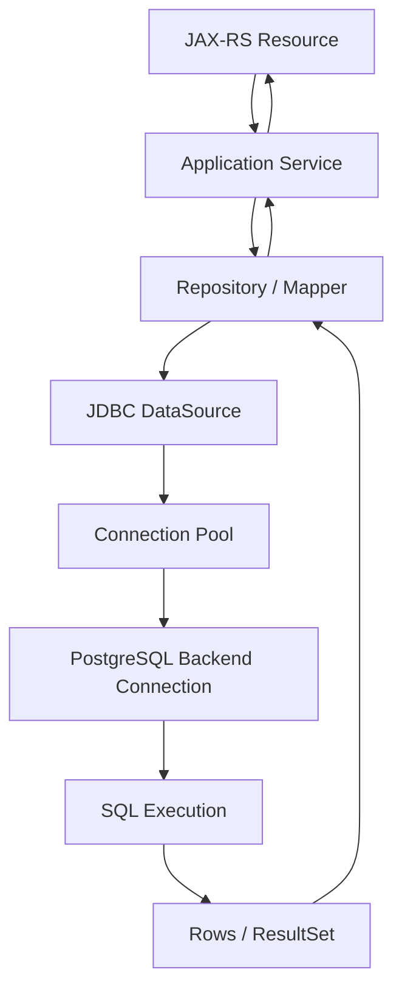
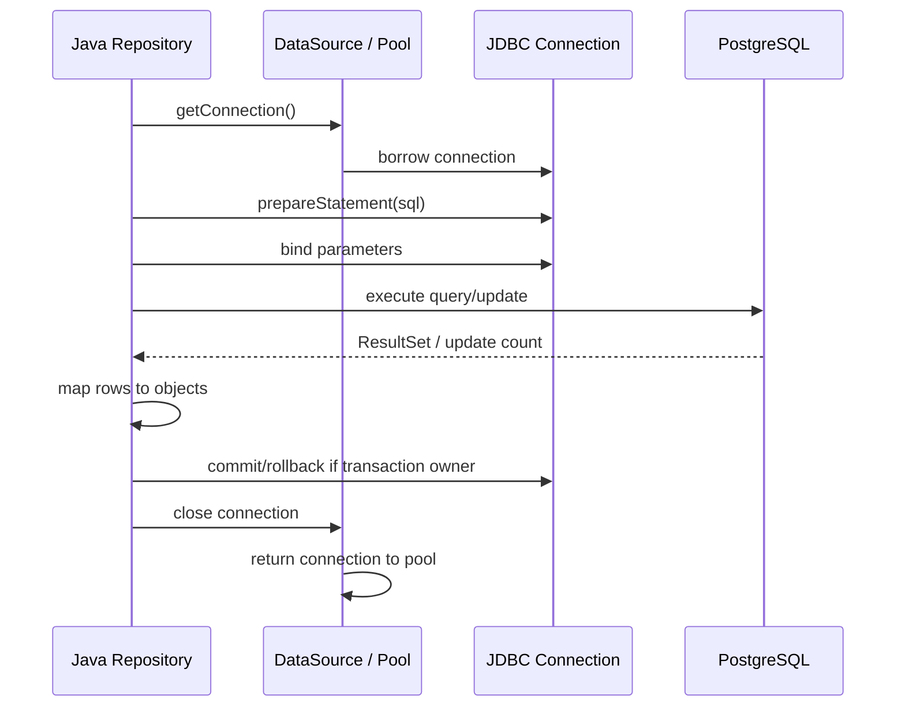
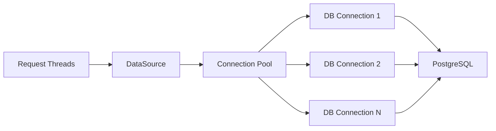

# Part 063 — PostgreSQL Fundamentals and JDBC Lifecycle

> Fokus part ini: memahami jalur dari resource method JAX-RS sampai query PostgreSQL dieksekusi, bagaimana JDBC bekerja, bagaimana connection lifecycle harus dikontrol, bagaimana transaction boundary dibentuk, bagaimana error database dipetakan, dan bagaimana senior engineer mereview perubahan data access untuk production system.

Di service enterprise, API sering terlihat sederhana:

```java
@GET
@Path("/quotes/{quoteId}")
public Response getQuote(@PathParam("quoteId") String quoteId) {
    QuoteView quote = quoteService.getQuote(quoteId);
    return Response.ok(quote).build();
}
```

Tetapi di bawahnya ada lifecycle panjang:

```text
HTTP request
  -> JAX-RS resource method
  -> service/domain logic
  -> repository/data access
  -> JDBC datasource
  -> connection pool
  -> PostgreSQL connection
  -> SQL parse/plan/execute
  -> result set streaming/materialization
  -> object mapping
  -> transaction commit/rollback
  -> HTTP response
```

Bug production sering terjadi bukan karena syntax SQL salah, tetapi karena lifecycle ini tidak dipahami:

- connection tidak dikembalikan ke pool
- transaction terlalu panjang
- autocommit tidak sesuai ekspektasi
- query lambat menahan request thread
- timeout tidak konsisten antara API, pool, JDBC, dan database
- exception database dipetakan menjadi HTTP error yang salah
- retry dilakukan pada operasi yang tidak aman
- query membaca data lintas tenant karena boundary tidak ditegakkan

Part ini membangun mental model tersebut dari nol.

---

## 1. Core Mental Model

PostgreSQL adalah database server.

JDBC adalah API Java standar untuk berbicara dengan database.

Connection pool adalah komponen runtime yang mengelola sekumpulan koneksi database agar service tidak membuka koneksi baru untuk setiap request.

Repository atau mapper adalah layer aplikasi yang menyembunyikan detail SQL/JDBC dari domain/service layer.



Invariant penting:

```text
The HTTP request lifecycle and the database transaction lifecycle are related, but they are not the same lifecycle.
```

Request bisa dibatalkan.

Transaction bisa tetap berjalan jika cancellation tidak dipropagasi.

Connection bisa tetap tertahan jika resource tidak ditutup.

Query bisa tetap aktif di PostgreSQL meskipun client HTTP sudah disconnect.

Senior engineer harus selalu berpikir dalam boundary:

```text
request boundary
transaction boundary
connection boundary
query boundary
lock boundary
tenant boundary
error boundary
```

---

## 2. PostgreSQL in a Java Backend

Dari sudut pandang Java service, PostgreSQL berperan sebagai:

1. **System of record**  
   Menyimpan state yang harus durable.

2. **Concurrency control engine**  
   Mengontrol isolation, lock, transaction, dan conflict.

3. **Query engine**  
   Menyaring, mengurutkan, mengagregasi, dan memproyeksikan data.

4. **Constraint engine**  
   Menjaga uniqueness, foreign key, check constraint, not-null, dan invariant data.

5. **Integration boundary**  
   Menjadi sumber event, outbox, audit, reporting, dan reconciliation.

Kesalahan umum engineer Java adalah melihat PostgreSQL hanya sebagai storage pasif.

Model yang lebih benar:

```text
PostgreSQL is an active consistency and concurrency component in the system.
```

Implikasinya:

- schema design mempengaruhi API behavior
- transaction design mempengaruhi latency
- index design mempengaruhi scalability
- lock behavior mempengaruhi availability
- constraint design mempengaruhi correctness
- migration design mempengaruhi deployment safety

---

## 3. JDBC: What It Is and What It Is Not

JDBC menyediakan API standar seperti:

```java
Connection
PreparedStatement
CallableStatement
ResultSet
DataSource
SQLException
```

JDBC bukan ORM.

JDBC tidak otomatis memahami domain object.

JDBC tidak otomatis mengatur transaction propagation lintas service method.

JDBC tidak otomatis mencegah SQL injection jika query dibuat dengan string concatenation.

JDBC tidak otomatis menutup connection jika code tidak menutupnya.

Mental model:

```text
JDBC is a low-level contract for acquiring a database connection,
sending SQL, receiving rows, and managing transaction state.
```

Jika codebase memakai MyBatis, JOOQ, Hibernate, atau custom repository, semua tetap akhirnya berbicara dengan database melalui driver/JDBC atau protokol database.

Untuk seri ini, JDBC dipahami sebagai fondasi agar behavior layer di atasnya tidak terlihat magis.

---

## 4. The JDBC Lifecycle

Lifecycle dasar JDBC:



Important nuance:

```java
connection.close();
```

Jika connection berasal dari pool, `close()` biasanya tidak menutup TCP connection ke PostgreSQL. Ia mengembalikan connection ke pool.

Karena itu, `close()` tetap wajib.

Tidak memanggil `close()` berarti connection tidak kembali ke pool.

Failure mode:

```text
connection leak -> pool exhaustion -> request queueing -> latency spike -> timeout -> retry storm
```

---

## 5. DataSource vs DriverManager

Untuk production service, gunakan `DataSource`, bukan `DriverManager` langsung.

Bad pattern:

```java
Connection connection = DriverManager.getConnection(url, user, password);
```

Masalah:

- membuka koneksi baru mahal
- tidak ada pooling terpusat
- credential management tersebar
- sulit mengatur timeout dan observability
- sulit diintegrasikan dengan container/runtime

Better pattern:

```java
public final class QuoteRepository {
    private final DataSource dataSource;

    public QuoteRepository(DataSource dataSource) {
        this.dataSource = dataSource;
    }

    public QuoteRow findById(String quoteId) throws SQLException {
        String sql = """
            select quote_id, status, customer_id, created_at
            from quote
            where quote_id = ?
            """;

        try (Connection connection = dataSource.getConnection();
             PreparedStatement statement = connection.prepareStatement(sql)) {

            statement.setString(1, quoteId);

            try (ResultSet rs = statement.executeQuery()) {
                if (!rs.next()) {
                    return null;
                }
                return mapQuote(rs);
            }
        }
    }
}
```

Key principles:

- `DataSource` is injected/configured centrally
- SQL parameters are bound, not concatenated
- `Connection`, `PreparedStatement`, and `ResultSet` are closed deterministically
- repository returns application-level object or explicit absence

---

## 6. PreparedStatement and Parameter Binding

Use `PreparedStatement` for values.

```java
String sql = "select * from quote where quote_id = ? and tenant_id = ?";
PreparedStatement ps = connection.prepareStatement(sql);
ps.setString(1, quoteId);
ps.setString(2, tenantId);
```

Avoid:

```java
String sql = "select * from quote where quote_id = '" + quoteId + "'";
```

Problems:

- SQL injection risk
- broken escaping
- poor plan reuse
- hard-to-debug type conversion
- unsafe dynamic filtering

Prepared statements do not remove all risk.

They protect values, not SQL structure.

This is safe:

```sql
where status = ?
```

This still needs governance:

```java
String sql = "order by " + sortColumn;
```

For dynamic SQL, whitelist structure:

```java
enum QuoteSortField {
    CREATED_AT("created_at"),
    STATUS("status"),
    UPDATED_AT("updated_at");

    final String column;

    QuoteSortField(String column) {
        this.column = column;
    }
}
```

Invariant:

```text
Values can be parameterized. SQL structure must be whitelisted or generated safely.
```

---

## 7. ResultSet Mapping

A `ResultSet` is cursor-like.

It is not a domain object.

It represents database rows returned by the driver.

```java
private QuoteRow mapQuote(ResultSet rs) throws SQLException {
    return new QuoteRow(
        rs.getString("quote_id"),
        rs.getString("status"),
        rs.getString("customer_id"),
        rs.getObject("created_at", OffsetDateTime.class)
    );
}
```

Mapping risks:

- wrong column name
- nullable column mapped to primitive
- timestamp/timezone mismatch
- numeric precision loss
- enum mismatch
- JSON column mapped inconsistently
- accidental dependency on `select *`

Prefer explicit column list:

```sql
select quote_id, status, customer_id, created_at
from quote
where quote_id = ?
```

Avoid relying on column order unless the mapping is generated and locked down.

For enterprise code review, ask:

```text
Is this query returning exactly the fields the API/domain needs?
Is the mapping explicit?
Are nullability and precision handled correctly?
Is tenant boundary included?
```

---

## 8. Transaction Boundary

A transaction groups database operations into one atomic unit.

Basic lifecycle:

```text
begin
  execute SQL A
  execute SQL B
  execute SQL C
commit
```

If failure occurs:

```text
begin
  execute SQL A
  execute SQL B fails
rollback
```

With JDBC:

```java
try (Connection connection = dataSource.getConnection()) {
    connection.setAutoCommit(false);

    try {
        updateQuote(connection, quoteId);
        insertAuditEvent(connection, quoteId);
        connection.commit();
    } catch (Exception e) {
        connection.rollback();
        throw e;
    }
}
```

Important:

- the transaction belongs to the connection
- operations inside one transaction must use the same connection
- closing a connection with uncommitted transaction can rollback or return dirty state depending on pool handling
- framework-managed transaction can hide this lifecycle

In service code, transaction boundary should usually sit around application use case, not around every individual repository method.

Bad shape:

```text
resource method
  -> repository method A opens/commits transaction
  -> repository method B opens/commits transaction
  -> event publish fails
```

Better shape:

```text
application service transaction boundary
  -> repository method A
  -> repository method B
  -> outbox insert
commit
```

---

## 9. Autocommit

JDBC connections default to autocommit true unless configured otherwise.

Autocommit means each statement is its own transaction.

```text
insert row A -> committed immediately
insert row B -> committed immediately
```

This may be fine for simple reads or single-statement writes.

It is dangerous for multi-step state change.

Example failure:

```text
1. update quote status to APPROVED       committed
2. insert quote approval audit record    fails
3. publish event                         skipped
```

System now has state change without corresponding audit/outbox record.

Senior review question:

```text
Does this operation require multiple writes to succeed or fail together?
```

If yes, define explicit transaction boundary.

---

## 10. Connection Pool Mental Model

A connection pool limits and reuses database connections.



Pool sizing is not arbitrary.

Too small:

```text
request waits for connection -> latency spike
```

Too large:

```text
too many DB sessions -> PostgreSQL overloaded -> context switching -> global slowdown
```

Important pool settings:

- maximum pool size
- minimum idle
- connection acquisition timeout
- idle timeout
- max lifetime
- validation query or connection test
- leak detection threshold
- transaction isolation default
- autocommit default

Connection pool is a backpressure boundary.

When the pool is exhausted, the service should fail predictably instead of queueing forever.

---

## 11. Request Thread vs Database Connection

Do not confuse request concurrency with database concurrency.

Example:

```text
HTTP server max threads: 200
DB pool max size: 20
```

This means at most 20 request paths can hold DB connections concurrently.

The other 180 may be:

- doing non-DB work
- waiting for pool
- blocked on downstream services
- waiting in server queue

Failure mode:

```text
slow query holds 20 connections
new requests wait for connections
request threads pile up
API latency grows
clients retry
traffic doubles
service collapses
```

Mitigation:

- query timeout
- transaction timeout
- pool acquisition timeout
- bounded request processing
- bulkhead for expensive operation
- pagination limits
- cancellation propagation
- DB monitoring

---

## 12. SQL Execution Path in PostgreSQL

A simplified PostgreSQL execution path:

```text
client sends SQL
  -> parse
  -> rewrite
  -> plan
  -> execute
  -> return rows/update count
```

For prepared statements:

```text
prepare statement
  -> bind parameters
  -> execute
```

The database chooses a plan based on:

- table statistics
- indexes
- estimated selectivity
- join strategy
- parameter values
- configuration

Java code cannot be reviewed without considering database plan.

A query that looks simple can be catastrophic:

```sql
select *
from quote
where lower(customer_name) like lower('%abc%')
order by created_at desc
limit 100;
```

Possible issues:

- function prevents simple index usage
- leading wildcard prevents normal B-tree usage
- sort may spill to disk
- no tenant predicate
- `select *` transfers too much data
- pagination may be unstable

---

## 13. Query Timeout and Statement Timeout

Timeouts exist at multiple layers:

```text
HTTP client timeout
API gateway timeout
JAX-RS/server timeout
application future timeout
connection acquisition timeout
JDBC query timeout
PostgreSQL statement_timeout
transaction timeout
lock_timeout
```

They must be coherent.

If API gateway times out at 30 seconds but PostgreSQL query can run for 10 minutes, the request may appear failed to the client while the database keeps working.

JDBC example:

```java
statement.setQueryTimeout(5); // seconds
```

PostgreSQL-level controls may include:

```sql
set statement_timeout = '5s';
set lock_timeout = '1s';
```

In production, prefer centralized timeout strategy over ad hoc per-query magic numbers.

Review questions:

```text
What is the maximum time this query can run?
What happens if it waits on a lock?
What happens if HTTP client disconnects?
Does cancellation reach PostgreSQL?
What error does caller receive?
```

---

## 14. SQLException and SQLState

Database errors surface through `SQLException` or framework-specific wrappers.

Important fields:

```java
catch (SQLException e) {
    String sqlState = e.getSQLState();
    int vendorCode = e.getErrorCode();
    String message = e.getMessage();
}
```

Error taxonomy matters.

Examples:

```text
unique constraint violation
foreign key violation
not-null violation
deadlock detected
serialization failure
connection failure
statement timeout
permission denied
syntax error
```

Not all DB errors are equal.

Some map to client errors:

```text
unique violation for duplicate idempotency key -> 409 Conflict or idempotent replay result
foreign key missing input reference -> 400/404 depending API contract
```

Some are server/infrastructure errors:

```text
connection refused -> 503
statement timeout -> 504/503 depending boundary
syntax error from deployed code -> 500
```

Some may be retryable:

```text
deadlock detected
serialization failure
transient connection issue
```

But retry must be safe.

Never blindly retry a non-idempotent operation unless the operation has an idempotency guard.

---

## 15. Repository Boundary

A repository should expose application meaning, not raw JDBC mechanics.

Good shape:

```java
interface QuoteRepository {
    Optional<QuoteRecord> findByTenantAndQuoteId(String tenantId, String quoteId);
    void saveQuoteDecision(QuoteDecision decision);
}
```

Bad shape:

```java
interface QuoteRepository {
    ResultSet execute(String sql);
    Connection getConnection();
}
```

Repository should hide:

- SQL text
- table layout details
- JDBC resource lifecycle
- row mapping
- error translation

Repository should not hide:

- operation cost
- transaction expectation
- locking behavior
- tenant boundary
- consistency guarantees

Senior-level repository contract includes semantic hints:

```text
find...       read-only
insert...     creates new row
update...     modifies existing row
lock...       acquires lock
exists...     cheap existence check if indexed
search...     potentially expensive query path
```

---

## 16. JAX-RS Integration Boundary

A JAX-RS resource method should not usually manage raw JDBC directly.

Problematic:

```java
@POST
@Path("/quotes/{id}/approve")
public Response approve(@PathParam("id") String id) throws SQLException {
    try (Connection c = dataSource.getConnection()) {
        // SQL here
    }
    return Response.noContent().build();
}
```

Why problematic:

- transport layer now owns persistence details
- difficult to test use case logic
- transaction boundary becomes ad hoc
- error mapping becomes inconsistent
- authorization/tenant logic may be bypassed

Better boundary:

```java
@POST
@Path("/quotes/{id}/approve")
public Response approve(@PathParam("id") String id,
                        ApproveQuoteRequest request,
                        @Context SecurityContext securityContext) {
    ApproveQuoteCommand command = commandMapper.toCommand(id, request, securityContext);
    quoteApplicationService.approve(command);
    return Response.noContent().build();
}
```

Then application service owns use case and transaction boundary.

---

## 17. Read-Only vs Write Transaction

Read-only operation:

```text
validate identity
resolve tenant
read rows
map response
```

Write operation:

```text
validate identity
resolve tenant
validate command
load current state
check authorization
apply domain transition
persist state
insert audit/outbox
commit
return response
```

Read-only can still need transaction boundary if consistency matters.

Example:

```text
read quote header
read quote lines
read quote discounts
```

Without consistency control, response can combine data from different committed states.

For many APIs this is acceptable.

For pricing/order correctness, it may not be.

Review question:

```text
Does this endpoint require a consistent snapshot across multiple queries?
```

---

## 18. Tenant Boundary in SQL

For enterprise systems, every data access path must respect tenant boundary if the system is multi-tenant.

Bad:

```sql
select quote_id, status
from quote
where quote_id = ?;
```

Better:

```sql
select quote_id, status
from quote
where tenant_id = ?
  and quote_id = ?;
```

But tenant isolation is not only a predicate.

It may involve:

- schema per tenant
- database per tenant
- tenant column
- row-level security
- catalog version per tenant
- tenant-aware permission
- tenant-specific config

Internal verification matters.

Do not assume the tenancy model.

Verify it from codebase, database schema, deployment config, and architecture docs.

---

## 19. Data Correctness Invariants

Database code should protect invariants.

Examples relevant to quote/order-style systems:

```text
quote id is unique within tenant
quote line belongs to quote
quote status transition is valid
approved quote cannot be modified without revision
order must reference committed quote version
pricing effective date must match catalog version
currency amount must not lose precision
outbox event must correspond to committed state change
```

Some invariants belong in domain code.

Some belong in database constraints.

Some belong in both.

Good production design uses defense in depth:

```text
domain validation prevents bad commands early
DB constraint prevents impossible persisted state
transaction boundary ensures atomicity
outbox/audit preserves traceability
```

---

## 20. Common JDBC Anti-Patterns

### 20.1 Returning ResultSet outside repository

Bad:

```java
return statement.executeQuery();
```

The caller now depends on an open connection and statement.

### 20.2 Swallowing SQLException

Bad:

```java
catch (SQLException e) {
    return null;
}
```

This hides infrastructure failure as absence.

### 20.3 Logging SQL with sensitive values

Risk:

```text
PII, token, tenant id, customer id, pricing details, commercial terms
```

### 20.4 String-concatenated dynamic SQL

Risk:

```text
SQL injection, syntax bugs, unbounded query cost
```

### 20.5 No query limit

Bad:

```sql
select * from quote where tenant_id = ?;
```

### 20.6 Transaction across remote calls

Bad:

```text
begin transaction
  update database
  call downstream HTTP service
  wait 20 seconds
commit
```

Locks and connections are held while waiting on network.

### 20.7 Hidden autocommit assumption

Code works in local environment, fails under framework-managed transaction.

---

## 21. Failure Modes

| Failure mode | Symptom | Likely cause | Detection |
|---|---|---|---|
| Connection leak | Pool exhausted | Missing close, stuck transaction | Pool metrics, leak detection |
| Slow query | High API latency | Missing index, bad plan, large scan | Slow query log, `pg_stat_statements` |
| Lock wait | Request hangs | Competing transaction | `pg_locks`, wait events |
| Deadlock | Transaction aborted | Inconsistent lock order | PostgreSQL deadlock logs |
| Serialization failure | Retryable DB error | Concurrent transaction conflict | SQLState, app logs |
| Constraint violation | 400/409/500 depending mapping | Invalid data or race | SQLState, constraint name |
| Pool exhaustion | Many request timeouts | Too many slow holders | Pool active/wait metrics |
| Statement timeout | Query cancelled | Timeout exceeded | DB/app logs |
| Tenant data leak | Wrong data returned | Missing tenant predicate | Security tests, query review |
| Precision loss | Wrong monetary value | double/float or wrong scale | Tests, DB type review |

---

## 22. Debugging Workflow

When an endpoint is slow or failing around database access:

1. Identify endpoint and correlation ID.
2. Check HTTP latency and status code.
3. Check application logs for repository/service boundary.
4. Check pool metrics:
   - active connections
   - idle connections
   - pending acquire
   - acquisition timeout
5. Check database metrics:
   - active sessions
   - wait events
   - locks
   - slow queries
   - CPU/I/O
6. Find SQL text or normalized query fingerprint.
7. Check execution plan with realistic parameters.
8. Check whether transaction is long-lived.
9. Check whether retry amplified the issue.
10. Check whether recent deployment/migration changed schema/index/query.

Useful questions:

```text
Is the service waiting for a connection, waiting for a query, or waiting for a lock?
Is the query slow always, or only under certain tenant/data volume?
Did a recent migration change plan statistics or index availability?
Does the endpoint load more rows than the response needs?
Is the operation holding transaction while doing non-DB work?
```

---

## 23. Observability Signals

Minimum useful signals:

### Application/JDBC/pool

- connection pool active/idle/pending
- connection acquisition latency
- query execution latency by operation name
- transaction duration
- repository error count by error category
- timeout count
- retry count

### PostgreSQL

- active sessions
- slow query log
- `pg_stat_statements`
- lock waits
- deadlocks
- transaction age
- table/index bloat
- cache hit ratio
- disk I/O
- replication lag if applicable

### Logs

Log operation names, not raw SQL with sensitive values.

Good:

```json
{
  "event": "database.query.failed",
  "operation": "QuoteRepository.findByTenantAndQuoteId",
  "tenantHash": "...",
  "sqlState": "23505",
  "durationMs": 43,
  "traceId": "..."
}
```

Avoid:

```text
select * from customer where email = 'real.person@example.com'
```

---

## 24. PR Review Checklist

For any data access change, review:

### SQL correctness

- Is SQL parameterized?
- Is dynamic SQL structure whitelisted?
- Are selected columns explicit?
- Are nullability and type mapping correct?
- Are money/date/time fields handled with correct precision?

### Tenant and security

- Is tenant boundary enforced?
- Is authorization done before sensitive data access?
- Are logs redacted?
- Does query expose cross-tenant inference risk?

### Transaction

- Where is transaction boundary?
- Is autocommit behavior intentional?
- Are multiple writes atomic if needed?
- Is transaction held during remote call or slow computation?
- Is outbox/audit written in same transaction when required?

### Performance

- Is query indexed?
- Is result bounded?
- Is pagination stable?
- Is query plan understood for expected data volume?
- Could this create N+1 query pattern?

### Resilience

- Are timeouts configured?
- Are retries safe and bounded?
- What happens on deadlock/serialization failure?
- What happens when pool is exhausted?

### Observability

- Is operation name traceable?
- Are errors categorized?
- Is latency measurable?
- Can we correlate API request to DB query?

---

## 25. Internal Verification Checklist

Verify in internal CSG codebase and platform docs:

### JDBC and database access stack

- Is raw JDBC used directly?
- Is MyBatis used?
- Is JOOQ/Hibernate/custom framework used?
- What is the repository/mapper convention?
- Where is `DataSource` configured?

### PostgreSQL connection

- Which JDBC driver version is used?
- Which connection pool is used?
- What are pool settings per environment?
- Is pool config tenant-specific or service-wide?
- Are credentials injected through secret manager/Kubernetes secret?

### Transaction management

- Is transaction management manual, framework-managed, or container-managed?
- Where are transaction boundaries defined?
- Are read-only transactions used?
- What isolation level is default?
- Are retries performed around transaction failures?

### SQL and schema

- Where are SQL statements located?
- Are mapper XML files used?
- Are migrations via Liquibase/Flyway/custom scripts?
- Are constraints named consistently?
- Are tenant predicates enforced by convention, RLS, schema, or separate database?

### Observability

- Are query latencies measured?
- Are pool metrics exported?
- Is `pg_stat_statements` enabled?
- Are slow query logs available to engineers?
- Can trace ID be linked to DB operation?

### Release and operation

- How are DB credentials rotated?
- What is the rollback procedure for DB-related deployment?
- Who owns schema changes?
- Is there a DB review process?
- Are production DB access and query inspection controlled?

---

## 26. Practical Exercise

Given endpoint:

```text
GET /quotes?customerName=abc&sort=createdAt&page=1&size=100
```

Design the repository query and review:

1. Is tenant included?
2. Is search indexed?
3. Is sorting whitelisted?
4. Is pagination stable?
5. Are selected columns explicit?
6. What timeout applies?
7. What happens if query plan becomes sequential scan?
8. How will slow query be detected?
9. What error is returned if DB is unavailable?
10. Is the operation safe to retry?

---

## 27. Senior Engineer Heuristics

Use these heuristics during PR/design review:

```text
No unbounded query in request path.
No transaction across remote calls.
No SQL string concatenation from user input.
No data access without tenant boundary in multi-tenant service.
No DB error swallowed as null.
No new query without thinking about expected cardinality.
No write path without atomicity and idempotency reasoning.
No production DB dependency without timeout and observability.
```

A senior engineer does not need to memorize every PostgreSQL feature.

But they must understand how a Java request becomes database work, how that work consumes shared resources, and how it fails under production pressure.

---

## 28. Summary

JDBC is the low-level lifecycle that connects Java service code to PostgreSQL.

PostgreSQL is not just storage. It is a consistency, concurrency, and query execution engine.

The core production boundaries are:

```text
connection lifecycle
transaction lifecycle
query lifecycle
lock lifecycle
timeout lifecycle
error lifecycle
tenant lifecycle
```

If these boundaries are explicit, database-backed APIs can be reliable.

If they are implicit, the service will eventually fail through leaks, slow queries, lock waits, retries, or incorrect state.

The next part moves from JDBC fundamentals into PostgreSQL data patterns: JSONB, full-text search, key-value style access, time-series style data, and OLAP-oriented query shapes.
