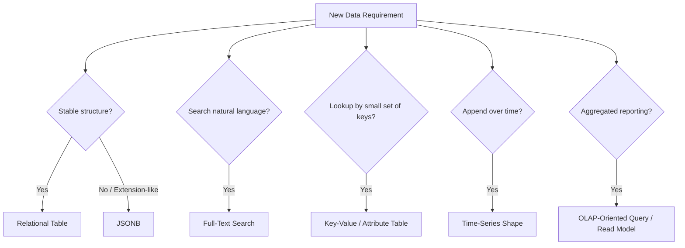

# Part 064 — PostgreSQL Data Patterns: JSONB, FTS, KV, Time-Series, OLAP

> Fokus part ini: memahami pola data PostgreSQL yang sering muncul di service enterprise: relational tables, JSON/JSONB, full-text search, key-value pattern, time-series shape, dan OLAP-oriented query. Tujuannya bukan menjadi DBA, tetapi mampu memilih model data yang benar, membaca trade-off, mengantisipasi failure mode, dan mereview PR/schema/query dengan standar senior engineer.

PostgreSQL bukan hanya database relational klasik.

Ia bisa menyimpan row relational, document-like JSONB, searchable text vector, key-value metadata, event/time-series-like data, dan query agregasi untuk reporting.

Kekuatan ini berguna.

Tetapi juga berbahaya.

Jika semua masalah dianggap cocok untuk JSONB, schema menjadi sulit dijaga.

Jika semua query analitik dijalankan di request path, API menjadi lambat.

Jika full-text search dipakai tanpa index dan ranking strategy, search endpoint akan collapse di data besar.

Jika time-series data disimpan tanpa partitioning/retention strategy, tabel akan tumbuh tanpa batas.

Senior engineer harus bisa memilih pola berdasarkan lifecycle dan query shape, bukan preferensi pribadi.

---

## 1. Core Mental Model

Data modeling harus dimulai dari pertanyaan:

```text
What questions will the system ask from this data, at what frequency, under what consistency requirement, and at what scale?
```

Bukan:

```text
Can PostgreSQL store this shape?
```

PostgreSQL hampir selalu bisa menyimpan data tersebut.

Pertanyaan sebenarnya:

```text
Can we query, index, migrate, validate, secure, and operate it safely?
```

Data pattern harus dinilai dari:

- write frequency
- read frequency
- query shape
- cardinality
- tenant boundary
- consistency requirement
- indexing strategy
- schema evolution
- migration risk
- archival/retention
- observability
- operational ownership

---

## 2. Pattern Selection Map



A real system can combine patterns.

Example quote/order system:

```text
quote header          -> relational table
quote lines           -> relational table
product config blob   -> JSONB if structure varies by product family
searchable customer   -> full-text search or external search
pricing attributes    -> key-value or typed relational extension
price history         -> time-series-like table
dashboard metrics     -> OLAP/read model/materialized view
```

The danger is accidental pattern drift.

A column starts as flexible JSONB and becomes core business state without constraints, indexes, or migration discipline.

---

## 3. Relational Modeling First

Default to relational modeling when structure is known and important.

Relational strengths:

- explicit schema
- type enforcement
- constraints
- foreign keys
- indexing
- query optimization
- stable migration
- clear ownership
- easier review

Example:

```sql
create table quote (
    tenant_id      text        not null,
    quote_id       text        not null,
    customer_id    text        not null,
    status         text        not null,
    currency       char(3)     not null,
    total_amount   numeric(19, 4) not null,
    created_at     timestamptz not null,
    updated_at     timestamptz not null,
    primary key (tenant_id, quote_id)
);
```

This makes invariants visible:

```text
tenant_id required
quote_id unique within tenant
currency required
total_amount precise
created_at timezone-aware
```

Review heuristic:

```text
If a field controls authorization, pricing, workflow state, lifecycle, reporting, or compatibility, it probably deserves explicit schema.
```

---

## 4. PostgreSQL JSON vs JSONB

PostgreSQL supports `json` and `jsonb`.

High-level distinction:

```text
json  -> stores textual JSON representation
jsonb -> stores decomposed binary representation optimized for processing/indexing
```

For most application query use cases, `jsonb` is preferred.

But JSONB is not a license to avoid modeling.

Good JSONB use cases:

- product-specific configuration with varying shape
- external payload snapshot
- optional extension fields
- rarely queried metadata
- compatibility buffer during migration
- audit snapshot where exact domain columns are not needed

Risky JSONB use cases:

- core state machine status
- tenant boundary
- authorization data
- pricing amount/currency
- frequently filtered fields without indexes
- fields requiring relational constraints
- data needing frequent partial updates

---

## 5. JSONB Example

Example table:

```sql
create table quote_product_configuration (
    tenant_id      text        not null,
    quote_id       text        not null,
    line_id        text        not null,
    product_code   text        not null,
    config_payload jsonb       not null,
    created_at     timestamptz not null,
    primary key (tenant_id, quote_id, line_id)
);
```

Example query:

```sql
select quote_id, line_id, config_payload
from quote_product_configuration
where tenant_id = ?
  and product_code = ?
  and config_payload @> ?::jsonb;
```

Potential index:

```sql
create index idx_qpc_config_gin
on quote_product_configuration
using gin (config_payload);
```

But index choice depends on operator and query shape.

Common JSONB operators:

```sql
config_payload -> 'key'
config_payload ->> 'key'
config_payload @> '{"feature":"value"}'
config_payload ? 'key'
```

Review question:

```text
Are we querying JSONB because the data is genuinely flexible, or because we avoided schema design?
```

---

## 6. JSONB Failure Modes

| Failure mode | Symptom | Cause | Mitigation |
|---|---|---|---|
| Hidden schema | Fields appear only in code | No documented JSON shape | JSON Schema, docs, validation |
| Slow filter | Query scans large table | Missing/incorrect index | GIN/expression index |
| Type ambiguity | String vs number mismatch | Loose payload producer | Normalize/validate payload |
| Compatibility break | Old rows cannot be parsed | Shape changed silently | Version payload shape |
| Constraint bypass | Invalid business state persisted | Core field hidden in JSONB | Promote to typed column |
| Large row bloat | Updates are expensive | Huge mutable JSONB | Split table or external storage |
| Tenant leak | Filter misses tenant column | Query focuses only JSON field | Always include tenant boundary |

JSONB requires governance:

```text
Document the shape.
Validate on write.
Index intentionally.
Version when needed.
Promote core fields to columns.
```

---

## 7. Expression Indexes for JSONB

If you frequently filter by one JSONB field, expression index may be better than generic GIN.

Example:

```sql
create index idx_qpc_region
on quote_product_configuration ((config_payload ->> 'region'));
```

Query:

```sql
select quote_id, line_id
from quote_product_configuration
where tenant_id = ?
  and config_payload ->> 'region' = ?;
```

But if tenant is always part of the query, consider composite indexing strategy:

```sql
create index idx_qpc_tenant_region
on quote_product_configuration (tenant_id, (config_payload ->> 'region'));
```

Review question:

```text
Does the index match the actual predicate order and selectivity?
```

Do not add indexes blindly.

Every index adds write overhead and migration risk.

---

## 8. Full-Text Search Mental Model

Full-text search is different from `LIKE`.

`LIKE` searches text pattern.

Full-text search tokenizes, normalizes, indexes, and ranks text.

PostgreSQL concepts:

```text
tsvector   -> searchable document representation
tsquery    -> search query representation
GIN index  -> common index for tsvector
ranking    -> relevance score
language config -> stemming/normalization behavior
```

Example:

```sql
select quote_id, customer_name
from quote_search
where tenant_id = ?
  and search_vector @@ plainto_tsquery('english', ?)
order by ts_rank(search_vector, plainto_tsquery('english', ?)) desc
limit ?;
```

Possible table:

```sql
create table quote_search (
    tenant_id     text not null,
    quote_id      text not null,
    customer_name text not null,
    search_vector tsvector not null,
    primary key (tenant_id, quote_id)
);

create index idx_quote_search_vector
on quote_search
using gin (search_vector);
```

---

## 9. Full-Text Search vs External Search

PostgreSQL FTS is useful when:

- search scope is moderate
- data already lives in PostgreSQL
- transactional consistency is important
- search requirements are simple to medium
- operational simplicity matters

External search may be better when:

- relevance ranking is complex
- fuzzy matching is advanced
- autocomplete/highlighting is required
- scale is large
- search latency must be isolated from primary DB
- indexing pipeline is already available

Review question:

```text
Is this search endpoint a database query, a search product, or a reporting product?
```

Do not overload primary PostgreSQL if the search use case behaves like a search engine.

---

## 10. Full-Text Search Failure Modes

| Failure mode | Symptom | Cause | Mitigation |
|---|---|---|---|
| Sequential scan | Search endpoint slow | Missing GIN index | Add appropriate index |
| Poor relevance | Wrong results first | Bad ranking/config | Tune ranking and document vector |
| Tenant leak | Search returns other tenant data | Missing tenant predicate | Composite filtering discipline |
| Stale search document | Search misses updates | Derived vector not updated | Trigger/job/app update strategy |
| Language mismatch | Tokenization poor | Wrong text search config | Choose per language/domain |
| Unbounded query | Search overload | No limit/rate limit | Max limit and timeout |

Search endpoint review must include:

```text
index
limit
tenant predicate
ranking strategy
update strategy
timeout
observability
```

---

## 11. Key-Value Pattern

Key-value pattern appears when entity has variable attributes.

Example:

```sql
create table quote_attribute (
    tenant_id text not null,
    quote_id  text not null,
    attr_key  text not null,
    attr_value text not null,
    primary key (tenant_id, quote_id, attr_key)
);
```

Useful for:

- sparse attributes
- extension metadata
- product-specific optional fields
- integration-specific reference values

Problems:

- weak typing
- harder constraints
- complex querying
- hard indexing across many keys
- values become strings without precision
- domain meaning scattered

Alternative: typed attribute table.

```sql
create table quote_attribute (
    tenant_id text not null,
    quote_id  text not null,
    attr_key  text not null,
    value_text text,
    value_number numeric(19,4),
    value_bool boolean,
    value_time timestamptz,
    primary key (tenant_id, quote_id, attr_key)
);
```

But this still needs governance.

---

## 12. Key-Value vs JSONB

Choose key-value when:

- you need per-key indexing
- you need query across entities by attribute key
- attribute set is sparse
- attributes are simple scalar values
- you need row-level ownership/audit per attribute

Choose JSONB when:

- attributes form a nested document
- payload shape belongs together
- you usually load the whole document
- you need containment query
- you want versioned payload snapshots

Avoid both when field is core business state.

Core field should be explicit relational column.

Review heuristic:

```text
If product owner asks for filter/sort/reporting on this field, it probably should not remain hidden in opaque JSON/string attribute forever.
```

---

## 13. Time-Series Shape in PostgreSQL

Time-series-like data is append-heavy data with timestamp dimension.

Examples:

- quote status history
- pricing calculation history
- audit events
- integration attempt records
- job execution records
- metric snapshots
- reconciliation results

Example:

```sql
create table quote_status_history (
    tenant_id   text not null,
    quote_id    text not null,
    status      text not null,
    changed_at  timestamptz not null,
    changed_by  text not null,
    reason_code text,
    primary key (tenant_id, quote_id, changed_at)
);
```

Common query shapes:

```text
latest status history for quote
all changes in validity window
count changes per day
find failed integration attempts in last hour
archive records older than retention window
```

Time-series risk:

```text
append-only tables grow forever unless retention, partitioning, and archival are designed.
```

---

## 14. Time-Series Indexing and Partitioning

Common indexes:

```sql
create index idx_qsh_tenant_quote_changed_at
on quote_status_history (tenant_id, quote_id, changed_at desc);

create index idx_qsh_tenant_changed_at
on quote_status_history (tenant_id, changed_at desc);
```

For large tables, consider partitioning by time and/or tenant strategy.

Example conceptual partition:

```sql
create table integration_attempt (
    tenant_id text not null,
    attempt_id text not null,
    created_at timestamptz not null,
    status text not null,
    payload jsonb,
    primary key (tenant_id, attempt_id, created_at)
) partition by range (created_at);
```

Partitioning is not free.

It adds:

- migration complexity
- maintenance tasks
- query planning considerations
- partition creation automation
- backup/restore complexity

Use it when data volume and retention justify it.

---

## 15. Effective Date and Validity Window Pattern

In CPQ/order-style systems, time is not only audit.

Business data can have validity windows:

```text
catalog version effective from date
pricing rule effective from date
discount valid until date
contract term start/end
quote expiration date
```

Example:

```sql
create table price_rule (
    tenant_id      text not null,
    rule_id        text not null,
    product_code   text not null,
    currency       char(3) not null,
    amount         numeric(19,4) not null,
    valid_from     timestamptz not null,
    valid_to       timestamptz,
    primary key (tenant_id, rule_id)
);
```

Query:

```sql
select rule_id, amount
from price_rule
where tenant_id = ?
  and product_code = ?
  and currency = ?
  and valid_from <= ?
  and (valid_to is null or valid_to > ?)
order by valid_from desc
limit 1;
```

Key concerns:

- timezone policy
- inclusive/exclusive boundary
- overlapping validity windows
- future-dated rules
- catalog version alignment
- quote re-price vs preserve price decision

This pattern connects directly to Part 051.

---

## 16. OLAP-Oriented Query Pattern

OLAP-oriented queries are analytical queries.

They answer questions like:

```text
How many quotes were created per day?
What is total order value by region?
Which product families have highest discount rate?
How many orders are stuck in fulfillment state?
What is conversion rate from quote to order?
```

These queries often involve:

- large scans
- grouping
- joining many tables
- sorting
- window functions
- aggregation
- historical range

They are different from OLTP request-path queries.

OLTP:

```text
small, indexed, low-latency, high concurrency, user-facing
```

OLAP:

```text
large, aggregate-heavy, latency-tolerant, reporting-facing
```

Do not accidentally put OLAP queries in latency-sensitive JAX-RS endpoints.

---

## 17. Reporting Read Models and Materialized Views

If query is expensive but needed often, consider read model.

Options:

- materialized view
- summary table
- denormalized reporting table
- event-driven projection
- CDC-fed warehouse
- external analytics platform

PostgreSQL materialized view example:

```sql
create materialized view quote_daily_summary as
select tenant_id,
       date_trunc('day', created_at) as day,
       status,
       count(*) as quote_count
from quote
group by tenant_id, date_trunc('day', created_at), status;
```

But materialized views require refresh strategy.

Questions:

```text
How stale can data be?
Who refreshes it?
Can refresh block reads?
Can refresh run concurrently?
How is failure detected?
How does tenant isolation apply?
```

---

## 18. OLAP Failure Modes

| Failure mode | Symptom | Cause | Mitigation |
|---|---|---|---|
| API timeout | Report endpoint slow | Large aggregate in request path | Async job/read model |
| DB CPU spike | Production DB degraded | Reporting query on OLTP database | Replica/warehouse/read model |
| Lock contention | Writes blocked | Bad refresh/migration/query | Concurrent refresh, scheduling |
| Memory/disk spill | Query slow | Sort/hash aggregate too large | Indexing, query rewrite, work_mem review |
| Inconsistent report | Counts mismatch | Stale projection | Freshness metadata/reconciliation |
| Tenant data leak | Aggregate crosses tenant | Missing tenant grouping/filter | Tenant-scoped report checks |

Senior rule:

```text
Do not let reporting convenience compromise OLTP stability.
```

---

## 19. Choosing Indexes by Query Shape

Indexes must match query patterns.

Example query:

```sql
select quote_id, status, created_at
from quote
where tenant_id = ?
  and status = ?
order by created_at desc
limit 50;
```

Possible index:

```sql
create index idx_quote_tenant_status_created_at
on quote (tenant_id, status, created_at desc);
```

But this depends on selectivity and workload.

Questions:

```text
Is tenant_id always in predicate?
Is status selective enough?
Is order by covered?
Is limit used?
How many writes will this index slow down?
Will this index be useful across tenants?
```

For JSONB, full-text, time-series, and OLAP patterns, index design differs.

There is no universal index.

---

## 20. Query Contract for JAX-RS APIs

Every endpoint that queries PostgreSQL should have an implicit or explicit query contract:

```text
max rows returned
allowed filters
allowed sorts
default sort
pagination strategy
tenant boundary
index expectation
timeout
consistency expectation
error behavior
```

Example:

```text
GET /quotes?status=APPROVED&sort=-createdAt&limit=50
```

Contract:

```text
tenant is resolved from identity/context
status filter must be exact enum
sort field whitelist: createdAt, updatedAt, status
max limit: 100
default limit: 50
order must be stable with tie-breaker quoteId
query must use tenant/status/created_at index
statement timeout: platform standard
```

Without this contract, query endpoints drift into unbounded search APIs.

---

## 21. Stable Pagination and Sorting

Unstable pagination causes duplicate/missing items between pages.

Bad:

```sql
order by created_at desc
limit 50 offset 50;
```

If multiple rows share same `created_at`, ordering is not deterministic.

Better:

```sql
order by created_at desc, quote_id desc
```

For high-volume tables, cursor pagination is often better than offset.

Example cursor condition:

```sql
where tenant_id = ?
  and (created_at, quote_id) < (?, ?)
order by created_at desc, quote_id desc
limit ?;
```

Review question:

```text
Is pagination stable while data is being inserted or updated?
```

---

## 22. Data Evolution and Migration Risk

Changing data pattern has migration cost.

Examples:

### JSONB field becomes column

```text
old: config_payload ->> 'region'
new: region text column
```

Migration path:

1. add nullable column
2. backfill from JSONB
3. dual-write or generated column if needed
4. read from new column
5. validate completeness
6. enforce not-null/index if required
7. remove old dependency carefully

### Attribute becomes typed domain field

Same expand-contract principle applies.

### OLTP table feeds reporting model

Need backfill, freshness, reconciliation, ownership.

Production data modeling is never only `create table`.

It is lifecycle management.

---

## 23. Data Pattern Decision Matrix

| Requirement | Prefer | Avoid |
|---|---|---|
| Core workflow state | Relational column | JSONB/string attribute |
| Variable product config | JSONB with schema/version | Many nullable columns without governance |
| Search by natural language | FTS or external search | `%like%` on large table |
| Sparse scalar attributes | Key-value/typed attribute table | Unindexed JSON for frequent filters |
| Audit/status history | Time-series-like append table | Overwriting only current state |
| Dashboard aggregate | Read model/materialized view | Heavy aggregate in request path |
| Pricing amount | `numeric`/`BigDecimal` | float/double/text |
| Tenant boundary | Explicit model/enforcement | Hidden convention only |
| Frequently sorted list | Indexed relational fields | Sort on computed/unindexed expression |

---

## 24. JAX-RS Integration Examples

### 24.1 Search endpoint backed by relational/indexed query

```java
@GET
@Path("/quotes")
public Response searchQuotes(@BeanParam QuoteSearchParams params,
                             @Context SecurityContext securityContext) {
    TenantId tenantId = tenantResolver.resolve(securityContext);
    QuoteSearchQuery query = queryMapper.toQuery(tenantId, params);
    Page<QuoteSummary> result = quoteSearchService.search(query);
    return Response.ok(responseMapper.toResponse(result)).build();
}
```

Important:

- resource does not build SQL
- sort/filter are mapped through whitelist
- tenant comes from trusted context
- service/repository own query contract
- response includes pagination metadata

### 24.2 Product config endpoint backed by JSONB

```text
GET /quotes/{quoteId}/lines/{lineId}/configuration
```

Questions:

```text
Is JSONB payload returned directly or mapped to DTO?
Is shape versioned?
Is sensitive config redacted?
Is payload size bounded?
```

### 24.3 Reporting endpoint backed by read model

```text
GET /reports/quote-conversion?from=...&to=...
```

Questions:

```text
Is this served from OLTP tables or read model?
What freshness guarantee is exposed?
Can report run per tenant only?
Is request async if expensive?
```

---

## 25. Failure Mode Catalog

### JSONB

```text
Hidden schema drift
slow containment query
unbounded payload size
missing validation
core state hidden in document
```

### FTS

```text
missing GIN index
bad ranking
stale search vector
language mismatch
unbounded search
```

### Key-value

```text
weak typing
no constraints
attribute explosion
slow cross-attribute filtering
semantic meaning hidden in strings
```

### Time-series

```text
table grows forever
no retention
bad partition strategy
slow latest-record query
archive job failure
```

### OLAP

```text
large aggregate blocks production DB
report query times out
materialized view stale
refresh job fails silently
cross-tenant aggregate leak
```

---

## 26. Debugging Workflow

When a PostgreSQL-backed endpoint is slow:

1. Identify endpoint and query operation.
2. Check whether query is OLTP, search, JSONB, time-series, or OLAP pattern.
3. Confirm tenant predicate and filter/sort parameters.
4. Check result size and pagination.
5. Inspect query plan with realistic parameters.
6. Check index usage.
7. Check table size and statistics freshness.
8. Check lock/wait events.
9. Check recent migrations/index changes.
10. Check whether data distribution differs by tenant.

Key question:

```text
Is this query slow because the database is unhealthy, or because the query pattern is mismatched to the data model?
```

---

## 27. Observability Signals

Track by logical operation name:

```text
QuoteRepository.searchQuotes
QuoteRepository.loadConfiguration
QuoteRepository.findEffectivePriceRule
QuoteReportRepository.loadDailySummary
```

Useful dimensions:

- operation name
- tenant hash or tenant tier, not raw tenant ID if sensitive
- row count bucket
- result size bucket
- timeout/error category
- query duration histogram
- cache hit/miss if applicable
- read model freshness

Avoid high-cardinality labels such as raw quote ID, customer ID, or free-text search term.

---

## 28. PR Review Checklist

### Data model

- Is this relational, JSONB, FTS, key-value, time-series, or OLAP pattern?
- Is the chosen pattern intentional?
- Are core business fields explicit?
- Are variable fields validated/versioned?
- Is tenant boundary part of the model?

### Query shape

- Is query bounded?
- Are filters/sorts whitelisted?
- Is pagination stable?
- Does index match predicate and order?
- Is query plan understood for expected data volume?

### Migration

- Is change backward-compatible?
- Is backfill needed?
- Is expand-contract needed?
- Can old and new code run simultaneously?
- Is rollback/roll-forward safe?

### Performance

- Could this create sequential scan?
- Could this sort or aggregate large data in request path?
- Could this overload primary OLTP database?
- Is read model/materialized view needed?

### Correctness

- Are date/time/currency fields typed correctly?
- Are validity windows non-overlapping if required?
- Are constraints enforced in DB or domain?
- Does query preserve tenant isolation?

### Operations

- Is query observable?
- Is timeout defined?
- Is there a runbook for slow query?
- Is retention/archival defined for growing tables?

---

## 29. Internal Verification Checklist

Verify in internal CSG codebase, schema, and platform docs:

### Data patterns

- Which tables use JSONB?
- Which JSONB fields are queried frequently?
- Are JSONB payload shapes documented/versioned?
- Is full-text search used in PostgreSQL or external platform?
- Are key-value/attribute tables present?
- Are status/audit/history tables append-only?
- Are reporting queries served from OLTP DB, read replica, warehouse, or materialized views?

### Tenant model

- Is tenant represented by column, schema, database, or platform boundary?
- Are indexes tenant-prefixed?
- Are search/report queries tenant-scoped?
- Is cross-tenant admin/reporting behavior explicitly controlled?

### Index and query governance

- Is there a query review process?
- Are query plans attached to PRs for risky SQL?
- Is `pg_stat_statements` available?
- Are slow query logs accessible?
- Are indexes named consistently?
- Are unused indexes reviewed?

### Migration and lifecycle

- Are JSONB-to-column migrations common?
- Are backfill jobs standardized?
- Is retention defined for time-series/history tables?
- Are partitions used?
- Who owns archival jobs?

### API integration

- Are filtering/sorting options aligned with indexes?
- Are list endpoints bounded?
- Are reporting endpoints async or read-model backed?
- Are search endpoints rate-limited?

---

## 30. Practical Exercises

### Exercise 1 — JSONB decision

A product line has flexible configuration fields that differ by product family.

Decide:

1. Which fields become relational columns?
2. Which fields stay in JSONB?
3. Which JSONB fields need indexes?
4. How is payload validated?
5. How is shape versioned?

### Exercise 2 — Search endpoint review

Endpoint:

```text
GET /quotes/search?q=enterprise fiber&sort=relevance
```

Review:

1. Is PostgreSQL FTS enough?
2. Is tenant predicate enforced?
3. Is GIN index present?
4. Is ranking strategy defined?
5. Is result limit bounded?
6. What is timeout?

### Exercise 3 — Reporting query

Endpoint:

```text
GET /reports/orders/monthly-revenue?from=2026-01-01&to=2026-06-30
```

Review:

1. Is it served from OLTP tables?
2. Is it tenant-scoped?
3. Does it aggregate large data?
4. Is read model needed?
5. What freshness is acceptable?
6. What happens if query times out?

---

## 31. Senior Engineer Heuristics

```text
Use relational columns for core business invariants.
Use JSONB for controlled flexibility, not for avoiding schema design.
Use full-text search deliberately, not as LIKE with extra steps.
Use key-value pattern only with clear typing and query governance.
Treat time-series/history tables as lifecycle-managed data, not infinite append dumps.
Keep OLAP/reporting load away from latency-sensitive OLTP paths.
Align API filtering/sorting with indexes.
Require query plan evidence for risky query changes.
Always include tenant boundary in multi-tenant data access.
```

---

## 32. Summary

PostgreSQL gives many modeling options.

The senior skill is not knowing every feature.

The senior skill is choosing the right pattern for the lifecycle:

```text
relational for stable core state
JSONB for governed flexible payloads
FTS for searchable text
key-value for sparse attributes
append/time-series shape for history and attempts
read model/materialized view for reporting and aggregates
```

Each pattern must be reviewed through:

```text
query shape
index strategy
tenant isolation
schema evolution
migration safety
runtime cost
observability
failure mode
```

The next part moves into PostgreSQL server-side logic: functions, procedures, triggers, and PL/pgSQL.
