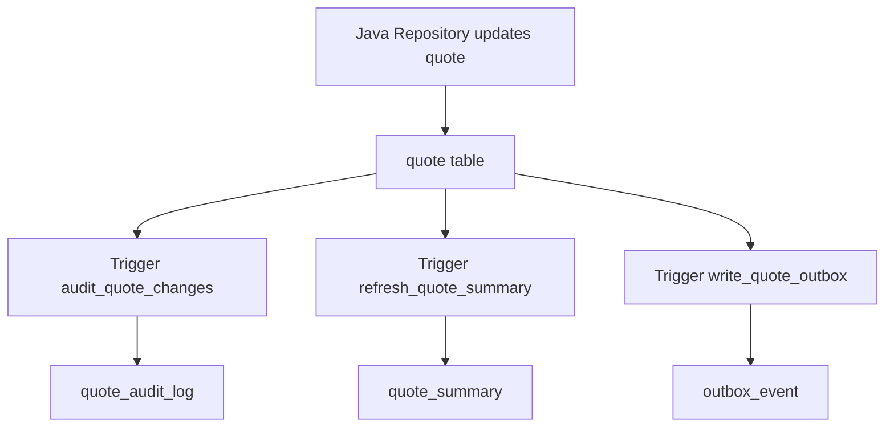

# Part 065 — PostgreSQL Functions, Procedures, Triggers, and PL/pgSQL

> Fokus part ini: memahami kapan logic boleh berada di PostgreSQL, bagaimana function/procedure/trigger/PL/pgSQL bekerja, bagaimana Java/JAX-RS service berinteraksi dengannya, apa failure mode-nya, dan bagaimana mereview penggunaannya dengan standar production.

PostgreSQL bukan hanya tempat menyimpan row.

Ia juga bisa menjalankan logic.

Logic itu bisa muncul sebagai:

- function
- procedure
- trigger function
- trigger
- generated value
- constraint
- rule bisnis kecil yang dekat dengan data
- audit operation
- normalization routine
- reconciliation helper
- data migration routine

Ini powerful.

Tetapi juga berbahaya.

Jika semua business logic dipindahkan ke PL/pgSQL, Java service kehilangan visibility.

Jika semua constraint ditaruh di Java, database bisa menerima state invalid dari job, import, script, migration, atau service lain.

Senior engineer tidak memilih salah satu secara fanatik.

Senior engineer memilih boundary.

---

## 1. Core Mental Model

Database-side logic harus dilihat sebagai bagian dari lifecycle write, bukan helper tersembunyi.

```text
HTTP request
  -> JAX-RS resource
  -> application service
  -> repository/mapper
  -> SQL statement
  -> PostgreSQL planner/executor
  -> constraint/function/procedure/trigger
  -> transaction commit/rollback
  -> response/event/log/metric
```

Jika PostgreSQL logic mengubah data, menghasilkan side effect, atau menolak operasi, maka ia adalah bagian dari domain behavior atau integrity behavior.

Ia harus:

- terdokumentasi
- versioned lewat migration
- diuji
- observable
- dipahami oleh developer Java
- direview seperti production code

Bukan dianggap sebagai detail DBA yang tidak perlu diketahui backend engineer.

---

## 2. Function vs Procedure vs Trigger

| Mechanism | Dipanggil oleh | Return value | Transaction control | Typical use |
|---|---|---:|---:|---|
| Function | SQL expression / `SELECT` / DML | Ya | Umumnya tidak commit sendiri saat dipanggil dalam transaction caller | calculate value, validate, transform, query helper |
| Procedure | `CALL` | Tidak seperti function; bisa punya OUT param | Bisa punya transaction control dalam kondisi tertentu | batch routine, administrative operation, multi-step data operation |
| Trigger function | Trigger | Biasanya `trigger` pseudo-type | Mengikuti DML yang memicu | audit, denormalization, invariant enforcement |
| Trigger | INSERT/UPDATE/DELETE/TRUNCATE event | Tidak langsung | Mengikuti statement/row lifecycle | automatic side effect on table change |

Practical rule:

```text
Function  -> explicit computation or query helper
Procedure -> explicit command-like database routine
Trigger   -> implicit reaction to table mutation
```

Implisit berarti lebih sulit dilihat dari Java.

Semakin implisit, semakin tinggi kebutuhan dokumentasi, observability, dan test.

---

## 3. Where PostgreSQL Logic Fits in a JAX-RS Service

JAX-RS resource method sebaiknya tidak langsung tahu detail PL/pgSQL.

Boundary yang lebih sehat:

```text
Resource
  -> Application Service
  -> Repository / Mapper
  -> SQL / Routine Call
  -> PostgreSQL Function/Procedure/Trigger
```

Example layering:

```java
@Path("/quotes")
public class QuoteResource {
    private final QuoteApplicationService service;

    @POST
    public Response createQuote(CreateQuoteRequest request) {
        QuoteId id = service.createQuote(request);
        return Response.created(URI.create("/quotes/" + id.value())).build();
    }
}
```

```java
public final class QuoteApplicationService {
    private final QuoteRepository repository;

    public QuoteId createQuote(CreateQuoteRequest request) {
        // API/domain validation happens here or before here.
        // Database routine may enforce data integrity or perform atomic calculation.
        return repository.insertQuoteUsingDatabaseRoutine(request);
    }
}
```

```java
public interface QuoteRepository {
    QuoteId insertQuoteUsingDatabaseRoutine(CreateQuoteRequest request);
}
```

The resource exposes HTTP semantics.

The application service owns use-case semantics.

The repository owns persistence interaction.

The database routine owns data-local atomicity or integrity logic.

If a resource method directly calls `CALL calculate_quote(...)`, the design becomes harder to test, reason about, and change.

---

## 4. When Database-Side Logic Is Appropriate

Good candidates:

- data integrity that must hold regardless of caller
- compact calculation close to indexed data
- audit trigger for database mutation provenance
- denormalized read model maintenance
- batch/reconciliation helper operating on many rows
- legacy integration boundary already expressed in stored routines
- migration data transformation
- atomic update that would otherwise require many round trips

Risky candidates:

- complex domain workflow
- user journey orchestration
- external service calls
- Kafka publication
- tenant routing hidden in SQL
- feature-flagged behavior hidden in trigger
- security authorization that Java layer cannot see
- logic requiring rich telemetry and distributed tracing

Rule of thumb:

```text
Use PostgreSQL logic for data-local invariants and atomic data operations.
Avoid hiding application orchestration inside database routines.
```

In CPQ/order-style systems, examples that may be reasonable:

- enforcing uniqueness of quote version per tenant
- calculating derived normalized search columns
- maintaining audit rows for critical table changes
- validating non-overlapping effective-date ranges
- reconciliation batch helper

Examples that should be treated carefully:

- complete pricing algorithm
- product catalog rule evaluation
- order orchestration
- tenant permission decision
- event publication side effect

These may still exist in legacy systems, but they need explicit ownership and verification.

---

## 5. PostgreSQL Function Basics

Simple function:

```sql
CREATE OR REPLACE FUNCTION normalize_external_ref(input text)
RETURNS text
LANGUAGE sql
IMMUTABLE
AS $$
    SELECT lower(trim(input));
$$;
```

PL/pgSQL function:

```sql
CREATE OR REPLACE FUNCTION validate_effective_window(
    p_valid_from timestamptz,
    p_valid_to timestamptz
)
RETURNS boolean
LANGUAGE plpgsql
STABLE
AS $$
BEGIN
    IF p_valid_from IS NULL THEN
        RETURN false;
    END IF;

    IF p_valid_to IS NOT NULL AND p_valid_to <= p_valid_from THEN
        RETURN false;
    END IF;

    RETURN true;
END;
$$;
```

Important attributes:

| Attribute | Meaning | Review concern |
|---|---|---|
| `IMMUTABLE` | Same input always gives same output | Must not read tables, time, config, sequence |
| `STABLE` | Same within statement; may read DB | Good for lookup-like logic |
| `VOLATILE` | Can change anytime; default | Required for side effects or time/random |
| `STRICT` | Returns null if any input null | Avoids manual null handling |
| `SECURITY DEFINER` | Runs with owner privileges | High security risk; review carefully |

Bad volatility classification can produce wrong query plans or stale assumptions.

Do not mark a function `IMMUTABLE` just to make an index work unless it is truly immutable.

---

## 6. Function as Query Helper

Example generated normalized value:

```sql
CREATE OR REPLACE FUNCTION quote_search_text(
    p_quote_number text,
    p_customer_name text,
    p_external_ref text
)
RETURNS text
LANGUAGE sql
IMMUTABLE
AS $$
    SELECT trim(concat_ws(' ', p_quote_number, p_customer_name, p_external_ref));
$$;
```

Used in query:

```sql
SELECT quote_id
FROM quote
WHERE to_tsvector('simple', quote_search_text(quote_number, customer_name, external_ref))
      @@ plainto_tsquery('simple', :query);
```

This can be useful.

But review the cost.

If the function is evaluated over many rows without expression index, it can be expensive.

Prefer generated column or indexed expression when query path is hot.

```sql
CREATE INDEX idx_quote_search_vector
ON quote
USING gin (to_tsvector('simple', quote_search_text(quote_number, customer_name, external_ref)));
```

Internal verification:

- is the function used in hot query path?
- is there an expression index?
- is volatility declared correctly?
- is collation/timezone/locale relevant?
- is function behavior covered by tests?

---

## 7. Function as Integrity Helper

Database logic can enforce invariants that Java alone cannot guarantee under concurrency.

Example effective-date overlap check:

```sql
CREATE TABLE product_price_version (
    id bigserial PRIMARY KEY,
    tenant_id text NOT NULL,
    product_code text NOT NULL,
    currency text NOT NULL,
    valid_from timestamptz NOT NULL,
    valid_to timestamptz NULL,
    price numeric(19, 4) NOT NULL
);
```

Naive Java check:

```text
1. SELECT existing rows
2. if no overlap -> INSERT
```

This can race.

Two requests can pass the check concurrently and both insert overlapping windows.

Better options:

- exclusion constraint if model supports range types
- unique constraint for simpler cases
- transaction isolation/locking
- database function with lock
- application-level serialization per key

Example using range/exclusion concept:

```sql
CREATE EXTENSION IF NOT EXISTS btree_gist;

ALTER TABLE product_price_version
ADD CONSTRAINT no_overlapping_price_window
EXCLUDE USING gist (
    tenant_id WITH =,
    product_code WITH =,
    currency WITH =,
    tstzrange(valid_from, COALESCE(valid_to, 'infinity'::timestamptz), '[)') WITH &&
);
```

This is often more robust than trigger logic.

Senior review point:

```text
Prefer declarative constraints when they can express the invariant.
Use PL/pgSQL when declarative constraints cannot express the behavior cleanly.
```

---

## 8. Procedure Basics

Procedure is command-like.

```sql
CREATE OR REPLACE PROCEDURE archive_old_quote_drafts(p_before timestamptz)
LANGUAGE plpgsql
AS $$
BEGIN
    INSERT INTO quote_draft_archive
    SELECT *
    FROM quote_draft
    WHERE updated_at < p_before
      AND status = 'DRAFT';

    DELETE FROM quote_draft
    WHERE updated_at < p_before
      AND status = 'DRAFT';
END;
$$;
```

Called by:

```sql
CALL archive_old_quote_drafts(now() - interval '180 days');
```

Possible uses:

- batch cleanup
- archival
- reconciliation preparation
- administrative maintenance
- data migration operation

Be careful when procedures are called from request path.

Long procedures can:

- hold locks too long
- exhaust connection pool
- exceed request timeout
- make user-facing API unpredictable
- produce unclear partial progress

If a procedure is long-running, consider running it as job, not synchronous JAX-RS request.

---

## 9. Calling Functions and Procedures from JDBC

Function via `SELECT`:

```java
String sql = "select validate_effective_window(?, ?)";
try (PreparedStatement ps = connection.prepareStatement(sql)) {
    ps.setObject(1, validFrom);
    ps.setObject(2, validTo);

    try (ResultSet rs = ps.executeQuery()) {
        if (rs.next()) {
            return rs.getBoolean(1);
        }
    }
}
```

Procedure via `CALL`:

```java
String sql = "call archive_old_quote_drafts(?)";
try (CallableStatement cs = connection.prepareCall(sql)) {
    cs.setObject(1, cutoffInstant);
    cs.execute();
}
```

Important review points:

- Does the call run inside an explicit transaction?
- Does the routine expect caller-managed commit/rollback?
- Are SQL exceptions mapped using SQLState?
- Are input types explicit?
- Are date/time values timezone-safe?
- Is the connection returned to pool quickly?
- Is procedure execution time bounded?

---

## 10. Calling Routines from MyBatis

Function as `SELECT`:

```xml
<select id="validateEffectiveWindow" resultType="boolean">
  select validate_effective_window(
    #{validFrom, jdbcType=TIMESTAMP_WITH_TIMEZONE},
    #{validTo, jdbcType=TIMESTAMP_WITH_TIMEZONE}
  )
</select>
```

Procedure as statement:

```xml
<update id="archiveOldQuoteDrafts">
  call archive_old_quote_drafts(#{before, jdbcType=TIMESTAMP_WITH_TIMEZONE})
</update>
```

Routine returning rows:

```sql
CREATE OR REPLACE FUNCTION find_quote_candidates(p_tenant_id text, p_query text)
RETURNS TABLE (
    quote_id bigint,
    quote_number text,
    rank real
)
LANGUAGE sql
STABLE
AS $$
    SELECT q.id, q.quote_number, 1.0::real
    FROM quote q
    WHERE q.tenant_id = p_tenant_id
      AND q.quote_number ILIKE '%' || p_query || '%'
    LIMIT 50;
$$;
```

```xml
<select id="findQuoteCandidates" resultMap="quoteCandidateMap">
  select * from find_quote_candidates(#{tenantId}, #{query})
</select>
```

MyBatis-specific risk:

- dynamic SQL hides routine call complexity
- parameter names/types may drift
- stored routine output changes can break mapping at runtime
- procedure side effect may not be obvious in mapper name

Name mapper methods as commands when they mutate:

```text
archiveOldQuoteDrafts()        good
getArchiveData()               bad if it deletes rows
recalculateQuoteTotals()       good
selectQuoteTotals()            bad if it updates cache table
```

---

## 11. Trigger Basics

A trigger reacts to table event.

Example audit trigger:

```sql
CREATE TABLE quote_audit_log (
    audit_id bigserial PRIMARY KEY,
    quote_id bigint NOT NULL,
    action text NOT NULL,
    changed_at timestamptz NOT NULL DEFAULT now(),
    changed_by text NULL,
    old_data jsonb NULL,
    new_data jsonb NULL
);
```

```sql
CREATE OR REPLACE FUNCTION audit_quote_changes()
RETURNS trigger
LANGUAGE plpgsql
AS $$
BEGIN
    IF TG_OP = 'INSERT' THEN
        INSERT INTO quote_audit_log(quote_id, action, new_data)
        VALUES (NEW.id, TG_OP, to_jsonb(NEW));
        RETURN NEW;
    ELSIF TG_OP = 'UPDATE' THEN
        INSERT INTO quote_audit_log(quote_id, action, old_data, new_data)
        VALUES (NEW.id, TG_OP, to_jsonb(OLD), to_jsonb(NEW));
        RETURN NEW;
    ELSIF TG_OP = 'DELETE' THEN
        INSERT INTO quote_audit_log(quote_id, action, old_data)
        VALUES (OLD.id, TG_OP, to_jsonb(OLD));
        RETURN OLD;
    END IF;

    RETURN NULL;
END;
$$;
```

```sql
CREATE TRIGGER trg_audit_quote_changes
AFTER INSERT OR UPDATE OR DELETE ON quote
FOR EACH ROW
EXECUTE FUNCTION audit_quote_changes();
```

Triggers are attractive for audit because they catch changes from any caller.

But they can also surprise Java developers.

A simple `UPDATE quote` may write 1 row plus 1 audit row plus update derived table plus notify something.

That hidden work affects latency, locking, replication, and migration.

---

## 12. BEFORE vs AFTER Triggers

| Trigger timing | Typical use | Risk |
|---|---|---|
| `BEFORE INSERT` | normalize values, set derived columns | hidden mutation of input |
| `BEFORE UPDATE` | enforce row-level transformation | surprising update behavior |
| `AFTER INSERT` | audit, denormalize, enqueue outbox | more side effects after actual row write |
| `AFTER UPDATE` | audit, maintain read model | can amplify update cost |
| `INSTEAD OF` | views | debugging complexity |

Rule:

```text
Use BEFORE trigger for row shaping.
Use AFTER trigger for side-effect rows.
Avoid complex branching in triggers.
```

Prefer explicit application code when behavior is domain workflow rather than data integrity.

---

## 13. Row-Level vs Statement-Level Triggers

Row-level trigger:

```sql
FOR EACH ROW
```

Runs once per row.

Statement-level trigger:

```sql
FOR EACH STATEMENT
```

Runs once per SQL statement.

A batch update of 100,000 rows with row-level trigger can execute trigger code 100,000 times.

This can destroy performance.

Senior review question:

```text
What is the maximum row count this DML can touch, and how many trigger executions will it cause?
```

If the answer is unknown, do not approve casually.

---

## 14. Trigger Side Effects and Hidden Coupling

Triggers can create hidden coupling between tables.



From Java, the code may look like one update.

At runtime, it is a graph of side effects.

Risks:

- unexpected lock acquisition order
- deadlocks
- additional write amplification
- trigger failure rolling back original request
- audit table growth
- migration dependency
- replay/reconciliation complexity

Triggers should be listed in internal architecture docs, not discovered only during incident.

---

## 15. Transaction Interaction

Most function and trigger work runs inside the caller's transaction.

If trigger fails, the original statement fails.

If transaction rolls back, trigger side effects also roll back.

Example:

```text
BEGIN;
UPDATE quote SET status = 'SUBMITTED' WHERE id = 10;
-- trigger writes audit row
-- trigger fails due to constraint
ROLLBACK;
```

Result:

- quote update rolled back
- audit row rolled back
- caller receives SQL exception

This is often correct.

But it means an audit trigger can break business writes.

If audit must never block main write, database trigger may not be the right mechanism. Consider outbox plus async processing, with explicit failure policy.

---

## 16. Error Handling in PL/pgSQL

PL/pgSQL can raise exceptions:

```sql
RAISE EXCEPTION 'Invalid effective window for product %', p_product_code
    USING ERRCODE = '22007';
```

Custom SQLState can also be used in user-defined class ranges, but internal teams need standardization.

Java side should not parse free-text error message as business logic.

Prefer:

- constraints for integrity
- named constraint mapping
- SQLState mapping
- standardized error code table
- explicit routine output for expected domain rejection

Bad pattern:

```java
if (exception.getMessage().contains("Invalid effective window")) {
    throw new DomainException("INVALID_WINDOW");
}
```

Better pattern:

```java
if (isConstraintViolation(exception, "no_overlapping_price_window")) {
    throw new ConflictException("PRICE_WINDOW_OVERLAP");
}
```

Or routine returns structured result:

```sql
RETURNS TABLE(success boolean, error_code text, quote_id bigint)
```

Use structured result only for expected business outcomes.

Use exceptions for unexpected technical failure or invariant violation.

---

## 17. SECURITY DEFINER Risk

`SECURITY DEFINER` means function runs with privileges of function owner.

Example:

```sql
CREATE OR REPLACE FUNCTION admin_repair_quote_state(p_quote_id bigint)
RETURNS void
LANGUAGE plpgsql
SECURITY DEFINER
AS $$
BEGIN
    UPDATE quote SET status = 'REPAIRED' WHERE id = p_quote_id;
END;
$$;
```

Risks:

- privilege escalation
- search path hijacking
- bypassing row-level security
- accidental access to cross-tenant data
- hard-to-audit admin operations

If `SECURITY DEFINER` is used:

- set safe `search_path`
- restrict execute privilege
- audit calls
- review owner role
- avoid dynamic SQL when possible
- validate tenant boundary explicitly

Example safer pattern:

```sql
CREATE OR REPLACE FUNCTION admin_repair_quote_state(p_tenant_id text, p_quote_id bigint)
RETURNS void
LANGUAGE plpgsql
SECURITY DEFINER
SET search_path = public
AS $$
BEGIN
    UPDATE quote
    SET status = 'REPAIRED'
    WHERE tenant_id = p_tenant_id
      AND id = p_quote_id;
END;
$$;
```

Even this requires careful internal review.

---

## 18. Dynamic SQL Risk

PL/pgSQL dynamic SQL:

```sql
EXECUTE 'SELECT count(*) FROM ' || table_name;
```

This is dangerous if `table_name` is not controlled.

Use `format` and identifiers:

```sql
EXECUTE format('SELECT count(*) FROM %I', table_name);
```

Use parameters for values:

```sql
EXECUTE 'UPDATE quote SET status = $1 WHERE id = $2'
USING p_status, p_quote_id;
```

Review dynamic SQL like application code vulnerable to injection.

SQL injection can exist inside database routines too.

---

## 19. Routine Versioning and Migration

Routines must be versioned through migrations.

Common issue:

```text
Java code expects function signature A.
Database migration changes function signature to B.
Rolling deployment runs old Java against new DB or new Java against old DB.
Production breaks.
```

Compatibility strategy:

1. Add new function without removing old one.
2. Deploy code that can call new function.
3. Verify no old code still calls old function.
4. Remove old function in later migration.

Example:

```sql
-- migration 1
CREATE OR REPLACE FUNCTION calculate_quote_total_v2(...)
RETURNS numeric
...
```

```text
Deploy application using calculate_quote_total_v2
```

```sql
-- later migration
DROP FUNCTION calculate_quote_total_v1(...);
```

For function body changes with same signature, compatibility depends on semantics.

Senior review should ask:

```text
Is this routine change backward-compatible with currently deployed application versions?
```

---

## 20. Observability for Database Logic

Database routines are harder to trace than Java code.

Minimum observability:

- routine execution time through query metrics
- slow query log
- application logs around routine call
- correlation ID in application log
- DB session/application name if supported
- error SQLState and constraint name logging
- affected row count
- job/routine metrics for batch procedures

Do not log sensitive data or full payloads.

For JAX-RS request path:

```text
log before routine call:
  operation=quote.create.db_routine
  tenant_id_hash=...
  quote_ref=...
  correlation_id=...

log after:
  duration_ms=...
  rows_affected=...
  db_error_code=... if failed
```

Avoid logging:

- raw JWT
- PII
- customer-sensitive quote details
- full pricing payload
- secrets

---

## 21. Performance Failure Modes

Common failures:

### 21.1 Function Called Per Row in Large Query

```sql
SELECT expensive_function(col)
FROM huge_table;
```

Can cause CPU-heavy query.

Detection:

- high DB CPU
- slow query logs
- `EXPLAIN ANALYZE`
- many function calls

### 21.2 Trigger Amplification

```sql
UPDATE quote_line SET status = 'EXPIRED' WHERE tenant_id = ?;
```

If 200,000 rows match and each row fires trigger, operation can be huge.

Detection:

- slow update
- lock wait
- audit table spike
- WAL growth
- replication lag

### 21.3 Procedure Holding Locks Too Long

Long procedure updates many tables in one transaction.

Detection:

- blocked sessions
- lock wait events
- transaction age
- deadlock logs

### 21.4 Routine Output Mapping Drift

Function returns new column or changed type.

Detection:

- Java mapper failure
- `ClassCastException`
- MyBatis result mapping error
- runtime SQL exception

---

## 22. Debugging Toolkit

Useful DB-side inspection:

```sql
-- find functions/procedures matching name
SELECT n.nspname AS schema_name,
       p.proname AS routine_name,
       pg_get_function_arguments(p.oid) AS args,
       pg_get_function_result(p.oid) AS result_type
FROM pg_proc p
JOIN pg_namespace n ON n.oid = p.pronamespace
WHERE p.proname ILIKE '%quote%'
ORDER BY 1, 2;
```

```sql
-- inspect function definition
SELECT pg_get_functiondef('validate_effective_window(timestamptz,timestamptz)'::regprocedure);
```

```sql
-- list triggers on a table
SELECT event_object_table,
       trigger_name,
       action_timing,
       event_manipulation,
       action_statement
FROM information_schema.triggers
WHERE event_object_table = 'quote'
ORDER BY trigger_name;
```

```sql
-- check locks relevant during routine execution
SELECT pid,
       relation::regclass,
       mode,
       granted
FROM pg_locks
WHERE relation IS NOT NULL
ORDER BY relation::regclass::text, mode;
```

Application-side inspection:

- find mapper method calling routine
- trace from resource to service to repository
- log SQLState and constraint name
- capture query duration
- check transaction boundary
- reproduce with Testcontainers

---

## 23. Testing Strategy

Test levels:

| Test | Purpose |
|---|---|
| Function unit-like SQL test | Verify deterministic behavior |
| Migration test | Verify routine exists after migration |
| Repository integration test | Verify Java/MyBatis call mapping |
| Concurrency test | Verify lock/race behavior |
| Error mapping test | Verify SQL exception maps to API error |
| Performance smoke test | Verify routine does not explode under realistic row count |

Example integration test idea:

```text
Given overlapping price window exists
When repository inserts another overlapping window
Then database rejects operation
And application maps it to 409 Conflict with PRICE_WINDOW_OVERLAP
```

This proves DB constraint/routine and API error mapping work together.

---

## 24. Design Decision Matrix

| Requirement | Prefer | Avoid |
|---|---|---|
| Simple invariant | Constraint | Trigger with complex branching |
| Derived value from same row | Generated column or BEFORE trigger | Recalculation in every query |
| Audit any table mutation | AFTER trigger or application audit with strict coverage | Ad hoc logging only |
| Complex workflow | Java service/workflow engine | PL/pgSQL orchestration |
| Batch archival | Job + procedure | User-facing request doing huge transaction |
| External event publication | Outbox pattern | Trigger calling external system |
| Multi-tenant access control | Explicit app/security layer + DB guard | Hidden `SECURITY DEFINER` bypass |

---

## 25. JAX-RS Failure Mapping

Database routine failures should become stable API responses.

Example mapping:

| DB failure | Java exception category | HTTP response |
|---|---|---|
| unique violation | conflict | `409 Conflict` |
| exclusion violation | conflict | `409 Conflict` |
| foreign key violation | bad request/conflict depending context | `400` or `409` |
| check violation | bad request/domain invariant | `400` or `422` if used internally |
| lock timeout | transient dependency failure | `503` or `409` depending operation |
| deadlock | retryable technical failure | `503` or retried internally |
| routine missing | deployment/config error | `500` |
| permission denied | security/config error | `500`/`403` depending source |

Do not leak raw SQL exception messages to API clients.

Do log enough internal context to debug.

---

## 26. PR Review Checklist

When reviewing function/procedure/trigger usage, ask:

### Boundary

- Is this logic data-local or application workflow?
- Why should it live in PostgreSQL instead of Java?
- Is the behavior visible to application developers?
- Is there a simpler declarative constraint?

### Compatibility

- Is routine signature backward-compatible?
- Can old and new app versions run during rolling deploy?
- Is rollback safe?
- Are dependent mappers updated?

### Transaction

- What transaction owns this routine?
- Does it hold locks?
- Could it deadlock?
- Could it run longer than request timeout?

### Performance

- Is the routine called per row?
- Is it used in hot query path?
- Does it need index support?
- What is the maximum row count affected?

### Security

- Does it use `SECURITY DEFINER`?
- Does it use dynamic SQL?
- Does it enforce tenant boundary?
- Are execute privileges restricted?

### Observability

- Can we see duration and failure rate?
- Are SQLState/constraint names logged?
- Is there a runbook for failure?
- Are audit/security implications known?

---

## 27. Internal Verification Checklist

Verify in CSG/internal codebase and platform docs:

- Are PostgreSQL functions used in request path?
- Are procedures used for batch/reconciliation/admin operations?
- Are triggers used for audit, denormalization, outbox, or integrity?
- Which schema owns routines?
- Are routines created by Liquibase, Flyway, manual script, or DBA process?
- Are routine definitions versioned in repository?
- Are routine changes reviewed in normal PR process?
- Are there `SECURITY DEFINER` functions?
- Are there dynamic SQL routines?
- Are routine calls made through JDBC, MyBatis, or another abstraction?
- Are function/procedure signatures covered by integration tests?
- Are DB exceptions mapped to stable API error codes?
- Are trigger side effects documented?
- Are there tables with many triggers?
- Are trigger-heavy tables part of hot write path?
- Are routine execution times visible in metrics/logs?
- Are slow query logs enabled and accessible?
- Is there a production runbook for lock/deadlock caused by routine/trigger?
- Are tenant boundaries enforced in database-side logic?
- Are audit triggers compliant with retention and PII policy?

---

## 28. Anti-Patterns

Avoid:

```text
All important business logic lives in hidden PL/pgSQL with no Java-level model.
```

```text
Trigger writes to many tables and nobody knows during PR review.
```

```text
Java parses database exception message text to decide domain error.
```

```text
Stored procedure runs for minutes inside user-facing HTTP request.
```

```text
Function marked IMMUTABLE while reading table/config/current time.
```

```text
SECURITY DEFINER used without search_path, privilege, and tenant review.
```

```text
Routine signature changed in place without rolling-deployment compatibility.
```

---

## 29. Senior Engineer Heuristic

Good PostgreSQL logic is boring, explicit, and data-local.

Dangerous PostgreSQL logic is surprising, implicit, and workflow-like.

A senior engineer should not reject functions/procedures/triggers automatically.

But every database-side behavior must have:

- a clear reason to exist
- a clear owner
- migration discipline
- tests
- observability
- rollback plan
- tenant/security review
- PR review checklist

The central question:

```text
If this routine fails at 2 AM, can the on-call engineer understand what happened, what data was affected, and how to recover?
```

If not, the design is not production-ready.

---

## 30. Practical Takeaway

Use PostgreSQL functions, procedures, triggers, and PL/pgSQL intentionally.

They are not merely database conveniences.

They are production code.

For JAX-RS enterprise services, the safest pattern is:

```text
JAX-RS owns HTTP semantics.
Application service owns use-case semantics.
Repository/mapper owns persistence interaction.
PostgreSQL routines own data-local atomicity and integrity.
Migrations own versioning.
Observability owns debuggability.
```

When this boundary is explicit, database-side logic can improve correctness and performance.

When hidden, it becomes one of the hardest classes of production failure to debug.
