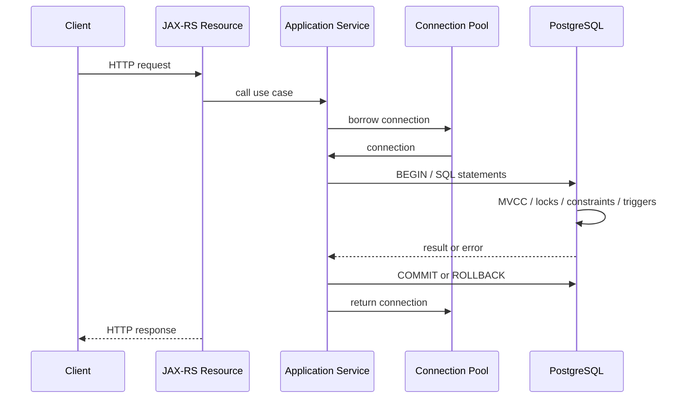
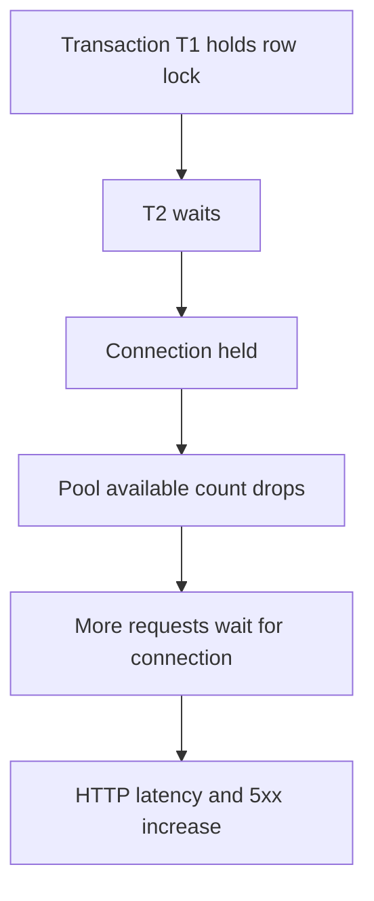
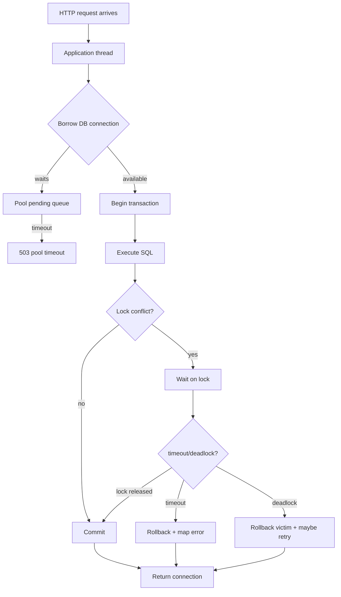

# Part 066 — Connection Pool, Transactions, Isolation, Locking, and Deadlocks

> Fokus part ini: memahami connection pool, transaction boundary, isolation level, MVCC, row locking, deadlock, lock wait, pool exhaustion, dan bagaimana semua itu muncul sebagai latency/error pada JAX-RS service production.

Database-backed service jarang gagal karena SQL syntax saja.

Ia lebih sering gagal karena lifecycle:

- connection tidak kembali ke pool
- transaction terlalu panjang
- isolation level tidak sesuai
- row lock menumpuk
- deadlock muncul di traffic tinggi
- query lambat menahan connection
- retry memperparah contention
- request timeout tidak membatalkan database work
- pool size tidak cocok dengan DB capacity

Di sistem enterprise, PostgreSQL bukan hanya persistence.

Ia adalah shared concurrency control system.

Senior engineer harus bisa membaca database failure sebagai sistem antrian, locking, transaction, dan resource ownership.

---

## 1. Core Mental Model

Satu request JAX-RS yang menyentuh database biasanya mengikuti lifecycle:



Every step can fail.

The most important invariant:

```text
Every borrowed connection must be returned quickly and predictably.
```

If not, all endpoints depending on database can fail even when PostgreSQL itself is healthy.

---

## 2. Connection Is Not Just a Socket

A JDBC connection carries state:

- transaction state
- isolation level
- auto-commit mode
- session variables
- prepared statement state
- temporary objects
- current schema/search path
- locks held by transaction
- backend process in PostgreSQL

Connection pooling reuses this stateful object.

A good pool resets state before reuse.

A bad pattern leaves hidden state for the next request.

Example dangerous flow:

```text
Request A sets transaction isolation SERIALIZABLE
Request A fails to reset it
Connection returns to pool
Request B borrows same connection
Request B unexpectedly runs SERIALIZABLE
Request B gets serialization failures or slower behavior
```

Internal verification must confirm pool behavior and transaction management.

---

## 3. Connection Pool Basics

A pool limits the number of concurrent database connections used by the service.

Common Java pools include HikariCP, Apache DBCP, Tomcat JDBC pool, and container-managed datasource.

Do not assume which one is used internally.

Verify from dependencies/config.

Core settings:

| Setting | Meaning | Failure if wrong |
|---|---|---|
| maximum pool size | max open connections | DB overload or app queueing |
| minimum idle | pre-warmed idle connections | startup spike or waste |
| connection timeout | wait time to borrow connection | request fails during pool exhaustion |
| idle timeout | close unused idle connections | churn or resource waste |
| max lifetime | recycle old connections | stale connection issues |
| leak detection threshold | logs long-held connection | false positives or missed leaks |
| validation timeout | health check duration | slow borrow or false failure |

Pool is a backpressure point.

If pool has 20 connections, only 20 concurrent DB operations can proceed from that service instance.

The rest wait, fail, or time out.

---

## 4. Pool Size Is a Capacity Contract

Pool size is not arbitrary.

It must align with:

- number of service replicas
- max PostgreSQL connections
- DB CPU capacity
- query latency
- request concurrency
- endpoint mix
- job traffic
- admin traffic
- connection usage per request

Simplified model:

```text
Total possible connections = replicas * pool_size_per_replica
```

If 30 pods each have pool size 30:

```text
30 * 30 = 900 possible DB connections
```

If PostgreSQL can safely handle 200 active connections, this is dangerous.

Bigger pool can make latency worse because it allows more concurrent DB work than the database can execute efficiently.

A pool should protect the database, not overwhelm it.

---

## 5. Pool Exhaustion

Pool exhaustion means application threads cannot borrow DB connections fast enough.

Symptoms:

- HTTP latency spike
- connection timeout exceptions
- thread pool saturation
- elevated 5xx
- DB may be idle or overloaded depending root cause

Causes:

- slow queries
- long transactions
- connection leaks
- DB locks causing statements to wait
- too much request concurrency
- batch jobs sharing same pool
- pool too small for expected throughput
- pool too large causing DB collapse

Important distinction:

```text
Pool exhausted because DB is overloaded
```

vs

```text
Pool exhausted because app leaked connections
```

Diagnosis differs.

---

## 6. Connection Leak

Connection leak means borrowed connection is not returned.

Classic JDBC mistake:

```java
Connection connection = dataSource.getConnection();
PreparedStatement ps = connection.prepareStatement(sql);
ResultSet rs = ps.executeQuery();
// exception happens
// connection never closed
```

Correct pattern:

```java
try (Connection connection = dataSource.getConnection();
     PreparedStatement ps = connection.prepareStatement(sql)) {

    try (ResultSet rs = ps.executeQuery()) {
        while (rs.next()) {
            // map row
        }
    }
}
```

Frameworks may manage this automatically, but you still need to verify.

Leak-like behavior can also happen when:

- streaming response keeps connection open
- transaction spans external HTTP call
- result set is lazily consumed outside transaction boundary
- job holds connection across large processing loop
- code waits on lock while holding connection

Leak detection logs are helpful but not sufficient.

---

## 7. Transaction Lifecycle

A transaction groups database operations into atomic unit.

Basic lifecycle:

```text
BEGIN
  statement 1
  statement 2
  statement 3
COMMIT
```

On failure:

```text
BEGIN
  statement 1
  statement 2 fails
ROLLBACK
```

In JDBC, auto-commit matters.

Default JDBC behavior is often auto-commit true:

```text
each statement commits automatically
```

Enterprise applications usually use framework-managed transaction boundaries.

Verify actual model:

- manual JDBC transaction
- MyBatis with manual/session transaction
- Spring transaction manager
- JTA/container transaction
- custom unit-of-work
- no explicit transaction boundary

Do not assume.

---

## 8. Transaction Boundary in JAX-RS Service

A healthy command request usually has boundary:

```text
validate request
begin transaction
load necessary data
check invariants
write changes
commit
publish outbox / schedule event after commit
return response
```

Unhealthy boundary:

```text
begin transaction
call external HTTP service
wait for response
call another service
perform heavy CPU work
write DB
commit
```

This holds database connection and locks while waiting on non-database dependency.

Avoid doing remote calls inside DB transaction unless there is a very strong reason.

Better:

```text
load state
commit/rollback
call external service if safe
or use outbox/workflow/saga
```

For CPQ/order-style workflows, be especially careful with:

- pricing calls
- catalog calls
- credit checks
- order submission
- workflow task execution
- event publication

A long business operation is not necessarily one database transaction.

---

## 9. MVCC Mental Model

PostgreSQL uses MVCC: Multi-Version Concurrency Control.

Readers do not normally block writers.

Writers can block writers when they touch same rows.

A transaction sees a snapshot depending on isolation level.

Conceptually:

```text
Row version A exists
Transaction 1 updates row -> creates Row version B
Transaction 2 may still see A depending snapshot
Commit makes B visible to future snapshots
```

MVCC reduces read/write blocking, but does not remove concurrency anomalies.

Locks still matter.

Long transactions are harmful because they can keep old row versions alive and interfere with vacuum.

---

## 10. Isolation Levels

PostgreSQL supports common isolation levels:

| Isolation | Practical meaning | Typical risk |
|---|---|---|
| Read Committed | Each statement sees committed data at statement start | non-repeatable reads, write race |
| Repeatable Read | Transaction sees stable snapshot | serialization-like conflicts for some patterns |
| Serializable | Stronger correctness via serialization checks | serialization failures requiring retry |

Most applications use Read Committed unless configured otherwise.

Read Committed is not wrong.

But it means application logic must account for races.

Example race:

```text
T1 checks no active price window
T2 checks no active price window
T1 inserts active window
T2 inserts active window
Both commit
```

Solution options:

- unique/exclusion constraint
- row/advisory lock
- serializable transaction with retry
- single-writer design
- idempotency key
- database-backed state transition guard

Correctness should not rely only on "we checked before insert".

---

## 11. Lost Update

Lost update happens when two operations read same state and overwrite each other.

Example:

```text
T1 reads quote version 3
T2 reads quote version 3
T1 updates discount to 10%, version 4
T2 updates line item, still based on version 3, version 4 or overwrite
```

Mitigation:

- optimistic locking with version column
- `UPDATE ... WHERE id = ? AND version = ?`
- pessimistic lock `SELECT ... FOR UPDATE`
- business command serialization
- aggregate version check

Example optimistic update:

```sql
UPDATE quote
SET status = ?, version = version + 1
WHERE id = ?
  AND version = ?;
```

If affected row count is 0, return conflict.

For HTTP:

```text
409 Conflict
```

or with ETag semantics:

```text
412 Precondition Failed
```

depending API contract.

---

## 12. Row Locks

`UPDATE` locks affected rows.

`SELECT FOR UPDATE` also locks rows.

Example:

```sql
SELECT *
FROM quote
WHERE id = ?
FOR UPDATE;
```

This means other transactions trying to update same row wait.

Useful for state transition:

```text
lock quote row
verify current status
apply transition
commit
```

Danger:

- lock held until transaction ends
- slow logic after lock acquisition increases contention
- inconsistent lock order causes deadlock

Lock late and release early.

Keep transaction small.

---

## 13. Lock Modes Simplified

You do not need to memorize every lock mode at first.

But understand categories:

| Lock type | Example | Impact |
|---|---|---|
| Row-level lock | update/select for update | blocks conflicting row updates |
| Table lock | DDL, some maintenance | can block broader operations |
| Advisory lock | application-defined key | custom coordination |
| Predicate/serialization lock | serializable behavior | can produce serialization failure |

Most production incidents involve:

- row lock waits
- DDL locks during migration
- long transaction blocking vacuum
- deadlock between transactions
- advisory lock not released due to session behavior misunderstanding

---

## 14. Lock Wait

A lock wait means transaction is waiting for another transaction to release lock.

User-facing symptom:

```text
Endpoint hangs until timeout.
```

Database symptom:

```text
session waits on lock
```

Application symptom:

```text
connection held while waiting
pool pressure increases
other requests fail
```

Lock wait can cascade into pool exhaustion.



One locked row can create service-wide symptoms.

---

## 15. Deadlock

Deadlock occurs when transactions wait on each other cyclically.

Example:

```text
T1 locks quote 1
T2 locks quote 2
T1 tries to lock quote 2
T2 tries to lock quote 1
```

Cycle:

```text
T1 -> waits for T2
T2 -> waits for T1
```

PostgreSQL detects deadlock and aborts one transaction.

Application receives exception.

Deadlock is not random.

It usually means inconsistent lock order.

Mitigation:

- lock rows in deterministic order
- keep transactions short
- avoid hidden trigger locks
- avoid mixed access patterns
- split large transactions
- retry aborted transaction if operation is safe/idempotent

---

## 16. Deadlock Example

Bad pattern:

```java
void mergeQuotes(long sourceQuoteId, long targetQuoteId) {
    Quote source = repository.lockQuote(sourceQuoteId);
    Quote target = repository.lockQuote(targetQuoteId);
    repository.merge(source, target);
}
```

Concurrent calls:

```text
mergeQuotes(1, 2)
mergeQuotes(2, 1)
```

Potential deadlock.

Better:

```java
void mergeQuotes(long a, long b) {
    long first = Math.min(a, b);
    long second = Math.max(a, b);

    Quote q1 = repository.lockQuote(first);
    Quote q2 = repository.lockQuote(second);

    // then apply semantic source/target behavior explicitly
}
```

The lock order is deterministic even if business order differs.

---

## 17. Lock Timeout vs Statement Timeout vs Request Timeout

Timeouts exist at multiple layers.

| Timeout | Layer | Meaning |
|---|---|---|
| HTTP request timeout | gateway/client/server | max request duration |
| app execution timeout | application/resilience layer | max operation duration |
| connection timeout | pool | max wait to borrow connection |
| statement timeout | PostgreSQL/session | max SQL execution duration |
| lock timeout | PostgreSQL/session | max wait for lock |
| idle in transaction timeout | PostgreSQL/session | max idle transaction age |

These must be aligned.

Bad alignment:

```text
HTTP timeout = 30s
statement timeout = 5m
```

Client gives up at 30 seconds, but query may keep running and hold connection/locks.

Better:

```text
statement timeout <= application timeout <= gateway timeout
```

Exact values depend on platform standard.

Verify internally.

---

## 18. Transaction and Retry

Retrying database operations requires care.

Retryable examples:

- deadlock victim
- serialization failure
- transient connection issue
- lock timeout for idempotent operation if safe

Not blindly retryable:

- unique constraint violation
- foreign key violation
- validation/check violation
- duplicate business command without idempotency
- procedure with external side effect

Retry must be bounded:

- max attempts
- backoff
- jitter
- retry budget
- idempotency key
- logging/metrics

Never retry inside a transaction that is already aborted.

In PostgreSQL, after an error inside a transaction, the transaction is aborted until rollback.

---

## 19. Constraint as Concurrency Control

Database constraints are often the best concurrency tool.

Example idempotency:

```sql
CREATE TABLE idempotency_record (
    tenant_id text NOT NULL,
    idempotency_key text NOT NULL,
    request_hash text NOT NULL,
    response_ref text NULL,
    created_at timestamptz NOT NULL DEFAULT now(),
    PRIMARY KEY (tenant_id, idempotency_key)
);
```

Concurrent duplicate insert:

```sql
INSERT INTO idempotency_record(tenant_id, idempotency_key, request_hash)
VALUES (?, ?, ?);
```

One succeeds.

One gets duplicate key.

Java maps duplicate key to existing idempotent result handling.

This is safer than checking then inserting without constraint.

---

## 20. Advisory Locks

Advisory locks are application-defined locks in PostgreSQL.

Example:

```sql
SELECT pg_advisory_xact_lock(hashtext(:tenant_id || ':' || :quote_id));
```

Transaction-scoped advisory lock releases at transaction end.

Session-scoped advisory lock releases when connection/session ends or unlocks explicitly.

Prefer transaction-scoped for application code.

Risks:

- hash collision if poorly designed
- session lock accidentally survives in pooled connection
- invisible business meaning
- lock order deadlocks
- over-serialization

Use advisory locks only with strong naming, documentation, and metrics.

---

## 21. Long Transactions

Long transactions are dangerous even if idle.

They can:

- hold locks
- prevent vacuum cleanup
- increase table/index bloat
- keep old row versions visible
- block migrations
- cause replication lag
- exhaust pool

Bad pattern:

```text
BEGIN
SELECT data
application waits for remote API
application transforms large file
UPDATE data
COMMIT
```

Better:

```text
SELECT required data outside long transaction where safe
perform external work
BEGIN short transaction
verify state still valid
write result
COMMIT
```

Use optimistic concurrency to re-check state.

---

## 22. Streaming and Transactions

Dangerous pattern:

```text
HTTP streaming response reads ResultSet lazily while transaction remains open.
```

If client is slow, DB connection remains open.

This can exhaust pool.

For large export:

- use server-side cursor carefully
- set fetch size
- bound duration
- use separate read-only pool if needed
- stream from object storage when possible
- avoid holding write locks
- add cancellation handling

Verify actual driver behavior.

JDBC streaming behavior can depend on auto-commit, fetch size, and driver settings.

---

## 23. Batch Jobs and Pool Isolation

Batch jobs can starve request traffic.

Example:

```text
API pods and reconciliation jobs share same DB pool/database role.
Job starts 20 workers.
All connections busy.
User-facing API times out.
```

Mitigations:

- separate pool for jobs
- separate service/deployment
- lower job concurrency
- DB role limits
- schedule off-peak
- chunk processing
- commit per chunk
- pause/resume capability
- job metrics

Do not let batch workload accidentally become production traffic denial-of-service.

---

## 24. Read-Only Transactions

Read-only transaction can help safety and sometimes optimization.

```sql
BEGIN READ ONLY;
SELECT ...;
COMMIT;
```

In Java/framework config, read-only flag may or may not enforce DB read-only.

Verify.

Do not assume annotation-level read-only prevents writes unless confirmed.

Internal verification:

- Does framework set connection read-only?
- Does PostgreSQL reject writes in read-only transaction?
- Does routing to read replica happen?
- Are read-after-write consistency requirements understood?

---

## 25. Read Replica and Consistency Risk

If service uses read replicas:

- replicas can lag
- read-after-write may fail
- stale catalog/pricing data may be returned
- consistency differs per endpoint

For CPQ/order-like systems, stale reads can be severe when involving:

- pricing effective dates
- product catalog activation
- order status
- permission/tenant config
- idempotency lookup

Review questions:

```text
Can this endpoint tolerate stale read?
Does it need primary read after write?
Is replica lag observable?
Is routing explicit?
```

---

## 26. DDL Locks and Migration Incidents

Migrations can take locks.

Examples:

- `ALTER TABLE`
- adding constraint with validation
- creating index without `CONCURRENTLY`
- dropping column
- changing type
- rewriting table

A migration can block writes or reads.

Production-safe migration requires:

- understand lock level
- use online pattern when possible
- split expand/contract
- backfill in chunks
- validate constraints separately
- create index concurrently when appropriate
- monitor lock waits
- have rollback/roll-forward plan

Database migration is part of transaction/locking discipline.

---

## 27. Debugging SQL for Locks and Transactions

Find active sessions:

```sql
SELECT pid,
       usename,
       application_name,
       state,
       wait_event_type,
       wait_event,
       now() - xact_start AS transaction_age,
       now() - query_start AS query_age,
       query
FROM pg_stat_activity
WHERE state <> 'idle'
ORDER BY query_age DESC;
```

Find blockers:

```sql
SELECT blocked.pid AS blocked_pid,
       blocked.query AS blocked_query,
       blocking.pid AS blocking_pid,
       blocking.query AS blocking_query
FROM pg_stat_activity blocked
JOIN pg_locks blocked_locks
  ON blocked_locks.pid = blocked.pid
JOIN pg_locks blocking_locks
  ON blocking_locks.locktype = blocked_locks.locktype
 AND blocking_locks.database IS NOT DISTINCT FROM blocked_locks.database
 AND blocking_locks.relation IS NOT DISTINCT FROM blocked_locks.relation
 AND blocking_locks.page IS NOT DISTINCT FROM blocked_locks.page
 AND blocking_locks.tuple IS NOT DISTINCT FROM blocked_locks.tuple
 AND blocking_locks.virtualxid IS NOT DISTINCT FROM blocked_locks.virtualxid
 AND blocking_locks.transactionid IS NOT DISTINCT FROM blocked_locks.transactionid
 AND blocking_locks.classid IS NOT DISTINCT FROM blocked_locks.classid
 AND blocking_locks.objid IS NOT DISTINCT FROM blocked_locks.objid
 AND blocking_locks.objsubid IS NOT DISTINCT FROM blocked_locks.objsubid
 AND blocking_locks.pid <> blocked_locks.pid
JOIN pg_stat_activity blocking
  ON blocking.pid = blocking_locks.pid
WHERE NOT blocked_locks.granted
  AND blocking_locks.granted;
```

Find idle in transaction:

```sql
SELECT pid,
       application_name,
       now() - xact_start AS transaction_age,
       query
FROM pg_stat_activity
WHERE state = 'idle in transaction'
ORDER BY transaction_age DESC;
```

Use these with care and according to internal access policy.

---

## 28. Application-Level Diagnostics

Log at repository boundary:

- operation name
- duration
- SQL category, not full sensitive SQL
- affected row count
- SQLState on failure
- constraint name if available
- transaction retry count
- correlation ID
- tenant hash or safe tenant marker

Metrics:

- pool active connections
- pool idle connections
- pool pending borrowers
- borrow latency
- query latency
- transaction duration
- deadlock count
- lock timeout count
- connection timeout count

Traces:

- span around repository operation
- DB statement summary
- table/operation tag if allowed
- error attributes
- avoid high-cardinality SQL values

---

## 29. JAX-RS Error Mapping

Database concurrency failures need stable HTTP behavior.

| Condition | Likely HTTP mapping | Notes |
|---|---|---|
| Optimistic lock conflict | `409 Conflict` | client may reload and retry |
| ETag/precondition mismatch | `412 Precondition Failed` | if API uses conditional request |
| Unique constraint business duplicate | `409 Conflict` | stable domain error code |
| Lock timeout | `503 Service Unavailable` or `409 Conflict` | depends if operational or business contention |
| Deadlock victim after retries exhausted | `503 Service Unavailable` | avoid exposing DB detail |
| Pool timeout | `503 Service Unavailable` | service dependency unavailable |
| Statement timeout | `504 Gateway Timeout` or `503` | align with platform policy |
| Serialization failure | retry internally if safe, else `503`/`409` | depends command semantics |

Do not return `500` for known, expected concurrency conflicts.

Do not retry non-idempotent commands without idempotency strategy.

---

## 30. Transaction Retry Pattern

Pseudo-pattern:

```java
<T> T executeWithTransactionRetry(Supplier<T> operation) {
    int attempt = 0;
    while (true) {
        attempt++;
        try {
            return transactionManager.inTransaction(operation);
        } catch (DatabaseException ex) {
            if (!isRetryable(ex) || attempt >= maxAttempts) {
                throw ex;
            }
            sleep(backoffWithJitter(attempt));
        }
    }
}
```

Critical requirements:

- operation must be safe to retry
- transaction must restart from beginning
- external side effects must not happen inside retried block
- max attempts must be small
- log retry count
- emit metrics
- respect request timeout

Wrong retry:

```text
write DB
call external service
deadlock
retry whole block
external service called twice
```

Use outbox/saga/idempotency for side effects.

---

## 31. Pool and Transaction Diagram



This is the production mental model.

Connection, transaction, and lock lifecycle are one system.

---

## 32. Common Anti-Patterns

Avoid:

```text
Transaction starts before validation and remains open through external API calls.
```

```text
Every endpoint has its own retry with no retry budget.
```

```text
Pool size is increased whenever latency rises.
```

```text
Batch jobs use same pool and same concurrency as user-facing traffic.
```

```text
Application relies on SELECT-then-INSERT without unique constraint.
```

```text
Deadlock is treated as random database bug rather than lock ordering bug.
```

```text
Statement timeout is longer than HTTP timeout.
```

```text
Streaming endpoint keeps DB connection open while client slowly downloads.
```

```text
Migration creates blocking index/table rewrite during peak traffic.
```

---

## 33. PR Review Checklist

When reviewing database-backed change, ask:

### Connection Pool

- Does this code borrow connection explicitly?
- Is connection always closed/returned?
- Could streaming/lazy iteration keep connection open?
- Does this endpoint share pool with jobs?
- Does pool size align with replica count and DB capacity?

### Transaction

- Where does transaction begin and end?
- Is transaction boundary visible?
- Are external calls inside transaction?
- Is transaction read-only where appropriate?
- Is retry safe and bounded?

### Isolation and Correctness

- Can concurrent requests violate invariant?
- Is there a constraint or lock to enforce correctness?
- Is optimistic locking needed?
- Is stale replica read acceptable?

### Locking

- Which rows/tables are locked?
- Is lock order deterministic?
- Could triggers acquire additional locks?
- Could migration block production traffic?

### Timeout

- Are statement/lock/request timeouts aligned?
- What happens after timeout?
- Does DB work continue after client disconnect?
- Are retry and timeout budgets consistent?

### Observability

- Are query duration and transaction duration visible?
- Are pool metrics exported?
- Are deadlock/lock timeout counts visible?
- Is SQLState logged safely?

---

## 34. Internal Verification Checklist

Verify in CSG/internal codebase, deployment, and operational docs:

- Which connection pool is used?
- What are max pool size, min idle, connection timeout, max lifetime, leak detection settings?
- Are pool metrics exported?
- Is there a separate pool for read/write/job workloads?
- What transaction manager is used?
- Are transactions manual, framework-managed, JTA, or container-managed?
- What is default isolation level?
- Are read-only transactions enforced at DB level?
- Is read replica routing used?
- What is replica lag monitoring?
- Are statement timeout and lock timeout configured?
- Are timeouts aligned with gateway/request timeout?
- Are SQLState and constraint names mapped centrally?
- Are deadlocks retried? Where? With what budget?
- Are connection leaks detected in non-prod/prod?
- Are slow query logs available to engineers?
- Are lock wait dashboards available?
- Are long transactions alerted?
- Are migrations reviewed for lock impact?
- Are batch jobs isolated from user-facing pool?
- Are tenant-specific queries protected by indexes and constraints?
- Are optimistic lock/version columns used for mutable aggregates?

---

## 35. Senior Engineer Heuristic

Database production incidents often look like application incidents first.

The endpoint is slow.

The pod is healthy.

CPU may be normal.

Logs show timeout.

But the real cause may be:

- one long transaction
- one migration lock
- one leaked connection
- one hot row
- one batch job
- one missing index
- one retry storm
- one trigger doing hidden work

Senior engineer response:

```text
Follow the lifecycle.
Request -> thread -> pool -> transaction -> query -> lock -> commit -> connection return.
```

Do not guess.

Instrument and verify each boundary.

---

## 36. Practical Takeaway

For JAX-RS enterprise services, database correctness and availability depend on four invariants:

```text
1. Connections are bounded and returned.
2. Transactions are short and explicit.
3. Concurrency invariants are enforced by DB constraints/locks/versioning.
4. Locking and timeout behavior are observable.
```

If these hold, PostgreSQL can be a strong consistency anchor.

If these fail, even a well-designed API can collapse under real production traffic.

The senior skill is not only writing SQL.

It is knowing how SQL behaves under concurrency, load, timeout, deployment, and incident pressure.
