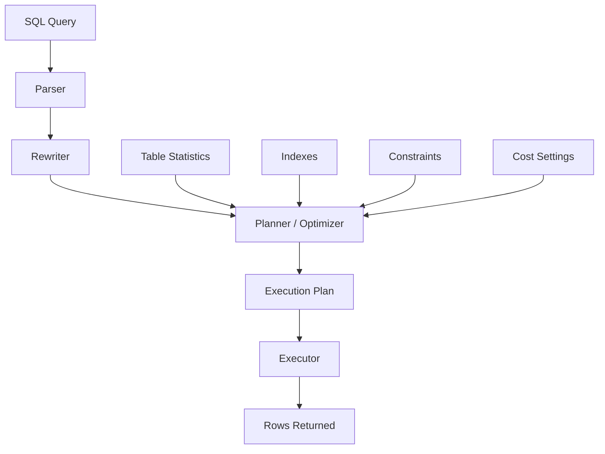
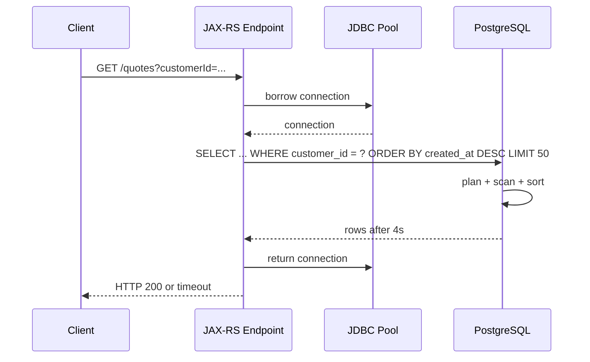
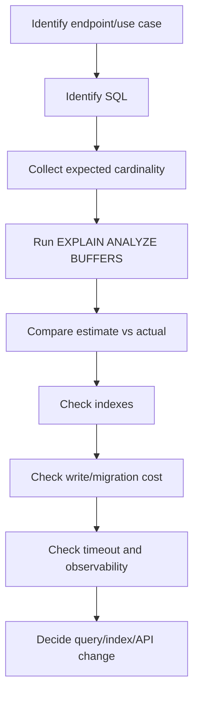

# Part 067 — Indexing, Query Performance, and EXPLAIN

> Fokus part ini: memahami bagaimana PostgreSQL mengeksekusi query, bagaimana index membantu atau justru tidak dipakai, bagaimana membaca `EXPLAIN`, dan bagaimana mereview query/index change agar aman untuk production JAX-RS service.

Database performance bug jarang terlihat sebagai "database bug" di permukaan.

Di JAX-RS service, ia biasanya muncul sebagai:

- endpoint lambat
- timeout di API gateway
- connection pool habis
- Kafka consumer lag karena query lambat
- CPU database naik
- lock wait meningkat
- batch job melewati window
- autoscaling aplikasi tidak membantu
- retry memperparah load

Senior engineer harus bisa menjawab:

```text
Apakah query lambat karena tidak ada index,
index salah,
query shape salah,
statistics salah,
locking,
I/O,
atau karena endpoint melakukan terlalu banyak query?
```

Indexing bukan sekadar "tambahkan index".

Index adalah trade-off antara read performance, write cost, storage, migration risk, and planner behavior.

---

## 1. Core Mental Model

PostgreSQL tidak mengeksekusi SQL langsung secara naif.

Ia membuat rencana eksekusi.



Planner memilih cara paling murah menurut cost model.

Cost model dipengaruhi oleh:

- table size
- row count estimate
- column statistics
- index availability
- selectivity
- join cardinality
- sort cost
- memory work area
- random vs sequential I/O estimate
- parallel query eligibility

Invariant penting:

```text
Index hanya berguna jika query shape dan data distribution membuat planner memilih index tersebut.
```

Index yang ada belum tentu dipakai.

Index yang dipakai belum tentu membuat query lebih cepat.

---

## 2. Query Performance in JAX-RS Lifecycle

Query lambat bukan hanya masalah database.

Ia memakan resource aplikasi.



If query takes 4 seconds:

- request thread is occupied
- connection is occupied
- client may timeout
- gateway may timeout
- retry may create duplicate pressure
- database CPU/I/O may spike
- other endpoints may starve

Production rule:

```text
A slow query is a concurrency bug, not only a latency bug.
```

---

## 3. What Makes a Query Slow

Common causes:

| Cause | Symptom | Example |
|---|---|---|
| Missing index | sequential scan on large table | `WHERE customer_id = ?` without index |
| Low-selectivity filter | index ignored | `WHERE status = 'ACTIVE'` on 90% of rows |
| Wrong index order | sort still expensive | index on `(created_at, customer_id)` for customer lookup |
| Function on column | index not usable normally | `WHERE lower(email) = ?` without expression index |
| Type mismatch | implicit cast blocks index usage | `WHERE id::text = ?` |
| OR condition | planner chooses seq scan | `a = ? OR b = ?` |
| Leading wildcard | B-tree useless | `LIKE '%abc'` |
| Large sort | memory spill | `ORDER BY` without supporting index |
| Bad join estimate | wrong join algorithm | stale statistics |
| N+1 query | endpoint does many small queries | loop calls mapper per item |
| Lock wait | query appears slow but waits | blocked update/select for update |
| Long transaction | vacuum/index efficiency degraded | transaction open for minutes |

Senior review must not stop at "add index".

It must ask:

```text
What is the query shape?
What is the expected cardinality?
What is the data growth pattern?
What is the write cost?
What happens during migration?
```

---

## 4. Table Scan, Index Scan, Bitmap Scan

PostgreSQL can read rows in several ways.

### 4.1 Sequential Scan

Reads many or all table pages.

Good when:

- table is small
- predicate matches large percentage of rows
- no useful index exists
- sequential I/O is cheaper than random lookup

Bad when:

- table is large
- predicate is selective
- endpoint is latency-sensitive

Example smell:

```text
Seq Scan on quote  (cost=0.00..120000.00 rows=50 width=...)
  Filter: (customer_id = 'C-123'::text)
```

### 4.2 Index Scan

Uses index to find matching row references, then fetches table rows.

Good when predicate is selective.

Possible downside:

- random heap access
- many heap fetches
- may be slower than seq scan if many rows match

### 4.3 Index Only Scan

Reads from index without fetching table rows, if visibility map allows it and requested columns are covered.

Good for:

- existence check
- pagination metadata
- narrow projection
- frequently queried lookup

But index-only scan depends on vacuum/visibility.

### 4.4 Bitmap Index Scan + Bitmap Heap Scan

Builds bitmap of matching row locations, then fetches heap pages efficiently.

Useful when:

- multiple indexes are combined
- predicate matches moderate rows
- index scan would random-read too much

---

## 5. B-tree Index

B-tree is the default PostgreSQL index type.

Good for:

- equality
- range query
- sorting
- prefix `LIKE 'abc%'`
- unique constraint
- pagination by ordered key

Example:

```sql
CREATE INDEX idx_quote_customer_created_at
ON quote (customer_id, created_at DESC);
```

Supports query:

```sql
SELECT id, quote_number, status, created_at
FROM quote
WHERE customer_id = ?
ORDER BY created_at DESC
LIMIT 50;
```

The index order matters.

A composite B-tree index is most useful from left to right.

```text
Index: (customer_id, status, created_at DESC)

Good:
WHERE customer_id = ?
WHERE customer_id = ? AND status = ?
WHERE customer_id = ? AND status = ? ORDER BY created_at DESC

Less useful:
WHERE status = ?
WHERE created_at > ?
ORDER BY created_at DESC without customer_id/status predicate
```

---

## 6. Composite Index Design

Composite index design should follow query shape.

General ordering heuristic:

```text
Equality filters first,
then range filters,
then sort columns,
then included/projected columns if needed.
```

Example enterprise query:

```sql
SELECT id, quote_number, status, total_amount, created_at
FROM quote
WHERE tenant_id = ?
  AND customer_id = ?
  AND status IN ('DRAFT', 'PENDING_APPROVAL')
  AND created_at >= ?
ORDER BY created_at DESC
LIMIT 50;
```

Candidate index:

```sql
CREATE INDEX idx_quote_tenant_customer_status_created_at
ON quote (tenant_id, customer_id, status, created_at DESC);
```

But if `status` has low selectivity and multiple statuses are common, another candidate may be better:

```sql
CREATE INDEX idx_quote_tenant_customer_created_at
ON quote (tenant_id, customer_id, created_at DESC);
```

You cannot decide purely from syntax.

You need:

- data distribution
- actual row count
- common query patterns
- sort requirement
- write frequency
- index size
- plan evidence

---

## 7. Covering Index and INCLUDE

PostgreSQL supports included columns.

```sql
CREATE INDEX idx_quote_tenant_customer_created_at_inc
ON quote (tenant_id, customer_id, created_at DESC)
INCLUDE (quote_number, status, total_amount);
```

Included columns are not part of search ordering.

They help index-only scans for projection.

Useful when:

- endpoint returns a list view
- only a few columns are needed
- table row is wide
- high read volume justifies larger index

Trade-off:

- larger index
- more write cost
- more cache pressure
- migration time

PR review question:

```text
Is this index designed for a specific high-value query, or is it an accidental copy of the SELECT list?
```

---

## 8. Partial Index

Partial index indexes only rows matching a predicate.

Example:

```sql
CREATE INDEX idx_quote_active_customer_created_at
ON quote (tenant_id, customer_id, created_at DESC)
WHERE deleted_at IS NULL;
```

Good when many queries only touch active/non-deleted rows.

Another example:

```sql
CREATE INDEX idx_order_pending_fulfillment
ON customer_order (tenant_id, created_at)
WHERE status = 'PENDING_FULFILLMENT';
```

Good for operational queue-like queries.

Failure mode:

```text
Query predicate must imply partial index predicate.
```

If query omits `deleted_at IS NULL`, planner may not use the index.

Internal verification:

- Does code always add tenant filter?
- Does repository always add soft-delete filter?
- Does dynamic SQL sometimes omit the partial predicate?

---

## 9. Expression Index

Expression index helps when query uses a function/expression.

Example:

```sql
CREATE INDEX idx_customer_lower_email
ON customer (lower(email));
```

Supports:

```sql
SELECT id
FROM customer
WHERE lower(email) = lower(?);
```

Common expression index use cases:

- case-insensitive email lookup
- normalized phone number
- extracted JSONB field
- date bucketing

But expression index is a commitment.

It couples the index to exact expression shape.

Bad:

```sql
WHERE lower(trim(email)) = ?
```

May not use index on `lower(email)`.

PR review:

```text
Is normalization done at write-time instead of repeatedly at query-time?
```

Often better:

```text
Store normalized column + index it.
```

---

## 10. Unique Index and Constraint Semantics

Unique index enforces correctness, not only speed.

Example:

```sql
CREATE UNIQUE INDEX uq_quote_tenant_quote_number
ON quote (tenant_id, quote_number);
```

This protects tenant-scoped uniqueness.

Important distinction:

```text
A uniqueness rule that matters for correctness should live in database constraint/index,
not only in Java pre-check.
```

Java pre-check is race-prone:

```text
Request A checks quote_number available
Request B checks quote_number available
Both insert
Duplicate happens unless DB enforces uniqueness
```

Correct pattern:

- try insert/update
- let DB enforce uniqueness
- map SQL unique violation to domain/API error

---

## 11. GIN and JSONB Indexing

GIN indexes are commonly used for JSONB containment and array-like search.

Example:

```sql
CREATE INDEX idx_product_catalog_attrs_gin
ON product_catalog_item
USING gin (attributes jsonb_path_ops);
```

Supports queries like:

```sql
SELECT id
FROM product_catalog_item
WHERE attributes @> '{"category":"mobile-plan"}'::jsonb;
```

JSONB indexing is powerful but dangerous when abused.

Questions:

- Is JSONB used for flexible attributes or avoiding schema design?
- Are query fields stable enough to deserve generated columns?
- Is field cardinality understood?
- Are updates frequent?
- Is indexing the full JSON blob too broad?

Alternative:

```sql
ALTER TABLE product_catalog_item
ADD COLUMN category text GENERATED ALWAYS AS (attributes->>'category') STORED;

CREATE INDEX idx_product_catalog_category
ON product_catalog_item (tenant_id, category);
```

Generated column can improve clarity and B-tree usability.

---

## 12. Full-Text Search Indexing

For full-text search, avoid naive `ILIKE '%term%'` on large tables.

Better pattern:

```sql
ALTER TABLE quote_search
ADD COLUMN search_vector tsvector;

CREATE INDEX idx_quote_search_vector
ON quote_search
USING gin (search_vector);
```

Query:

```sql
SELECT quote_id
FROM quote_search
WHERE tenant_id = ?
  AND search_vector @@ plainto_tsquery('english', ?)
LIMIT 50;
```

Important concerns:

- language configuration
- stemming
- tokenization
- ranking
- update strategy
- tenant filter
- result ordering
- search relevance vs exact filtering

For enterprise CPQ/order-style systems, search often mixes:

- exact identifier lookup
- customer/account lookup
- product/catalog attributes
- free-text description
- status/date filters

A single index rarely solves all.

---

## 13. Trigram Index for Fuzzy Search

For partial text search, PostgreSQL `pg_trgm` can help.

Example:

```sql
CREATE EXTENSION IF NOT EXISTS pg_trgm;

CREATE INDEX idx_customer_name_trgm
ON customer
USING gin (name gin_trgm_ops);
```

Supports:

```sql
SELECT id, name
FROM customer
WHERE name ILIKE '%' || ? || '%'
LIMIT 20;
```

Trade-offs:

- index can be large
- write overhead increases
- fuzzy search can still be expensive
- tenant filter may need separate strategy

Better for user-facing search than core transactional lookup.

---

## 14. BRIN Index for Large Ordered Tables

BRIN index is useful for huge tables where physical order correlates with column value.

Example:

```sql
CREATE INDEX idx_audit_event_created_at_brin
ON audit_event
USING brin (created_at);
```

Good for:

- append-only audit table
- time-series events
- archival scans
- large log-like tables

Not good for highly random data.

BRIN is small and cheap, but less precise than B-tree.

---

## 15. Sorting and ORDER BY

Sorting can dominate query cost.

Example smell:

```text
Sort  (cost=90000..92000 rows=800000)
  Sort Key: created_at DESC
  -> Seq Scan on quote ...
```

If endpoint always asks:

```sql
WHERE tenant_id = ? AND customer_id = ?
ORDER BY created_at DESC
LIMIT 50
```

Then index should likely align with filter and sort:

```sql
CREATE INDEX idx_quote_tenant_customer_created_at
ON quote (tenant_id, customer_id, created_at DESC);
```

But beware:

```sql
ORDER BY lower(customer_name)
```

May require expression index or materialized normalized column.

Also beware random sorting:

```sql
ORDER BY random()
```

This is production-hostile on large tables.

---

## 16. Pagination Performance

Offset pagination gets slower as offset grows.

```sql
SELECT id, created_at
FROM quote
WHERE tenant_id = ?
ORDER BY created_at DESC
LIMIT 50 OFFSET 100000;
```

Database still needs to skip many rows.

Cursor/keyset pagination is usually better:

```sql
SELECT id, created_at
FROM quote
WHERE tenant_id = ?
  AND (created_at, id) < (?, ?)
ORDER BY created_at DESC, id DESC
LIMIT 50;
```

Supporting index:

```sql
CREATE INDEX idx_quote_tenant_created_id
ON quote (tenant_id, created_at DESC, id DESC);
```

Invariant:

```text
Cursor pagination requires stable deterministic ordering.
```

Do not paginate only by `created_at` if multiple rows can share the same timestamp.

Use tie-breaker like `id`.

---

## 17. Count Query Problem

Many list APIs return total count.

```sql
SELECT count(*)
FROM quote
WHERE tenant_id = ? AND status = ?;
```

On large datasets, count can be expensive.

Options:

- avoid total count
- return `hasNext`
- cache approximate count
- maintain aggregate table
- use async report endpoint
- constrain filter and time window

PR review question:

```text
Does the API really need exact total count on every page request?
```

For enterprise systems, exact count can be useful for reports but harmful for interactive API paths.

Separate interactive query from reporting query.

---

## 18. Projection and Wide Rows

Avoid selecting wide rows when endpoint needs only list summary.

Bad:

```sql
SELECT *
FROM quote
WHERE tenant_id = ?
ORDER BY created_at DESC
LIMIT 50;
```

Better:

```sql
SELECT id, quote_number, status, total_amount, currency, created_at
FROM quote
WHERE tenant_id = ?
ORDER BY created_at DESC
LIMIT 50;
```

Why it matters:

- less heap I/O
- less network transfer
- less JSON serialization cost
- less memory allocation in JVM
- possible index-only scan

JAX-RS endpoint performance includes database + mapping + serialization.

---

## 19. N+1 Query Pattern

Classic service-layer bug:

```java
List<QuoteRow> quotes = quoteMapper.findRecentQuotes(tenantId);

for (QuoteRow quote : quotes) {
    List<LineItemRow> lines = lineItemMapper.findByQuoteId(quote.id());
    quote.attachLines(lines);
}
```

If 50 quotes, this creates 51 queries.

Better options:

- join query
- batch fetch by IDs
- aggregate query
- two-step query with `WHERE quote_id = ANY (?)`
- dedicated read model

Example batch fetch:

```sql
SELECT *
FROM quote_line_item
WHERE tenant_id = ?
  AND quote_id = ANY (?);
```

Review smell:

```text
Repository/mapper call inside loop.
```

---

## 20. `EXPLAIN` Basics

Use `EXPLAIN` to see plan.

```sql
EXPLAIN
SELECT id, quote_number
FROM quote
WHERE tenant_id = 't1'
  AND customer_id = 'c1'
ORDER BY created_at DESC
LIMIT 50;
```

Use `EXPLAIN ANALYZE` to execute and measure.

```sql
EXPLAIN (ANALYZE, BUFFERS)
SELECT id, quote_number
FROM quote
WHERE tenant_id = 't1'
  AND customer_id = 'c1'
ORDER BY created_at DESC
LIMIT 50;
```

Important fields:

- node type
- estimated cost
- estimated rows
- actual time
- actual rows
- loops
- buffers hit/read/dirtied
- sort method
- planning time
- execution time

Warning:

```text
EXPLAIN ANALYZE executes the query.
```

Do not run it casually for destructive statements in shared environments.

Use transaction rollback or safe replica when appropriate.

---

## 21. Reading Plan Estimates vs Actuals

Example:

```text
Index Scan using idx_quote_tenant_customer_created_at on quote
  (cost=0.42..120.10 rows=50 width=64)
  (actual time=0.080..2.120 rows=50 loops=1)
```

Good sign:

- estimated rows close to actual rows
- execution time acceptable
- index supports order/filter

Bad sign:

```text
(cost rows=10) but (actual rows=500000)
```

This means planner estimate is wrong.

Possible causes:

- stale statistics
- correlated columns
- skewed tenant data
- expression statistics missing
- generic prepared statement plan

Wrong estimates lead to wrong join order and scan choices.

---

## 22. Buffers: Memory vs Disk

`BUFFERS` shows page access.

Example:

```text
Buffers: shared hit=120 read=350
```

Meaning:

- `hit`: page found in shared buffer cache
- `read`: page read from disk/storage
- high read means I/O pressure

A query can be fast in staging because all data is cached.

Production may be slower with larger data and colder cache.

Performance review must consider:

- staging data volume
- cache warmness
- tenant distribution
- production index bloat
- storage latency

---

## 23. Sort Spill

Sort can spill to disk.

Example:

```text
Sort Method: external merge  Disk: 512000kB
```

This means sort exceeded memory.

Possible fixes:

- add supporting index
- reduce result size
- change pagination
- reduce selected columns
- tune `work_mem` carefully
- move reporting workload away from OLTP path

Do not blindly increase `work_mem` globally.

`work_mem` is per operation and can multiply across connections.

---

## 24. Join Algorithm

PostgreSQL commonly uses:

- nested loop
- hash join
- merge join

Nested loop can be good for small outer rows and indexed inner lookup.

Bad nested loop example:

```text
Nested Loop
  -> Seq Scan on quote rows=500000
  -> Index Scan on quote_line_item loops=500000
```

This can explode.

Hash join can be good for larger joins, but needs memory.

Merge join can be good when inputs are sorted.

Senior review:

```text
Are we joining transactional tables in an endpoint path where a read model would be safer?
```

---

## 25. Statistics and ANALYZE

PostgreSQL planner depends on statistics.

Statistics are updated by autovacuum/analyze.

Problems occur when:

- table changes rapidly
- data distribution is skewed
- tenant sizes differ dramatically
- correlated columns are filtered together

Manual command:

```sql
ANALYZE quote;
```

Extended statistics can help correlated columns:

```sql
CREATE STATISTICS st_quote_tenant_status
ON tenant_id, status
FROM quote;

ANALYZE quote;
```

Internal verification:

- autovacuum settings
- analyze frequency
- table bloat
- skewed tenant data
- query plans for largest tenants

---

## 26. Prepared Statements and Generic Plans

Java apps often use prepared statements.

Prepared statements can use custom or generic plans.

Problem pattern:

```text
Small tenant and large tenant use same prepared statement.
Planner chooses generic plan.
Generic plan is bad for large tenant or small tenant.
```

Example:

```sql
WHERE tenant_id = ? AND status = ?
```

If tenant distribution is skewed, one plan may not fit all.

Symptoms:

- query fast for some tenants, slow for others
- plan in psql differs from app plan
- latency distribution has tenant-specific outliers

Debug requires evidence from actual app path.

---

## 27. Tenant-Aware Indexing

In multi-tenant systems, most transactional tables should be tenant-aware.

Common index prefix:

```sql
(tenant_id, ...business_filter..., ...sort...)
```

Why:

- tenant isolation
- query selectivity
- predictable pagination
- reduced cross-tenant scans
- easier data retention/export

But do not blindly put `tenant_id` first on every index.

Ask:

- Is every query tenant-scoped?
- Is there a global admin query?
- Does partitioning by tenant exist?
- Are large tenants much larger than small tenants?
- Are operational jobs tenant-batched?

For CPQ/order-style systems, tenant/customer/catalog dimensions often drive access pattern.

Internal verification must confirm actual tenancy model.

---

## 28. Indexes and Write Cost

Every index adds write overhead.

On insert/update/delete:

- table row changes
- every relevant index must update
- WAL volume increases
- replication lag may increase
- vacuum work increases
- storage grows

Example problem:

```text
Table has 18 indexes.
Insert-heavy order line item table becomes slow.
```

Review question:

```text
Which query needs this index, and how often does that query run compared to writes?
```

Index strategy is workload strategy.

---

## 29. Index Bloat and Maintenance

Indexes can bloat due to updates/deletes.

Symptoms:

- index size much larger than expected
- query slows over time
- vacuum cannot keep up
- cache efficiency drops

Operations:

```sql
REINDEX INDEX CONCURRENTLY idx_quote_tenant_created_at;
```

But maintenance has risk.

Internal verification:

- bloat monitoring
- maintenance window
- reindex playbook
- vacuum settings
- table churn patterns

---

## 30. Creating Indexes Safely in Production

Avoid blocking writes on large tables.

Use:

```sql
CREATE INDEX CONCURRENTLY idx_quote_tenant_customer_created_at
ON quote (tenant_id, customer_id, created_at DESC);
```

Important:

- cannot run inside normal transaction block
- takes longer
- can fail and leave invalid index
- still consumes CPU/I/O
- must be scheduled and monitored

Check invalid indexes:

```sql
SELECT indexrelid::regclass AS index_name, indisvalid, indisready
FROM pg_index
WHERE NOT indisvalid OR NOT indisready;
```

Production migration review must explicitly decide concurrent vs non-concurrent index creation.

---

## 31. Dropping Indexes Safely

Dropping an index can break hidden query performance.

Use evidence:

- index usage stats
- query logs
- dashboards
- workload inventory
- time window long enough

Stats example:

```sql
SELECT schemaname, relname, indexrelname, idx_scan
FROM pg_stat_user_indexes
WHERE relname = 'quote'
ORDER BY idx_scan ASC;
```

But `idx_scan = 0` is not enough.

Index may be used only during:

- month-end billing
- reconciliation
- customer migration
- rare incident recovery
- annual reporting

Internal verification must include business workload calendar.

---

## 32. Slow Query Logging

Useful PostgreSQL settings include:

```text
log_min_duration_statement
log_lock_waits
deadlock_timeout
```

Production systems often aggregate query fingerprints via tools such as `pg_stat_statements`.

Useful questions:

- top queries by total time
- top queries by mean time
- top queries by calls
- top queries by rows scanned
- top queries by temp bytes
- top queries by lock wait

Endpoint debugging should map:

```text
HTTP endpoint -> service method -> mapper/query id -> SQL fingerprint -> plan
```

If you cannot map endpoint to query, observability is incomplete.

---

## 33. `pg_stat_statements`

`pg_stat_statements` helps identify expensive query patterns.

Example:

```sql
SELECT queryid,
       calls,
       total_exec_time,
       mean_exec_time,
       rows,
       query
FROM pg_stat_statements
ORDER BY total_exec_time DESC
LIMIT 20;
```

Look for:

- high total time
- high mean time
- high call count
- high variance
- queries returning too many rows

Do not optimize only the slowest single query.

Optimize highest production impact.

```text
Impact = frequency × cost × business criticality × blast radius
```

---

## 34. Query Timeout and Statement Timeout

Application timeout must align with DB timeout.

Options:

- JDBC query timeout
- PostgreSQL `statement_timeout`
- transaction timeout in framework
- gateway timeout
- client timeout

Bad hierarchy:

```text
Gateway timeout: 30s
JAX-RS timeout: none
DB statement timeout: none
```

Client gives up, but DB keeps working.

Better hierarchy:

```text
DB statement timeout < app request timeout < gateway timeout < client timeout
```

Exact values depend on platform standards.

Internal verification required.

---

## 35. API Query Design and Database Cost

API design can force bad query plans.

Dangerous API features:

- arbitrary filtering on any field
- arbitrary sorting on any field
- unbounded page size
- partial response that hides expensive joins
- full-text search mixed with transactional filters
- reporting query on OLTP endpoint

Governance rule:

```text
Every public query parameter should map to a known indexed/query strategy.
```

For high-value flexible search, consider:

- dedicated search endpoint
- indexed read model
- materialized view
- search engine
- async export/report

---

## 36. Common JAX-RS Endpoint Performance Smells

Smells:

```text
GET /quotes?sortBy=anyColumn&filter=arbitraryExpression
GET /orders returns nested full aggregate graph by default
GET /catalog/items with no limit
GET /audit-events with wide time range
GET endpoint runs multiple mapper calls in loops
POST endpoint does synchronous heavy search before response
```

Good patterns:

- explicit filter grammar
- max limit
- stable sort fields
- cursor pagination
- narrow response DTO
- bulk fetch instead of N+1
- async report for expensive queries
- separate read model for complex views

---

## 37. Query Plan Review Workflow

When reviewing a query performance change:



Evidence to attach in PR:

- query shape
- old plan
- new plan
- dataset size
- expected production cardinality
- index size estimate
- migration safety note
- rollback/drop index strategy

---

## 38. Index Naming Convention

Index names should reveal intent.

Bad:

```sql
CREATE INDEX idx1 ON quote (tenant_id, customer_id);
```

Better:

```sql
CREATE INDEX idx_quote_tenant_customer_created_at
ON quote (tenant_id, customer_id, created_at DESC);
```

For partial index:

```sql
CREATE INDEX idx_quote_active_tenant_customer_created_at
ON quote (tenant_id, customer_id, created_at DESC)
WHERE deleted_at IS NULL;
```

Naming helps:

- debugging plans
- migration review
- incident communication
- duplicate index detection

---

## 39. Duplicate and Overlapping Indexes

Overlapping indexes waste write capacity.

Example:

```text
idx_quote_tenant_customer: (tenant_id, customer_id)
idx_quote_tenant_customer_created: (tenant_id, customer_id, created_at)
```

The second may cover the first for many queries.

But not always.

Consider:

- index size
- uniqueness
- order direction
- partial predicate
- include columns
- query usage

Do not remove without evidence.

---

## 40. Partitioning Interaction

Partitioning can help large tables, but it is not a substitute for indexing.

Common partitioning dimensions:

- time
- tenant
- region
- lifecycle/status

Risks:

- query does not prune partitions
- too many partitions
- global uniqueness complexity
- migration complexity
- operational burden

Question:

```text
Does the query include partition key so PostgreSQL can prune?
```

If not, partitioning may make query worse.

---

## 41. Read Replica and Reporting Workload

Some queries should not run on primary OLTP database.

Candidates:

- heavy report
- export
- audit search
- reconciliation scan
- analytical dashboard

Options:

- read replica
- reporting database
- materialized view
- OLAP pipeline
- search index

But read replica has lag.

Endpoint must define consistency requirement:

```text
strong consistency needed?
read-your-write needed?
eventual consistency acceptable?
```

For quote/order mutation flow, strong consistency may be required.

For dashboards, lag may be acceptable.

---

## 42. Production Debugging Checklist

When endpoint latency spikes:

1. Identify endpoint and time window.
2. Check p95/p99 latency and error rate.
3. Check connection pool active/pending/timeout.
4. Check DB CPU/I/O.
5. Check slow query fingerprints.
6. Check lock waits.
7. Check recent deployment/migration.
8. Check query plan changes.
9. Check row count/cardinality growth.
10. Check tenant/customer-specific skew.
11. Check retry amplification.
12. Check cache hit/miss change.
13. Check if gateway/client retry created thundering herd.

Do not tune blindly during incident.

Stabilize first:

- reduce traffic
- disable expensive feature
- increase timeout only if safe
- kill runaway query if needed
- rollback bad release/migration
- shed load

---

## 43. Java/JDBC Observability for SQL

Application should emit enough context:

- endpoint route
- use case name
- mapper/query id
- SQL fingerprint or query name
- execution duration
- rows returned/affected
- timeout/error classification
- DB host/pool name
- correlation/trace ID

Avoid logging raw SQL with sensitive parameters.

Better:

```text
queryName=QuoteMapper.findRecentByCustomer
elapsedMs=42
rowCount=50
tenantIdHash=...
traceId=...
```

Parameter logging must follow PII/security rules.

---

## 44. PR Review Checklist

For a new or changed query:

- Is there a bounded result size?
- Is pagination stable?
- Is sorting supported by index?
- Are filters aligned with known index strategy?
- Is tenant filter present where required?
- Is soft-delete/lifecycle predicate present where required?
- Is projection narrow?
- Is there any mapper call inside loop?
- Is exact count required?
- Is query used in hot API path, batch job, or report?
- Is timeout defined?
- Is query observable by name/fingerprint?

For a new index:

- Which query needs it?
- What is expected cardinality?
- What is write overhead?
- Is it duplicate/overlapping?
- Should it be partial/expression/covering?
- Does migration use `CONCURRENTLY` if needed?
- Is rollback/drop strategy known?
- Was `EXPLAIN ANALYZE BUFFERS` captured?

---

## 45. Internal Verification Checklist

Verify in internal CSG/codebase context:

- PostgreSQL version.
- Managed database platform or self-managed database.
- Use of `pg_stat_statements`.
- Slow query logging configuration.
- Query timeout and statement timeout policy.
- Index naming convention.
- Migration tool behavior for concurrent indexes.
- Whether production query plans can be sampled safely.
- Whether read replicas are used.
- Whether tenant filter is mandatory.
- Whether soft delete is common.
- Whether catalog/pricing/order tables have effective-date query patterns.
- Whether there is a DB performance dashboard.
- Whether PRs require `EXPLAIN` evidence.
- Whether MyBatis mapper IDs are visible in logs/traces.
- Whether DBAs/platform team own certain index changes.

Do not assume internal schema or table names.

Use this part as a verification map.

---

## 46. Senior Engineer Mental Model

A junior view:

```text
Endpoint slow -> add index.
```

A senior view:

```text
Endpoint slow -> identify query shape, cardinality, plan, index fit,
transaction context, pool pressure, API design, timeout hierarchy,
write cost, migration risk, and observability gap.
```

A principal-level view:

```text
Query performance is a contract between API design, data model,
workload growth, operational visibility, and release governance.
```

---

## 47. Key Takeaways

- Indexing is workload-specific, not schema-decoration.
- `EXPLAIN ANALYZE BUFFERS` is required evidence for serious tuning.
- Composite index order must match equality/range/sort pattern.
- Offset pagination can become unbounded database work.
- Exact count can be expensive and should be justified.
- N+1 mapper calls are endpoint scalability bugs.
- Indexes improve reads but cost writes, storage, WAL, and maintenance.
- Production-safe index migration matters as much as index design.
- API governance and database performance are connected.
- Query performance bugs often surface as JAX-RS timeout or connection pool exhaustion.

---

## 48. Next Part

Next: `part-068-mybatis-mapper-dynamic-sql.mdx`.

We will move from PostgreSQL query tuning into MyBatis mapper design, dynamic SQL, parameter binding, result mapping, SQL safety, and PR review patterns.
