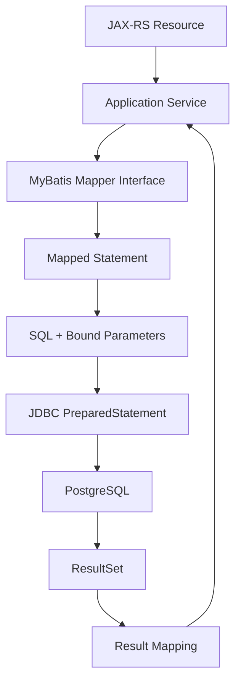
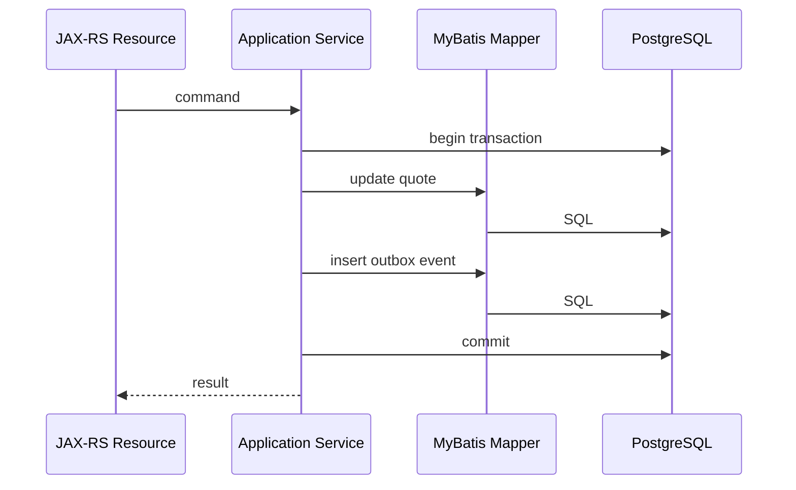
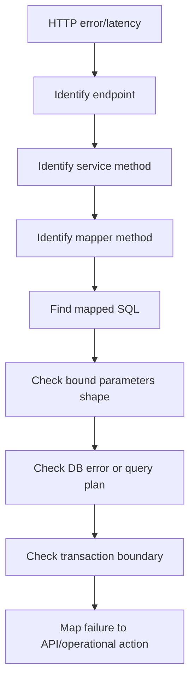

# Part 068 — MyBatis Mapper and Dynamic SQL

> Fokus part ini: memahami MyBatis sebagai data access layer yang memberi kontrol SQL eksplisit, bagaimana mapper bekerja, bagaimana dynamic SQL dapat membantu atau merusak reviewability, dan bagaimana mereview MyBatis query untuk production JAX-RS service.

MyBatis bukan ORM penuh seperti Hibernate/JPA.

MyBatis lebih dekat ke:

```text
SQL-first persistence mapper.
```

Artinya:

- developer menulis SQL secara eksplisit
- MyBatis melakukan parameter binding
- MyBatis memetakan result set ke object Java
- transaction biasanya dikendalikan oleh framework/container/service layer
- performance sangat bergantung pada SQL yang ditulis

Ini memberi kontrol tinggi.

Tetapi juga berarti bug SQL, dynamic query, mapping, dan transaction boundary menjadi tanggung jawab engineer secara langsung.

---

## 1. Core Mental Model

MyBatis berada antara application service dan JDBC.



Important invariant:

```text
MyBatis does not make bad SQL good.
It makes explicit SQL easier to bind, organize, and map.
```

Senior engineer must review MyBatis code as SQL + Java boundary, not as ordinary Java method call.

---

## 2. Why MyBatis Exists

MyBatis is useful when a system needs:

- explicit SQL control
- advanced PostgreSQL features
- predictable query shape
- stored procedure/function calls
- dynamic query construction
- fine-tuned result mapping
- no heavy ORM session model
- direct alignment with existing schema

It is common in enterprise systems where data access must be transparent and reviewable.

Trade-off:

| Strength | Cost |
|---|---|
| SQL is explicit | More SQL must be maintained |
| Easy to use database-specific features | Less database portability |
| Predictable query behavior | Developer must understand query plans |
| No hidden ORM lazy loading | Manual mapping/joins required |
| Good for complex reporting/query | Dynamic SQL can become unreadable |

---

## 3. Mapper Interface

A mapper interface defines Java methods.

Example:

```java
public interface QuoteMapper {
    QuoteRow findById(@Param("tenantId") String tenantId,
                      @Param("quoteId") UUID quoteId);

    List<QuoteSummaryRow> findRecentByCustomer(@Param("tenantId") String tenantId,
                                                @Param("customerId") String customerId,
                                                @Param("limit") int limit);
}
```

The method itself is not the implementation.

MyBatis binds it to a mapped statement by:

- XML namespace + statement id
- annotation-based SQL
- mapper scanning configuration

The hidden part is still explicit in configuration.

Internal verification:

- Are mappers XML-based or annotation-based?
- Are mapper interfaces scanned explicitly?
- Is mapper namespace consistent with interface FQCN?
- Are mapper IDs visible in logs/traces?

---

## 4. XML Mapper

Example XML mapper:

```xml
<mapper namespace="com.example.quote.QuoteMapper">

  <select id="findById" resultMap="QuoteRowMap">
    SELECT id,
           tenant_id,
           quote_number,
           status,
           created_at,
           updated_at
    FROM quote
    WHERE tenant_id = #{tenantId}
      AND id = #{quoteId}
  </select>

</mapper>
```

`namespace + id` identifies the statement.

```text
com.example.quote.QuoteMapper.findById
```

This identifier should appear in error messages/logs if instrumentation is good.

---

## 5. Annotation-Based Mapper

MyBatis also supports annotation SQL.

```java
@Select("""
    SELECT id, tenant_id, quote_number, status
    FROM quote
    WHERE tenant_id = #{tenantId}
      AND id = #{quoteId}
    """)
QuoteRow findById(@Param("tenantId") String tenantId,
                  @Param("quoteId") UUID quoteId);
```

Annotation SQL can be fine for simple queries.

But XML is often better for:

- long SQL
- reusable fragments
- dynamic SQL
- complex result maps
- stored procedure calls
- vendor-specific SQL

PR review question:

```text
Is the SQL still readable and diff-friendly?
```

---

## 6. `#{}` vs `${}`

This is one of the most important MyBatis distinctions.

### 6.1 Safe Parameter Binding: `#{}`

```xml
WHERE quote_number = #{quoteNumber}
```

MyBatis binds value as prepared statement parameter.

Equivalent mental model:

```sql
WHERE quote_number = ?
```

Good for values.

### 6.2 Raw Text Substitution: `${}`

```xml
ORDER BY ${sortColumn}
```

MyBatis injects raw text into SQL.

Dangerous if input is not strictly allowlisted.

Never use `${}` with raw user input.

Bad:

```xml
WHERE quote_number = '${quoteNumber}'
```

This is SQL injection risk.

Allowed pattern only with strict enum/allowlist:

```java
String sortColumn = switch (request.sortBy()) {
    case CREATED_AT -> "created_at";
    case UPDATED_AT -> "updated_at";
    case QUOTE_NUMBER -> "quote_number";
};
```

Then:

```xml
ORDER BY ${sortColumn} ${sortDirection}
```

But even then, review carefully.

---

## 7. Parameter Object Pattern

For many query parameters, avoid huge mapper method signatures.

Instead:

```java
public record QuoteSearchCriteria(
    String tenantId,
    String customerId,
    String status,
    Instant createdFrom,
    Instant createdTo,
    int limit,
    String cursorCreatedAt,
    UUID cursorId
) {}
```

Mapper:

```java
List<QuoteSummaryRow> searchQuotes(QuoteSearchCriteria criteria);
```

Benefits:

- easier to evolve
- easier to validate before mapper
- easier to log/query-name
- easier to test dynamic combinations

Risk:

- criteria object becomes bag of optional everything
- SQL becomes arbitrary search engine
- index strategy becomes unclear

---

## 8. Result Mapping

Simple result mapping can map by property names.

But explicit result maps are safer for enterprise schemas.

```xml
<resultMap id="QuoteRowMap" type="com.example.quote.QuoteRow">
  <id property="id" column="id" />
  <result property="tenantId" column="tenant_id" />
  <result property="quoteNumber" column="quote_number" />
  <result property="status" column="status" />
  <result property="createdAt" column="created_at" />
</resultMap>
```

Advantages:

- explicit column-property boundary
- safer refactor
- easier to review
- avoids accidental mapping surprises

Common failure mode:

```text
Column alias missing -> property null -> business logic fails later.
```

Prefer failing close to the mapper with tests.

---

## 9. DTO vs Row vs Domain Object

Do not map SQL directly into API DTO by default.

Recommended boundary:

```text
SQL result row -> persistence/read row -> application/domain model -> API DTO
```

For read-only list queries, a dedicated read row can be acceptable:

```java
public record QuoteSummaryRow(
    UUID id,
    String quoteNumber,
    String status,
    BigDecimal totalAmount,
    String currency,
    Instant createdAt
) {}
```

Then service maps to API DTO.

Avoid:

```text
Database column shape dictates public API shape.
```

That creates compatibility problems.

---

## 10. Dynamic SQL Basics

MyBatis XML supports dynamic tags:

- `<if>`
- `<choose>` / `<when>` / `<otherwise>`
- `<where>`
- `<trim>`
- `<set>`
- `<foreach>`
- `<bind>`
- `<sql>` / `<include>`

Example:

```xml
<select id="searchQuotes" resultMap="QuoteSummaryMap">
  SELECT id, quote_number, status, total_amount, currency, created_at
  FROM quote
  <where>
    tenant_id = #{tenantId}
    <if test="customerId != null">
      AND customer_id = #{customerId}
    </if>
    <if test="status != null">
      AND status = #{status}
    </if>
  </where>
  ORDER BY created_at DESC, id DESC
  LIMIT #{limit}
</select>
```

Dynamic SQL is powerful.

But every optional branch creates another query shape.

Each query shape may need different index strategy.

---

## 11. Dynamic SQL Governance

Bad dynamic SQL:

```xml
<if test="anyField != null">
  AND ${anyField} = #{anyValue}
</if>
```

This is unsafe and unreviewable.

Better:

```xml
<choose>
  <when test="filterType == 'CUSTOMER_ID'">
    AND customer_id = #{filterValue}
  </when>
  <when test="filterType == 'QUOTE_NUMBER'">
    AND quote_number = #{filterValue}
  </when>
  <otherwise>
    AND 1 = 0
  </otherwise>
</choose>
```

Better still: validate and map enum before mapper.

Production rule:

```text
Dynamic SQL must be finite, allowlisted, and index-aware.
```

---

## 12. Dynamic WHERE with `<where>`

`<where>` automatically inserts `WHERE` and removes leading `AND`/`OR`.

Example:

```xml
<where>
  tenant_id = #{tenantId}
  <if test="status != null">
    AND status = #{status}
  </if>
</where>
```

But do not let mandatory constraints become optional.

Danger:

```xml
<where>
  <if test="tenantId != null">
    tenant_id = #{tenantId}
  </if>
</where>
```

If tenantId is null, query may scan cross-tenant data.

For tenant-scoped systems:

```text
tenant_id should usually be mandatory and non-dynamic.
```

Internal verification required for tenancy model.

---

## 13. Dynamic ORDER BY

Sorting usually requires raw SQL substitution because column names cannot be bound with `#{}`.

Unsafe:

```xml
ORDER BY ${sortBy} ${sortDirection}
```

Safe pattern:

```java
public enum QuoteSortField {
    CREATED_AT("created_at"),
    UPDATED_AT("updated_at"),
    QUOTE_NUMBER("quote_number");

    private final String sqlColumn;
}
```

Then service maps API input to enum.

Mapper receives already allowlisted SQL token or separate enum case.

Even safer with `<choose>`:

```xml
ORDER BY
<choose>
  <when test="sortBy == 'QUOTE_NUMBER'">quote_number</when>
  <when test="sortBy == 'UPDATED_AT'">updated_at</when>
  <otherwise>created_at</otherwise>
</choose>
<choose>
  <when test="sortDirection == 'ASC'">ASC</when>
  <otherwise>DESC</otherwise>
</choose>
```

Review must ensure sort fields are supported by indexes or intentionally limited.

---

## 14. Dynamic IN Clause with `<foreach>`

Example:

```xml
<select id="findByIds" resultMap="QuoteRowMap">
  SELECT id, tenant_id, quote_number, status
  FROM quote
  WHERE tenant_id = #{tenantId}
    AND id IN
    <foreach collection="ids" item="id" open="(" separator="," close=")">
      #{id}
    </foreach>
</select>
```

Problems:

- empty list creates invalid SQL or broad query if mishandled
- very large list can degrade performance
- query text/plan can become large
- parameter limit risk

Handle empty list before mapper.

For large IDs, consider:

- temporary table
- unnest array
- batching
- join against staging table

PostgreSQL alternative:

```sql
WHERE id = ANY (#{idsArray})
```

Exact implementation depends on type handler support.

---

## 15. Reusable SQL Fragments

MyBatis supports fragments:

```xml
<sql id="BaseQuoteColumns">
  id,
  tenant_id,
  quote_number,
  status,
  total_amount,
  currency,
  created_at,
  updated_at
</sql>

<select id="findById" resultMap="QuoteRowMap">
  SELECT <include refid="BaseQuoteColumns" />
  FROM quote
  WHERE tenant_id = #{tenantId}
    AND id = #{quoteId}
</select>
```

Good for consistency.

Risk:

- fragment becomes too broad
- list endpoint selects columns it does not need
- accidental coupling between queries

Review question:

```text
Does this fragment improve consistency or hide over-fetching?
```

---

## 16. Update Statements and `<set>`

Dynamic update:

```xml
<update id="updateQuotePatch">
  UPDATE quote
  <set>
    <if test="status != null">status = #{status},</if>
    <if test="totalAmount != null">total_amount = #{totalAmount},</if>
    updated_at = #{updatedAt}
  </set>
  WHERE tenant_id = #{tenantId}
    AND id = #{quoteId}
</update>
```

Risk:

- partial update violates domain invariants
- null means "not provided" vs "set null" ambiguity
- update without optimistic locking overwrites concurrent change

Consider optimistic locking:

```sql
WHERE tenant_id = #{tenantId}
  AND id = #{quoteId}
  AND version = #{expectedVersion}
```

Then check affected row count.

---

## 17. Affected Row Count Matters

For update/delete, mapper should return affected rows.

```java
int updateStatus(QuoteStatusUpdate update);
```

Service must interpret:

```java
int updated = quoteMapper.updateStatus(command);
if (updated == 0) {
    throw new QuoteNotFoundOrVersionConflictException(...);
}
if (updated > 1) {
    throw new DataIntegrityException(...);
}
```

Never ignore affected row count for critical mutation.

It encodes correctness.

---

## 18. Insert and Generated Keys

Example:

```xml
<insert id="insertQuote" useGeneratedKeys="true" keyProperty="id">
  INSERT INTO quote (
    tenant_id,
    quote_number,
    status,
    created_at
  ) VALUES (
    #{tenantId},
    #{quoteNumber},
    #{status},
    #{createdAt}
  )
</insert>
```

For PostgreSQL, `RETURNING` is often clearer:

```xml
<select id="insertQuoteReturning" resultMap="QuoteRowMap">
  INSERT INTO quote (
    tenant_id,
    quote_number,
    status,
    created_at
  ) VALUES (
    #{tenantId},
    #{quoteNumber},
    #{status},
    #{createdAt}
  )
  RETURNING id, tenant_id, quote_number, status, created_at
</select>
```

Internal convention must be verified.

---

## 19. ResultMap for Nested Objects

MyBatis can map nested associations/collections.

But be careful.

Nested mapping can hide additional queries or row multiplication.

Example risk:

```xml
<collection property="lineItems" ofType="LineItemRow" select="findLineItems" column="id" />
```

This may create N+1 queries.

Prefer explicit batch loading or join/read model when performance matters.

Review smell:

```text
Nested select in result map used in endpoint list path.
```

---

## 20. Join Mapping and Row Explosion

Join query:

```sql
SELECT q.id AS quote_id,
       q.quote_number,
       li.id AS line_item_id,
       li.product_code
FROM quote q
LEFT JOIN quote_line_item li
  ON li.tenant_id = q.tenant_id
 AND li.quote_id = q.id
WHERE q.tenant_id = #{tenantId}
  AND q.id = #{quoteId}
```

One quote with 100 line items returns 100 rows.

Mapping must collapse rows correctly.

For larger aggregates, consider:

- separate queries
- batch fetch
- JSON aggregation if appropriate
- read model
- endpoint shape redesign

Do not fetch full aggregate by default for list endpoint.

---

## 21. Type Handlers

MyBatis type handlers map between JDBC and Java types.

Use cases:

- enum mapping
- JSONB mapping
- array mapping
- UUID handling
- custom value object
- money/currency object

Example risk:

```text
Enum stored as ordinal -> enum reorder corrupts meaning.
```

Prefer stable string/code mapping.

Type handler review:

- null handling
- unknown value handling
- backward compatibility
- database type alignment
- error message clarity

---

## 22. PostgreSQL JSONB with MyBatis

Possible patterns:

1. Map JSONB to `String`.
2. Map JSONB to `JsonNode`.
3. Map JSONB to typed object through custom type handler.
4. Extract specific fields in SQL.

Example query:

```xml
<select id="findCatalogItemsByAttribute" resultMap="CatalogItemMap">
  SELECT id, tenant_id, product_code, attributes
  FROM product_catalog_item
  WHERE tenant_id = #{tenantId}
    AND attributes @> #{attributeFilter}::jsonb
  LIMIT #{limit}
</select>
```

Important:

- ensure parameter is valid JSON
- avoid string concatenation
- ensure JSONB index strategy
- avoid leaking arbitrary JSON shape into API contract

---

## 23. Batch Operations

MyBatis can execute batch inserts/updates.

But batch behavior depends on executor type and transaction.

Risk:

- batch too large
- memory grows before flush
- partial failure hard to map
- generated keys behavior differs
- transaction holds locks too long

Safer pattern:

```text
Chunk input.
Process chunk in transaction.
Record progress.
Make operation idempotent.
Emit metrics per chunk.
```

For enterprise jobs, batch operation belongs with job design and reconciliation strategy.

---

## 24. Transaction Boundary

MyBatis does not magically define business transaction boundary.

Transaction should usually wrap application use case.



Important invariant:

```text
Transaction boundary should match consistency boundary.
```

Do not let resource method call multiple transactional methods that should commit atomically.

---

## 25. Mapper Should Not Own Business Policy

Mapper can enforce data access constraints.

But business policy belongs above mapper.

Bad:

```xml
UPDATE quote
SET status = 'APPROVED'
WHERE id = #{quoteId}
  AND total_amount < 10000
  AND customer_risk_level <> 'HIGH'
```

This hides approval policy in SQL.

Better:

- query required state
- domain/application service validates policy
- update with optimistic condition for concurrency

Sometimes SQL condition is needed for atomicity.

If so, document it as part of domain invariant and test it explicitly.

---

## 26. SQL Injection Risk Model

Safe:

```xml
WHERE customer_id = #{customerId}
```

Risky:

```xml
WHERE ${fieldName} = #{value}
```

Dangerous:

```xml
WHERE quote_number = '${quoteNumber}'
```

Attack surface:

- dynamic order by
- dynamic table/column name
- search filter grammar
- raw SQL fragments
- multi-tenant schema name
- report builder

Controls:

- allowlist enum
- no raw user input in `${}`
- validate sort/filter fields before mapper
- keep dynamic SQL finite
- test injection attempts
- static scan mapper XML if possible

---

## 27. Tenant Safety in MyBatis

In multi-tenant systems, mapper queries must preserve tenant boundary.

Good:

```xml
WHERE tenant_id = #{tenantId}
  AND id = #{quoteId}
```

Danger:

```xml
WHERE id = #{quoteId}
```

Even if `id` is globally unique, tenant filter may be required for defense-in-depth, audit, partition pruning, and access policy.

Internal verification:

- Is tenant ID globally required?
- Is it in every table?
- Is it enforced by row-level security, app logic, or both?
- Are background jobs tenant-scoped?
- Are admin queries explicitly separated?

Do not assume.

Verify.

---

## 28. Soft Delete and Lifecycle Predicates

Common pattern:

```sql
deleted_at IS NULL
```

or:

```sql
status <> 'DELETED'
```

Risk:

- some queries forget predicate
- partial indexes not used
- deleted records leak into API
- uniqueness behavior unclear

Example partial unique index:

```sql
CREATE UNIQUE INDEX uq_quote_active_number
ON quote (tenant_id, quote_number)
WHERE deleted_at IS NULL;
```

Mapper must align:

```xml
WHERE tenant_id = #{tenantId}
  AND quote_number = #{quoteNumber}
  AND deleted_at IS NULL
```

---

## 29. Effective-Date Queries

CPQ/order/catalog systems often use effective dates.

Example:

```sql
SELECT id, price, currency
FROM product_price
WHERE tenant_id = #{tenantId}
  AND product_code = #{productCode}
  AND valid_from <= #{effectiveAt}
  AND (valid_to IS NULL OR valid_to > #{effectiveAt})
ORDER BY valid_from DESC
LIMIT 1;
```

Important:

- time zone correctness
- overlap prevention
- boundary semantics inclusive/exclusive
- index support
- deterministic tie-breaker
- test edge cases

Index candidate:

```sql
CREATE INDEX idx_product_price_lookup
ON product_price (tenant_id, product_code, valid_from DESC, valid_to);
```

Business correctness and query performance are coupled.

---

## 30. Optimistic Locking Pattern

Schema:

```sql
version integer NOT NULL
```

Update:

```xml
<update id="updateQuoteStatus">
  UPDATE quote
  SET status = #{newStatus},
      version = version + 1,
      updated_at = #{updatedAt}
  WHERE tenant_id = #{tenantId}
    AND id = #{quoteId}
    AND version = #{expectedVersion}
</update>
```

Service:

```java
int updated = quoteMapper.updateQuoteStatus(command);
if (updated == 0) {
    throw new VersionConflictException(command.quoteId());
}
```

Map to HTTP conflict where appropriate.

This prevents lost update.

---

## 31. Pessimistic Locking Pattern

Sometimes you need row lock.

```xml
<select id="findQuoteForUpdate" resultMap="QuoteRowMap">
  SELECT id, tenant_id, status, version
  FROM quote
  WHERE tenant_id = #{tenantId}
    AND id = #{quoteId}
  FOR UPDATE
</select>
```

Risks:

- lock wait
- deadlock
- long transaction
- pool exhaustion

Use with strict transaction boundary and timeout.

Avoid calling remote services while holding DB lock.

---

## 32. Error Handling and SQLState

PostgreSQL errors should be mapped carefully.

Common SQLState classes:

| SQLState | Meaning | Possible API mapping |
|---|---|---|
| `23505` | unique violation | 409 conflict or domain duplicate error |
| `23503` | foreign key violation | 409/400 depending boundary |
| `40001` | serialization failure | retryable internal or 409 depending use case |
| `40P01` | deadlock detected | retryable internal / 503 depending policy |
| `57014` | query canceled | timeout/cancellation |

Do not expose raw SQL/database detail to client.

Do log enough to debug internally.

---

## 33. MyBatis Exception Translation

Depending on integration, MyBatis exceptions may be translated by Spring or another layer, or remain as MyBatis/JDBC exceptions.

Verify:

- exception type thrown
- SQLState availability
- mapper id availability
- parameter redaction
- transaction rollback behavior
- retry classification

Example internal error shape:

```text
errorType=DATABASE_CONSTRAINT_VIOLATION
sqlState=23505
mapper=QuoteMapper.insertQuote
constraint=uq_quote_tenant_quote_number
traceId=...
```

Client should see stable domain/API error, not raw database exception.

---

## 34. Logging MyBatis Queries Safely

Useful in development:

- SQL statement
- bound parameters
- mapper id
- execution time

Dangerous in production if parameters contain PII/secrets.

Production logging should prefer:

- query name/mapper id
- duration
- row count
- affected rows
- SQLState
- sanitized error
- trace ID

Avoid:

```text
full SQL + raw customer/product/order data in logs
```

---

## 35. Observability: Mapper ID as Span Attribute

For tracing, add mapper/query identity.

Example conceptual attributes:

```text
db.system=postgresql
db.operation=SELECT
db.mybatis.mapper=QuoteMapper.searchQuotes
db.duration_ms=42
db.rows=50
```

High-cardinality warning:

- do not put raw SQL with literals as span name
- do not put customer ID as metric label
- do not put tenant ID as metric label unless platform explicitly allows it

Use controlled query name.

---

## 36. Mapper Test Strategy

Mapper tests should verify:

- SQL compiles
- parameter binding works
- result mapping correct
- dynamic branches correct
- empty list behavior
- null optional behavior
- tenant predicate present
- soft-delete predicate present
- optimistic lock affected rows
- constraint errors mapped

Use Testcontainers or real PostgreSQL-compatible test environment for database-specific SQL.

H2 is often misleading for PostgreSQL-specific syntax.

---

## 37. Dynamic SQL Branch Test Matrix

For dynamic query, create a matrix:

| Case | status | customerId | date range | expected behavior |
|---|---:|---:|---:|---|
| minimum | null | null | null | tenant-scoped bounded query |
| by customer | null | set | null | uses customer lookup shape |
| by status | set | null | null | uses status filter |
| by date | null | null | set | uses date range |
| combined | set | set | set | uses composite query shape |
| invalid sort | n/a | n/a | n/a | rejected before mapper |
| empty ids | n/a | n/a | n/a | returns empty without invalid SQL |

Do not rely only on happy-path mapper test.

---

## 38. Mapper and Migration Coupling

Mapper SQL is coupled to schema.

Schema changes must consider mapper compatibility.

Examples:

- rename column breaks mapper
- remove column breaks result map
- change enum values breaks type handler
- change nullable to not-null breaks insert
- split table breaks joins

Production-safe change often needs expand-contract:

1. Add new column/table.
2. Write both old and new if needed.
3. Backfill.
4. Read new path behind flag.
5. Verify.
6. Remove old path later.

Mapper changes must align with deployment order.

---

## 39. MyBatis and OpenAPI/API Compatibility

Data access changes can break API even when endpoint code does not change.

Examples:

- query no longer returns a field
- ordering changes
- nullability changes
- filtering semantics change
- result count changes
- effective-date logic changes

PR review must connect mapper change to API contract.

Question:

```text
Does this SQL change alter externally observable behavior?
```

---

## 40. MyBatis and Outbox Pattern

For event-driven consistency, MyBatis can insert business state and outbox event in one transaction.

Example:

```xml
<insert id="insertOutboxEvent">
  INSERT INTO outbox_event (
    tenant_id,
    aggregate_type,
    aggregate_id,
    event_type,
    payload,
    created_at
  ) VALUES (
    #{tenantId},
    #{aggregateType},
    #{aggregateId},
    #{eventType},
    #{payload}::jsonb,
    #{createdAt}
  )
</insert>
```

Use case transaction:

```text
update quote
insert outbox event
commit
```

Do not publish Kafka event before DB commit unless explicitly designed.

---

## 41. MyBatis and Reconciliation Queries

Reconciliation jobs often use MyBatis queries.

They need different rules from API queries:

- batch window
- cursor by ID/time
- resumability
- lock strategy
- idempotency
- progress checkpoint
- limited transaction size

Bad reconciliation query:

```sql
SELECT * FROM order WHERE status = 'PENDING'
```

Better:

```sql
SELECT id
FROM customer_order
WHERE tenant_id = #{tenantId}
  AND status = 'PENDING'
  AND updated_at < #{cutoff}
  AND id > #{lastSeenId}
ORDER BY id
LIMIT #{batchSize}
```

Then process in chunks.

---

## 42. Mapper Performance Review

Every mapper method should have an expected performance profile.

Ask:

- Is it point lookup, list query, search, mutation, batch, or report?
- Expected row count?
- Max row count?
- Expected frequency?
- Hot endpoint or background job?
- Required index?
- Timeout?
- Query plan evidence?
- Does it return wide row?
- Does it allocate large object graph?

A mapper method without bounded expectation is a future incident.

---

## 43. Anti-Patterns

### 43.1 Mapper Method as Remote Procedure Dump

```java
Map<String, Object> executeAnything(Map<String, Object> params);
```

This destroys type safety and reviewability.

### 43.2 Arbitrary Filter Builder

```text
API input -> raw SQL WHERE fragment
```

This is SQL injection and performance risk.

### 43.3 `SELECT *`

It couples result mapping to schema and over-fetches.

### 43.4 Business Logic Hidden in XML

SQL should express data access and atomic conditions, not become unreviewed domain engine.

### 43.5 Ignoring Affected Rows

Mutation without affected row check loses correctness signal.

### 43.6 Mapper Call in Loop

Creates N+1 query.

### 43.7 Raw `${}` for User Input

Critical security issue.

---

## 44. Good Mapper Design Checklist

A good mapper method has:

- clear name tied to use case
- explicit tenant/data boundary
- bounded result size
- narrow projection
- stable ordering
- safe parameter binding
- no raw user input substitution
- explicit result map for non-trivial mapping
- documented query/index expectation
- affected row count for mutations
- timeout/observability path
- tests for dynamic branches

Example good name:

```java
List<QuoteSummaryRow> findRecentQuoteSummariesByCustomer(QuoteCustomerRecentQuery query);
```

Bad name:

```java
List<Quote> search(Map<String, Object> params);
```

---

## 45. Internal Verification Checklist

Verify in internal CSG/codebase context:

- Whether MyBatis is actually used.
- MyBatis version.
- XML mapper vs annotation mapper convention.
- Mapper scanning configuration.
- Integration with CDI/HK2/Spring/other DI layer if any.
- Transaction manager and transaction boundary standard.
- Whether mapper ID appears in logs/traces.
- SQL logging policy and parameter redaction.
- Type handlers for UUID, JSONB, enum, arrays, money/currency, date/time.
- Dynamic SQL style guide.
- Whether `${}` usage exists and how it is guarded.
- Tenant predicate convention.
- Soft-delete/lifecycle predicate convention.
- Optimistic locking convention.
- Stored procedure/function call convention.
- Mapper test strategy.
- Testcontainers or real PostgreSQL integration test availability.
- Query plan review requirement.
- Migration compatibility process with mapper changes.

Do not assume MyBatis exists internally.

This part is valid if MyBatis is used; otherwise use it as comparison against the actual data access framework.

---

## 46. PR Review Checklist

When reviewing MyBatis changes:

### SQL Safety

- Are all values bound with `#{}`?
- Is any `${}` strictly allowlisted?
- Are sort/filter fields validated before mapper?
- Is SQL injection tested for dynamic fragments?

### Data Boundary

- Is tenant filter present where required?
- Is authorization boundary not delegated blindly to mapper?
- Are soft-delete/lifecycle predicates included?
- Are effective-date semantics correct?

### Correctness

- Are affected rows checked?
- Is optimistic locking used where needed?
- Are unique constraint errors mapped?
- Are null semantics explicit?
- Are currency/date/time fields mapped correctly?

### Performance

- Is result bounded?
- Is projection narrow?
- Is ordering deterministic?
- Is index strategy clear?
- Is there risk of N+1 query?
- Is `SELECT *` avoided?
- Is exact count justified?

### Operability

- Is mapper/query observable?
- Are errors logged safely?
- Is SQLState preserved?
- Are timeouts configured?
- Are tests using PostgreSQL-compatible environment?

---

## 47. Debugging Workflow

When a MyBatis-backed endpoint fails:



Useful evidence:

- trace ID
- mapper ID
- SQLState
- execution duration
- row count
- affected rows
- query plan
- connection pool state
- transaction duration

---

## 48. Senior Engineer Mental Model

A junior view:

```text
MyBatis is where SQL lives.
```

A senior view:

```text
MyBatis is a contract boundary between Java use cases, SQL behavior,
transaction consistency, database performance, and production observability.
```

A principal-level view:

```text
The mapper layer is not infrastructure plumbing.
It is where API semantics, data correctness, tenant isolation,
event consistency, and operational performance often converge.
```

---

## 49. Key Takeaways

- MyBatis gives explicit SQL control; it does not protect you from bad SQL.
- Use `#{}` for values; treat `${}` as dangerous unless strictly allowlisted.
- Dynamic SQL must be finite, reviewable, and index-aware.
- Mapper methods should have bounded result expectations.
- Affected row count is a correctness signal.
- Tenant and lifecycle predicates must not be optional by accident.
- Result maps should protect boundaries between DB rows and Java models.
- Mapper changes can break API compatibility and deployment compatibility.
- Query observability should include mapper/query identity without leaking sensitive data.
- Mapper tests should run against PostgreSQL-compatible behavior for non-trivial SQL.

---

## 50. Next Part

Next: `part-069-mybatis-postgresql-routines-transactions-error-handling.mdx`.

We will go deeper into MyBatis with PostgreSQL routines, transaction propagation, SQLState/error handling, locking interaction, and retry decisions.
