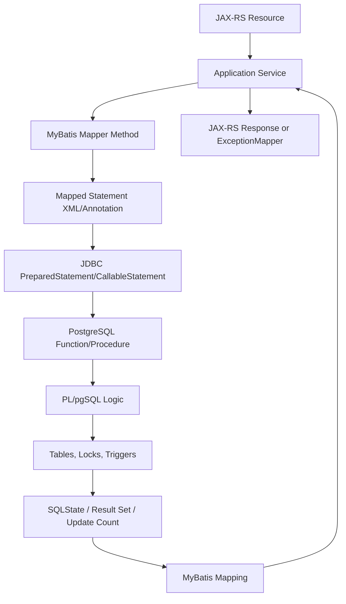
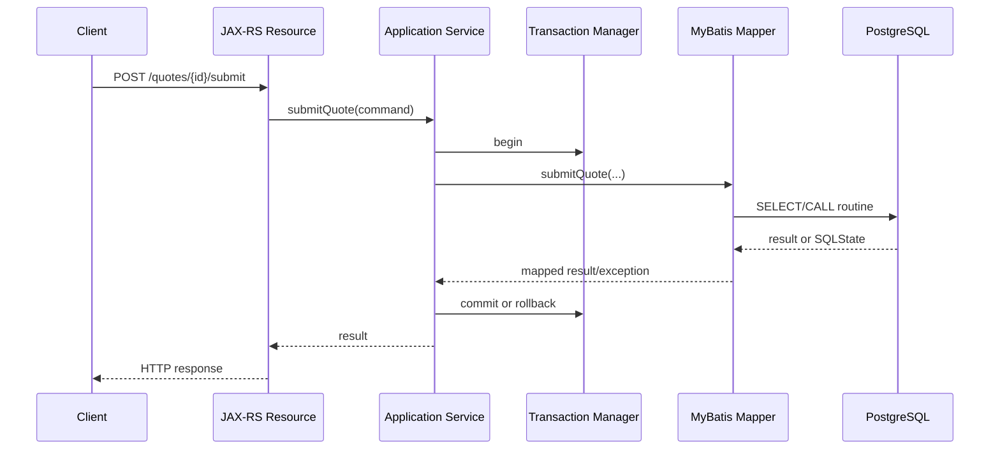
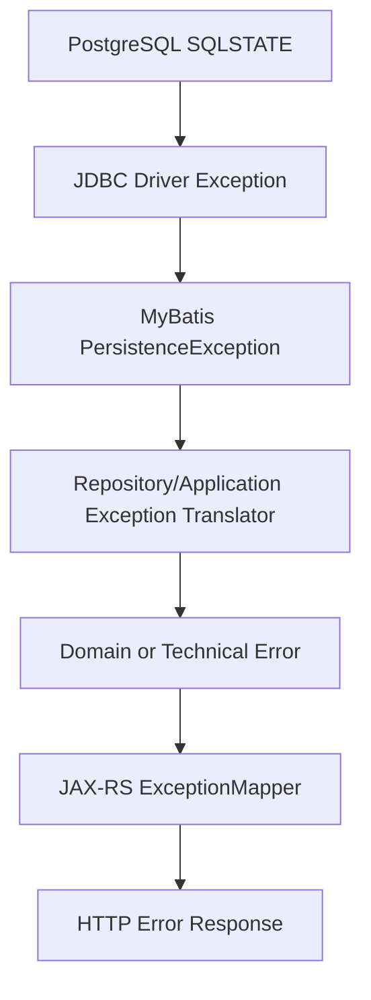

# Part 069 — MyBatis with PostgreSQL Routines, Transactions, and Error Handling

> Fokus part ini: memahami bagaimana MyBatis berinteraksi dengan PostgreSQL routines seperti function, procedure, trigger, dan PL/pgSQL; bagaimana transaction boundary bekerja; bagaimana error database naik ke Java/JAX-RS; dan bagaimana senior engineer harus mereview risiko hidden side effect, retry, locking, dan observability.

MyBatis memberi kontrol SQL yang eksplisit.

PostgreSQL memberi fitur database yang sangat kuat.

Kombinasi keduanya dapat menghasilkan data access layer yang sangat presisi, tetapi juga dapat menyembunyikan complexity besar di balik satu mapper method.

Contoh yang tampak sederhana:

```java
quoteMapper.submitQuote(tenantId, quoteId, actorId);
```

Bisa saja di database menjalankan:

- query validasi
- update status
- insert audit row
- publish outbox event
- trigger inventory/pricing rule
- lock row
- call PL/pgSQL function
- raise domain error
- fail karena deadlock

Senior engineer tidak boleh berhenti di signature Java.

Harus membaca:

```text
Mapper method -> mapped SQL -> PostgreSQL routine -> transaction effect -> lock effect -> error behavior -> API/event consequence
```

---

## 1. Core Mental Model

MyBatis mapper method adalah facade kecil di atas SQL statement.

Saat SQL statement memanggil PostgreSQL routine, control flow pindah ke database.



Important invariant:

```text
A mapper call is not necessarily a single simple query.
It may be an entire database-side workflow.
```

This matters because:

- transaction boundary may be outside the mapper
- database routines may mutate multiple tables
- triggers may run implicitly
- errors may surface as generic persistence exceptions
- retries may duplicate side effects if not designed carefully
- observability may not reveal hidden database work unless instrumented

---

## 2. Why PostgreSQL Routines Are Used from MyBatis

PostgreSQL routines are often used when logic needs to be close to data.

Typical reasons:

| Use case | Why database routine may be used |
|---|---|
| Complex validation | Needs multiple tables under one transaction |
| Bulk update | Avoids many network round trips |
| Legacy schema | Existing database logic already exists |
| Audit/outbox | Needs atomic write with state change |
| Reporting transformation | SQL is more natural than Java loops |
| Data integrity guard | Must run regardless of caller |
| Lock-sensitive operation | Needs precise lock order inside DB |

But this comes with costs:

| Risk | Consequence |
|---|---|
| Hidden side effect | Java reviewer misses data mutation |
| Poor observability | Slow routine looks like one mapper call |
| Harder testing | Logic split between Java and PL/pgSQL |
| Deployment coupling | App release depends on DB migration order |
| Retry ambiguity | Retrying Java call may repeat DB-side effect |
| Lock complexity | Routine may lock rows in non-obvious order |

A good rule:

```text
Use database routines when they protect consistency or performance.
Avoid them when they merely hide business logic from application review.
```

---

## 3. PostgreSQL Function vs Procedure vs Trigger

### Function

A PostgreSQL function returns a value, row, set of rows, or table-like result.

Common MyBatis usage:

```sql
SELECT *
FROM quote.calculate_quote_totals(
  #{tenantId},
  #{quoteId}
)
```

or:

```sql
SELECT quote.submit_quote(
  #{tenantId},
  #{quoteId},
  #{actorId}
)
```

A function is easy to call from MyBatis because it can appear in a `SELECT`.

### Procedure

A procedure is called with `CALL`.

Example:

```sql
CALL quote.reprice_quote(
  #{tenantId},
  #{quoteId},
  #{actorId}
)
```

Procedures can be useful for command-like operations, but Java mapping may be less natural if there are output parameters or multiple result sets.

### Trigger

A trigger is not called directly by MyBatis.

It runs because another SQL statement happens.

Example:

```sql
UPDATE quote.quote_header
SET status = 'SUBMITTED'
WHERE tenant_id = #{tenantId}
  AND quote_id = #{quoteId}
```

This may implicitly run:

```text
before update trigger
  -> validate transition
  -> insert audit row
  -> update search projection
  -> write outbox event
```

Trigger risk:

```text
The Java code does not show the real side effect.
```

### Practical difference for review

| Construct | Called explicitly? | Easy to see in mapper? | Hidden side effect risk |
|---|---:|---:|---:|
| Function | Yes | Usually | Medium |
| Procedure | Yes | Usually | Medium/high |
| Trigger | No | No | High |

---

## 4. Calling PostgreSQL Functions from MyBatis

### Scalar result

Mapper interface:

```java
public interface QuoteRoutineMapper {
    BigDecimal calculateQuoteTotal(@Param("tenantId") String tenantId,
                                   @Param("quoteId") UUID quoteId);
}
```

Mapper XML:

```xml
<select id="calculateQuoteTotal" resultType="java.math.BigDecimal">
    SELECT quote.calculate_quote_total(
        #{tenantId, jdbcType=VARCHAR},
        #{quoteId, jdbcType=OTHER}
    )
</select>
```

Review points:

- Is `UUID` mapped correctly?
- Does the function perform only calculation, or also mutate state?
- Is the function stable/immutable/volatile in PostgreSQL terms?
- Does it depend on tenant context?
- Does it return `NULL` for missing data or raise an exception?

### Row result

```java
QuoteTotalsRow calculateTotals(@Param("tenantId") String tenantId,
                               @Param("quoteId") UUID quoteId);
```

```xml
<select id="calculateTotals" resultMap="QuoteTotalsResultMap">
    SELECT subtotal,
           discount_total,
           tax_total,
           grand_total,
           currency_code
    FROM quote.calculate_quote_totals(
        #{tenantId, jdbcType=VARCHAR},
        #{quoteId, jdbcType=OTHER}
    )
</select>
```

Result map:

```xml
<resultMap id="QuoteTotalsResultMap" type="com.example.quote.QuoteTotalsRow">
    <result property="subtotal" column="subtotal" />
    <result property="discountTotal" column="discount_total" />
    <result property="taxTotal" column="tax_total" />
    <result property="grandTotal" column="grand_total" />
    <result property="currencyCode" column="currency_code" />
</resultMap>
```

Invariant:

```text
Function result shape is an API between database and Java.
Changing it is a compatibility change.
```

---

## 5. Calling PostgreSQL Procedures from MyBatis

Procedure call:

```xml
<update id="repriceQuote">
    CALL quote.reprice_quote(
        #{tenantId, jdbcType=VARCHAR},
        #{quoteId, jdbcType=OTHER},
        #{actorId, jdbcType=VARCHAR}
    )
</update>
```

Mapper:

```java
void repriceQuote(@Param("tenantId") String tenantId,
                  @Param("quoteId") UUID quoteId,
                  @Param("actorId") String actorId);
```

This looks like an update method, but the procedure may perform many operations.

Review questions:

- What tables are updated?
- What locks are acquired?
- Does it insert audit rows?
- Does it write outbox events?
- Is it idempotent?
- What happens if it fails halfway?
- Can it be safely retried?
- What SQLSTATE does it raise for business failures?

A procedure should have a clearly documented contract:

```text
Input:
  tenant_id, quote_id, actor_id

Mutation:
  recalculates quote lines and totals
  writes audit event
  may write outbox event

Error:
  raises business SQLSTATE for invalid status
  raises lock timeout if quote is concurrently modified

Idempotency:
  safe to retry only if request_id is provided and recorded
```

If this contract does not exist, add it to the internal verification checklist.

---

## 6. Triggers and Invisible Behavior

Triggers are dangerous because they are not visible in the mapper call.

Example mapper:

```xml
<update id="updateQuoteStatus">
    UPDATE quote.quote_header
    SET status = #{newStatus},
        updated_at = now(),
        updated_by = #{actorId}
    WHERE tenant_id = #{tenantId}
      AND quote_id = #{quoteId}
</update>
```

A reviewer may think this only updates `quote_header`.

But triggers may also:

- validate state transition
- insert audit rows
- update denormalized summary table
- update search index table
- write outbox event
- normalize timestamps
- prevent changes to closed quotes

Hidden invariant:

```text
The database schema is part of the application behavior.
```

For any table updated by MyBatis, inspect:

```sql
SELECT tgname
FROM pg_trigger
WHERE tgrelid = 'quote.quote_header'::regclass
  AND NOT tgisinternal;
```

Do not assume there are no triggers.

Verify.

---

## 7. Transaction Boundary with MyBatis

MyBatis itself can manage transactions through `SqlSession`, but in enterprise services transaction management may be delegated to:

- manual MyBatis session handling
- Spring transaction manager
- Jakarta EE/JTA
- custom transaction wrapper
- container-managed transaction
- service-layer unit of work

Do not assume.

### Desired boundary

For most JAX-RS services:

```text
JAX-RS Resource
  -> validate input
  -> call application service
      -> open transaction
      -> mapper call(s)
      -> write outbox/inbox/audit if needed
      -> commit
  -> map result to response
```

Mermaid view:



### Bad boundary

```text
Resource method opens transaction directly.
Mapper starts its own independent transaction.
Routine commits independently.
HTTP response is returned before DB work is durable.
```

These patterns make correctness hard to reason about.

---

## 8. Transaction Propagation and Same-Connection Assumption

A transaction only groups statements if they use the same database connection and the same transaction context.

A common misconception:

```text
If two mapper methods are called in the same Java method, they are automatically in the same transaction.
```

Not necessarily.

They are in the same transaction only if transaction management binds them correctly.

Check:

- how `SqlSession` is created
- whether mapper proxies share the same session
- whether auto-commit is disabled
- whether a transaction manager binds connection to thread/context
- whether async execution loses transaction context
- whether nested calls use `REQUIRES_NEW`-like behavior

Failure example:

```java
public void submitQuote(Command command) {
    quoteMapper.updateStatus(command.quoteId(), "SUBMITTED");
    outboxMapper.insertEvent(command.event());
}
```

If these are not in one transaction, the system can end with:

```text
quote submitted, but no event
```

or:

```text
event published, but quote not submitted
```

---

## 9. Auto-Commit Risk

Auto-commit means every statement commits independently.

For read-only queries, this is often fine.

For multi-step command operations, it is dangerous.

Example:

```java
quoteMapper.updateHeader(...);      // committed
quoteMapper.updateLines(...);       // committed
outboxMapper.insertEvent(...);      // fails
```

Result:

```text
State changed but integration event missing.
```

Senior review rule:

```text
Any command touching multiple rows/tables must have explicit transaction semantics.
```

Internal verification checklist:

- where is auto-commit configured?
- does the pool default to auto-commit true?
- does the framework disable auto-commit inside transaction?
- are mapper calls outside service transaction allowed?
- are routines allowed to control transaction?

---

## 10. Isolation Level and Routine Behavior

Transaction isolation controls what concurrent transactions can see and how anomalies are handled.

For PostgreSQL-backed services, common practical levels are:

- Read Committed
- Repeatable Read
- Serializable

A routine may be correct under one isolation level and unsafe under another.

Example problem:

```text
Two requests submit the same quote concurrently.
Both read status = DRAFT.
Both attempt status transition.
One should win.
```

Possible controls:

- row lock with `SELECT ... FOR UPDATE`
- optimistic version column
- unique constraint
- advisory lock
- serializable transaction with retry
- idempotency key

Mapper method calling a routine must document the concurrency strategy.

---

## 11. Locking from MyBatis and PL/pgSQL

Locks may be acquired in SQL directly:

```sql
SELECT *
FROM quote.quote_header
WHERE tenant_id = #{tenantId}
  AND quote_id = #{quoteId}
FOR UPDATE
```

or inside a function/procedure:

```sql
SELECT status
INTO current_status
FROM quote.quote_header
WHERE tenant_id = p_tenant_id
  AND quote_id = p_quote_id
FOR UPDATE;
```

The Java mapper call does not reveal lock order unless you inspect SQL/routine body.

Deadlock risk increases when different paths lock resources in different order.

Example:

```text
Path A:
  lock quote_header
  lock quote_line

Path B:
  lock quote_line
  lock quote_header
```

Senior review rule:

```text
Every command path must have a consistent lock order for shared entities.
```

---

## 12. SQLState as Error Contract

PostgreSQL errors carry SQLSTATE codes.

Examples commonly seen in application error handling:

| SQLSTATE | Meaning | Typical API mapping |
|---|---|---|
| `23505` | unique violation | 409 Conflict |
| `23503` | foreign key violation | 409 or 400 depending on cause |
| `23514` | check violation | 400 or 409 |
| `40001` | serialization failure | retry or 409/503 depending on operation |
| `40P01` | deadlock detected | retry if safe, otherwise 503/409 |
| `55P03` | lock not available | 409/423/503 depending on semantics |
| `57014` | query canceled / statement timeout | 504/503 depending on caller boundary |

Do not blindly expose database errors to clients.

Map them through application-level error taxonomy.



---

## 13. Exception Stack in Java

Depending on stack, a database failure may surface as:

- `org.postgresql.util.PSQLException`
- `java.sql.SQLException`
- `org.apache.ibatis.exceptions.PersistenceException`
- framework-specific data access exception
- custom repository exception
- domain exception translated from SQLSTATE

Do not write code that depends on only one shallow exception type.

Bad:

```java
catch (PersistenceException e) {
    throw new InternalServerErrorException();
}
```

Better:

```java
catch (PersistenceException e) {
    SqlFailure failure = sqlFailureClassifier.classify(e);
    throw failure.toApplicationException();
}
```

Classifier responsibilities:

- unwrap root cause
- detect SQLSTATE
- classify retryable vs non-retryable
- classify domain vs technical failure
- preserve safe diagnostic metadata
- avoid leaking SQL or internal schema to client

---

## 14. Business Errors Raised from PL/pgSQL

PL/pgSQL can raise exceptions.

Conceptual example:

```sql
RAISE EXCEPTION 'Quote cannot be submitted from status %', current_status
USING ERRCODE = 'P0001';
```

If all domain failures use generic SQLSTATE, Java cannot distinguish them safely.

Better pattern:

```text
Database routine returns structured result
or raises specific agreed error code/message detail
which Java maps to application error code.
```

Possible result shape:

```sql
CREATE TYPE quote.submit_quote_result AS (
    success boolean,
    error_code text,
    quote_version bigint
);
```

Then MyBatis maps it explicitly.

The design choice matters:

| Pattern | Pros | Cons |
|---|---|---|
| Raise exception | Natural rollback, simple failure path | Harder to distinguish domain cases unless disciplined |
| Return status row | Explicit contract, easier mapping | Caller must enforce rollback/decision correctly |
| Insert audit/error table | Durable diagnostics | More moving parts |

---

## 15. Retry Decision: Where and When

Not every database error should be retried.

Retry requires all of these to be true:

```text
The failure is transient.
The operation is idempotent or deduplicated.
The retry budget is bounded.
The transaction boundary is clean.
The caller can tolerate delayed completion.
```

Retry candidates:

- serialization failure
- deadlock detected
- transient connection failure
- lock not available, depending on operation
- statement timeout, only if operation is safe to retry

Do not retry:

- validation failure
- authorization failure
- unique violation caused by real duplicate business key
- check constraint violation
- foreign key violation caused by invalid command
- unknown side-effect operation without idempotency

Bad retry:

```java
retry(() -> quoteMapper.submitQuote(tenantId, quoteId, actorId));
```

Better:

```java
retryWithBudget(
    operationName,
    idempotencyKey,
    () -> quoteService.submitQuote(command)
);
```

Even better when side effects exist:

```text
Use idempotency key + command table + outbox + state transition guard.
```

---

## 16. Idempotency with Database Routines

If a routine performs command mutation, it should be designed with duplicate requests in mind.

Useful patterns:

- request id table
- command ledger
- unique constraint on business command key
- idempotency key stored with result hash
- outbox event uniqueness
- optimistic version check

Example table:

```sql
CREATE TABLE command_idempotency (
    tenant_id text NOT NULL,
    idempotency_key text NOT NULL,
    command_type text NOT NULL,
    request_hash text NOT NULL,
    response_code text,
    created_at timestamptz NOT NULL,
    PRIMARY KEY (tenant_id, idempotency_key)
);
```

A routine can enforce:

```text
Same idempotency key + same request hash -> return previous result.
Same key + different request hash -> reject.
```

Without this, retry can become duplicate mutation.

---

## 17. Mapping Routine Result to Domain Result

Avoid returning raw database row directly to API.

Better layering:

```text
Routine result row
  -> repository result
  -> application/domain result
  -> response DTO
```

Example:

```java
public record SubmitQuoteRoutineRow(
    boolean success,
    String errorCode,
    long quoteVersion,
    String outboxEventId
) {}
```

Application service maps it:

```java
SubmitQuoteRoutineRow row = quoteRoutineMapper.submitQuote(...);

if (!row.success()) {
    throw quoteErrorMapper.toDomainException(row.errorCode());
}

return new SubmitQuoteResult(row.quoteVersion(), row.outboxEventId());
```

Do not let SQL-level error codes leak directly to response body.

---

## 18. Stored Logic and API Compatibility

Database routine contract affects API compatibility.

Changing routine behavior can change endpoint behavior even when Java code does not change.

Examples:

| DB routine change | API impact |
|---|---|
| New validation added | Existing requests may start failing |
| Error code changed | Client error handling may break |
| Result column renamed | MyBatis mapping breaks |
| Trigger added | Response latency changes |
| Locking added | More 409/timeout/deadlock |
| Outbox write changed | Downstream consumers impacted |

Therefore DB migration PR must be reviewed with application behavior in mind.

---

## 19. Observability for Routine Calls

A slow PL/pgSQL function may appear as one mapper method in Java.

Add observability at multiple layers:

- mapper method timing
- SQL statement name
- database function/procedure name
- row count
- lock wait time if available
- statement timeout count
- deadlock/serialization failure count
- retry count
- outbox write count
- routine error code count

Log example:

```json
{
  "event": "db.routine.call",
  "routine": "quote.submit_quote",
  "tenantIdHash": "...",
  "durationMs": 183,
  "result": "success",
  "quoteVersion": 42,
  "correlationId": "..."
}
```

Do not log raw customer identifiers, raw pricing payload, PII, or full SQL parameters unless explicitly allowed and redacted.

---

## 20. Debugging Routine Failures

When a mapper routine call fails, debug in layers.

### Step 1 — Identify the mapper statement

Find:

- mapper interface method
- XML statement id
- SQL text
- bound parameters shape
- caller service method

### Step 2 — Identify routine body

Find:

- function/procedure definition
- schema name
- version/migration that created it
- called sub-functions
- touched tables
- triggers fired by touched tables

### Step 3 — Identify transaction behavior

Find:

- transaction manager
- auto-commit state
- isolation level
- connection pool
- timeout
- retry wrapper

### Step 4 — Identify PostgreSQL failure

Find:

- SQLSTATE
- database logs
- deadlock details
- lock wait
- statement timeout
- query plan if slow

### Step 5 — Identify application mapping

Find:

- exception translator
- domain error mapping
- JAX-RS exception mapper
- API response
- logs/traces/metrics

---

## 21. Common Failure Modes

| Failure mode | Symptom | Likely cause | Detection |
|---|---|---|---|
| Wrong result mapping | Null fields or mapping exception | Routine result changed | MyBatis mapping error, tests |
| Duplicate command | Double audit/outbox/event | Retry without idempotency | Duplicate rows/events |
| Deadlock | Random 500/503 under concurrency | Inconsistent lock order | DB deadlock logs |
| Lock wait timeout | Slow endpoint then failure | Long transaction or hot row | Lock wait metrics |
| Generic 500 for domain error | Client gets internal error | No SQLSTATE/domain mapping | Error logs |
| Missing outbox event | State changed but no downstream event | Split transaction | Reconciliation job |
| Slow routine | API latency spike | Complex PL/pgSQL/query plan | DB slow query logs |
| Trigger surprise | Unexpected data mutation | Hidden trigger side effect | Schema inspection |
| Serialization failure loop | Repeated retry failure | Unsafe high-contention operation | Retry metrics |
| Tenant leak | Wrong tenant data touched | Missing tenant predicate/context | Audit and data checks |

---

## 22. Testing Strategy

### Unit-level

Test classification logic:

- SQLSTATE to application error
- retryable vs non-retryable
- routine result mapping
- domain exception mapping

### Integration-level

Use real PostgreSQL where possible.

Test:

- mapper XML loads
- function/procedure exists
- result mapping works
- migration creates routine
- routine handles domain failures
- transaction rollback works
- trigger side effects are expected

### Concurrency-level

Test:

- duplicate submit
- concurrent update
- lock timeout
- optimistic version conflict
- idempotency key reuse
- retry behavior

### Migration-level

Test:

- routine changes remain compatible with Java mapper
- old app version can run against expanded schema
- new app version can run before contract cleanup
- rollback/roll-forward path is known

---

## 23. Internal Verification Checklist

Use this checklist in CSG/internal codebase discovery.

### MyBatis integration

- Is MyBatis used directly, via Spring, or via custom wrapper?
- Are mapper definitions XML, annotations, or mixed?
- How are mapper interfaces scanned?
- How are `SqlSession`, transaction, and connection lifecycle managed?
- Are mapper calls allowed directly from resources or only services?

### PostgreSQL routines

- Which schemas contain application functions/procedures?
- Are routines created by Flyway, Liquibase, manual script, or DBA process?
- Are routine definitions stored in repo?
- Are functions/procedures versioned?
- Are triggers used on quote/order/catalog/pricing tables?

### Transaction model

- What transaction manager is used?
- Is auto-commit disabled inside service transaction?
- What is default isolation level?
- Are nested transactions or independent transactions used?
- Are mapper calls executed across async boundaries?

### Error handling

- Is SQLSTATE classified centrally?
- Are PostgreSQL domain errors mapped to application error codes?
- Are deadlock/serialization failures retried?
- Is retry guarded by idempotency?
- Are DB errors redacted before logging/response?

### Observability

- Are mapper method names visible in tracing/logs?
- Are slow queries captured?
- Are routine names visible?
- Are lock waits/deadlocks monitored?
- Are retries and SQLSTATE counts measured?

---

## 24. Senior PR Review Checklist

For any PR touching MyBatis + PostgreSQL routines:

- [ ] Does the mapper method name reveal command/query intent?
- [ ] Is the SQL explicit and reviewable?
- [ ] If a function/procedure is called, is its contract documented?
- [ ] Are touched tables and trigger side effects known?
- [ ] Is transaction boundary explicit?
- [ ] Is auto-commit behavior safe?
- [ ] Is isolation/locking strategy understood?
- [ ] Are SQLSTATE failures mapped correctly?
- [ ] Is retry decision safe and bounded?
- [ ] Is idempotency required and implemented?
- [ ] Are tenant predicates enforced?
- [ ] Is result mapping backward-compatible?
- [ ] Are errors redacted and observable?
- [ ] Are integration/concurrency tests included?
- [ ] Is migration order safe for rolling deployment?

---

## 25. Senior Engineer Heuristics

### Heuristic 1 — Mapper methods are not harmless

A method with a short name may hide database workflow.

Always inspect mapped SQL.

### Heuristic 2 — SQLSTATE is not an implementation detail

It is part of reliable error classification.

### Heuristic 3 — Retry without idempotency is a data corruption risk

Retry is not resilience if it duplicates business effects.

### Heuristic 4 — Trigger behavior must be treated as application behavior

If a trigger changes outcome, it must be tested and documented.

### Heuristic 5 — Routine contract must be versioned mentally like API contract

Java and database are deployed separately enough that compatibility matters.

---

## 26. Minimal Production Standard

A production-grade MyBatis/PostgreSQL routine integration should have:

```text
Explicit mapper method
Explicit SQL statement
Known routine body
Known transaction boundary
Known lock strategy
Known SQLSTATE mapping
Known retry/idempotency decision
Known observability signal
Known migration order
Known test coverage
```

If any of these are unknown, the implementation may still work, but it is not yet senior-reviewable.

---

## 27. Final Mental Model

Do not think:

```text
MyBatis method calls database.
```

Think:

```text
A JAX-RS command enters a service transaction,
executes explicit SQL through MyBatis,
possibly transfers control into PostgreSQL routines/triggers,
mutates durable state,
may emit outbox/event/audit side effects,
returns or raises SQLSTATE-backed outcomes,
then maps those outcomes into stable API behavior.
```

That is the level of reasoning expected in enterprise production systems.
