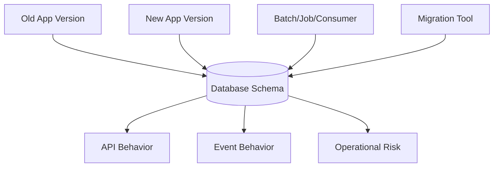
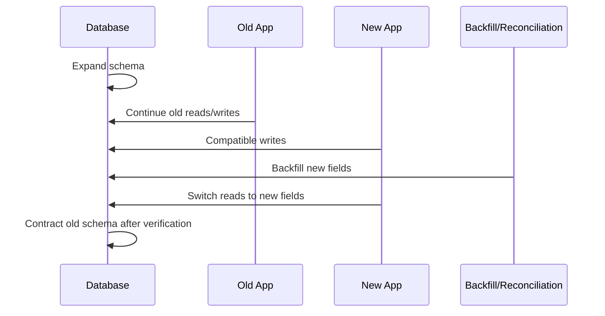

# Part 070 — Liquibase, Flyway, Expand-Contract, and Production Migration Safety

> Fokus part ini: memahami database migration sebagai perubahan kontrak production, bukan sekadar script SQL. Kita akan membahas Liquibase, Flyway, expand-contract migration, backward-compatible deployment, rollback vs roll-forward, backfill, PostgreSQL lock risk, dan checklist review untuk JAX-RS enterprise service.

Database schema adalah bagian dari runtime contract.

Untuk service JAX-RS berbasis PostgreSQL, perubahan schema dapat memengaruhi:

- resource method behavior
- DTO mapping
- MyBatis mapper
- transaction behavior
- indexing and performance
- Kafka outbox/event payload
- batch/reconciliation job
- reporting query
- rollback capability
- canary/blue-green deployment safety

Migration bukan aktivitas administratif.

Migration adalah architecture change.

---

## 1. Core Mental Model

Aplikasi dan database jarang berubah sebagai satu atomic unit di production.

Pada rolling deployment, beberapa pod mungkin masih menjalankan versi lama saat schema baru sudah diterapkan.



Important invariant:

```text
During deployment, old code and new code may coexist against the same database.
```

Therefore migration must be compatible with:

- old app version
- new app version
- old job version
- new job version
- existing data
- new data
- rollback or roll-forward plan

---

## 2. Why Migration Safety Matters

A bad migration can cause production incidents even if application code is correct.

Examples:

| Migration mistake | Production impact |
|---|---|
| Drop column used by old pods | 500 errors during rolling deploy |
| Add `NOT NULL` without default/backfill | Migration fails or writes fail |
| Create index with blocking lock | API latency spike/outage |
| Rename column directly | MyBatis mapper breaks |
| Change enum/check constraint | Existing writes fail unexpectedly |
| Backfill huge table in one transaction | lock bloat, replication lag, rollback pain |
| Change routine result shape | MyBatis result mapping fails |
| Remove outbox field | Downstream consumer breaks |

Migration safety is about preserving service behavior while durable structure changes.

---

## 3. Liquibase and Flyway Mental Model

Liquibase and Flyway both manage ordered database changes.

They differ in style, but the production principles are the same.

### Flyway mental model

Flyway commonly uses versioned migration files:

```text
V001__create_quote_tables.sql
V002__add_quote_status.sql
V003__create_outbox_table.sql
```

It tracks applied migrations in a schema history table.

Strengths:

- simple SQL-first workflow
- easy to review raw SQL
- predictable ordering
- good fit for teams comfortable with SQL scripts

Risks:

- rollback is not automatic by default
- complex conditional changes need discipline
- large data backfills need careful separation

### Liquibase mental model

Liquibase uses changesets in XML/YAML/JSON/SQL formats.

Conceptual example:

```yaml
databaseChangeLog:
  - changeSet:
      id: add-quote-version
      author: team
      changes:
        - addColumn:
            tableName: quote_header
            columns:
              - column:
                  name: version
                  type: bigint
```

Strengths:

- structured changesets
- preconditions
- rollback metadata options
- flexible database change modeling

Risks:

- generated SQL must still be reviewed
- abstraction can hide lock/performance impact
- rollback metadata may be misleading if not tested

Rule:

```text
Tool choice does not remove the need to understand PostgreSQL behavior.
```

---

## 4. Migration Files Are Production Code

Treat migration files as code with stricter review.

A migration should answer:

- What changes structurally?
- What application versions are compatible?
- What data volume is affected?
- What locks may be taken?
- How long can it run?
- Can it be retried?
- Can it be rolled back?
- Is roll-forward safer?
- How will failure be detected?
- What dashboard/log confirms success?

Bad migration description:

```text
Add status column.
```

Good migration description:

```text
Expand quote_header with nullable approval_status column.
No application reads it yet.
Backfill will run separately in batches.
Safe for old and new app versions.
Contract migration will add NOT NULL after all writers populate it.
```

---

## 5. Expand-Contract Migration Pattern

Expand-contract is the default safe pattern for zero/low-downtime schema evolution.

### Phase 1 — Expand

Add new schema elements without breaking old code.

Examples:

- add nullable column
- add new table
- add new index
- add new function version
- add new event/outbox column as nullable
- add new view alongside old view

Old code must still work.

### Phase 2 — Dual write or compatible write

New code writes both old and new shape if needed.

Examples:

- write old column and new column
- insert old event field and new event field
- maintain old and new projection

### Phase 3 — Backfill and verify

Migrate existing data safely.

Examples:

- batch update rows in small chunks
- verify counts
- compare old/new values
- run reconciliation query
- monitor locks and lag

### Phase 4 — Switch read path

New code reads new shape.

Old code may still exist during rollout, so old shape may need to remain.

### Phase 5 — Contract

Remove old schema only after:

- all app versions are upgraded
- all jobs/consumers are upgraded
- no old readers/writers remain
- dashboards show no old usage
- rollback no longer requires old shape

Mermaid view:



---

## 6. Backward-Compatible Schema Changes

Generally safer:

- add nullable column
- add table not used by old code
- add index without changing query semantics
- add optional JSON field
- add new function/procedure name
- add new enum-like lookup row if old code tolerates it
- add trigger that is behavior-compatible and low-risk

Risky or breaking:

- drop column
- rename column
- change column type
- add `NOT NULL` immediately
- add restrictive check constraint immediately
- change function return columns
- change procedure behavior used by old code
- remove JSON field consumed by clients/jobs
- change unique constraint on active write path

Senior migration review must classify the change.

```text
Is this expand, compatible write, read switch, or contract?
```

If the PR cannot answer, the migration is not ready.

---

## 7. PostgreSQL Lock Awareness

PostgreSQL DDL may take locks.

Some locks are brief.

Some can block reads/writes or wait behind long-running transactions.

High-risk operations include:

- large table rewrite
- column type change
- adding constraint with immediate validation
- creating index without concurrent strategy on large table
- dropping/renaming objects used by active queries
- backfill in one huge transaction

Safer approaches often include:

- split migration into multiple deploys
- add nullable column first
- backfill separately
- validate constraint after backfill
- create index with production-safe strategy
- use statement/lock timeout
- monitor lock waits

PostgreSQL version matters.

Internal verification checklist must include:

```text
What PostgreSQL version is used in each environment?
What migration patterns are approved by DB/platform team?
```

---

## 8. Index Migration Safety

Adding an index can improve query performance but harm write throughput and deployment stability if done carelessly.

Questions:

- Is the table large?
- Is the index created concurrently or through an approved online method?
- Does the migration tool wrap each migration in a transaction?
- Is concurrent index creation compatible with that transaction behavior?
- Is there a rollback plan?
- Will the index be used by target query?
- Is it redundant with existing index?

Example intent:

```sql
CREATE INDEX CONCURRENTLY IF NOT EXISTS idx_quote_header_tenant_status_updated_at
ON quote.quote_header (tenant_id, status, updated_at DESC);
```

But do not blindly paste this into a migration tool.

Verify whether the tool runs migrations inside a transaction and whether the SQL is allowed in that mode.

Review rule:

```text
Every production index migration must reference the query pattern it is meant to support.
```

---

## 9. Constraint Migration Safety

Constraints protect data integrity.

They can also break production if introduced abruptly.

### Safer constraint path

1. Add nullable column or permissive structure.
2. Update application to populate new value.
3. Backfill old rows.
4. Add check/foreign key/unique constraint in a safe staged way.
5. Validate.
6. Add `NOT NULL` only after verified.

### Dangerous path

```sql
ALTER TABLE quote.quote_header
ADD COLUMN approval_status text NOT NULL;
```

This can fail or cause table rewrite depending on context.

Safer expansion:

```sql
ALTER TABLE quote.quote_header
ADD COLUMN approval_status text;
```

Then application writes it.

Then backfill.

Then enforce.

---

## 10. Data Backfill Strategy

Backfill is often more dangerous than DDL.

Bad pattern:

```sql
UPDATE quote.quote_header
SET approval_status = 'NOT_REQUIRED'
WHERE approval_status IS NULL;
```

If table is huge, this may:

- lock many rows
- generate large WAL
- cause replication lag
- run too long
- bloat table
- block application writes
- be hard to rollback

Better pattern:

```text
Batch by primary key or time range.
Limit each transaction.
Record progress.
Make operation idempotent.
Expose metrics.
Allow pause/resume.
```

Pseudo approach:

```sql
UPDATE quote.quote_header
SET approval_status = 'NOT_REQUIRED'
WHERE tenant_id = :tenant_id
  AND quote_id > :last_quote_id
  AND approval_status IS NULL
ORDER BY quote_id
LIMIT :batch_size;
```

PostgreSQL syntax may require CTE pattern for ordered limited update.

The principle matters:

```text
Backfill must be resumable and observable.
```

---

## 11. Migration and Rolling Deployment Compatibility

During rolling deployment:

```text
old pod + new pod + same database
```

This means:

- old pod must tolerate expanded schema
- new pod must tolerate not-yet-backfilled data
- old pod must not break because new pod writes new optional fields
- new pod must not require contract cleanup before rollout completes

Bad sequence:

```text
1. Drop old column.
2. Deploy new app.
```

If old pods still run, they fail.

Better sequence:

```text
1. Add new column.
2. Deploy app that writes both.
3. Backfill.
4. Deploy app that reads new.
5. Verify no old usage.
6. Drop old column later.
```

---

## 12. Feature Flags and Migration

Feature flags can decouple code rollout from behavior activation.

Example:

```text
Migration expands schema.
Code deploy supports new pricing calculation.
Feature flag controls whether tenant uses new pricing path.
Backfill prepares historical data.
Flag enables canary tenant.
Metrics confirm correctness.
Flag expands to all tenants.
Contract cleanup happens later.
```

Feature flags are especially useful when schema changes support:

- tenant-specific catalog behavior
- pricing/rules changes
- new order state transition
- new integration event
- new downstream contract

But feature flags do not fix incompatible schema changes.

They only help if the schema is designed to be compatible.

---

## 13. Rollback vs Roll-Forward

Rollback means returning to the previous application/schema state.

Roll-forward means applying a new fix that moves the system to a corrected state.

Database rollback is often harder than application rollback because data may have changed.

Example:

```text
New app writes data in new column.
Rolling back app does not automatically remove or reinterpret that data.
```

For production database changes, roll-forward is often safer.

But the team still needs a rollback playbook.

Checklist:

- Can the old app run against new schema?
- Can the new data be ignored by old app?
- If new migration fails halfway, can it be retried?
- If data backfill is wrong, can it be corrected?
- Is there a backup/restore strategy?
- Is restore realistic within recovery objective?

Do not write “rollback: revert PR” for database changes unless it is actually true.

---

## 14. Migration Failure Modes

| Failure mode | Symptom | Root cause | Mitigation |
|---|---|---|---|
| Migration lock timeout | Deployment fails | DDL waits on active transaction | lock timeout, schedule, split migration |
| API errors after deploy | 500 on old pods | breaking schema change | expand-contract |
| Slow API | latency spike | index/backfill lock or IO pressure | online migration, batches |
| Mapper failure | result mapping exception | routine/result changed | compatibility tests |
| Duplicate data | backfill not idempotent | re-run unsafe update | progress table, idempotent condition |
| Replication lag | read replicas stale | huge transaction/WAL | batch backfill |
| Partial rollout stuck | old/new code incompatible | wrong deploy order | compatibility matrix |
| Rollback impossible | old app cannot read new data | destructive migration | delay contract phase |

---

## 15. Migration Compatibility Matrix

For critical changes, create a matrix.

| Schema | App old | App new | Job old | Job new | Safe? |
|---|---:|---:|---:|---:|---:|
| Old schema | yes | no/partial | yes | no/partial | only before deploy |
| Expanded schema | yes | yes | yes | yes | desired rollout state |
| Backfilled schema | yes | yes | yes | yes | desired verification state |
| Contracted schema | no | yes | no | yes | only after old removed |

The key deployment target is usually:

```text
Expanded schema supports both old and new code.
```

This is the foundation of safe rollout.

---

## 16. MyBatis Compatibility with Migration

MyBatis mappers are sensitive to schema and result shape.

Breaking mapper changes:

- column removed
- column renamed
- result alias changed
- routine return column changed
- type changed without Java TypeHandler update
- procedure no longer returns expected result
- trigger changes row count or constraint behavior

Safer strategy:

- add new columns with aliases
- keep old result columns until all code upgraded
- version function names, e.g. `calculate_totals_v2`
- keep old routine during transition
- update mapper tests against migrated schema

Review rule:

```text
Every migration that changes a mapper dependency must include mapper/integration tests.
```

---

## 17. Outbox and Event Schema Migration

Database changes often affect event payload.

If outbox payload includes schema-derived fields, migration must coordinate with event compatibility.

Example:

```text
quote_total_amount renamed to grand_total_amount
```

Bad:

```text
Remove old field from event immediately.
```

Better:

```text
Add new field.
Keep old field.
Update consumers.
Deprecate old field.
Remove old field only after compatibility window.
```

Outbox table itself may need migration:

- add event version column
- add schema id
- add partitioning field
- add dedupe key
- add replay metadata
- add tenant id if missing

All must be backward-compatible with publisher and replay jobs.

---

## 18. Routine and Trigger Migration

Changing PostgreSQL functions/procedures/triggers is high risk.

Safer approach:

- create new routine name or signature
- deploy app that can call new routine
- keep old routine until old app removed
- update tests for both during transition
- drop old routine later

Dangerous approach:

```text
Replace function body used by old and new app with incompatible behavior.
```

Trigger migration checklist:

- What DML fires the trigger?
- Is trigger behavior backward-compatible?
- Can it run on old and new data shape?
- Does it add latency to hot write path?
- Does it write audit/outbox rows?
- Does it change row count or constraint behavior?
- Can it be disabled safely if incident occurs?

---

## 19. Tenant-Aware Migration

Enterprise systems often have tenant-specific configuration, catalog, pricing, or data volume.

Migration risk is not equal across tenants.

Questions:

- Are tables partitioned by tenant?
- Are large tenants processed separately?
- Can feature be enabled per tenant?
- Does backfill need tenant-specific rules?
- Are tenant-specific catalog versions affected?
- Are tenant-specific pricing effective dates affected?
- Are logs/metrics tenant-safe and redacted?

For large tenant migrations, prefer:

```text
canary tenant -> small cohort -> large tenant -> full rollout
```

---

## 20. Date/Time and Pricing Migration Risk

In CPQ/order-like systems, migrations involving date, time, currency, or precision are especially dangerous.

Examples:

- changing timestamp type
- changing timezone interpretation
- adding effective date column
- changing catalog version validity
- changing currency precision
- changing rounding policy
- changing tax calculation boundary

These are not simple schema changes.

They are business correctness changes.

Review must include:

- old/new calculation comparison
- historical data impact
- timezone boundary tests
- effective date tests
- rounding tests
- tax boundary ownership
- customer/tenant impact assessment

---

## 21. Migration Pipeline Design

A production pipeline should answer:

```text
When are migrations applied?
Before app deploy?
During app startup?
As a separate pipeline step?
Manually approved?
Per environment?
```

Common models:

### App startup migration

Pros:

- simple
- migration runs with deployment
- no separate orchestration

Cons:

- multiple pods may race unless tool locks correctly
- app startup can fail due to migration
- long migration delays rollout
- app identity needs DDL permission

### Separate migration job/pipeline

Pros:

- explicit control
- easier approval gates
- better for long-running changes
- app can run with limited DB permission

Cons:

- needs release orchestration
- requires compatibility discipline
- separate failure path

For enterprise production, separate controlled migration is often easier to govern.

But verify internal standard.

---

## 22. Migration Permissions

Application runtime should not necessarily have broad DDL permission.

Questions:

- Does app user own schema?
- Can app user run DDL?
- Does migration use separate DB role?
- Are permissions different in dev/test/prod?
- Can migration create/drop functions/triggers?
- Are grants included in migration?

Principle:

```text
Runtime permissions and migration permissions are different concerns.
```

---

## 23. Pre-Deployment Checks

Before applying migration:

- verify target DB version
- verify migration history table state
- verify no pending failed migration
- verify lock/statement timeout settings
- estimate table size
- inspect active long-running transactions
- confirm backup/restore posture
- confirm rollback/roll-forward plan
- confirm compatibility matrix
- confirm application version sequence

For high-risk migrations, also perform dry run on production-like data volume.

---

## 24. Post-Deployment Verification

After migration:

- check migration history table
- check schema object exists
- check constraints/indexes valid
- check query performance
- check app error rate
- check mapper errors
- check slow query/lock metrics
- check replication lag
- check backfill progress
- check outbox/event publishing
- check consumer lag/errors

Verification must be observable, not just “deployment succeeded”.

---

## 25. Migration Testing Strategy

### Local tests

- migration can run from empty database
- migration can run from previous schema
- mapper works after migration
- routine/function exists
- rollback script if provided runs in dev

### Integration tests

- Testcontainers PostgreSQL
- run all migrations
- execute key mapper methods
- execute API command path
- verify outbox rows
- verify constraints

### Compatibility tests

- old mapper against expanded schema
- new mapper against expanded schema
- new mapper against backfilled data
- old job against expanded schema
- replay job against new outbox shape

### Performance tests

- migration duration on realistic volume
- backfill batch duration
- lock wait behavior
- query plan before/after index
- replication/WAL impact if measurable

---

## 26. Failed Migration Recovery

A failed migration is not always safe to simply rerun.

Determine:

- did it fail before any change?
- did it partially create objects?
- did it partially backfill data?
- did it update migration history table?
- is checksum now mismatched?
- did it leave locks or invalid indexes?
- did app pods start with partial schema?

Recovery options:

- fix and rerun
- repair migration history
- apply manual corrective script
- roll forward
- restore from backup
- disable feature flag
- stop rollout

Do not hide failed migration state.

A failed migration should generate incident-level attention if production behavior is affected.

---

## 27. Liquibase-Specific Review Points

For Liquibase changesets, review:

- changeset id uniqueness
- author/source convention
- preconditions
- generated SQL
- rollback block realism
- contexts/labels
- checksum implications
- lock table behavior
- transaction behavior
- DB-specific SQL fragments

Do not assume Liquibase abstraction produces safe PostgreSQL SQL.

Generated SQL still needs PostgreSQL-aware review.

---

## 28. Flyway-Specific Review Points

For Flyway migrations, review:

- version numbering
- repeatable migration usage
- checksum changes
- transaction behavior
- repair procedure
- baseline policy
- out-of-order policy
- environment drift
- placeholder use
- raw SQL lock behavior

Do not modify already-applied versioned migrations casually.

If a migration has reached shared/prod-like environments, create a new migration instead.

---

## 29. Internal Verification Checklist

Use this checklist in CSG/internal codebase discovery.

### Tooling

- Is Liquibase, Flyway, both, or another tool used?
- Where are migration files stored?
- Are migrations SQL, XML, YAML, JSON, or mixed?
- Are migrations run by app startup or separate pipeline/job?
- What table tracks migration history?
- What is the repair process for failed migration?

### PostgreSQL environment

- What PostgreSQL version is used per environment?
- Are read replicas used?
- Is logical replication/CDC used?
- Are there table partitioning conventions?
- Are there approved online DDL patterns?
- Are lock/statement timeouts set during migration?

### Release process

- Is rolling deployment used?
- Is blue-green or canary used?
- Are DB migrations applied before or after app deploy?
- Is there a compatibility matrix requirement?
- Is rollback or roll-forward the platform standard?
- Are feature flags integrated with migration rollout?

### Application dependency

- Which MyBatis mappers depend on changed objects?
- Which functions/procedures/triggers are affected?
- Which batch jobs use the tables?
- Which Kafka/outbox events use changed fields?
- Which reports/search projections are affected?

### Governance

- Is DBA/platform approval required?
- Are high-risk migrations reviewed separately?
- Are production-like dry runs required?
- Are large backfills handled by separate job?
- Are migration runbooks required?

---

## 30. Senior PR Review Checklist

For any database migration PR:

- [ ] Is the change classified as expand, write, backfill, read-switch, or contract?
- [ ] Is the migration backward-compatible with old app version?
- [ ] Is the migration forward-compatible with new app version?
- [ ] Are jobs/consumers compatible?
- [ ] Does the migration affect MyBatis mapper result shape?
- [ ] Does the migration affect functions/procedures/triggers?
- [ ] Does it affect outbox/event schema?
- [ ] Does it affect tenant-specific behavior?
- [ ] Does it affect date/time/currency/precision?
- [ ] Is there a realistic rollback or roll-forward plan?
- [ ] Is large data backfill separated and resumable?
- [ ] Are locks and table size considered?
- [ ] Are index creation semantics safe?
- [ ] Are constraints introduced in stages?
- [ ] Are migration tests included?
- [ ] Is observability/verification defined?
- [ ] Is production runbook updated?

---

## 31. Senior Engineer Heuristics

### Heuristic 1 — Destructive migrations are late-phase changes

Dropping or renaming should happen only after usage is proven gone.

### Heuristic 2 — Backfill is a production workload

Treat it like a job with metrics, retries, throttling, and recovery.

### Heuristic 3 — Rollback must be tested, not imagined

A rollback plan that cannot be executed is documentation theater.

### Heuristic 4 — Schema compatibility beats deployment speed

Fast deployment with incompatible schema creates avoidable incidents.

### Heuristic 5 — Migration changes API behavior indirectly

If mapper, routine, outbox, or validation changes, API behavior may change too.

---

## 32. Minimal Production Standard

A production-safe migration should have:

```text
Clear migration phase
Backward compatibility
Forward compatibility
Known lock/performance risk
Known data volume impact
Known mapper/routine/event impact
Test coverage
Verification query/dashboard
Rollback or roll-forward plan
Internal owner
```

If a migration lacks these, it may still pass CI, but it is not production-ready.

---

## 33. Final Mental Model

Do not think:

```text
Migration changes database schema.
```

Think:

```text
Migration changes a durable production contract shared by old code,
new code, jobs, mappers, routines, events, reports, rollback paths,
and operational tooling.
```

For senior engineers, database migration safety is not optional.

It is one of the main controls that prevents routine releases from becoming production incidents.
