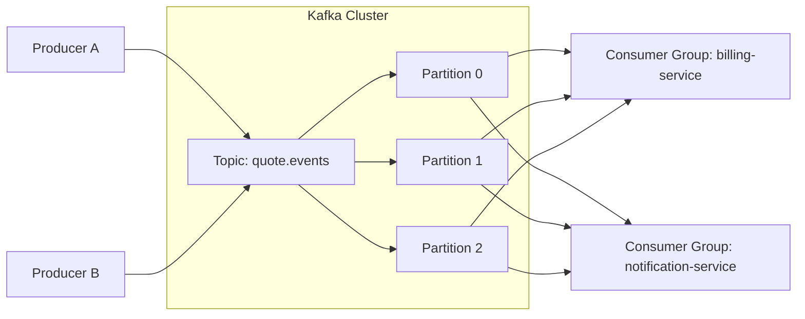
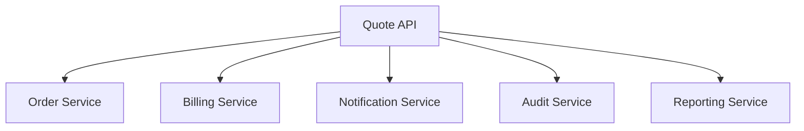
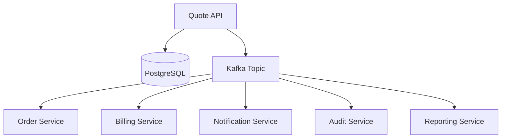
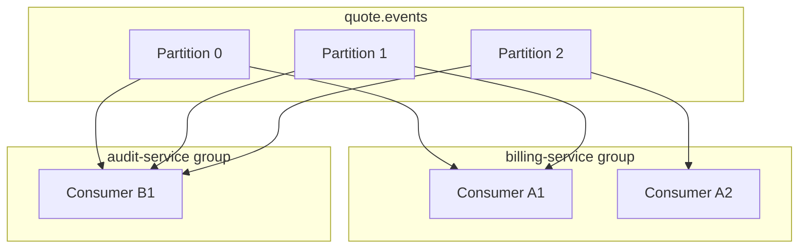
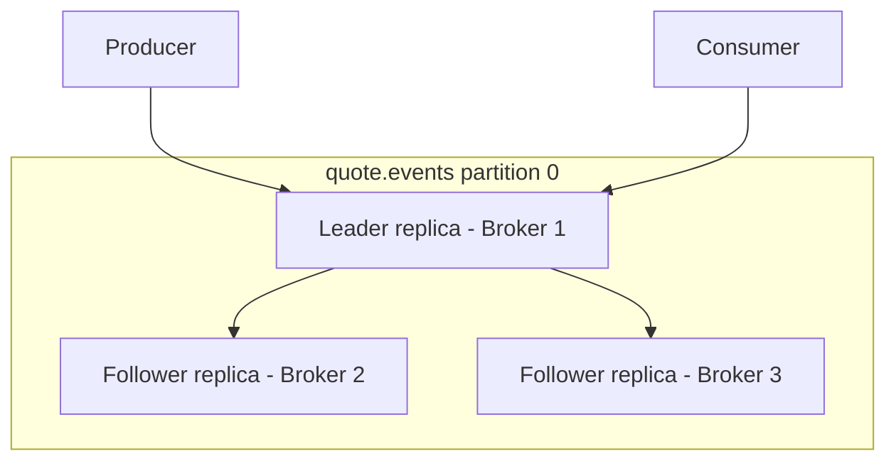
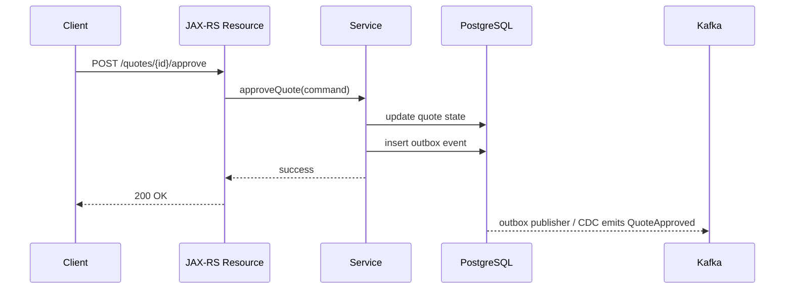
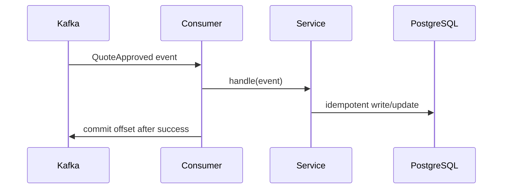

# Part 071 — Kafka Fundamentals: Topics, Partitions, Offsets, Consumer Groups

> Fokus part ini: memahami Kafka sebagai distributed commit log untuk event-driven integration, bukan sekadar queue. Kita akan membahas topic, partition, offset, consumer group, retention, replication, ordering, delivery semantics, dan cara memverifikasi penggunaan Kafka di Java/JAX-RS enterprise service.

Kafka sering terlihat sederhana dari sisi aplikasi:

```java
producer.send(record);
consumer.poll(Duration.ofMillis(100));
```

Namun mental model production-nya jauh lebih penting daripada API call-nya.

Di sistem enterprise seperti CPQ, quote management, order management, quote-to-cash, BSS/OSS, atau catalog-driven architecture, Kafka biasanya dipakai untuk:

- publish domain event setelah state berubah
- menghubungkan service tanpa synchronous coupling
- audit-like event trail
- outbox/CDC integration
- downstream notification
- asynchronous enrichment
- long-running process handoff
- replay/rebuild materialized view
- integration dengan external system

Kafka bukan magic reliability layer.

Kafka hanya memberi log terdistribusi dengan aturan tertentu. Correctness tetap tanggung jawab producer, consumer, schema governance, retry policy, idempotency, observability, dan operational discipline.

---

## 1. Core Mental Model

Kafka adalah append-only distributed log yang dibagi menjadi topic dan partition.



Important ideas:

- topic adalah nama logical stream
- partition adalah ordered append-only log
- record adalah entry dalam log
- offset adalah posisi record dalam partition
- consumer group adalah mekanisme parallel consumption
- retention menentukan berapa lama record disimpan
- replication menentukan durability terhadap broker failure
- ordering hanya guaranteed dalam satu partition

Kafka bukan database relational.

Kafka bukan message broker tradisional.

Kafka adalah durable event log yang dapat dibaca ulang selama record masih ada sesuai retention.

---

## 2. Why Kafka Exists

Masalah yang ingin diselesaikan Kafka:

```text
How do multiple services observe state changes without forcing every service to call every other service synchronously?
```

Tanpa Kafka, sistem sering berubah menjadi synchronous call graph yang rapuh.



Masalahnya:

- latency API tergantung semua downstream
- failure downstream bisa menggagalkan command utama
- retry HTTP bisa menggandakan side effect
- scaling tiap dependency sulit
- sulit replay data untuk consumer baru
- temporal coupling tinggi

Dengan event log:



Keuntungan:

- producer tidak perlu tahu semua consumer
- consumer bisa evolve secara independen
- event bisa dibaca ulang selama retention masih tersedia
- processing bisa diparalelkan per partition
- failure consumer tidak langsung memblokir producer

Trade-off:

- consistency menjadi eventual
- duplicate processing harus diasumsikan
- ordering harus dirancang
- schema evolution menjadi governance problem
- observability lebih kompleks
- operational skill Kafka menjadi penting

---

## 3. Queue vs Log

Banyak engineer menganggap Kafka sama dengan queue. Itu keliru untuk banyak keputusan desain.

| Aspek | Traditional queue | Kafka log |
|---|---|---|
| Message ownership | Biasanya satu consumer mengambil message | Banyak consumer group dapat membaca record yang sama |
| Setelah dibaca | Message biasanya hilang/acknowledged | Record tetap ada sampai retention/compaction |
| Replay | Umumnya bukan default | Natural selama data masih ada |
| Ordering | Bergantung queue/consumer model | Guaranteed per partition |
| Scaling consumer | Worker bersaing mengambil message | Consumer group membagi partition |
| Use case kuat | Work queue, task dispatch | Event log, integration stream, replayable events |

Kafka dapat dipakai seperti queue, tetapi desain terbaik Kafka biasanya memanfaatkan sifat log-nya.

Bad mental model:

```text
Kafka message = task to be consumed once.
```

Better mental model:

```text
Kafka record = durable fact/event that consumers may independently observe.
```

---

## 4. Topic

Topic adalah stream logical.

Contoh topic:

```text
quote.events
order.events
catalog.product.events
pricing.rule.events
quote.outbox
customer.notification.commands
```

Topic design memengaruhi:

- ownership
- access control
- schema governance
- retention
- partitioning
- replay
- operational dashboard
- consumer compatibility

### Topic as contract

Topic bukan sekadar string.

Topic adalah production contract.

Jika suatu service publish event ke topic, maka service tersebut membuat janji kepada consumer:

- event name stabil
- schema berevolusi secara compatible
- semantics jelas
- ordering policy jelas
- replay behavior diketahui
- retention cukup untuk recovery
- ownership jelas

### Topic granularity

Terlalu broad:

```text
events
system.events
all.domain.events
```

Masalah:

- consumer harus filter terlalu banyak
- ACL sulit
- schema governance kacau
- high volume unrelated events
- ownership tidak jelas

Terlalu narrow:

```text
quote-created-v1
quote-updated-v1
quote-approved-v1
quote-cancelled-v1
```

Masalah:

- terlalu banyak topic
- operational overhead
- consumer subscription kompleks
- lifecycle/deprecation berat

Practical enterprise pattern:

```text
<bounded-context>.<aggregate>.events
```

Example:

```text
quote.quote.events
order.order.events
catalog.product.events
pricing.price-rule.events
```

Namun konvensi aktual harus mengikuti platform standard internal.

---

## 5. Partition

Partition adalah unit ordering dan parallelism.

Satu topic memiliki satu atau lebih partition.

```text
topic: quote.events
  partition-0: offset 0, 1, 2, 3, ...
  partition-1: offset 0, 1, 2, 3, ...
  partition-2: offset 0, 1, 2, 3, ...
```

Important invariant:

```text
Kafka only guarantees ordering within a single partition.
```

Tidak ada global ordering lintas partition.

Jika event untuk `quoteId=Q-123` harus diproses berurutan, semua event untuk quote tersebut harus masuk partition yang sama.

Biasanya dilakukan dengan key:

```text
record key = quoteId
```

Kafka producer menggunakan key untuk memilih partition secara deterministik.

### Partition key decision

Partition key adalah keputusan arsitektur.

Contoh:

| Key | Akibat |
|---|---|
| `quoteId` | Semua event per quote ordered, parallelism antar quote |
| `customerId` | Semua event per customer ordered, risiko hot customer |
| `tenantId` | Semua event tenant masuk partition tertentu, risiko hot tenant besar |
| random/null | Distribusi merata, ordering per aggregate hilang |
| `orderId` | Cocok untuk order lifecycle, bukan quote lifecycle |

Untuk sistem quote/order, key yang salah dapat menyebabkan:

- event out-of-order per aggregate
- hot partition
- consumer lag tidak seimbang
- replay sulit
- reconciliation membesar

---

## 6. Offset

Offset adalah posisi record dalam partition.

```text
partition-0:
  offset 0 -> QuoteCreated
  offset 1 -> QuotePriced
  offset 2 -> QuoteApproved
  offset 3 -> QuoteSubmitted
```

Offset bersifat:

- monotonik dalam partition
- unik hanya dalam partition tersebut
- bukan global sequence number
- bukan business version
- bukan timestamp

Consumer menyimpan offset yang sudah diproses/di-commit.

Mental model:

```text
Committed offset = position from which consumer group can resume.
```

Common misconception:

```text
If the offset is committed, business side effect must be successful.
```

Itu hanya benar jika aplikasi commit offset setelah side effect sukses.

Jika offset di-commit terlalu awal, record bisa hilang dari perspektif consumer group walaupun processing gagal.

Jika offset di-commit terlalu lambat, record bisa diproses ulang.

---

## 7. Consumer Group

Consumer group adalah group identity untuk sekumpulan consumer yang bekerja sama membaca topic.

Dalam satu consumer group:

- satu partition hanya dikonsumsi oleh satu consumer instance pada satu waktu
- beberapa partition bisa dibagi ke beberapa consumer
- jika jumlah consumer lebih banyak dari partition, consumer ekstra idle
- jika consumer mati, partition akan direassign melalui rebalance



Consumer group memungkinkan service berbeda membaca event yang sama secara independen.

Example:

```text
billing-service group reads all quote.events
notification-service group reads all quote.events
audit-service group reads all quote.events
```

Masing-masing group punya offset sendiri.

---

## 8. Record Structure

Kafka record minimal memiliki:

- topic
- partition
- offset
- key
- value
- timestamp
- headers

Dalam Java producer, biasanya terlihat seperti:

```java
ProducerRecord<String, QuoteEvent> record = new ProducerRecord<>(
    "quote.events",
    quoteId,
    event
);

record.headers().add("correlation-id", correlationId.getBytes(StandardCharsets.UTF_8));
record.headers().add("event-type", "QuoteApproved".getBytes(StandardCharsets.UTF_8));
record.headers().add("schema-version", "1".getBytes(StandardCharsets.UTF_8));
```

### Key

Key menentukan partitioning dan ordering boundary.

### Value

Value adalah payload event atau command.

### Headers

Headers cocok untuk metadata teknis:

- traceparent
- correlation ID
- causation ID
- tenant ID jika sesuai policy
- schema version
- event type
- producer name
- idempotency key

Jangan jadikan header sebagai tempat business payload utama.

### Timestamp

Timestamp dapat berasal dari producer atau broker, tergantung config.

Jangan asumsikan timestamp Kafka selalu sama dengan business effective date.

---

## 9. Event, Command, and Fact

Tidak semua record Kafka memiliki semantics yang sama.

### Event

Event adalah fakta bahwa sesuatu sudah terjadi.

```text
QuoteApproved
OrderSubmitted
CatalogItemRetired
PriceRuleActivated
```

Event sebaiknya phrased as past tense.

### Command

Command adalah permintaan agar sesuatu dilakukan.

```text
GenerateInvoice
SendNotification
RecalculatePrice
```

Command dapat ditolak, gagal, atau di-retry.

### State snapshot

Snapshot menggambarkan state saat ini.

```text
QuoteSnapshotUpdated
CatalogSnapshotPublished
```

Snapshot berguna untuk materialized view, tetapi bisa mengaburkan event causality.

Senior review point:

```text
Do not mix event semantics and command semantics without naming and ownership clarity.
```

---

## 10. Retention

Retention menentukan berapa lama Kafka menyimpan record.

Contoh policy:

```text
retention.ms = 604800000     # 7 days
retention.bytes = ...
cleanup.policy = delete
```

Jika retention 7 hari, consumer yang down 10 hari mungkin tidak bisa catch up dari Kafka.

Retention harus disejajarkan dengan:

- recovery time objective
- replay expectation
- consumer downtime tolerance
- audit requirement
- storage cost
- event volume
- reconciliation strategy

### Retention is not archival by default

Kafka bukan otomatis audit archive permanen.

Jika compliance membutuhkan long-term retention, data mungkin harus dikirim ke:

- object storage
- data lake
- audit database
- archival service

### Log compaction

Topic dengan compaction menyimpan nilai terbaru per key, bukan semua history.

```text
cleanup.policy = compact
```

Cocok untuk state-like stream:

- latest customer profile
- latest catalog item snapshot
- latest configuration state

Tidak cocok jika seluruh event history harus dipertahankan.

---

## 11. Replication, Leader, and In-Sync Replica

Kafka partition direplikasi ke beberapa broker.

Satu replica menjadi leader. Producer dan consumer berinteraksi dengan leader partition.



Important terms:

- replication factor: jumlah replica
- leader: replica yang melayani read/write
- follower: replica yang menyalin leader
- ISR: in-sync replicas
- min.insync.replicas: minimum replica sync untuk write dianggap aman

Durability bukan hanya `send()` sukses.

Durability tergantung producer `acks`, broker config, ISR, replication factor, dan failure timing.

---

## 12. Delivery Semantics

Kafka sering dibahas dengan tiga istilah:

- at-most-once
- at-least-once
- exactly-once

### At-most-once

Record diproses nol atau satu kali.

Biasanya terjadi jika offset di-commit sebelum processing.

Risiko:

- data loss dari perspektif consumer side effect

### At-least-once

Record diproses satu kali atau lebih.

Biasanya offset di-commit setelah processing sukses.

Risiko:

- duplicate processing

Ini model yang paling umum untuk enterprise consumer.

### Exactly-once

Exactly-once di Kafka punya scope terbatas dan membutuhkan desain khusus.

Jangan artikan sebagai:

```text
No duplicate business effect anywhere in the distributed system.
```

Lebih aman berpikir:

```text
Kafka may support exactly-once processing under certain Kafka transaction boundaries, but external side effects still require idempotency.
```

Jika consumer menulis ke PostgreSQL, memanggil HTTP service, atau mengirim email, idempotency tetap wajib.

---

## 13. Ordering Guarantees

Ordering hanya guaranteed dalam satu partition.

Jika event `QuoteCreated`, `QuotePriced`, `QuoteApproved` harus ordered per quote, key harus stabil:

```text
key = quoteId
```

Jika key berubah antar event:

```text
QuoteCreated key = quoteId
QuotePriced key = customerId
QuoteApproved key = tenantId
```

Maka ordering per quote hilang.

### Out-of-order scenarios

Out-of-order dapat muncul karena:

- key tidak konsisten
- producer retry tanpa idempotence pada konfigurasi tertentu
- multiple producers publish event untuk aggregate yang sama tanpa coordination
- event berasal dari CDC dan direct producer sekaligus
- consumer parallelism internal tidak menjaga ordering
- replay bercampur dengan live processing

Senior invariant:

```text
Ordering is a design property, not a Kafka default across the whole topic.
```

---

## 14. Consumer Lag

Consumer lag adalah jarak antara latest offset di partition dan offset yang sudah diproses/di-commit consumer group.

```text
lag = log end offset - committed offset
```

Lag dapat berarti:

- consumer lambat
- consumer stuck
- volume event naik
- downstream dependency lambat
- partition hot
- rebalance loop
- processing error berulang
- DLQ/retry strategy tidak tepat

Lag bukan selalu bug.

Jika consumer memang batch-oriented, lag dapat wajar.

Namun untuk integration near-real-time, lag adalah signal penting.

Metrics yang perlu dilihat:

- lag per partition
- processing latency
- poll loop latency
- error rate
- rebalance count
- commit latency
- downstream call latency
- DB write latency
- DLQ rate

---

## 15. Kafka in JAX-RS Service Architecture

Dalam JAX-RS service, Kafka biasanya muncul pada dua sisi:

### HTTP command produces event



Preferred production pattern often uses outbox/CDC rather than direct publish inside request transaction, especially when DB state and event must stay consistent.

### Kafka event triggers service behavior



Consumer code is still application code. It needs validation, idempotency, logging, metrics, tracing, and error handling like HTTP endpoints.

---

## 16. Topic Naming and Ownership

A topic should have clear ownership.

Minimum metadata:

```yaml
topic: quote.quote.events
owner: quote-service
producer: quote-service
schema_owner: quote-domain-team
retention: 14 days
cleanup_policy: delete
partition_key: quoteId
compatibility: backward
contains_pii: false
replay_supported: true
consumer_groups:
  - billing-service
  - notification-service
  - audit-service
```

Without ownership, production systems accumulate orphan topics.

Orphan topics create:

- unknown consumers
- unsafe schema changes
- unclear retention
- duplicate event definitions
- governance friction
- incident confusion

---

## 17. Failure Modes

### 17.1 Wrong partition key

Symptom:

- event per aggregate processed out-of-order
- consumer occasionally sees missing prior state
- reconciliation finds impossible transitions

Detection:

- inspect record keys
- compare event sequence per aggregate
- check producer code paths
- check partition distribution

Fix:

- define partition key policy
- enforce key creation in event producer wrapper
- add tests for event key
- document event ordering contract

### 17.2 Hot partition

Symptom:

- one partition has much higher lag
- consumer group underutilized
- one consumer instance overloaded

Cause:

- skewed key such as tenant ID for very large tenant
- null key with bad distribution in older/custom producer path
- too few partitions

Fix:

- choose better key
- increase partition count carefully
- split topic by workload if justified
- use sharded key only if ordering requirement allows

### 17.3 Consumer group accidentally changed

Symptom:

- consumer reprocesses many old messages
- duplicate side effects
- sudden load spike

Cause:

- changed `group.id`
- environment variable mismatch
- deployment profile mistake

Fix:

- lock down group ID config
- alert on new consumer group
- require review for group ID change

### 17.4 Retention too short

Symptom:

- consumer cannot catch up after downtime
- offset out of range
- replay impossible

Fix:

- align retention with RTO/replay requirement
- add archival pipeline if needed
- add reconciliation job

### 17.5 Schema incompatible event

Symptom:

- deserialization failure
- consumer stuck on poison message
- DLQ spike
- partial outage in downstream service

Fix:

- schema compatibility check
- tolerant readers
- versioned event contract
- canary consumer
- DLQ with replay plan

### 17.6 Duplicate processing

Symptom:

- duplicate notification
- duplicate invoice
- duplicate integration call
- unique constraint violation

Fix:

- idempotency key
- inbox table
- unique business constraint
- dedupe cache/table
- side-effect idempotency

---

## 18. Debugging Workflow

When Kafka behavior looks wrong, avoid guessing.

Use layered diagnosis:

### 18.1 Identify the topic and consumer group

Ask:

```text
Which topic?
Which partition?
Which consumer group?
Which offset?
Which event key?
Which event type?
Which schema version?
```

### 18.2 Check event existence

Verify:

- record is actually produced
- topic name is correct
- environment is correct
- key is expected
- headers exist
- timestamp makes sense

### 18.3 Check consumer lag

Look at:

- lag per partition
- consumer assignment
- rebalance events
- processing error
- DLQ volume

### 18.4 Check processing side effect

Trace:

- event consumed
- validation result
- idempotency decision
- database transaction
- outbound call
- offset commit

### 18.5 Check offset behavior

Determine:

- was offset committed before or after processing?
- did consumer crash between side effect and commit?
- was the event processed twice?
- was the event skipped?

---

## 19. Observability Signals

Kafka integration needs observability beyond application logs.

Minimum metrics:

| Signal | Why it matters |
|---|---|
| records produced/sec | producer volume baseline |
| producer error rate | publish failure detection |
| producer latency | broker/network pressure |
| consumer lag per group/partition | backlog and stuck processing |
| records consumed/sec | throughput |
| processing duration | application bottleneck |
| commit latency/error | offset management risk |
| rebalance count | group instability |
| DLQ count | poison/failure rate |
| deserialization errors | schema compatibility issue |

Minimum logs:

- event type
- event ID
- aggregate ID/key
- topic/partition/offset
- consumer group
- correlation ID
- causation ID
- tenant ID if policy allows
- processing result
- retry/DLQ reason

Avoid logging full payload if it contains PII, pricing-sensitive data, contract data, or secrets.

---

## 20. JAX-RS + Kafka Design Checklist

When HTTP endpoint emits or triggers Kafka event, review:

- Is event emitted after durable state change?
- Is outbox/CDC needed?
- Is event key correct?
- Is event schema compatible?
- Is event naming past-tense if it is a fact?
- Is duplicate publish possible?
- Does consumer tolerate duplicate?
- Is event available for replay?
- Is retention sufficient?
- Is correlation/causation ID propagated?
- Is tenant context propagated safely?
- Does API response imply synchronous completion incorrectly?

Bad response semantics:

```text
POST /quotes/{id}/approve returns 200 OK and implies all downstream billing/notification work is complete,
while actual work is asynchronous through Kafka.
```

Better response semantics:

```text
POST /quotes/{id}/approve returns 202 Accepted or 200 OK with explicit state semantics,
and downstream async work is represented separately.
```

Choice depends on actual business contract.

---

## 21. PR Review Checklist

For producer changes:

- [ ] Topic name follows platform convention.
- [ ] Event name and semantics are clear.
- [ ] Partition key is documented and tested.
- [ ] Schema change is backward-compatible.
- [ ] Required headers are present.
- [ ] Correlation/causation ID propagation exists.
- [ ] Tenant metadata follows security policy.
- [ ] Publish is consistent with DB transaction/outbox strategy.
- [ ] Producer failure path is handled.
- [ ] Metrics and logs exist.

For consumer changes:

- [ ] Consumer group ID is correct and stable.
- [ ] Offset commit happens after successful processing.
- [ ] Processing is idempotent.
- [ ] Duplicate event behavior is tested.
- [ ] Poison event strategy exists.
- [ ] DLQ/retry behavior is explicit.
- [ ] Ordering assumptions are documented.
- [ ] Rebalance/shutdown behavior is safe.
- [ ] Lag metrics and alerts exist.
- [ ] PII is not leaked in logs.

For topic/schema changes:

- [ ] Owner is clear.
- [ ] Retention is justified.
- [ ] Partition count is justified.
- [ ] Compatibility mode is known.
- [ ] Consumer inventory is checked.
- [ ] Replay expectation is documented.
- [ ] Deprecation plan exists if replacing event/topic.

---

## 22. Internal Verification Checklist

Untuk CSG/internal codebase, jangan asumsi Kafka setup. Verifikasi dari evidence.

### Build/dependency

- [ ] Apakah ada `org.apache.kafka:kafka-clients`?
- [ ] Apakah ada framework wrapper internal?
- [ ] Apakah memakai Spring Kafka, MicroProfile Reactive Messaging, plain Kafka client, atau library platform internal?
- [ ] Versi client Kafka apa yang dipakai?
- [ ] Serializer/deserializer apa yang dipakai?

### Configuration

- [ ] Dari mana bootstrap server dikonfigurasi?
- [ ] Bagaimana topic name dikonfigurasi per environment?
- [ ] Bagaimana consumer group ID dikonfigurasi?
- [ ] Apakah ada config profile per tenant/customer/environment?
- [ ] Apakah secret/credential Kafka dikelola via secret manager/Kubernetes secret?

### Topic governance

- [ ] Apa naming convention topic internal?
- [ ] Siapa owner topic?
- [ ] Apakah ada topic catalog?
- [ ] Apakah ada retention standard?
- [ ] Apakah ada partition key standard?
- [ ] Apakah ada ACL per producer/consumer?

### Event/schema governance

- [ ] Apakah memakai schema registry?
- [ ] Format schema: Avro, JSON Schema, Protobuf, plain JSON?
- [ ] Compatibility mode apa yang enforced?
- [ ] Apakah CI memvalidasi schema change?
- [ ] Apakah ada generated model dari schema?

### Observability

- [ ] Apakah consumer lag dimonitor?
- [ ] Apakah producer error dimonitor?
- [ ] Apakah DLQ/retry topic dimonitor?
- [ ] Apakah topic/partition/offset masuk log?
- [ ] Apakah trace context masuk Kafka headers?

### Runtime/operation

- [ ] Kafka cluster dikelola internal atau managed service?
- [ ] Bagaimana access dari Kubernetes pod ke Kafka?
- [ ] Apakah traffic Kafka private?
- [ ] Apakah mTLS/SASL dipakai?
- [ ] Apakah ada runbook untuk replay, reset offset, DLQ reprocess?

---

## 23. Practical Heuristics

Gunakan heuristik berikut saat membaca Kafka code:

```text
If there is no explicit key, ask what ordering guarantee is expected.
```

```text
If there is no idempotency, assume duplicate events will eventually cause a bug.
```

```text
If there is no schema governance, assume compatibility will eventually break a consumer.
```

```text
If consumer group ID is dynamically generated, assume replay/duplicate risk.
```

```text
If retention is unknown, assume recovery expectation is undefined.
```

```text
If offset commit behavior is unclear, assume data loss or duplicate processing is possible.
```

---

## 24. Senior-Level Summary

Kafka correctness is not just about producing and consuming messages.

It is about controlling these invariants:

- event semantics are clear
- topic ownership is clear
- partition key matches ordering requirement
- consumer group identity is stable
- offset commit matches processing success
- duplicates are safe
- schema evolves compatibly
- retention supports recovery
- observability exposes topic/partition/offset/key
- replay and reconciliation are possible
- security and tenant boundary are preserved

A senior engineer should never review Kafka integration only at the API-call level.

Review the lifecycle:

```text
state change -> event creation -> serialization -> partitioning -> publish -> retention -> consumption -> processing -> side effect -> offset commit -> replay/recovery
```

That lifecycle is the real system.
