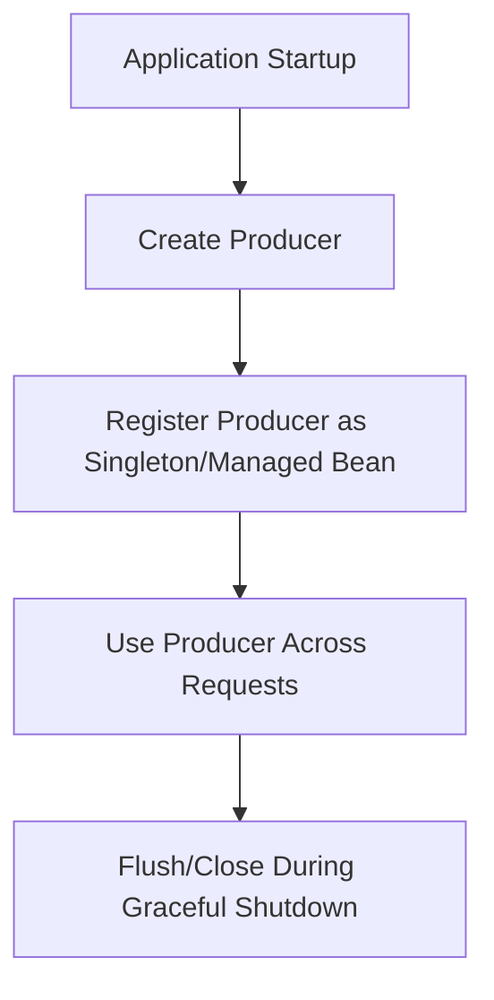
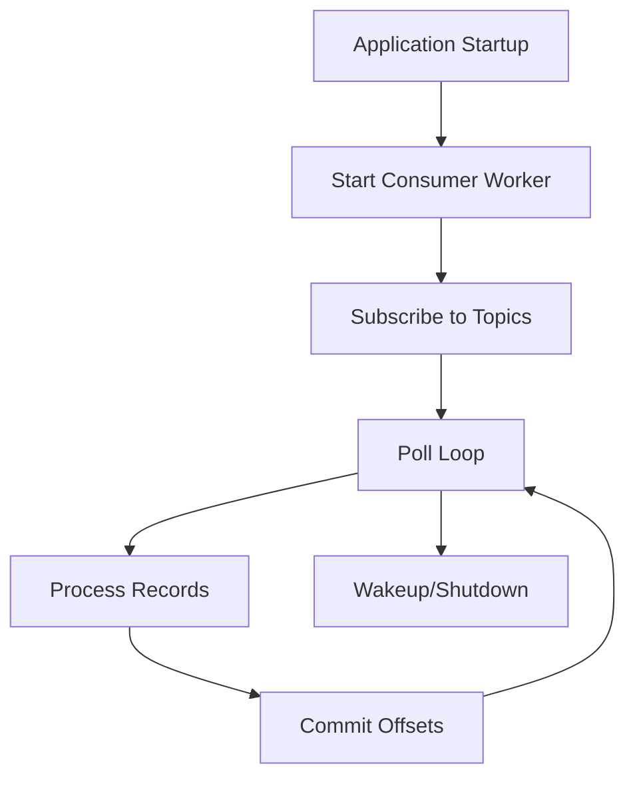
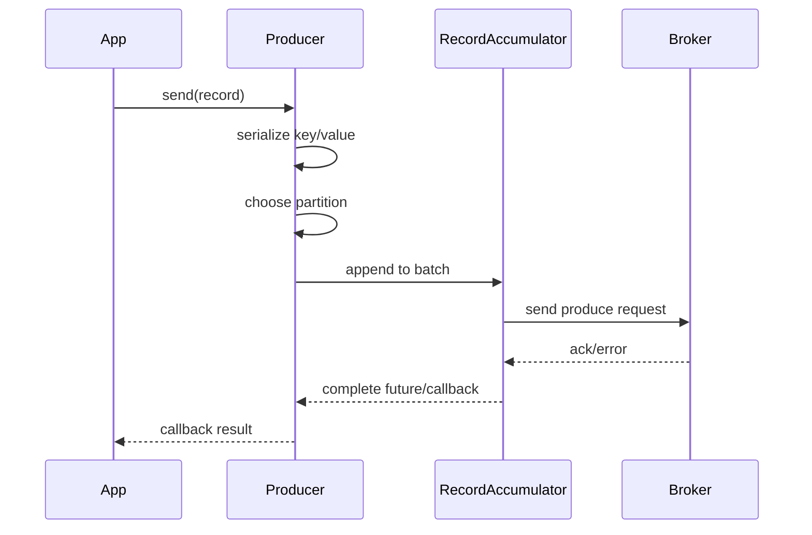
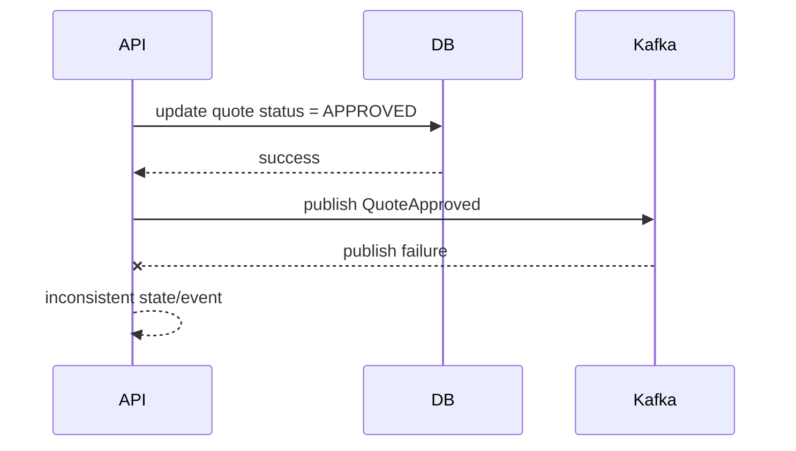
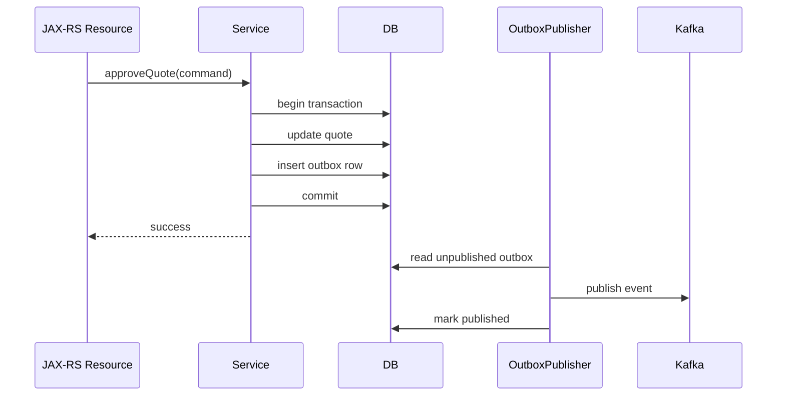
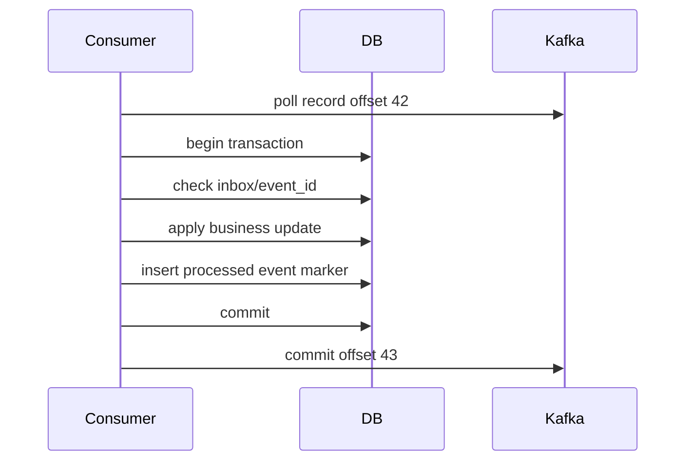
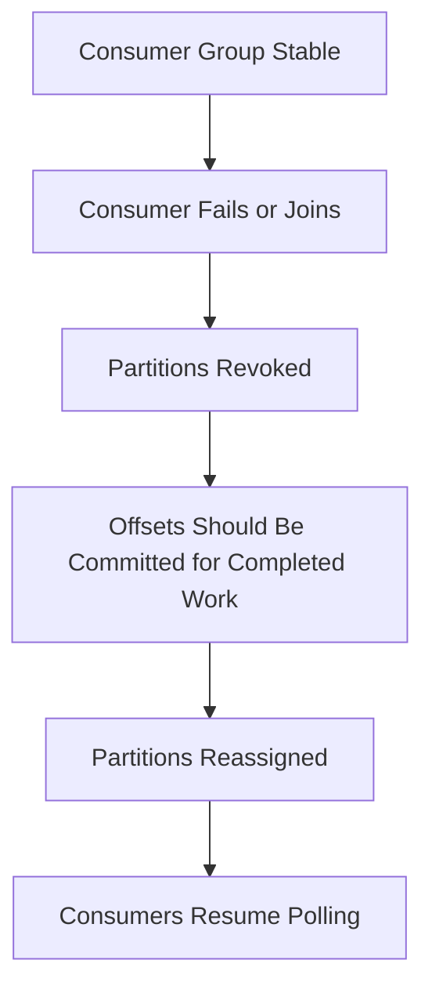

# Part 072 — Kafka Producer and Consumer Lifecycle in Java Services

> Fokus part ini: memahami lifecycle producer dan consumer Kafka di Java service. Kita akan membahas konfigurasi producer, batching, ack, retry, idempotence, consumer poll loop, commit strategy, rebalance, shutdown, concurrency, dan failure mode production.

Kafka integration bukan hanya:

```java
producer.send(record);
consumer.poll(timeout);
```

Kafka integration adalah lifecycle panjang:

```text
create client -> configure serializer/deserializer -> connect -> produce/consume -> handle retry -> manage offset -> handle rebalance -> shutdown safely -> observe and recover
```

Dalam JAX-RS enterprise service, Kafka lifecycle dapat muncul di dua mode:

1. **Producer inside API command path**
   - HTTP request memicu state change
   - state change menghasilkan event
   - event dipublish langsung atau lewat outbox/CDC

2. **Consumer as background worker inside same service process or separate worker**
   - service subscribe ke topic
   - process event
   - write DB/call downstream
   - commit offset setelah sukses

Keduanya memiliki failure mode berbeda.

---

## 1. Core Mental Model

Producer dan consumer adalah long-lived clients.

Jangan perlakukan mereka seperti object transient per request.

Bad pattern:

```java
@POST
@Path("/quotes/{id}/approve")
public Response approve(@PathParam("id") String quoteId) {
    KafkaProducer<String, QuoteEvent> producer = new KafkaProducer<>(props);
    producer.send(new ProducerRecord<>("quote.events", quoteId, event));
    producer.close();
    return Response.ok().build();
}
```

Masalah:

- expensive connection creation per request
- metadata fetch berulang
- batching tidak efektif
- latency tinggi
- resource leak risk
- shutdown/error handling buruk

Better mental model:

```text
Kafka producer is an application-level dependency with explicit lifecycle.
```



Consumer juga long-lived worker:



---

## 2. Producer Lifecycle

Producer lifecycle terdiri dari:

1. build configuration
2. create serializer
3. create producer
4. fetch metadata
5. send record
6. partition selection
7. batching
8. network send
9. broker acknowledgement
10. callback completion
11. flush/close



Important point:

```text
producer.send() is usually asynchronous.
```

Jika aplikasi tidak memperhatikan callback/future, publish failure bisa tidak terlihat.

---

## 3. Producer Configuration That Matters

### 3.1 `bootstrap.servers`

Alamat broker untuk initial cluster discovery.

Bukan daftar semua broker wajib, tetapi harus cukup untuk menemukan cluster.

Internal verification:

- apakah endpoint private?
- apakah DNS environment-specific?
- apakah access dari pod/Kubernetes benar?
- apakah TLS/SASL/mTLS dibutuhkan?

### 3.2 `key.serializer` and `value.serializer`

Serializer mengubah Java object menjadi bytes.

Common options:

- String serializer
- byte array serializer
- JSON serializer
- Avro serializer
- Protobuf serializer
- custom serializer

Review point:

```text
Serializer is part of event contract.
```

Jika format berubah tanpa compatibility control, consumer bisa gagal deserialize.

### 3.3 `acks`

`acks` menentukan kapan broker menganggap write sukses.

| Value | Meaning | Risk |
|---|---|---|
| `0` | producer tidak menunggu ack | data loss tinggi |
| `1` | leader ack | bisa hilang jika leader gagal sebelum replica sync |
| `all` / `-1` | semua in-sync replicas ack | durability lebih kuat, latency lebih tinggi |

Untuk event penting, umumnya `acks=all` lebih masuk akal, dengan broker `min.insync.replicas` yang sesuai.

### 3.4 `enable.idempotence`

Idempotent producer membantu mencegah duplicate akibat retry producer pada partition yang sama.

Namun ini bukan idempotency business end-to-end.

```text
Idempotent producer prevents certain duplicate writes to Kafka.
It does not prevent duplicate business side effects in consumers.
```

### 3.5 `retries`, `delivery.timeout.ms`, `request.timeout.ms`

Retry producer harus dibatasi oleh timeout keseluruhan.

Masalah umum:

- retry terlalu agresif
- timeout terlalu panjang untuk request path
- publish blocking menyebabkan HTTP latency spike
- error baru muncul setelah response dikirim

### 3.6 `linger.ms` and `batch.size`

Kafka producer melakukan batching.

- `linger.ms` menunggu sebentar agar batch lebih penuh
- `batch.size` mengontrol ukuran batch per partition

Trade-off:

| Tuning | Benefit | Cost |
|---|---|---|
| larger batch | throughput lebih baik | latency bisa naik |
| smaller linger | latency lebih rendah | throughput/network overhead lebih buruk |
| compression | bandwidth lebih rendah | CPU lebih tinggi |

### 3.7 `compression.type`

Compression dapat mengurangi network dan storage, tetapi menambah CPU.

Common: `snappy`, `lz4`, `zstd`, `gzip`.

Pilih berdasarkan platform standard, CPU budget, dan broker/client support.

### 3.8 `max.block.ms`

Batas waktu `send()` dapat block saat metadata tidak tersedia atau buffer penuh.

Ini penting jika producer dipakai di request thread JAX-RS.

Jika metadata broker bermasalah, `send()` bisa block sampai `max.block.ms`.

---

## 4. Producer Send Path

### 4.1 Fire-and-forget is dangerous

Bad:

```java
producer.send(record);
return Response.ok().build();
```

Masalah:

- publish failure tidak diketahui
- API response bisa sukses padahal event gagal
- tidak ada logging/metrics failure
- tidak ada retry/recovery jelas

### 4.2 Callback handling

Better:

```java
producer.send(record, (metadata, exception) -> {
    if (exception != null) {
        log.error("failed to publish event topic={} key={} eventId={}",
            record.topic(), record.key(), eventId, exception);
        metrics.increment("kafka.producer.error", tags);
        return;
    }

    log.info("published event topic={} partition={} offset={} key={} eventId={}",
        metadata.topic(), metadata.partition(), metadata.offset(), record.key(), eventId);
});
```

Namun callback saja belum cukup jika event harus atomic dengan DB state.

Untuk state-changing HTTP command, direct publish sering memiliki dual-write problem.

---

## 5. Dual-Write Problem

Problem:

```text
Update database succeeds, Kafka publish fails.
```

Atau:

```text
Kafka publish succeeds, database transaction rolls back.
```



Solusi umum:

- outbox pattern
- CDC from outbox table
- transactional producer only if all relevant side effects are within Kafka transaction boundary
- reconciliation job

Untuk JAX-RS service dengan PostgreSQL sebagai source of truth, outbox sering lebih mudah dipahami dan dioperasikan.

---

## 6. Producer in JAX-RS Request Path

Jika direct producer dipakai dalam request path, review ketat:

- Apakah API response menunggu publish ack?
- Jika publish gagal, apakah DB rollback?
- Jika DB commit sukses tapi publish gagal, apa recovery-nya?
- Apakah `send()` dapat block request thread?
- Apakah publish latency masuk SLO API?
- Apakah publish error dimonitor?
- Apakah duplicate event mungkin terjadi saat retry?

Pattern yang lebih aman untuk business-critical state event:



---

## 7. Consumer Lifecycle

Consumer lifecycle:

1. build config
2. create deserializer
3. create consumer
4. subscribe/assign
5. poll loop
6. deserialize records
7. process record
8. handle success/failure
9. commit offset
10. rebalance handling
11. shutdown

```java
while (running.get()) {
    ConsumerRecords<String, QuoteEvent> records = consumer.poll(Duration.ofMillis(500));

    for (ConsumerRecord<String, QuoteEvent> record : records) {
        process(record);
    }

    consumer.commitSync();
}
```

This is deceptively simple.

The correctness depends on exactly where processing, transaction, retry, and commit happen.

---

## 8. Consumer Configuration That Matters

### 8.1 `group.id`

Consumer group identity determines offset ownership.

Changing group ID can cause replay from default offset policy.

Review rule:

```text
Changing group.id is a production-impacting change.
```

### 8.2 `auto.offset.reset`

Used when no committed offset exists.

Common values:

- `earliest`
- `latest`
- `none`

Danger:

- `latest` can skip old records for new group
- `earliest` can reprocess huge backlog for accidental new group
- `none` fails fast if offset missing

### 8.3 `enable.auto.commit`

Auto commit can commit offsets independent of business success.

For enterprise side-effecting consumers, manual commit is usually safer.

```text
Commit offset after successful processing, not merely after polling.
```

### 8.4 `max.poll.records`

Controls batch size returned per poll.

Too high:

- long processing batch
- heartbeat/poll interval risk
- high transaction time
- large memory pressure

Too low:

- lower throughput
- more overhead

### 8.5 `max.poll.interval.ms`

Maximum time between polls before consumer considered failed.

If processing takes too long, rebalance may occur while old consumer is still processing.

This can cause duplicate processing.

### 8.6 `session.timeout.ms` and `heartbeat.interval.ms`

Control failure detection and group stability.

Too aggressive:

- false failure detection
- rebalance storms

Too lax:

- slow failure recovery

---

## 9. Poll Loop Design

Consumer poll loop must balance:

- polling often enough to stay in group
- processing safely
- committing after success
- handling failure without blocking forever
- shutting down cleanly

Bad pattern:

```java
for (ConsumerRecord<String, Event> record : records) {
    processMayTakeMinutes(record);
}
consumer.commitSync();
```

Risk:

- exceeds `max.poll.interval.ms`
- rebalance occurs
- duplicate processing
- lag grows
- shutdown slow

Better patterns depend on workload:

### Sequential per partition processing

Useful when ordering must be preserved.

```text
poll -> process records in partition order -> commit offsets after success
```

### Batch processing

Useful when DB writes can be batched.

```text
poll batch -> validate -> write batch transaction -> commit offsets
```

### Async processing with pause/resume

Useful for higher throughput but more complex.

```text
poll -> dispatch -> pause partitions -> resume when in-flight complete -> commit carefully
```

Async consumer design must preserve offset correctness.

---

## 10. Offset Commit Strategy

Offset commit is where many Kafka bugs live.

### 10.1 Commit before processing

```text
poll -> commit -> process
```

Risk:

- if process fails, record is lost from group perspective

This is at-most-once.

### 10.2 Commit after processing

```text
poll -> process -> commit
```

Risk:

- if process succeeds but commit fails/crashes, record may be reprocessed

This is at-least-once.

Most enterprise systems choose at-least-once plus idempotency.

### 10.3 Commit per record

Pros:

- smaller duplicate window

Cons:

- higher commit overhead
- lower throughput

### 10.4 Commit per batch

Pros:

- better throughput

Cons:

- larger duplicate window
- partial success complexity

### 10.5 Commit per partition offset

For batch with multiple partitions, commit offsets carefully per partition.

Do not commit offset for records that have not successfully completed.

---

## 11. Consumer Processing Transaction Boundary

A common pattern:

```text
poll record -> begin DB transaction -> idempotency check -> apply side effect -> commit DB -> commit Kafka offset
```



Crash scenarios:

| Crash point | Result | Required protection |
|---|---|---|
| before DB transaction | record reprocessed | safe |
| during DB transaction | DB rollback | safe if transaction correct |
| after DB commit before offset commit | record reprocessed | idempotency required |
| after offset commit | success | safe |

Important invariant:

```text
If side effect can succeed before offset commit, duplicate processing must be safe.
```

---

## 12. Idempotent Consumer Pattern

Use event ID or business idempotency key.

Example inbox table:

```sql
create table processed_kafka_event (
    consumer_name text not null,
    event_id text not null,
    topic text not null,
    partition int not null,
    offset_value bigint not null,
    processed_at timestamptz not null default now(),
    primary key (consumer_name, event_id)
);
```

Pseudo-code:

```java
void handle(ConsumerRecord<String, QuoteEvent> record) {
    transactionTemplate.executeWithoutResult(tx -> {
        if (inboxRepository.exists("billing-service", record.value().eventId())) {
            return;
        }

        billingService.applyQuoteApproved(record.value());

        inboxRepository.insert(
            "billing-service",
            record.value().eventId(),
            record.topic(),
            record.partition(),
            record.offset()
        );
    });
}
```

This prevents duplicate side effects when record is reprocessed.

---

## 13. Rebalance Lifecycle

Rebalance happens when partition assignment changes.

Causes:

- consumer instance starts
- consumer instance stops
- heartbeat timeout
- max poll interval exceeded
- partition count changes
- group membership changes

During rebalance:

- partitions are revoked from some consumers
- partitions are assigned to consumers
- consumers may stop processing briefly
- offset commit timing becomes critical



Need a rebalance listener if processing state must be flushed/committed on revoke.

### Rebalance failure mode

If a consumer processes records but does not commit before partition revoke, another consumer may reprocess those records.

Again: idempotency required.

---

## 14. Shutdown Lifecycle

Graceful shutdown matters in Kubernetes.

A pod may receive SIGTERM. The service has limited termination grace period.

Consumer should:

1. stop accepting new work
2. wake up poll loop
3. finish or cancel in-flight records according to policy
4. commit completed offsets
5. close consumer
6. release resources

Pseudo-code pattern:

```java
class ConsumerWorker implements Runnable {
    private final AtomicBoolean running = new AtomicBoolean(true);
    private final KafkaConsumer<String, Event> consumer;

    void shutdown() {
        running.set(false);
        consumer.wakeup();
    }

    @Override
    public void run() {
        try {
            while (running.get()) {
                ConsumerRecords<String, Event> records = consumer.poll(Duration.ofMillis(500));
                process(records);
                consumer.commitSync();
            }
        } catch (WakeupException e) {
            if (running.get()) throw e;
        } finally {
            consumer.close();
        }
    }
}
```

Kubernetes alignment:

- termination grace period must exceed shutdown needs
- readiness should fail before shutdown if applicable
- in-flight work policy must be explicit
- duplicate processing after shutdown must be safe

---

## 15. Consumer Concurrency Models

### One consumer per thread

Kafka consumer is not thread-safe.

Do not share one consumer instance across multiple threads without strict control.

Common safe model:

```text
1 consumer instance = 1 thread = poll loop owner
```

### Multiple consumers in same process

Can increase parallelism if partition count supports it.

```text
consumer-1 handles partition 0
consumer-2 handles partition 1
consumer-3 handles partition 2
```

Risk:

- more connections
- more rebalance complexity
- more memory/thread usage

### Poll thread + worker pool

Higher throughput but dangerous if offset tracking is wrong.

Problem:

```text
poll thread dispatches records to worker pool, then commits offsets before workers finish.
```

This causes data loss.

If using worker pool:

- pause partitions with in-flight work
- track completion per partition offset
- commit only contiguous completed offsets
- preserve ordering if required

---

## 16. Backpressure in Consumers

Consumer can overwhelm downstream systems.

Examples:

- consumes faster than DB can write
- calls external HTTP service too aggressively
- fills in-memory queue
- causes connection pool exhaustion
- triggers retry storm

Controls:

- `max.poll.records`
- pause/resume partition
- bounded executor queue
- bulkhead per downstream
- rate limiter
- DB connection pool alignment
- circuit breaker
- DLQ/retry topic

Backpressure rule:

```text
Never let Kafka consumption rate be unconstrained relative to downstream capacity.
```

---

## 17. Retry Strategy in Consumer

Consumer retry has several forms.

### Immediate in-process retry

```text
process -> fail -> retry same record immediately
```

Good for transient small errors.

Bad if downstream outage persists.

Risk:

- blocks partition
- increases lag
- causes retry storm

### Retry topic

```text
main topic -> failure -> retry topic with delay -> retry consumer -> main handling
```

Better for controlled retry.

Need:

- attempt count
- next retry time
- original topic/partition/offset metadata
- DLQ after max attempts

### DLQ

DLQ stores poison or exhausted messages.

DLQ without reprocess plan is just a graveyard.

DLQ requires:

- alerting
- payload visibility policy
- root-cause tracking
- replay/reprocess tool
- owner

---

## 18. Deserialization Failure

Deserialization can fail before application processing sees the record.

Causes:

- incompatible schema
- missing class
- corrupt payload
- wrong topic mapping
- unexpected enum value
- invalid date/time format

Design options:

- error-handling deserializer
- DLQ deserialization failure
- schema compatibility gate
- tolerant reader
- explicit unknown enum policy

Important:

```text
A poison record can block a partition indefinitely if failure handling is not designed.
```

---

## 19. Producer and Consumer Observability

### Producer logs

Include:

- topic
- partition if available
- offset if available
- key
- event type
- event ID
- correlation ID
- causation ID
- tenant if allowed
- exception type

### Consumer logs

Include:

- topic
- partition
- offset
- key
- event type
- event ID
- consumer group
- processing duration
- result
- retry attempt
- DLQ reason

### Metrics

Producer:

- record send rate
- error rate
- request latency
- batch size
- buffer exhaustion
- metadata age/error

Consumer:

- lag per partition
- records consumed rate
- processing latency
- commit latency
- rebalance count
- poll duration
- DLQ count
- retry count
- deserialization failures

### Tracing

For Kafka headers:

- W3C `traceparent` if used by platform
- correlation ID
- causation ID
- baggage only if policy allows

Do not put high-cardinality or sensitive business data into metric labels.

---

## 20. Security and Tenant Context

Kafka integration must preserve security boundaries.

Review:

- producer identity
- consumer identity
- topic ACL
- tenant propagation policy
- PII in payload
- PII in logs
- encryption in transit
- credential rotation
- schema visibility
- replay authorization

Tenant context is especially risky.

Bad:

```text
Consumer trusts tenantId from event payload without validation or source trust.
```

Better:

```text
Consumer validates tenant metadata against event contract, topic trust boundary, and business state.
```

---

## 21. Producer PR Review Checklist

- [ ] Producer is long-lived and lifecycle-managed.
- [ ] No producer per request unless explicitly justified.
- [ ] Topic name follows governance.
- [ ] Key matches ordering requirement.
- [ ] Headers include required tracing/correlation metadata.
- [ ] Serializer/schema is governed.
- [ ] `acks`, retries, delivery timeout are understood.
- [ ] Publish result/failure is observed.
- [ ] Direct publish vs outbox decision is explicit.
- [ ] Duplicate publish behavior is safe.
- [ ] Producer close/flush is handled on shutdown.
- [ ] Logs do not leak sensitive payload.

---

## 22. Consumer PR Review Checklist

- [ ] Consumer group ID is stable and environment-correct.
- [ ] `auto.offset.reset` behavior is intentional.
- [ ] Auto commit is disabled or justified.
- [ ] Offset commit happens after successful processing.
- [ ] Processing is idempotent.
- [ ] Duplicate event test exists.
- [ ] Deserialization failure handling exists.
- [ ] Retry/DLQ strategy is explicit.
- [ ] Rebalance behavior is safe.
- [ ] Shutdown behavior is safe.
- [ ] Backpressure is implemented.
- [ ] Consumer lag metrics exist.
- [ ] Topic/partition/offset are logged.
- [ ] Tenant/security context is validated.

---

## 23. Internal Verification Checklist

### Kafka client model

- [ ] Apakah service memakai plain Kafka clients?
- [ ] Apakah memakai Spring Kafka, internal wrapper, reactive messaging, atau framework lain?
- [ ] Di mana producer dibuat dan ditutup?
- [ ] Di mana consumer worker dimulai?
- [ ] Apakah consumer berada dalam service API yang sama atau deployment worker terpisah?

### Producer config

- [ ] Apa nilai `acks`?
- [ ] Apakah `enable.idempotence` aktif?
- [ ] Apa nilai retry dan delivery timeout?
- [ ] Apa serializer key/value?
- [ ] Apakah compression dipakai?
- [ ] Apakah publish callback/future di-handle?
- [ ] Apakah producer dipakai di request path?
- [ ] Apakah outbox/CDC dipakai?

### Consumer config

- [ ] Apa `group.id`?
- [ ] Apa `auto.offset.reset`?
- [ ] Apakah `enable.auto.commit` aktif?
- [ ] Apa `max.poll.records`?
- [ ] Apa `max.poll.interval.ms`?
- [ ] Bagaimana rebalance listener di-handle?
- [ ] Bagaimana shutdown consumer di Kubernetes?

### Processing correctness

- [ ] Apakah consumer idempotent?
- [ ] Apakah ada inbox/processed-event table?
- [ ] Apakah duplicate processing diuji?
- [ ] Apakah offset commit setelah DB commit?
- [ ] Apakah partial batch failure di-handle?
- [ ] Apakah ordering assumption terdokumentasi?

### Retry/DLQ

- [ ] Apakah retry langsung, retry topic, atau DLQ?
- [ ] Apakah ada max attempts?
- [ ] Apakah retry delay terkontrol?
- [ ] Apakah DLQ dimonitor?
- [ ] Apakah ada reprocess runbook?

### Observability

- [ ] Apakah lag dashboard ada?
- [ ] Apakah producer error alert ada?
- [ ] Apakah rebalance count terlihat?
- [ ] Apakah topic/partition/offset/key masuk log?
- [ ] Apakah trace context dipropagasi via Kafka headers?

---

## 24. Common Failure Scenarios and How to Reason

### Scenario 1: API success, downstream never receives event

Possible causes:

- direct publish failed after DB commit
- outbox row not inserted
- outbox publisher stuck
- topic name mismatch
- producer auth failure
- event filtered by consumer
- consumer group lag high
- schema deserialization failure

Debug path:

```text
HTTP request log -> DB state -> outbox row -> producer log -> Kafka topic record -> consumer lag -> consumer processing log
```

### Scenario 2: Consumer processes duplicate events

Possible causes:

- crash after DB commit before offset commit
- rebalance during processing
- manual replay/reset offset
- retry topic duplicate
- producer duplicate

Expected design:

- idempotency handles it
- logs show duplicate skipped/applied safely
- metrics show duplicate count

### Scenario 3: Consumer lag grows suddenly

Possible causes:

- downstream DB slow
- external HTTP dependency slow
- poison message blocking partition
- rebalance loop
- volume spike
- hot partition
- thread pool saturation

Debug path:

```text
lag by partition -> consumer logs -> processing duration -> error rate -> rebalance count -> downstream metrics
```

### Scenario 4: Rebalance storm

Possible causes:

- processing exceeds `max.poll.interval.ms`
- CPU throttling
- GC pause
- network issue
- too many rolling restarts
- unstable pod/node

Fix path:

- reduce batch size
- improve processing latency
- tune poll interval carefully
- fix CPU/memory limits
- improve graceful shutdown

---

## 25. Senior-Level Summary

Kafka producer lifecycle is about safe publication:

```text
event creation -> serialization -> partition selection -> batching -> broker ack -> callback -> recovery/observability
```

Kafka consumer lifecycle is about safe processing:

```text
poll -> deserialize -> validate -> idempotency check -> side effect -> commit offset -> retry/recover
```

A senior engineer should review not only whether Kafka code compiles, but whether the full lifecycle is correct under failure:

- broker unavailable
- network latency
- producer retry
- duplicate publish
- consumer crash
- rebalance
- poison message
- schema mismatch
- downstream outage
- Kubernetes shutdown
- manual replay

The practical default for enterprise consumers is:

```text
at-least-once delivery + idempotent processing + observable retry/DLQ + clear replay contract
```

That is the foundation before going deeper into retry, DLQ, schema evolution, event governance, outbox, inbox, CDC, and reconciliation in the next parts.
