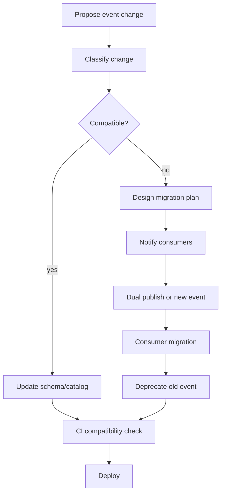

# Part 075 — Event Naming, Ownership, Versioning, Deprecation, and Catalog

> Fokus part ini: memperlakukan event sebagai **kontrak enterprise**. Kita akan membahas naming convention, ownership, versioning, deprecation, event catalog, producer compatibility, consumer compatibility, review process, dan failure mode ketika event berubah tanpa governance.

Event-driven system gagal bukan hanya karena Kafka down.

Event-driven system lebih sering gagal karena kontrak event berubah tanpa disiplin:

- nama event ambigu
- payload tidak punya owner
- field dihapus tanpa deprecation
- consumer tidak diketahui
- topic menjadi tempat campuran event tanpa catalog
- semantic event berubah tetapi schema tetap sama
- replay event lama menghasilkan side effect baru
- producer deploy lebih cepat daripada consumer
- event digunakan sebagai remote procedure call tersembunyi

Untuk sistem enterprise seperti CPQ, quote management, order management, catalog-driven architecture, dan quote-to-cash, event bukan sekadar pesan teknis. Event adalah jejak perubahan bisnis yang bisa memicu downstream workflow, provisioning, billing, notification, audit, analytics, reconciliation, dan support operation.

Karena itu event harus dikelola seperti API.

---

## 1. Core Mental Model

Event adalah kontrak antar service dan antar waktu.

```text
producer today
  -> publishes event
  -> consumer A reads immediately
  -> consumer B reads tomorrow
  -> analytics replays next month
  -> reconciliation job replays after incident
  -> audit/support reads six months later
```

Event governance harus menjawab:

- event ini mewakili fakta apa?
- siapa owner-nya?
- kapan event diterbitkan?
- apakah event ini domain event, integration event, atau technical event?
- schema mana yang berlaku?
- consumer mana yang bergantung pada event ini?
- perubahan apa yang backward-compatible?
- kapan event boleh deprecated?
- bagaimana replay dilakukan dengan aman?
- bagaimana duplicate dan ordering ditangani?

Tanpa jawaban eksplisit, event akan berubah menjadi shared mutable interface yang tidak bisa dikontrol.

---

## 2. Event Is Not Just a Kafka Message

Kafka record adalah container teknis:

```text
KafkaRecord
  topic
  partition
  offset
  key
  value
  headers
  timestamp
```

Event contract adalah makna bisnis dan operasional:

```text
EventContract
  name
  semantic meaning
  owner
  producer
  consumers
  schema
  compatibility policy
  versioning policy
  deprecation policy
  replay policy
  ordering policy
  duplicate policy
```

Kesalahan umum senior-level review adalah hanya melihat Kafka config, tetapi tidak melihat lifecycle kontrak event.

---

## 3. Event Category

Tidak semua message adalah event yang sama jenisnya.

### 3.1 Domain Event

Domain event menyatakan fakta bisnis yang sudah terjadi.

```text
QuoteApproved
OrderSubmitted
CatalogVersionActivated
PricingRuleChanged
```

Ciri-ciri:

- past tense
- immutable fact
- dapat dipakai banyak consumer
- tidak meminta consumer melakukan sesuatu secara langsung
- merepresentasikan perubahan domain state

Contoh buruk:

```text
ApproveQuote
CreateOrder
SendNotification
```

Itu terdengar seperti command, bukan event.

### 3.2 Integration Event

Integration event adalah event yang disiapkan untuk boundary antar service/platform.

Contoh:

```text
QuoteApprovalPublished
OrderFulfillmentRequested
BillingAccountSynchronizationRequired
```

Integration event boleh berbeda dari domain event internal karena:

- payload disederhanakan
- field sensitif dihapus
- contract lebih stabil
- consumer eksternal tidak perlu tahu struktur domain internal

### 3.3 Technical Event

Technical event menyatakan fakta teknis.

```text
FileImportCompleted
BatchJobFailed
CacheInvalidationRequested
TenantConfigurationReloaded
```

Technical event tetap perlu contract, tetapi governance-nya biasanya berbeda dari event bisnis.

### 3.4 Audit Event

Audit event menjawab who-did-what-when.

```text
QuoteViewed
PriceOverridden
OrderCancelledByUser
ApprovalDecisionRecorded
```

Audit event harus memperhatikan retention, PII, access control, tamper resistance, dan compliance.

---

## 4. Event Naming Principles

Nama event harus menjelaskan fakta, bukan implementasi.

### 4.1 Use Past Tense for Facts

Baik:

```text
QuoteApproved
OrderSubmitted
CatalogActivated
PaymentCaptured
```

Buruk:

```text
ApproveQuote
SubmitOrder
ActivateCatalog
CapturePayment
```

`ApproveQuote` terdengar seperti command. `QuoteApproved` menyatakan fakta bahwa approval sudah terjadi.

### 4.2 Include Domain Noun

Nama event harus punya domain noun yang jelas.

Baik:

```text
QuoteApproved
OrderSubmitted
PricingRuleChanged
CatalogVersionActivated
```

Buruk:

```text
Approved
Submitted
Changed
Activated
```

Event tanpa noun akan ambigu ketika masuk event catalog.

### 4.3 Avoid Transport-Specific Naming

Buruk:

```text
KafkaQuoteMessage
QuoteKafkaPayload
QuoteTopicRecord
```

Event bukan milik Kafka. Kafka hanya transport.

### 4.4 Avoid Consumer-Specific Naming

Buruk:

```text
BillingQuoteApprovedNotification
CRMOrderSubmittedMessage
```

Kecuali event memang integration event khusus consumer tertentu, nama event sebaiknya tidak mengunci ke consumer.

Lebih baik:

```text
QuoteApproved
OrderSubmitted
```

Lalu consumer billing/CRM mendaftarkan subscription-nya di catalog.

### 4.5 Avoid Vague Lifecycle Words

Hati-hati dengan:

```text
QuoteUpdated
OrderChanged
ProductModified
```

Event terlalu generik sering membuat consumer harus diff payload sendiri.

Lebih baik pecah bila semantic-nya penting:

```text
QuoteLineItemAdded
QuotePriceRecalculated
QuoteApprovalRequested
QuoteApproved
QuoteRejected
```

Tetapi jangan over-fragment tanpa kebutuhan consumer.

---

## 5. Event Naming Convention

Convention harus konsisten di beberapa layer:

- event name
- topic name
- schema subject
- Java class name
- AsyncAPI component name
- metric label
- dashboard filter
- alert rule
- documentation

Contoh convention:

```text
Domain event name: QuoteApproved
Java class: QuoteApprovedEvent
Topic: quote.events.v1
Schema subject: QuoteApproved-value
AsyncAPI message: QuoteApproved
Metric label: event_name="QuoteApproved"
```

Atau topic-per-event:

```text
Topic: quote.approved.v1
Schema subject: quote.approved.v1-value
```

Keduanya bisa valid. Yang penting adalah consistency dan trade-off-nya dipahami.

---

## 6. Topic Naming vs Event Naming

Event name dan topic name tidak selalu sama.

### 6.1 Topic-per-Domain Stream

```text
quote.events
order.events
catalog.events
```

Kelebihan:

- topic lebih sedikit
- event domain terkumpul
- consumer bisa membaca stream domain
- cocok untuk event catalog per domain

Kekurangan:

- topic berisi banyak event type
- schema strategy lebih kompleks
- consumer harus filter event
- partition key harus konsisten lintas event type

### 6.2 Topic-per-Event

```text
quote.approved
quote.rejected
order.submitted
```

Kelebihan:

- contract per topic lebih jelas
- subscription lebih sederhana
- schema compatibility lebih mudah

Kekurangan:

- topic bisa terlalu banyak
- governance topic lifecycle lebih berat
- cross-event ordering lebih sulit

### 6.3 Topic-per-Integration Boundary

```text
billing.quote-events
crm.order-events
fulfillment.order-commands
```

Kelebihan:

- isolasi consumer/platform boundary
- payload bisa consumer-specific
- ownership integration jelas

Kekurangan:

- event duplication
- mapping layer bertambah
- risiko semantic drift antar event mirip

---

## 7. Event Ownership

Setiap event harus punya owner.

Owner bukan hanya orang yang membuat producer pertama kali. Owner bertanggung jawab atas lifecycle kontrak.

Owner harus menjawab:

- apa makna event?
- kapan event diterbitkan?
- siapa consumer yang diketahui?
- apa compatibility policy?
- bagaimana deprecation dilakukan?
- apakah event aman untuk replay?
- apakah payload mengandung PII?
- bagaimana incident pada event ditangani?

Contoh ownership metadata:

```yaml
event: QuoteApproved
ownerTeam: Quote Management
owningService: quote-service
businessDomain: quote
slackChannel: '#quote-platform'
repository: quote-service
contractRepository: enterprise-event-contracts
supportTier: tier-1
```

Untuk konteks CSG Quote & Order, nama owner/team/service harus diverifikasi dari internal org dan repository. Jangan mengasumsikan nama service atau ownership dari luar.

---

## 8. Producer Ownership vs Event Ownership

Kadang producer bukan owner semantic.

Contoh:

```text
quote-service publishes OrderSubmitted because it creates order after quote acceptance
```

Ini mencurigakan. Secara domain, mungkin order-service lebih cocok menjadi owner `OrderSubmitted`.

Pertanyaan review:

- siapa source of truth untuk state tersebut?
- service mana yang punya invariant domain?
- apakah producer menerbitkan event dari state miliknya sendiri?
- apakah event sebenarnya command ke service lain?

Rule sederhana:

```text
Service should publish facts about state it owns.
```

Jika service menerbitkan fakta tentang state yang tidak dimilikinya, perlu desain eksplisit.

---

## 9. Event Versioning Mental Model

Ada dua jenis perubahan:

```text
schema evolution
semantic evolution
```

Schema evolution:

- field ditambah
- field dibuat optional
- enum value baru
- type berubah
- field dihapus

Semantic evolution:

- kapan event diterbitkan berubah
- arti field berubah
- invariant berubah
- event dulu berarti final, sekarang berarti tentative
- event dulu emitted once, sekarang emitted multiple times

Schema compatibility tidak menjamin semantic compatibility.

Contoh berbahaya:

```json
{
  "eventName": "QuoteApproved",
  "approvedAt": "2026-07-10T10:15:30Z",
  "approvalStatus": "APPROVED"
}
```

Jika sebelumnya `QuoteApproved` hanya dikirim setelah final approval, tetapi sekarang dikirim saat preliminary approval, schema tetap compatible tetapi semantic breaking.

---

## 10. Versioning Strategies

### 10.1 In-Schema Evolution

Gunakan event name sama, schema berevolusi secara compatible.

```text
QuoteApproved v1
QuoteApproved v2 with optional field added
QuoteApproved v3 with another optional field added
```

Cocok untuk perubahan additive.

### 10.2 Event Name Versioning

Gunakan nama baru hanya ketika semantic breaking.

```text
QuoteApproved
QuoteApprovalFinalized
```

Atau jika organisasi memakai version suffix:

```text
QuoteApprovedV2
```

Namun suffix `V2` sering tidak menjelaskan semantic baru. Nama semantic lebih baik jika perubahan memang mengubah arti.

### 10.3 Topic Versioning

```text
quote.events.v1
quote.events.v2
```

Cocok jika migration besar dan consumer perlu coexist lama.

Kekurangan:

- dual publish sering diperlukan
- consumer migration lebih mahal
- replay lintas versi kompleks

### 10.4 Header Versioning

```text
headers:
  event-type: QuoteApproved
  event-version: 2
```

Cocok untuk multi-event topic.

Tetapi consumer harus disiplin membaca header.

---

## 11. Backward and Forward Compatibility

Compatibility harus dipikirkan dari sisi consumer.

### 11.1 Backward Compatibility

New consumer can read old event.

```text
old event -> new consumer
```

Contoh requirement:

- field baru harus punya default
- consumer tidak boleh mengasumsikan field baru selalu ada
- old replay tetap bisa diproses

### 11.2 Forward Compatibility

Old consumer can read new event.

```text
new event -> old consumer
```

Contoh requirement:

- field baru optional
- unknown field ignored
- enum baru tidak membuat consumer crash
- type lama tidak berubah

### 11.3 Full Compatibility

Keduanya aman.

```text
old event -> new consumer
new event -> old consumer
```

Untuk enterprise event yang banyak consumer, full compatibility biasanya paling aman.

---

## 12. Producer Compatibility

Producer compatibility menjawab:

- apakah producer baru bisa publish event yang masih bisa dibaca consumer lama?
- apakah producer masih mengirim field yang consumer lama butuhkan?
- apakah producer mengubah timing emission?
- apakah producer mengubah key/partitioning?
- apakah producer mengubah event frequency?

Breaking producer changes:

- menghapus field required
- mengubah type field
- mengubah event key
- mengubah event emission dari once menjadi many
- mengubah event dari final fact menjadi intermediate fact
- mengubah ordering policy

---

## 13. Consumer Compatibility

Consumer compatibility menjawab:

- apakah consumer baru bisa membaca old event?
- apakah consumer tahan unknown field?
- apakah consumer tahan missing optional field?
- apakah consumer idempotent?
- apakah consumer bisa replay?
- apakah consumer bisa handle enum baru?

Consumer yang robust biasanya:

```text
ignore unknown fields
handle optional fields
treat enum as extensible
validate only what it owns
record inbox/dedupe state
avoid irreversible side effects before durable processing state
```

---

## 14. Event Deprecation Policy

Deprecation bukan delete.

Deprecation adalah proses mengurangi ketergantungan consumer secara aman.

Lifecycle yang sehat:

```text
active
  -> deprecated announced
  -> no new consumers
  -> existing consumers migrate
  -> dual publish/bridge period if needed
  -> consumer count reaches zero
  -> stop publishing
  -> archive contract
```

Metadata deprecation:

```yaml
event: QuoteApprovedLegacy
deprecated: true
deprecatedSince: 2026-07-10
replacement: QuoteApprovalFinalized
lastPublishTarget: 2026-10-10
owner: Quote Management
migrationGuide: docs/events/quote-approval-finalized.md
```

---

## 15. Event Catalog

Event catalog adalah inventory kontrak event.

Event catalog minimal harus berisi:

```yaml
eventName: QuoteApproved
description: Quote approval reached final accepted state.
domain: quote
ownerTeam: Quote Management
owningService: quote-service
topic: quote.events
schemaSubject: QuoteApproved-value
schemaFormat: avro
compatibilityMode: BACKWARD_TRANSITIVE
partitionKey: quoteId
producerServices:
  - quote-service
consumerServices:
  - order-service
  - notification-service
  - analytics-pipeline
pii: false
replaySafe: true
duplicatePolicy: consumer-idempotent
orderingPolicy: per-quoteId
deprecationStatus: active
```

Catalog harus bisa digunakan saat:

- membuat event baru
- mengubah schema
- menghapus field
- melakukan replay
- incident investigation
- onboarding engineer baru
- impact analysis PR
- audit/compliance review

---

## 16. Event Catalog Is Not Just Documentation

Jika catalog hanya dokumen manual, ia akan cepat stale.

Catalog lebih baik dihasilkan atau divalidasi dari artifact:

```text
AsyncAPI files
schema registry subjects
code annotations
CI metadata
service ownership registry
runtime consumer group inventory
```

Idealnya catalog punya automatic checks:

- event tanpa owner gagal CI
- schema tanpa compatibility mode gagal CI
- topic tanpa retention policy gagal review
- consumer baru harus declare subscription
- deprecated event tidak boleh dipakai consumer baru

---

## 17. AsyncAPI for Event Contracts

AsyncAPI bisa menjadi kontrak formal untuk event.

Contoh sederhana:

```yaml
channels:
  quote.events:
    subscribe:
      message:
        oneOf:
          - $ref: '#/components/messages/QuoteApproved'
          - $ref: '#/components/messages/QuoteRejected'

components:
  messages:
    QuoteApproved:
      name: QuoteApproved
      title: Quote approved
      headers:
        type: object
        properties:
          eventId:
            type: string
          eventType:
            const: QuoteApproved
          correlationId:
            type: string
          causationId:
            type: string
      payload:
        $ref: '#/components/schemas/QuoteApprovedPayload'
```

AsyncAPI tidak otomatis menyelesaikan governance. Tetapi ia membantu membuat event eksplisit dan reviewable.

---

## 18. Event Metadata Standard

Payload bisnis sebaiknya dipisahkan dari metadata teknis.

Contoh envelope:

```json
{
  "eventId": "01J0ABCDEF...",
  "eventType": "QuoteApproved",
  "eventVersion": 1,
  "occurredAt": "2026-07-10T10:15:30Z",
  "publishedAt": "2026-07-10T10:15:31Z",
  "producer": "quote-service",
  "tenantId": "tenant-123",
  "correlationId": "corr-789",
  "causationId": "cmd-456",
  "payload": {
    "quoteId": "Q-10001",
    "approvedBy": "user-123",
    "approvedAt": "2026-07-10T10:15:30Z"
  }
}
```

Metadata penting:

- `eventId`
- `eventType`
- `eventVersion`
- `occurredAt`
- `publishedAt`
- `producer`
- `tenantId` jika multi-tenant
- `correlationId`
- `causationId`
- `schemaId` atau `schemaVersion` jika tidak embedded oleh wire format

---

## 19. Event ID Policy

`eventId` harus unik dan stabil.

Gunanya:

- idempotency
- deduplication
- audit
- replay tracking
- incident investigation
- inbox pattern

Anti-pattern:

```text
use Kafka offset as event ID
```

Offset hanya unik dalam topic-partition dan berubah jika event dipindah ke topic lain.

Lebih baik:

```text
eventId generated by producer before publish
```

atau derived dari outbox row ID.

---

## 20. Partition Key Policy

Partition key adalah bagian dari contract.

Jika key berubah, ordering dan load distribution berubah.

Contoh:

```text
QuoteApproved key = quoteId
OrderSubmitted key = orderId
TenantConfigurationChanged key = tenantId
```

Pertanyaan review:

- ordering dibutuhkan per entity apa?
- cardinality key cukup tinggi?
- apakah hot key mungkin terjadi?
- apakah consumer mengandalkan per-key ordering?
- apakah key mengandung PII?

Mengubah key tanpa migration plan adalah breaking operational change.

---

## 21. Ordering Policy

Event catalog harus menyatakan ordering policy.

Contoh:

```yaml
orderingPolicy: per-quoteId
```

Artinya event dengan `quoteId` sama diharapkan berada pada partition yang sama dan diproses berurutan oleh consumer group.

Namun ordering Kafka tidak menyelesaikan semua masalah:

- retry topic bisa mengubah ordering
- DLQ replay bisa out-of-order
- multi-topic processing tidak ordered global
- consumer async parallelism bisa merusak ordering
- compaction/retention bisa menghilangkan event lama

Catalog harus menjelaskan batas ordering, bukan memberi jaminan palsu.

---

## 22. Duplicate Policy

Kafka consumer harus mengasumsikan duplicate bisa terjadi.

Catalog harus menyatakan duplicate policy:

```yaml
duplicatePolicy: consumers must dedupe by eventId
```

atau:

```yaml
duplicatePolicy: event is idempotent by aggregate version
```

atau:

```yaml
duplicatePolicy: producer guarantees no duplicate within outbox id, consumer still idempotent
```

Jangan tulis:

```yaml
duplicatePolicy: no duplicates
```

Itu hampir selalu klaim terlalu kuat.

---

## 23. Event Frequency and Cardinality

Event frequency adalah bagian dari production contract.

`QuoteApproved` mungkin low frequency. `QuoteViewed` bisa high frequency.

Event high frequency perlu review tambahan:

- topic retention
- partition count
- consumer scaling
- metrics cardinality
- storage cost
- replay cost
- PII risk

Event catalog harus mencatat ekspektasi volume:

```yaml
expectedVolume: 50000/day
peakVolume: 5000/minute
burstPattern: end-of-month
```

Untuk CPQ/order/pricing system, peak bisa terjadi saat batch import catalog, campaign pricing change, order submission burst, atau reconciliation run.

---

## 24. Consumer Inventory

Governance tidak mungkin dilakukan tanpa consumer inventory.

Minimal inventory:

```yaml
consumers:
  - service: order-service
    team: Order Management
    consumerGroup: order-service-quote-events
    purpose: create order after final quote approval
    criticality: high
    replaySafe: true
  - service: analytics-pipeline
    team: Data Platform
    consumerGroup: analytics-quote-events
    purpose: reporting and funnel analytics
    criticality: medium
    replaySafe: true
```

Consumer inventory membantu menjawab impact analysis:

- siapa terdampak jika field berubah?
- siapa harus diberi notice deprecation?
- siapa harus ikut migration test?
- apakah consumer masih aktif atau orphan?

---

## 25. Consumer Criticality

Tidak semua consumer punya criticality sama.

```text
critical path consumer:
  order creation
  billing
  fulfillment
  provisioning

non-critical consumer:
  analytics
  audit copy
  notification
```

Tetapi “non-critical” tidak berarti boleh rusak. Artinya failure handling dan SLO berbeda.

Event catalog harus mencatat criticality agar incident triage tidak buta.

---

## 26. Event Deprecation Failure Modes

Deprecation sering gagal karena:

- consumer tidak diketahui
- consumer group lama masih membaca
- analytics job offline masih butuh replay
- event lama masih dipakai support tool
- producer stop publish sebelum replacement siap
- replacement event tidak semantic-equivalent
- schema deleted dari registry sehingga replay gagal

Rule penting:

```text
Never remove event schema needed to read retained or archived data.
```

Jika event lama masih ada di Kafka retention/archive/data lake, schema lama masih perlu tersedia.

---

## 27. Event Governance Workflow

Contoh workflow perubahan event:



Classification harus mencakup schema dan semantic compatibility.

---

## 28. Compatibility Matrix

Compatibility matrix membantu review.

| Change | Usually Compatible? | Risk |
|---|---:|---|
| Add optional field | Yes | Consumer generated code may reject unknown field if configured badly |
| Add required field | No | Old producer cannot provide it; old event replay fails |
| Remove field | No | Existing consumer may depend on it |
| Rename field | No | Same as remove + add |
| Add enum value | Maybe | Old consumer may crash on unknown enum |
| Change string to int | No | Deserialization break |
| Change event timing | No | Semantic break |
| Change partition key | No | Ordering break |
| Change topic | No | Subscription break |
| Add new event type to multi-event topic | Maybe | Consumer filter/deserializer must tolerate it |
| Add header | Yes | Unless consumer assumes fixed header set |
| Remove header | Maybe/No | Tracing/idempotency may break |

---

## 29. Java Event Class Design

Generated class or hand-written class should avoid accidental coupling.

Example:

```java
public record QuoteApprovedEvent(
    EventMetadata metadata,
    QuoteApprovedPayload payload
) {}

public record EventMetadata(
    String eventId,
    String eventType,
    int eventVersion,
    Instant occurredAt,
    Instant publishedAt,
    String producer,
    String tenantId,
    String correlationId,
    String causationId
) {}

public record QuoteApprovedPayload(
    String quoteId,
    Instant approvedAt,
    String approvedBy
) {}
```

Review points:

- `Instant`, not ambiguous local time
- `BigDecimal`, not `double`, for money
- nullable/optional fields explicit
- no persistence entity reused as event payload
- no internal enum exposed without compatibility strategy

---

## 30. Event Payload Boundary

Do not publish internal entity as event payload.

Bad:

```java
producer.send("quote.events", quoteEntity);
```

Problems:

- DB schema leaks to consumers
- lazy-loaded fields may serialize unexpectedly
- sensitive fields may leak
- entity refactor becomes event breaking change
- circular object graph may break serializer

Better:

```java
QuoteApprovedEvent event = eventMapper.toQuoteApprovedEvent(quoteAggregate, metadata);
producer.publish(event);
```

Event mapping is an integration boundary.

---

## 31. Semantic Event Example

Avoid generic update event when consumer needs specific transitions.

Weak event:

```json
{
  "eventType": "QuoteUpdated",
  "quoteId": "Q-10001",
  "status": "APPROVED"
}
```

Better:

```json
{
  "eventType": "QuoteApproved",
  "quoteId": "Q-10001",
  "approvedAt": "2026-07-10T10:15:30Z",
  "approvalDecisionId": "AD-987"
}
```

Why better:

- clear trigger
- clear semantic
- easier consumer filtering
- easier audit/replay
- less consumer-side diff logic

---

## 32. Event as Fact, Not Command

Command:

```text
CreateOrderFromQuote
```

Event:

```text
QuoteApproved
```

If downstream order creation should happen after quote approval, the consumer can subscribe to `QuoteApproved` and decide what to do.

But if the source service requires a specific action from target service, use explicit command/integration contract:

```text
OrderCreationRequested
```

Do not hide commands behind event names.

---

## 33. Event Catalog Example

Example event catalog entry:

```yaml
eventName: QuoteApproved
summary: Final approval decision has been recorded for a quote.
category: domain-event
domain: quote
owner:
  team: TBD_INTERNAL_VERIFICATION
  service: TBD_INTERNAL_VERIFICATION
transport:
  broker: kafka
  topic: quote.events
  key: quoteId
schema:
  format: avro
  subject: QuoteApproved-value
  compatibility: BACKWARD_TRANSITIVE
metadata:
  requiredHeaders:
    - eventId
    - eventType
    - correlationId
    - causationId
    - tenantId
semantics:
  emittedWhen: quote reaches final approved state
  emittedFrequency: once per final approval decision
  replaySafe: true
  duplicatePolicy: consumer dedupe by eventId
  orderingPolicy: per quoteId
security:
  containsPII: false
  containsSensitiveCommercialData: true
  retentionClass: business-critical
lifecycle:
  status: active
  deprecatedSince: null
  replacement: null
consumers:
  - service: TBD_INTERNAL_VERIFICATION
    purpose: TBD_INTERNAL_VERIFICATION
```

`TBD_INTERNAL_VERIFICATION` sengaja digunakan untuk hal yang hanya bisa diketahui dari codebase/internal docs.

---

## 34. Event Documentation Quality Bar

Event documentation harus menjelaskan:

- meaning
- producer
- trigger condition
- payload field semantics
- ordering
- duplicate handling
- replay behavior
- retention
- security classification
- example payload
- compatibility policy
- deprecation policy

Dokumentasi yang hanya berisi JSON schema belum cukup karena schema tidak menjelaskan timing dan intent.

---

## 35. Event Governance in PR Review

Setiap PR yang mengubah event harus menjawab:

```text
1. Is this a new event, schema change, or semantic change?
2. Is the event name a fact in past tense?
3. Is the owner clear?
4. Is the producer the owner of the state being described?
5. Is the schema compatible?
6. Are consumers known?
7. Is partition key unchanged?
8. Is duplicate policy clear?
9. Is ordering policy clear?
10. Is replay safe?
11. Are PII and sensitive data reviewed?
12. Is AsyncAPI/event catalog updated?
13. Is deprecation needed?
14. Is rollout plan compatible with old consumers?
```

This checklist should be part of senior-level event PR review.

---

## 36. API and Event Governance Must Align

Common pattern:

```text
POST /quotes/{id}/approve
  -> database transaction updates quote state
  -> event QuoteApproved published
```

The HTTP API and event must agree on semantics:

- API says approval is final
- database state says approved
- event says QuoteApproved
- audit log says approval recorded
- downstream process treats event as final

If one layer differs, production bugs become hard to debug.

---

## 37. Deprecation Headers vs Event Deprecation

HTTP API can use deprecation headers.

Event systems need catalog lifecycle and consumer notification.

Deprecation should include:

- old event name
- replacement event
- migration guide
- sunset date
- consumer impact list
- dual publish period
- replay/archive consideration

For event deprecation, do not only remove code. Remove dependency safely.

---

## 38. Event Catalog and Observability

Event catalog should connect to observability.

Useful metrics:

```text
events_published_total{event_name, producer}
events_consumed_total{event_name, consumer}
event_publish_failure_total{event_name, reason}
event_deserialization_failure_total{event_name, consumer}
event_lag_seconds{consumer_group, topic}
event_dlq_total{event_name, consumer}
```

Careful: do not use high-cardinality labels like `quoteId`, `orderId`, `customerId`, or `tenantId` unless explicitly approved.

---

## 39. Event Governance Failure Modes

### Failure Mode 1 — Unknown Consumer Breaks

Cause:

- event field removed
- consumer not in inventory

Detection:

- deserialization failure
- DLQ spike
- consumer lag
- downstream incident

Prevention:

- consumer inventory
- schema compatibility check
- runtime subscription discovery

### Failure Mode 2 — Semantic Breaking Change

Cause:

- event emitted earlier/later than before
- event now emitted multiple times

Detection:

- duplicate downstream action
- support tickets
- reconciliation mismatch

Prevention:

- semantic review
- event documentation
- consumer contract tests

### Failure Mode 3 — Event Name Too Generic

Cause:

- `QuoteUpdated` used for many transitions

Detection:

- consumers implement complex diff/filter logic
- accidental triggers

Prevention:

- specific domain events
- clear trigger condition

### Failure Mode 4 — Deprecated Event Still Needed for Replay

Cause:

- schema removed
- old event replay attempted

Detection:

- replay job deserialization error

Prevention:

- keep old schemas
- archive compatibility policy

---

## 40. Debugging Event Contract Issues

When consumer breaks after producer deploy:

```text
1. Identify exact event name/type.
2. Identify topic, partition, offset.
3. Inspect event headers.
4. Inspect schema ID/version.
5. Compare schema before/after deploy.
6. Check producer deploy version.
7. Check consumer deploy version.
8. Check compatibility mode.
9. Check catalog change history.
10. Check whether semantic timing changed.
11. Check DLQ payload.
12. Check replay/duplicate behavior.
```

Do not stop at “deserialization failed”. Find contract change that caused it.

---

## 41. Event Governance Anti-Patterns

### Anti-Pattern: One Giant Event

```text
QuoteChanged contains full quote snapshot for every change
```

Problem:

- consumer has to infer change
- payload too large
- compatibility fragile
- sensitive data leak risk

### Anti-Pattern: Event Per Database Row Change

```text
QuoteTableRowUpdated
```

Problem:

- database implementation leaks
- domain semantic missing
- downstream coupling high

### Anti-Pattern: Consumer-Owned Event

```text
BillingServiceQuoteEvent
```

Problem:

- producer domain polluted by consumer needs
- reuse hard

### Anti-Pattern: No Owner

```text
Everyone publishes to shared topic; nobody owns contract
```

Problem:

- no deprecation path
- no impact analysis
- no quality bar

---

## 42. Principal-Level Review Heuristics

Ask these questions:

```text
Is this event a fact, command, or notification?
Who owns the fact?
Can old consumers survive this change?
Can new consumers replay old events?
Can this event be duplicated safely?
What happens if replay occurs next year?
What happens if consumer is down for one week?
Does this event leak data outside its boundary?
Is the event too generic or too specific?
Is the partition key part of the contract?
Is schema compatibility enough, or is semantic compatibility at risk?
```

Good event governance is about long-term operability.

---

## 43. Internal Verification Checklist

Verify in internal codebase/docs:

- Kafka topic naming convention.
- Event naming convention.
- Whether event names use past-tense facts.
- Whether topic-per-domain or topic-per-event is used.
- Whether schema registry exists.
- Whether Avro, JSON Schema, Protobuf, or plain JSON is used.
- Compatibility mode per subject/topic.
- Event catalog existence.
- AsyncAPI usage.
- Ownership metadata for each event.
- Consumer inventory.
- Deprecation policy.
- Event versioning policy.
- Partition key policy.
- Duplicate event policy.
- Ordering policy.
- Replay policy.
- PII/sensitive data classification.
- CI checks for schema compatibility.
- PR checklist for event changes.
- Runtime metrics for published/consumed/DLQ events.
- Incident runbook for broken event contract.

For CSG Quote & Order, verify these through internal repository, platform docs, onboarding notes, previous PRs, architecture decision records, deployment manifests, and team discussion. Do not infer internal event names or topic names from public assumptions.

---

## 44. PR Review Checklist

Use this checklist for any event change:

```text
[ ] Event name is clear and semantic.
[ ] Event category is explicit: domain/integration/technical/audit.
[ ] Event owner is declared.
[ ] Producer owns the state being described.
[ ] Topic and partition key are documented.
[ ] Schema is registered and compatibility checked.
[ ] Payload does not reuse persistence entity.
[ ] Payload avoids PII unless explicitly approved.
[ ] Metadata includes eventId, eventType, occurredAt, producer, correlation/causation IDs.
[ ] Duplicate policy is clear.
[ ] Ordering policy is clear.
[ ] Replay behavior is clear.
[ ] Consumer inventory is updated.
[ ] Event catalog/AsyncAPI is updated.
[ ] Observability is updated.
[ ] Deprecation/migration plan exists for breaking changes.
[ ] Contract tests cover producer and consumer assumptions.
```

---

## 45. Summary

Event governance turns messaging from informal coupling into explicit engineering contract.

A senior engineer should be able to say:

```text
This event means X.
It is produced by Y.
It is consumed by Z.
It is keyed by K.
It is compatible under rule R.
It can be replayed under condition C.
Duplicates are handled by policy D.
It will be deprecated through process P.
```

If those answers are missing, the event is not production-ready.

---

## 46. Practical Exercise

Take one event from the internal system and produce a catalog entry:

```yaml
eventName:
description:
category:
domain:
ownerTeam:
owningService:
topic:
partitionKey:
schemaFormat:
schemaSubject:
compatibilityMode:
producerServices:
consumerServices:
containsPII:
replaySafe:
duplicatePolicy:
orderingPolicy:
deprecationStatus:
examplePayload:
```

Then ask:

```text
Can I explain this event to a new engineer without opening producer code?
Can I safely change this event without asking random people manually?
Can I replay this event during incident recovery?
```

If not, improve the catalog and governance before the next event change.
