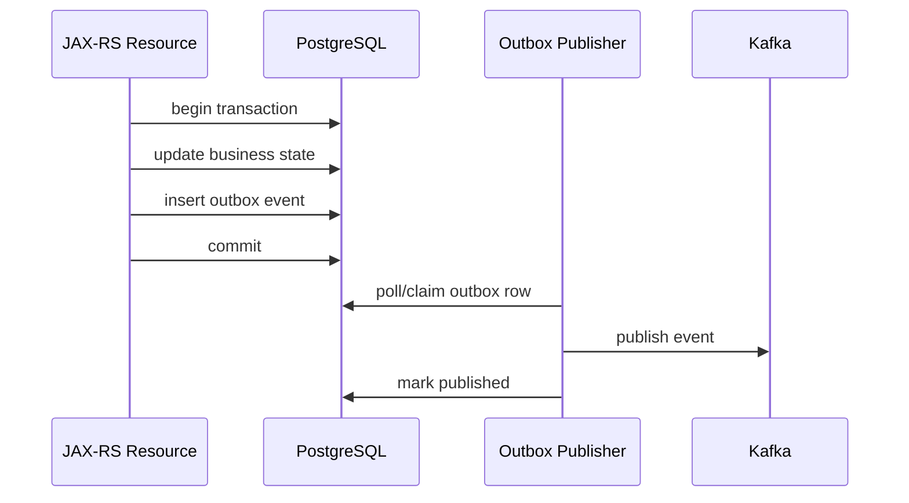
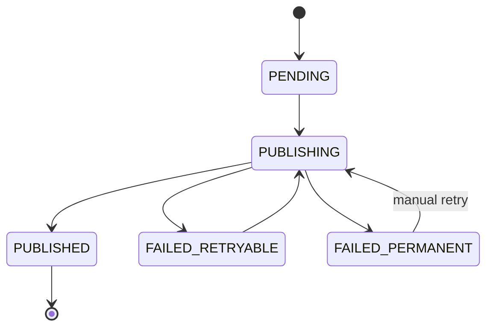
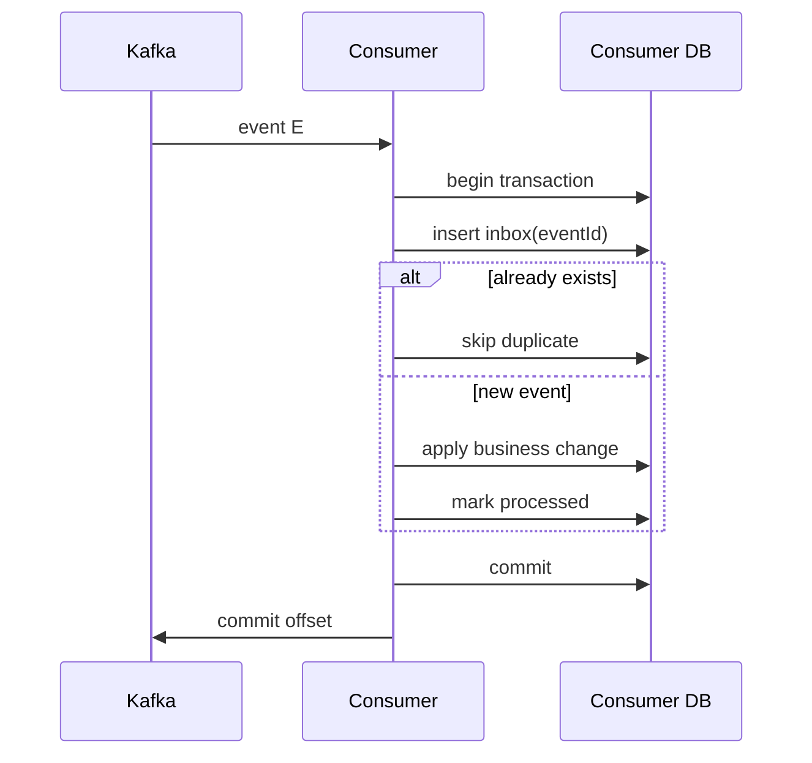
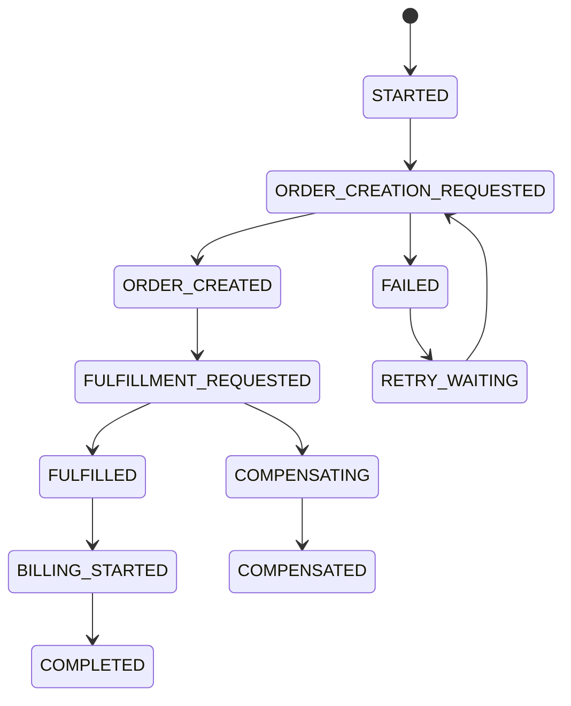
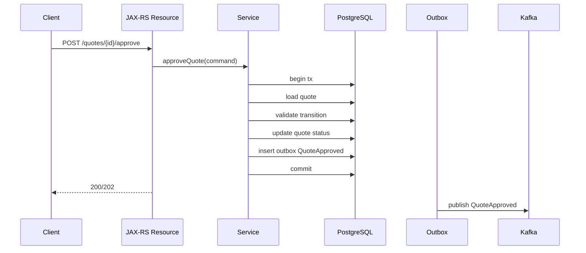

# Part 076 — Replay Contract, Inbox, Outbox, Saga State Table, and Reconciliation Job

> Fokus part ini: membangun mental model reliable event-driven processing. Kita akan membahas replay contract, inbox pattern, outbox pattern, saga state table, reconciliation job, duplicate policy, ordering policy, dan bagaimana sistem enterprise pulih dari partial failure.

Event-driven system tidak boleh bergantung pada harapan bahwa semuanya selalu sukses sekali jalan.

Di production, hal-hal ini normal:

- producer berhasil commit database tetapi gagal publish event
- producer publish event tetapi response API gagal
- consumer menerima event lalu crash sebelum commit offset
- consumer memproses event dua kali
- event datang terlambat
- event datang out-of-order
- DLQ harus di-reprocess
- Kafka retention menghapus event sebelum consumer catch up
- reconciliation menemukan state tidak konsisten
- deployment mengubah schema saat event lama masih perlu direplay

Karena itu event-driven architecture butuh recovery model eksplisit.

---

## 1. Core Mental Model

Reliable event-driven processing bukan berarti “exactly once everywhere”.

Mental model yang lebih realistis:

```text
state change must be durable
message publication must be recoverable
message consumption must be idempotent
side effects must be trackable
inconsistency must be reconcilable
```

Patterns yang membantu:

- outbox pattern
- inbox pattern
- idempotent consumer
- saga state table
- reconciliation job
- replay contract
- DLQ recovery
- duplicate handling
- ordering policy

Tujuan akhirnya:

```text
If something fails halfway, system can detect, retry, replay, reconcile, or compensate.
```

---

## 2. Why Replay Contract Exists

Replay adalah proses membaca ulang event lama untuk memulihkan atau membangun ulang state.

Replay dipakai untuk:

- recovery setelah consumer bug
- backfill materialized view
- rebuild read model
- reprocess DLQ
- audit investigation
- data migration
- reconciliation
- onboarding consumer baru

Replay contract menjawab:

```text
Can this event be safely processed again?
What side effects are allowed during replay?
How duplicates are detected?
How ordering is handled?
Which schema versions are readable?
Which time range is safe to replay?
Who approves replay?
How replay progress is tracked?
```

Tanpa replay contract, replay bisa menjadi incident kedua.

---

## 3. Replay Is Not Just “Reset Offset”

Resetting Kafka offset is a low-level operation.

Replay production membutuhkan desain:

```text
select event range
validate schema compatibility
disable unsafe side effects if needed
run consumer in replay mode
track progress
verify output
reconcile mismatches
restore normal mode
```

Jika consumer mengirim email, membuat order, memanggil billing, atau menulis audit baru, replay bisa menyebabkan duplicate side effects.

---

## 4. Replay Safety Levels

### Level 0 — Not Replay Safe

Replay akan menyebabkan side effect berbahaya.

Contoh:

```text
consumer sends external payment capture on every event
```

Tanpa idempotency, replay bisa double-charge.

### Level 1 — Replay Safe With Idempotency

Consumer boleh menerima event ulang karena dedupe state mencegah side effect duplicate.

```text
dedupe by eventId
```

### Level 2 — Replay Safe in Dry-Run Mode

Consumer bisa replay untuk validasi atau rebuild state tanpa melakukan external side effect.

```text
replayMode=true
sideEffects.disabled=true
```

### Level 3 — Fully Rebuildable

Consumer output bisa dihapus dan dibangun ulang dari event log.

```text
drop read model
reset offset
replay all events
```

Tidak semua sistem perlu level 3, tetapi level replay harus eksplisit.

---

## 5. Outbox Pattern Mental Model

Problem klasik:

```text
1. update database
2. publish Kafka event
```

Jika step 1 sukses dan step 2 gagal, state berubah tetapi event hilang.

Jika step 2 sukses dan response gagal, client mungkin retry dan menghasilkan duplicate command/event.

Outbox pattern menyimpan perubahan state dan event dalam transaksi database yang sama.



Dengan ini, event tidak hilang hanya karena Kafka publish gagal sesaat.

---

## 6. Outbox Table Example

Contoh schema konseptual:

```sql
CREATE TABLE event_outbox (
    id UUID PRIMARY KEY,
    aggregate_type TEXT NOT NULL,
    aggregate_id TEXT NOT NULL,
    event_type TEXT NOT NULL,
    event_version INT NOT NULL,
    topic TEXT NOT NULL,
    partition_key TEXT NOT NULL,
    payload JSONB NOT NULL,
    headers JSONB NOT NULL,
    status TEXT NOT NULL,
    attempt_count INT NOT NULL DEFAULT 0,
    next_attempt_at TIMESTAMPTZ NOT NULL DEFAULT now(),
    created_at TIMESTAMPTZ NOT NULL DEFAULT now(),
    published_at TIMESTAMPTZ,
    last_error TEXT
);

CREATE INDEX idx_event_outbox_pending
ON event_outbox (status, next_attempt_at, created_at)
WHERE status IN ('PENDING', 'FAILED_RETRYABLE');

CREATE INDEX idx_event_outbox_aggregate
ON event_outbox (aggregate_type, aggregate_id, created_at);
```

Production schema bisa berbeda. Yang penting adalah capability:

- durable event record
- retry state
- claim/lock mechanism
- publish status
- error tracking
- aggregate ordering support
- observability

---

## 7. Outbox Status Lifecycle



Status harus dirancang agar crash recovery jelas.

Jika publisher crash saat `PUBLISHING`, sistem harus tahu apakah row boleh diklaim ulang.

Biasanya perlu:

- lease timeout
- attempt count
- last heartbeat
- idempotent producer or deterministic event ID
- duplicate publish tolerance

---

## 8. Polling Publisher vs CDC Publisher

### 8.1 Polling Publisher

Outbox publisher query database secara periodik.

Kelebihan:

- sederhana
- tidak butuh CDC platform
- mudah dipahami Java team

Kekurangan:

- query pressure ke DB
- latency tergantung polling interval
- locking/claiming harus hati-hati
- scaling publisher harus aman

### 8.2 CDC Publisher

CDC tool membaca perubahan outbox dari WAL/log database.

Kelebihan:

- latency rendah
- scalable untuk volume tinggi
- tidak perlu polling query berat

Kekurangan:

- platform lebih kompleks
- connector failure mode perlu dikuasai
- schema evolution lebih sensitif
- operational ownership sering lintas team

Internal implementation harus diverifikasi. Jangan mengasumsikan CSG memakai polling atau CDC tanpa bukti.

---

## 9. Outbox Claiming and Locking

Polling publisher harus menghindari dua instance publish row yang sama bersamaan.

Pattern PostgreSQL umum:

```sql
WITH candidate AS (
    SELECT id
    FROM event_outbox
    WHERE status IN ('PENDING', 'FAILED_RETRYABLE')
      AND next_attempt_at <= now()
    ORDER BY created_at
    FOR UPDATE SKIP LOCKED
    LIMIT 100
)
UPDATE event_outbox o
SET status = 'PUBLISHING',
    attempt_count = attempt_count + 1
FROM candidate c
WHERE o.id = c.id
RETURNING o.*;
```

`SKIP LOCKED` membantu multiple workers memproses row berbeda.

Tetapi review tetap perlu:

- ordering per aggregate
- fairness
- starvation
- stuck publishing row
- retry backoff
- DB load

---

## 10. Outbox Ordering Per Aggregate

Jika event untuk aggregate sama harus ordered, outbox publisher tidak boleh publish event kedua sebelum event pertama selesai.

Contoh:

```text
QuoteCreated
QuoteLineItemAdded
QuoteApproved
```

Untuk `quoteId` sama, consumer mungkin perlu urutan ini.

Outbox harus menjaga:

```text
aggregate_type + aggregate_id + sequence
```

Contoh column:

```sql
aggregate_version BIGINT NOT NULL
```

atau:

```sql
sequence_no BIGINT NOT NULL
```

Review question:

```text
Does outbox preserve per-aggregate ordering or only best-effort creation order?
```

---

## 11. Inbox Pattern Mental Model

Inbox pattern melindungi consumer dari duplicate event.

Consumer menyimpan event yang sudah diproses.



Jika consumer crash sebelum offset commit, event bisa diterima lagi. Inbox membuat pemrosesan tetap idempotent.

---

## 12. Inbox Table Example

```sql
CREATE TABLE event_inbox (
    event_id UUID PRIMARY KEY,
    event_type TEXT NOT NULL,
    producer TEXT NOT NULL,
    topic TEXT NOT NULL,
    partition_no INT NOT NULL,
    offset_no BIGINT NOT NULL,
    received_at TIMESTAMPTZ NOT NULL DEFAULT now(),
    processed_at TIMESTAMPTZ,
    status TEXT NOT NULL,
    handler_version TEXT,
    error_code TEXT,
    error_message TEXT
);

CREATE INDEX idx_event_inbox_status
ON event_inbox (status, received_at);
```

Untuk idempotency kuat, insert inbox dan business side effect harus berada dalam transaksi yang sama jika memungkinkan.

---

## 13. Consumer Transaction Boundary

Ideal flow:

```text
begin DB transaction
  insert inbox row
  apply local state change
  mark inbox processed
commit DB transaction
commit Kafka offset
```

Jika Kafka offset commit gagal setelah DB commit, event akan dibaca ulang. Inbox mencegah duplicate side effect.

Jika DB transaction gagal, offset tidak boleh commit. Event akan diproses ulang.

---

## 14. Inbox and External Side Effects

Jika consumer memanggil external service, transaksi lokal tidak cukup.

Contoh:

```text
QuoteApproved event -> consumer calls billing API
```

Problem:

- billing call sukses
- consumer crash sebelum mark inbox processed
- event diproses ulang
- billing dipanggil lagi

Solusi:

- idempotency key pada external call
- local side effect request table
- outbox command to external integration worker
- saga state table
- reconciliation job

External side effect harus punya idempotency boundary sendiri.

---

## 15. Idempotent Consumer Pattern

Consumer idempotent berarti hasil akhirnya sama walau event diproses lebih dari sekali.

```text
process(E)
process(E)
=> same final state as process(E) once
```

Cara umum:

- dedupe by `eventId`
- upsert by natural key
- compare aggregate version
- state transition guard
- external idempotency key
- inbox table

Contoh state guard:

```sql
UPDATE order_projection
SET quote_status = 'APPROVED', updated_at = now()
WHERE quote_id = :quoteId
  AND quote_status <> 'APPROVED';
```

Tetapi guard sederhana tidak cukup jika side effect eksternal sudah terjadi.

---

## 16. Duplicate Event Policy

Duplicate policy harus eksplisit di event catalog.

Contoh:

```yaml
duplicatePolicy:
  producer: eventId is stable per outbox row
  consumer: dedupe by eventId in event_inbox table
  externalSideEffects: use idempotency key = eventId
```

Policy ini lebih berguna daripada klaim “Kafka exactly once”.

---

## 17. Ordering Policy and Consumer Parallelism

Kafka memberi ordering per partition.

Consumer bisa merusaknya jika:

- memproses record secara parallel tanpa key partitioning
- retry event tertentu ke topic lain
- commit offset sebelum async task selesai
- DLQ replay dicampur dengan live events

Jika ordering per `quoteId` penting, consumer parallelism harus key-aware.

```text
same quoteId -> same processing lane
```

Atau gunakan state version check:

```text
process only if event.aggregateVersion == currentVersion + 1
```

---

## 18. Aggregate Version

Aggregate version membantu ordering dan stale event detection.

Example event payload:

```json
{
  "eventType": "QuoteApproved",
  "aggregateId": "Q-10001",
  "aggregateVersion": 7,
  "occurredAt": "2026-07-10T10:15:30Z"
}
```

Consumer can check:

```text
if event.version <= projection.version:
  duplicate or stale, skip
if event.version == projection.version + 1:
  process
if event.version > projection.version + 1:
  gap detected
```

Gap detection is valuable for projections and materialized views.

---

## 19. Saga State Table Mental Model

Saga coordinates multi-step process across services.

Example:

```text
QuoteApproved
  -> create order
  -> reserve inventory
  -> activate service
  -> notify customer
  -> start billing
```

If steps span services and cannot be one database transaction, saga tracks progress.

Saga state table stores:

- saga ID
- correlation ID
- current state
- step status
- retry count
- compensation state
- last processed event
- timeout/deadline

---

## 20. Saga State Table Example

```sql
CREATE TABLE saga_instance (
    saga_id UUID PRIMARY KEY,
    saga_type TEXT NOT NULL,
    business_key TEXT NOT NULL,
    tenant_id TEXT,
    state TEXT NOT NULL,
    status TEXT NOT NULL,
    current_step TEXT,
    correlation_id TEXT NOT NULL,
    causation_id TEXT,
    version BIGINT NOT NULL DEFAULT 0,
    started_at TIMESTAMPTZ NOT NULL DEFAULT now(),
    updated_at TIMESTAMPTZ NOT NULL DEFAULT now(),
    deadline_at TIMESTAMPTZ,
    last_error TEXT
);

CREATE UNIQUE INDEX idx_saga_business_key
ON saga_instance (saga_type, business_key);
```

Step table:

```sql
CREATE TABLE saga_step (
    saga_id UUID NOT NULL,
    step_name TEXT NOT NULL,
    status TEXT NOT NULL,
    attempt_count INT NOT NULL DEFAULT 0,
    last_event_id UUID,
    started_at TIMESTAMPTZ,
    completed_at TIMESTAMPTZ,
    last_error TEXT,
    PRIMARY KEY (saga_id, step_name)
);
```

---

## 21. Saga State Machine



A saga state table makes long-running process debuggable.

Without it, workflow progress is hidden across logs and offsets.

---

## 22. Saga vs BPMN Engine

Saga state table is lightweight orchestration.

BPMN engine is explicit process runtime.

Saga table may be enough when:

- process is simple
- few steps
- engineering team owns full flow
- no complex human tasks
- state machine is clear

BPMN engine may be better when:

- process has many branches
- business users need visibility
- human tasks exist
- compensation is complex
- process versioning matters

Do not use BPMN just because workflow exists. Do not use ad-hoc saga if process needs strong operational visibility.

---

## 23. Reconciliation Job Mental Model

Reconciliation detects and fixes inconsistency after partial failure.

Examples:

```text
quote approved but no order created
outbox row stuck pending too long
consumer projection missing event
billing started but order not fulfilled
catalog version active in DB but not reflected in cache
```

Reconciliation is not a hack. It is a production safety net.

---

## 24. Reconciliation Job Types

### 24.1 State Reconciliation

Compare source of truth vs derived state.

```text
quote DB says APPROVED
order DB has no order for quote
=> create missing order request or raise incident
```

### 24.2 Outbox Reconciliation

Find stuck outbox rows.

```sql
SELECT *
FROM event_outbox
WHERE status IN ('PENDING', 'PUBLISHING', 'FAILED_RETRYABLE')
  AND created_at < now() - interval '15 minutes';
```

### 24.3 Inbox Reconciliation

Find failed or stuck consumer processing.

```sql
SELECT *
FROM event_inbox
WHERE status = 'FAILED_RETRYABLE'
  AND received_at < now() - interval '10 minutes';
```

### 24.4 Cross-System Reconciliation

Compare state across systems.

```text
order status vs fulfillment status vs billing status
```

---

## 25. Reconciliation Job Design

Reconciliation job must be:

- idempotent
- observable
- bounded
- retryable
- safe to run multiple times
- tenant-aware if multi-tenant
- rate-limited
- auditable
- able to dry-run

Bad reconciliation job:

```text
scan everything and mutate blindly
```

Good reconciliation job:

```text
find bounded inconsistency
record candidate
validate current state
apply idempotent correction
emit audit/reconciliation event
record result
```

---

## 26. Reconciliation Table

For complex reconciliation, store findings.

```sql
CREATE TABLE reconciliation_case (
    id UUID PRIMARY KEY,
    case_type TEXT NOT NULL,
    business_key TEXT NOT NULL,
    tenant_id TEXT,
    detected_at TIMESTAMPTZ NOT NULL DEFAULT now(),
    status TEXT NOT NULL,
    severity TEXT NOT NULL,
    source_snapshot JSONB NOT NULL,
    target_snapshot JSONB,
    proposed_action TEXT,
    applied_at TIMESTAMPTZ,
    last_error TEXT
);

CREATE UNIQUE INDEX idx_reconciliation_open_case
ON reconciliation_case (case_type, business_key)
WHERE status IN ('OPEN', 'IN_PROGRESS');
```

This avoids repeatedly rediscovering the same inconsistency without tracking.

---

## 27. DLQ Replay

DLQ is not a trash can. It is a recovery queue.

DLQ replay process:

```text
1. Classify failure reason.
2. Fix code/config/data if needed.
3. Validate schema compatibility.
4. Select DLQ records.
5. Replay to original topic or retry topic.
6. Monitor consumer lag/errors.
7. Mark DLQ case resolved.
```

DLQ event should preserve original metadata:

- original topic
- partition
- offset
- event ID
- event type
- schema ID
- failure reason
- consumer name
- failure timestamp

---

## 28. Replay Modes

### 28.1 Live Replay

Replay event into normal pipeline.

Risk:

- triggers side effects
- competes with live traffic
- ordering issues

### 28.2 Isolated Replay

Run dedicated replay consumer to rebuild projection.

Risk:

- separate code path divergence
- must validate output

### 28.3 Dry-Run Replay

Process event but do not mutate external systems.

Useful for:

- validating fix
- estimating impact
- debugging consumer logic

### 28.4 Targeted Replay

Replay by business key/time range/event type.

Useful for:

- limited blast radius
- support recovery
- tenant-specific issue

---

## 29. Replay Contract Template

```yaml
eventName: QuoteApproved
replaySafe: true
replayModes:
  - live
  - dry-run
  - projection-rebuild
idempotency:
  key: eventId
  storage: event_inbox
sideEffects:
  externalCalls: require idempotency key
  notifications: disabled in replay unless explicitly enabled
ordering:
  required: per quoteId
  handling: aggregateVersion guard
schema:
  requiredVersionsReadable:
    - 1
    - 2
approval:
  requiredForProductionReplay: true
observability:
  metrics:
    - replay_events_processed_total
    - replay_events_failed_total
    - replay_duration_seconds
```

This template can be part of event catalog.

---

## 30. Event Replay and Time

Replay changes time semantics.

Important timestamps:

```text
occurredAt    = when business event happened
publishedAt   = when producer published
consumedAt    = when consumer received
processedAt   = when consumer completed
replayedAt    = when replay occurred
```

Never replace `occurredAt` with replay time.

Replay should preserve original event facts.

---

## 31. Replay and External Notifications

Notification consumers are dangerous during replay.

Example:

```text
QuoteApproved replay -> customer receives old approval email again
```

Mitigations:

- notification dedupe table
- replay mode disables notifications
- notification idempotency key
- only replay into projection consumer
- separate business approval for notification replay

---

## 32. Replay and Audit

Audit log should usually distinguish original processing from replay processing.

Example audit metadata:

```json
{
  "action": "EVENT_REPLAY_PROCESSED",
  "eventId": "...",
  "originalOccurredAt": "2026-07-10T10:15:30Z",
  "replayedAt": "2026-07-11T09:00:00Z",
  "operator": "system-replay-job",
  "reason": "rebuild-order-projection"
}
```

Do not make replay look like original user action.

---

## 33. API Command to Outbox Flow

A typical JAX-RS command endpoint:



The API response should not pretend downstream processing is complete unless it really is.

---

## 34. 200 vs 202 with Event-Driven Side Effects

If API only commits local state and downstream processing happens asynchronously, response semantics matter.

```text
200 OK
```

Can mean command accepted and local state updated.

```text
202 Accepted
```

Can mean command accepted but processing not complete.

Use response semantics carefully. Do not return success implying order/billing/fulfillment completed if only event publication was queued.

---

## 35. Outbox and HTTP Idempotency Key

For command endpoints, combine idempotency key and outbox.

```text
POST /quotes/{id}/approve
Idempotency-Key: abc-123
```

Store command result:

```sql
CREATE TABLE idempotency_record (
    idempotency_key TEXT NOT NULL,
    tenant_id TEXT NOT NULL,
    command_type TEXT NOT NULL,
    request_hash TEXT NOT NULL,
    response_snapshot JSONB,
    status TEXT NOT NULL,
    created_at TIMESTAMPTZ NOT NULL DEFAULT now(),
    PRIMARY KEY (tenant_id, idempotency_key)
);
```

This prevents client retry from creating duplicate state transitions/events.

---

## 36. Common Failure Scenarios

### Scenario 1 — DB Commit Succeeds, Kafka Publish Fails

Without outbox:

```text
state changed, event lost
```

With outbox:

```text
outbox row remains pending, publisher retries
```

### Scenario 2 — Kafka Publish Succeeds, Publisher Crashes Before Marking Published

Possible outcome:

```text
event published twice
```

Consumer must be idempotent.

### Scenario 3 — Consumer Side Effect Succeeds, Offset Commit Fails

Possible outcome:

```text
event consumed again
```

Inbox/external idempotency needed.

### Scenario 4 — Consumer Code Bug Sends Events to DLQ

Recovery:

```text
fix code
verify schema
replay DLQ
monitor result
```

### Scenario 5 — Event Out-of-Order

Mitigation:

```text
aggregateVersion guard
buffer/gap detection
reconciliation
manual repair
```

---

## 37. Monitoring Outbox

Useful metrics:

```text
outbox_pending_total
outbox_oldest_pending_age_seconds
outbox_publish_attempts_total
outbox_publish_failures_total
outbox_published_total
outbox_stuck_publishing_total
outbox_publish_latency_seconds
```

Alerts:

```text
oldest pending age > threshold
publish failure rate high
pending rows growing continuously
stuck publishing rows exist
```

---

## 38. Monitoring Inbox/Consumer

Useful metrics:

```text
consumer_events_processed_total
consumer_events_duplicate_total
consumer_events_failed_total
consumer_processing_latency_seconds
consumer_inbox_failed_total
consumer_lag_records
consumer_lag_seconds
```

High duplicate rate may indicate:

- producer retry issue
- offset commit issue
- replay running
- consumer crash loop

---

## 39. Monitoring Reconciliation

Useful metrics:

```text
reconciliation_cases_detected_total
reconciliation_cases_resolved_total
reconciliation_cases_failed_total
reconciliation_open_cases
reconciliation_oldest_open_case_age_seconds
```

A reconciliation job that detects mismatches but nobody reviews them is not enough.

There must be ownership and escalation.

---

## 40. Data Retention and Replay Window

Replay depends on retention.

Questions:

- how long does Kafka retain topic data?
- are events archived to object storage/data lake?
- are schemas retained forever?
- how long are inbox/outbox rows retained?
- can old event versions still be deserialized?
- is replay allowed after PII retention window?

Retention is part of replay contract.

---

## 41. Multi-Tenant Replay

In multi-tenant systems, replay must be tenant-aware.

Risk:

- replay tenant A event into tenant B context
- metrics/logs leak tenant ID
- tenant-specific config changed since original event
- catalog/pricing rules effective date changed

Replay must preserve:

- tenant ID
- original occurredAt
- original configuration context if needed
- original catalog/pricing version if event depends on it

For CPQ/order contexts, effective date and catalog version can matter as much as event ID.

---

## 42. Reconciliation and Effective Dates

Suppose quote was approved under catalog version `C-2026-07`.

If reconciliation runs later after catalog version changed, it must not recompute using current catalog unless intended.

Store enough context:

```text
catalogVersionId
pricingEffectiveDate
taxPolicyVersion
currency
roundingPolicy
```

Otherwise reconciliation may “fix” data incorrectly.

---

## 43. Outbox Payload: Snapshot vs Reference

Outbox event payload can contain snapshot data or references.

### Snapshot

```json
{
  "quoteId": "Q-10001",
  "status": "APPROVED",
  "approvedAt": "2026-07-10T10:15:30Z",
  "totalAmount": "1200.00",
  "currency": "USD"
}
```

Pros:

- consumer does not need callback
- replay stable
- audit-friendly

Cons:

- payload larger
- PII/sensitive data risk
- schema evolution burden

### Reference

```json
{
  "quoteId": "Q-10001"
}
```

Pros:

- small payload
- less data duplication

Cons:

- consumer must call source service
- replay may read current state, not historical state
- source service availability becomes dependency

Senior review must choose intentionally.

---

## 44. Event Replay and Historical Correctness

If event only contains ID and consumer fetches current state during replay, result may differ from original processing.

Example:

```text
QuoteApproved event from July 10
Replay on July 20
Consumer fetches quote current state: CANCELLED
```

Is that correct?

Maybe yes for reconciliation, maybe no for historical projection.

Replay contract must define whether consumer uses:

- event snapshot
- current source state
- historical source state
- versioned source state

---

## 45. Outbox Cleanup and Archival

Outbox table can grow large.

Cleanup strategy:

```text
keep published rows for N days
archive important rows to object storage/data warehouse
keep failed rows until resolved
never delete rows required for audit/replay before retention policy
```

Cleanup job must be safe:

- bounded batch size
- index-supported query
- no long transaction
- observable
- tenant-aware if needed

---

## 46. Inbox Cleanup and Dedupe Window

Inbox retention defines duplicate detection window.

If inbox rows are deleted after 7 days but replay processes 30-day-old events, dedupe may fail.

Retention must align with replay policy.

```text
inbox retention >= maximum replay window requiring dedupe
```

Or use separate durable idempotency store for replay-sensitive events.

---

## 47. Reprocessing Failed Jobs vs Replaying Events

Do not confuse:

```text
retry failed job
```

with:

```text
replay original event
```

Retry failed job usually continues the same processing attempt.

Replay original event re-enters pipeline from event boundary.

Both need idempotency, but operational semantics differ.

---

## 48. Operational Runbook: Stuck Outbox

Runbook example:

```text
Symptoms:
  outbox_oldest_pending_age_seconds high
  event consumers missing expected event

Checks:
  inspect pending rows
  inspect last_error
  inspect Kafka broker availability
  inspect schema registry availability
  inspect publisher logs/traces
  inspect DB locks

Actions:
  fix config/connectivity/schema issue
  release stuck PUBLISHING rows if lease expired
  restart publisher if safe
  manually retry FAILED_PERMANENT only after root cause known

Validation:
  pending age returns normal
  expected event appears in topic
  downstream consumer processes event
```

---

## 49. Operational Runbook: DLQ Spike

```text
Symptoms:
  DLQ count increasing
  consumer failure rate high

Checks:
  sample DLQ payload
  classify failure: schema, validation, dependency, poison data, code bug
  check producer deploy
  check consumer deploy
  check schema registry
  check downstream dependency

Actions:
  stop unsafe consumer if side effects dangerous
  patch consumer or data/config
  replay limited sample
  monitor
  replay remaining DLQ

Validation:
  DLQ no longer increasing
  consumer lag decreases
  downstream state reconciled
```

---

## 50. Operational Runbook: Reconciliation Mismatch

```text
Symptoms:
  reconciliation job detects quote approved but order missing

Checks:
  confirm source-of-truth state
  inspect event outbox row
  inspect Kafka topic for eventId
  inspect consumer inbox
  inspect downstream state
  inspect DLQ
  inspect idempotency records

Actions:
  if event not published: republish from outbox
  if event in DLQ: fix and replay
  if consumer skipped incorrectly: repair inbox/projection safely
  if downstream side effect missing: issue idempotent command

Validation:
  source and target state align
  reconciliation case resolved
  audit trail recorded
```

---

## 51. Testing Strategy

Test outbox:

- DB transaction inserts business state and outbox row atomically
- publisher retries transient publish failure
- publisher handles duplicate publish safely
- stuck publishing row can be recovered
- outbox ordering per aggregate works if required

Test inbox:

- duplicate event skipped
- crash before offset commit does not duplicate side effect
- failure does not commit offset
- replay mode does not send unsafe side effect

Test reconciliation:

- detects missing downstream state
- idempotently applies correction
- handles already-fixed case
- respects tenant and effective date

---

## 52. Java Pseudocode: Outbox in Application Service

```java
public ApprovalResult approveQuote(ApproveQuoteCommand command) {
    return transactionTemplate.execute(tx -> {
        Quote quote = quoteRepository.findForUpdate(command.quoteId());
        quote.approve(command.approvedBy(), clock.instant());

        quoteRepository.save(quote);

        EventMetadata metadata = eventMetadataFactory.create(
            "QuoteApproved",
            command.correlationId(),
            command.commandId(),
            command.tenantId()
        );

        QuoteApprovedEvent event = quoteEventMapper.toQuoteApproved(quote, metadata);
        outboxRepository.insert(OutboxEvent.from(event, "quote.events", quote.id()));

        return ApprovalResult.from(quote);
    });
}
```

Important point:

```text
business state update and outbox insert are in the same transaction
```

---

## 53. Java Pseudocode: Inbox Consumer

```java
public void handle(QuoteApprovedEvent event, KafkaRecordMetadata record) {
    transactionTemplate.executeWithoutResult(tx -> {
        boolean inserted = inboxRepository.tryInsert(
            event.metadata().eventId(),
            event.metadata().eventType(),
            record.topic(),
            record.partition(),
            record.offset()
        );

        if (!inserted) {
            return; // duplicate
        }

        orderProjectionService.applyQuoteApproved(event);

        inboxRepository.markProcessed(event.metadata().eventId());
    });
}
```

Offset should be committed only after transaction success.

---

## 54. Internal Verification Checklist

Verify internally:

- Whether outbox pattern is used.
- Whether event publication is in same DB transaction as state change.
- Whether outbox uses polling, CDC, or another mechanism.
- Outbox table schema and status lifecycle.
- Outbox publisher retry/backoff policy.
- Outbox stuck row recovery policy.
- Whether publisher supports per-aggregate ordering.
- Whether event ID is stable across retry.
- Whether inbox pattern is used by consumers.
- Inbox retention and dedupe window.
- Consumer offset commit strategy.
- External side-effect idempotency strategy.
- Saga state table usage.
- Reconciliation jobs and ownership.
- DLQ replay runbook.
- Replay approval process.
- Replay mode support: live, dry-run, projection rebuild.
- Duplicate event policy.
- Ordering policy.
- Effective date/catalog/pricing context during replay.
- Observability metrics for outbox, inbox, DLQ, replay, and reconciliation.
- Incident history related to missing/duplicate/out-of-order events.

For CSG Quote & Order, validate these from repository, database migration files, Kafka consumers/producers, scheduled jobs, runbooks, observability dashboards, platform standards, and team discussion. Do not infer internal mechanism without evidence.

---

## 55. PR Review Checklist

For producer/outbox changes:

```text
[ ] Business state and event outbox are committed atomically.
[ ] Event ID is stable and unique.
[ ] Event payload is contract DTO, not persistence entity.
[ ] Partition key matches ordering policy.
[ ] Outbox retry is bounded and observable.
[ ] Stuck publishing recovery is defined.
[ ] Schema/catalog updated.
```

For consumer/inbox changes:

```text
[ ] Consumer is idempotent.
[ ] Inbox/dedupe key is explicit.
[ ] Offset commit happens after durable processing.
[ ] External side effects use idempotency key.
[ ] Replay behavior is documented.
[ ] DLQ behavior is defined.
[ ] Metrics and logs include eventId/correlationId safely.
```

For reconciliation changes:

```text
[ ] Job is idempotent.
[ ] Job is bounded and rate-limited.
[ ] Job has dry-run or preview mode if needed.
[ ] Job records findings and actions.
[ ] Job respects tenant and effective date.
[ ] Job has metrics, alerts, and owner.
```

---

## 56. Principal-Level Heuristics

Ask:

```text
If Kafka publish fails after DB commit, how do we recover?
If consumer processes the event twice, what happens?
If event arrives out-of-order, what happens?
If DLQ has one million events, what is the replay plan?
If schema changes, can old events still be replayed?
If reconciliation finds mismatch, who owns resolution?
If external side effect succeeds but local state fails, how is it detected?
If tenant-specific config changed since event occurred, how does replay behave?
```

If the answer is “that should not happen”, the design is not production-ready.

---

## 57. Summary

Reliable event-driven architecture is built on recovery, not optimism.

The production-grade model is:

```text
outbox protects event publication
inbox protects event consumption
idempotency protects duplicates
saga state tracks long-running process
reconciliation detects inconsistency
replay contract enables safe recovery
observability makes failure visible
```

For enterprise quote/order systems, these patterns are not optional polish. They are the difference between a system that merely works in happy path and a system that can be operated under failure.

---

## 58. Practical Exercise

Pick one business transition, such as quote approval or order submission, and map it:

```text
HTTP command:
Database transaction:
Outbox event:
Kafka topic:
Consumer:
Inbox/dedupe:
External side effect:
Saga state:
Reconciliation rule:
Replay policy:
DLQ policy:
Metrics:
Runbook:
```

Then answer:

```text
What happens if every step fails right after it succeeds?
```

That question exposes whether the design is production-grade.
