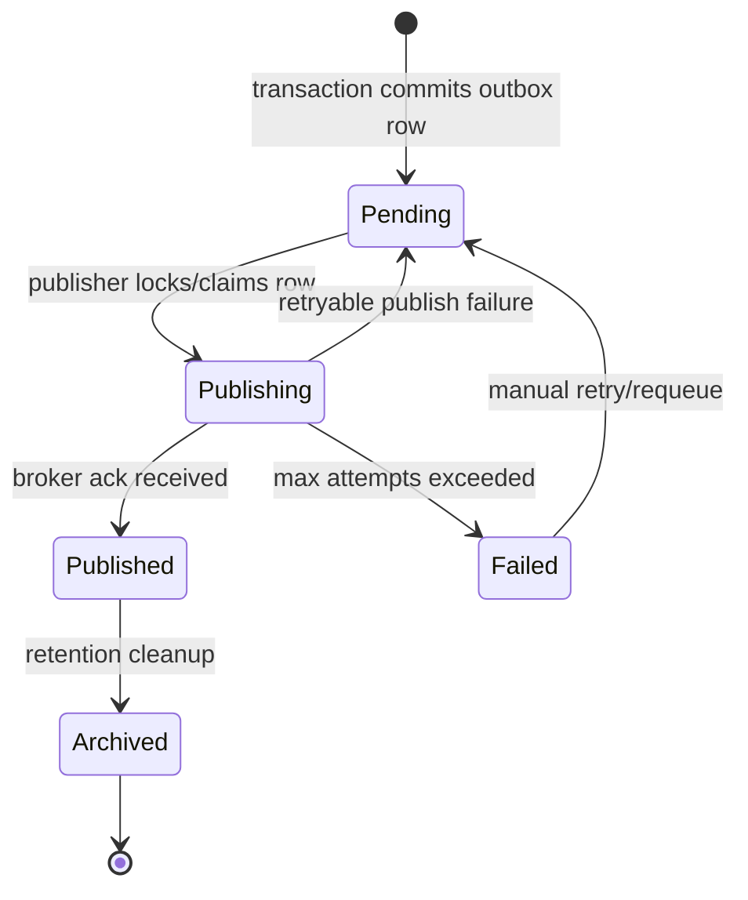

# Part 079 — CDC, Outbox Publishing, and JAX-RS API/Event Boundary

> Fokus part ini: memahami bagaimana perubahan state yang dimulai dari endpoint JAX-RS dapat dipersist, dipublikasikan sebagai event, direplay, dideduplicate, dan dioperasikan secara aman di production.

Dalam sistem enterprise, API dan event bukan dua dunia terpisah.

Sering kali satu request HTTP seperti:

```text
POST /quotes/{quoteId}/submit
```

menghasilkan beberapa consequence:

- validasi request
- validasi permission
- perubahan state di database
- audit trail
- outbox record
- event Kafka
- downstream projection
- downstream workflow
- notification
- reconciliation path

Masalah utamanya bukan “bagaimana publish event”.

Masalah senior-level-nya adalah:

```text
How do we make state change and event publication reliable together?
```

Kalau database commit berhasil tetapi event tidak terkirim, downstream menjadi stale.

Kalau event terkirim tetapi database rollback, downstream melihat fakta yang tidak pernah benar-benar terjadi.

Kalau event terkirim dua kali, consumer bisa membuat side effect ganda.

Kalau event terkirim out-of-order, projection bisa salah.

Karena itu, API-event boundary adalah reliability boundary.

---

## 1. Core Mental Model

JAX-RS endpoint biasanya adalah synchronous command boundary.

Kafka event biasanya adalah asynchronous fact distribution boundary.

Outbox/CDC menghubungkan keduanya.

```text
HTTP command
  -> validate
  -> transaction
      -> update domain tables
      -> insert outbox row
  -> commit
  -> publisher/CDC reads outbox
  -> Kafka event
  -> consumers update their own state
```

Critical invariant:

```text
The event must represent committed state, not intended state.
```

Event bukan “apa yang ingin dilakukan”.

Event adalah “apa yang sudah terjadi dan committed”.

---

## 2. Why Direct Publish inside Request Transaction Is Dangerous

Naive implementation:

```java
@POST
@Path("/{quoteId}/submit")
public Response submitQuote(@PathParam("quoteId") String quoteId) {
    quoteService.submit(quoteId);
    kafkaProducer.send("quote-submitted", event);
    return Response.accepted().build();
}
```

Terlihat sederhana.

Tetapi failure mode-nya besar.

```text
Case 1:
DB commit succeeds
Kafka publish fails
=> state changed, no event

Case 2:
Kafka publish succeeds
DB commit fails
=> event claims something happened, but state did not commit

Case 3:
Kafka send times out
Broker actually received it
App retries
=> duplicate event

Case 4:
Request thread blocks on Kafka
Kafka latency rises
HTTP thread pool exhausted
=> API outage caused by event infrastructure
```

Synchronous publish bisa benar untuk use case tertentu, tetapi harus dipilih sadar dengan failure model eksplisit.

Default untuk state-change enterprise service biasanya lebih aman memakai outbox.

---

## 3. Outbox Pattern

Outbox pattern menyimpan event intent sebagai row database dalam transaction yang sama dengan perubahan domain.

```text
BEGIN
  update quote set status = 'SUBMITTED'
  insert into outbox_event (...)
COMMIT
```

Setelah commit, publisher membaca outbox row dan mengirim ke Kafka.

Outbox menyelesaikan masalah atomicity antara:

- domain state
- event publication request

Bukan berarti outbox menghilangkan semua problem.

Outbox masih membutuhkan:

- idempotent publishing
- duplicate-tolerant consumer
- ordering strategy
- cleanup/archival
- replay tooling
- observability
- recovery playbook

---

## 4. Minimal Outbox Table Shape

Contoh konseptual:

```sql
CREATE TABLE outbox_event (
    id                 UUID PRIMARY KEY,
    aggregate_type     TEXT NOT NULL,
    aggregate_id       TEXT NOT NULL,
    event_type         TEXT NOT NULL,
    event_version      INTEGER NOT NULL,
    event_key          TEXT NOT NULL,
    payload            JSONB NOT NULL,
    headers            JSONB NOT NULL DEFAULT '{}',
    tenant_id          TEXT NULL,
    trace_id           TEXT NULL,
    causation_id       TEXT NULL,
    correlation_id     TEXT NULL,
    created_at         TIMESTAMPTZ NOT NULL DEFAULT now(),
    published_at       TIMESTAMPTZ NULL,
    publish_attempts   INTEGER NOT NULL DEFAULT 0,
    last_error         TEXT NULL,
    status             TEXT NOT NULL DEFAULT 'PENDING'
);

CREATE INDEX idx_outbox_pending_created
ON outbox_event (status, created_at)
WHERE status = 'PENDING';

CREATE INDEX idx_outbox_aggregate
ON outbox_event (aggregate_type, aggregate_id, created_at);
```

Fields penting:

- `id`: unique event id untuk dedupe
- `aggregate_type`: misalnya `Quote`, `Order`, `ProductCatalog`
- `aggregate_id`: identifier aggregate/domain object
- `event_type`: nama event
- `event_version`: versi schema event
- `event_key`: key Kafka/partitioning
- `payload`: body event
- `headers`: metadata event
- `tenant_id`: multi-tenant isolation
- `trace_id`: distributed tracing
- `correlation_id`: request/business correlation
- `causation_id`: event/request penyebab
- `status`: lifecycle publishing

Outbox row adalah operational artifact.

Ia harus bisa diobservasi, diretry, direplay, dan diaudit.

---

## 5. Outbox Lifecycle



State minimal bisa lebih sederhana, tetapi lifecycle harus eksplisit.

Anti-pattern:

```text
outbox row exists but nobody knows whether it was published
```

Production system perlu menjawab:

- berapa outbox pending?
- berapa lama oldest pending row?
- berapa publish failure per event type?
- berapa duplicate publish?
- apakah publisher stuck?
- apakah event tertentu bisa direplay?

---

## 6. API Command to Outbox Transaction

Endpoint JAX-RS sebaiknya tidak tahu detail Kafka low-level.

Ia boleh tahu bahwa command menghasilkan business event, tetapi publication mechanism sebaiknya berada di application/infrastructure layer.

```text
Resource method
  -> application service
      -> domain operation
      -> repository update
      -> outbox append
  -> response
```

Example structure:

```java
@Path("/quotes")
public class QuoteResource {
    private final SubmitQuoteUseCase submitQuoteUseCase;

    @POST
    @Path("/{quoteId}/submit")
    public Response submitQuote(
            @PathParam("quoteId") String quoteId,
            SubmitQuoteRequest request,
            @Context SecurityContext securityContext) {

        SubmitQuoteResult result = submitQuoteUseCase.submit(
                new SubmitQuoteCommand(
                        quoteId,
                        request.reason(),
                        securityContext.getUserPrincipal().getName()
                )
        );

        return Response.accepted()
                .entity(new SubmitQuoteResponse(result.quoteId(), result.status()))
                .build();
    }
}
```

Application service:

```java
public final class SubmitQuoteUseCase {
    private final QuoteRepository quoteRepository;
    private final OutboxWriter outboxWriter;
    private final TransactionRunner transactionRunner;

    public SubmitQuoteResult submit(SubmitQuoteCommand command) {
        return transactionRunner.inTransaction(() -> {
            Quote quote = quoteRepository.getForUpdate(command.quoteId());

            quote.submit(command.reason(), command.actor());

            quoteRepository.save(quote);

            outboxWriter.append(
                    OutboxEvent.fromDomainEvent(quote.pullDomainEvents().get(0))
            );

            return new SubmitQuoteResult(quote.id(), quote.status());
        });
    }
}
```

Key point:

```text
Domain state update and outbox insert must commit together.
```

---

## 7. Response Semantics for API That Emits Events

A JAX-RS endpoint that writes outbox usually should not imply downstream completion.

Example:

```http
202 Accepted
```

can mean:

```text
The command was accepted and committed locally.
Downstream asynchronous effects may still be pending.
```

But not every command needs `202`.

Use `200`/`201` when local state is complete from API perspective.

Use `202` when operation semantics are asynchronous or long-running.

Important distinction:

```text
HTTP response confirms local command outcome.
Event confirms committed fact to async consumers.
```

Do not return success if transaction did not commit.

Do not tell clients that downstream systems are updated unless you actually wait for and verify that outcome.

---

## 8. CDC-Based Publishing

CDC means Change Data Capture.

Instead of application polling the outbox table, a CDC tool watches the database transaction log and publishes changes.

Typical model:

```text
PostgreSQL WAL
  -> CDC connector
  -> Kafka topic
```

For outbox, CDC can observe insert into `outbox_event`.

```text
transaction commits domain row + outbox row
CDC sees committed outbox insert
CDC publishes event to Kafka
```

Benefits:

- less custom publisher code
- reads committed DB log
- scalable event extraction
- strong ordering relative to DB commit log, depending on setup

Risks:

- connector lag
- schema drift
- connector misconfiguration
- payload transform bug
- tombstone/delete behavior confusion
- operational dependency on replication slots/WAL retention

---

## 9. Polling Publisher-Based Outbox

Alternative: application-managed publisher polls outbox table.

```text
scheduled publisher
  -> select pending rows
  -> lock rows
  -> publish to Kafka
  -> mark as published
```

Example SQL pattern:

```sql
SELECT *
FROM outbox_event
WHERE status = 'PENDING'
ORDER BY created_at
LIMIT 100
FOR UPDATE SKIP LOCKED;
```

Benefits:

- easier to understand for many teams
- application-level retry logic
- explicit status tracking
- easier manual requeue

Risks:

- table polling pressure
- duplicate publish if ack/update boundary fails
- publisher scaling complexity
- transaction lock contention
- custom code maintenance

---

## 10. The Publish Acknowledgement Gap

Polling publisher has a classic gap:

```text
publish to Kafka succeeds
process crashes before marking row published
```

After restart, row still appears pending.

It will publish again.

Therefore:

```text
Duplicate event publication is normal and must be tolerated.
```

Do not design consumers assuming exactly-once end-to-end.

Even when Kafka producer idempotence or transactions are used, system-level exactly-once across DB + Kafka + downstream side effects is still hard and must be proven carefully.

Senior default:

```text
At-least-once publication + idempotent consumers + reconciliation.
```

---

## 11. Idempotent Consumer Requirement

If outbox can duplicate, consumers must dedupe.

Consumer dedupe table example:

```sql
CREATE TABLE processed_event (
    event_id       UUID PRIMARY KEY,
    consumer_name  TEXT NOT NULL,
    processed_at   TIMESTAMPTZ NOT NULL DEFAULT now()
);
```

But if multiple consumers share the same table, primary key should include consumer identity:

```sql
CREATE TABLE processed_event (
    consumer_name  TEXT NOT NULL,
    event_id       UUID NOT NULL,
    processed_at   TIMESTAMPTZ NOT NULL DEFAULT now(),
    PRIMARY KEY (consumer_name, event_id)
);
```

Consumer flow:

```text
begin transaction
  insert processed_event
  if conflict -> skip as duplicate
  apply side effect/projection update
commit
commit Kafka offset after transaction
```

Invariant:

```text
Record dedupe and side effect in the same transaction when possible.
```

---

## 12. Event Key and Ordering

Kafka ordering is per partition.

So event key matters.

For aggregate events, key is often aggregate id:

```text
event_key = quoteId
```

This keeps events for same quote in the same partition.

But it can create hot partitions if one aggregate or tenant is very active.

Alternative keys:

- aggregate id
- tenant id + aggregate id
- order id
- customer id
- workflow instance id
- sharded key

Ordering policy must be explicit:

```text
Which events require ordering relative to which other events?
```

Do not say “Kafka preserves order” without specifying partition key.

---

## 13. Event Type vs Aggregate State

There are two broad event styles.

Delta event:

```json
{
  "eventType": "QuoteSubmitted",
  "quoteId": "Q-123",
  "submittedBy": "alice",
  "submittedAt": "2026-07-10T10:15:00Z"
}
```

State event:

```json
{
  "eventType": "QuoteStateChanged",
  "quoteId": "Q-123",
  "status": "SUBMITTED",
  "version": 42,
  "updatedAt": "2026-07-10T10:15:00Z"
}
```

Delta event is expressive.

State event can be easier for projections.

Trade-off:

```text
Delta events explain what happened.
State events explain what is true now.
```

Some systems use both.

But each event must have clear consumer semantics.

---

## 14. Event Payload Source

Payload can be constructed from:

- domain event object
- committed aggregate snapshot
- database outbox payload
- CDC transform
- projection table

Risk:

```text
payload generated before final DB state is known
```

Safer pattern:

```text
construct event payload inside transaction from domain state that will be committed
```

But avoid including fields that are not stable or not committed.

For very large payloads, consider event as notification plus lookup reference:

```json
{
  "eventType": "QuoteSubmitted",
  "quoteId": "Q-123",
  "quoteVersion": 42
}
```

Consumer can call API or read projection if it needs full details.

Trade-off:

- rich event reduces lookup load
- thin event reduces schema coupling
- rich event can leak sensitive data
- thin event can create synchronous dependency

---

## 15. API/Event Boundary Contract

A JAX-RS command endpoint should document:

- what local state changes
- which event types may be emitted
- whether event emission is guaranteed after commit
- whether downstream effects are synchronous or asynchronous
- idempotency semantics
- retry semantics
- audit semantics
- tenant propagation
- correlation/causation propagation

Example boundary statement:

```text
Submitting a quote commits the quote status transition locally and appends a QuoteSubmitted v2 event to the outbox in the same transaction. The HTTP response does not guarantee downstream consumers have processed the event.
```

This is more precise than:

```text
Submits quote and notifies downstream systems.
```

---

## 16. Idempotency at API Boundary

HTTP client may retry a command.

If the endpoint emits events, API idempotency matters.

Example:

```http
POST /quotes/Q-123/submit
Idempotency-Key: abc-123
```

Without idempotency:

```text
client timeout
server committed command + outbox
client retries
server emits duplicate business event or rejects because state changed
```

Options:

1. Natural idempotency via state transition.
2. Explicit idempotency key table.
3. Command dedupe table.
4. Domain version check.

Important:

```text
Transport-level idempotency and event-level dedupe are related but not identical.
```

API idempotency prevents duplicate command execution.

Event dedupe handles duplicate publication/consumption.

---

## 17. Transaction Boundary

A clean transaction boundary usually wraps:

- read current aggregate state
- validate transition
- persist aggregate changes
- insert audit event if required
- insert outbox event

It should not usually wrap:

- slow outbound HTTP calls
- Kafka broker roundtrip
- file upload to object storage
- long business workflow
- external payment/provisioning call

Why?

Long transactions increase:

- lock wait
- deadlock probability
- connection pool pressure
- rollback impact
- user-facing latency

---

## 18. CDC and Outbox with PostgreSQL

For PostgreSQL, CDC usually depends on WAL/logical replication concepts.

Internal implementation details vary.

Do not assume the tool.

Possible patterns:

- Debezium outbox event router
- custom logical decoding consumer
- application polling publisher
- database trigger to event table
- managed cloud CDC service

The learning goal is not memorizing one tool.

The learning goal is understanding the invariant:

```text
Only committed changes should become integration events.
```

---

## 19. Delete Events and Tombstones

Deletion is tricky.

Possible event types:

```text
QuoteDeleted
QuoteCancelled
QuoteArchived
QuoteExpired
```

Do not conflate business cancellation with physical deletion.

Kafka tombstone messages have special meaning in compacted topics.

A tombstone is not automatically a domain delete event.

Questions:

- Is this event business-level deletion?
- Is it projection cleanup?
- Is it Kafka compaction tombstone?
- Is data retention/legal deletion involved?

---

## 20. Replay Contract

Replay means consumers may receive historical events again.

Replay-safe events require:

- stable schema
- stable event meaning
- idempotent consumer
- deterministic projection update
- no uncontrolled external side effects
- replay marker or replay channel when needed

Danger:

```text
replaying QuoteSubmitted sends customer email again
```

For side-effecting consumers, separate:

```text
state projection replay
```

from:

```text
real-world side effect execution
```

---

## 21. Reconciliation Job

Outbox/event-driven systems still need reconciliation.

Reconciliation compares source of truth with derived systems.

Examples:

- quote status in DB vs quote status projection
- order state vs workflow instance state
- outbox published count vs Kafka topic count
- event consumer offset vs projection freshness
- failed outbox rows older than threshold

Reconciliation job is not a hack.

It is part of the reliability model.

---

## 22. Event Publication Observability

Minimum metrics:

- outbox pending count
- oldest pending age
- publish success rate
- publish failure rate
- publish retry count
- publish latency
- event size
- events per type
- DLQ count if publisher uses DLQ

Minimum logs:

- event id
- event type
- aggregate id
- tenant id when applicable
- correlation id
- causation id
- publish attempt
- failure category

Minimum traces:

```text
HTTP command span
  -> DB transaction span
  -> outbox append span
  -> publisher span
  -> Kafka produce span
  -> consumer span
```

If trace cannot connect API to event, debugging becomes guesswork.

---

## 23. Failure Mode: Outbox Backlog

Symptoms:

- pending outbox count rising
- oldest pending age increasing
- consumers see stale state
- user-visible workflow delay

Causes:

- publisher down
- CDC connector down
- Kafka unavailable
- schema validation failure
- poison event
- DB query slow
- lock contention
- insufficient publisher parallelism

Debug path:

```text
check publisher health
check oldest pending row
check last_error
check Kafka broker/topic availability
check schema registry compatibility
check DB locks and query plan
check recent deployment/config change
```

---

## 24. Failure Mode: Duplicate Event

Symptoms:

- consumer logs duplicate key
- repeated notification
- projection double count
- repeated workflow transition

Causes:

- publisher crash after broker ack
- Kafka retry after timeout
- consumer offset commit failure
- replay
- manual requeue

Correct response:

```text
Treat duplicate as expected, not exceptional.
```

But repeated high-volume duplicates should be investigated.

---

## 25. Failure Mode: Out-of-Order Event

Symptoms:

```text
consumer receives QuoteApproved before QuoteSubmitted
projection regresses from APPROVED to SUBMITTED
```

Causes:

- wrong Kafka key
- multiple topics without ordering policy
- replay mixed with live stream
- producer publishes from multiple sources
- consumer parallelism breaks aggregate ordering

Mitigations:

- aggregate key partitioning
- aggregate version in event
- consumer version check
- monotonic state transition guard
- projection ignores stale version

---

## 26. Failure Mode: Event Schema Breakage

Symptoms:

- consumer deserialization error
- DLQ grows
- consumer crash loop
- missing required field
- changed enum breaks older consumer

Causes:

- breaking schema change
- missing compatibility check
- generator drift
- manual payload construction
- producer deployed before consumer readiness

Mitigations:

- schema registry compatibility mode
- contract tests
- additive-only changes by default
- tolerant readers
- deprecation policy
- compatibility matrix

---

## 27. Failure Mode: CDC Lag

Symptoms:

- DB committed, event delayed
- downstream stale
- replication slot lag rising
- WAL retention pressure

Causes:

- CDC connector slow/down
- Kafka slow
- transform error
- schema change broke connector
- DB replication slot issue

Debug path:

```text
check connector status
check replication slot lag
check WAL retention
check connector logs
check transform errors
check Kafka produce latency
```

---

## 28. Failure Mode: Event Contains Sensitive Data

Outbox events can leak data to broad consumer sets.

Risk fields:

- PII
- credentials
- internal price formula
- customer-specific commercial term
- tax identifiers
- tenant-specific product catalog details
- security claims

Mitigation:

- event classification
- field-level review
- data minimization
- encryption/tokenization if required
- topic ACL
- consumer access review
- retention policy

---

## 29. CDC vs Polling Publisher Decision Model

Use CDC when:

- platform supports CDC well
- event volume is high
- DB log-based extraction is preferred
- team can operate connectors
- schema evolution governance is mature

Use polling outbox when:

- team wants explicit application-level status
- volume is moderate
- operational simplicity matters
- custom retry/requeue is needed
- CDC platform is not available

Neither is universally superior.

The correct choice depends on operational maturity and failure model.

---

## 30. JAX-RS Boundary Anti-Patterns

Avoid:

```text
resource method directly constructs KafkaProducer
```

Avoid:

```text
resource method publishes event before transaction commit
```

Avoid:

```text
HTTP response says downstream completed when only outbox appended
```

Avoid:

```text
event payload uses DTO designed for HTTP response
```

Avoid:

```text
outbox has no event id, no aggregate id, no timestamp, no status, no error field
```

Avoid:

```text
consumer assumes no duplicate ever happens
```

---

## 31. Production Checklist for API/Event Boundary

For every state-changing endpoint, ask:

- Does it emit any event?
- Is event emission synchronous, outbox-based, or CDC-based?
- Does the event represent committed state?
- Is outbox insert in the same DB transaction?
- Is event id globally unique?
- Is event key correct for ordering?
- Are duplicate events tolerated?
- Is event schema versioned?
- Is tenant id propagated?
- Is correlation/causation propagated?
- Is the HTTP response semantics honest?
- Is replay safe?
- Is there a reconciliation path?

---

## 32. PR Review Checklist

Review API code:

- Resource method does not own low-level publisher lifecycle.
- Transaction boundary is explicit.
- Outbox append happens with domain write.
- HTTP response does not overpromise downstream completion.
- Idempotency semantics are clear.

Review outbox schema:

- Event id exists.
- Event type/version exists.
- Aggregate id/type exists.
- Tenant/correlation metadata exists if needed.
- Status/error/attempt tracking exists if polling publisher is used.

Review publisher:

- Handles retry safely.
- Does not lose event silently.
- Has metrics and alerts.
- Handles duplicate publish possibility.
- Has shutdown behavior.

Review consumer contract:

- Duplicate tolerant.
- Ordering policy explicit.
- Schema compatibility tested.
- Replay behavior defined.

---

## 33. Internal Verification Checklist

Do not assume any of these. Verify in CSG/internal codebase or team discussion:

- Is CDC used? If yes, which tool?
- Is an outbox table used?
- Is outbox application-polled or CDC-published?
- What is the canonical outbox schema?
- What is the event id format?
- What is the event naming convention?
- What is the event versioning strategy?
- Is schema registry used?
- Are events Avro, JSON, Protobuf, or another format?
- What is the Kafka key convention?
- Is tenant id propagated in event payload or headers?
- Is correlation id propagated into event headers?
- Is causation id modeled?
- Are consumers required to be idempotent?
- Is there an inbox/processed-event table pattern?
- Is there a replay runbook?
- Is there a reconciliation job?
- How are failed outbox rows handled?
- How is outbox backlog alerted?
- How long are outbox rows retained?
- Are PII/sensitive fields allowed in events?
- Who owns event contracts?

---

## 34. Senior Mental Model

The API/event boundary is where synchronous correctness meets asynchronous reality.

A senior engineer does not ask only:

```text
Does the event get sent?
```

A senior engineer asks:

```text
What committed fact does this event represent?
What happens if sending is delayed?
What happens if sending succeeds twice?
What happens if consumer processes it a week later?
What happens if schema changes before replay?
What happens if tenant/correlation context is missing?
What reconciles reality if the pipeline fails?
```

Reliable event-driven systems are not built from Kafka alone.

They are built from:

- transaction boundaries
- outbox/inbox patterns
- idempotency
- schema governance
- ordering policy
- observability
- replay discipline
- reconciliation jobs
- operational ownership

---

## 35. Summary

In this part, you learned:

- why direct publish from JAX-RS resource method is risky
- how outbox creates atomicity between domain state and event intent
- how CDC can publish committed changes from database log
- why duplicate event publication is normal
- how event key affects ordering
- why replay and reconciliation are part of reliability
- how to review API-event boundary in production systems

The key invariant:

```text
State change and event publication must be designed as one reliability boundary.
```

Next part moves from inbound API/event boundary to outbound HTTP integration using Java HTTP client patterns and Jersey Client.
