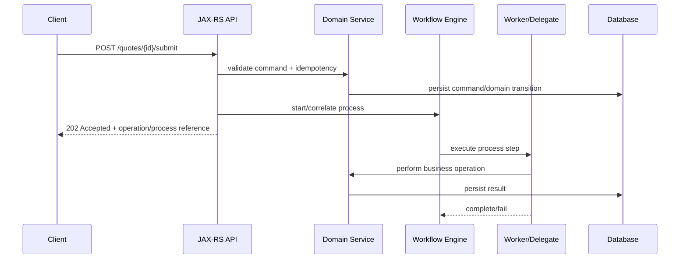

# Part 085 — BPMN and Workflow vs State Machine

> Fokus part ini: memahami kapan sebuah sistem enterprise membutuhkan workflow engine/BPMN, kapan cukup memakai state machine, dan bagaimana JAX-RS service harus berinteraksi dengan proses jangka panjang tanpa mencampur transport API, domain state, dan orchestration state.

Di sistem enterprise seperti quote/order management, banyak proses tidak selesai dalam satu request-response HTTP.

Contoh:

```text
create quote
-> enrich customer/account data
-> validate catalog eligibility
-> calculate pricing
-> request approval if discount exceeds threshold
-> reserve inventory or network capacity
-> submit order
-> wait for downstream provisioning result
-> notify customer/system
```

Jika semua flow itu dipaksa menjadi satu method Java panjang, service akan sulit dioperasikan:

```text
one giant service method
-> hidden state
-> retry ambiguity
-> partial side effects
-> no incident visibility
-> difficult audit trail
-> impossible manual intervention
```

Workflow/BPMN ada untuk membuat proses jangka panjang menjadi eksplisit.

Namun BPMN bukan obat universal. Banyak bug enterprise muncul karena tim memakai workflow engine untuk hal yang seharusnya cukup menjadi state transition biasa.

---

## 1. Core Mental Model

Ada tiga model yang sering tercampur:

```text
HTTP API model
Domain state model
Workflow/process model
```

Masing-masing menjawab pertanyaan berbeda.

| Model | Pertanyaan utama | Contoh |
|---|---|---|
| HTTP API | Bagaimana caller meminta aksi? | `POST /quotes/{id}/submit` |
| Domain state | Apa status bisnis entity sekarang? | quote `DRAFT`, `SUBMITTED`, `APPROVED` |
| Workflow/process | Langkah apa yang sedang berjalan? | waiting approval, retrying pricing, waiting downstream callback |

Kesalahan umum:

```text
API endpoint dianggap workflow.
Database status dianggap workflow.
Workflow diagram dianggap domain model.
```

Senior engineer harus memisahkan ketiganya.

---

## 2. What BPMN Is Actually For

BPMN cocok untuk proses yang memiliki kombinasi berikut:

- banyak step lintas sistem;
- long-running execution;
- timer, reminder, escalation, SLA;
- human task atau manual decision;
- retry/incident/manual recovery;
- compensation atau undo step;
- audit trail proses;
- business-visible process model;
- proses berubah cukup sering sehingga diagram/definition versioning membantu.

BPMN bukan sekadar “flowchart”. BPMN adalah model executable process.

Mental model:

```text
BPMN process definition
-> deployed to process engine
-> creates process instances
-> each instance moves through activities/events/gateways
-> engine persists process state
-> workers/delegates execute work
-> incidents expose stuck/failing work
```

---

## 3. State Machine vs Workflow

State machine fokus pada status entity dan allowed transitions.

Workflow fokus pada orchestration execution.

### State machine example

```text
Quote states:
DRAFT -> SUBMITTED -> APPROVED -> ORDERED
DRAFT -> CANCELLED
SUBMITTED -> REJECTED
APPROVED -> EXPIRED
```

Ia menjawab:

```text
Can this quote move from X to Y?
Who is allowed to do it?
What invariant must hold before transition?
```

### Workflow example

```text
Submit quote process:
Receive submit command
-> validate quote
-> calculate price
-> if high discount, create approval task
-> wait for approval
-> publish quote-approved event
-> complete
```

Ia menjawab:

```text
What steps must run after submit?
What is waiting?
What failed?
What can be retried?
What needs manual intervention?
```

### Decision guide

| Use case | Prefer |
|---|---|
| simple entity lifecycle | state machine |
| strict allowed transitions | state machine |
| one transaction, no external wait | service/domain logic |
| multi-step process with external systems | workflow/BPMN |
| human approval/task | workflow/BPMN |
| timers/escalation/SLA | workflow/BPMN |
| saga/compensation across services | workflow/BPMN or explicit saga state table |
| high-volume low-latency synchronous logic | usually not BPMN |

A useful rule:

```text
If the important question is "what status is this entity in?", model a state machine.
If the important question is "what work is currently pending and why?", model workflow.
```

---

## 4. Orchestration vs Choreography

Workflow engines are usually orchestration tools.

```text
central process
-> tells participants what to do
-> waits for results
-> controls retry/timeout/compensation
```

Event-driven choreography is different:

```text
service A emits event
-> service B reacts
-> service C reacts
-> no single controller owns full flow
```

### Orchestration strengths

- visible end-to-end process;
- explicit retries and incidents;
- better human task support;
- easier process audit;
- easier SLA and escalation;
- better for business-visible workflow.

### Choreography strengths

- loose coupling;
- independent service evolution;
- natural event-driven integration;
- high scalability;
- no central coordinator bottleneck.

### Orchestration risk

```text
central process becomes a distributed monolith
```

### Choreography risk

```text
end-to-end process becomes invisible tribal knowledge
```

Senior design question:

```text
Who needs to know the whole process?
The system? The business? Operators? Or nobody?
```

---

## 5. BPMN Vocabulary You Actually Need

You do not need to memorize every BPMN symbol first. Start with execution semantics.

### Start event

Creates a process instance.

```text
API command/event/message/timer
-> start process instance
```

### Service task

Represents automated work.

```text
process enters service task
-> delegate/worker performs work
-> completes or fails
```

### User task

Represents human work.

```text
approval needed
-> task created
-> assigned/claimed/completed
-> process continues
```

### Gateway

Controls branch logic.

```text
exclusive gateway -> one path
parallel gateway -> multiple paths
inclusive gateway -> one or more paths
```

### Timer event

Represents time-based waiting.

```text
wait 2 hours
wait until effective date
escalate after SLA breach
```

### Message event

Represents external signal/callback.

```text
wait for downstream provisioning complete
wait for payment authorized
wait for customer acceptance
```

### Error event

Models business or technical error paths.

```text
pricing failed
approval rejected
external system unavailable
```

### Compensation event

Models undo/reversal work.

```text
reserve capacity succeeded
order submission failed
-> release capacity
```

---

## 6. JAX-RS Integration Mental Model

A JAX-RS service should not pretend a long-running process is synchronous.

Better model:



The API boundary should answer:

```text
Was the command accepted?
What is the tracking reference?
How can caller observe progress?
What is the idempotency behavior?
What happens on duplicate submit?
```

Not every process start should return `200 OK` with final result.

For long-running workflows, common response shape:

```http
HTTP/1.1 202 Accepted
Location: /operations/op-123
X-Correlation-Id: ...
```

---

## 7. Three Kinds of State

A production workflow system usually has at least three state stores.

### 1. Domain state

Owned by business service.

```text
quote.status = SUBMITTED
quote.totalAmount = 120000.00
quote.currency = USD
```

### 2. Process state

Owned by workflow engine.

```text
processInstanceId = abc
current activity = WaitForApproval
retries = 2
incident = false
```

### 3. Integration state

Owned by adapters/outbox/inbox/reconciliation.

```text
message sent?
callback received?
downstream request id?
dedupe key?
```

Do not use workflow engine variables as your only durable domain state.

Better rule:

```text
Domain truth belongs in domain persistence.
Workflow truth belongs in process engine persistence.
Integration truth belongs in integration persistence.
```

---

## 8. Business Key, Correlation Key, and Idempotency Key

Workflow integration needs explicit identifiers.

| Key | Purpose |
|---|---|
| Business key | identifies business entity/process from business perspective |
| Correlation key | matches external message/callback to waiting process |
| Idempotency key | prevents duplicate command execution |
| Process instance id | identifies engine process instance |
| Operation id | stable API tracking reference |

Example:

```text
quoteId = Q-123
businessKey = quote:Q-123:submit:v4
correlationKey = provisioning-request:PR-998
idempotencyKey = POST:/quotes/Q-123/submit/client-key-abc
processInstanceId = engine-specific id
operationId = public API tracking id
```

Avoid leaking engine-specific process IDs to external clients unless it is an explicit API contract.

---

## 9. Workflow Versioning

BPMN definitions are deployed and versioned.

Important question:

```text
When a process definition changes, what happens to already running process instances?
```

Common strategies:

- let old instances finish on old definition;
- migrate selected instances;
- start new instances on new version only;
- cancel/restart for rare cases;
- maintain compatibility between workers and old process versions.

Failure mode:

```text
new worker deployed
old process instance still emits old variable shape
worker crashes on missing/new field
```

Workflow versioning must align with:

- API compatibility;
- event schema compatibility;
- database migration compatibility;
- worker deployment strategy;
- feature flags;
- rollback strategy.

---

## 10. Human Tasks and Approval Workflows

Human task is not just “pause process until user clicks approve”.

It needs:

- assignment model;
- candidate group;
- permission check;
- due date;
- escalation;
- task visibility;
- audit trail;
- comments/attachments;
- delegation/substitution;
- stale task cleanup;
- tenant isolation.

For quote/order systems, approval flow often depends on:

```text
discount threshold
customer segment
product catalog
currency
region
sales channel
tenant-specific policy
```

Do not bury approval logic inside BPMN expressions without testable ownership.

Better pattern:

```text
BPMN routes approval step.
Domain/policy service decides approval requirement.
Task system records human action.
Audit log records who decided what and why.
```

---

## 11. Timers, SLA, and Escalation

Timers are one of the strongest reasons to use workflow.

Examples:

```text
quote expires after 30 days
approval must complete within 2 business days
downstream provisioning callback expected within 15 minutes
retry failed task after exponential backoff
```

Senior concern:

```text
Is the timer based on wall clock, business calendar, tenant timezone, UTC, or effective date?
```

Timer failure modes:

- timezone bug;
- daylight saving transition;
- missed timer due to engine outage;
- duplicate timer firing after retry;
- timer backlog after downtime;
- tenant-specific calendar ignored;
- SLA alert without runbook.

---

## 12. Compensation and Saga Thinking

In distributed systems, rollback rarely means database rollback.

Once you call another system, publish an event, reserve capacity, or charge money, the undo path is usually a compensating action.

Example:

```text
create order
-> reserve resource
-> charge customer
-> submit provisioning
-> provisioning fails
-> refund customer
-> release resource
-> mark order failed
```

Compensation is business-specific.

Bad model:

```text
catch exception -> rollback transaction
```

Better model:

```text
side effect succeeded
-> record side effect
-> next step failed
-> execute explicit compensation step
-> record compensation result
```

A saga may be implemented by:

- BPMN compensation;
- explicit saga state table;
- event choreography with reconciliation;
- hybrid process + event model.

---

## 13. When Not to Use BPMN

Do not use BPMN only because a flow has multiple `if` statements.

Avoid BPMN when:

- the flow is short and synchronous;
- state transition is simple and local;
- throughput/latency is extremely sensitive;
- process visibility is not needed;
- business users will not inspect or reason about the diagram;
- operational team cannot support the workflow engine;
- model versioning creates more risk than value;
- your team is only using BPMN as a visual replacement for code.

Simple code is often better:

```java
validate(command);
quote.submit(policyDecision);
repository.save(quote);
outbox.enqueue(new QuoteSubmitted(...));
```

Use workflow when lifecycle and recoverability matter more than immediate simplicity.

---

## 14. Failure Modes

### Process started but domain state not committed

Cause:

```text
API starts workflow before durable domain commit
```

Impact:

```text
worker cannot find quote/order
process stuck or fails repeatedly
```

Mitigation:

```text
commit domain state first
use outbox/start-process transaction strategy
make worker tolerate eventual visibility if intentional
```

### Domain committed but workflow not started

Cause:

```text
DB commit succeeds, engine call fails
```

Impact:

```text
quote/order appears submitted but no process runs
```

Mitigation:

```text
outbox/reconciliation job
operation table
idempotent process start
```

### Duplicate process instance

Cause:

```text
client retries submit
idempotency missing
process start not constrained by business key
```

Impact:

```text
double approval, double reservation, double downstream call
```

Mitigation:

```text
idempotency key
business key uniqueness
saga state table
outbox dedupe
```

### Workflow variable drift

Cause:

```text
new process/worker expects new variable shape
old running process has old shape
```

Impact:

```text
old instances fail after deployment
```

Mitigation:

```text
backward-compatible variable readers
process version migration strategy
contract tests for old process versions
```

### Invisible process stuck state

Cause:

```text
engine incidents/failed jobs not monitored
```

Impact:

```text
customer order silently stuck
```

Mitigation:

```text
incident dashboard
SLO on stuck process age
business reconciliation
alerting by process state
```

---

## 15. Debugging Workflow Problems

When a quote/order flow is stuck, ask in this order:

```text
1. What is the business entity id?
2. What is the operation id/idempotency key?
3. Was the API command accepted and persisted?
4. Was a process instance started/correlated?
5. Which BPMN activity is currently active?
6. Is there a failed job/incident/retry?
7. Which worker/delegate should process it?
8. Did the worker receive the task/message?
9. Did the worker call downstream systems?
10. Is domain state consistent with process state?
11. Are events/outbox/inbox/reconciliation records consistent?
12. Is this a model bug, data bug, infrastructure bug, or downstream bug?
```

Useful debug artifacts:

- process instance id;
- business key;
- correlation key;
- operation id;
- domain entity id;
- worker logs;
- trace id;
- failed job/incident details;
- process variables snapshot;
- outbox/inbox records;
- downstream request id.

---

## 16. JAX-RS API Design for Workflow Operations

### Start operation

```http
POST /quotes/{quoteId}/submit
Idempotency-Key: abc
```

Response:

```http
202 Accepted
Location: /operations/op-123
```

### Get operation status

```http
GET /operations/op-123
```

Response shape:

```json
{
  "operationId": "op-123",
  "resourceType": "quote",
  "resourceId": "Q-123",
  "status": "RUNNING",
  "currentStep": "WAITING_APPROVAL",
  "retryable": false,
  "createdAt": "2026-07-10T04:00:00Z",
  "updatedAt": "2026-07-10T04:02:00Z"
}
```

### Human task action

```http
POST /approval-tasks/{taskId}/approve
```

Important:

```text
approving a task is a business command, not merely completing engine task state
```

It needs authorization, validation, audit, and idempotency.

---

## 17. Observability Model

A workflow-backed operation should be observable across:

```text
HTTP command
-> domain state transition
-> process instance
-> worker execution
-> DB mutation
-> event publish
-> downstream call
-> human task
-> compensation/retry
```

Minimum telemetry dimensions:

- process definition key;
- process version;
- activity id;
- business key;
- operation id;
- tenant id if safe and low-cardinality policy allows;
- worker type;
- failure category;
- retry count;
- process age;
- stuck duration.

Beware high cardinality in metrics. Put business IDs in logs/traces, not metric labels, unless your platform explicitly supports it.

---

## 18. Internal Verification Checklist

For CSG/internal codebase, verify instead of assuming:

- Is BPMN used at all?
- Is Camunda 7, Camunda 8, another BPM engine, custom state machine, or no engine used?
- Are workflows embedded in Java service, remote engine, SaaS, Kubernetes deployment, or shared platform?
- Are process definitions stored in repo, model repository, artifact repository, or deployed manually?
- How are process definitions versioned?
- How are old running process instances handled after deployment?
- Is there a business key/correlation key/idempotency standard?
- Are process variables typed and versioned?
- Are workflow errors visible as incidents, failed jobs, alerts, or only logs?
- What dashboard shows stuck quote/order processes?
- Who owns workflow diagrams: engineering, product, ops, business analysts, or shared team?
- Are human tasks part of the system?
- Is approval logic in BPMN expressions, domain service, rules engine, or catalog/pricing service?
- Is compensation modeled explicitly?
- Is there a reconciliation job between domain state and process state?
- Is tenant isolation enforced in process data and task visibility?

---

## 19. PR Review Checklist

When reviewing workflow-related code or BPMN changes:

### Process model

- Is BPMN used for a valid reason?
- Are process steps named with business meaning?
- Are gateways understandable and testable?
- Are timers and SLA assumptions explicit?
- Are compensation paths modeled where needed?

### API integration

- Does API return correct status for long-running operations?
- Is idempotency handled?
- Is operation tracking exposed safely?
- Are engine-specific IDs leaked unintentionally?

### State consistency

- Is domain state separate from process state?
- Is process start/correlation consistent with DB commit?
- Is duplicate process creation prevented?
- Is replay/reconciliation possible?

### Failure handling

- Are retries bounded?
- Are incidents observable?
- Are manual recovery steps documented?
- Are downstream failures classified?

### Security and tenancy

- Are task actions authorized?
- Is tenant isolation enforced?
- Are audit logs complete?
- Are sensitive process variables protected?

---

## 20. Practical Exercises

### Exercise 1 — Classify a flow

Pick an existing quote/order flow and classify each part:

```text
HTTP command
Domain transition
Workflow step
External integration
Human task
Event publish
Reconciliation logic
```

### Exercise 2 — Find duplicate risk

For a command like `submit quote`, answer:

```text
What happens if client sends the same request twice?
What happens if API times out after process starts?
What happens if DB commits but process start fails?
```

### Exercise 3 — Draw the real lifecycle

Draw a Mermaid sequence diagram from API command to process completion, including DB, workflow engine, worker, event bus, and downstream systems.

---

## 21. Senior Mental Checklist

Before using BPMN, ask:

```text
Is the process long-running?
Does it need visibility?
Does it need manual intervention?
Does it need retry/incident semantics?
Does it cross service boundaries?
Does it require compensation?
Does it need versioned process definitions?
Can the team operate the engine in production?
```

Before rejecting BPMN, ask:

```text
Are we hiding workflow complexity inside code?
Will operators know where the process is stuck?
Will business users need auditability?
Will reconciliation be harder without process state?
```

---

## 22. Key Takeaways

- BPMN is useful when process lifecycle, visibility, retry, timer, human task, and compensation matter.
- State machine is better when the core problem is allowed entity transitions.
- JAX-RS endpoint should start/correlate/observe workflow; it should not pretend long-running work is synchronous.
- Domain state, process state, and integration state must be separated.
- Idempotency, business key, correlation key, and operation id are not optional details.
- Workflow versioning must align with API, event, database, and deployment compatibility.
- The biggest workflow failures are usually duplicate execution, stuck process, invisible incident, variable drift, and inconsistent domain/process state.
