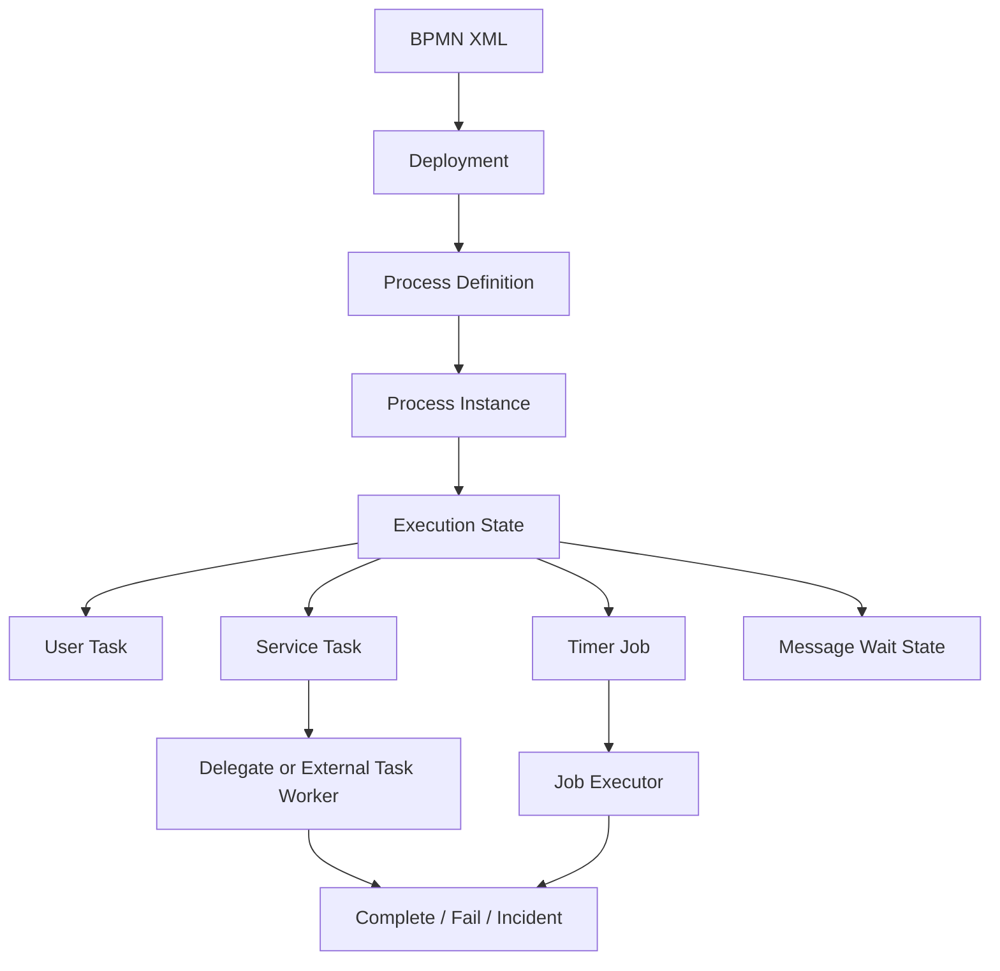
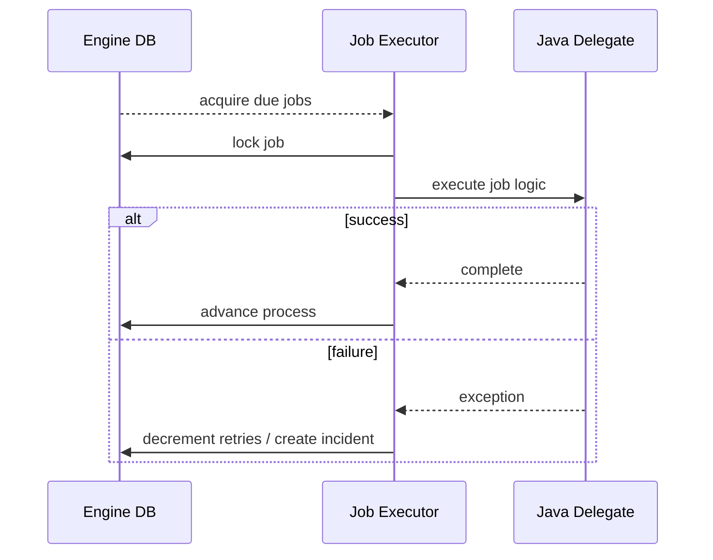

# Part 086 — Camunda 7 Integration with JAX-RS Services

> Fokus part ini: memahami cara Camunda 7 biasanya diintegrasikan dengan Java/JAX-RS services, bagaimana process engine, job executor, external task, transaction, retry, incident, variable, dan REST/API boundary bekerja, serta apa yang harus diverifikasi sebelum menyimpulkan stack internal benar-benar memakai Camunda 7.

Catatan penting:

```text
This part does not assume CSG uses Camunda 7.
Treat Camunda 7 as a possible enterprise workflow runtime that must be verified internally.
```

Camunda 7 adalah generasi platform Camunda berbasis process engine Java yang umum dipakai untuk BPMN/DMN di aplikasi enterprise. Pada ekosistem modern, Camunda 7 juga perlu dilihat dari sisi lifecycle produk, support status, migration posture, dan kebijakan platform internal.

Untuk senior engineer, pertanyaan pentingnya bukan “bagaimana membuat BPMN hello world”, tetapi:

```text
Where is the process engine running?
Who owns process state?
How do JAX-RS APIs start/correlate processes?
Where do transactions begin and end?
How are jobs retried?
How are incidents surfaced?
How are process variables versioned?
How do we prevent duplicate process execution?
How do we operate and migrate running instances?
```

---

## 1. Camunda 7 Mental Model

Camunda 7 executes deployed process definitions.

```text
BPMN model
-> deployment
-> process definition
-> process instance
-> execution tree
-> activity/job/task
-> completion, wait state, failure, or incident
```

Core runtime concepts:

| Concept | Meaning |
|---|---|
| Process engine | Runtime that executes BPMN/DMN and persists process state |
| Repository service | Deploys and queries process definitions |
| Runtime service | Starts/correlates/runs process instances |
| Task service | Handles user tasks |
| History service | Queries historic process/task/activity data |
| Management service | Jobs, incidents, engine management operations |
| Job executor | Background component that acquires and executes jobs |
| External task | Work item fetched and completed by external worker |
| Incident | Operational marker for failed/stuck execution |

Mental model:



---

## 2. Integration Modes

Camunda 7 can appear in several shapes.

### Embedded engine

The process engine runs inside the same application process as your Java service.

```text
JAX-RS service JVM
  -> process engine
  -> job executor maybe active
  -> same database or configured datasource
```

Pros:

- direct Java API access;
- simple local calls;
- shared transaction possible depending integration;
- lower network overhead.

Cons:

- engine lifecycle tied to service lifecycle;
- job executor competes with application resources;
- scaling service may scale job executors too;
- deployment/versioning may become coupled.

### Shared engine in application server

The engine runs as shared container service.

```text
application server
  -> shared process engine
  -> multiple process applications
```

Pros:

- central engine management;
- traditional enterprise deployment style;
- process applications can share infrastructure.

Cons:

- container-specific behavior;
- shared failure domain;
- classloading and deployment complexity.

### Remote engine via REST API

Your JAX-RS service calls Camunda REST API or acts as an external task worker.

```text
JAX-RS service
  -> HTTP call to Camunda REST
  -> process engine elsewhere
```

Pros:

- service runtime separated from engine runtime;
- clear network boundary;
- better independent scaling.

Cons:

- distributed transaction not available;
- requires idempotency/reconciliation;
- network/auth/timeout failure modes.

### Camunda Run / pre-built distribution

Camunda 7 can also run as a packaged runtime distribution.

Operational concerns:

- deployment process;
- engine database;
- REST auth;
- history cleanup;
- job executor tuning;
- backup/restore;
- upgrade lifecycle.

---

## 3. JAX-RS API Starting a Process

A common integration pattern:

```http
POST /quotes/{quoteId}/submit
Idempotency-Key: abc
```

JAX-RS resource:

```java
@Path("/quotes/{quoteId}/submit")
public class SubmitQuoteResource {

  @POST
  public Response submit(
      @PathParam("quoteId") String quoteId,
      @HeaderParam("Idempotency-Key") String idempotencyKey,
      SubmitQuoteRequest request
  ) {
    // validate API request
    // enforce authorization
    // persist domain command/idempotency record
    // start or correlate process
    // return operation reference
    return Response.accepted()
        .header("Location", "/operations/...")
        .build();
  }
}
```

Engine interaction may look conceptually like:

```java
Map<String, Object> variables = Map.of(
    "quoteId", quoteId,
    "operationId", operationId,
    "tenantId", tenantId
);

runtimeService
    .createProcessInstanceByKey("quoteSubmission")
    .businessKey("quote:" + quoteId)
    .setVariables(variables)
    .execute();
```

Production concern:

```text
What if DB commit succeeds but process start fails?
What if process start succeeds but API response times out?
What if client retries the same command?
```

Do not start workflow without an idempotency and reconciliation model.

---

## 4. Business Key and Process Instance Identity

Camunda process instance id is engine identity.

Business systems usually need stable business identity:

```text
quote id
order id
operation id
tenant id
external request id
```

Use business key deliberately.

Bad:

```text
businessKey = random UUID nobody can search operationally
```

Better:

```text
businessKey = tenant:{tenantId}:quote:{quoteId}:submit:{submissionVersion}
```

But beware sensitive data in business key. Business key may appear in logs, Cockpit, metrics, or audit systems.

---

## 5. Transaction Boundary

Transaction boundary is the hardest part of Camunda 7 integration.

You need to know:

```text
Is the process engine using the same transaction manager as the application?
Is the engine embedded or remote?
Is process start part of the same DB transaction as domain update?
Are delegates executed synchronously in caller thread?
Are async continuations creating jobs for later execution?
```

### Synchronous delegate risk

If a process is started and immediately executes Java delegates synchronously, the API request may unexpectedly perform a lot of work.

```text
POST /submit
-> start process
-> validate
-> call pricing
-> call approval
-> publish event
-> response waits for all of it
```

This can break timeout, retry, and user experience assumptions.

### Async continuation

Async continuation creates an explicit transaction/wait boundary.

Conceptual effect:

```text
API starts process
-> process reaches async boundary
-> job created
-> API transaction can complete
-> job executor later acquires job
-> worker/delegate executes next step
```

Senior review question:

```text
Which BPMN activities are synchronous and which are async boundaries?
```

---

## 6. Job Executor Lifecycle

The job executor is a background component that acquires and executes jobs.

Jobs are created for things like:

- asynchronous continuations;
- timer events;
- asynchronous BPMN event handling;
- retryable failed work.

Operational model:



Failure modes:

- job executor not active;
- job executor active in too many nodes;
- job acquisition starvation;
- long-running job blocks executor thread;
- retries exhausted;
- job locked by crashed node until lock expiration;
- incident created but not monitored.

Senior verification:

```text
Find job executor config before assuming a process step will run.
```

---

## 7. Java Delegates vs External Tasks

Camunda 7 service work can be implemented using Java delegates or external tasks.

### Java delegate

The engine invokes Java code directly.

```java
public class CalculatePriceDelegate implements JavaDelegate {
  @Override
  public void execute(DelegateExecution execution) {
    String quoteId = (String) execution.getVariable("quoteId");
    // call domain service
  }
}
```

Pros:

- simple local invocation;
- direct engine API access;
- can participate in same runtime.

Cons:

- tight coupling to engine;
- classloading/deployment coupling;
- harder independent scaling;
- easy to create hidden synchronous work.

### External task

The engine creates a task and an external worker fetches/locks/completes it.

Conceptual lifecycle:

```text
process reaches external service task
-> external task created
-> worker fetches and locks task
-> worker performs work
-> worker completes or reports failure
```

Pros:

- decouples worker runtime from engine;
- better for polyglot/microservices;
- failure/retry boundary is explicit;
- no direct engine classpath dependency in business service.

Cons:

- requires polling/fetch tuning;
- lock duration and duplicate handling matter;
- needs idempotent worker logic;
- network/auth failure modes.

Decision guide:

| Work type | Better fit |
|---|---|
| small local process-only logic | delegate |
| domain service call with independent scaling | external task |
| long I/O call | external task or async worker |
| side effect to external system | external task with idempotency |
| pure routing expression | BPMN/expression, but keep complex logic out |

---

## 8. External Task Worker Design

A worker must be idempotent.

Pseudo-flow:

```text
fetch and lock task
read variables
derive idempotency key
check whether work already done
perform side effect
persist result
complete task
```

If completion fails after side effect succeeds, the task may be retried.

Therefore:

```text
external task execution must tolerate duplicate execution
```

Worker checklist:

- lock duration matches worst-case work;
- worker extends lock if needed;
- side effects are idempotent;
- failures report meaningful error message/details;
- retry count and retry timeout are explicit;
- BPMN error vs technical failure is intentional;
- trace/correlation context is propagated;
- variables are validated before use;
- tenant authorization is checked if worker accesses tenant-specific data.

---

## 9. Incidents and Failed Jobs

Incident is an operational signal that process execution cannot proceed without intervention or configured retry recovery.

Common causes:

- Java delegate throws exception until retries exhausted;
- external task repeatedly fails;
- expression cannot evaluate;
- missing variable;
- serialization/deserialization error;
- deployment mismatch;
- database/engine failure;
- downstream unavailable beyond retry window.

Do not treat incidents as “engine noise”.

For quote/order systems, incident may mean:

```text
customer order stuck
quote approval not moving
provisioning not submitted
revenue-impacting process blocked
```

Minimum incident operations:

- dashboard by process definition/activity;
- alert on age/count/severity;
- link to business entity;
- runbook for retry, variable correction, migration, cancellation;
- audit trail for manual intervention;
- reconciliation with domain state.

---

## 10. Process Variables

Process variables are convenient but dangerous.

Do not put everything into variables.

Recommended split:

```text
process variables: routing data, correlation references, small control data
business database: domain truth
object storage/document store: large payloads/documents
logs/traces: diagnostic context
```

Bad:

```text
store whole quote/order aggregate as serialized Java object variable
```

Risks:

- serialization incompatibility;
- class rename breaks old instances;
- large variable payload slows engine DB;
- sensitive data exposed in engine tools;
- old process instances fail after code deployment.

Better:

```text
quoteId = Q-123
operationId = OP-456
approvalRequired = true
pricingVersion = v17
```

Then worker loads current domain state from domain service/repository.

---

## 11. Error Semantics: Technical Failure vs BPMN Business Error

Not every exception is the same.

### Technical failure

Examples:

```text
HTTP timeout
DB unavailable
Kafka broker unavailable
transient downstream 503
```

Usually should trigger retry and possibly incident.

### Business error

Examples:

```text
approval rejected
quote expired
product ineligible
customer not allowed for offer
```

Usually should be modeled as BPMN branch or business error path, not infinite retry.

Review question:

```text
Will retrying this error ever succeed without changing input/state?
```

If no, do not model it as technical retry.

---

## 12. JAX-RS Boundary Patterns

### Pattern A — API starts process directly

```text
JAX-RS resource -> RuntimeService.startProcessInstanceByKey
```

Good when:

- engine is embedded/shared and transaction model is clear;
- operation volume is moderate;
- idempotency is enforced.

Risk:

- API availability coupled to engine availability;
- DB/process consistency ambiguity;
- synchronous delegate surprise.

### Pattern B — API writes command/outbox, worker starts process

```text
JAX-RS resource -> domain DB command/outbox
reconciliation/dispatcher -> starts process
```

Good when:

- you need reliable start after commit;
- remote engine can be temporarily unavailable;
- command acceptance must be durable.

Risk:

- extra moving parts;
- delayed process start;
- requires monitoring outbox lag.

### Pattern C — Engine drives service via external task

```text
process -> external task -> service worker -> domain operation
```

Good when:

- process owns orchestration;
- service work is independent and idempotent;
- scaling workers separately matters.

Risk:

- polling/fetch tuning;
- task lock expiry/duplicate execution;
- process variable contract drift.

### Pattern D — Event-driven correlation

```text
JAX-RS command -> publish event
process waits/correlates message/event
```

Good when:

- event bus is source of integration;
- process needs to wait for external outcomes;
- correlation keys are stable.

Risk:

- correlation miss;
- duplicate messages;
- event ordering issue;
- no process instance found.

---

## 13. Process Deployment and Versioning

Camunda 7 process definitions are deployed artifacts.

Questions to verify:

```text
Are BPMN files deployed with the application?
Are they deployed separately?
Does each service own its own process definitions?
Is there a central workflow team?
How is deployment version tied to application version?
What happens to existing process instances?
```

Versioning risks:

- old instances using old variable shape;
- new delegates incompatible with old process path;
- BPMN model changed but worker not deployed;
- worker deployed but BPMN not deployed;
- rollback does not roll back process definition state;
- process migration required but not planned.

Safe rollout often needs:

```text
backward-compatible workers
process version-aware logic
deployment sequencing
feature flags
process instance migration plan
incident rollback playbook
```

---

## 14. Tenant Isolation

Camunda 7 has multi-tenancy concepts, but your system still needs explicit tenancy discipline.

Verify:

- are process definitions tenant-specific?
- are process instances tenant-tagged?
- are user tasks filtered by tenant?
- are process variables tenant-safe?
- are worker queries tenant-scoped?
- are engine REST APIs protected by tenant-aware authorization?
- can one tenant's process accidentally correlate another tenant's message?

Failure mode:

```text
correlationKey = orderId only
same orderId exists across tenants
message resumes wrong tenant process
```

Better:

```text
correlationKey = tenantId + businessEntityId + purpose
```

---

## 15. Security Concerns

Security review areas:

- engine REST API authentication;
- authorization for starting/canceling/retrying/migrating process instances;
- task claim/complete permissions;
- process variable sensitivity;
- audit trail for manual intervention;
- service credentials for workers;
- mTLS/network policy for engine access;
- CSRF/browser exposure if webapps are enabled;
- admin tool access;
- secret handling in delegate/worker config.

Never expose engine administrative operations directly through public/product APIs without a domain authorization layer.

---

## 16. Observability for Camunda 7 Integration

Minimum observability:

```text
API request accepted
process start/correlation attempted
process instance id/business key created
current activity
job count/retry count
incident count
external task queue age
worker success/failure
domain state alignment
```

Recommended log fields:

- trace id;
- correlation id;
- causation id;
- operation id;
- tenant id if policy allows;
- business key;
- process definition key;
- process instance id;
- activity id;
- job id/external task id;
- retry count;
- failure category.

Recommended alerts:

- incident count by process/activity;
- old active process instances;
- external task backlog age;
- job executor acquisition failure;
- failed job retries exhausted;
- process start failure;
- reconciliation mismatch;
- history cleanup failure.

---

## 17. Testing Strategy

### Unit tests

Test pure domain decisions outside engine:

```text
approval required?
state transition allowed?
retryable vs business error?
variable mapper produces expected shape?
```

### Process tests

Test BPMN routing:

```text
input variables -> expected path
business error -> expected boundary event
timer -> expected wait state
approval -> expected user task
```

### Integration tests

Test JAX-RS + engine boundary:

```text
POST submit -> domain command persisted -> process started
process task -> worker executes -> domain state changed
failure -> retry/incident observable
```

### Compatibility tests

Test old process variables with new worker code.

```text
old variable shape
-> new worker reads safely
-> old process instance can complete
```

---

## 18. Local Development Workflow

Local Camunda 7 integration usually needs answers to:

- Can developers run engine locally?
- Is engine embedded in service or separate Docker container?
- Is engine DB local PostgreSQL/H2/other?
- Are BPMN deployments automatic at startup?
- Are webapps enabled locally?
- Are test users/tenants seeded?
- Are sample process instances provided?
- Is worker debugging documented?

Local debugging checklist:

```text
start engine
start service
deploy BPMN
trigger API command
inspect process instance
inspect active activity
inspect variables
force worker failure
observe retry/incident
fix and retry
```

---

## 19. Internal Verification Checklist

For CSG/internal codebase, verify:

### Runtime

- Is Camunda 7 used at all?
- If yes, which version?
- Is it embedded, shared engine, remote REST, Camunda Run, or another deployment model?
- Is the job executor active? Where?
- What database backs the process engine?
- Is the engine database shared with application database?

### Integration

- Do JAX-RS APIs start processes directly?
- Is there an outbox/dispatcher for process start?
- Are external tasks used?
- Are Java delegates used?
- Are workers separate services or same JVM?
- Is REST API used to interact with engine?

### Process model

- Where are BPMN files stored?
- Who owns process definitions?
- How are process definitions versioned and deployed?
- Are process instance migrations performed?
- Are timers, compensation, and human tasks used?

### Reliability

- Is idempotency enforced for process start?
- Is business key unique enough?
- Are retries configured intentionally?
- Are incidents alerted?
- Is there reconciliation between domain and process state?
- Are external task workers idempotent?

### Security and tenancy

- Is engine REST secured?
- Is admin access controlled?
- Are process variables sensitive?
- Is tenant isolation enforced for process definitions, instances, tasks, and correlations?

### Operations

- What dashboard shows failed jobs/incidents?
- What runbook explains retry/cancel/migrate/fix variables?
- What is the backup/restore model for engine DB?
- What is the Camunda 7 support/migration posture?

---

## 20. PR Review Checklist

### API boundary

- Does the endpoint return sync/async status correctly?
- Is idempotency handled?
- Is process start/correlation failure handled?
- Is operation tracking exposed safely?

### Transaction and consistency

- Is DB commit vs process start ordering safe?
- Is there reconciliation for partial failure?
- Are duplicate process instances prevented?
- Are workflow side effects idempotent?

### BPMN/process model

- Are async boundaries intentional?
- Are retries configured per failure type?
- Are business errors modeled separately from technical failures?
- Are process variables small, safe, and versioned?

### Worker/delegate

- Is worker idempotent?
- Are timeouts/retries bounded?
- Are external calls protected by resilience patterns?
- Is context propagated to logs/traces?

### Operations

- Are incidents observable?
- Are runbooks updated?
- Are dashboards/alerts updated?
- Is migration/rollback considered?

---

## 21. Common Anti-Patterns

### Anti-pattern: BPMN as hidden code

```text
complex business logic buried in expressions/listeners
```

Better:

```text
BPMN orchestrates; domain/policy service decides.
```

### Anti-pattern: process variables as database

```text
store full mutable business object as variable
```

Better:

```text
store references and routing facts; load domain state from domain DB/service.
```

### Anti-pattern: retrying business rejection

```text
approval rejected -> technical retry
```

Better:

```text
approval rejected -> BPMN business path -> terminal/rejected state.
```

### Anti-pattern: no idempotency on process start

```text
client retry -> duplicate process instance
```

Better:

```text
idempotency key + unique business key + operation table.
```

### Anti-pattern: incidents without ownership

```text
failed jobs accumulate but nobody is paged
```

Better:

```text
incident alert + owner + runbook + reconciliation.
```

---

## 22. Senior Debug Playbook

For a stuck quote/order process:

```text
1. Locate business entity and tenant.
2. Locate operation id and idempotency record.
3. Locate process instance by business key.
4. Inspect active BPMN activity.
5. Check failed jobs/incidents.
6. Check retries and exception stack.
7. Check process variables and variable schema version.
8. Check worker/delegate logs with trace/correlation id.
9. Check downstream calls and side effects.
10. Compare domain state vs process state.
11. Check outbox/inbox/reconciliation records.
12. Decide: retry, fix variable, compensate, migrate, cancel, or escalate.
```

Never blindly retry a failed job without understanding whether the previous attempt caused a side effect.

---

## 23. Key Takeaways

- Camunda 7 integration is primarily a lifecycle, transaction, and operations problem.
- JAX-RS APIs should expose domain-safe operations, not raw engine control.
- Embedded, shared, and remote engine modes create different failure boundaries.
- Job executor and external tasks are core execution mechanisms; verify which one is used.
- Process variables must be small, safe, versioned, and not treated as domain database.
- Business errors and technical failures must have different handling paths.
- Incidents are production signals, not internal engine noise.
- Running process instances create compatibility obligations during deployment and rollback.
