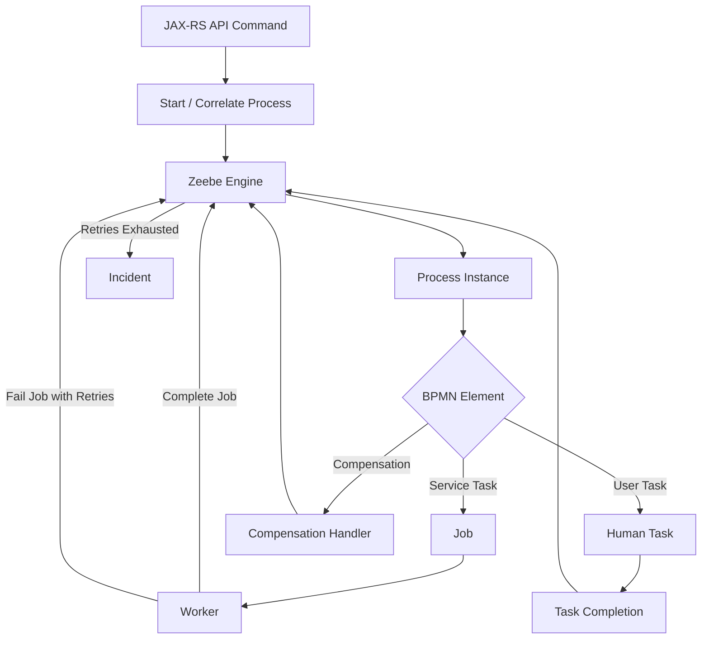
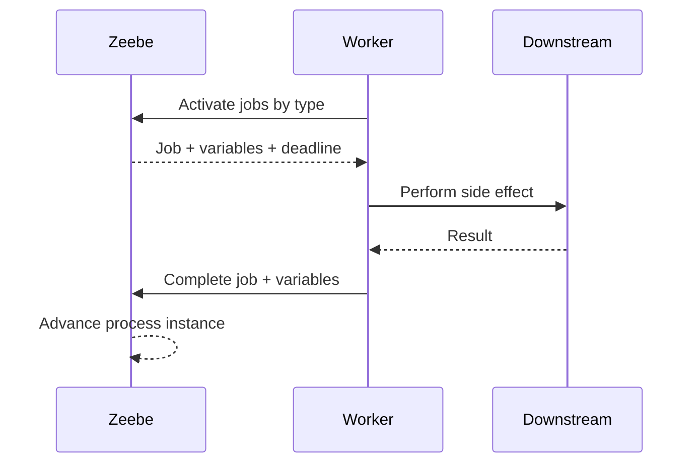
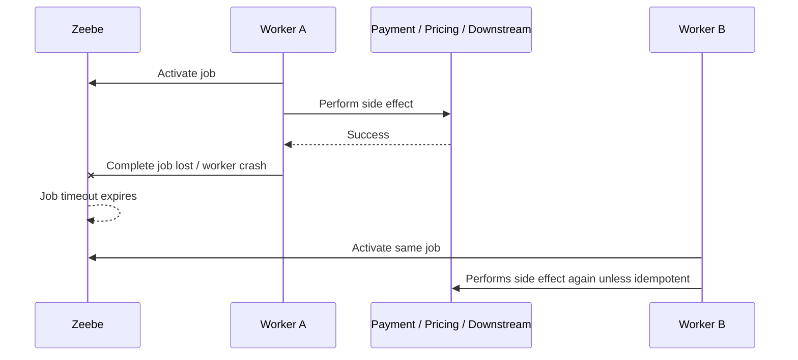
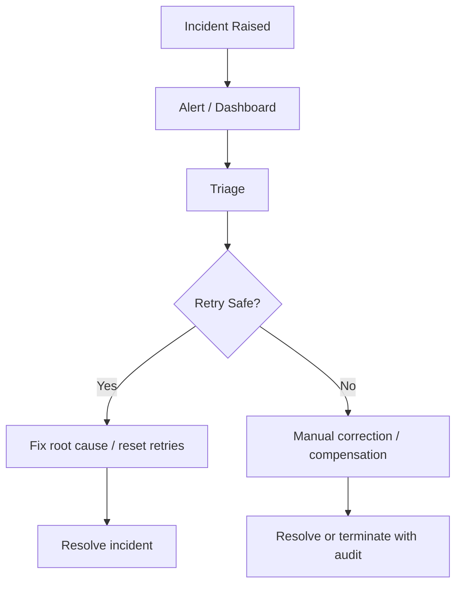
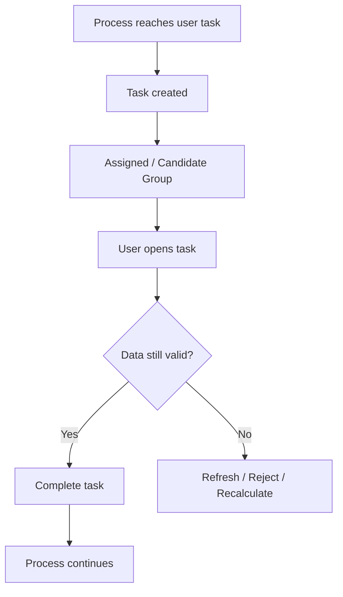
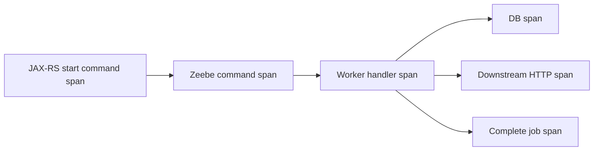

# Part 087 — Camunda 8, Zeebe, Workers, Incidents, Compensation, and Human Tasks

> Fokus part ini: memahami Camunda 8 sebagai distributed workflow runtime, bagaimana Zeebe menjalankan process instance, bagaimana worker mengerjakan job, bagaimana retry dan incident bekerja, bagaimana compensation/human task memengaruhi lifecycle, dan bagaimana JAX-RS service sebaiknya berinteraksi dengan workflow tanpa membuat coupling yang rapuh.

Catatan penting:

```text
This part does not assume CSG uses Camunda 8 or Zeebe.
Treat Camunda 8 as a possible enterprise workflow platform that must be verified internally.
```

Camunda 8 berbeda secara mental model dari Camunda 7.

Camunda 7 sering dipahami sebagai Java process engine yang bisa embedded atau remote. Camunda 8 menggunakan Zeebe sebagai distributed orchestration engine, dengan worker yang mengambil pekerjaan dari engine. Karena itu, senior engineer perlu berhenti berpikir bahwa workflow task selalu sama dengan method call sinkron.

Pertanyaan pentingnya:

```text
Where does process state live?
Who starts the workflow?
Who owns business idempotency?
How do workers receive work?
What happens if a worker crashes after side effect but before completion?
How are retries and incidents surfaced?
How are human tasks represented operationally?
How does an API command map to a workflow command?
How do we version workers, process definitions, and variables safely?
```

---

## 1. Camunda 8 / Zeebe Mental Model

Camunda 8 is a distributed workflow platform. Zeebe is the orchestration engine that stores and advances process state.

Simplified lifecycle:

```text
BPMN process model
-> deploy process definition
-> create process instance
-> execute BPMN flow
-> reach service task / user task / event / timer / gateway
-> create job or wait state
-> worker or user/task app handles work
-> process advances, retries, incidents, compensation, or completion
```

Core concepts:

| Concept | Meaning |
|---|---|
| Process definition | Versioned deployed BPMN model |
| Process instance | Runtime execution of a process definition |
| Zeebe broker | Runtime component that stores/processes workflow records |
| Partition | Shard of workflow processing/state |
| Job | Unit of work created for a service task |
| Job type | Logical type workers subscribe to |
| Worker | External process that activates and completes/fails jobs |
| Variable | Process data scoped to instance/element |
| Incident | Operational failure requiring intervention |
| Operate | Operational UI for process instances/incidents |
| Tasklist | User task interface/product area |

Mental model:



Key shift:

```text
JAX-RS service should not treat workflow execution as local procedural control flow.
It should treat the workflow engine as a distributed stateful coordinator.
```

---

## 2. Camunda 8 vs Camunda 7: Practical Difference

| Area | Camunda 7 style | Camunda 8 / Zeebe style |
|---|---|---|
| Engine model | Java process engine, often database-backed | Distributed orchestration engine |
| Worker model | Java delegates, external tasks, job executor | External job workers are central |
| State persistence | Relational engine tables | Zeebe state/record stream architecture |
| Scaling model | App/server/database scaling | Broker partitions + worker scaling |
| API interaction | Java API/REST depending deployment | Client/API commands to cluster |
| Failure handling | Job retries/incidents | Job retries/incidents, at-least-once worker handling |
| Operational UI | Cockpit/Tasklist/Admin | Operate/Tasklist/Optimize/Console depending setup |
| Migration concern | Engine/version/database migration | Cluster/platform/process/worker compatibility |

What matters for a senior engineer:

```text
Do not copy Camunda 7 assumptions into Camunda 8.
A service task is not necessarily an in-process delegate.
A worker can receive the same business work more than once.
Process variables are not a free-form shared database.
Worker completion is a distributed command, not a local return statement.
```

---

## 3. JAX-RS Integration Boundary

A JAX-RS API should usually interact with Camunda 8 through a clear workflow boundary.

Typical API responsibilities:

```text
HTTP request
-> authenticate and authorize caller
-> validate command
-> enforce idempotency
-> persist command/audit record if needed
-> start/correlate process or send message
-> return accepted/created/result depending operation semantics
```

Possible operation patterns:

| API Pattern | Typical HTTP Response | Workflow Behavior |
|---|---:|---|
| Start long-running workflow | `202 Accepted` | Process starts asynchronously |
| Start and return resource handle | `201 Created` | API returns process/business id |
| Correlate external event | `202 Accepted` or `204 No Content` | Message advances waiting process |
| Query process status | `200 OK` | Reads projection/status view |
| Cancel workflow | `202 Accepted` or `204 No Content` | Cancellation command submitted |
| Complete human task | `200 OK`/`204 No Content` | Task completion command submitted |

Bad API smell:

```java
@POST
@Path("/quote")
public QuoteResponse createQuote(CreateQuoteRequest request) {
    // Starts workflow and waits until everything completes synchronously.
    // This couples HTTP timeout to business process duration.
}
```

Better shape for long-running process:

```java
@POST
@Path("/quotes")
public Response createQuote(CreateQuoteRequest request) {
    // validate, authorize, dedupe
    // start workflow or persist command then start workflow
    // return resource id / operation id
    return Response.accepted(statusUri).build();
}
```

Production rule:

```text
The HTTP request lifecycle should not become the workflow lifecycle.
```

---

## 4. Start Process vs Correlate Message vs Complete Task

Do not use “start workflow” as the only mental model.

There are different command types:

| Action | Meaning | Risk |
|---|---|---|
| Start process | Create new process instance | Duplicate process if idempotency missing |
| Publish/correlate message | Advance existing waiting instance | Missed correlation, duplicate correlation |
| Complete job | Worker tells engine work is done | Side effect may already happened |
| Fail job | Worker asks engine to retry/fail | Retry storm if backoff wrong |
| Complete user task | Human/system completes task | Authorization and stale task risk |
| Cancel instance | Stop running process | Compensation/reconciliation risk |

API boundary should encode the business intent:

```text
createQuote()
approveQuote()
submitOrder()
cancelOrder()
priceCatalogEffective()
customerAcceptedTerms()
```

Not merely:

```text
startProcess()
completeTask()
sendMessage()
```

The API language should remain business-oriented even if the implementation uses workflow commands internally.

---

## 5. Worker Pattern

A worker is a separate processing loop that activates jobs of a given type, executes business/integration logic, then completes or fails the job.

Worker lifecycle:

```text
register worker for job type
-> activate jobs
-> receive job payload/variables
-> execute handler
-> call downstream systems / DB / API
-> complete job with variables
or
-> fail job with retry count/backoff/error message
```

Mermaid:



Worker handler design:

```java
public final class PriceCalculationWorker {
    public void handle(JobContext job) {
        String businessKey = job.businessKey();
        PricingCommand command = job.readVariable("pricingCommand", PricingCommand.class);

        IdempotencyResult<PricingResult> result = idempotency.execute(
            "price-calculation:" + businessKey,
            () -> pricingService.calculate(command)
        );

        job.complete(Map.of("pricingResult", result.value()));
    }
}
```

The pseudo-code is intentionally runtime-neutral. Real APIs depend on the Camunda client and internal wrapper.

---

## 6. At-Least-Once Worker Execution

A worker can execute the same logical job more than once.

Why:

```text
worker activates job
-> performs side effect
-> crashes before complete command reaches/commits in engine
-> job timeout expires
-> job becomes available again
-> another worker executes it
```

Failure timeline:



Therefore:

```text
Every worker that performs side effects must be idempotent at the business boundary.
```

Idempotency locations:

| Location | Use |
|---|---|
| Downstream idempotency key | Best when external service supports it |
| Local idempotency table | Good for service-owned side effects |
| Inbox table | Good for event/message driven worker input |
| Saga state table | Good for multi-step orchestration state |
| Unique business constraint | Useful as hard safety guard |

PR review question:

```text
If this worker runs twice after completing the side effect once, what prevents duplicate business impact?
```

---

## 7. Job Timeout vs Business Timeout

Job timeout is not the same as business SLA.

| Timeout | Meaning |
|---|---|
| Job activation timeout | Time worker owns the activated job before it can be reassigned |
| HTTP client timeout | Time worker waits for downstream HTTP call |
| DB timeout | Time SQL/transaction waits |
| Business timeout | Maximum allowed business waiting period |
| BPMN timer | Workflow-level time trigger |

Bad pattern:

```text
job timeout = 5 minutes
worker HTTP timeout = 10 minutes
```

This can allow the job to be reassigned while the first worker is still performing a side effect.

Better rule:

```text
worker downstream timeout < job activation timeout < business timer
```

Also account for retry/backoff and worst-case queueing.

---

## 8. Retry and Incident Model

Worker failure should be explicit.

Failure categories:

| Failure | Retry? | Example |
|---|---|---|
| Transient dependency failure | Yes, with backoff | downstream 503 |
| Rate limit | Yes, with retry-after/backoff | 429 |
| Validation bug | No | missing required variable |
| Authorization/config bug | Usually no after short retry | invalid credential |
| Business rejection | No technical retry | quote not eligible |
| Unknown technical exception | Limited retry | null pointer, serialization bug |

Retry model:

```text
job fails
-> remaining retries > 0: retried after backoff/immediately depending config
-> remaining retries <= 0: incident
-> human/operator must inspect and resolve
```

Worker should include useful error context:

```text
business key
job type
worker version
downstream name
error category
retryable/non-retryable classification
correlation id / trace id
sanitized message
```

Avoid leaking PII/secret into incident messages.

---

## 9. Incident Handling

An incident is not “just a log”.

It is a durable operational marker that says:

```text
This process instance cannot proceed without intervention.
```

Incident response questions:

```text
What business object is blocked?
Which process instance is affected?
Which task/job failed?
Was any side effect already performed?
Can we safely retry?
Do we need data correction?
Do we need compensation?
Can we resolve incident after fixing root cause?
```

Operational flow:



PR review checklist:

```text
Does the worker fail jobs with meaningful sanitized error messages?
Does it distinguish technical retry from business failure?
Is there a runbook for incidents by job type?
Can operators find the affected business entity quickly?
```

---

## 10. Variables: Contract, Scope, and Evolution

Process variables are part of workflow contract.

They should not become a random global map.

Variable anti-patterns:

```text
storing giant DTOs as variables
storing raw HTTP request body forever
storing secrets or tokens
mutating variable shape without versioning
using variables as cross-service database
hiding business state only inside workflow engine
```

Better variable policy:

| Variable Type | Recommendation |
|---|---|
| Business key | Stable, small, searchable |
| Command snapshot | Versioned if stored |
| Worker input | Minimal and explicit |
| Worker output | Minimal result, not full downstream response |
| Sensitive data | Avoid or encrypt/redact based on policy |
| Large payload | Store externally, reference by id/URI |

Variable versioning example:

```json
{
  "pricingCommandVersion": 2,
  "quoteId": "Q-123",
  "tenantId": "tenant-a",
  "catalogVersion": "2026-07",
  "effectiveDate": "2026-07-10"
}
```

Senior rule:

```text
Every variable consumed by a worker is a contract.
Every variable produced by a worker may become someone else's dependency.
```

---

## 11. Business Key and Correlation

A business key links workflow runtime to business object.

Examples:

```text
quoteId
orderId
customerRequestId
cartId
caseId
workflowOperationId
```

Business key must support:

```text
idempotency
traceability
audit
operator search
incident triage
reconciliation
customer support
```

Correlation design:

```text
Incoming event/message/API command
-> extract tenant + business id + event type
-> find waiting process instance or create new one depending semantics
-> correlate once
-> record idempotency/dedupe
```

Failure modes:

| Failure | Cause | Detection |
|---|---|---|
| No matching instance | Wrong key, process not waiting, race | Correlation error metrics |
| Multiple matching instances | Bad correlation model | Runtime exception/incident |
| Duplicate correlation | Retry/duplicate event | Dedupe table/inbox |
| Cross-tenant correlation | Missing tenant in key | Security/audit finding |

---

## 12. Compensation

Compensation is not rollback.

Rollback means undo within a transaction before commit. Compensation means execute a new business action to counteract a previously committed action.

Example:

```text
reserve inventory
-> charge payment
-> create order
-> shipping fails
-> compensate: release inventory, refund payment, cancel order record
```

Compensation handler properties:

```text
idempotent
observable
auditable
safe to retry
explicitly mapped to committed side effects
not dependent on fragile transient variables only
```

Compensation design table:

| Side Effect | Compensation | Idempotency Key |
|---|---|---|
| reserve catalog/pricing slot | release reservation | reservation id |
| create downstream order | cancel downstream order | downstream order id |
| charge payment | refund/void | payment transaction id |
| send notification | correction notification | notification correlation id |

PR review question:

```text
For every irreversible or externally visible side effect, is there an explicit compensation or reconciliation decision?
```

Sometimes the correct answer is:

```text
No compensation exists; we must use manual remediation and audit trail.
```

That is acceptable if explicit.

---

## 13. Human Tasks

Human tasks introduce a different failure model.

Human task concerns:

```text
assignment
authorization
SLA / due date
escalation
delegation
stale task data
tenant isolation
auditability
approval race
```

Human task lifecycle:



Important issue for CPQ/order-style systems:

```text
Human approval may happen after catalog, pricing, tax, or eligibility conditions changed.
```

Therefore human task completion may require:

```text
re-validation
re-pricing
approval freshness check
effective-date check
permission check at completion time, not only assignment time
```

---

## 14. Worker Scaling and Backpressure

Worker scaling is not just “add replicas”.

Dimensions:

```text
number of worker instances
max jobs to activate
job activation timeout
handler concurrency
thread pool size
downstream capacity
broker/backpressure signals
rate limits
```

Bad pattern:

```text
Scale worker from 2 to 50 replicas during backlog.
Downstream service/database cannot absorb traffic.
Retry storm begins.
Incidents increase.
```

Better:

```text
scale based on downstream capacity
limit max active jobs per worker
use backoff and rate limit
monitor job latency and incident rate
separate hot job types from slow job types
```

Worker capacity equation:

```text
safe_worker_concurrency <= min(
  downstream_capacity,
  db_connection_budget,
  cpu_budget,
  workflow_backpressure_limit,
  rate_limit_budget
)
```

---

## 15. Worker Deployment and Versioning

Workflow and worker versions must be compatible.

Risk:

```text
new BPMN definition emits job type or variables that old worker does not understand
old process instance reaches worker after new worker removed old handler
variable schema changes break long-running instances
```

Compatibility strategy:

| Change | Safer Approach |
|---|---|
| Add variable | Worker tolerates absence/presence |
| Rename variable | Add new, keep old until all old instances finish/migrate |
| Change job type | Run old and new workers during transition |
| Change process path | Version process definition explicitly |
| Remove task | Ensure no running instances depend on it |

Rule:

```text
Long-running workflows require long-running compatibility.
```

This is stricter than regular API compatibility because old process instances can survive across many deployments.

---

## 16. Worker Testing Strategy

Worker tests should cover more than happy path.

Test layers:

| Test | Purpose |
|---|---|
| Unit test | Handler logic with fake job context |
| Contract test | Variable input/output schema |
| Idempotency test | Duplicate job execution |
| Integration test | Worker + DB/downstream fake |
| Process test | BPMN path and worker interaction |
| Incident simulation | Retries exhausted path |
| Reconciliation test | Recovery from partial side effect |

Critical test cases:

```text
worker succeeds
worker fails transiently and retries
worker fails permanently and raises incident
worker crashes after side effect before completion
worker receives missing/old variable shape
worker runs twice with same business key
worker handles downstream 409/429/503 correctly
```

---

## 17. Observability for Camunda 8 Workers

Minimum telemetry per worker:

```text
job_type
worker_name
worker_version
process_definition_id/key
process_instance_key
business_key
tenant_id if allowed by policy
attempt/retry count
activation latency
handler duration
completion/failure count
incident count
error category
```

Avoid high-cardinality explosion. Business IDs can be useful for logs/traces, but dangerous as metric labels.

Recommended signal split:

| Signal | Good Data |
|---|---|
| Logs | business key, sanitized error, job key, correlation id |
| Metrics | job type, error category, worker version |
| Traces | workflow command, downstream calls, DB operations |
| Audit | human task completion, approval/rejection, admin remediation |

Trace shape:



---

## 18. Security and Tenant Isolation

Workflow systems often become cross-cutting systems. That makes tenant/security boundaries critical.

Security checks:

```text
Can tenant A start a process for tenant B?
Can tenant A correlate a message to tenant B process?
Can worker accidentally load data without tenant filter?
Can human task assignment leak cross-tenant data?
Can incident variables expose PII or secrets?
Can operators access tenant data they should not see?
```

Minimum design:

```text
tenant id present in business command
tenant id included in business key/correlation model where appropriate
worker revalidates tenant before data access
logs redact sensitive fields
variables avoid secrets
audit records operator actions
```

---

## 19. JAX-RS API + Workflow Failure Modes

| Failure | Likely Cause | Detection | Mitigation |
|---|---|---|---|
| Duplicate process instance | API retry without idempotency | duplicate business key | idempotency key + unique command record |
| Process started but API returns 500 | command sent but response lost | workflow exists, client retries | idempotent start/correlation |
| Worker duplicate side effect | worker crash before complete | duplicate downstream transaction | idempotent worker |
| Incident storm | bad config/downstream outage | incident rate spike | circuit breaker/backoff/kill switch |
| Stuck human task | missing assignment/escalation | task age SLO | due dates/escalation runbook |
| Old instance incompatible | variable/job type changed | worker failures on old process | compatibility window |
| Cross-tenant process action | missing tenant check | audit/security anomaly | tenant-aware correlation/authz |

---

## 20. Internal Verification Checklist

Use this checklist before making claims about internal architecture.

### Platform/runtime

```text
[ ] Is Camunda 8 actually used?
[ ] Which Camunda 8 version/edition/deployment model is used?
[ ] Is Zeebe self-managed or SaaS-managed?
[ ] Where are brokers/gateways deployed?
[ ] What client library/version is used by Java services?
[ ] Is there a platform wrapper around the Camunda client?
```

### Process model

```text
[ ] Where are BPMN files stored?
[ ] How are process definitions deployed?
[ ] How are process versions promoted across environments?
[ ] Are running instances migrated or left to finish?
[ ] Is there a process ownership catalog?
```

### Worker model

```text
[ ] Which services host workers?
[ ] What job types exist?
[ ] How is worker concurrency configured?
[ ] How are retries/backoff configured?
[ ] Are workers idempotent?
[ ] What happens on worker shutdown?
```

### Variables and contracts

```text
[ ] Is there a variable schema/versioning policy?
[ ] Are large payloads stored as variables?
[ ] Are secrets/PII stored in variables?
[ ] Are variable changes contract-tested?
```

### Incidents and operations

```text
[ ] Who monitors incidents?
[ ] What dashboard/alerting exists?
[ ] What is the runbook per job type?
[ ] How are retries reset?
[ ] How are incidents resolved?
[ ] How is manual remediation audited?
```

### JAX-RS integration

```text
[ ] Which APIs start/correlate/cancel workflows?
[ ] Are workflow-start APIs idempotent?
[ ] Are correlation APIs tenant-aware?
[ ] Does HTTP lifecycle wait for long-running process completion?
[ ] Are operation IDs exposed to clients?
```

---

## 21. PR Review Checklist

For any PR touching Camunda 8 / workflow integration:

```text
[ ] Does the PR distinguish API command lifecycle from workflow lifecycle?
[ ] Is start/correlation idempotent?
[ ] Are job workers idempotent?
[ ] Are variable contracts explicit and version-tolerant?
[ ] Are retries/backoff appropriate for downstream failure?
[ ] Is a non-retryable business failure not modeled as infinite technical retry?
[ ] Is incident message sanitized but actionable?
[ ] Are tenant and authorization checks present at the right boundaries?
[ ] Are old running instances considered?
[ ] Are worker concurrency and downstream capacity considered?
[ ] Are metrics/logs/traces sufficient for triage?
[ ] Is there a runbook for new incident types?
[ ] Are compensation/reconciliation paths explicit?
```

---

## 22. Senior Mental Model

Camunda 8 / Zeebe should be treated as:

```text
a distributed stateful process coordinator
not a local function call framework
not a message queue replacement
not a magic transaction manager
not a place to hide unclear domain state
```

A good integration has these properties:

```text
clear business command boundary
idempotent API and workers
explicit variable contract
controlled retry/backoff
observable incidents
tenant-aware correlation
version-compatible workers
reconciliation strategy for partial failure
```

Final heuristic:

```text
If the workflow engine is down, can the service fail safely?
If the worker runs twice, is the business still correct?
If an incident appears at 2 AM, can an operator identify the customer/business object and safe next action?
```

That is the standard for production workflow integration.
