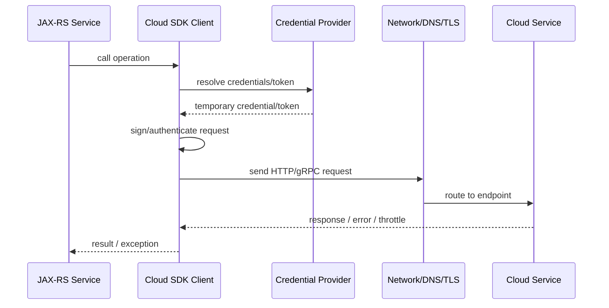
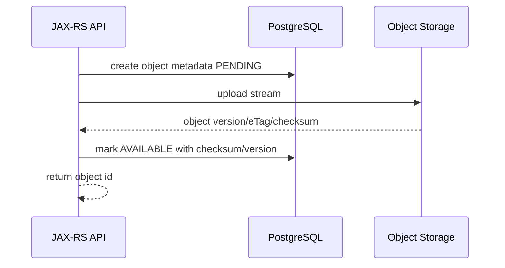

# Part 088 — AWS/Azure SDK, Object Storage, Config Stores, Secrets, and Rotation

> Fokus part ini: memahami cara Java/JAX-RS service berintegrasi dengan cloud SDK dan external services seperti AWS S3, Azure Blob Storage, AWS Systems Manager Parameter Store, AWS AppConfig, Azure App Configuration, AWS Secrets Manager, Azure Key Vault, serta bagaimana credential, retry, timeout, secret rotation, private networking, observability, dan internal verification harus dipikirkan di production.

Catatan penting:

```text
This part does not assume CSG uses AWS, Azure, S3, Blob Storage, Parameter Store, AppConfig, Secrets Manager, Azure App Configuration, or Key Vault.
Treat every cloud service and SDK integration as an internal verification item.
```

A cloud SDK call is not “just a library call”.

It crosses multiple production boundaries:

```text
Java code
-> SDK client
-> credential provider
-> request signing / token acquisition
-> DNS
-> network path
-> TLS
-> cloud endpoint / private endpoint
-> IAM/RBAC policy
-> service quota
-> retry/throttle behavior
-> audit log
```

For senior engineers, the important questions are:

```text
Where do credentials come from?
What identity does the pod/process use?
Which region/account/subscription/tenant is called?
Is the endpoint public or private?
What is the timeout/retry policy?
What happens during throttling?
Can secret rotation happen without redeploy?
How do we avoid logging secrets?
How do we test locally without production credentials?
```

---

## 1. Cloud SDK Mental Model

Cloud SDKs are integration clients that hide protocol details but not distributed-system reality.

Generic lifecycle:



Production implication:

```text
A cloud SDK client must be configured like any other outbound dependency:
timeout, retry, identity, endpoint, region, metrics, tracing, error mapping, and ownership.
```

---

## 2. Client Lifecycle: Do Not Create Per Request

Bad pattern:

```java
@GET
@Path("/documents/{id}")
public Response download(@PathParam("id") String id) {
    S3Client s3 = S3Client.builder().build(); // bad: per request client creation
    // ...
}
```

Why it is bad:

```text
repeated client initialization
uncontrolled connection pools
credential provider churn
harder shutdown
harder metrics/tracing
harder test injection
```

Better pattern:

```java
public final class ObjectStorageClientProvider {
    private final ObjectStorageClient client;

    public ObjectStorageClientProvider(ObjectStorageConfig config, CredentialsProvider credentials) {
        this.client = ObjectStorageClient.create(config, credentials);
    }

    public ObjectStorageClient client() {
        return client;
    }
}
```

In real code, the concrete type may be `S3Client`, `S3AsyncClient`, `BlobServiceClient`, `BlobContainerClient`, or an internal abstraction.

Lifecycle rule:

```text
Cloud SDK clients are infrastructure resources.
Construct once per config scope, inject, reuse, close on shutdown if required.
```

---

## 3. AWS SDK for Java Mental Model

AWS SDK for Java integration usually involves:

```text
region
credentials provider
service client
HTTP client implementation
retry policy
timeout policy
endpoint override if needed
request/response transformer for streaming
```

Common AWS services in this series:

| Service | Typical Use |
|---|---|
| S3 | Object/file storage |
| Systems Manager Parameter Store | External configuration/parameters |
| AWS AppConfig | Managed application configuration / feature-style config rollout |
| Secrets Manager | Secret storage and rotation |
| STS/IAM | Temporary credentials and role assumption |
| CloudWatch | Logs/metrics/audit adjacent observability |

AWS identity principle:

```text
Prefer temporary workload identity over static access keys.
```

In Kubernetes/EKS, this usually means workload identity/role association rather than hardcoded credentials. Exact platform mechanism must be verified internally.

---

## 4. Azure SDK for Java Mental Model

Azure SDK integration usually involves:

```text
credential/token provider
resource endpoint
client builder
service-specific client
retry/timeout policy
Azure tenant/subscription/resource group context
RBAC role assignment
private endpoint/DNS if configured
```

Common Azure services in this series:

| Service | Typical Use |
|---|---|
| Azure Blob Storage | Object/file storage |
| Azure App Configuration | External configuration and feature flags |
| Azure Key Vault | Secrets/keys/certificates |
| Microsoft Entra ID | Identity/token authority |
| Azure Monitor | Logs/metrics/traces platform |

Azure identity principle:

```text
Prefer managed identity / workload identity over connection strings and static secrets.
```

Exact mechanism depends on hosting model: AKS, App Service, VM, on-prem, or hybrid.

---

## 5. Credential Provider Chain and Identity Resolution

Credential resolution is one of the most common production failure points.

Questions:

```text
What credential provider is active in local development?
What provider is active in Kubernetes?
What provider is active in CI?
What provider is active in on-prem deployment?
Could the SDK silently pick the wrong credentials?
Could local credentials accidentally access production?
```

AWS-style credential risks:

| Risk | Example |
|---|---|
| Wrong profile | Local machine uses default profile for wrong account |
| Static key leak | Access key stored in env, config, logs, or CI variable |
| Missing region | SDK fails at startup or calls wrong region |
| Expired token | Temporary credential not refreshed correctly |
| Wrong role | Pod assumes role with insufficient/excessive permissions |

Azure-style credential risks:

| Risk | Example |
|---|---|
| Wrong tenant | Token acquired from unexpected Entra tenant |
| Wrong managed identity | Pod/app uses default identity instead of expected user-assigned identity |
| Missing RBAC | Identity authenticates but lacks data-plane permission |
| Connection string fallback | Secret-based access bypasses identity governance |
| Local developer identity | Local user has broader access than service identity |

Senior rule:

```text
Authentication success is not authorization correctness.
The identity may be valid but still wrong.
```

---

## 6. Object Storage: S3 and Azure Blob

Object storage is not a filesystem.

Mental model:

```text
bucket/container
-> object/blob key
-> metadata
-> content stream
-> versioning/lifecycle policy maybe
-> access policy/IAM/RBAC/SAS/presigned URL maybe
```

Typical use cases:

```text
large quote/order attachments
export files
import files
generated documents
audit artifacts
integration payload archive
reconciliation reports
```

Design questions:

```text
Who owns object key naming?
Is object immutable after write?
Is versioning enabled?
What metadata is required?
What retention policy applies?
Is object encrypted?
How are large downloads streamed?
How are partial failures reconciled?
```

Object key strategy:

```text
tenant/{tenantId}/quote/{quoteId}/attachment/{attachmentId}/{filename}
```

But do not blindly encode sensitive identifiers into object keys if object names appear in logs/audit/events.

Safer approach:

```text
tenant-hash/{tenantBucket}/object/{objectId}
metadata table maps objectId -> business context
```

---

## 7. Object Storage Upload Flow

A robust upload flow separates metadata, content, and business state.



Failure modes:

| Failure | Impact | Mitigation |
|---|---|---|
| DB metadata created, upload fails | dangling pending metadata | cleanup job / timeout |
| Upload succeeds, DB update fails | orphan object | reconciliation job |
| Client retries upload | duplicate object | idempotency key / object id |
| Large file buffered in memory | OOM | streaming upload |
| Wrong content type | consumer failure/security risk | validate content type and sniff if required |
| Missing checksum | silent corruption | checksum verification |

Production rule:

```text
Object storage operations need reconciliation because object storage and database update are not one atomic transaction.
```

---

## 8. Object Storage Download Flow

Download concerns:

```text
authorization before access
streaming response
range request if supported/required
content-disposition
content-type
checksum/eTag
cache control
rate limiting
large file timeout
client disconnect
```

JAX-RS shape:

```java
@GET
@Path("/documents/{objectId}/content")
public Response download(@PathParam("objectId") String objectId) {
    // authorize business access first
    // resolve metadata from DB
    // open object stream from storage
    // return StreamingOutput / response body stream
    // close stream correctly
    return Response.ok(streamingOutput)
        .type(metadata.contentType())
        .header("Content-Disposition", metadata.contentDisposition())
        .build();
}
```

Avoid:

```text
read full object into byte[] for large files
log object content
trust object key from user input
skip tenant authorization because object id is opaque
```

---

## 9. External Configuration Stores

External config stores are used when config must be managed outside application artifact.

Examples:

```text
AWS Systems Manager Parameter Store
AWS AppConfig
Azure App Configuration
internal config service
Kubernetes ConfigMap / external secret operator
```

Config categories:

| Category | Example | Runtime Reload? |
|---|---|---|
| Static startup config | port, DB pool size | usually no |
| Integration endpoint | downstream base URL | sometimes |
| Business config | feature threshold, tenant rule | maybe |
| Secret reference | key vault URI, secret name | no direct secret value |
| Feature flag | enable new pricing path | yes, controlled |

Config store risks:

```text
unclear precedence
runtime drift across pods
partial rollout inconsistency
invalid config loaded dynamically
secret value treated as normal config
missing audit trail
```

Rule:

```text
Dynamic config must be validated as strictly as startup config.
```

---

## 10. Configuration Precedence

A service should have a deterministic precedence model.

Example precedence from low to high:

```text
application default
-> environment profile config
-> Kubernetes ConfigMap
-> cloud config store
-> tenant-specific config
-> emergency override / kill switch
```

But the exact order must be internal standard.

Documentation should answer:

```text
If the same key exists in three places, which wins?
Is the winning source visible in diagnostics?
Can we detect drift between pods?
Can runtime reload happen safely?
Can config be rolled back?
```

Diagnostic endpoint concept:

```text
/config/diagnostics
- key name
- effective source
- sanitized value or hash
- last loaded time
- version/etag
```

Never expose secrets.

---

## 11. Secret Stores: Secrets Manager and Key Vault

Secret stores are for sensitive values:

```text
passwords
API keys
private keys
client secrets
certificates
signing material
credential references
```

They are not for ordinary business config.

Secret retrieval models:

| Model | Description | Trade-off |
|---|---|---|
| Load at startup | Fetch once during boot | simple but rotation needs reload/restart |
| Cache with TTL | Refresh periodically | balances latency and rotation |
| Fetch per use | Always latest | high latency/cost, failure-sensitive |
| Sidecar/agent | External process manages secret | platform complexity |
| Mounted secret | Runtime injects file/env | easy but reload semantics vary |

Secret handling rules:

```text
never log secret values
never put secret in exception messages
never expose secret through config diagnostics
prefer references over raw values in normal config
rotate secrets with overlap window
monitor secret access failures
```

---

## 12. Secret Rotation

Secret rotation is a lifecycle, not a one-time update.

Safe rotation pattern:

```text
create new secret version
-> allow both old and new where possible
-> deploy/reload consumers
-> verify new credential is used
-> revoke old credential
-> monitor failures
```

Rotation failure modes:

| Failure | Cause | Mitigation |
|---|---|---|
| Service keeps old secret | no reload/restart | TTL/restart/rotation event |
| New secret not authorized | missing downstream grant | pre-rotation validation |
| Immediate old revoke | rolling deployment still uses old | overlap window |
| Secret logged during debug | unsafe logging | redaction guard |
| Rotation breaks only one pod | config drift | per-pod diagnostics |

PR review question:

```text
Can this secret be rotated without emergency code change?
```

---

## 13. Request Timeout, Retry, and Throttling

Cloud service calls can fail because of:

```text
network timeout
TLS/DNS failure
credential/token failure
IAM/RBAC deny
service throttling
quota limit
regional outage
request too large
object not found
conditional write conflict
```

Retry policy must be operation-aware.

| Operation | Retry Consideration |
|---|---|
| Read object/config/secret | retry can be safe if bounded |
| Write new object with deterministic key | retry safe if idempotent/conditional |
| Append/update mutable object | risky without concurrency control |
| Delete object | idempotency depends semantics/versioning |
| Rotate secret | must be carefully sequenced |

Retry budget:

```text
max total time spent retrying must fit caller timeout and business SLA
```

Bad pattern:

```text
HTTP request timeout: 5s
SDK retry policy worst-case: 30s
```

Better:

```text
SDK timeout + retry budget < resource method timeout < gateway timeout
```

---

## 14. Conditional Writes and Concurrency

Object/config/secret stores often expose some form of version, ETag, generation, or condition.

Use conditional operations when concurrent modification matters.

Examples:

```text
only write if object does not exist
only update if ETag matches
only use expected version
only promote config version after validation
```

Failure model:

```text
service A reads config version 10
service B updates to version 11
service A writes based on stale version 10
without condition, B's update can be overwritten
```

Senior rule:

```text
If the resource is mutable and shared, require optimistic concurrency or explicit ownership.
```

---

## 15. Private Endpoints, DNS, and Network Path

Cloud SDK errors are often network/platform errors disguised as application exceptions.

Network path checklist:

```text
pod subnet
network policy
service account / identity
DNS resolver
private endpoint DNS zone
VPC/VNet route table
security group / NSG
proxy if any
TLS trust store
cloud service endpoint
```

Failure examples:

| Symptom | Possible Cause |
|---|---|
| Unknown host | DNS/private zone issue |
| Connection timeout | route/security group/network policy |
| TLS handshake failure | trust store/certificate/proxy |
| 403 | IAM/RBAC/resource policy |
| 404 | wrong bucket/container/key/region/account |
| Slow startup | credential provider timeout or DNS delay |

Operational rule:

```text
For cloud SDK issues, always separate auth failure, authorization failure, DNS failure, network failure, and service error.
```

---

## 16. Region, Account, Subscription, and Environment Safety

Enterprise systems often run across:

```text
dev/test/stage/prod
multiple AWS accounts
multiple Azure subscriptions
multiple regions
multiple tenants
hybrid on-prem/cloud
```

Hard safety guards:

```text
explicit region config
explicit account/subscription expectation
startup validation of cloud identity
resource name includes environment only if naming policy allows
no production credentials in local dev
separate IAM/RBAC per environment
```

Startup validation example:

```text
expectedEnvironment=prod
expectedCloudAccount=123456789012
actualCallerIdentity=123456789012
expectedRegion=ap-southeast-1
configuredBucket=csg-prod-quote-documents
```

Do not log sensitive details, but log enough sanitized identity metadata for diagnostics.

---

## 17. Local Development

Local dev must not require production secrets.

Options:

```text
local emulator where practical
mock object storage adapter
dev cloud account with restricted resources
fake secret provider
Docker Compose with MinIO/Azurite if aligned internally
recorded test fixtures
```

Do not assume emulators match production behavior for:

```text
IAM/RBAC
audit logging
private endpoints
large object performance
service quotas
conditional request semantics
retry/throttling behavior
```

Local profile rule:

```text
Local convenience must not train engineers to bypass production identity and security boundaries.
```

---

## 18. Testing Strategy

Test cloud integration through layers.

| Test | Purpose |
|---|---|
| Unit test | SDK abstraction behavior with fake client |
| Contract test | Object metadata/config/secret key shape |
| Integration test | Real or emulator-backed object/config access |
| Permission test | Verify service identity has least privilege |
| Rotation test | Verify secret refresh/reload works |
| Failure test | Throttle, timeout, 403, 404, partial upload |
| Reconciliation test | DB/object storage mismatch recovery |

Important test cases:

```text
object upload succeeds
object upload fails after DB metadata created
DB update fails after object upload
secret unavailable during startup
secret rotates while service is running
credential provider cannot resolve identity
wrong region/account/subscription configured
cloud service returns 429/503
```

---

## 19. Observability

Minimum telemetry for cloud SDK calls:

```text
service name
operation
region
account/subscription indicator if allowed
endpoint type: public/private/internal
status/error code
latency histogram
retry count
throttle count
request size / response size bucket
credential provider type, sanitized
```

Avoid metric labels like:

```text
object key
customer id
full tenant id if high cardinality
secret name if sensitive
raw endpoint if it contains env/customer data
```

Good logs:

```json
{
  "event": "cloud_object_upload_failed",
  "provider": "aws",
  "service": "s3",
  "operation": "putObject",
  "objectId": "obj_123",
  "businessType": "quote_attachment",
  "errorCategory": "throttled",
  "retryable": true,
  "correlationId": "..."
}
```

Never log:

```text
secret value
access key
session token
SAS token
presigned URL with signature
full object content
raw authorization header
```

---

## 20. Security and Least Privilege

Cloud SDK integration must be least-privilege by default.

Policy questions:

```text
Can this service read only its required bucket/container/path?
Can it write but not delete?
Can it read only specific secret names?
Can it access only required config labels/environments?
Can local/dev identity access prod?
Are audit logs enabled for sensitive operations?
```

Example separation:

| Capability | Separate Permission? |
|---|---|
| Read object | yes |
| Write object | yes |
| Delete object | yes, often restricted |
| Read secret | yes, specific secret paths |
| Rotate secret | yes, usually platform-owned |
| Read config | yes |
| Modify config | yes, release/platform-owned |

Senior rule:

```text
Application runtime identity should rarely have permission to change its own production security baseline.
```

---

## 21. Internal Verification Checklist

### Cloud provider and SDK

```text
[ ] Is AWS used, Azure used, both, or neither?
[ ] Which SDK versions are used?
[ ] Are SDK clients wrapped behind internal abstractions?
[ ] Are clients sync or async?
[ ] Which HTTP client implementation is configured?
[ ] Where are timeout/retry policies configured?
```

### Identity and credentials

```text
[ ] What identity does the service use in Kubernetes/cloud/on-prem?
[ ] Does it use static secrets, workload identity, managed identity, IRSA, or another platform mechanism?
[ ] Is credential resolution explicit enough to avoid wrong identity?
[ ] Are local dev credentials isolated from production?
[ ] Is startup identity validation implemented?
```

### Object storage

```text
[ ] Is S3, Azure Blob, both, or another object store used?
[ ] What buckets/containers exist per environment/tenant?
[ ] What object key naming policy exists?
[ ] Is versioning enabled?
[ ] Are checksums/eTags used?
[ ] Is there orphan object reconciliation?
[ ] Are large files streamed?
```

### Config stores

```text
[ ] Is Parameter Store/AppConfig/Azure App Configuration/internal config service used?
[ ] What is config precedence?
[ ] Does runtime reload exist?
[ ] How is invalid config rejected?
[ ] Is config drift detectable per pod?
[ ] Are config changes audited?
```

### Secrets

```text
[ ] Is Secrets Manager/Key Vault/internal vault used?
[ ] Are secret values cached? With what TTL?
[ ] How does rotation happen?
[ ] Is there overlap between old and new secret versions?
[ ] Are secrets redacted from logs/errors/diagnostics?
[ ] Are access failures alerted?
```

### Networking

```text
[ ] Are cloud services reached through public endpoints or private endpoints?
[ ] Are DNS private zones configured?
[ ] Are network policies/security groups/NSGs documented?
[ ] Is TLS inspection/proxy involved?
[ ] Is there a runbook for DNS/TLS/403/timeout failure separation?
```

---

## 22. PR Review Checklist

For any PR touching cloud SDK integration:

```text
[ ] Is the SDK client lifecycle correct and reusable?
[ ] Are timeout and retry budgets explicit?
[ ] Is the operation idempotent or protected by condition/idempotency key?
[ ] Is object storage coordinated with DB using reconciliation?
[ ] Are large objects streamed instead of buffered?
[ ] Are credentials sourced from approved provider?
[ ] Is least privilege preserved?
[ ] Are secrets never logged or exposed through diagnostics?
[ ] Is region/account/subscription explicit and validated?
[ ] Is config precedence documented?
[ ] Does secret/config rotation work without unsafe redeploy?
[ ] Are metrics/logs/traces sufficient for cloud-call debugging?
[ ] Are local tests not dependent on production credentials?
[ ] Is private endpoint/DNS behavior considered?
```

---

## 23. Senior Mental Model

Cloud SDK integration is infrastructure coupling.

Treat it with the same rigor as database and messaging:

```text
identity is part of the contract
region/account/subscription is part of the contract
retry/timeout is part of the contract
object key naming is part of the contract
secret rotation is part of the contract
network path is part of the contract
observability is part of the contract
```

Final heuristic:

```text
If credentials rotate tonight, will the service survive?
If object upload succeeds but DB update fails, can we reconcile?
If DNS/private endpoint breaks, can we diagnose without guessing?
If the SDK retries for 30 seconds, does it violate the caller's SLA?
If a developer runs locally, can they avoid touching production resources?
```

That is the expected standard for cloud SDK integration in enterprise Java/JAX-RS systems.
