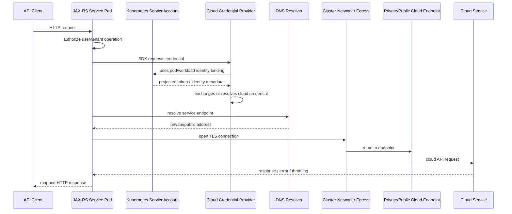

# Part 089 — Kubernetes Pod Cloud Credentials and Private Endpoints

> Fokus part ini: memahami bagaimana sebuah Java/JAX-RS service yang berjalan sebagai Pod Kubernetes memperoleh identity, mengambil credential cloud, mengakses service cloud melalui public/private endpoint, dan bagaimana men-debug kegagalan credential, DNS, TLS, routing, IAM/RBAC, NetworkPolicy, atau private connectivity di production.

Catatan penting:

```text
This part does not assume CSG uses Kubernetes, EKS, AKS, AWS Pod Identity, IRSA,
Azure Workload Identity, private endpoints, PrivateLink, or any specific cloud pattern.
Treat all runtime, identity, and networking details as internal verification items.
```

A pod calling a cloud service is not merely “Java SDK calls cloud API”.

It is a chain of independently failing subsystems:

```text
JAX-RS resource/service code
-> SDK client
-> credential provider chain
-> pod service account / workload identity
-> cloud IAM / RBAC / trust policy
-> DNS resolution
-> cluster egress path
-> private endpoint / public endpoint
-> TLS validation
-> cloud service authorization
-> cloud service quota/throttling
-> audit log / telemetry
```

A senior engineer should never debug this only from Java stack traces. The stack trace is usually the last symptom, not the root cause.

---

## 1. Mental Model: Three Identities, One Outbound Call

When a JAX-RS service calls cloud infrastructure from Kubernetes, at least three identity concepts may exist at once.

| Identity | What it represents | Common location | Typical risk |
|---|---|---|---|
| Application identity | The logical service/application | service config, deployment metadata, observability labels | unclear ownership, bad audit attribution |
| Kubernetes identity | The pod’s identity inside Kubernetes | `ServiceAccount`, namespace, RBAC | default service account overuse, broad API access |
| Cloud identity | The identity accepted by AWS/Azure | IAM role, managed identity, federated credential | over-permission, wrong account/subscription, credential leak |
| End-user identity | Human/customer/tenant identity behind the request | JWT, session, security context | confused deputy, cross-tenant access |

A pod can be authorized to call a cloud service even when the current HTTP user should not be able to trigger that operation. That is why service identity and user/tenant authorization must not be conflated.

```text
Service identity answers:
"Is this workload allowed to call this cloud API?"

User/tenant authorization answers:
"Is this request allowed to cause this workload to call that cloud API for this tenant/resource?"
```

In Quote & Order style systems, this distinction matters for operations like:

```text
export quote PDF
upload attachment
read tenant-specific catalog config
write audit evidence
load pricing/rules configuration
fetch secret for downstream system
publish document to object storage
```

---

## 2. Generic Lifecycle of a Pod-to-Cloud Call



This lifecycle exposes several review questions:

```text
Which service account is attached to the pod?
Which cloud identity is bound to that service account?
Which permissions does that cloud identity have?
Which endpoint does the SDK call?
Does DNS resolve to public or private address?
Does the cluster allow egress to that address?
Does the remote cloud service allow this identity?
How are errors classified and logged?
```

---

## 3. Kubernetes ServiceAccount Is Not Automatically Cloud Permission

A Kubernetes `ServiceAccount` provides an identity inside the Kubernetes cluster. It can authenticate to the Kubernetes API server and can be used as a stable workload identity anchor.

But a Kubernetes service account alone does not automatically grant AWS or Azure permissions.

There is usually an identity bridge:

```text
Kubernetes ServiceAccount
-> workload identity binding / annotation / association
-> cloud IAM role / managed identity / federated identity credential
-> cloud service authorization
```

Important production rules:

```text
Do not run business services with the namespace default ServiceAccount unless explicitly justified.
Do not mount Kubernetes API tokens if the app does not need them.
Do not grant broad Kubernetes RBAC just because the service needs cloud access.
Do not use long-lived static cloud keys inside Kubernetes secrets unless there is a strong exception.
Use one workload identity per meaningful permission boundary.
```

Typical Kubernetes manifest shape:

```yaml
apiVersion: v1
kind: ServiceAccount
metadata:
  name: quote-order-api
  namespace: quote-order
  annotations:
    # Cloud-specific identity binding may appear here.
    # Exact annotation depends on platform and must be verified internally.
    example.cloud/role: "quote-order-api-role"
---
apiVersion: apps/v1
kind: Deployment
metadata:
  name: quote-order-api
spec:
  template:
    spec:
      serviceAccountName: quote-order-api
      automountServiceAccountToken: true
      containers:
        - name: app
          image: example/quote-order-api:1.0.0
```

Do not copy the annotation. It is intentionally generic.

---

## 4. AWS/EKS Patterns: Pod Identity and IRSA

For AWS/EKS, two common patterns exist in modern clusters:

1. **IAM Roles for Service Accounts (IRSA)**
2. **EKS Pod Identity**

At the conceptual level, both solve a similar problem:

```text
Allow a Kubernetes workload to obtain AWS credentials without embedding static AWS keys.
```

Conceptual chain:

```text
Pod
-> Kubernetes ServiceAccount
-> identity association / trust relationship
-> IAM role
-> temporary AWS credentials
-> AWS SDK call
```

What the Java service usually sees:

```text
The AWS SDK credential provider chain resolves credentials.
The application code should not hardcode access keys.
The application code should not know whether the credentials came from IRSA,
EKS Pod Identity, node role, environment variables, or local developer config.
```

Senior-level checks:

```text
Is the pod using a workload-specific ServiceAccount?
Is the IAM role scoped to only the required AWS APIs and resources?
Is the trust relationship limited to the correct cluster/namespace/service account?
Is the SDK using temporary credentials rather than static keys?
Are region/account assumptions explicit?
Is CloudTrail useful enough to attribute calls to the workload?
```

Common AWS failure modes:

| Symptom | Likely area | What to check |
|---|---|---|
| `AccessDenied` | IAM permission | role policy, resource ARN, condition keys |
| `InvalidIdentityToken` | OIDC/trust | cluster OIDC issuer, service account binding, trust policy |
| SDK uses node role unexpectedly | credential chain | env vars, pod identity agent, annotation/association, SDK logs |
| works locally, fails in pod | credential source | local profile vs pod role difference |
| timeout calling AWS service | network path | VPC endpoint, route table, security group, DNS |
| throttling | cloud quota / retry | SDK retry mode, request rate, quota, backoff |

Internal verification checklist:

```text
Check whether the cluster uses IRSA, EKS Pod Identity, static keys, node IAM role, or another platform abstraction.
Check whether SDK clients use the default credential provider chain or custom credential provider.
Check IAM role names, trust policy, and resource policy.
Check whether calls go through VPC endpoints or public AWS endpoints.
Check CloudTrail attribution for the workload.
```

---

## 5. Azure/AKS Patterns: Workload Identity and Managed Identity

For AKS, distinguish two identity scenarios:

```text
Cluster identity:
How AKS itself manages Azure resources.

Workload identity:
How an application running in a pod authenticates to Azure services.
```

A JAX-RS application usually cares about workload identity.

Conceptual chain:

```text
Pod
-> Kubernetes ServiceAccount
-> federated identity / workload identity binding
-> Microsoft Entra identity
-> Azure RBAC / service permission
-> Azure SDK call
```

What the Java service usually sees:

```text
Azure Identity library resolves a credential.
Application code calls Azure SDK clients.
The app should not store client secrets or certificates unless explicitly required.
```

Common Azure failure modes:

| Symptom | Likely area | What to check |
|---|---|---|
| authentication failure | workload identity binding | OIDC issuer, federated credential, service account annotation |
| authorization failure | Azure RBAC | role assignment, scope, subscription, resource group |
| wrong identity used | credential chain | environment variables, managed identity selection, client ID config |
| DNS resolves public address | private endpoint DNS | private DNS zone, VNet link, resolver config |
| timeout to service | network path | NSG, UDR, firewall, private endpoint approval |
| local works, pod fails | environment mismatch | local developer credential vs pod workload identity |

Internal verification checklist:

```text
Check whether AKS Workload Identity is enabled.
Check service account annotations and federated identity credential.
Check Azure RBAC role assignment scope.
Check whether the service uses DefaultAzureCredential or custom credential wiring.
Check whether private DNS zones are linked to the cluster VNet.
```

---

## 6. Private Endpoints and Private Connectivity

A private endpoint/private link pattern usually means:

```text
The cloud service is reachable through a private IP inside a VPC/VNet,
not through the public internet path.
```

This changes debugging. The same hostname may resolve differently depending on where the caller runs.

```text
Developer laptop DNS -> public endpoint
Pod in cluster DNS -> private endpoint IP
CI runner DNS -> maybe public, maybe blocked
On-prem resolver -> maybe split-horizon route
```

Private endpoint success requires several layers to align:

```text
Cloud service configured for private access
Private endpoint created and approved
Private DNS record exists
VPC/VNet DNS resolver can answer the record
Cluster/pod DNS forwards correctly
Route table sends traffic to the endpoint
Firewall/SG/NSG allows traffic
Kubernetes NetworkPolicy allows egress
TLS certificate still matches hostname
Cloud IAM/RBAC authorizes the identity
```

Important: private networking does not replace authorization.

```text
Private endpoint says: "network path is private."
IAM/RBAC says: "this identity may call the service."
Application authorization says: "this user/tenant may trigger this operation."
```

---

## 7. DNS Is a First-Class Production Dependency

Many private endpoint incidents are DNS incidents disguised as SDK errors.

Diagnostic questions:

```text
What hostname is the SDK calling?
What IP does it resolve to inside the pod?
Does it resolve differently from node, pod, CI, and laptop?
Is the result public or private?
Is there a private DNS zone/record?
Is DNS cached by JVM, OS, sidecar, or node resolver?
```

Useful commands from a debug pod:

```bash
nslookup <service-hostname>
dig <service-hostname>
curl -v https://<service-hostname>/
openssl s_client -connect <service-hostname>:443 -servername <service-hostname>
```

For Java, remember that DNS behavior may also be affected by JVM DNS caching.

Internal verification checklist:

```text
Check CoreDNS configuration.
Check private DNS zones and links.
Check split-horizon DNS behavior.
Check JVM DNS TTL settings if incidents show stale endpoint resolution.
Check whether sidecars/proxies override DNS or outbound routing.
```

---

## 8. Java/JAX-RS Integration Pattern

Do not create SDK clients per request.

Preferred shape:

```text
Application startup
-> load config
-> build cloud SDK clients once
-> inject clients into services
-> use per-request context only for authorization/correlation
-> call cloud SDK with bounded timeout/retry
-> map errors into domain/technical API errors
```

Example shape:

```java
public final class ObjectStorageService {
    private final CloudStorageClient client;
    private final StorageConfig config;

    public ObjectStorageService(CloudStorageClient client, StorageConfig config) {
        this.client = client;
        this.config = config;
    }

    public StoredObjectRef uploadQuoteDocument(
            TenantId tenantId,
            QuoteId quoteId,
            InputStream content,
            long contentLength,
            CorrelationContext correlation
    ) {
        // 1. Validate tenant authorization before cloud call.
        // 2. Build tenant-safe object key.
        // 3. Attach correlation metadata where allowed.
        // 4. Apply bounded timeout/retry in the client layer.
        // 5. Map cloud errors into stable service errors.
        return client.putObject(
                config.bucketOrContainer(),
                buildObjectKey(tenantId, quoteId),
                content,
                contentLength,
                correlation
        );
    }
}
```

Avoid this shape:

```java
// Anti-pattern: client created per request, credential behavior hidden, no timeout ownership.
public Response upload(InputStream input) {
    var client = CloudClientBuilder.defaultClient();
    client.putObject("prod-bucket", "some/key", input);
    return Response.ok().build();
}
```

Why it is dangerous:

```text
client lifecycle unclear
connection reuse lost
credential source not reviewable
hardcoded environment/resource
no tenant boundary
no timeout/retry decision
hard to test
hard to observe
```

---

## 9. Health Checks: Do Not Turn External Cloud into Startup Fragility

A common production mistake is performing hard dependency calls at startup.

Example risky startup behavior:

```text
Pod starts
-> app calls Key Vault / Secrets Manager / object storage immediately
-> transient cloud/DNS issue happens
-> pod fails startup
-> rollout stalls
-> old replicas are terminated
-> outage expands
```

Better model:

```text
Startup should validate local configuration and fail on impossible local state.
Readiness should represent whether the service can safely receive traffic.
External dependency checks should be bounded, cached, and classified.
Critical vs optional dependencies must be explicit.
```

Readiness example policy:

| Dependency | Startup fail? | Readiness fail? | Degrade? |
|---|---:|---:|---:|
| missing required config | yes | yes | no |
| object storage unavailable | usually no | maybe | maybe |
| secret needed for every request unavailable | maybe | yes | no |
| optional reporting storage unavailable | no | no | yes |

Internal verification checklist:

```text
Check startup dependency calls.
Check readiness/liveness/startup probe semantics.
Check whether cloud dependency failure removes pods from service.
Check whether rollout strategy protects against dependency incidents.
```

---

## 10. Observability for Pod-to-Cloud Calls

Minimum telemetry dimensions:

```text
operation name
cloud provider
cloud service
region
account/subscription/environment
endpoint type: public/private/unknown
result: success/error/throttled/timeout/auth_denied
error class
duration histogram
retry count
correlation ID
trace ID/span ID
```

Avoid labels with unbounded cardinality:

```text
object key
full URL with query string
customer name
raw tenant ID if high-cardinality policy forbids it
secret name if sensitive
full exception message containing request IDs or identifiers
```

Good log event shape:

```json
{
  "event": "cloud.storage.put.completed",
  "provider": "aws-or-azure",
  "service": "object-storage",
  "endpointType": "private",
  "operation": "putObject",
  "durationMs": 187,
  "result": "success",
  "retryCount": 1,
  "correlationId": "...",
  "traceId": "..."
}
```

Bad log event shape:

```text
Uploaded file to https://bucket.example.com/tenant-123/customer-secret-contract.pdf?sig=...
```

---

## 11. Debugging Playbook

When a pod cannot access a cloud service, debug in this order.

### Step 1 — Confirm application intent

```text
Which endpoint/action triggered the call?
Which tenant/user/resource was involved?
Which cloud service should be called?
Which bucket/container/secret/config/resource is expected?
```

### Step 2 — Confirm pod identity

```bash
kubectl get pod <pod> -n <ns> -o yaml | grep -A5 serviceAccountName
kubectl get serviceaccount <sa> -n <ns> -o yaml
kubectl auth can-i --as=system:serviceaccount:<ns>:<sa> get pods -n <ns>
```

The last command checks Kubernetes API permissions, not cloud permissions. Keep the distinction clear.

### Step 3 — Confirm cloud identity binding

```text
AWS: check IAM role association/trust policy/pod identity association.
Azure: check workload identity annotation/federated credential/managed identity client ID.
```

### Step 4 — Confirm credential provider behavior

```text
Enable SDK credential provider debug logs in a safe non-sensitive way.
Check whether environment variables override workload identity.
Check whether local config accidentally leaked into image or pod.
```

### Step 5 — Confirm DNS

```bash
kubectl exec -n <ns> <pod> -- nslookup <cloud-service-hostname>
kubectl exec -n <ns> <pod> -- sh -c 'getent hosts <cloud-service-hostname>'
```

### Step 6 — Confirm TLS and network path

```bash
kubectl exec -n <ns> <pod> -- curl -v https://<cloud-service-hostname>/
kubectl exec -n <ns> <pod> -- openssl s_client -connect <host>:443 -servername <host>
```

### Step 7 — Confirm cloud authorization

```text
Check cloud audit logs.
Check denied action/resource.
Check resource policy.
Check role assignment scope.
Check tenant/account/subscription mismatch.
```

### Step 8 — Confirm application mapping

```text
Was cloud 403 mapped to API 500?
Was timeout retried too aggressively?
Was error logged with correlation ID?
Was customer-facing response safe and stable?
```

---

## 12. Failure Mode Catalog

| Failure mode | Root cause | Detection | Prevention |
|---|---|---|---|
| Wrong service account | deployment manifest mismatch | pod YAML, audit logs | explicit `serviceAccountName`, admission policy |
| Default service account used | missing config | pod spec | deny default SA for production workloads |
| Wrong cloud identity | bad binding/annotation | SDK logs, cloud audit | one identity per workload, CI validation |
| Over-permissioned identity | broad IAM/RBAC | policy review | least privilege, resource-level constraints |
| Static credentials leaked | secret/env misuse | secret scan, audit | workload identity, rotation, redaction |
| DNS resolves public endpoint | private DNS missing | `nslookup` from pod | private DNS zones, tests |
| TLS hostname mismatch | wrong endpoint/host override | TLS handshake error | use service hostname, not raw IP |
| NetworkPolicy blocks egress | namespace policy | connection timeout | documented egress rules |
| Private endpoint not approved | cloud-side config | cloud portal/API | provisioning checks |
| SDK retries amplify outage | retry config too broad | retry count, latency | retry budget, circuit breaker |
| Startup dependency crash | hard cloud call at boot | CrashLoopBackOff | bounded readiness, lazy init |
| Cloud throttling | quota exceeded | 429/throttle metrics | backoff, request shaping, quota review |
| Cross-tenant object access | key construction bug | audit/object logs | tenant prefix guard, authorization before call |

---

## 13. PR Review Checklist

For any PR adding or changing pod-to-cloud access, review:

```text
[ ] Does the app use a workload-specific Kubernetes ServiceAccount?
[ ] Is cloud identity obtained through platform-standard workload identity?
[ ] Are static credentials avoided?
[ ] Is cloud resource name configured, not hardcoded?
[ ] Is tenant/user authorization checked before the cloud operation?
[ ] Is object/secret/config key construction tenant-safe?
[ ] Are timeout, retry, and circuit breaker policies explicit?
[ ] Are SDK clients reused and lifecycle-managed?
[ ] Are cloud errors mapped into stable application errors?
[ ] Are logs redacted and correlated?
[ ] Are metrics/traces emitted for cloud calls?
[ ] Does the code work with private endpoints and restricted egress?
[ ] Is local development credential behavior documented?
[ ] Are tests covering auth denied, timeout, not found, throttling, and retry exhaustion?
```

---

## 14. Internal Verification Checklist

For CSG/internal codebase verification, check:

```text
Runtime and cluster
[ ] Are services deployed to Kubernetes? Which clusters/environments?
[ ] EKS, AKS, both, on-prem Kubernetes, or another platform?
[ ] Which namespace and ServiceAccount convention is used?
[ ] Is default ServiceAccount forbidden for production workloads?

Cloud identity
[ ] AWS IRSA, EKS Pod Identity, Azure Workload Identity, managed identity, static secrets, or platform abstraction?
[ ] Where is identity association declared: Terraform, Helm, Kustomize, GitOps repo, platform portal?
[ ] Who owns IAM/RBAC role assignment?
[ ] How are permission changes reviewed?

SDK behavior
[ ] Which SDKs are used by Java services?
[ ] Do SDK clients use default credential chain or custom providers?
[ ] Are clients singleton/lifecycle-managed?
[ ] Are timeouts/retries standardized?

Private networking
[ ] Are cloud services reached through public endpoints, private endpoints, or service endpoints?
[ ] Which DNS zones/resolvers are involved?
[ ] Are NetworkPolicies used for egress?
[ ] Are outbound proxies or service mesh sidecars involved?

Observability and operations
[ ] Are cloud calls traced?
[ ] Are auth/network/DNS errors distinguishable in logs?
[ ] Are cloud audit logs accessible during incidents?
[ ] Is there a runbook for pod-to-cloud access failures?
```

---

## 15. Senior Takeaways

A cloud SDK call from Kubernetes is a distributed transaction across identity, network, DNS, TLS, policy, and application semantics.

The senior mental model:

```text
Do not ask only: "Why does the SDK fail?"
Ask:
- Which identity is being used?
- Which endpoint is being called?
- Which network path is taken?
- Which policy denies or allows it?
- Which tenant/user action caused it?
- Which timeout/retry behavior amplifies it?
- Which telemetry proves the answer?
```

If a service can call cloud APIs, it must be reviewable as production infrastructure, not just Java application code.

---

## References to Verify Against Current Platform Standards

Use internal platform documentation as the source of truth. Public references useful for orientation:

```text
Kubernetes ServiceAccounts:
https://kubernetes.io/docs/concepts/security/service-accounts/
https://kubernetes.io/docs/tasks/configure-pod-container/configure-service-account/

AWS EKS Pod Identity:
https://docs.aws.amazon.com/eks/latest/userguide/pod-identities.html

Azure AKS Workload Identity:
https://learn.microsoft.com/en-us/azure/aks/workload-identity-overview
https://learn.microsoft.com/en-us/azure/aks/workload-identity-deploy-cluster
```
