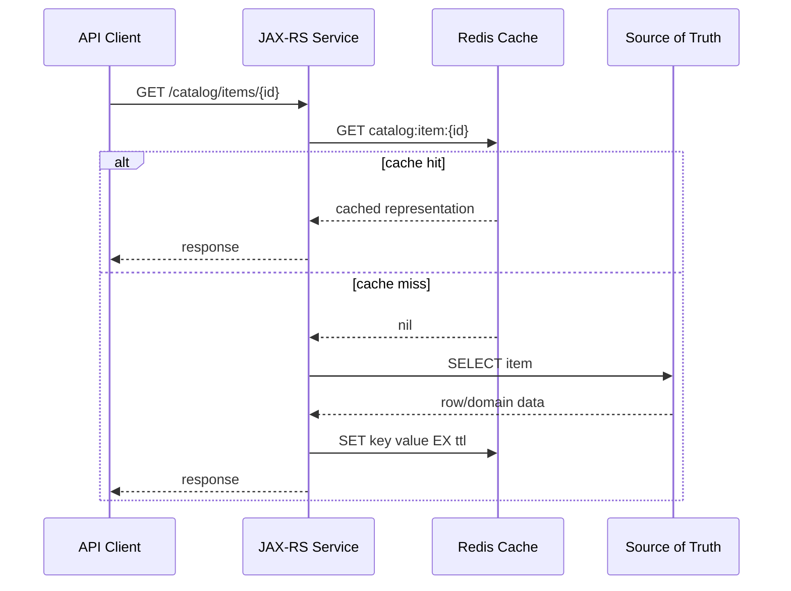

# Part 090 — Redis Fundamentals and Cache Design

> Fokus part ini: memahami Redis sebagai cache untuk Java/JAX-RS enterprise service: kapan dipakai, kapan tidak, bagaimana lifecycle cache-aside bekerja, bagaimana mendesain key/TTL/invalidation/serialization, bagaimana menjaga tenant isolation, dan bagaimana men-debug stale data, cache stampede, eviction, latency, dan Redis outage di production.

Catatan penting:

```text
This part does not assume CSG uses Redis, Lettuce, Jedis, Redisson, Redis Cluster,
Redis Sentinel, AWS ElastiCache, Azure Cache for Redis, or any specific cache platform.
Treat Redis usage, client library, topology, and platform standard as internal verification items.
```

Redis should not be treated as “a faster HashMap”.

Redis is a networked, shared, operational dependency with its own memory limit, eviction policy, persistence behavior, cluster topology, security model, and failure modes.

For senior engineers, the question is not:

```text
Can this query be cached?
```

The better question is:

```text
Can this data safely be stale, duplicated, evicted, recomputed, invalidated, and observed?
```

---

## 1. Redis Mental Model

Redis is commonly used as:

```text
cache
rate limiter backend
idempotency store
distributed lock backend
coordination primitive
notification channel
job queue / stream backend
```

This part focuses on Redis as a cache. Later parts cover coordination, locking, rate limiting, streams, and queues.

A Redis cache sits between application code and the source of truth:



The cache is not the owner of truth. The database, external service, catalog engine, pricing engine, or configuration system remains authoritative.

---

## 2. When Redis Cache Makes Sense

Redis cache is useful when all of these are mostly true:

```text
The data is read frequently.
The data is more expensive to compute/fetch than to cache.
Some bounded staleness is acceptable.
The cache key can be designed safely.
Invalidation or TTL strategy is understood.
The cached value can be serialized and versioned safely.
Operational metrics can prove benefit.
```

Typical candidates:

```text
product catalog lookup
tenant configuration snapshot
reference data
feature flag snapshot
permission policy snapshot
pricing rule metadata
external service lookup result
expensive read model
```

Bad candidates:

```text
highly sensitive secrets
rapidly changing transactional state
authorization decisions without short TTL and strict invalidation
large unbounded objects
values that cannot tolerate stale reads
values with ambiguous tenant/resource ownership
writes that require strong consistency
```

---

## 3. Cache Correctness Vocabulary

| Term | Meaning | Production concern |
|---|---|---|
| Cache hit | Value found in Redis | hit rate may hide stale data |
| Cache miss | Value absent | miss storm can overload DB |
| TTL | Time until key expires | stale window vs recomputation cost |
| Eviction | Redis removes key under memory pressure | cached data can disappear anytime |
| Invalidation | App intentionally deletes/updates key | race conditions and partial invalidation |
| Staleness | Cache value older than source of truth | acceptable only when bounded/understood |
| Stampede | Many callers recompute same missing value | DB/downstream overload |
| Penetration | Repeated requests for nonexistent data | negative caching needed |
| Hot key | One key receives extreme load | Redis shard/node hotspot |
| Serialization drift | Cached value no longer matches code | deploy compatibility issue |

Senior rule:

```text
Every cached value must have an explicit correctness contract.
```

Example:

```text
Tenant product catalog snapshot may be stale for up to 5 minutes.
Quote pricing calculation result must not be cached unless key includes all pricing inputs and validity context.
Permission policy may be cached for 30 seconds and must be invalidated on role change if required by policy.
```

---

## 4. Cache-Aside Pattern

Cache-aside is the most common pattern.

Lifecycle:

```text
1. Application receives read request.
2. Application builds cache key.
3. Application reads Redis.
4. If hit, deserialize and return.
5. If miss, read source of truth.
6. Serialize result.
7. Store in Redis with TTL.
8. Return response.
```

Pseudo-code:

```java
public CatalogItem getCatalogItem(TenantId tenantId, CatalogItemId itemId) {
    String key = cacheKeys.catalogItem(tenantId, itemId);

    Optional<CatalogItem> cached = redis.get(key, CatalogItem.class);
    if (cached.isPresent()) {
        metrics.increment("catalog.cache.hit");
        return cached.get();
    }

    metrics.increment("catalog.cache.miss");

    CatalogItem item = catalogRepository.findByTenantAndId(tenantId, itemId)
            .orElseThrow(() -> new NotFoundException("catalog item not found"));

    redis.set(key, item, Duration.ofMinutes(5));
    return item;
}
```

This code is incomplete for production. It still needs:

```text
negative caching
stampede protection
serialization versioning
timeout handling
fallback behavior
metrics
tenant-safe key design
bounded object size
```

---

## 5. Key Design

A Redis key is a contract.

Bad key:

```text
item:123
```

Better key:

```text
qo:v1:tenant:{tenantId}:catalog:{catalogId}:item:{itemId}
```

Why better:

```text
service namespace prevents collision
version allows serialization/key evolution
tenant is explicit
resource type is explicit
resource identity is explicit
```

Key design rules:

```text
Include tenant boundary when data is tenant-specific.
Include environment/service namespace if Redis is shared.
Include version if value shape can change.
Avoid raw PII in keys.
Avoid unbounded user input in keys.
Normalize key component casing/format.
Hash very long identifiers if needed.
Document key ownership and TTL.
```

Example key builder:

```java
public final class CacheKeys {
    public String catalogItem(TenantId tenantId, CatalogId catalogId, CatalogItemId itemId) {
        return "qo:v1:tenant:%s:catalog:%s:item:%s"
                .formatted(tenantId.value(), catalogId.value(), itemId.value());
    }
}
```

Do not scatter string concatenation across the codebase. Cache key construction should be centralized and testable.

---

## 6. Value Design and Serialization

Redis stores bytes. Your application decides what those bytes mean.

Common formats:

```text
JSON
MessagePack
Protocol Buffers
Java native serialization
String values
Hash fields
```

Avoid Java native serialization for long-lived/shared cache values unless there is a strong internal standard. It couples cache data to class names, serialVersionUID, and Java implementation details.

Safer cache value strategy:

```text
Use explicit DTO for cached representation.
Include schema/version if needed.
Keep cached value small.
Avoid storing domain entities directly.
Avoid storing lazy ORM/proxy objects.
Do not cache secrets unless explicitly approved.
```

Example cached DTO:

```java
public record CachedCatalogItemV1(
        String tenantId,
        String catalogId,
        String itemId,
        String name,
        String status,
        Instant effectiveFrom,
        Instant effectiveTo
) {}
```

Why versioned DTO matters:

```text
During rolling deployment, old pods and new pods may read the same Redis values.
If the value shape changes incompatibly, deployment can fail after partial rollout.
```

---

## 7. TTL Strategy

TTL is a business and operational decision, not only a technical setting.

Questions before choosing TTL:

```text
How often does the source data change?
How stale may the API response be?
What is the cost of recomputation?
What happens if many keys expire together?
Can invalidation happen on write/change event?
Is the data tenant-specific?
Is there a legal/compliance freshness requirement?
```

Typical TTL categories:

| Data type | Example TTL | Reasoning |
|---|---:|---|
| static reference data | hours | rarely changes, low risk |
| tenant config | minutes | changes occasionally, staleness bounded |
| permissions | seconds/minutes | security-sensitive, short staleness |
| catalog/pricing metadata | seconds/minutes | effective-date correctness matters |
| external lookup | minutes | protects downstream service |
| negative cache | seconds | avoid repeated DB miss, limit false stale-not-found |

Add jitter to avoid synchronized expiry:

```java
Duration ttlWithJitter(Duration base) {
    long baseSeconds = base.toSeconds();
    long jitter = ThreadLocalRandom.current().nextLong(0, Math.max(1, baseSeconds / 10));
    return Duration.ofSeconds(baseSeconds + jitter);
}
```

Without jitter, many keys populated at the same time may expire at the same time and trigger a stampede.

---

## 8. Invalidation Strategy

There are only a few real invalidation choices:

```text
TTL-only
write-through update
delete-on-write
event-driven invalidation
versioned key namespace
manual/admin invalidation
```

| Strategy | Strength | Weakness |
|---|---|---|
| TTL-only | simple | stale until TTL expires |
| delete-on-write | easy to reason about | race with concurrent readers |
| update-on-write | fresh cache | write path slower and more complex |
| event-driven invalidation | decoupled | event delay/loss/duplicate risk |
| versioned namespace | safe for bulk changes | can leave old keys until eviction |
| manual invalidation | emergency control | human error risk |

Example delete-on-write:

```java
public void updateCatalogItem(TenantId tenantId, CatalogItemId itemId, UpdateCommand cmd) {
    catalogRepository.update(tenantId, itemId, cmd);
    redis.delete(cacheKeys.catalogItem(tenantId, cmd.catalogId(), itemId));
}
```

Race warning:

```text
Reader A misses cache.
Writer updates DB and deletes cache.
Reader A writes old value into cache.
```

Prevention options:

```text
short TTL
versioned values
double delete with delay
write-through with version check
event timestamp validation
source-of-truth version in cached value
```

---

## 9. Negative Caching

Repeated requests for missing data can overload the database.

Example:

```text
GET /catalog/items/does-not-exist
-> Redis miss
-> DB miss
-> repeat thousands of times
```

Negative cache stores “not found” for a short TTL.

```java
sealed interface CatalogCacheValue permits CatalogCacheHit, CatalogCacheNotFound {}

record CatalogCacheHit(CachedCatalogItemV1 item) implements CatalogCacheValue {}
record CatalogCacheNotFound(Instant checkedAt) implements CatalogCacheValue {}
```

Rules:

```text
Use short TTL for negative cache.
Do not negative-cache authorization failures as not-found unless intentionally designed.
Invalidate negative cache when creating the resource.
Track negative-cache hit metrics separately.
```

---

## 10. Cache Stampede Protection

Cache stampede happens when many requests observe the same miss and recompute together.

Common controls:

```text
TTL jitter
single-flight per key inside process
distributed lock with short lease
stale-while-revalidate
request coalescing
pre-warming for known hot keys
rate limiting around recomputation
```

Single-flight idea:

```text
Only one request per process recomputes a missing key.
Other concurrent requests wait for the same computation result.
```

Distributed lock warning:

```text
Do not casually add Redis locks to every cache miss.
Locks introduce lease expiry, stuck lock, split-brain, latency, and failure semantics.
Use locks only when recomputation cost/risk justifies it.
```

Stale-while-revalidate idea:

```text
Return slightly stale cached value quickly.
Refresh asynchronously in background.
Use only when stale value is acceptable.
```

---

## 11. Redis Client Lifecycle in Java

Common Java Redis clients include Lettuce, Jedis, and Redisson. The actual client must be verified internally.

Generic production rules:

```text
Create Redis client once per application lifecycle.
Reuse connections/pools according to client library guidance.
Set connect timeout, command timeout, and shutdown timeout.
Do not block request threads indefinitely on Redis.
Classify Redis failures as dependency failures.
Instrument command latency, timeout, connection count, and error rate.
```

Example wrapper shape:

```java
public interface CacheClient {
    <T> Optional<T> get(String key, Class<T> type);
    void set(String key, Object value, Duration ttl);
    void delete(String key);
}
```

Why wrap the client:

```text
centralizes serialization
centralizes timeout/error mapping
centralizes metrics
centralizes key/value policy
makes tests simpler
prevents Redis-specific API leaking everywhere
```

Avoid:

```java
// Anti-pattern: Redis command scattered inside business code.
redisTemplate.opsForValue().set("item:" + id, entity);
```

Better:

```java
catalogCache.put(tenantId, catalogId, itemId, cachedItem, ttl);
```

---

## 12. Redis Topology and Operational Reality

Redis may run as:

```text
single instance
primary/replica
Sentinel-managed failover
Redis Cluster
managed cloud cache service
```

Each topology changes failure behavior.

| Topology | Benefit | Risk |
|---|---|---|
| single instance | simple | single point of failure |
| primary/replica | read scaling/failover option | replication lag |
| Sentinel | automatic failover | client compatibility/config complexity |
| Cluster | horizontal scale | key slot/hash-tag design, multi-key command limits |
| managed service | operational offload | provider-specific limits and maintenance events |

Cluster key note:

```text
If multi-key operations are required in Redis Cluster, keys may need hash tags
so related keys land in the same hash slot. Avoid designing cache correctness
around multi-key operations unless necessary.
```

---

## 13. Memory, Eviction, and Object Size

Redis is memory-bound.

Important questions:

```text
What is maxmemory?
What is the eviction policy?
What is average value size?
What is key cardinality?
What happens when memory is full?
Are large values compressed or rejected?
Can one tenant fill the cache?
```

Eviction means cache keys can disappear before TTL.

Therefore application code must treat Redis as optional acceleration:

```text
Redis hit -> fast path
Redis miss -> source-of-truth path
Redis unavailable -> degraded source-of-truth path or controlled failure
```

Never design read correctness such that Redis is the only copy unless you are intentionally using Redis as a primary data store, which is a different architecture decision.

---

## 14. Multi-Tenancy and Cache Isolation

Tenant-specific data must be tenant-isolated in cache.

Minimum rule:

```text
Tenant-specific cache key must include tenant boundary.
```

But key prefix alone may not be enough. Also check:

```text
Is cached value tenant-specific?
Can tenant ID be spoofed from request parameter?
Is tenant resolved from trusted identity/context?
Does invalidation delete only the current tenant's keys?
Can one tenant create unbounded cache cardinality?
Are metrics/logs tenant-safe?
```

Example failure:

```text
Key: catalog:item:123
Tenant A requests item 123 -> cache populated
Tenant B requests item 123 -> receives Tenant A's value
```

Corrected key:

```text
qo:v1:tenant:A:catalog:standard:item:123
qo:v1:tenant:B:catalog:standard:item:123
```

For enterprise CPQ/order systems, tenant-specific catalog, pricing rules, product eligibility, and permission policies require very careful key design.

---

## 15. Redis Security Baseline

Redis cache can contain business-sensitive data even if it is “only a cache”.

Security checks:

```text
TLS enabled where required.
Authentication enabled.
Network access restricted.
No public exposure.
Secrets not logged.
PII not stored unless approved.
Tenant-specific values isolated.
Admin commands restricted.
Backups/persistence policy understood.
Data retention expectations documented.
```

Avoid caching:

```text
raw access tokens
refresh tokens
private keys
unredacted customer documents
sensitive PII without policy approval
full quote/order object if not necessary
```

Cache only what you need, for as long as you need it.

---

## 16. Observability

Minimum Redis/cache metrics:

```text
cache hit count
cache miss count
hit ratio by cache name
get latency
set latency
delete latency
command timeout count
connection error count
serialization error count
value size distribution
key cardinality estimate
eviction count
expired key count
Redis memory usage
Redis CPU usage
```

Application-level metrics should use stable labels:

```text
cache_name="catalog_item"
operation="get|set|delete"
result="hit|miss|error|timeout|serialization_error"
```

Avoid high-cardinality labels:

```text
key
tenant_id unless explicitly approved
item_id
quote_id
full exception message
```

Good structured log example:

```json
{
  "event": "cache.get.completed",
  "cacheName": "catalog_item",
  "result": "miss",
  "durationMs": 3,
  "correlationId": "...",
  "traceId": "..."
}
```

Do not log full keys when keys contain tenant/customer/resource identifiers unless the logging policy permits it.

---

## 17. Redis Failure Handling

Decide per cache whether Redis failure is:

```text
transparent degradation
partial degradation
hard failure
```

Example policy:

| Cache | Redis down behavior | Reason |
|---|---|---|
| catalog reference cache | query DB/source directly | cache is acceleration |
| permission policy cache | query authoritative policy service, maybe fail closed | security-sensitive |
| external lookup cache | maybe return controlled 503 | downstream may be protected by cache |
| pricing rule cache | depends on correctness and source availability | business-critical |

Common error mapping:

```text
Redis GET timeout -> log/metric -> fallback to source if allowed
Redis SET timeout -> return source result, record cache write failure if non-critical
Redis serialization error -> treat as cache miss and delete bad key if safe
Redis connection refused -> degrade/fail based on cache criticality
Redis cluster moved/ask errors -> client topology/config issue
```

Rule:

```text
A cache outage should not automatically become a full API outage unless the cache is explicitly part of the correctness path.
```

---

## 18. Local Development and Testing

Local workflow options:

```text
Docker Compose Redis
Testcontainers Redis-compatible service
fake in-memory cache for unit tests
real Redis for integration tests
cache disabled profile
```

Test cases to include:

```text
cache hit
cache miss
not found negative cache
serialization incompatibility
Redis timeout
Redis unavailable
TTL expiry
invalidation after write
tenant isolation
stampede control if implemented
```

Example Docker Compose snippet:

```yaml
services:
  redis:
    image: redis:7
    ports:
      - "6379:6379"
    command: ["redis-server", "--appendonly", "no"]
```

Do not assume this matches production. Production may use TLS, auth, cluster, managed service, or different eviction policy.

---

## 19. Debugging Playbook

### Step 1 — Identify the cache

```text
Which logical cache is involved?
What is the key pattern?
What is the TTL?
What source of truth backs it?
Is stale data acceptable?
```

### Step 2 — Check application metrics

```text
hit ratio
miss rate
latency
timeouts
serialization errors
fallback count
stampede/recompute count
```

### Step 3 — Check Redis health

```bash
redis-cli INFO memory
redis-cli INFO stats
redis-cli INFO clients
redis-cli INFO commandstats
redis-cli DBSIZE
```

Production managed Redis may require provider dashboards instead of direct CLI access.

### Step 4 — Check key/value behavior safely

```bash
redis-cli TTL <key>
redis-cli TYPE <key>
redis-cli MEMORY USAGE <key>
```

Avoid dumping sensitive values in shared channels.

### Step 5 — Check source of truth

```text
Is the DB/source value already changed?
Was invalidation triggered?
Did event-driven invalidation arrive?
Did a stale writer repopulate the key?
```

### Step 6 — Check deployment compatibility

```text
Are old and new pods reading the same cached value shape?
Was key version bumped for breaking change?
Are mixed versions during rollout safe?
```

---

## 20. Failure Mode Catalog

| Failure mode | Root cause | Detection | Prevention |
|---|---|---|---|
| stale catalog data | TTL too long or missed invalidation | customer mismatch, audit, cache inspect | bounded TTL, event invalidation, versioned values |
| cross-tenant leak | missing tenant in key | security incident | tenant-aware key builder, tests |
| stampede | synchronized expiry/hot key | DB spike after cache miss | jitter, single-flight, lock, stale-while-revalidate |
| cache penetration | repeated nonexistent keys | high DB miss rate | negative cache, input validation, rate limit |
| huge value | caching large object | Redis memory spike | value size limit, compression, avoid cache |
| serialization drift | changed class/value shape | deserialization error | versioned DTO/key namespace |
| Redis outage causes API outage | no fallback policy | 5xx spike | classify cache criticality |
| eviction breaks assumption | Redis memory pressure | evicted keys, miss spike | capacity planning, correct eviction policy |
| hot key overload | one key too popular | high Redis CPU/network | local cache, sharding, request coalescing |
| insecure cache | PII/secret stored | audit/security finding | data classification, redaction, encryption/TLS |
| runaway cardinality | unbounded key creation | memory growth | key review, TTL, quotas, cardinality metrics |

---

## 21. PR Review Checklist

For any PR adding/changing Redis cache usage, review:

```text
[ ] What is the source of truth?
[ ] What exact data is cached?
[ ] Is stale data acceptable? For how long?
[ ] Is TTL explicit and justified?
[ ] Is invalidation strategy documented?
[ ] Is tenant boundary included in the key?
[ ] Are raw PII/secrets avoided in key and value?
[ ] Is value serialization explicit and version-compatible?
[ ] Is key construction centralized and tested?
[ ] Is cache miss behavior safe under load?
[ ] Is cache stampede considered?
[ ] Is negative caching needed?
[ ] Are Redis timeouts bounded?
[ ] Does Redis failure degrade or fail? Is that intentional?
[ ] Are metrics/logs/traces added?
[ ] Are tests covering hit, miss, expiry, invalidation, Redis failure, and tenant isolation?
```

---

## 22. Internal Verification Checklist

For CSG/internal codebase verification, check:

```text
Platform and topology
[ ] Is Redis used? For cache only or also locks/rate limit/queue/stream?
[ ] Is it self-managed, AWS ElastiCache, Azure Cache for Redis, or another platform?
[ ] Single node, Sentinel, Cluster, or managed HA?
[ ] Is TLS/auth enabled?
[ ] What is the maxmemory and eviction policy?

Java client
[ ] Which client is used: Lettuce, Jedis, Redisson, Spring Data Redis, custom wrapper?
[ ] Are timeouts standardized?
[ ] Is connection lifecycle managed centrally?
[ ] Are serialization formats standardized?

Cache governance
[ ] Is there a cache naming/key convention?
[ ] Is tenant ID required in tenant-specific keys?
[ ] Is there a value size limit?
[ ] Is TTL policy documented per cache?
[ ] Is invalidation event-driven, write-driven, TTL-only, or manual?

Observability
[ ] Are hit/miss metrics emitted per cache name?
[ ] Are Redis latency and timeout metrics captured?
[ ] Are eviction/memory metrics monitored?
[ ] Are logs redacted?

Operational readiness
[ ] Is there a Redis outage runbook?
[ ] Are cache warmup/preload jobs used?
[ ] Is there an emergency cache flush procedure?
[ ] Who can run it?
[ ] What customer impact occurs during flush/outage?
```

---

## 23. Senior Takeaways

Redis cache is a consistency boundary.

The useful senior questions are:

```text
What correctness guarantee does this cache preserve?
What stale window is acceptable?
What happens when Redis is down?
What happens when keys are evicted early?
What happens when old and new application versions read the same value?
Can one tenant affect another tenant?
Can a cache miss storm overload the source of truth?
Can telemetry prove whether the cache helps or hurts?
```

A good cache is boring in production. It reduces load, improves latency, degrades safely, and has clear ownership.

A bad cache hides correctness bugs until traffic, deployment, or tenant-specific edge cases expose them.

---

## References to Verify Against Current Platform Standards

Use internal platform documentation as the source of truth. Public references useful for orientation:

```text
Redis cache-aside documentation:
https://redis.io/docs/latest/develop/use-cases/cache-aside/

AWS whitepaper on database caching strategies with Redis:
https://docs.aws.amazon.com/whitepapers/latest/database-caching-strategies-using-redis/caching-patterns.html
```
