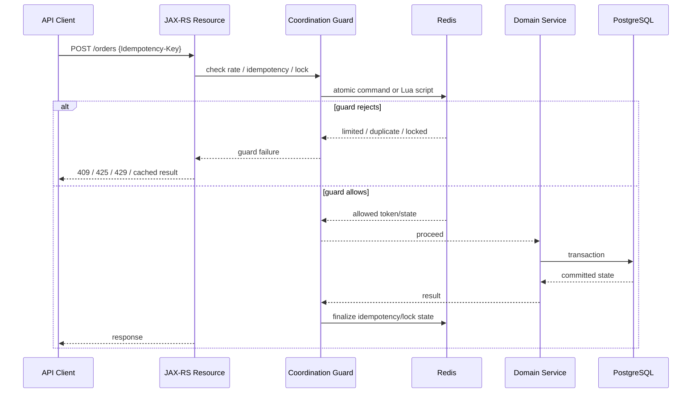
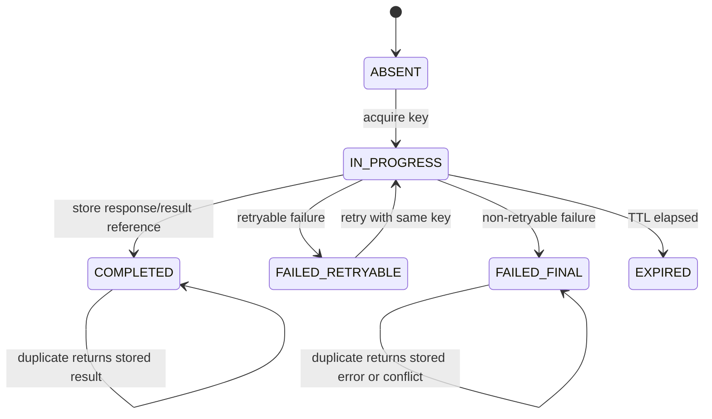
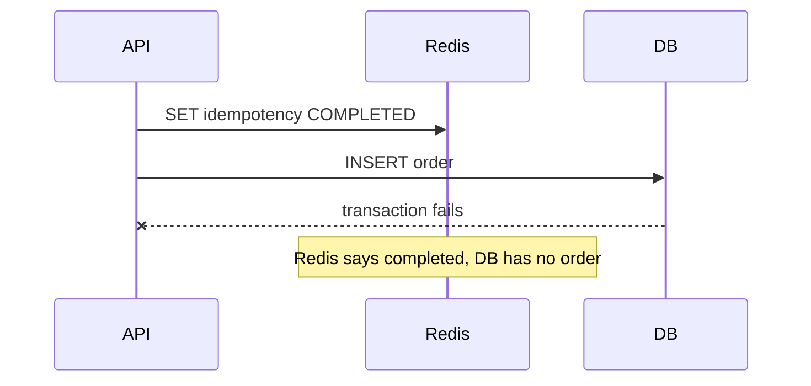
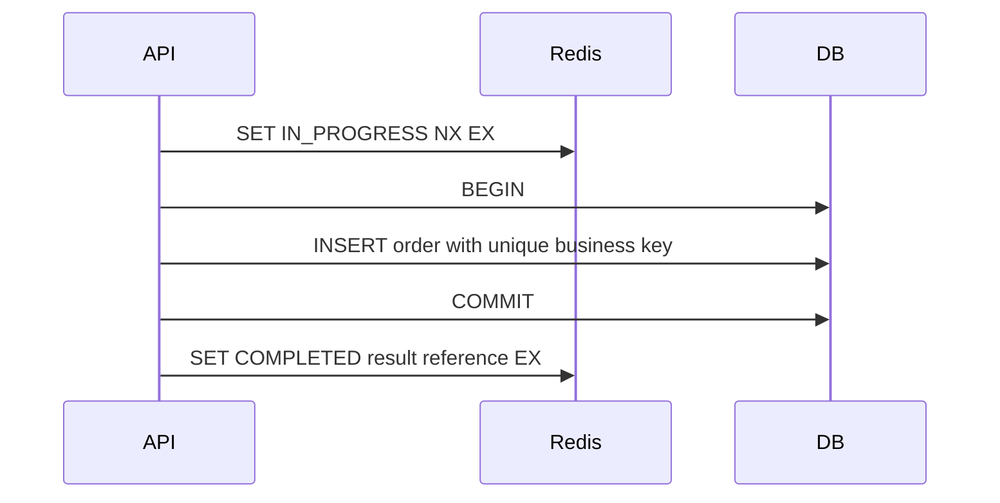
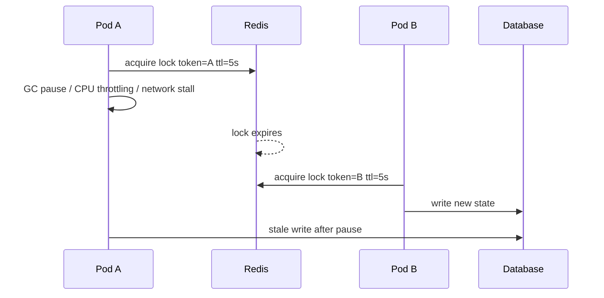

# Part 091 — Redis Rate Limiter, Idempotency, Locking, and Coordination

> Fokus part ini: memahami Redis sebagai backend untuk rate limiter, idempotency store, distributed lock, coordination guard, dan integrity guard. Part ini tidak menganggap Redis selalu tepat. Redis adalah dependency jaringan dengan expiry, replication lag, failover behavior, memory pressure, dan failure mode yang harus didesain eksplisit.

Catatan penting:

```text
This part does not assume CSG uses Redis, Redisson, Lettuce, Jedis, Redis Cluster,
Redis Sentinel, AWS ElastiCache, Azure Cache for Redis, or any specific internal
coordination library.

Treat all Redis topology, library, lock/rate-limit implementation, and platform
standard as internal verification items.
```

Part sebelumnya membahas Redis sebagai cache. Part ini membahas Redis sebagai **coordination substrate**.

Cache answers this question:

```text
Can we read this faster with bounded staleness?
```

Coordination answers harder questions:

```text
Can we prevent too many operations?
Can we deduplicate unsafe retries?
Can we serialize work on a shared resource?
Can we protect an invariant across multiple service instances?
```

That means correctness risk is higher.

A bad cache may cause stale read.

A bad lock or idempotency design may cause duplicate order submission, double charge, incorrect pricing application, missed workflow transition, or cross-tenant interference.

---

## 1. Redis as Coordination: Mental Model

Redis coordination patterns usually rely on a small set of properties:

```text
atomic single-key commands
expiration / TTL
conditional write
increment counters
Lua scripts for atomic multi-step logic
sorted sets for time windows
strings/hashes for request state
```

But Redis is not a relational transaction manager.

It does not automatically know:

```text
whether your database transaction committed
whether your downstream API succeeded
whether your JVM paused
whether your pod was OOMKilled
whether another consumer already processed the same business command
whether a lock holder is still semantically valid
```

Therefore every coordination pattern must define:

```text
what key represents
who owns it
how long it lives
what happens after expiry
what happens after retry
what happens after failover
what happens when Redis is unavailable
what system remains source of truth
```

---

## 2. Coordination Boundary in a JAX-RS Service

A typical JAX-RS request may interact with Redis before touching domain logic:



The important boundary is this:

```text
Redis can coordinate request admission.
Redis should not become the only proof of business correctness.
```

For critical business invariants, database constraints, unique keys, transactional outbox, saga state, and reconciliation jobs are usually still required.

---

## 3. Rate Limiting: What Problem Are You Solving?

Rate limiting is not one thing.

Different rate limiters protect different resources:

| Limiter Type | Protects | Typical Key | Failure If Wrong |
|---|---|---|---|
| Per-client limiter | API fairness | `client:{id}` | one client consumes capacity |
| Per-user limiter | user abuse control | `user:{id}` | user floods system |
| Per-tenant limiter | tenant isolation | `tenant:{id}` | noisy tenant affects others |
| Per-endpoint limiter | expensive operation | `endpoint:{name}` | hotspot endpoint overload |
| Global limiter | platform safety | `global` | whole service overload |
| Downstream limiter | external dependency | `downstream:{name}` | dependency throttling/cost spike |

In enterprise systems, tenant-aware limits are often more important than global limits.

A global limiter can accidentally punish healthy tenants because one tenant is noisy.

---

## 4. Fixed Window Rate Limiter

Fixed window is simple:

```text
key = rate:{tenant}:{operation}:{windowStart}
INCR key
EXPIRE key windowSize
reject if count > limit
```

Example:

```text
rate:tenant-a:create-order:2026-07-10T10:15Z -> 51
```

Advantages:

```text
simple
fast
cheap
readable keys
good enough for coarse protection
```

Weaknesses:

```text
burst at window boundary
counter expiry race if INCR succeeds and EXPIRE fails without atomic script
not ideal for strict fairness
```

Safer implementation uses Lua so increment and expiry are atomic:

```lua
local current = redis.call('INCR', KEYS[1])
if current == 1 then
  redis.call('PEXPIRE', KEYS[1], ARGV[1])
end
return current
```

Java service logic should not spread Redis command details across resources. Keep it behind a small policy abstraction:

```java
public interface RateLimiter {
    RateLimitDecision check(RateLimitRequest request);
}

public record RateLimitRequest(
    String tenantId,
    String principalId,
    String operation,
    int limit,
    Duration window
) {}

public sealed interface RateLimitDecision {
    record Allowed(long remaining) implements RateLimitDecision {}
    record Rejected(Duration retryAfter) implements RateLimitDecision {}
    record Unknown(String reason) implements RateLimitDecision {}
}
```

Resource method usage:

```java
@POST
@Path("/orders")
public Response createOrder(
    @HeaderParam("Idempotency-Key") String idempotencyKey,
    CreateOrderRequest request
) {
    var decision = rateLimiter.check(new RateLimitRequest(
        tenantContext.requiredTenantId(),
        securityContext.requiredPrincipalId(),
        "create-order",
        100,
        Duration.ofMinutes(1)
    ));

    if (decision instanceof RateLimitDecision.Rejected rejected) {
        return Response.status(429)
            .header("Retry-After", rejected.retryAfter().toSeconds())
            .build();
    }

    return orderResourceDelegate.createOrder(idempotencyKey, request);
}
```

---

## 5. Sliding Window and Token Bucket

Fixed windows are not enough when traffic fairness matters.

### Sliding window log

Model:

```text
Use sorted set.
Score = request timestamp.
Remove entries older than window.
Count remaining entries.
Allow if count < limit.
Add current request.
```

Conceptual Redis commands:

```text
ZREMRANGEBYSCORE key 0 now-window
ZCARD key
ZADD key now requestId
PEXPIRE key window
```

Use Lua for atomicity.

Pros:

```text
fairer than fixed window
supports precise rolling window
```

Cons:

```text
more memory
more CPU
requires cleanup
high-cardinality keys can be expensive
```

### Token bucket

Model:

```text
bucket has capacity
tokens refill at rate
request consumes tokens
reject if not enough tokens
```

Pros:

```text
smooths traffic
allows controlled burst
useful for downstream protection
```

Cons:

```text
more complex state
clock consistency matters
needs careful numeric precision
```

---

## 6. Rate Limiter Failure Modes

| Failure Mode | Cause | Effect | Detection | Mitigation |
|---|---|---|---|---|
| Boundary burst | fixed window | overload at minute boundary | traffic histogram | sliding window/token bucket |
| Counter never expires | missing EXPIRE | memory leak, false rejects | key scan/sample | atomic script |
| Too many keys | tenant/user/path cardinality | Redis memory pressure | keyspace metrics | key design, cap dimensions |
| Fail-open overload | Redis unavailable | protected resource overloaded | Redis error + dependency saturation | fallback policy by endpoint |
| Fail-closed outage | Redis unavailable | valid traffic rejected | 429/503 spike | endpoint-specific fallback |
| Retry storm | clients retry 429 aggressively | amplification | retry-after ignored | clear contract, client policy |
| Cross-tenant limiting | missing tenant in key | noisy tenant harms others | per-tenant metrics | tenant-aware keys |

Fail-open vs fail-closed must not be accidental.

For low-risk read endpoints:

```text
Redis unavailable -> allow request, emit metric, protect downstream separately
```

For high-risk mutation endpoint:

```text
Redis unavailable -> reject with 503 or route to safer degraded mode
```

---

## 7. Idempotency: What It Is and Is Not

Idempotency protects unsafe operations from duplicate execution.

It is not only an HTTP concept. It is a business correctness boundary.

A client may duplicate a request because:

```text
network timeout
client retry
gateway retry
load balancer retry
browser resubmission
mobile unstable network
message replay
operator retry
```

Without idempotency:

```text
POST /orders
```

may create two orders when the client only intended one.

With idempotency:

```text
POST /orders
Idempotency-Key: abc-123
```

means:

```text
The same key with the same semantic request should return the same outcome or a clear conflict.
```

---

## 8. Idempotency Store State Machine

A robust idempotency store is not a boolean flag.

It is a small state machine:



Minimal stored data:

```json
{
  "state": "IN_PROGRESS",
  "requestHash": "sha256:...",
  "tenantId": "tenant-a",
  "principalId": "user-123",
  "operation": "create-order",
  "startedAt": "2026-07-10T10:15:30Z",
  "expiresAt": "2026-07-11T10:15:30Z"
}
```

Completed state may store:

```json
{
  "state": "COMPLETED",
  "requestHash": "sha256:...",
  "resourceType": "order",
  "resourceId": "ord-123",
  "httpStatus": 201,
  "responseReference": "order:ord-123",
  "completedAt": "2026-07-10T10:15:33Z"
}
```

Do not store large response bodies in Redis unless the size, TTL, privacy, encryption, and eviction behavior are explicitly accepted.

---

## 9. Idempotency Key Design

Key shape:

```text
idempotency:{tenantId}:{operation}:{idempotencyKey}
```

The key must include tenant/operation boundary.

Bad:

```text
idempotency:{idempotencyKey}
```

Why bad?

```text
Same idempotency key from two tenants can collide.
Same key reused for different operations can collide.
Debugging ownership becomes hard.
```

Better:

```text
idempotency:tenant-a:create-order:abc-123
idempotency:tenant-a:submit-quote:def-456
```

The request hash is essential.

Same idempotency key + different payload should not silently return an old result.

```java
public record IdempotencyIdentity(
    String tenantId,
    String operation,
    String idempotencyKey,
    String requestHash
) {}
```

Request hash must be based on canonical representation, not raw JSON string if field ordering may vary.

---

## 10. Idempotency and Database Transactions

Redis idempotency is dangerous if it claims success before durable state exists.

Bad sequence:



Better sequence:



But even this has a gap:

```text
DB commit succeeds.
JVM dies before Redis COMPLETED update.
Duplicate request sees IN_PROGRESS until TTL.
```

Therefore critical operations should combine:

```text
Redis idempotency for fast duplicate admission control
Database unique constraint for durable correctness
Reconciliation job for inconsistent idempotency state
```

For high-value operations, DB-backed idempotency may be more appropriate than Redis-only idempotency.

---

## 11. Idempotency Response Strategy

When duplicate request arrives:

| Stored State | Same Request Hash | Different Request Hash |
|---|---|---|
| IN_PROGRESS | 409/425 or wait/poll | 409 conflict |
| COMPLETED | return stored result/reference | 409 conflict |
| FAILED_RETRYABLE | allow retry or return retryable error | 409 conflict |
| FAILED_FINAL | return same final error | 409 conflict |
| EXPIRED/ABSENT | treat as new, with business guard | treat as new, with business guard |

HTTP response choices:

```text
201 Created    first successful creation
200 OK         duplicate returns existing representation
202 Accepted   async operation accepted
409 Conflict   same key but incompatible request or active operation conflict
425 Too Early  operation still in progress, if used by convention
429 Too Many Requests rate limit exceeded
503 Service Unavailable idempotency guard unavailable and fail-closed
```

Do not blindly return 200 for all duplicates. It hides semantic conflicts.

---

## 12. Distributed Locking: First Principles

A lock is a lease, not a magic mutex.

Redis lock usually uses conditional set with expiry:

```text
SET lock:{resource} {randomOwnerToken} NX PX {ttlMillis}
```

The important properties:

```text
NX ensures only one owner can acquire when absent.
PX ensures the lock eventually expires.
Random owner token prevents deleting someone else's lock.
TTL bounds how long stale lock can block progress.
```

Unlock should verify ownership atomically:

```lua
if redis.call("GET", KEYS[1]) == ARGV[1] then
  return redis.call("DEL", KEYS[1])
else
  return 0
end
```

Never do this:

```text
GET lock
if value == mine:
  DEL lock
```

That is not atomic.

---

## 13. Locking for Efficiency vs Correctness

This distinction matters.

### Efficiency lock

Used to avoid duplicate work.

Example:

```text
Only one pod should refresh catalog cache for tenant A.
```

If the lock fails, duplicate work is annoying but not corrupting.

Redis locks are often acceptable here.

### Correctness lock

Used to protect an invariant.

Example:

```text
Only one operation may transition order state from SUBMITTED to ACTIVATED.
```

If the lock fails, business state may corrupt.

For correctness locks, Redis-only locking is usually not enough. Prefer:

```text
PostgreSQL row lock / optimistic concurrency / unique constraint
state transition condition in SQL
fencing token checked by the resource owner
idempotency table
saga state table
```

Redis may still help with admission control, but the durable system must reject stale owners.

---

## 14. Fencing Tokens

A lock with TTL can expire while the original holder is still running.

Example:



Fencing token solves this by making each lock acquisition produce a monotonically increasing number:

```text
lock acquisition A -> fencing token 101
lock acquisition B -> fencing token 102
```

The protected resource accepts only the highest valid token.

Database table example:

```sql
UPDATE order_work_item
SET status = 'PROCESSING', fencing_token = :token
WHERE id = :id
  AND :token > fencing_token;
```

Without fencing, a stale lock holder can still perform writes after lease expiry.

Redis can generate monotonically increasing tokens with `INCR`, but the protected resource must enforce the token.

```text
Fencing token generated but not checked is only decoration.
```

---

## 15. Redis Lock Failure Modes

| Failure Mode | Why It Happens | Consequence | Mitigation |
|---|---|---|---|
| Stale owner | JVM pause, CPU throttling, network delay | old worker writes after expiry | fencing token, DB conditional update |
| Lock lost during work | TTL too short | duplicate processing | heartbeat/extend carefully, idempotent work |
| Lock never released | pod killed | progress blocked until TTL | expiry, short TTL, recovery metrics |
| Unlock deletes other lock | no owner token check | concurrent workers | Lua unlock with owner token |
| Split-brain perception | failover/replication timing | multiple owners | durable guard, fencing, platform understanding |
| Hot lock key | high contention | Redis CPU spike, latency | shard work, queue, DB state machine |
| Lock used for correctness only | weak invariant protection | data corruption | DB constraints/state transitions |

---

## 16. Lock TTL and Extension

TTL must be chosen from evidence:

```text
p99 work duration
max JVM pause expected
network latency
Redis failover behavior
Kubernetes termination behavior
downstream timeout
operator recovery expectation
```

If TTL is too short:

```text
duplicate processing increases
stale owner risk increases
```

If TTL is too long:

```text
failed worker blocks progress longer
recovery is slow
```

Lock extension is also risky.

Only the current owner should extend:

```lua
if redis.call("GET", KEYS[1]) == ARGV[1] then
  return redis.call("PEXPIRE", KEYS[1], ARGV[2])
else
  return 0
end
```

But extension does not remove the need for idempotent work and durable state validation.

---

## 17. Coordination and Tenant Isolation

Every coordination key must be tenant-aware unless the operation is intentionally global.

Bad:

```text
lock:catalog-refresh
rate:create-order
idempotency:create-order:abc
```

Better:

```text
lock:tenant:{tenantId}:catalog-refresh
rate:tenant:{tenantId}:operation:create-order
idempotency:tenant:{tenantId}:operation:create-order:{key}
```

For enterprise CPQ/order-style systems, tenant-specific product catalog, pricing rules, and configuration are often safety boundaries.

A cross-tenant coordination key can cause:

```text
tenant A blocking tenant B
wrong cached catalog refresh
wrong idempotency collision
misleading rate-limit rejection
audit ambiguity
```

---

## 18. Coordination Abstraction in Java

Avoid scattering Redis commands across resource/service methods.

Bad:

```java
public OrderResponse createOrder(CreateOrderRequest request) {
    redis.set("lock:" + request.orderId(), "1");
    // domain logic here
}
```

Better:

```java
public interface CoordinationGuard {
    <T> T executeWithIdempotency(
        IdempotencyIdentity identity,
        Supplier<T> operation
    );

    <T> Optional<T> executeWithLock(
        LockRequest request,
        Supplier<T> operation
    );

    RateLimitDecision checkRateLimit(RateLimitRequest request);
}
```

This gives you one place to enforce:

```text
key naming
TTL policy
tenant boundary
metrics
logs
tracing
fallback behavior
error mapping
internal platform standard
```

---

## 19. Observability for Redis Coordination

Minimum metrics:

```text
redis_coordination_latency_ms{operation,type}
redis_coordination_errors_total{operation,type,error}
rate_limit_allowed_total{tenant,operation}
rate_limit_rejected_total{tenant,operation}
idempotency_acquired_total{operation}
idempotency_duplicate_total{operation,state}
idempotency_conflict_total{operation}
lock_acquired_total{operation}
lock_rejected_total{operation}
lock_stale_owner_detected_total{operation}
lock_release_failed_total{operation}
```

Avoid high-cardinality labels:

```text
Do not label metrics with raw orderId, quoteId, userId, idempotencyKey, or Redis key.
```

Use structured logs for individual incidents:

```json
{
  "event": "redis_lock_rejected",
  "tenantId": "tenant-a",
  "operation": "refresh-catalog",
  "lockName": "catalog-refresh",
  "ttlMs": 30000,
  "correlationId": "...",
  "traceId": "..."
}
```

---

## 20. Debugging Playbook

### Symptom: sudden 429 spike

Check:

```text
per-tenant traffic
rate limiter key cardinality
limit config drift
gateway retry behavior
Redis latency/errors
recent deployment/feature flag
```

### Symptom: duplicate orders or duplicate workflow actions

Check:

```text
idempotency key required?
request hash conflict handling?
DB unique constraints?
client/gateway retry?
idempotency TTL too short?
Redis key evicted?
reconciliation job findings?
```

### Symptom: stuck operation

Check:

```text
lock key TTL
current owner token
pod lifecycle of owner
worker logs
DB state transition
whether lock protects correctness or just efficiency
```

### Symptom: stale lock owner writes after new owner

Check:

```text
GC pause
CPU throttling
network timeout
lock TTL
fencing token enforcement
DB conditional update
```

---

## 21. PR Review Checklist

For Redis rate limiter:

```text
Is the limit protecting the correct resource?
Is the key tenant-aware where needed?
Is the algorithm appropriate: fixed window, sliding window, token bucket?
Is increment + expiry atomic?
Is fail-open/fail-closed explicit?
Are Retry-After and client behavior defined?
Are metrics low-cardinality and useful?
```

For Redis idempotency:

```text
Is Idempotency-Key required for unsafe retryable operations?
Is request hash stored and compared?
Is tenant/operation included in key?
Is state machine explicit?
Is DB durable constraint also present for critical operations?
Is Redis eviction/expiry safe?
Is duplicate response behavior defined?
```

For Redis lock:

```text
Is the lock for efficiency or correctness?
Is owner token random and checked on release?
Is TTL justified by p99 work duration?
Is stale owner risk handled?
Is fencing token required and enforced?
Is the protected resource still durable and conditional?
Is lock contention observable?
```

For coordination abstraction:

```text
Are Redis commands centralized behind a small abstraction?
Are internal platform standards followed?
Are errors mapped to stable API errors?
Are traces/logs/metrics emitted?
Are tenant and security boundaries preserved?
```

---

## 22. Internal Verification Checklist

Verify in the CSG/internal codebase and platform docs:

```text
Does the service use Redis at all?
Which Redis client is used: Lettuce, Jedis, Redisson, Spring Data Redis, custom wrapper?
Is Redis standalone, Sentinel, Cluster, managed cloud, or internal platform service?
Is Redis used for cache only, or also rate limiting, idempotency, lock, coordination, queue, stream?
Is there a platform-approved distributed lock library?
Is Redisson or equivalent used internally?
Is Redlock used? If yes, for which risk category?
Are fencing tokens implemented anywhere?
Are lock TTLs standardized?
Are lock keys tenant-aware?
Is there a central key naming convention?
Are idempotency keys required for unsafe POST endpoints?
Is idempotency state stored in Redis, DB, or both?
Are DB unique constraints used as durable backup?
Are rate limits enforced at API gateway, service, Redis, or all of them?
Is fail-open/fail-closed behavior documented per endpoint?
Are Redis operations traced and metered?
Are Redis keys protected from PII leakage?
What is the Redis eviction policy?
What happens during Redis failover?
What is the runbook for Redis latency/outage?
```

---

## 23. Senior Engineer Heuristics

Use Redis for coordination when:

```text
duplicate work is acceptable or recoverable
TTL-bounded behavior is acceptable
state can be reconstructed
failure can degrade safely
there is durable validation elsewhere
```

Be very careful when:

```text
Redis lock is the only correctness guard
business operation is irreversible
money, tax, contract, order state, or entitlement is affected
multi-tenant isolation depends only on Redis key design
Redis outage causes either overload or total unavailability
```

Prefer durable database constraints when:

```text
exactly-once business effect is required
state transition must be serialized
there is a unique business identity
lost update is unacceptable
reconciliation must be auditable
```

---

## 24. Key Takeaways

```text
Redis coordination is powerful but easy to over-trust.
Rate limiting protects capacity, but key design controls fairness.
Idempotency requires a state machine, not just SETNX.
Distributed locks are leases, not perfect mutexes.
Fencing tokens matter when stale owners can still write.
Redis-only correctness is usually a smell for critical enterprise workflows.
Tenant-aware key design is mandatory in multi-tenant systems.
Fail-open/fail-closed behavior must be explicit and reviewed.
```

---

## References

- Redis distributed lock pattern: https://redis.io/docs/latest/develop/clients/patterns/distributed-locks/
- Redis `SET`/`NX`/expiry command family: https://redis.io/docs/latest/commands/set/
- Redis rate limiting patterns: https://redis.io/redis-best-practices/basic-rate-limiting/
