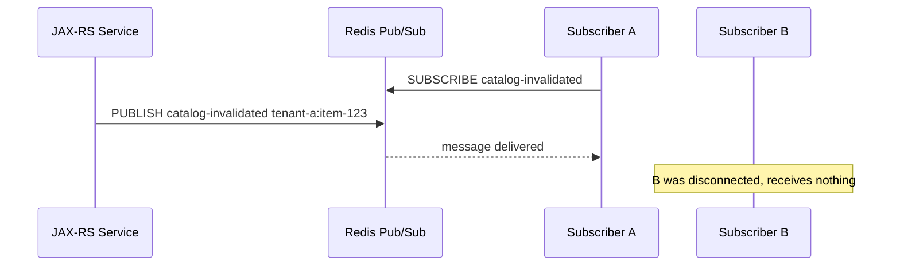
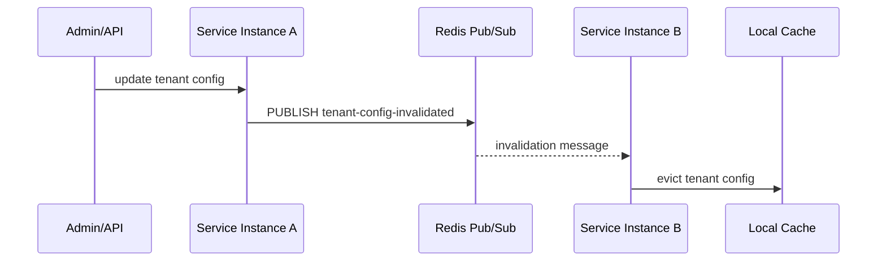
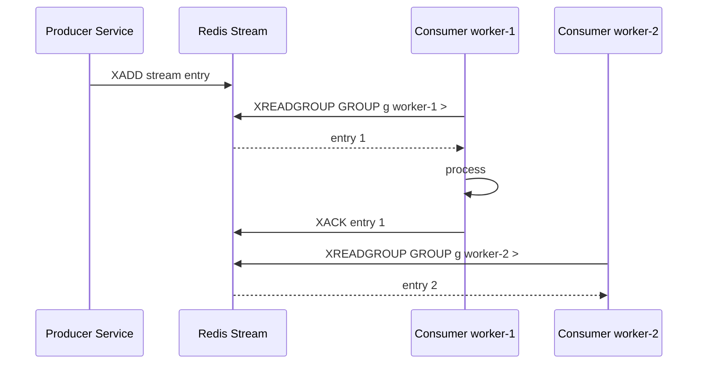
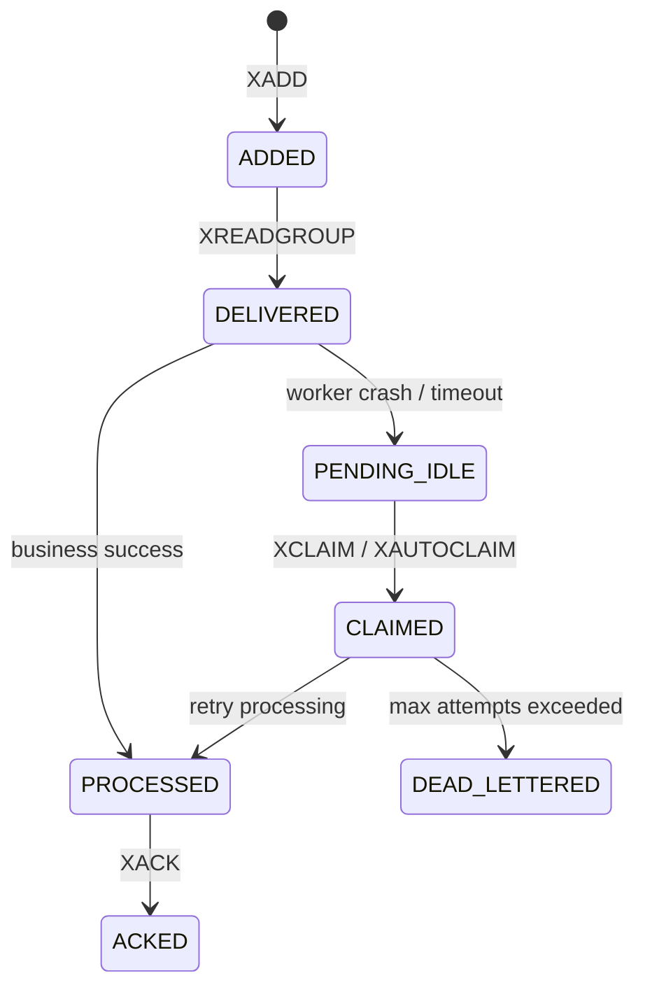

# Part 092 — Redis Notification, Job Queue, Streams, and Failure Modes

> Fokus part ini: memahami Redis untuk distributed notification, lightweight job queue, Redis Streams, delayed/retry-like processing, dan failure modes. Targetnya bukan menghafal command, tetapi mampu memilih Redis vs Kafka/RabbitMQ/DB queue secara sadar dan mampu mereview desain job/stream agar tidak kehilangan data, tidak memproses duplicate secara berbahaya, dan tetap observable.

Catatan penting:

```text
This part does not assume CSG uses Redis Pub/Sub, Redis Streams, Redisson queues,
BullMQ-like queues, custom job queues, Redis Cluster, Redis Sentinel, AWS ElastiCache,
Azure Cache for Redis, Kafka, or RabbitMQ for a specific internal workflow.

Treat all queue/notification/stream usage as internal verification items.
```

Redis can be used for:

```text
best-effort notification
cache invalidation signal
small internal work queue
stream-like event buffer
consumer group based processing
retry coordination
job deduplication
```

But Redis is not automatically a durable message broker.

The engineering question is:

```text
What failure are we allowed to survive?
```

---

## 1. Notification vs Queue vs Stream

These are different patterns.

| Pattern | Main Purpose | Delivery Expectation | Redis Feature | Good For | Dangerous For |
|---|---|---|---|---|---|
| Pub/Sub | live notification | online subscribers only | `PUBLISH`/`SUBSCRIBE` | cache invalidation, live hint | durable business event |
| List queue | simple queue | remove on pop depending pattern | `LPUSH`/`RPOP`, `BLPOP` | lightweight internal jobs | complex retry/replay |
| Stream | append-only log-ish data type | consumers track progress | `XADD`, `XREADGROUP`, `XACK` | small/medium stream processing | long-term event backbone without governance |
| Sorted set schedule | time-based dispatch | poll due items | `ZADD`, `ZRANGEBYSCORE` | delayed jobs, retry schedule | high-scale scheduler without controls |

Do not call all of them “queue”.

A queue usually distributes work.

A stream usually records ordered entries and lets consumers track offsets/progress.

Pub/Sub only notifies currently connected subscribers.

---

## 2. Redis Pub/Sub Mental Model

Redis Pub/Sub is ephemeral.



Pub/Sub is suitable when losing a notification is acceptable because the receiver can recover by polling, TTL expiry, or source-of-truth read.

Good examples:

```text
cache invalidation hint
local in-memory cache clear signal
best-effort UI refresh hint
non-critical internal notification
```

Bad examples:

```text
order submitted event
payment completed event
contract activated event
billing instruction
irreversible workflow transition
```

If the event must be durable, observable, replayable, or auditable, use Kafka/RabbitMQ/DB outbox/Redis Streams with clear constraints — not raw Pub/Sub.

---

## 3. Cache Invalidation via Pub/Sub

Common pattern:



This is acceptable only if:

```text
local cache has TTL
source of truth remains durable
missing an invalidation causes bounded staleness only
service can resync on startup
there is a manual/automatic cache clear path
```

Do not rely on Pub/Sub as the only invalidation mechanism for high-risk pricing or entitlement correctness unless bounded staleness is explicitly accepted.

---

## 4. Redis List as Job Queue

Simple queue:

```text
LPUSH jobs payload
BRPOP jobs timeout
```

Problem:

```text
worker pops item
worker crashes before processing completes
job is lost
```

Safer queue pattern uses processing list:

```text
BRPOPLPUSH queue processing timeout
process job
LREM processing job
```

But then you need a reaper:

```text
find stale jobs in processing
move back to queue
avoid duplicate requeue
track attempts
send to dead letter after max attempts
```

At that point, you are building a message broker.

That may be fine for small internal jobs. It is dangerous for core business events unless owned operationally.

---

## 5. Redis Streams Mental Model

Redis Streams are append-only entries with IDs.

Producer:

```text
XADD order-events * tenantId tenant-a orderId ord-123 type ORDER_SUBMITTED
```

Consumer group:

```text
XGROUP CREATE order-events order-indexer $
XREADGROUP GROUP order-indexer worker-1 COUNT 10 BLOCK 5000 STREAMS order-events >
XACK order-events order-indexer 1752151234567-0
```

Conceptual flow:



Consumer groups let multiple consumers share work while Redis tracks pending entries.

But delivery is still not “exactly once”. Your consumer must be idempotent.

---

## 6. Pending Entries List

When a consumer reads from a stream group, Redis tracks entries that have been delivered but not acknowledged.

```text
XREADGROUP -> entry becomes pending
XACK       -> entry removed from pending entries list
```

If a worker crashes after reading but before `XACK`, the entry remains pending.

Operational commands/concepts:

```text
XPENDING    inspect pending entries
XCLAIM      claim pending entries from another consumer
XAUTOCLAIM  scan and claim idle pending entries
XACK        acknowledge processed entries
```

This is the core of recovery.

If nobody monitors pending entries, jobs can silently stall.

---

## 7. Redis Streams Processing State Machine



Important point:

```text
ACK must happen after durable side effect succeeds.
```

Bad:

```text
XACK first
write DB later
pod dies
message is lost from processing perspective
```

Better:

```text
read entry
perform idempotent DB update
commit
XACK
```

Still possible:

```text
DB commit succeeds
pod dies before XACK
message is retried
```

Therefore DB operation must be idempotent.

---

## 8. Idempotent Consumer Design

Redis Streams, Kafka, RabbitMQ, and job queues all require idempotent consumers.

A consumer should tolerate:

```text
same job delivered twice
same job claimed by another worker after timeout
ACK lost after successful side effect
producer retry causing duplicate logical event
operator replay
```

Common idempotency guard:

```sql
CREATE TABLE processed_job (
    tenant_id text NOT NULL,
    job_id text NOT NULL,
    processed_at timestamptz NOT NULL DEFAULT now(),
    result_ref text,
    PRIMARY KEY (tenant_id, job_id)
);
```

Consumer pattern:

```java
public void process(StreamEntry entry) {
    var tenantId = entry.required("tenantId");
    var jobId = entry.required("jobId");

    transactionTemplate.execute(() -> {
        if (processedJobRepository.exists(tenantId, jobId)) {
            return null;
        }

        domainHandler.apply(entry);
        processedJobRepository.markProcessed(tenantId, jobId);
        return null;
    });

    redisStream.ack(entry);
}
```

If `ack` fails after commit, the duplicate later sees `processed_job` and exits safely.

---

## 9. Redis Streams vs Kafka

| Dimension | Redis Streams | Kafka |
|---|---|---|
| Primary model | Redis data type stream | distributed commit log |
| Retention | key/data-structure based trimming | topic retention/compaction policies |
| Scale model | Redis memory/cluster constraints | broker partition model |
| Consumer group | supported | supported |
| Replay | possible if entries retained | core feature |
| Ecosystem governance | lighter | stronger around schema/stream governance |
| Long-term event backbone | risky unless heavily governed | common use case |
| Operational complexity | can be simpler at small scale | higher but purpose-built |

Redis Streams can be useful for local/internal service queues, short-lived streams, and small operational workflows.

Kafka is usually better when you need:

```text
enterprise event backbone
long retention
large replay
schema governance
multiple independent consumers
cross-domain event catalog
high throughput partitioning
```

---

## 10. Redis Queue vs RabbitMQ

RabbitMQ is a broker designed for queue semantics, routing, acknowledgements, dead lettering, and backpressure.

Redis can implement queue-like behavior, but the application often owns more mechanics.

Use Redis queue when:

```text
job is internal to one bounded context
loss/duplicate can be recovered
scale is modest
operations team accepts Redis as job substrate
implementation is centralized and tested
```

Prefer RabbitMQ or Kafka when:

```text
delivery semantics are critical
routing topology matters
DLQ/retry policy must be standardized
many teams depend on the stream/queue
replay/audit is required
```

---

## 11. Delayed Jobs with Sorted Sets

A common Redis delayed job pattern uses sorted sets:

```text
ZADD delayed-jobs runAtEpochMillis jobId
```

Scheduler loop:

```text
ZRANGEBYSCORE delayed-jobs 0 now LIMIT 0 100
for each job:
  remove atomically
  enqueue to ready queue/stream
```

Atomic move should use Lua:

```lua
local jobs = redis.call('ZRANGEBYSCORE', KEYS[1], '-inf', ARGV[1], 'LIMIT', 0, ARGV[2])
for i, job in ipairs(jobs) do
  if redis.call('ZREM', KEYS[1], job) == 1 then
    redis.call('XADD', KEYS[2], '*', 'jobId', job)
  end
end
return jobs
```

Failure modes:

```text
scheduler duplicate due to multiple pollers
job removed but not enqueued if operation is not atomic
clock skew
huge delayed set scan
no visibility for stuck jobs
```

---

## 12. Retry and Dead Letter Strategy

A retryable job needs state:

```json
{
  "jobId": "job-123",
  "tenantId": "tenant-a",
  "type": "reprice-order",
  "attempt": 3,
  "maxAttempts": 5,
  "nextRunAt": "2026-07-10T10:20:30Z",
  "lastErrorCode": "DOWNSTREAM_TIMEOUT"
}
```

Retry should distinguish:

```text
transient technical failure -> retry with backoff
business validation failure -> no retry, final failure
dependency rejected due to rate limit -> retry after specific time
poison payload -> DLQ/manual remediation
```

Backoff policies:

```text
fixed backoff
exponential backoff
jittered exponential backoff
server-provided retry-after
```

DLQ must be observable and owned.

A dead letter queue nobody checks is just a slower data-loss mechanism.

---

## 13. Job Locking

Scheduled/batch jobs often need a lock to prevent concurrent execution.

Example:

```text
Only one reconciliation job per tenant should run at once.
```

Redis lock can be acceptable if:

```text
job is idempotent
stale lock is bounded by TTL
fencing or DB conditional state protects writes
job progress is stored durably
operator can recover failed job
```

For long-running jobs, avoid relying on one giant lock.

Prefer chunked progress:

```text
claim batch of work
persist checkpoint
process idempotently
release/expire claim
repeat
```

---

## 14. Redis Stream Trimming and Retention

Streams grow unless trimmed.

Trimming options include approximate/max length strategies such as:

```text
XTRIM stream MAXLEN ~ 100000
XADD stream MAXLEN ~ 100000 * field value
```

The retention policy must match recovery needs.

If you trim too aggressively:

```text
slow consumers lose data
pending entries may become unrecoverable
replay window disappears
incident investigation loses evidence
```

If you trim too slowly:

```text
Redis memory pressure
eviction risk
increased latency
platform cost
```

For business events, retention must be governed, not guessed.

---

## 15. Redis Persistence and Managed Platform Behavior

Redis may be configured with:

```text
no persistence
RDB snapshots
AOF
managed cloud persistence/replication
cluster failover
```

The application must know what is guaranteed.

Do not assume Redis stream/job data survives:

```text
node crash
primary failover
cluster resharding
memory eviction
operator flush
restore from stale snapshot
```

For critical workflows, Redis should not be the only durable record.

Use:

```text
PostgreSQL job table
outbox/inbox table
saga state table
Kafka event log
reconciliation job
```

as the durable layer when required.

---

## 16. Failure Modes

| Failure Mode | Cause | Effect | Detection | Mitigation |
|---|---|---|---|---|
| Lost Pub/Sub message | subscriber disconnected | stale local cache | cache age metric | TTL + resync |
| Lost list job | pop before durable processing | missing work | gap/reconciliation | processing list/stream/DB job table |
| Duplicate stream processing | ACK lost after commit | duplicate side effect | idempotency metrics | processed job table |
| Pending entries stuck | worker crash | stalled jobs | `XPENDING`, idle age | claim/retry/reaper |
| Memory pressure | untrimmed streams/jobs | eviction/latency | Redis memory metrics | retention/trimming |
| Poison message | bad payload | retry loop | attempt count, DLQ | validation + DLQ |
| Hot stream | one key overloaded | high latency | command latency | sharding/partitioning |
| Cross-tenant queue mixing | missing tenant key/field | isolation failure | audit/log analysis | tenant-aware stream/key |
| Job invisibility | no metrics | silent backlog | backlog dashboard | queue depth and age metrics |

---

## 17. Observability for Redis Queues and Streams

Minimum metrics:

```text
redis_stream_entries_added_total{stream,type}
redis_stream_entries_processed_total{stream,consumer_group,type}
redis_stream_processing_errors_total{stream,type,error}
redis_stream_pending_entries{stream,consumer_group}
redis_stream_oldest_pending_age_seconds{stream,consumer_group}
redis_stream_backlog_entries{stream,consumer_group}
redis_job_attempts_total{job_type,status}
redis_job_deadletter_total{job_type,error}
redis_job_processing_duration_ms{job_type}
redis_pubsub_messages_published_total{channel}
redis_pubsub_delivery_gap_detected_total{channel}
```

Avoid labels:

```text
jobId
orderId
quoteId
raw Redis key
customerId
idempotencyKey
```

Use structured logs for individual job failures:

```json
{
  "event": "redis_stream_job_failed",
  "stream": "order-work",
  "consumerGroup": "order-worker",
  "tenantId": "tenant-a",
  "jobType": "reprice-order",
  "jobId": "job-123",
  "attempt": 4,
  "errorCode": "DOWNSTREAM_TIMEOUT",
  "correlationId": "...",
  "traceId": "..."
}
```

Job ID in logs is acceptable when access is controlled and it is not sensitive. Avoid it as a metric label.

---

## 18. Debugging Playbook

### Symptom: job backlog increasing

Check:

```text
producer rate vs consumer rate
consumer errors
oldest pending age
Redis CPU/latency
consumer pod restarts
downstream dependency saturation
recent deployment
```

### Symptom: pending entries never clear

Check:

```text
workers crash after XREADGROUP
ACK path not reached
DB transaction hangs
poison message retry loop
XCLAIM/XAUTOCLAIM reaper missing
consumer group names changed after deployment
```

### Symptom: duplicate side effects

Check:

```text
consumer idempotency table
ACK after commit sequence
job unique business key
retry policy
manual replay
consumer group reset
```

### Symptom: cache invalidation sometimes fails

Check:

```text
Pub/Sub subscriber reconnects
local cache TTL
startup resync
missed notification tolerance
tenant included in invalidation payload
```

### Symptom: Redis memory spike

Check:

```text
stream trimming
delayed job set size
dead letter growth
large payloads
key cardinality
Redis eviction policy
```

---

## 19. PR Review Checklist

For Pub/Sub:

```text
Is notification loss acceptable?
Is there TTL/resync fallback?
Is payload small and non-sensitive?
Is tenant boundary explicit?
Is reconnect behavior tested?
```

For Redis Streams:

```text
Is consumer idempotent?
Is ACK after durable side effect?
Is pending entry recovery implemented?
Is retention/trimming defined?
Is DLQ/retry policy defined?
Is stream key tenant-aware or tenant field validated?
Are backlog/pending metrics available?
```

For job queues:

```text
Is the job idempotent?
Is job state durable enough for business risk?
Is retry finite and classified?
Is poison message handled?
Is failed job recovery documented?
Is job locking safe against stale owner?
Is there a reconciliation path?
```

For architecture choice:

```text
Why Redis instead of Kafka/RabbitMQ/PostgreSQL job table?
What failure does Redis need to survive?
What happens during Redis failover?
What data can be lost?
What data must be replayable?
Who owns the runbook?
```

---

## 20. Internal Verification Checklist

Verify in internal codebase/platform docs:

```text
Is Redis used for Pub/Sub, Streams, lists, sorted-set scheduler, queues, or only cache?
Which Redis client/wrapper is used?
Is there an internal queue abstraction?
Is there a standard job framework?
Are Redis Streams consumer groups used?
Are XACK, XPENDING, XCLAIM/XAUTOCLAIM patterns implemented?
Is pending entry recovery scheduled?
Are Redis payloads schema/versioned?
Are payloads allowed to contain PII?
Is stream trimming configured?
What is Redis persistence/failover behavior?
Is Redis used for business-critical jobs?
If yes, what is the durable source of truth?
Are retries and DLQ standardized?
Is there a job dashboard?
Are job IDs correlated with audit logs?
Are jobs tenant-aware?
Is there a reconciliation job for missed/duplicate work?
Is operator replay supported?
How are failed jobs remediated?
```

---

## 21. When Not to Use Redis

Do not use Redis Pub/Sub when:

```text
message loss is unacceptable
audit trail is required
late consumers must receive old messages
business state transition depends on delivery
```

Do not use ad-hoc Redis list queue when:

```text
retry/DLQ/replay are required
many teams consume the data
schema evolution matters
operator tooling is required
```

Be cautious with Redis Streams when:

```text
event retention must be long
replay must be reliable across months
event catalog/governance is mandatory
large fan-out across domains is expected
Kafka already exists as enterprise event backbone
```

Use Redis when:

```text
latency matters
work is local/internal
loss/duplicate is recoverable
retention window is short and explicit
operator model is understood
```

---

## 22. Key Takeaways

```text
Redis Pub/Sub is best-effort notification, not durable eventing.
Redis lists can implement queues, but recovery mechanics become your responsibility.
Redis Streams add consumer groups and pending entries, but consumers still need idempotency.
ACK should happen after durable side effects, not before.
Pending entries must be monitored and reclaimed.
Trimming/retention is a production contract.
For critical workflows, Redis should complement durable state, not replace it.
Kafka/RabbitMQ/PostgreSQL job tables may be better depending on semantics.
```

---

## References

- Redis Streams documentation: https://redis.io/docs/latest/develop/data-types/streams/
- Redis `XREADGROUP`: https://redis.io/docs/latest/commands/xreadgroup/
- Redis `XPENDING`: https://redis.io/docs/latest/commands/xpending/
- Redis `XACK`: https://redis.io/docs/latest/commands/xack/
- Redis Pub/Sub documentation: https://redis.io/docs/latest/develop/pubsub/
