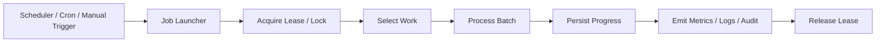
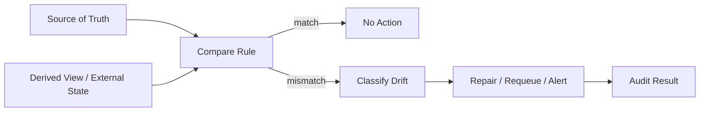

# Part 093 — Batch, Scheduler, CronJob, and Reconciliation Jobs

> Fokus part ini: memahami job processing sebagai bagian dari production backend system. Targetnya bukan sekadar tahu cara membuat scheduler, tetapi mampu mendesain job yang idempotent, recoverable, observable, tidak mengganggu request path, dan aman terhadap duplicate execution, partial failure, stuck lock, data drift, dan rollback/roll-forward scenario.

Catatan penting:

```text
This part does not assume CSG Quote & Order uses Kubernetes CronJob, Quartz,
Spring Scheduler, platform scheduler, DB scheduler, internal workflow engine,
Redis locking, PostgreSQL advisory lock, or a specific batch framework.

Treat all scheduler, locking, reconciliation, and batch execution details as
internal verification items.
```

A senior engineer should treat jobs as first-class production workloads.

They are not “background scripts”.

They mutate state, repair state, synchronize state, delete state, publish events, and often execute outside the normal HTTP request lifecycle.

That makes them dangerous when they are not designed with clear ownership and failure behavior.

---

## 1. Why Batch and Scheduled Jobs Exist

HTTP endpoints are good for request-response interactions.

But enterprise systems also need work that is not naturally driven by a user request.

Common examples:

```text
expire stale quotes
recalculate pricing snapshots
reconcile order status with downstream system
retry failed external delivery
cleanup temporary files
archive old audit records
publish delayed notifications
repair derived read models
refresh catalog cache
close abandoned checkout/order flows
```

A job exists when work needs to happen:

```text
at a scheduled time
periodically
as a delayed retry
in bulk
as a repair action
as a consistency check
outside a user request
```

The wrong mental model:

```text
"Just run a script every night."
```

The production mental model:

```text
A job is a distributed state transition mechanism with its own trigger,
lease, work selection, idempotency, progress tracking, observability,
retry, and recovery model.
```

---

## 2. Job Taxonomy

Different jobs need different controls.

| Job Type | Purpose | Typical Trigger | Main Risk |
|---|---|---|---|
| Scheduled job | periodic business operation | cron/time | duplicate execution, missed run |
| Retry job | retry failed work | schedule/backoff | retry storm, poison item |
| Cleanup job | remove temporary/expired data | periodic | deleting valid data |
| Archival job | move old data to cheaper storage | periodic/batch | retention/compliance violation |
| Reconciliation job | compare and repair inconsistent state | periodic/manual | incorrect repair |
| Backfill job | apply new derived field/state to old data | one-off/controlled | production overload |
| Migration job | transform data during release | release-controlled | incompatible deployment |
| Notification job | deliver pending notifications | queue/schedule | duplicate delivery |
| Read-model rebuild job | rebuild projection/search index/cache | manual/scheduled | stale/partial view |

A single “scheduler” abstraction should not hide these differences.

A retry job and a cleanup job have different blast radius.

A reconciliation job and a backfill job need different approval processes.

---

## 3. Scheduler Is Not the Job

Separate the trigger from the execution.



The scheduler answers:

```text
When should the job start?
```

The job answers:

```text
What work should be processed?
How much work should be processed?
How is progress tracked?
What happens if the job dies?
What happens if another copy starts?
What is safe to retry?
```

Do not put correctness inside the scheduler alone.

A scheduler can fire twice.

A pod can restart mid-run.

A CronJob can overlap if previous execution is slow.

A manual operator can trigger a job while a scheduled run is active.

Correctness belongs in the job execution model.

---

## 4. Kubernetes CronJob Mental Model

A Kubernetes CronJob creates Jobs based on a schedule.

A Kubernetes Job creates Pods that run to completion.

That means the runtime chain is:

```text
CronJob schedule
  -> Job object
    -> Pod
      -> container process
        -> Java main/job runner
          -> business job logic
```

Example skeleton:

```yaml
apiVersion: batch/v1
kind: CronJob
metadata:
  name: quote-expiration-reconciliation
spec:
  schedule: "*/15 * * * *"
  concurrencyPolicy: Forbid
  successfulJobsHistoryLimit: 3
  failedJobsHistoryLimit: 5
  jobTemplate:
    spec:
      backoffLimit: 1
      template:
        spec:
          restartPolicy: Never
          containers:
            - name: job
              image: example-registry/quote-service:1.2.3
              args:
                - "run-job"
                - "quote-expiration-reconciliation"
              envFrom:
                - configMapRef:
                    name: quote-service-config
                - secretRef:
                    name: quote-service-secret
```

Important fields:

| Field | Why It Matters |
|---|---|
| `schedule` | trigger cadence |
| `concurrencyPolicy` | overlap behavior |
| `backoffLimit` | Kubernetes-level retry count |
| `restartPolicy` | pod restart behavior |
| history limits | operational visibility vs object clutter |
| resource limits | avoid starving online services |

But Kubernetes settings are not enough.

Even with `concurrencyPolicy: Forbid`, you still need application-level idempotency because:

```text
cluster failover can produce edge cases
manual run can overlap
another environment can target same DB
job can partially commit then die
operator can retry a failed Job
```

---

## 5. In-Process Scheduler vs External Job Workload

Some systems run scheduled work inside the main service process.

Others run jobs as separate workloads.

| Model | Example | Advantages | Risks |
|---|---|---|---|
| In-process scheduler | timer inside API service | simple deployment | every replica may run job unless guarded |
| Dedicated job process | separate Java main | isolation, clear resources | more deployment artifacts |
| Kubernetes CronJob | scheduled pod | platform-native scheduling | cold start, missed schedule, overlap risk |
| Workflow engine | Camunda/Zeebe/etc. | long-running orchestration | engine complexity |
| External scheduler | enterprise scheduler | central control | dependency on platform integration |

For production enterprise systems, prefer explicit job workloads when the job:

```text
uses heavy CPU/DB resources
runs long
has a different scaling model
needs different permissions
must be triggered manually by operators
has high blast radius
```

In-process scheduling is acceptable only when:

```text
execution is guarded by a robust lease
work is lightweight
failure is observable
all replicas coordinate correctly
shutdown is graceful
```

---

## 6. Idempotent Job Design

A job is idempotent when re-running it does not corrupt state.

This does not mean “no side effect”.

It means the side effect is safely repeatable.

Example: quote expiration job.

Unsafe design:

```text
select quotes where expires_at < now
for each quote:
  set status = EXPIRED
  publish QuoteExpired event
```

Failure:

```text
DB update succeeds
process dies before event publish
rerun publishes duplicate or misses event depending implementation
```

Safer design:

```text
select eligible quotes where status = ACTIVE and expires_at < now
for each quote:
  transition ACTIVE -> EXPIRED conditionally
  insert outbox event with unique business key
  commit transaction
publisher later emits event from outbox
```

Pseudo-code:

```java
public final class QuoteExpirationJob {
    public JobResult run(JobContext context) {
        JobLease lease = leaseService.acquire("quote-expiration", Duration.ofMinutes(10));
        if (!lease.acquired()) {
            return JobResult.skipped("lease-not-acquired");
        }

        try {
            int processed = 0;

            while (processed < context.maxItems()) {
                List<QuoteId> batch = quoteRepository.findExpirableQuotes(context.batchSize());
                if (batch.isEmpty()) break;

                for (QuoteId quoteId : batch) {
                    quoteService.expireIfStillActive(quoteId, context.clock());
                    processed++;
                }
            }

            return JobResult.completed(processed);
        } finally {
            lease.release();
        }
    }
}
```

The critical method is not `expire`.

It is `expireIfStillActive`.

The condition protects the state transition.

---

## 7. Work Selection Pattern

A batch job should select work in bounded chunks.

Avoid:

```sql
SELECT * FROM quote WHERE status = 'ACTIVE' AND expires_at < now();
```

Better:

```sql
SELECT id
FROM quote
WHERE status = 'ACTIVE'
  AND expires_at < now()
ORDER BY expires_at, id
LIMIT :batch_size;
```

For concurrent workers, you may need locking semantics.

Example PostgreSQL pattern:

```sql
SELECT id
FROM pending_job_item
WHERE status = 'READY'
  AND available_at <= now()
ORDER BY available_at, id
LIMIT :batch_size
FOR UPDATE SKIP LOCKED;
```

This lets multiple workers take different rows.

But it introduces review questions:

```text
Is ordering still important?
Can work be processed out of order?
What happens if a transaction holds locks too long?
How is a stuck item recovered?
```

---

## 8. Job Locking and Lease Model

A lock prevents multiple job runners from executing the same exclusive job.

A lease is a lock with expiration.

Do not use a permanent lock without recovery.

Common approaches:

| Lock Type | Good For | Risk |
|---|---|---|
| DB row lock | short transactional work | transaction too long |
| DB advisory lock | single database-scoped lease | connection/session semantics must be understood |
| Redis lock | distributed lease | stale lock, expiry race, split brain without fencing |
| Kubernetes concurrency policy | preventing CronJob overlap | not enough for cross-cluster/app-level correctness |
| Job table lease | auditable app-level control | must handle clock and expiry carefully |

A robust job lease should include:

```text
job_name
owner_id
lease_token
acquired_at
expires_at
heartbeat_at
fencing_token if external side effects require it
```

Example table:

```sql
CREATE TABLE job_lease (
    job_name        text PRIMARY KEY,
    owner_id        text NOT NULL,
    lease_token     text NOT NULL,
    fencing_token   bigint NOT NULL,
    acquired_at     timestamptz NOT NULL,
    heartbeat_at    timestamptz NOT NULL,
    expires_at      timestamptz NOT NULL
);
```

Lease acquisition must be conditional.

```sql
UPDATE job_lease
SET owner_id = :owner_id,
    lease_token = :lease_token,
    fencing_token = fencing_token + 1,
    acquired_at = now(),
    heartbeat_at = now(),
    expires_at = now() + interval '10 minutes'
WHERE job_name = :job_name
  AND expires_at < now();
```

If multiple runners race, only one should acquire.

---

## 9. Checkpointing and Progress Tracking

Long jobs should not rely only on process memory.

If a job dies, the next run needs to know what happened.

Patterns:

```text
status per item
checkpoint cursor
watermark timestamp
run record
outbox/inbox dedupe record
business-state conditional update
```

A job run table is useful for audit and debugging.

```sql
CREATE TABLE job_run (
    id              uuid PRIMARY KEY,
    job_name        text NOT NULL,
    trigger_type    text NOT NULL,
    started_at      timestamptz NOT NULL,
    finished_at     timestamptz,
    status          text NOT NULL,
    owner_id        text NOT NULL,
    processed_count bigint NOT NULL DEFAULT 0,
    failed_count    bigint NOT NULL DEFAULT 0,
    last_error_code text,
    last_error_text text
);
```

Do not rely only on logs.

Logs help investigation.

A job run table helps operational control.

---

## 10. Retry Job Design

Retry is not just “try again later”.

A retry job needs:

```text
attempt count
next_attempt_at
last_error_code
last_error_message
retry classification
dead-letter/final failure state
manual repair option
```

Example item table:

```sql
CREATE TABLE delivery_attempt_item (
    id              uuid PRIMARY KEY,
    business_key    text NOT NULL,
    status          text NOT NULL,
    attempt_count   int NOT NULL DEFAULT 0,
    next_attempt_at timestamptz NOT NULL,
    last_error_code text,
    last_error_at   timestamptz,
    created_at      timestamptz NOT NULL,
    updated_at      timestamptz NOT NULL,
    UNIQUE (business_key)
);
```

Retry classification:

| Error | Retry? | Example |
|---|---:|---|
| timeout | yes, bounded | downstream slow |
| 429 | yes, with backoff | rate limit |
| 503 | yes, with backoff | temporary outage |
| 400 validation | no | invalid payload |
| 401/403 | usually no until config fixed | auth/config issue |
| duplicate business key | no or idempotent success | already processed |

A retry job without error classification becomes a retry storm generator.

---

## 11. Cleanup and Archival Jobs

Cleanup jobs are deceptively dangerous.

They delete or move data.

A cleanup job must define:

```text
what data is eligible
what retention rule applies
whether data has legal/compliance value
whether data can be restored
how deletion is audited
how dry-run works
```

Dangerous cleanup:

```sql
DELETE FROM temp_file WHERE created_at < now() - interval '1 day';
```

Safer cleanup:

```sql
SELECT id
FROM temp_file
WHERE created_at < now() - interval '7 days'
  AND status IN ('COMPLETED', 'FAILED_TERMINAL')
  AND legal_hold = false
ORDER BY created_at, id
LIMIT :batch_size;
```

Use dry-run mode for high-risk jobs.

```text
mode=dry-run
  -> select eligible records
  -> log and metric expected deletion count
  -> do not mutate

mode=execute
  -> mutate in small chunks
  -> record job_run
  -> emit audit summary
```

---

## 12. Reconciliation Job Mental Model

A reconciliation job detects and repairs divergence.

Divergence can happen between:

```text
API database and Kafka events
source table and read model
quote/order state and workflow engine
internal DB and external downstream system
object storage and metadata table
cache and source of truth
billing state and order state
```

Reconciliation requires three things:

```text
source of truth
comparison rule
repair action
```

Without a source of truth, reconciliation becomes guessing.



Example reconciliation outcomes:

| Drift | Action |
|---|---|
| DB says order submitted, event not published | insert missing outbox event |
| event published, read model missing | replay event to projection |
| external system has unknown status | mark for manual review |
| stale cache | invalidate/rebuild |
| duplicate delivery | mark duplicate and suppress side effect |

Some mismatches should not be auto-repaired.

For regulated or high-financial-impact flows, repair may require manual approval.

---

## 13. Backfill Jobs

Backfill jobs apply a new rule or field to existing data.

They are often one-off, but their risk is high.

Backfill checklist:

```text
Can it be run multiple times?
Can it be paused?
Can it resume from checkpoint?
Can it be throttled?
Can it run while old and new application versions coexist?
Can it be rolled forward if rollback is impossible?
Does it emit progress metrics?
Does it have a dry-run estimate?
```

Backfill should usually process in pages:

```text
select next N records by stable cursor
process transactionally
record checkpoint
sleep/throttle if needed
repeat
```

Avoid offset pagination for backfill over changing data.

Prefer stable cursor:

```sql
SELECT id
FROM quote
WHERE id > :last_seen_id
ORDER BY id
LIMIT :batch_size;
```

Or use created timestamp + id as composite cursor.

---

## 14. Job Observability

A production job needs metrics.

Minimum useful metrics:

```text
job_started_total
job_completed_total
job_failed_total
job_skipped_total
job_duration_seconds
job_items_processed_total
job_items_failed_total
job_lag_seconds
job_last_success_timestamp
job_lock_acquire_failed_total
job_retry_scheduled_total
job_deadletter_total
```

Useful labels:

```text
job_name
status
error_class
```

Dangerous labels:

```text
tenant_id with high cardinality
quote_id
order_id
customer_id
raw error message
```

Logs should include:

```text
job_run_id
job_name
trigger_type
owner_id
batch_number
processed_count
failed_count
correlation_id if manually triggered
```

A dashboard should answer:

```text
Did the job run?
Did it finish?
How long did it take?
How many items did it process?
Is backlog growing?
Are failures concentrated by type?
When was the last successful run?
```

---

## 15. Job Failure Modes

| Failure Mode | Symptom | Likely Cause | Detection | Mitigation |
|---|---|---|---|---|
| missed run | no job activity | scheduler disabled, cluster issue | last success metric | alert on stale success |
| duplicate run | same work processed twice | overlap/manual rerun | duplicate side effects | idempotency, lease |
| stuck lock | job skipped forever | crashed owner, no expiry | lock age alert | lease expiry, heartbeat |
| long-running transaction | DB contention | large batch in one transaction | lock wait, slow query | smaller batches |
| retry storm | downstream overload | aggressive retry | spike in attempts | backoff, retry budget |
| poison item | same item fails repeatedly | bad data/non-retryable error | repeated failure per item | DLQ/manual repair |
| partial progress invisible | operator cannot tell state | no job_run/checkpoint | missing run records | persistent progress |
| over-deletion | valid data removed | weak cleanup predicate | audit/customer issue | dry-run, review, retention guard |
| reconciliation false repair | state made worse | wrong source of truth | business incident | classify/manual review |
| no tenant isolation | cross-tenant mutation | missing tenant filter | audit/log anomaly | tenant-aware queries |

---

## 16. Manual Trigger and Operator Safety

Some jobs need manual execution.

Manual execution must not bypass safeguards.

A manual job trigger should require:

```text
job name
mode: dry-run or execute
scope: tenant/environment/range
reason
requester identity
approval if high risk
correlation ID
max items / throttle
```

Example command shape:

```bash
java -jar quote-service-jobs.jar \
  run quote-expiration-reconciliation \
  --mode=dry-run \
  --tenant=tenant-a \
  --max-items=1000 \
  --reason="verify post-migration quote state"
```

The job should emit an audit summary.

```text
job_run_id=...
requester=...
mode=dry-run
scope=tenant-a
eligible_count=842
mutated_count=0
```

Manual repair without audit is an incident waiting to happen.

---

## 17. JAX-RS Boundary for Jobs

A JAX-RS API can trigger or inspect jobs, but the endpoint should not become a hidden long-running worker.

Good API boundaries:

```text
POST /internal/jobs/{jobName}/runs
GET  /internal/jobs/{jobName}/runs/{runId}
POST /internal/jobs/{jobName}/runs/{runId}/cancel
GET  /internal/jobs/{jobName}/status
```

Bad boundary:

```text
POST /expire-all-quotes
```

that blocks the request for 30 minutes.

If a JAX-RS endpoint triggers a job:

```text
validate request
authorize operator/system identity
create job_run record
enqueue or signal execution
return 202 Accepted with run ID
job executes out-of-band
client polls or receives event
```

Example response:

```http
HTTP/1.1 202 Accepted
Location: /internal/jobs/quote-expiration/runs/5ad0...
Content-Type: application/json

{
  "jobRunId": "5ad0...",
  "status": "ACCEPTED",
  "mode": "DRY_RUN"
}
```

---

## 18. Internal Verification Checklist

Verify these in the internal CSG codebase/platform before making design assumptions:

```text
[ ] What scheduler is used: Kubernetes CronJob, Quartz, platform scheduler, workflow engine, manual job runner, or in-process scheduler?
[ ] Are jobs deployed as separate workloads or inside the API service?
[ ] Is there a standard job_run table or operational tracking model?
[ ] Is there a platform standard for job locking/lease?
[ ] Are PostgreSQL advisory locks, Redis locks, or DB row leases used?
[ ] Is there a standard retry/DLQ model for job items?
[ ] Are job metrics standardized?
[ ] Are job alerts configured for stale success, failure rate, backlog, and duration?
[ ] Is manual job triggering allowed? Through what tool/API?
[ ] Are manual job runs audited?
[ ] Are jobs tenant-aware?
[ ] Are cleanup/archive jobs reviewed for retention/compliance?
[ ] Are reconciliation jobs allowed to auto-repair or only report?
[ ] Are backfill jobs reviewed as part of release plan?
[ ] Are job pods given separate CPU/memory limits from online API services?
[ ] Are job secrets/permissions more limited than API service permissions?
[ ] Are failed jobs recoverable without direct DB surgery?
```

---

## 19. PR Review Checklist

When reviewing job-related changes, ask:

```text
[ ] What is the trigger?
[ ] What is the unit of work?
[ ] Is processing idempotent?
[ ] Can the job safely run twice?
[ ] What prevents overlap?
[ ] What happens if the process dies mid-batch?
[ ] Is progress persisted?
[ ] Is work selected in bounded chunks?
[ ] Is there a dry-run mode for dangerous jobs?
[ ] Is the job tenant-aware?
[ ] Are transactions small enough?
[ ] Are external calls retried with budget/backoff?
[ ] Are poison items isolated?
[ ] Is there a terminal failure state?
[ ] Are metrics and logs sufficient?
[ ] Is there an alert if the job stops running?
[ ] Is manual operation documented?
[ ] Does the release plan account for this job?
```

---

## 20. Senior Engineer Mental Model

A job is production code with a different trigger.

It still needs:

```text
ownership
contract
idempotency
observability
security
tenant isolation
resource limits
recovery model
change management
```

For enterprise quote/order systems, scheduled and reconciliation jobs often protect business correctness.

They repair drift, expire state, retry integrations, and enforce lifecycle transitions.

That also means they can create severe incidents if they are weakly designed.

A senior engineer does not ask only:

```text
Does the cron expression work?
```

A senior engineer asks:

```text
Can this job run twice, fail halfway, recover safely, prove what it did,
and avoid damaging customer/business state?
```
