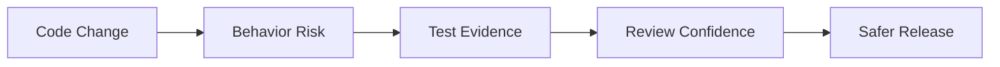
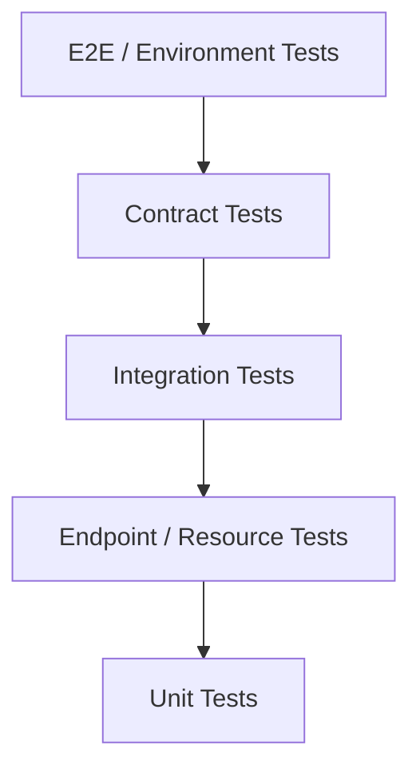
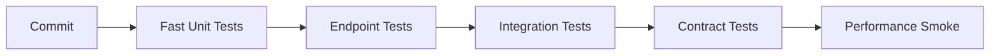

# Part 095 — Unit Testing and JAX-RS Endpoint Testing

> Fokus part ini: membangun kemampuan menulis dan mereview test untuk resource JAX-RS, provider, filter, exception mapper, validation, dan service logic. Targetnya bukan mengejar coverage angka, tetapi membuktikan behavior yang penting untuk correctness, compatibility, security, observability, dan production debugging.

Catatan penting:

```text
This part does not assume CSG uses JUnit 5, Mockito, AssertJ, JerseyTest,
REST Assured, Arquillian, Spring Test, Maven Surefire/Failsafe, or any specific
internal testing framework.

Treat all framework choices, test naming standards, CI quality gates, and
endpoint test harnesses as internal verification items.
```

Unit testing di sistem enterprise bukan aktivitas kosmetik.

Ia adalah mekanisme untuk mengunci business rule, API behavior, boundary contract, error mapping, security guard, dan regression risk.

Senior engineer tidak bertanya hanya:

```text
Is there a test?
```

Pertanyaan yang lebih tepat:

```text
What behavior is protected?
What failure mode is reproduced?
What contract is locked?
What regression would this test catch?
What production incident would this test have prevented?
```

---

## 1. Mental Model: Test as Behavioral Evidence

Test yang baik adalah evidence.

Ia membuktikan bahwa satu behavior tetap benar saat code berubah.



Test yang buruk hanya membuktikan implementation detail.

Contoh test lemah:

```text
verify(mockRepository).save(any())
```

Itu belum membuktikan output, state, error behavior, idempotency, atau contract.

Test yang lebih kuat biasanya menjawab:

```text
Given input X and system state Y
when operation Z occurs
then externally observable behavior must be A
and side effect B must happen exactly once
and error C must be returned for invalid state
```

---

## 2. Testing Pyramid for JAX-RS Services

Untuk service JAX-RS enterprise, test biasanya terbagi menjadi beberapa level.



Tiap level punya tujuan berbeda.

| Level | Tujuan | Contoh |
|---|---|---|
| Unit | logic kecil tanpa dependency nyata | pricing rule, mapper, validator |
| Resource/endpoint | JAX-RS input/output behavior | status, header, DTO, error shape |
| Provider/filter | cross-cutting pipeline behavior | auth filter, correlation filter |
| Integration | wiring + dependency nyata | PostgreSQL, Kafka, Redis |
| Contract | compatibility consumer/provider | OpenAPI, AsyncAPI |
| E2E | flow lintas service/environment | quote submission flow |

Kesalahan umum:

```text
Using only unit tests and missing runtime behavior.
Using only E2E tests and making feedback slow/flaky.
Testing mocks instead of behavior.
Testing implementation instead of contract.
```

---

## 3. What Should Be Unit-Tested

Unit test cocok untuk logic yang:

```text
deterministic
fast
side-effect-light
input/output visible
high business value
high branch complexity
```

Contoh kandidat:

```text
DTO/domain mapper
validation helper
price rounding policy
date/time effective-window logic
permission decision
idempotency decision
retry classification
error code mapping
query parameter parser
filter expression parser
```

Unit test kurang cocok untuk:

```text
JAX-RS routing
provider discovery
JSON provider behavior
container-managed injection
real transaction boundary
Kafka offset commit behavior
PostgreSQL locking behavior
```

Untuk hal-hal itu, gunakan endpoint/integration/container-based testing.

---

## 4. Anatomy of a Good Unit Test

Struktur sederhana:

```java
@Test
void shouldRejectQuoteWhenEffectiveDateIsOutsideCatalogValidity() {
    // given
    CatalogVersion catalog = CatalogVersion.validFromTo(
        LocalDate.parse("2026-01-01"),
        LocalDate.parse("2026-12-31")
    );
    QuoteRequest request = new QuoteRequest(
        "tenant-a",
        LocalDate.parse("2027-01-10")
    );

    // when
    ValidationResult result = validator.validate(request, catalog);

    // then
    assertThat(result.isValid()).isFalse();
    assertThat(result.errorCode()).isEqualTo("CATALOG_EFFECTIVE_DATE_OUT_OF_RANGE");
}
```

Hal yang membuat test ini bernilai:

```text
name states expected behavior
input is explicit
business boundary is visible
assertion checks observable result
no irrelevant mock interaction
```

---

## 5. Naming Test Cases

Nama test harus membantu reviewer membaca intent.

Pola yang baik:

```text
should<ExpectedBehavior>When<Condition>
```

Contoh:

```text
shouldReturnBadRequestWhenRequiredQueryParamIsMissing
shouldMapDomainConflictTo409WhenQuoteAlreadySubmitted
shouldPropagateCorrelationIdWhenPresent
shouldGenerateCorrelationIdWhenMissing
shouldRejectTokenWhenAudienceDoesNotMatchService
shouldNotRetryWhenDownstreamReturns400
shouldRoundTaxAmountUsingConfiguredRoundingMode
```

Hindari nama terlalu teknis:

```text
test1
testSubmitQuote
shouldCallRepository
shouldWork
```

Test adalah dokumentasi behavior.

Bila nama test tidak menjelaskan behavior, test itu gagal sebagai dokumentasi.

---

## 6. Unit Test vs Interaction Test

Interaction test mengecek apakah dependency dipanggil.

Ia berguna ketika interaction adalah behavior penting.

Contoh yang valid:

```java
verify(eventPublisher).publish(argThat(event ->
    event.type().equals("QuoteSubmitted") &&
    event.quoteId().equals(quoteId)
));
```

Contoh yang lemah:

```java
verify(repository).save(any());
```

Pertanyaan review:

```text
Does the interaction itself represent contract behavior?
Or are we testing private implementation?
```

Lebih baik assert state/output bila memungkinkan.

---

## 7. Mock, Stub, Fake, Spy: Know the Difference

| Test Double | Meaning | Good Use |
|---|---|---|
| Mock | verifies interaction | event published, email sent |
| Stub | returns controlled data | downstream returns 404 |
| Fake | working lightweight implementation | in-memory repository |
| Spy | partial real object + verification | rare, use carefully |

Over-mocking membuat test rapuh.

```text
If a refactor breaks many tests without changing behavior,
you probably tested implementation too deeply.
```

Dalam service enterprise, fake sering lebih kuat daripada mock untuk domain logic.

Contoh:

```java
class InMemoryQuoteRepository implements QuoteRepository {
    private final Map<QuoteId, Quote> quotes = new ConcurrentHashMap<>();

    @Override
    public void save(Quote quote) {
        quotes.put(quote.id(), quote);
    }

    @Override
    public Optional<Quote> findById(QuoteId id) {
        return Optional.ofNullable(quotes.get(id));
    }
}
```

Fake memberi behavior lebih realistis tanpa database nyata.

Tapi jangan gunakan fake untuk membuktikan SQL, transaction, lock, index, migration, atau database constraint.

---

## 8. JAX-RS Endpoint Test Scope

Endpoint/resource test harus membuktikan boundary HTTP.

Hal yang perlu diuji:

```text
HTTP method
path
query/path/header binding
request body deserialization
validation
status code
response body shape
response headers
error envelope
security behavior when applicable
correlation/logging/tracing behavior when applicable
```

Endpoint test tidak harus membuktikan semua business rule internal.

Ia harus membuktikan bahwa HTTP contract tersambung benar ke service boundary.

---

## 9. Resource Method Testing Without Container

Resource class dapat dites sebagai object biasa bila dependency diinjeksi manual.

Contoh:

```java
class QuoteResourceTest {
    private QuoteApplicationService service;
    private QuoteResource resource;

    @BeforeEach
    void setUp() {
        service = mock(QuoteApplicationService.class);
        resource = new QuoteResource(service);
    }

    @Test
    void shouldReturnCreatedWhenQuoteIsCreated() {
        QuoteCreateRequest request = new QuoteCreateRequest("tenant-a", "customer-1");
        QuoteId quoteId = new QuoteId("q-123");

        when(service.createQuote(any())).thenReturn(quoteId);

        Response response = resource.create(request);

        assertThat(response.getStatus()).isEqualTo(201);
        assertThat(response.getHeaderString("Location")).isEqualTo("/quotes/q-123");
    }
}
```

Kelebihan:

```text
fast
simple
no container needed
business-to-response mapping visible
```

Keterbatasan:

```text
does not test annotation routing
does not test provider/filter behavior
does not test JSON serialization
does not test validation integration
does not test dependency injection runtime
```

Gunakan untuk resource orchestration logic, bukan full HTTP behavior.

---

## 10. Endpoint Testing With In-Memory JAX-RS Runtime

Untuk menguji routing, provider, filter, and serialization, butuh test harness yang menjalankan JAX-RS runtime.

Pada Jersey, salah satu pola umum adalah `JerseyTest`.

Contoh konseptual:

```java
class QuoteResourceJerseyTest extends JerseyTest {
    @Override
    protected Application configure() {
        return new ResourceConfig()
            .register(new QuoteResource(new FakeQuoteService()))
            .register(GlobalExceptionMapper.class)
            .register(JsonProvider.class)
            .register(CorrelationIdFilter.class);
    }

    @Test
    void shouldReturnBadRequestForInvalidBody() {
        Response response = target("/quotes")
            .request()
            .post(Entity.json("{}"));

        assertThat(response.getStatus()).isEqualTo(400);

        ErrorResponse body = response.readEntity(ErrorResponse.class);
        assertThat(body.code()).isEqualTo("VALIDATION_FAILED");
    }
}
```

Catatan:

```text
JerseyTest is Jersey-specific.
If the internal stack does not use Jersey, verify the approved endpoint test harness.
```

Endpoint tests should register production-like providers.

Do not accidentally test a different serialization/error/filter setup from production.

---

## 11. What Endpoint Tests Should Prove

Minimum valuable endpoint tests:

```text
happy path status/body/header
invalid request body
missing required parameter
invalid query parameter type
unsupported media type
not acceptable media type
domain conflict mapped to correct HTTP error
technical error mapped to safe generic response
correlation ID returned or propagated
sensitive data not leaked in error
```

Example matrix:

| Scenario | Expected |
|---|---|
| valid POST | 201 + Location |
| duplicate command | 409 |
| invalid DTO | 400 + validation error |
| unauthorized | 401 |
| forbidden | 403 |
| missing resource | 404 |
| unsupported media type | 415 |
| unacceptable response type | 406 |
| unexpected exception | 500 safe envelope |

---

## 12. Testing Request Parameter Binding

A common source of endpoint bug is incorrect binding.

Example JAX-RS resource:

```java
@GET
@Path("/quotes")
@Produces(MediaType.APPLICATION_JSON)
public Response searchQuotes(
    @QueryParam("tenantId") String tenantId,
    @QueryParam("status") String status,
    @QueryParam("limit") @DefaultValue("50") int limit
) {
    // ...
}
```

Endpoint test:

```java
@Test
void shouldUseDefaultLimitWhenLimitIsMissing() {
    Response response = target("/quotes")
        .queryParam("tenantId", "tenant-a")
        .queryParam("status", "DRAFT")
        .request()
        .get();

    assertThat(response.getStatus()).isEqualTo(200);
    assertThat(fakeService.lastLimit()).isEqualTo(50);
}
```

Also test invalid type:

```java
@Test
void shouldReturnBadRequestWhenLimitIsNotANumber() {
    Response response = target("/quotes")
        .queryParam("tenantId", "tenant-a")
        .queryParam("limit", "abc")
        .request()
        .get();

    assertThat(response.getStatus()).isEqualTo(400);
}
```

Parameter conversion behavior can differ by implementation/configuration.

Verify internal behavior.

---

## 13. Testing Validation Behavior

Validation should be tested at two levels.

### API validation unit tests

For custom validators:

```java
@Test
void shouldRejectNegativeQuantity() {
    ConstraintViolation<QuoteLineRequest> violation = validate(
        new QuoteLineRequest("product-a", new BigDecimal("-1"))
    ).single();

    assertThat(violation.getPropertyPath().toString()).isEqualTo("quantity");
}
```

### Endpoint validation tests

For integration with JAX-RS error mapping:

```java
@Test
void shouldReturnValidationEnvelopeWhenRequestBodyIsInvalid() {
    Response response = target("/quotes")
        .request()
        .post(Entity.json("""
            { "tenantId": "", "customerId": null }
            """));

    assertThat(response.getStatus()).isEqualTo(400);

    ErrorResponse error = response.readEntity(ErrorResponse.class);
    assertThat(error.code()).isEqualTo("VALIDATION_FAILED");
    assertThat(error.fields()).extracting("field")
        .contains("tenantId", "customerId");
}
```

Do not only test the validator.

Also test the HTTP error shape.

---

## 14. Testing ExceptionMapper

Exception mappers are contract-critical.

They decide what clients see and what operators can debug.

Example:

```java
public class DomainConflictExceptionMapper
        implements ExceptionMapper<DomainConflictException> {

    @Override
    public Response toResponse(DomainConflictException exception) {
        return Response.status(Response.Status.CONFLICT)
            .entity(ErrorResponse.of(exception.code(), exception.safeMessage()))
            .type(MediaType.APPLICATION_JSON_TYPE)
            .build();
    }
}
```

Unit test:

```java
@Test
void shouldMapDomainConflictTo409() {
    DomainConflictException ex = new DomainConflictException(
        "QUOTE_ALREADY_SUBMITTED",
        "Quote has already been submitted"
    );

    Response response = mapper.toResponse(ex);

    assertThat(response.getStatus()).isEqualTo(409);
    assertThat(response.getMediaType()).isEqualTo(MediaType.APPLICATION_JSON_TYPE);

    ErrorResponse body = (ErrorResponse) response.getEntity();
    assertThat(body.code()).isEqualTo("QUOTE_ALREADY_SUBMITTED");
}
```

Endpoint test should prove mapper is registered:

```java
@Test
void shouldUseGlobalExceptionMapperAtRuntime() {
    fakeService.failWith(new DomainConflictException("QUOTE_ALREADY_SUBMITTED", "..."));

    Response response = target("/quotes/q-1/submit")
        .request()
        .post(Entity.json("{}"));

    assertThat(response.getStatus()).isEqualTo(409);
}
```

If mapper unit test passes but endpoint test fails, registration is broken.

---

## 15. Testing Filters

Filters often implement critical cross-cutting behavior:

```text
authentication
authorization
correlation ID
MDC population
request logging
response headers
CORS/security headers
rate limiting
```

Example filter behavior:

```text
If X-Correlation-ID is present, preserve it.
If missing, generate one.
Always return it in the response header.
Always place it in MDC during request processing.
Always clear MDC after request.
```

Test cases:

```text
shouldPreserveCorrelationIdWhenPresent
shouldGenerateCorrelationIdWhenMissing
shouldReturnCorrelationIdInResponseHeader
shouldClearMdcAfterRequest
shouldNotLogAuthorizationHeader
```

Filters can be hard to test as plain unit tests because they depend on `ContainerRequestContext` and `ContainerResponseContext`.

Use either:

```text
mocked JAX-RS context objects for narrow behavior
in-memory endpoint runtime for full pipeline behavior
```

---

## 16. Testing Security Behavior

Security tests must cover negative cases.

Minimum endpoint matrix:

| Scenario | Expected |
|---|---|
| missing token | 401 |
| malformed token | 401 |
| valid token, missing permission | 403 |
| valid role, wrong tenant | 403 or 404 depending policy |
| expired token | 401 |
| wrong audience | 401 |
| wrong issuer | 401 |

Do not rely only on happy-path authorization tests.

Security bugs usually hide in negative paths.

Example:

```java
@Test
void shouldRejectAccessToDifferentTenantQuote() {
    TestToken token = tokenForTenant("tenant-a").withPermission("quote:read");

    Response response = target("/tenants/tenant-b/quotes/q-1")
        .request()
        .header("Authorization", token.asBearer())
        .get();

    assertThat(response.getStatus()).isIn(List.of(403, 404));
}
```

Whether cross-tenant resource should return 403 or 404 is a policy decision.

Verify internal standard.

---

## 17. Testing JSON Serialization Compatibility

DTO serialization is part of API contract.

Test stable JSON shape when compatibility matters.

Example:

```java
@Test
void shouldSerializeQuoteResponseWithStableFieldNames() throws Exception {
    QuoteResponse response = new QuoteResponse(
        "q-123",
        "DRAFT",
        new BigDecimal("10.50"),
        OffsetDateTime.parse("2026-07-10T10:15:30Z")
    );

    String json = objectMapper.writeValueAsString(response);

    assertThatJson(json).isEqualTo("""
        {
          "quoteId": "q-123",
          "status": "DRAFT",
          "totalAmount": 10.50,
          "createdAt": "2026-07-10T10:15:30Z"
        }
        """);
}
```

Be careful with snapshot tests.

They are useful for compatibility but can become noisy.

Prefer explicit assertions for fields that matter.

---

## 18. Testing Date, Time, Currency, and Precision

For CPQ/order-style systems, temporal and monetary behavior is high risk.

Test cases should include:

```text
UTC serialization
local timezone conversion
DST boundary
effective date start/end
catalog validity window
pricing effective date
BigDecimal scale
rounding mode
tax boundary
```

Inject a clock.

```java
class PricingService {
    private final Clock clock;

    PricingService(Clock clock) {
        this.clock = clock;
    }

    Price calculate(...) {
        Instant now = clock.instant();
        // ...
    }
}
```

Test:

```java
@Test
void shouldUseConfiguredClockForEffectivePricingDate() {
    Clock fixedClock = Clock.fixed(
        Instant.parse("2026-07-10T00:00:00Z"),
        ZoneOffset.UTC
    );

    PricingService service = new PricingService(fixedClock);

    Price price = service.calculate(request);

    assertThat(price.effectiveAt()).isEqualTo(Instant.parse("2026-07-10T00:00:00Z"));
}
```

Avoid `Instant.now()` inside business logic.

It makes tests flaky and behavior hard to reproduce.

---

## 19. Testing Idempotency

Idempotency is not proven by a single happy path.

Test at least:

```text
first request creates state
same idempotency key returns same result
same key with different payload is rejected
concurrent same key does not create duplicate side effect
expired key behavior is explicit
```

Unit test can prove idempotency decision logic.

Integration test should prove storage/locking behavior.

Endpoint test should prove HTTP behavior.

Example:

```java
@Test
void shouldReturnSameResponseForRepeatedIdempotencyKey() {
    String key = "idem-123";

    Response first = target("/quotes")
        .request()
        .header("Idempotency-Key", key)
        .post(Entity.json(validRequest));

    Response second = target("/quotes")
        .request()
        .header("Idempotency-Key", key)
        .post(Entity.json(validRequest));

    assertThat(first.getStatus()).isEqualTo(201);
    assertThat(second.getStatus()).isIn(List.of(200, 201));
    assertThat(second.readEntity(String.class)).isEqualTo(first.readEntity(String.class));
}
```

Internal policy determines exact status for replayed idempotent response.

Verify it.

---

## 20. Testing Observability Behavior

Observability is not only runtime configuration.

Some behavior should be tested.

Examples:

```text
correlation ID is returned
correlation ID is propagated to downstream client
MDC is populated and cleared
sensitive headers are redacted
error responses contain safe error ID
metrics tags do not include high-cardinality user input
```

Example:

```java
@Test
void shouldNotExposeInternalExceptionMessage() {
    fakeService.failWith(new RuntimeException("password=secret internal stack detail"));

    Response response = target("/quotes")
        .request()
        .post(Entity.json(validRequest));

    String body = response.readEntity(String.class);

    assertThat(response.getStatus()).isEqualTo(500);
    assertThat(body).doesNotContain("password=secret");
    assertThat(body).doesNotContain("stack detail");
}
```

This test protects security and operations.

---

## 21. Testing Anti-Patterns

### Anti-pattern 1: Testing private methods

Private methods are implementation detail.

Test behavior through public boundary.

### Anti-pattern 2: Mocking value objects

Do not mock simple data structures.

Create real objects.

### Anti-pattern 3: One giant test fixture

Huge fixtures hide intent.

Prefer builders with named defaults.

### Anti-pattern 4: Asserting everything

Too many assertions make test brittle.

Assert what defines the behavior.

### Anti-pattern 5: Ignoring negative paths

Production bugs often live in invalid input, missing permission, duplicate request, timeout, retry, and partial failure.

### Anti-pattern 6: Tests depending on execution order

Each test must be isolated.

Shared mutable state creates flakiness.

### Anti-pattern 7: Sleeping in tests

`Thread.sleep()` is a smell.

Use deterministic clock, await utilities, or explicit synchronization.

---

## 22. Test Data Builders

Good test data builder reduces noise.

```java
class QuoteRequestBuilder {
    private String tenantId = "tenant-a";
    private String customerId = "customer-1";
    private List<QuoteLineRequest> lines = List.of(
        new QuoteLineRequest("product-a", new BigDecimal("1"))
    );

    static QuoteRequestBuilder validQuoteRequest() {
        return new QuoteRequestBuilder();
    }

    QuoteRequestBuilder withoutTenant() {
        this.tenantId = null;
        return this;
    }

    QuoteCreateRequest build() {
        return new QuoteCreateRequest(tenantId, customerId, lines);
    }
}
```

Usage:

```java
QuoteCreateRequest request = validQuoteRequest()
    .withoutTenant()
    .build();
```

Builder names should reveal intent.

Avoid generic mutation soup.

---

## 23. Test Package Structure

Common structure:

```text
src/test/java
  com.example.quote
    api
      QuoteResourceTest.java
      QuoteResourceJerseyTest.java
      GlobalExceptionMapperTest.java
      CorrelationIdFilterTest.java
    application
      SubmitQuoteServiceTest.java
    domain
      QuoteStateMachineTest.java
      PricingPolicyTest.java
    mapping
      QuoteMapperTest.java
    security
      PermissionEvaluatorTest.java
```

Tests should mirror behavioral boundaries, not necessarily every package mechanically.

A package named `api` should contain API contract tests.

A package named `domain` should contain domain invariant tests.

---

## 24. Maven Test Separation

Common separation:

```text
unit tests      -> Maven Surefire -> *Test.java
integration    -> Maven Failsafe -> *IT.java
```

Example convention:

```text
QuoteServiceTest.java        // unit
QuoteResourceTest.java       // resource/unit-ish
QuoteResourceIT.java         // container/integration
QuoteDatabaseIT.java         // PostgreSQL/Testcontainers
KafkaConsumerIT.java         // Kafka/Testcontainers
```

Verify internal naming standard.

Do not mix slow container tests into the fast unit test phase unless intentional.

---

## 25. CI Feedback Strategy

A healthy CI pipeline separates feedback by cost and confidence.



Recommended behavior:

```text
unit tests run on every commit
endpoint tests run on every PR
integration tests run on every PR or gated branch
contract tests run before merge/release
performance tests run on schedule or release gate
```

Internal CI may differ.

The important thing is explicit risk coverage.

---

## 26. Failure Modes Testing Should Catch

Endpoint/resource tests should catch:

```text
wrong status code
wrong media type
missing header
broken error envelope
validation not active
ExceptionMapper not registered
filter not registered
JSON date format drift
sensitive error leak
correlation ID not returned
wrong tenant access behavior
```

Unit tests should catch:

```text
rounding bug
wrong state transition
permission decision bug
retry classification bug
idempotency mismatch
mapper field loss
validation boundary bug
```

If a class changes frequently and tests never fail, ask whether tests are asserting real behavior.

---

## 27. Debugging Failing Tests

When a test fails, classify failure first.

```text
behavior regression
wrong test expectation
test fixture drift
time-dependent flake
order-dependent flake
environment dependency issue
mock too strict
serialization/config mismatch
```

Do not immediately update snapshots or loosen assertions.

Ask:

```text
Did the public contract change?
Was the change intentional?
Is compatibility preserved?
Do consumers need migration?
Does the test represent current expected behavior?
```

---

## 28. PR Review Checklist

For unit and endpoint tests, review:

```text
Does the PR add or modify behavior?
Is the behavior protected by a test?
Do tests include negative paths?
Are status codes and error envelopes asserted?
Are headers/media types asserted where relevant?
Are validation failures tested at HTTP boundary?
Are security failures tested negatively?
Are date/time/currency edge cases covered?
Are mocks used only where interaction is meaningful?
Are tests deterministic?
Are test names readable?
Are fixtures small and intentional?
Would this test catch a real regression?
```

Red flags:

```text
only happy-path tests
asserting only non-null
excessive verify calls
Thread.sleep in tests
shared mutable fixture
no endpoint-level test for new resource
no error test for new exception mapper
no security negative test for protected endpoint
```

---

## 29. Internal Verification Checklist

Verify in the internal CSG codebase/onboarding/pipeline:

```text
Which test framework is standard: JUnit 4, JUnit 5, TestNG, other?
Which assertion library is standard?
Which mocking library is approved?
Is JerseyTest used for endpoint tests?
Is REST Assured used?
Is Arquillian or a container-based test harness used?
How are resource classes instantiated in tests?
How are providers/filters/exception mappers registered in tests?
How is JSON ObjectMapper/JSON-B config shared with tests?
How are validation errors tested?
What is the naming convention for unit vs integration tests?
Which tests run in PR vs nightly vs release pipeline?
What is the quality gate for coverage, mutation testing, or contract testing?
How are flaky tests tracked?
How are secrets/config avoided in tests?
How are tenant and permission scenarios tested?
What is the expected minimum test for a new endpoint?
What is the expected minimum test for a new error code?
What is the expected minimum test for a new mapper or DTO field?
```

---

## 30. Senior Engineer Heuristics

Good tests are not measured only by count.

Use these heuristics:

```text
A test should fail for the right reason.
A test should explain behavior without reading implementation.
A test should protect a contract, invariant, or failure mode.
A test should be deterministic.
A test should be easy to debug when it fails.
A test should not make safe refactoring painful.
```

For JAX-RS services, always ask:

```text
Is this behavior verified at the same boundary where it can break?
```

If routing can break, test routing.

If JSON provider can break, test serialization.

If exception mapper registration can break, test endpoint error response.

If SQL can break, use integration test.

If Kafka offset behavior can break, use Kafka integration test.

---

# Summary

Unit and endpoint tests in enterprise JAX-RS services should protect behavior, not implementation trivia.

The core model:

```text
unit tests protect deterministic logic
endpoint tests protect HTTP/JAX-RS boundary behavior
provider/filter tests protect cross-cutting pipeline behavior
negative tests protect production failure modes
review checklist protects compatibility and operability
```

A senior engineer should be able to look at a PR and say:

```text
The behavior changed.
The right boundary is tested.
The failure modes are covered.
The test will catch a real regression.
The test will not block safe refactoring.
```
