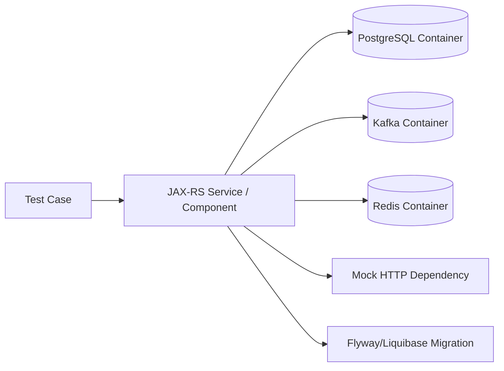
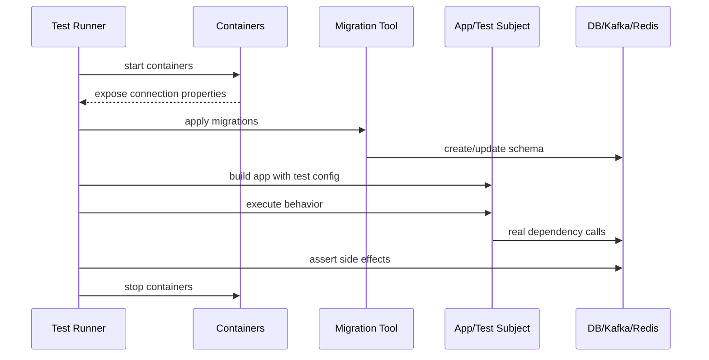
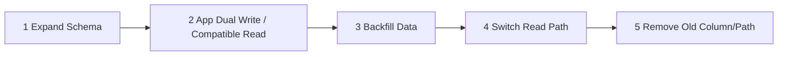

# Part 096 — Integration Testing, Testcontainers, DB Migration, and Kafka Testing

> Fokus part ini: membangun integration test yang membuktikan wiring nyata, database behavior, migration safety, Kafka behavior, Redis/cache behavior, outbound dependency behavior, dan JAX-RS runtime integration. Targetnya bukan membuat test lambat sebanyak mungkin, tetapi memilih integration test yang menangkap risiko yang unit test tidak bisa lihat.

Catatan penting:

```text
This part does not assume CSG uses Testcontainers, Docker-in-Docker, localstack,
embedded Kafka, WireMock, MockServer, REST Assured, JerseyTest, Maven Failsafe,
or any specific CI container runtime.

Treat all integration testing frameworks, CI execution model, container images,
internal test environments, migration tools, and messaging test harnesses as
internal verification items.
```

Integration testing diperlukan karena banyak bug enterprise bukan bug function kecil.

Mereka muncul dari boundary.

```text
wrong wiring
wrong provider registration
wrong object mapper
wrong database migration
wrong SQL behavior
wrong transaction boundary
wrong Kafka commit strategy
wrong Redis TTL behavior
wrong external HTTP error mapping
wrong container/runtime config
```

Unit test tidak cukup untuk melihat semua ini.

---

## 1. Mental Model: Integration Test as Boundary Proof

Integration test membuktikan bahwa beberapa komponen nyata bekerja bersama.



Pertanyaan utama:

```text
Which boundary risk are we proving?
```

Bukan:

```text
Can we run everything in Docker?
```

Test container adalah alat.

Risk coverage adalah tujuan.

---

## 2. What Unit Tests Cannot Prove

Unit tests cannot reliably prove:

```text
SQL syntax actually works
index/query plan is acceptable
transaction isolation behaves as expected
deadlock/lock timeout behavior
migration applies cleanly
JSON provider registered in runtime
JAX-RS filter order in runtime
Kafka producer config works
Kafka consumer commit behavior works
Redis TTL and atomic command behavior
HTTP client timeout/error mapping with real wire behavior
container memory/startup/probe behavior
```

Integration tests fill this gap.

---

## 3. Integration Test Categories

| Category | Proves |
|---|---|
| Database integration | SQL, mapper, transaction, constraints |
| Migration integration | schema creation/evolution safety |
| JAX-RS runtime integration | resource/provider/filter/serialization wiring |
| Kafka integration | producer/consumer/topic/offset behavior |
| Redis integration | TTL, atomic operation, lock/idempotency behavior |
| HTTP dependency integration | client timeout/error/serialization behavior |
| End-to-end slice | request -> DB/event/cache/output |

A good suite has selected tests from each high-risk boundary.

Do not turn every unit test into an integration test.

---

## 4. Testcontainers Mental Model

Testcontainers lets tests start real infrastructure dependencies in containers.

Conceptually:

```java
static PostgreSQLContainer<?> postgres = new PostgreSQLContainer<>("postgres:16")
    .withDatabaseName("quote_test")
    .withUsername("quote")
    .withPassword("quote");
```

Then wire application datasource to container runtime properties.

```java
String jdbcUrl = postgres.getJdbcUrl();
String username = postgres.getUsername();
String password = postgres.getPassword();
```

The exact API, image version, reuse policy, and CI setup must be verified internally.

The engineering principle:

```text
Use real infrastructure behavior where correctness depends on it.
Keep test scope narrow enough to stay debuggable.
```

---

## 5. Integration Test Lifecycle

A typical test lifecycle:



Failure can happen at each step.

Classify failure before fixing:

```text
container startup failure
migration failure
wiring failure
test data failure
behavior failure
cleanup/isolation failure
CI resource failure
```

---

## 6. Database Integration Testing

Database integration tests should prove things that only the database can prove.

Examples:

```text
SQL syntax
mapper result mapping
constraint behavior
transaction boundary
unique key violation handling
foreign key behavior
JSONB query behavior
locking behavior
pagination query correctness
migration-created schema compatibility
```

Example structure:

```java
class QuoteRepositoryIT {
    static PostgreSQLContainer<?> postgres = new PostgreSQLContainer<>("postgres:16");

    QuoteRepository repository;

    @BeforeAll
    static void startDatabase() {
        postgres.start();
        runMigrations(postgres.getJdbcUrl(), postgres.getUsername(), postgres.getPassword());
    }

    @BeforeEach
    void setUp() {
        repository = new MyBatisQuoteRepository(testSqlSessionFactory(postgres));
        truncateTables();
    }

    @Test
    void shouldPersistAndLoadQuote() {
        Quote quote = Quote.draft("q-1", "tenant-a");

        repository.save(quote);

        Optional<Quote> loaded = repository.findById("tenant-a", "q-1");

        assertThat(loaded).contains(quote);
    }
}
```

This test proves more than a unit test:

```text
schema exists
SQL insert works
SQL select works
mapping works
tenant condition works
```

---

## 7. Migration Testing

Migration tests are mandatory for production confidence.

They should answer:

```text
Can schema be created from scratch?
Can existing schema be upgraded?
Are migrations ordered correctly?
Are checksums stable?
Are repeatable migrations safe?
Do application queries work after migration?
Can expand-contract rollout be simulated?
```

### Fresh migration test

```text
empty database -> apply all migrations -> application starts -> smoke query passes
```

### Upgrade migration test

```text
old schema + old data -> apply new migration -> new app can read/write -> compatibility preserved
```

### Backward compatibility test

For rolling deployment:

```text
new schema must support old app version during rollout
old schema must not be required after new app deploy unless sequence guarantees it
```

The strongest migration test includes representative data.

Empty-schema-only migration tests miss data migration failures.

---

## 8. Expand-Contract Migration Testing

Expand-contract protects rolling deployment.



Test plan:

```text
migration N adds new nullable column/table without breaking old app
new app can write old and new shape if required
backfill is idempotent
read path works with old and new rows
contract migration only runs after all old readers/writers are gone
```

PR review question:

```text
Can this migration run while old pods are still serving traffic?
```

If no, rollout plan must prove that old pods cannot run concurrently.

---

## 9. MyBatis Integration Testing

MyBatis integration tests should verify:

```text
mapper XML loads
parameter binding works
result mapping works
nested result mapping works
dynamic SQL produces valid SQL
SQL injection-safe binding is used
PostgreSQL-specific types map correctly
SQLState/error handling is correct
```

Example:

```java
@Test
void shouldSearchQuotesUsingDynamicFilters() {
    insertQuote("tenant-a", "q-1", "DRAFT");
    insertQuote("tenant-a", "q-2", "SUBMITTED");
    insertQuote("tenant-b", "q-3", "DRAFT");

    List<QuoteRow> rows = mapper.searchQuotes(
        new QuoteSearchCriteria("tenant-a", "DRAFT", 50, null)
    );

    assertThat(rows).extracting(QuoteRow::quoteId).containsExactly("q-1");
}
```

This catches missing tenant predicate.

That is not cosmetic.

In multi-tenant systems, missing tenant predicate is a security defect.

---

## 10. Transaction and Locking Tests

Some behaviors require concurrent integration tests.

Examples:

```text
unique idempotency key prevents duplicate command
row lock serializes state transition
lock timeout is mapped to retryable/non-retryable error
concurrent submit does not double-publish event
```

Pseudo-structure:

```java
@Test
void shouldAllowOnlyOneConcurrentSubmit() throws Exception {
    insertDraftQuote("tenant-a", "q-1");

    ExecutorService executor = Executors.newFixedThreadPool(2);
    CountDownLatch start = new CountDownLatch(1);

    Future<Result> first = executor.submit(() -> submitAfter(start, "q-1"));
    Future<Result> second = executor.submit(() -> submitAfter(start, "q-1"));

    start.countDown();

    List<Result> results = List.of(first.get(), second.get());

    assertThat(results).extracting(Result::status)
        .containsExactlyInAnyOrder("SUBMITTED", "CONFLICT");

    assertThat(countSubmittedEvents("q-1")).isEqualTo(1);
}
```

Concurrent tests are expensive and can be flaky.

Use them for high-risk invariants only.

Keep them deterministic with latches/barriers, not sleeps.

---

## 11. JAX-RS Runtime Integration Testing

Endpoint tests can be in-memory.

Runtime integration tests should be closer to actual application bootstrap.

They should prove:

```text
resources are registered
providers are registered
filters execute in expected order
ExceptionMapper works
JSON provider is production-like
validation is active
DI wiring works
configuration is loaded
health endpoint works
```

A test may start the actual application entrypoint or a test-specific bootstrap.

The key is alignment.

```text
Test bootstrap should not silently use a different provider/filter/config setup
from production bootstrap.
```

If production uses `ResourceConfig`, tests should reuse the same registration path where possible.

---

## 12. HTTP Dependency Testing with Mock Server

Outbound HTTP integration tests should prove wire-level behavior.

Use mock HTTP server when calling real downstream services is unsafe.

Test scenarios:

```text
200 success response
400 mapped to domain/client error
404 mapped to not found or empty result
409 mapped to conflict
429 mapped to retry/backoff behavior
500 mapped to downstream technical error
timeout
malformed JSON
large streaming response
unexpected content type
```

Example conceptual test:

```java
@Test
void shouldMapDownstreamTimeoutToRetryableIntegrationError() {
    mockServer.stubFor(get("/catalog/products/p-1")
        .willReturn(aResponse().withFixedDelay(5_000)));

    CatalogClient client = new CatalogClient(baseUrl, timeoutMillis(100));

    assertThatThrownBy(() -> client.getProduct("p-1"))
        .isInstanceOf(RetryableIntegrationException.class)
        .hasMessageContaining("catalog timeout");
}
```

Do not only test success responses.

Integration failures often dominate production incidents.

---

## 13. Kafka Integration Testing

Kafka integration tests should prove messaging behavior that unit tests cannot.

Examples:

```text
producer sends to correct topic
key is correct
headers include trace/correlation/tenant context
schema serialization works
consumer receives and processes message
offset commit occurs after successful processing
failed processing does not commit incorrectly
DLQ/retry path works
idempotency prevents duplicate processing
```

Pseudo-structure:

```java
@Test
void shouldPublishQuoteSubmittedEventWithQuoteIdAsKey() {
    submitQuote("tenant-a", "q-1");

    ConsumerRecord<String, byte[]> record = readOne("quote.events");

    assertThat(record.key()).isEqualTo("q-1");
    assertThat(record.headers().lastHeader("tenant-id").value())
        .isEqualTo(bytes("tenant-a"));

    QuoteSubmitted event = deserialize(record.value());
    assertThat(event.quoteId()).isEqualTo("q-1");
}
```

This test protects event contract behavior.

---

## 14. Kafka Consumer Testing

Consumer integration tests are harder because offset and retry behavior matter.

Test cases:

```text
valid event updates state
duplicate event is ignored safely
invalid event goes to DLQ or error path
technical failure is retried
poison message does not block partition forever
consumer commits only after successful processing
context headers are propagated into logs/traces
```

Example:

```java
@Test
void shouldIgnoreDuplicateQuoteSubmittedEvent() {
    QuoteSubmitted event = new QuoteSubmitted("tenant-a", "q-1", "event-1");

    produce("quote.events", "q-1", event);
    produce("quote.events", "q-1", event);

    await().untilAsserted(() -> {
        assertThat(repository.countProcessedEvent("event-1")).isEqualTo(1);
        assertThat(repository.findQuote("tenant-a", "q-1").status()).isEqualTo("SUBMITTED");
    });
}
```

Do not use arbitrary sleeps.

Use await with clear timeout and assertion.

---

## 15. Schema and Contract Testing for Events

Integration tests should not replace schema compatibility checks.

But they can prove runtime serializer/deserializer wiring.

Test:

```text
producer serializes event using registered schema
consumer deserializes event using expected schema
unknown optional field does not break consumer
missing required field is rejected intentionally
```

If internal platform uses schema registry, verify:

```text
test registry strategy
compatibility mode in CI
local registry container
mock registry support
schema subject naming convention
```

---

## 16. Redis Integration Testing

Redis integration tests should prove atomic and time-based behavior.

Candidates:

```text
cache TTL expires
cache-aside fallback works
idempotency key is set atomically
lock release does not delete another client's lock
rate limiter increments atomically
stream consumer acknowledges only after success
```

Example:

```java
@Test
void shouldExpireIdempotencyKeyAfterTtl() {
    idempotencyStore.save("tenant-a", "key-1", response, Duration.ofSeconds(1));

    assertThat(idempotencyStore.find("tenant-a", "key-1")).isPresent();

    await().atMost(Duration.ofSeconds(3)).untilAsserted(() ->
        assertThat(idempotencyStore.find("tenant-a", "key-1")).isEmpty()
    );
}
```

Time-based tests can be flaky.

Keep TTLs short but realistic enough for CI variance.

---

## 17. Full Slice Integration Test

A slice test verifies a meaningful path across boundaries.

Example:

```text
HTTP POST /quotes
-> validation
-> service
-> PostgreSQL transaction
-> outbox insert
-> response 201
-> outbox publisher emits Kafka event
```

Slice tests are valuable but expensive.

Use them for critical flows only.

Example assertions:

```text
response status is correct
response body/header correct
row exists in database
audit/outbox row exists
Kafka event emitted with correct key/header/schema
correlation ID preserved
```

Do not create too many full slices.

One critical slice per important flow is often better than many brittle mega-tests.

---

## 18. Test Isolation and Cleanup

Integration tests fail when isolation is weak.

Strategies:

```text
truncate tables before each test
use unique tenant/test IDs
use transaction rollback where applicable
recreate schema for class/suite
use isolated Kafka topic per test class
use unique consumer group per test
flush Redis before each test
```

Trade-off:

| Strategy | Pros | Cons |
|---|---|---|
| truncate | simple | can be slow, FK order issues |
| transaction rollback | fast | does not test commit behavior |
| recreate schema | clean | slow |
| unique IDs | parallel-friendly | data accumulates |
| container per class | isolated | startup cost |
| shared reusable container | fast | state leakage risk |

Choose intentionally.

---

## 19. Parallel Execution Risks

Parallel integration tests can expose hidden coupling.

Common failures:

```text
same Kafka topic
same consumer group
same DB rows
same Redis keys
same mock server paths
same static configuration
same port binding
shared global clock
```

Make identifiers unique:

```java
String testRunId = UUID.randomUUID().toString();
String tenantId = "tenant-it-" + testRunId;
String topic = "quote.events." + testRunId;
String consumerGroup = "quote-consumer-it-" + testRunId;
```

Avoid fixed external ports unless required.

Let containers expose random host ports and inject resolved URLs.

---

## 20. CI Runtime Considerations

Container-based tests need CI support.

Verify:

```text
Docker availability
container runtime policy
network access
image pull policy
registry authentication
resource limits
parallelism
test timeout
log capture
container reuse policy
security restrictions
```

Common CI failure modes:

```text
image pull rate limit
slow container startup
test timeout too short
port collision
insufficient memory
Kafka readiness race
database still starting when migration runs
container logs not captured
```

Make readiness explicit.

Do not assume container started means service is ready.

---

## 21. Debugging Failing Integration Tests

When an integration test fails, collect evidence.

```text
application logs
container logs
database state
migration output
Kafka topic records
consumer group offsets
Redis keys/TTL
mock server requests
HTTP request/response payloads
trace/correlation IDs
```

Example debugging checklist:

```text
Did container start successfully?
Did migrations run?
Did app use container connection string?
Did test data insert succeed?
Did request reach resource method?
Did transaction commit?
Did Kafka event publish?
Did consumer receive and commit?
Did cleanup delete needed state too early?
```

Integration test debugging should be evidence-driven.

---

## 22. Avoiding Flaky Integration Tests

Flakiness usually comes from uncontrolled time, concurrency, external state, or readiness.

Avoid:

```text
Thread.sleep
fixed ports
shared mutable state
real external services
assumed test order
unbounded async waits
very short TTLs
timing-sensitive assertions without await
```

Prefer:

```text
await().untilAsserted(...)
unique IDs
container readiness checks
explicit cleanup
fixed Clock for business time
bounded timeouts
captured logs
```

A flaky test is not harmless.

It trains engineers to ignore CI failures.

---

## 23. Local vs CI Integration Tests

Local tests should be easy to run.

CI tests should be reliable.

Recommended split:

```text
fast integration subset for PR
full integration suite for main branch/nightly
migration compatibility suite for release branch
performance smoke for release candidate
```

Example Maven convention:

```bash
# fast unit tests
./mvnw test

# integration tests
./mvnw verify -Pintegration

# specific integration test
./mvnw -Dtest=QuoteRepositoryIT verify
```

Verify internal commands.

Put them in onboarding docs.

---

## 24. What Not to Integration-Test

Do not integration-test every trivial branch.

Avoid integration tests for:

```text
simple getters/setters
pure mapping already unit-tested
every validation annotation individually
internal branch not crossing a boundary
framework behavior already covered elsewhere
```

Integration tests are expensive.

Use them where external behavior matters.

---

## 25. PR Review Checklist

For integration tests, review:

```text
What boundary risk does this test prove?
Could this be a unit test instead?
Does it use real dependency behavior where needed?
Are migrations applied exactly as production would apply them?
Is data cleanup explicit?
Is the test deterministic?
Does it avoid fixed sleeps?
Does it use unique IDs/topics/groups/keys where needed?
Are container versions intentional?
Are logs available when test fails?
Are negative/failure scenarios included?
Does CI have enough resource/time for it?
Does the test protect a production-relevant failure mode?
```

Red flags:

```text
integration test with only mocked dependencies
test passes without asserting side effects
shared Kafka consumer group across tests
real shared dev database used by automated tests
migration not run before repository test
hardcoded local port
Thread.sleep for async event processing
no cleanup
no negative path
```

---

## 26. Internal Verification Checklist

Verify in internal CSG codebase/pipeline:

```text
Is Testcontainers approved and used?
Which version and container images are standard?
Is Docker available in CI?
Are reusable containers allowed?
How are database migrations run in integration tests?
Is Flyway or Liquibase used?
Are migration tests required for DB changes?
Is PostgreSQL container version aligned with production?
Are MyBatis mappers integration-tested?
How are Kafka topics created in tests?
Is embedded Kafka used or container Kafka used?
How are schema registry tests handled?
How are Kafka consumer groups isolated?
How are Redis tests isolated?
Is WireMock, MockServer, or another HTTP mock standard?
How are cloud services mocked locally?
Are LocalStack/Azurite used, or are cloud calls abstracted?
Which tests run in PR vs nightly vs release?
What is the naming convention for IT tests?
Where are container logs stored in CI?
How are flaky tests tracked and quarantined?
What is the maximum acceptable integration test runtime?
Who owns integration test infrastructure?
```

---

## 27. Senior Engineer Heuristics

Use these heuristics:

```text
Integration tests should prove boundary behavior.
Every slow test must justify its cost.
Every migration should be tested against representative data.
Every Kafka consumer must be tested for duplicate and failure behavior.
Every multi-tenant query should be tested for tenant isolation.
Every idempotency feature should be tested under repeat and concurrency.
Every test should be debuggable from logs and persisted evidence.
```

The best integration tests are not broad.

They are precise.

They target the seams where production actually breaks.

---

# Summary

Integration testing in enterprise JAX-RS services is about proving boundaries.

The core model:

```text
unit tests prove logic
endpoint tests prove HTTP/runtime boundary
integration tests prove real dependency behavior
migration tests prove deployability
Kafka/Redis tests prove distributed semantics
slice tests prove critical flows
```

A senior engineer should be able to review an integration test and say:

```text
This test is worth its runtime cost.
It catches a failure that unit tests cannot catch.
It uses realistic dependency behavior.
It is isolated, deterministic, and debuggable.
It increases production confidence.
```
