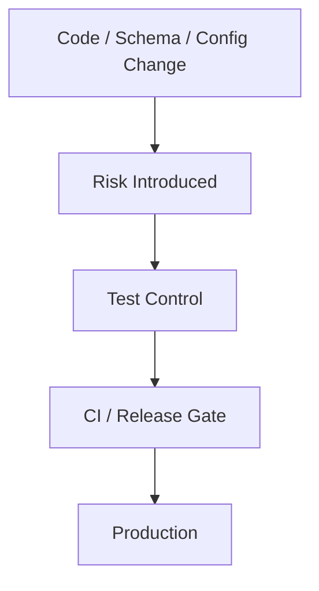
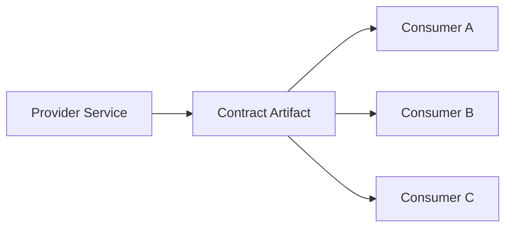
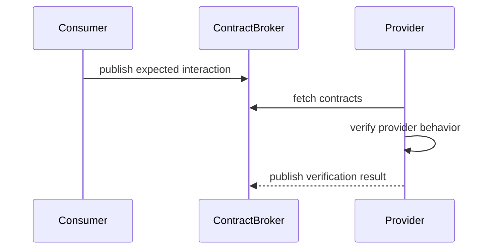
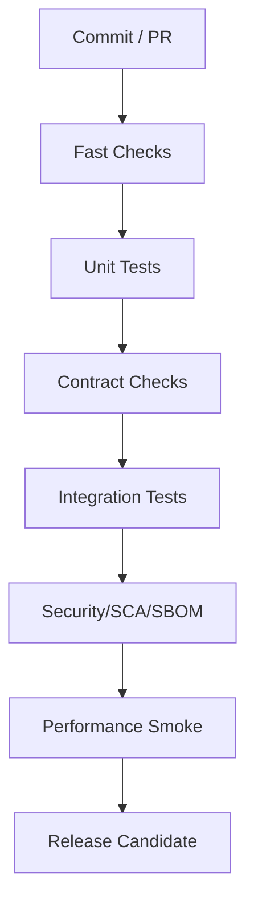

# Part 097 — Contract Testing, Performance Testing, Benchmarking, CI, and Flaky Diagnosis

> Fokus part ini: memahami test strategy yang menjaga compatibility dan production confidence. Unit test dan integration test membuktikan behavior lokal. Contract test, performance test, benchmark, dan CI quality gate membuktikan bahwa perubahan masih aman untuk consumer, dependency, runtime, dan production operation.

Catatan penting:

```text
This part does not assume CSG uses Pact, Spring Cloud Contract, REST Assured,
OpenAPI diff tools, AsyncAPI tooling, k6, Gatling, JMeter, JMH, GitHub Actions,
Jenkins, GitLab CI, Azure DevOps, Buildkite, or any specific internal quality gate.

Treat all tooling, CI stages, performance baselines, contract ownership, and
release gates as internal verification items.
```

Di sistem enterprise, bug paling mahal sering bukan bug unit kecil.

Bug paling mahal biasanya adalah:

```text
breaking API change
breaking event schema change
hidden performance regression
slow query under production cardinality
retry storm under dependency failure
flaky CI hiding real failures
benchmark result interpreted incorrectly
load test that proves nothing useful
```

Test strategy senior harus menjawab:

```text
What risk does this test reduce?
At which boundary does the risk exist?
Who is protected by this test?
What failure should block merge/release?
What failure should trigger investigation but not block?
```

---

## 1. Mental Model: Tests as Risk Controls

Test bukan tujuan. Test adalah risk control.



Setiap test harus punya alasan.

```text
Unit test:
  Does this function/class behave correctly?

Integration test:
  Do real components work together?

Contract test:
  Did we preserve producer/consumer agreement?

Performance test:
  Does this survive realistic load and data shape?

Benchmark:
  Is this implementation faster/slower under controlled micro conditions?

CI gate:
  Should this change be allowed to merge or deploy?
```

Weak test strategy biasanya terlihat seperti ini:

```text
many tests
unclear risk coverage
slow pipeline
flaky failures
ignored failures
no compatibility gate
no performance baseline
no ownership of failures
```

Strong test strategy terlihat seperti ini:

```text
small number of high-signal tests
clear boundary coverage
fast feedback for common changes
slow tests isolated into proper stages
compatibility checked before release
performance regressions visible
flaky tests aggressively triaged
```

---

## 2. Contract Testing: Why It Exists

Contract testing melindungi integrasi.

Dalam sistem enterprise, satu service jarang berdiri sendiri.

```text
JAX-RS API is consumed by UI, other services, partners, batch jobs, or workflow engines.
Kafka events are consumed by downstream services, analytics, reconciliation jobs, or audit systems.
gRPC/protobuf APIs may be consumed by generated clients.
```

Contract test memastikan producer dan consumer tidak diam-diam berubah arah.



Tanpa contract test:

```text
Provider changes field type.
Consumer deploys later.
Production breaks after release.
The team that caused the break may not see it in its own tests.
```

Dengan contract test:

```text
Breaking change is detected before merge or before release.
```

---

## 3. Contract Types

| Contract type | Boundary protected | Example artifact |
|---|---|---|
| HTTP provider contract | JAX-RS API response/request compatibility | OpenAPI |
| HTTP consumer contract | Consumer expectation against provider | Pact-like contract |
| Event producer contract | Kafka/Rabbit event schema | Avro/JSON Schema/Protobuf |
| Event consumer contract | Consumer tolerance to producer evolution | sample events / schema tests |
| gRPC contract | RPC method and message compatibility | protobuf |
| Error contract | Failure response shape and code semantics | OpenAPI + examples |
| Operational contract | Timeout, retry, idempotency expectations | documentation + tests |

Senior engineer harus peduli bukan hanya “schema valid”, tetapi “consumer masih aman”.

---

## 4. OpenAPI Contract Testing

Untuk HTTP/JAX-RS API, OpenAPI sering menjadi kontrak utama.

Yang harus diuji:

```text
path exists
method exists
required request fields unchanged
required response fields unchanged
status codes documented
error shape stable
headers documented
content type stable
pagination shape stable
nullable/optional semantics stable
```

Contoh breaking change:

```diff
- GET /quotes/{id} returns 200 with field "quoteId"
+ GET /quotes/{id} returns 200 with field "id"
```

Untuk internal Java code, breaking change bisa terlihat kecil:

```java
// Before
public record QuoteResponse(String quoteId, String status) {}

// After
public record QuoteResponse(String id, String status) {}
```

Tetapi untuk consumer, ini contract break.

Checklist OpenAPI diff:

```text
removed path
removed method
removed request field accepted by old clients
new required request field
removed response field used by clients
changed field type
changed enum values without compatibility policy
changed status code semantics
changed auth requirement
changed pagination structure
changed error envelope
changed content type
```

---

## 5. Consumer-Driven Contract Testing

Consumer-driven contract testing berguna ketika consumer expectation lebih spesifik daripada OpenAPI.

Misalnya UI atau downstream service hanya peduli subset field.



Contoh consumer expectation:

```json
{
  "request": {
    "method": "GET",
    "path": "/quotes/Q-123"
  },
  "response": {
    "status": 200,
    "body": {
      "quoteId": "Q-123",
      "status": "DRAFT"
    }
  }
}
```

Keuntungan:

```text
consumer expresses what it actually needs
provider can verify before release
less reliance on tribal knowledge
```

Risiko:

```text
too many brittle contracts
contracts coupled to incidental fields
stale consumer contracts
no ownership when contract fails
```

Senior review question:

```text
Is this contract protecting a real dependency, or just duplicating implementation detail?
```

---

## 6. Event Contract Testing

Event-driven systems membutuhkan contract testing lebih disiplin daripada HTTP karena consumer sering asinkron dan tidak terlihat langsung saat release.

Event contract harus menguji:

```text
topic/event name
schema compatibility
required fields
optional fields
field type
semantic meaning
event key
ordering assumption
idempotency key
event version
deprecation policy
replay compatibility
```

Contoh event:

```json
{
  "eventId": "evt-123",
  "eventType": "QuoteSubmitted",
  "eventVersion": 2,
  "occurredAt": "2026-07-10T10:15:30Z",
  "tenantId": "tenant-a",
  "quoteId": "Q-123",
  "submittedBy": "user-456"
}
```

Breaking event changes:

```text
remove quoteId
change quoteId from string to object
rename occurredAt to timestamp
change event key from quoteId to tenantId
change event meaning without version bump
emit duplicate semantic events without consumer policy
remove old enum value consumer still handles
```

Contract test untuk event harus melindungi dua sisi:

```text
producer compatibility:
  can producer still emit schema-valid event?

consumer compatibility:
  can consumer still process old and new acceptable events?
```

---

## 7. Compatibility Matrix

Contract compatibility harus divisualkan sebagai matrix.

```text
               Consumer v1   Consumer v2   Consumer v3
Provider v1       OK            OK?           ?
Provider v2       OK?           OK            OK?
Provider v3       BREAK?        OK?           OK
```

Untuk enterprise rollout, compatibility matrix penting karena deployment tidak selalu serentak.

```text
blue-green deployment
canary deployment
multi-region rollout
customer-specific rollout
tenant-specific rollout
on-prem delayed upgrade
partner integration delayed upgrade
```

Rule praktis:

```text
If provider and consumer cannot be deployed atomically, compatibility is not optional.
```

---

## 8. Performance Testing: What It Actually Proves

Performance testing bukan sekadar “berapa RPS?”.

Performance testing harus menjawab:

```text
Does the service meet latency target under expected load?
Where does it saturate?
What is the bottleneck?
How does it fail under overload?
Does it recover after overload?
Does it respect downstream limits?
```

Jenis test:

| Test | Purpose |
|---|---|
| Smoke performance test | Basic latency sanity |
| Load test | Expected production load |
| Stress test | Find saturation point |
| Spike test | Sudden traffic jump |
| Soak test | Long-running stability/leak detection |
| Breakpoint test | Find maximum sustainable capacity |
| Failover test | Behavior during dependency/platform failure |

Performance test tanpa hypothesis sering membuang waktu.

Good hypothesis:

```text
Under 150 RPS with p95 payload size and production-like DB cardinality,
GET /quotes/{id} should remain below 200ms p95 and error rate below 0.1%.
```

Bad hypothesis:

```text
Let's run 1000 users and see what happens.
```

---

## 9. Performance Test Targets

Target harus jelas.

```text
p50 latency
p95 latency
p99 latency
error rate
throughput
CPU utilization
memory utilization
GC pause
DB connection pool usage
DB query latency
Kafka publish latency
consumer lag
Redis latency
HTTP downstream latency
queue depth
thread pool saturation
```

Contoh SLO-like target:

```text
GET /quotes/{id}
  p95 latency < 200ms
  p99 latency < 500ms
  5xx rate < 0.1%
  timeout rate < 0.05%

POST /quotes/{id}/submit
  p95 latency < 800ms
  5xx rate < 0.2%
  duplicate submission prevented
  event publish succeeds or outbox records pending event
```

Penting:

```text
Latency target tanpa payload shape dan data cardinality tidak lengkap.
```

---

## 10. Production-Like Data Shape

Performance test sering gagal sebagai signal karena data test tidak mirip production.

Data shape yang harus dipikirkan:

```text
number of tenants
number of quotes per tenant
number of quote lines
catalog size
pricing rule complexity
order history size
index selectivity
payload size distribution
large customer edge cases
archived vs active data ratio
```

Untuk CPQ/order-style system, satu “quote” bisa sangat kecil atau sangat besar.

```text
Quote A:
  1 line item
  no discount
  one-time charge only

Quote B:
  2,000 line items
  nested bundles
  discounts
  tax rules
  effective dates
  multi-currency
```

Keduanya bukan workload yang sama.

---

## 11. Benchmarking vs Performance Testing

Benchmark berbeda dari performance test.

Benchmark mengukur bagian kecil dalam kondisi terkontrol.

Performance test mengukur sistem lebih besar dalam kondisi realistis.

| Aspect | Benchmark | Performance test |
|---|---|---|
| Scope | Method/component kecil | Service/system |
| Tooling | JMH-like | k6/Gatling/JMeter-like |
| Goal | Compare implementation | Validate capacity/latency |
| Environment | Controlled | Production-like |
| Risk | Misleading micro result | Expensive and noisy |

Benchmark berguna untuk:

```text
serialization strategy
mapping strategy
regex/parser
pricing algorithm hot path
cache key generation
hashing/signature operation
```

Benchmark tidak membuktikan:

```text
real endpoint capacity
DB performance
network latency
gateway behavior
GC behavior under full service load
```

---

## 12. JMH-Style Benchmark Discipline

Java microbenchmark rentan salah karena JIT, dead-code elimination, warmup, allocation, dan measurement noise.

Checklist benchmark:

```text
warmup configured
measurement iterations configured
forks configured
blackhole used when needed
inputs realistic enough
allocation measured
GC considered
CPU frequency noise considered
result compared with confidence
```

Contoh benchmark target yang masuk akal:

```text
Compare MapStruct mapper vs manual mapper for 10,000 DTO conversions.
Compare JSON serialization config A vs B for representative payload.
Compare pricing rule evaluation strategy for 100/1,000/10,000 line items.
```

Anti-pattern:

```text
Benchmark one endpoint by calling localhost once.
```

Itu bukan benchmark.
Itu anecdote.

---

## 13. CI Test Strategy

CI pipeline harus memberi feedback berlapis.



Contoh stage:

```text
Stage 1: format/lint/static checks
Stage 2: unit tests
Stage 3: API/event contract checks
Stage 4: integration tests with containers
Stage 5: migration validation
Stage 6: security/SCA/SBOM/image scan
Stage 7: performance smoke or nightly performance test
Stage 8: packaging and artifact publishing
```

Tidak semua test harus jalan di setiap commit.

Tapi setiap risk penting harus punya gate di tempat yang tepat.

---

## 14. PR vs Nightly vs Release Gates

| Gate | Should run | Purpose |
|---|---|---|
| PR fast gate | fast static + unit + contract diff | protect main branch |
| PR integration gate | selected integration tests | catch wiring/schema/runtime break |
| Nightly gate | full integration + performance + longer scenarios | catch expensive failures |
| Release gate | compatibility + migration + security + smoke perf | protect production |
| Post-deploy gate | smoke + synthetic + dashboards | detect deployment/runtime issue |

Prinsip:

```text
Fast feedback for common mistakes.
Deep feedback for expensive risks.
Release feedback for production compatibility.
```

---

## 15. Flaky Test Diagnosis

Flaky test adalah test yang kadang pass, kadang fail tanpa perubahan code yang relevan.

Flaky test merusak trust CI.

Failure mode:

```text
real failures ignored because "CI is flaky"
engineers rerun instead of diagnose
pipeline cost increases
merge discipline collapses
production bugs escape
```

Root cause umum:

```text
time-dependent assertion
random port conflict
shared database state
shared Kafka topic/consumer group
non-isolated Redis key
async wait with fixed sleep
race condition
ordering assumption
external dependency
clock/timezone dependency
resource leak between tests
parallel test interference
container startup race
```

---

## 16. Flaky Test Debugging Framework

Gunakan struktur ini:

```text
1. Is the failure deterministic locally?
2. Does it only fail under parallel execution?
3. Does it depend on time/order/randomness?
4. Does it share external state?
5. Does it assume async work completed too early?
6. Does it depend on slow CI hardware?
7. Does it leak resources from prior tests?
8. Does it depend on timezone/locale/environment variable?
```

Contoh bad async test:

```java
service.submitQuote("Q-123");
Thread.sleep(500);
assertThat(repository.findStatus("Q-123")).isEqualTo("SUBMITTED");
```

Lebih baik:

```java
service.submitQuote("Q-123");

await()
    .atMost(Duration.ofSeconds(5))
    .untilAsserted(() ->
        assertThat(repository.findStatus("Q-123")).isEqualTo("SUBMITTED")
    );
```

Catatan:

```text
Even await-based tests must have clear timeout and isolated state.
```

---

## 17. Test Isolation Rules

Aturan isolasi untuk enterprise test:

```text
unique tenant ID per test
unique resource ID per test
unique Kafka topic or consumer group per test suite
unique Redis key prefix per test
transaction rollback only if it matches runtime behavior
clean DB schema or clean fixtures per suite
no dependency on test execution order
no wall-clock assumption without clock abstraction
```

Untuk PostgreSQL:

```text
use deterministic migration baseline
clean schema intentionally
avoid hidden shared rows
avoid sequence assumptions unless controlled
```

Untuk Kafka:

```text
avoid shared consumer group across tests
wait for assignment before producing if needed
assert eventually, not immediately
control topic retention if possible
```

Untuk Redis:

```text
prefix keys by test run
avoid global FLUSHALL in shared environment
assert TTL behavior with bounded tolerance
```

---

## 18. Contract + Performance + CI Review Matrix

Gunakan matrix ini saat review PR.

| Change type | Required evidence |
|---|---|
| New endpoint | OpenAPI update, endpoint tests, error contract, auth check |
| Changed response DTO | OpenAPI diff, consumer impact review |
| Changed event | schema compatibility check, sample event test, consumer inventory |
| Changed SQL query | integration test, query plan review if critical |
| Changed migration | migration test, expand-contract review, rollback/roll-forward plan |
| Changed retry config | failure scenario test, retry budget review |
| Changed thread/executor code | context propagation test, race/concurrency review |
| Changed serialization config | compatibility tests, sample payload tests |
| Changed security dependency | auth negative tests, vulnerability scan |
| Changed performance-critical code | benchmark or load test evidence |

---

## 19. PR Review Checklist

```text
Contract Testing
[ ] Does the PR update API/event contracts when behavior changes?
[ ] Is the change backward-compatible?
[ ] Is there an explicit breaking-change decision if not compatible?
[ ] Are error shapes and status codes still compatible?
[ ] Are generated clients/servers updated if used?
[ ] Are OpenAPI/AsyncAPI/protobuf artifacts validated in CI?

Performance
[ ] Could this change affect latency, throughput, memory, DB load, or Kafka lag?
[ ] Is there benchmark/load evidence for performance-critical change?
[ ] Are payload size and data cardinality considered?
[ ] Are slow queries or new indexes reviewed?
[ ] Does the change add blocking calls or unbounded concurrency?

CI
[ ] Does the test run in the right stage?
[ ] Is the test deterministic?
[ ] Is the test isolated from shared state?
[ ] Does the test fail for the right reason?
[ ] Is a flaky failure being hidden by retries?

Flaky Diagnosis
[ ] Are sleeps replaced with bounded awaits?
[ ] Are Kafka/Redis/DB resources isolated?
[ ] Is time controlled with clock abstraction where needed?
[ ] Are parallel test interactions controlled?
```

---

## 20. Internal Verification Checklist

Verify these in the internal CSG codebase/platform:

```text
Contract governance
[ ] Is OpenAPI generated from code, written manually, or source of truth?
[ ] Is AsyncAPI used for Kafka/event documentation?
[ ] Is protobuf/gRPC used anywhere?
[ ] Is there an API linting rule set?
[ ] Is contract diff enforced in CI?
[ ] Is there consumer-driven contract testing?
[ ] Is there a contract broker or central contract repository?
[ ] Are generated clients used internally?
[ ] Who approves breaking API/event changes?

Performance/testing
[ ] What performance test tool is standard?
[ ] Are there endpoint-level latency targets?
[ ] Are there service-level SLOs/SLA/error budgets?
[ ] Is there production-like test data?
[ ] Are nightly load/stress/soak tests run?
[ ] Are performance regressions gated or only reported?
[ ] Is benchmark evidence expected for hot path changes?

CI
[ ] What CI system is used?
[ ] Which tests run on PR vs merge vs nightly vs release?
[ ] Are integration tests container-based?
[ ] Is Docker available in CI?
[ ] Are test results tracked over time?
[ ] Are flaky tests tagged/quarantined/owned?
[ ] Is rerun policy documented?

Release
[ ] What tests block release?
[ ] Are contract compatibility checks part of release gate?
[ ] Are migration checks part of release gate?
[ ] Is smoke performance run before or after deployment?
```

---

## 21. Senior Engineer Heuristics

```text
A test that no one trusts is operational debt.
A contract that is not enforced is documentation, not governance.
A benchmark without warmup is suspicious.
A load test without production-like data shape is weak evidence.
A flaky test should be treated like a production reliability issue.
A CI gate should be tied to a risk, not to tradition.
A compatibility matrix is more useful than a generic claim of backward compatibility.
```

Senior-level question:

```text
What failure would this test catch before production, and is that failure worth the cost of the test?
```

---

## 22. Summary

Contract testing protects compatibility.

Performance testing protects capacity and latency assumptions.

Benchmarking protects micro-level implementation choices when done carefully.

CI gates protect merge and release flow.

Flaky diagnosis protects trust in the engineering system.

For JAX-RS enterprise backend, the goal is not “more tests”.

The goal is:

```text
right tests
right boundary
right signal
right stage
right ownership
```
