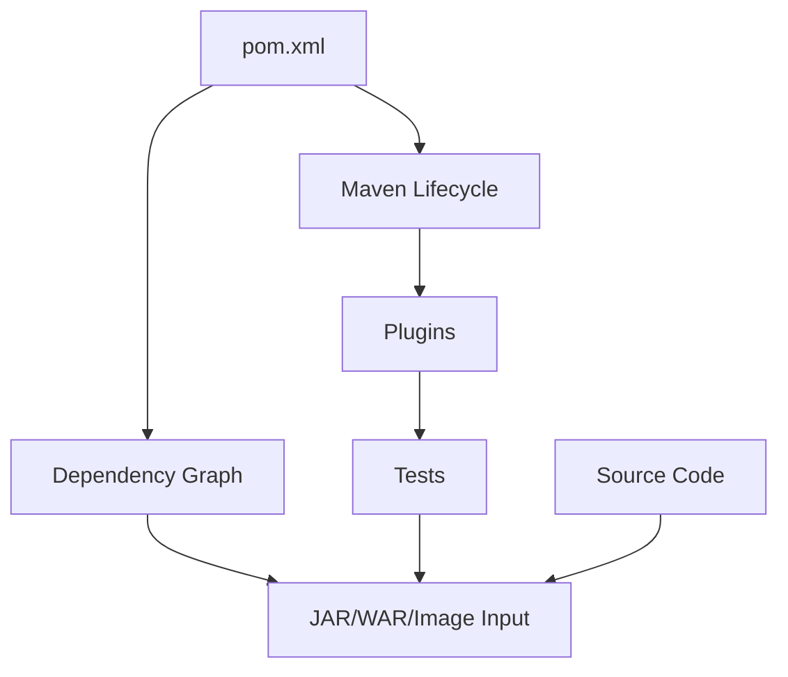
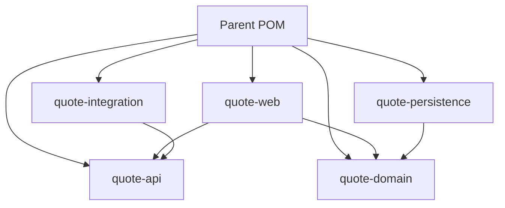

# Part 098 — Maven Lifecycle, Dependency Management, and Multi-Module Projects

> Fokus part ini: memahami Maven bukan sebagai “command untuk build”, tetapi sebagai build system, dependency resolver, lifecycle orchestrator, plugin runner, artifact producer, dan supply-chain boundary untuk Java enterprise services.

Catatan penting:

```text
This part does not assume CSG uses Maven only, a specific parent POM, a specific
internal artifact repository, a specific BOM, a specific CI runner, or a specific
release plugin.

Treat parent POM structure, internal BOMs, repository governance, plugin versions,
artifact signing, and release workflow as internal verification items.
```

Di sistem enterprise, build bukan detail kecil.

Build menentukan:

```text
which code is compiled
which dependencies are included
which versions win during conflict resolution
which tests run
which generated sources exist
which artifact is deployed
which vulnerabilities enter the runtime
which transitive libraries are trusted
```

Senior engineer harus bisa membaca `pom.xml` seperti membaca architecture diagram.

---

## 1. Mental Model: Maven as Build Graph + Dependency Graph

Maven mengelola dua graph besar:

```text
1. Build lifecycle graph
2. Dependency graph
```



Jika build salah, runtime salah.

Contoh:

```text
wrong Jersey version
wrong Jackson provider
conflicting jakarta/javax dependency
old PostgreSQL driver
transitive vulnerable library
plugin generating stale sources
test skipped by wrong profile
WAR/JAR packaging mismatch
```

---

## 2. Maven Coordinate Model

Artifact Maven diidentifikasi oleh coordinate.

```xml
<groupId>com.example</groupId>
<artifactId>quote-service</artifactId>
<version>1.2.3</version>
<packaging>jar</packaging>
```

Mental model:

```text
groupId    = organization / namespace
artifactId = module / artifact name
version    = release identity
packaging  = artifact type and lifecycle behavior
```

Enterprise concern:

```text
Is artifact identity stable?
Is versioning consistent?
Is snapshot allowed in production?
Is artifact traceable back to commit/build?
```

---

## 3. Maven Standard Directory Layout

Common layout:

```text
src/main/java
src/main/resources
src/test/java
src/test/resources
pom.xml
```

Generated code may appear under:

```text
target/generated-sources
```

Enterprise codebase may also contain:

```text
src/integration-test/java
src/contract-test/java
src/testFixtures/java
src/main/openapi
src/main/proto
src/main/avro
src/main/docker
```

Do not assume all tests under `src/test/java` have the same cost or purpose.

---

## 4. Maven Lifecycle

Maven lifecycle adalah urutan phase.

Common phases:

```text
validate
compile
test
package
verify
install
deploy
```

Meaning:

| Phase | Purpose |
|---|---|
| validate | validate project structure/config |
| compile | compile main code |
| test | run unit tests |
| package | build artifact |
| verify | run checks/integration tests |
| install | install artifact to local repository |
| deploy | publish artifact to remote repository |

Important:

```text
Running mvn package also runs earlier phases.
Running mvn verify runs test and package before verify.
Running mvn deploy runs almost everything before publishing.
```

---

## 5. Lifecycle vs Plugin Goals

Maven phase is not the same as plugin goal.

```bash
mvn test
```

Runs lifecycle up to `test`.

```bash
mvn surefire:test
```

Runs a specific plugin goal.

Example plugin binding:

```xml
<plugin>
  <groupId>org.apache.maven.plugins</groupId>
  <artifactId>maven-surefire-plugin</artifactId>
  <version>${maven-surefire-plugin.version}</version>
</plugin>
```

Senior review question:

```text
Which plugin goal is bound to which lifecycle phase?
```

This matters because tests/checks may not run when engineers think they run.

---

## 6. Surefire vs Failsafe

Common convention:

```text
maven-surefire-plugin -> unit tests during test phase
maven-failsafe-plugin -> integration tests during integration-test/verify phases
```

Naming conventions often look like:

```text
*Test.java      -> unit test
*IT.java        -> integration test
*ITCase.java    -> integration test
```

But this is convention, not universal truth.

Internal verification matters.

Check:

```text
Which plugin runs which tests?
Are integration tests accidentally skipped?
Are slow tests mixed with unit tests?
Are flaky tests retried silently?
Are test profiles required?
```

---

## 7. Dependency Declaration

Basic dependency:

```xml
<dependency>
  <groupId>org.glassfish.jersey.core</groupId>
  <artifactId>jersey-server</artifactId>
  <version>${jersey.version}</version>
</dependency>
```

Dependency scope matters.

| Scope | Meaning |
|---|---|
| compile | available at compile and runtime |
| provided | needed to compile, provided by runtime/container |
| runtime | not needed to compile, needed at runtime |
| test | only for tests |
| import | used for BOM import in dependencyManagement |

Common enterprise mistake:

```text
Library should be provided by container but is bundled into app.
Library should be runtime but missing from artifact.
Test dependency leaks into production packaging.
Conflicting API and implementation dependencies coexist.
```

---

## 8. Provided Scope and Jakarta/Servlet Runtimes

For Servlet/Jakarta APIs, `provided` scope is common when runtime supplies API/classes.

Example:

```xml
<dependency>
  <groupId>jakarta.servlet</groupId>
  <artifactId>jakarta.servlet-api</artifactId>
  <version>${jakarta.servlet.version}</version>
  <scope>provided</scope>
</dependency>
```

But whether `provided` is correct depends on packaging/runtime:

```text
WAR deployed into servlet container:
  container may provide servlet API

Standalone shaded/uber JAR:
  application may need runtime libraries bundled

Embedded server:
  app likely includes server implementation
```

Internal verification:

```text
Is this service deployed as WAR, JAR, or container image?
Does the runtime provide Jakarta APIs?
Does the application bundle implementation libraries?
```

---

## 9. Dependency Management

`dependencyManagement` centralizes versions.

```xml
<dependencyManagement>
  <dependencies>
    <dependency>
      <groupId>org.glassfish.jersey</groupId>
      <artifactId>jersey-bom</artifactId>
      <version>${jersey.version}</version>
      <type>pom</type>
      <scope>import</scope>
    </dependency>
  </dependencies>
</dependencyManagement>
```

Then child modules can omit versions:

```xml
<dependency>
  <groupId>org.glassfish.jersey.core</groupId>
  <artifactId>jersey-server</artifactId>
</dependency>
```

This improves consistency.

But it can hide risk:

```text
version changes affect many modules
BOM import order matters
transitive dependencies may still conflict
child modules may override versions locally
```

---

## 10. BOMs

BOM means Bill of Materials.

Purpose:

```text
align versions across related artifacts
avoid manually versioning each dependency
reduce incompatible dependency combinations
```

Common examples:

```text
Jersey BOM
Jackson BOM
Netty BOM
AWS SDK BOM
Azure SDK BOM
Testcontainers BOM
OpenTelemetry BOM
```

Senior review question:

```text
Are related libraries version-aligned by a BOM, or are versions manually drifting?
```

Drift example:

```text
jackson-databind 2.x.a
jackson-core 2.x.b
jackson-annotations 2.x.c
```

This may work.
It may also create subtle runtime bugs.

---

## 11. Transitive Dependency Resolution

Maven pulls transitive dependencies.

```text
A depends on B.
B depends on C.
A receives C transitively.
```

Conflict resolution is not magic.

Maven uses nearest-wins mediation in the dependency tree.

This means dependency order and path depth can affect selected version.

Use:

```bash
mvn dependency:tree
```

Useful variants:

```bash
mvn dependency:tree -Dincludes=com.fasterxml.jackson.core
mvn dependency:tree -Dverbose
mvn dependency:analyze
```

When debugging runtime classpath issues, dependency tree is first-class evidence.

---

## 12. Common Classpath Failure Modes

Failure modes:

```text
NoClassDefFoundError
ClassNotFoundException
NoSuchMethodError
NoSuchFieldError
LinkageError
ServiceLoader provider not found
wrong MessageBodyWriter selected
jakarta/javax mismatch
multiple logging bindings
multiple JSON providers
```

Example:

```text
NoSuchMethodError usually means:
  code compiled against one version
  runtime loaded another version
```

Do not fix by random version bump.

Debug with:

```text
mvn dependency:tree
runtime artifact inspection
container classloader behavior
packaging structure
server-provided libraries
```

---

## 13. Exclusions

Sometimes a transitive dependency must be excluded.

```xml
<dependency>
  <groupId>some.group</groupId>
  <artifactId>some-library</artifactId>
  <exclusions>
    <exclusion>
      <groupId>conflicting.group</groupId>
      <artifactId>conflicting-artifact</artifactId>
    </exclusion>
  </exclusions>
</dependency>
```

Exclusion is a sharp tool.

It can fix conflict.
It can also remove something required at runtime.

Review questions:

```text
Why is exclusion needed?
What dependency provides replacement?
Is this documented?
Is there a test proving runtime still works?
Is this exclusion local or should it be central?
```

---

## 14. Plugin Management

`pluginManagement` centralizes plugin versions/config but does not automatically execute plugins unless declared/bound.

```xml
<build>
  <pluginManagement>
    <plugins>
      <plugin>
        <groupId>org.apache.maven.plugins</groupId>
        <artifactId>maven-compiler-plugin</artifactId>
        <version>${maven-compiler-plugin.version}</version>
      </plugin>
    </plugins>
  </pluginManagement>
</build>
```

Common plugins:

```text
maven-compiler-plugin
maven-surefire-plugin
maven-failsafe-plugin
maven-enforcer-plugin
maven-dependency-plugin
maven-jar-plugin
maven-war-plugin
maven-shade-plugin
jacoco-maven-plugin
spotless/checkstyle/pmd/spotbugs plugins
openapi/protobuf/avro generation plugins
jib/docker plugins
```

Plugin versions are supply-chain inputs too.

---

## 15. Maven Compiler and Java 17+

For Java 17+, compiler configuration should be explicit.

Example:

```xml
<plugin>
  <groupId>org.apache.maven.plugins</groupId>
  <artifactId>maven-compiler-plugin</artifactId>
  <configuration>
    <release>17</release>
  </configuration>
</plugin>
```

`release` is usually better than just `source` and `target` because it constrains API availability.

Review questions:

```text
Is Java version explicit?
Does CI use the same JDK as local/dev/prod?
Are preview features enabled?
Are compiler warnings treated consistently?
```

---

## 16. Maven Enforcer

Maven Enforcer can prevent known bad states.

Examples:

```text
require Java version
ban duplicate classes
ban snapshot dependencies
require plugin versions
require dependency convergence
ban vulnerable/problematic dependencies
```

Example concept:

```xml
<plugin>
  <groupId>org.apache.maven.plugins</groupId>
  <artifactId>maven-enforcer-plugin</artifactId>
  <executions>
    <execution>
      <goals>
        <goal>enforce</goal>
      </goals>
    </execution>
  </executions>
</plugin>
```

Strong build systems fail fast.

Weak build systems allow ambiguity until production.

---

## 17. Multi-Module Maven Projects

Enterprise services often use multi-module builds.

Example structure:

```text
quote-parent/
  pom.xml
  quote-api/
  quote-domain/
  quote-persistence/
  quote-web/
  quote-integration/
  quote-contracts/
```

Parent POM:

```xml
<packaging>pom</packaging>

<modules>
  <module>quote-api</module>
  <module>quote-domain</module>
  <module>quote-persistence</module>
  <module>quote-web</module>
</modules>
```

Mental model:



Module boundaries should reflect architecture boundaries.

---

## 18. Good Module Boundaries

Potential module separation:

```text
api-contracts:
  DTOs, OpenAPI generated code, external API models

domain:
  business invariants, pure domain logic, state transitions

persistence:
  repositories, MyBatis mappers, DB models

web:
  JAX-RS resources, filters, exception mappers

integration:
  HTTP clients, Kafka producers/consumers, cloud SDK adapters

app:
  runtime bootstrap and wiring
```

Good dependency direction:

```text
web -> domain
persistence -> domain
integration -> domain or application ports
app -> all wiring modules
```

Bad direction:

```text
domain -> web
domain -> persistence implementation
domain -> JAX-RS annotations
domain -> Kafka client
domain -> cloud SDK
```

---

## 19. Multi-Module Anti-Patterns

Common anti-patterns:

```text
giant common module
domain module depends on infrastructure
every module depends on every other module
API DTO reused as DB entity
cyclic dependency hidden through test fixtures
parent POM has business dependencies
child modules override random dependency versions
module split follows team ownership but not architecture boundary
```

Danger of `common` module:

```text
common becomes dumping ground
coupling increases silently
transitive dependencies spread everywhere
security vulnerability blast radius grows
```

Senior review question:

```text
Does this module boundary reduce coupling, or just create folder complexity?
```

---

## 20. Generated Sources

Enterprise builds often generate sources from:

```text
OpenAPI
protobuf
Avro
JAXB/XSD
MapStruct
annotation processors
query DSL generators
```

Generated code concerns:

```text
Is generation deterministic?
Is generated code committed or generated during build?
Are generator versions pinned?
Is generated code reviewed?
Does generation happen before compile?
Does CI match local generation?
```

If generated code is stale, runtime contract can drift.

---

## 21. Annotation Processors

Java builds may use annotation processors:

```text
MapStruct
Lombok
JPA metamodel
AutoValue
Immutables
configuration processors
```

Risks:

```text
IDE build differs from Maven build
processor version mismatch
incremental compile issue
hidden generated methods
runtime behavior misunderstood
```

For MapStruct:

```text
Generated mapper should be inspected when mapping is critical.
```

---

## 22. Profiles

Maven profiles can change build behavior.

```xml
<profiles>
  <profile>
    <id>integration-tests</id>
    <activation>
      <property>
        <name>it</name>
      </property>
    </activation>
  </profile>
</profiles>
```

Profiles can control:

```text
test selection
generated sources
native builds
Docker image build
release signing
repository target
environment-specific config
```

Profile risk:

```text
local build differs from CI
release build differs from PR build
tests skipped unexpectedly
production artifact built with dev profile
```

Senior rule:

```text
Profiles should be explicit, documented, and visible in CI logs.
```

---

## 23. Reproducible Builds

A reproducible build means same inputs produce same outputs.

Important inputs:

```text
source commit
JDK version
Maven version
plugin versions
dependency versions
generated source versions
environment variables
build timestamp handling
repository content
```

Risks:

```text
floating versions
snapshot dependencies
unlocked plugin versions
build downloads changing artifacts
local-only generated code
machine-specific paths
```

Enterprise build should answer:

```text
Can we rebuild the artifact deployed last month from source and dependency evidence?
```

---

## 24. Artifact Packaging: JAR, WAR, Shaded JAR

Packaging matters.

| Packaging | Runtime model |
|---|---|
| JAR | standalone or library artifact |
| WAR | deployed into servlet/application server |
| shaded/uber JAR | bundles dependencies into one artifact |

JAX-RS runtime impact:

```text
WAR may rely on container-provided Servlet/Jakarta APIs.
Standalone JAR may bundle embedded server/Jersey/Grizzly/etc.
Shaded JAR can break service discovery if not configured carefully.
```

Shading risks:

```text
duplicate resources
lost META-INF/services entries
relocation issues
license/security scanning complexity
larger artifact
```

---

## 25. Artifact Repository and Versioning

Enterprise Maven build usually publishes artifacts to internal repository.

Questions:

```text
Where are artifacts published?
Are releases immutable?
Are snapshots allowed?
Is artifact promotion used?
Is artifact signed?
Is provenance tracked?
Can production artifact be traced to commit and CI run?
```

Versioning concerns:

```text
semantic versioning may or may not apply
internal services may use build metadata
contracts may version independently from implementation
container image tag may differ from Maven artifact version
```

Do not assume version meaning.
Verify internal standard.

---

## 26. Maven + CI Integration

Common CI commands:

```bash
mvn -B clean verify
mvn -B -DskipTests package
mvn -B -P integration-tests verify
mvn -B deploy
```

`-B` means batch mode.

Review CI logs for:

```text
active profiles
JDK version
Maven version
skipped tests
plugin versions
repository URLs
warnings ignored
dependency resolution changes
```

Build failure investigation should start from logs and effective POM.

Commands:

```bash
mvn help:effective-pom
mvn help:active-profiles
mvn dependency:tree
mvn -X validate
```

---

## 27. Build Performance

Slow builds reduce feedback quality.

Common causes:

```text
too many integration tests in PR gate
no dependency cache
code generation repeated unnecessarily
large multi-module graph
poor test isolation
unbounded parallelism
slow remote repository
container startup per test class
```

Optimization options:

```text
separate fast and slow gates
parallel build carefully
cache Maven repository safely
reuse containers where appropriate
split modules by change impact
avoid unnecessary clean in local loop
```

But avoid false economy:

```text
Do not skip critical tests just to make CI green faster.
```

---

## 28. Supply Chain and Dependency Governance

Maven dependencies are supply-chain inputs.

Governance controls:

```text
approved repositories
dependency allow/deny list
SCA scanning
SBOM generation
license scanning
artifact signing
checksums
provenance
vulnerability exception workflow
```

Review questions:

```text
Can this dependency be trusted?
Is it maintained?
Does it bring risky transitive dependencies?
Is the license acceptable?
Is it already approved internally?
Can we avoid adding it?
```

Dependency addition should be treated as architecture change when it affects runtime.

---

## 29. Internal Verification Checklist

Verify these in the internal CSG codebase/platform:

```text
Build system
[ ] Is Maven the main build tool for this service?
[ ] Is there a parent POM?
[ ] Is there an internal BOM?
[ ] Which Maven version is used in CI?
[ ] Which JDK version is used in CI and production?
[ ] Are Maven wrapper files used?

Lifecycle and plugins
[ ] Which plugins are configured?
[ ] Are plugin versions pinned?
[ ] Are Surefire and Failsafe both used?
[ ] Which tests run in each phase?
[ ] Are generated sources created during Maven build?
[ ] Are OpenAPI/protobuf/Avro generation plugins used?
[ ] Is Maven Enforcer configured?

Dependencies
[ ] Are dependency versions centralized?
[ ] Are BOMs used for Jersey/Jackson/AWS/Azure/OTel/Testcontainers?
[ ] Are snapshots allowed?
[ ] Are dependency exclusions documented?
[ ] Are there jakarta/javax mixed dependencies?
[ ] Are there duplicate JSON providers or logging bindings?
[ ] Are vulnerable dependencies blocked?

Packaging
[ ] Is artifact JAR, WAR, shaded JAR, or container image input?
[ ] Does runtime provide Servlet/Jakarta APIs?
[ ] Are dependencies bundled correctly?
[ ] Is shading used?
[ ] Are META-INF/services resources preserved?

CI/release
[ ] What command runs on PR?
[ ] What command runs on release?
[ ] Are profiles explicit in CI logs?
[ ] Where are artifacts published?
[ ] Are artifacts immutable?
[ ] Is artifact signing/provenance used?
[ ] Is SBOM generated?
```

---

## 30. PR Review Checklist

```text
Dependency changes
[ ] Is the new dependency necessary?
[ ] Is version managed centrally?
[ ] Is it compatible with existing Jakarta/Jersey/Jackson stack?
[ ] Does it introduce risky transitive dependencies?
[ ] Does it pass SCA/license policy?
[ ] Is there an exclusion? If yes, is it justified?

Plugin/build changes
[ ] Is plugin version pinned?
[ ] Is lifecycle phase correct?
[ ] Does this change local/CI/release behavior consistently?
[ ] Are generated sources deterministic?
[ ] Are tests accidentally skipped?

Module changes
[ ] Does module boundary match architecture boundary?
[ ] Is dependency direction clean?
[ ] Is common module avoided or controlled?
[ ] Does domain stay free of infrastructure dependency?

Packaging changes
[ ] Is artifact type correct for runtime?
[ ] Are provided/runtime scopes correct?
[ ] Is classpath conflict checked?
[ ] Is service discovery affected by shading?

CI changes
[ ] Is feedback still fast enough?
[ ] Are critical gates preserved?
[ ] Are profiles visible?
[ ] Are flaky tests not hidden by rerun-only policy?
```

---

## 31. Senior Engineer Heuristics

```text
A pom.xml is architecture.
A dependency is a supply-chain decision.
A plugin is executable code in your build.
A parent POM can enforce consistency or hide coupling.
A BOM reduces drift but can widen blast radius.
A module boundary should reduce coupling, not decorate folders.
A provided scope is only correct if the runtime really provides it.
A skipped test is a production risk unless explicitly justified.
```

Most useful Maven commands:

```bash
mvn clean verify
mvn help:effective-pom
mvn help:active-profiles
mvn dependency:tree
mvn dependency:analyze
mvn -DskipTests package
mvn -P integration-tests verify
```

Use them as evidence.

---

## 32. Summary

Maven controls how Java source becomes deployable artifact.

For JAX-RS enterprise services, Maven determines:

```text
runtime dependencies
Jakarta/Jersey compatibility
test execution
code generation
artifact packaging
security posture
CI/release behavior
```

Senior engineers do not treat build files as boilerplate.

They review them as part of the system architecture.
