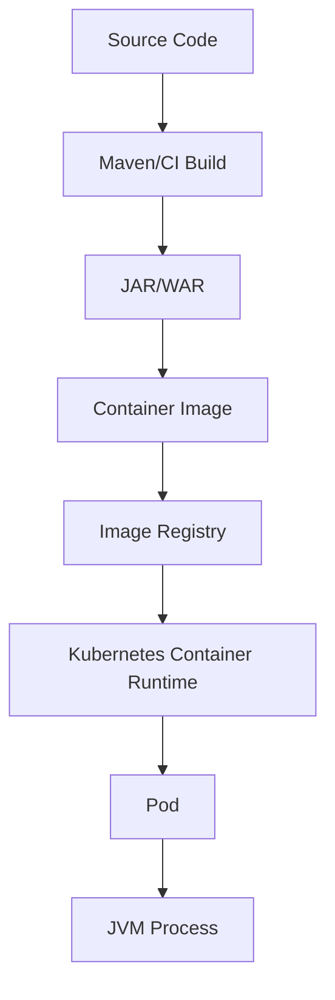

# Part 099 — Docker Image Design for Java/JAX-RS Services

> Fokus part ini: memahami container image bukan sebagai “cara menjalankan JAR”, tetapi sebagai runtime contract yang menentukan security posture, filesystem behavior, dependency surface, startup semantics, observability hooks, dan repeatability deployment.

Catatan penting:

```text
This part does not assume CSG Quote & Order uses a specific base image,
a specific Dockerfile style, a specific image registry, distroless images,
Buildpacks, Jib, Docker multi-stage builds, or a specific runtime user model.

Treat Dockerfile structure, base image, registry, scanning tools, artifact signing,
and runtime hardening policy as internal verification items.
```

Untuk Java/JAX-RS service, Docker image adalah boundary antara build engineering dan runtime operations.

Image yang buruk dapat menyebabkan:

```text
large attack surface
slow cold start
inconsistent timezone/locale behavior
wrong CA certificates
permission failure at runtime
heap/native memory mismatch
hidden writable filesystem dependency
unnecessary shell/debug tool exposure
hard-to-patch OS vulnerabilities
untraceable deployment artifact
```

Senior engineer harus bisa mereview Dockerfile dengan pertanyaan sederhana:

```text
Can this image be built reproducibly?
Can it run safely as non-root?
Can it be patched quickly?
Can it expose only what the service needs?
Can it fail predictably?
Can operators debug it without weakening production security?
```

---

## 1. Mental Model: Container Image as Runtime Filesystem + Process Contract

Docker image bukan VM penuh.

Image adalah:

```text
read-only filesystem layers
metadata
entrypoint/command
environment defaults
working directory
user/group
exposed port declaration
labels
```

Saat container berjalan, platform menambahkan:

```text
writable container layer
network namespace
process namespace
cgroup limits
mounted volumes/secrets/config
runtime environment variables
security context
```



Key point:

```text
A container image should contain what the process needs to start and run.
Runtime configuration should generally be injected by platform, not baked into image.
```

---

## 2. What Belongs in the Image

For Java/JAX-RS services, image usually contains:

```text
JRE/JDK runtime or custom runtime
application artifact
startup script or direct java command
trusted CA certificates
minimal OS files required by JVM/native libraries
optional diagnostics hooks
metadata labels
```

It should usually not contain:

```text
production secrets
environment-specific config
developer credentials
local test data
source code unless required by runtime
build tool caches
unused package managers
SSH keys
large debug tools by default
```

Bad smell:

```dockerfile
COPY application-prod.properties /app/application.properties
COPY ~/.aws /root/.aws
COPY target/ /app/
```

Reason:

```text
The image becomes environment-specific, hard to promote, and risky to share.
```

Better model:

```text
same image promoted across environments
runtime config injected by environment
image digest identifies executable code
config identity tracked separately
```

---

## 3. JAR, WAR, and Runtime Packaging

Java/JAX-RS services can be packaged in several ways.

Common patterns:

| Pattern | Typical Runtime | Image Shape |
|---|---|---|
| Executable JAR | embedded server / launcher | JRE + app JAR |
| WAR | servlet container | Tomcat/Jetty/GlassFish image + WAR |
| exploded app | custom launcher | classes/libs/resources copied separately |
| Jib/Buildpacks | generated image | managed layering |

Questions to ask:

```text
Does the app start with java -jar?
Does it deploy as WAR into a servlet container?
Is Jersey embedded in the service?
Is there an external app server image?
Does the image contain Tomcat/Jetty/GlassFish/Grizzly?
```

Internal verification matters.

Do not infer runtime from JAX-RS annotations alone.

A class with:

```java
@Path("/quotes")
public class QuoteResource {
    @GET
    public Response listQuotes() { ... }
}
```

could run inside:

```text
Tomcat + Jersey servlet
Jetty + Jersey servlet
GlassFish
embedded Grizzly
custom platform launcher
```

---

## 4. Basic Dockerfile Shape for Executable JAR

A simple executable JAR image may look like this:

```dockerfile
FROM eclipse-temurin:17-jre

WORKDIR /app

COPY target/quote-service.jar /app/quote-service.jar

EXPOSE 8080

ENTRYPOINT ["java", "-jar", "/app/quote-service.jar"]
```

This is understandable but incomplete for production review.

Questions:

```text
Which base image variant?
Is it patched?
Is it root?
Are JVM options configurable?
Is timezone/locale expected?
Are CA certs present?
Is the artifact verified?
Are labels added?
Is the image scanned?
```

A more explicit shape:

```dockerfile
FROM eclipse-temurin:17-jre

LABEL org.opencontainers.image.title="quote-service"
LABEL org.opencontainers.image.description="JAX-RS quote service"
LABEL org.opencontainers.image.source="internal-repo-placeholder"
LABEL org.opencontainers.image.revision="build-arg-placeholder"

RUN groupadd --system app && useradd --system --gid app --home-dir /app app

WORKDIR /app
COPY --chown=app:app target/quote-service.jar /app/quote-service.jar

USER app

EXPOSE 8080

ENV JAVA_OPTS=""
ENTRYPOINT ["sh", "-c", "exec java $JAVA_OPTS -jar /app/quote-service.jar"]
```

But even this has trade-offs.

Using shell in `ENTRYPOINT` enables env var expansion, but introduces shell dependency.

A shell-less entrypoint is cleaner:

```dockerfile
ENTRYPOINT ["java", "-jar", "/app/quote-service.jar"]
```

Then JVM options must be injected by supported JVM env variables such as:

```text
JAVA_TOOL_OPTIONS
JDK_JAVA_OPTIONS
```

Internal platform standard decides which is acceptable.

---

## 5. Multi-Stage Build

Multi-stage builds separate build environment from runtime environment.

Example:

```dockerfile
FROM maven:3.9-eclipse-temurin-17 AS build
WORKDIR /src
COPY pom.xml .
COPY src ./src
RUN mvn -B -DskipTests package

FROM eclipse-temurin:17-jre
WORKDIR /app
COPY --from=build /src/target/quote-service.jar /app/quote-service.jar
USER 10001
ENTRYPOINT ["java", "-jar", "/app/quote-service.jar"]
```

Benefit:

```text
build tools do not exist in final image
runtime image is smaller
attack surface is reduced
artifact is produced in controlled build stage
```

Risk:

```text
Docker build may bypass CI Maven cache/governance
build may behave differently from CI command
dependency download inside Docker may be slow/non-reproducible
secret access during build may leak into layers
```

Enterprise decision:

```text
Some organizations build artifact in CI first, then copy it into image.
Others use Docker multi-stage as the build itself.
Either can work, but the source of truth must be explicit.
```

---

## 6. Layering Strategy for Java Artifacts

A fat JAR copied as one file creates a coarse layer:

```dockerfile
COPY target/app.jar /app/app.jar
```

Any code change invalidates the entire app layer.

Alternative: split dependencies and application classes.

```text
/app/libs/*.jar
/app/classes
/app/resources
```

Potential benefits:

```text
better cache reuse
faster rebuilds
clearer dependency/application separation
smaller incremental transfer
```

Potential costs:

```text
more complex build
classpath correctness risk
framework-specific packaging assumptions
harder local reproduction if generated incorrectly
```

Example classpath style:

```dockerfile
COPY target/dependency /app/libs
COPY target/classes /app/classes

ENTRYPOINT ["java", "-cp", "/app/classes:/app/libs/*", "com.example.Main"]
```

Review question:

```text
Is the image optimized for build speed, runtime simplicity, or both?
```

Do not optimize layering blindly if it weakens reproducibility.

---

## 7. Base Image Selection

Base image affects:

```text
JVM distribution
OS package surface
glibc vs musl compatibility
CA certificates
timezone database
security patch cadence
debug capability
image size
scanner findings
```

Common categories:

| Category | Example Use | Trade-off |
|---|---|---|
| Full JDK | build/debug | large, more tools |
| JRE | runtime | smaller than JDK |
| slim/minimal | production runtime | fewer tools, lower surface |
| distroless | hardened runtime | harder interactive debugging |
| app server image | WAR deployment | inherits server config/surface |

Base image review should ask:

```text
Who owns patching this base image?
How quickly can critical CVEs be fixed?
Is the base image approved internally?
Does it include required CA certs and timezone data?
Does it support the JVM distribution expected by performance tests?
```

Bad pattern:

```dockerfile
FROM latest
```

Better:

```dockerfile
FROM eclipse-temurin:17.0.XX_YY-jre
```

Best in production is often digest-pinned through an internal base image pipeline:

```dockerfile
FROM internal-registry/java17-runtime@sha256:...
```

Digest pinning improves reproducibility but requires an update process.

---

## 8. JDK vs JRE vs Custom Runtime

For runtime images, you usually do not need a full JDK.

But a full JDK can be useful when:

```text
production diagnostics require jcmd/jstack/jmap
heap/thread dump tools are expected inside container
attach mechanism is enabled
support team relies on JVM tools in image
```

JRE/minimal runtime is useful when:

```text
attack surface must be reduced
image size matters
runtime is simple
external diagnostics sidecars/tools exist
```

Custom runtime via `jlink` can reduce image size, but adds complexity:

```text
module detection
missing module risk
security update process
less common operational knowledge
```

Decision rule:

```text
Prefer the smallest runtime that still supports required operations, diagnostics,
security patching, and platform standards.
```

---

## 9. Running as Non-Root

Production containers should generally not run as root unless explicitly justified.

Risk of root:

```text
filesystem write escalation inside container
weaker defense-in-depth
larger blast radius for container escape paths
policy violation in restricted clusters
```

Dockerfile example:

```dockerfile
RUN groupadd --system app \
 && useradd --system --gid app --home-dir /app app

WORKDIR /app
COPY --chown=app:app target/app.jar /app/app.jar
USER app
```

Numeric UID is often better for Kubernetes compatibility:

```dockerfile
USER 10001:10001
```

Kubernetes can enforce:

```yaml
securityContext:
  runAsNonRoot: true
  runAsUser: 10001
  allowPrivilegeEscalation: false
```

Review checklist:

```text
Does the image run as non-root?
Does the app need write permission anywhere?
Are writable directories explicit?
Does Kubernetes securityContext align with image USER?
```

---

## 10. Filesystem Discipline

A production Java service should not assume arbitrary writable filesystem access.

Common writable needs:

```text
temporary upload files
JVM temporary directory
heap dump directory
log file directory if not logging to stdout
application-generated cache
```

Prefer explicit directories:

```dockerfile
RUN mkdir -p /app/tmp /app/dumps \
 && chown -R 10001:10001 /app/tmp /app/dumps

ENV JAVA_TOOL_OPTIONS="-Djava.io.tmpdir=/app/tmp"
```

Kubernetes may use:

```yaml
volumes:
  - name: tmp
    emptyDir: {}

volumeMounts:
  - name: tmp
    mountPath: /app/tmp
```

Bad smell:

```text
application writes into current working directory without policy
application writes logs to files only
application assumes /tmp is unlimited
heap dumps written into container layer until disk exhaustion
```

---

## 11. Logs: stdout/stderr vs Files

Container-native logging expects application logs to go to stdout/stderr.

Preferred model:

```text
application writes structured logs to stdout/stderr
container runtime captures logs
platform ships logs to central backend
```

Avoid defaulting to:

```text
/app/logs/*.log only
rotating file appender only
logs inside ephemeral container filesystem
```

Exception:

```text
Some legacy app servers or compliance systems may require file logs.
If so, mount volumes and define retention/rotation explicitly.
```

For JAX-RS services:

```text
request logs
error logs
audit logs
security logs
access logs
```

must have clear destinations.

---

## 12. Ports, Health Endpoints, and Startup Contract

`EXPOSE` is documentation metadata. It does not publish the port by itself.

Image should align with platform config:

```dockerfile
EXPOSE 8080
```

Kubernetes should align:

```yaml
ports:
  - containerPort: 8080
```

Health endpoints should be understood at service level:

```text
liveness  = should Kubernetes restart me?
readiness = should traffic be sent to me?
startup   = do I need more time before liveness applies?
```

Image design affects startup:

```text
large image pull time
slow classpath scan
slow app server boot
schema migration at startup
remote config fetch
JIT warmup
cache preloading
```

Do not make liveness probe fail during normal cold start.

---

## 13. ENTRYPOINT and Signal Handling

In containers, PID 1 signal behavior matters.

Bad pattern:

```dockerfile
ENTRYPOINT java -jar /app/app.jar
```

This shell form may obscure signal handling.

Better exec form:

```dockerfile
ENTRYPOINT ["java", "-jar", "/app/app.jar"]
```

If shell is required:

```dockerfile
ENTRYPOINT ["sh", "-c", "exec java $JAVA_OPTS -jar /app/app.jar"]
```

The `exec` is important so the JVM receives termination signals.

Failure mode:

```text
Kubernetes sends SIGTERM
shell does not forward properly
JVM does not shutdown gracefully
in-flight requests are killed
Kafka consumer does not commit/close cleanly
connection pool does not close
```

Review checklist:

```text
Does ENTRYPOINT use exec form or exec inside shell?
Does app handle SIGTERM?
Does platform terminationGracePeriodSeconds match shutdown time?
```

---

## 14. JVM Options Injection

Do not bake all JVM options permanently unless they are part of runtime contract.

Common injection patterns:

```text
JAVA_TOOL_OPTIONS
JDK_JAVA_OPTIONS
container env var expanded by shell entrypoint
config map / deployment manifest
platform standard wrapper
```

Example:

```yaml
env:
  - name: JAVA_TOOL_OPTIONS
    value: >-
      -XX:MaxRAMPercentage=75
      -XX:+ExitOnOutOfMemoryError
      -Djava.security.egd=file:/dev/urandom
```

Do not hide critical JVM flags in random startup scripts.

Review questions:

```text
Where are JVM flags defined?
Are flags environment-specific?
Are they visible in deployment manifests?
Are they audited during incident review?
Are they consistent with memory limits?
```

Part 100 will go deeper on JVM memory and GC inside containers.

---

## 15. CA Certificates and TLS Trust

Outbound calls often fail because container trust store is not aligned.

Common symptoms:

```text
PKIX path building failed
certificate_unknown
unable to find valid certification path
works locally, fails in pod
works in one environment, fails in another
```

Sources of trust:

```text
OS CA bundle
JVM cacerts
custom truststore
service mesh injected certificates
enterprise root CA
```

Image review:

```text
Does the base image contain CA certificates?
Does Java trust the same CA set as OS tools?
Are enterprise CAs injected at build time or runtime?
Is truststore update process documented?
```

Do not solve certificate issues by disabling TLS validation.

Bad:

```java
trustAllCertificates();
disableHostnameVerification();
```

That turns network encryption into unauthenticated transport.

---

## 16. Timezone and Locale

Most services should store and process timestamps in UTC internally.

But image timezone/locale can still affect:

```text
log timestamp rendering
default JVM timezone
date parsing fallback
legacy library behavior
report generation
string collation behavior
```

Make default explicit if needed:

```dockerfile
ENV TZ=UTC
ENV JAVA_TOOL_OPTIONS="-Duser.timezone=UTC"
```

But do not assume setting `TZ` alone controls all Java behavior.

Review checklist:

```text
Is service expected to run in UTC?
Does code use explicit ZoneId/Clock?
Does container include timezone database if local zones are used?
Are logs normalized?
```

This connects directly to Part 051 on date/time/currency/precision.

---

## 17. Environment Variables: Useful but Dangerous

Environment variables are useful for non-secret runtime config.

They are risky for secrets because:

```text
they can be visible in process metadata
they can leak through diagnostics
they are often copied into crash reports
many frameworks log environment at startup
```

Use platform-approved secret injection.

Examples:

```text
mounted secret file
external secret operator
cloud secret manager SDK
service mesh identity
workload identity
```

If env vars are used:

```text
redact them in logs
avoid dumping full environment
separate secret and non-secret config
validate required config at startup
```

---

## 18. Image Labels and Traceability

Production image should be traceable.

Useful labels:

```text
source repository
commit SHA
build timestamp
version
vendor/team
license/SBOM pointer
base image identity
```

Example:

```dockerfile
ARG VCS_REF
ARG BUILD_DATE
ARG VERSION

LABEL org.opencontainers.image.revision="$VCS_REF"
LABEL org.opencontainers.image.created="$BUILD_DATE"
LABEL org.opencontainers.image.version="$VERSION"
```

Traceability matters during incident:

```text
Which commit is running?
Which base image was used?
Which dependency set exists?
Which vulnerability scan applied?
Which environment received this digest?
```

Prefer deployment by digest when possible:

```text
image: registry.example.com/quote-service@sha256:...
```

Tags are mutable unless registry policy prevents mutation.

---

## 19. Image Scanning and Vulnerability Response

Image scanning detects known vulnerabilities in:

```text
OS packages
language dependencies if scanner supports them
base image layers
installed tools
```

Scanning is not enough.

You also need:

```text
severity policy
false positive workflow
base image patch process
dependency update ownership
exception expiry
release gate
SBOM linkage
```

Typical failure mode:

```text
A critical CVE exists in base image.
Application team cannot patch because base image is owned elsewhere.
Release is blocked without clear exception process.
```

Senior review question:

```text
Can this team patch a critical vulnerability in less than the required SLA?
```

---

## 20. Distroless and Minimal Images

Distroless/minimal images reduce attack surface by excluding shell/package managers and most OS utilities.

Benefits:

```text
smaller image
fewer packages
less interactive attack surface
fewer scanner findings
stronger production posture
```

Costs:

```text
harder exec-based debugging
no shell for emergency inspection
certificate/timezone customization may be different
startup scripts may not work
operators need alternative diagnostics
```

Distroless is not automatically better if operational model is not ready.

Decision rule:

```text
Use minimal/distroless only when diagnostics, patching, truststore management,
and platform support are mature enough.
```

Internal verification:

```text
Does the company standard allow distroless?
Do runbooks assume shell access?
Are debug containers allowed?
Does platform support ephemeral containers?
```

---

## 21. App Server Images for WAR Deployment

If JAX-RS service is packaged as WAR, image may include an app server.

Example concept:

```dockerfile
FROM tomcat:10-jre17
COPY target/quote-service.war /usr/local/tomcat/webapps/ROOT.war
```

Review concerns:

```text
server version
servlet/Jakarta namespace compatibility
default apps removed?
management endpoints disabled?
server.xml hardened?
thread pool configured?
access logs controlled?
TLS terminated elsewhere?
```

WAR deployment makes the container image include two runtime layers:

```text
application code
app server code/config
```

This means vulnerabilities and operational behavior may come from the app server, not only the application.

---

## 22. Embedded Server Image for JAR Deployment

If the service uses embedded runtime, the image may simply run a JAR.

```text
Jersey + Grizzly embedded
Jersey + embedded servlet container
custom main class
framework launcher
```

Review concerns:

```text
who configures thread pool?
who owns graceful shutdown?
how are providers registered?
how is HTTP port configured?
how are access logs emitted?
how are TLS/proxy headers handled?
```

Executable JAR does not mean operational simplicity automatically.

The runtime responsibilities are just moved into application code.

---

## 23. Build-Time Secrets Are Dangerous

Avoid passing secrets during Docker build.

Bad pattern:

```dockerfile
ARG PRIVATE_REPO_TOKEN
RUN curl -H "Authorization: Bearer $PRIVATE_REPO_TOKEN" ...
```

Secrets can leak via:

```text
image layers
build logs
cache metadata
intermediate stages
CI environment snapshots
```

If build secrets are unavoidable, use platform-supported secret mount features and ensure they do not persist in final layers.

Better enterprise rule:

```text
Build uses authenticated CI dependency access.
Final image contains only runtime artifact.
No secret value is copied into image.
```

---

## 24. `.dockerignore` Matters

Without `.dockerignore`, build context may include sensitive or large files.

Typical `.dockerignore`:

```text
.git
.idea
.vscode
*.iml
target/
node_modules/
*.log
.env
*.pem
*.key
```

If the Dockerfile copies too broadly:

```dockerfile
COPY . /app
```

then accidental files can enter the image.

Review checklist:

```text
Is .dockerignore present?
Does build context include secrets?
Does Dockerfile copy explicit files only?
Does CI scan final image for unexpected files?
```

---

## 25. Healthcheck in Dockerfile vs Kubernetes Probes

Docker supports `HEALTHCHECK`, but Kubernetes usually uses its own probes.

For Kubernetes-targeted services, health is commonly defined in manifests:

```yaml
readinessProbe:
  httpGet:
    path: /health/ready
    port: 8080
```

Do not rely blindly on Dockerfile `HEALTHCHECK` if Kubernetes ignores or overrides it.

Review question:

```text
Where is the source of truth for health checks: Dockerfile, Helm chart,
Kubernetes manifest, platform template, or app server config?
```

Health endpoint design must match application lifecycle.

Readiness should fail when:

```text
service cannot safely receive traffic
critical dependency/config missing
schema incompatible
startup initialization incomplete
```

Liveness should not fail for normal dependency outage unless restart helps.

---

## 26. Debuggability Without Shipping a Weak Image

Production image should be hardened, but operations still need diagnostics.

Options:

```text
include minimal JVM diagnostic tools
use sidecar/ephemeral debug container
enable remote diagnostic endpoints carefully
capture thread dumps via signal/actuator/admin API
use platform log/metrics/tracing
```

Avoid:

```text
SSH daemon inside container
permanent debug port open in production
shell + package manager solely for convenience
verbose secrets in startup logs
```

Senior trade-off:

```text
A production image must be debuggable through approved operational paths,
not through ad-hoc insecure access.
```

---

## 27. Image Size: Optimize After Understanding

Small image is good, but not at the cost of correctness.

Image size affects:

```text
pull time
node cache pressure
rollout speed
registry storage
CVE surface
```

But unsafe optimization can remove:

```text
CA certificates
timezone database
fonts required by reports
native libraries
JVM diagnostic tools
```

Optimization order:

```text
1. Remove build tools from final image
2. Use appropriate runtime base
3. Avoid copying unnecessary files
4. Layer dependencies properly if useful
5. Consider minimal/distroless when operations can support it
```

---

## 28. Docker Image Failure Modes

Common production failures:

| Symptom | Likely Cause |
|---|---|
| Container exits immediately | bad entrypoint, missing artifact, wrong permission |
| CrashLoopBackOff | startup failure, probe failure, config error |
| Permission denied | non-root user cannot read/write path |
| TLS outbound failure | missing CA/incorrect truststore |
| OOMKilled | memory limit/JVM sizing mismatch |
| Slow rollout | large image, slow startup, pull throttling |
| Works locally but not in pod | env/config/network/securityContext difference |
| Cannot write temp file | read-only filesystem or missing writable dir |
| SIGTERM ignored | shell entrypoint without exec or no graceful shutdown |

---

## 29. Debugging Workflow

When container fails, do not guess.

Follow evidence:

```text
1. Inspect image metadata
2. Inspect container logs
3. Inspect Kubernetes events
4. Check exit code
5. Check entrypoint/command
6. Check mounted config/secrets
7. Check security context
8. Check filesystem permissions
9. Check probes
10. Check JVM flags and memory limits
```

Useful commands conceptually:

```bash
docker image inspect <image>
docker run --rm <image>
docker run --rm --entrypoint sh <image>
kubectl describe pod <pod>
kubectl logs <pod>
kubectl get events
```

In minimal/distroless images, `--entrypoint sh` may not work.

That is expected.

Use approved debug containers or platform tooling.

---

## 30. PR Review Checklist

Review Docker/image changes with this checklist:

```text
[ ] Is the base image approved and patched?
[ ] Is the runtime Java version correct?
[ ] Is the image environment-independent?
[ ] Are secrets excluded from image layers?
[ ] Is .dockerignore present and strict?
[ ] Does the image run as non-root?
[ ] Are writable directories explicit?
[ ] Is ENTRYPOINT signal-safe?
[ ] Are JVM options injected through platform standard?
[ ] Are CA certificates/truststore requirements handled?
[ ] Are timezone/locale assumptions explicit?
[ ] Are logs written to stdout/stderr or approved sink?
[ ] Is the image labeled for traceability?
[ ] Is image scanning integrated?
[ ] Is artifact signing/provenance handled?
[ ] Does image packaging match runtime architecture: JAR, WAR, app server?
[ ] Are health/probe expectations aligned with deployment manifests?
[ ] Is debugging possible through approved operational tooling?
```

---

## 31. Internal Verification Checklist

For CSG Quote & Order or any internal enterprise codebase, verify:

```text
[ ] Is packaging JAR, WAR, exploded app, or platform-specific artifact?
[ ] Which base image is used?
[ ] Is the base image centrally owned?
[ ] Is the runtime Java version Java 17+?
[ ] Is the runtime JDK, JRE, custom jlink runtime, or app server image?
[ ] Does the image include Tomcat, Jetty, GlassFish, Grizzly, or custom launcher?
[ ] Does the container run as root or non-root?
[ ] What UID/GID does Kubernetes expect?
[ ] Where are JVM flags defined?
[ ] Are `JAVA_TOOL_OPTIONS` or `JDK_JAVA_OPTIONS` used?
[ ] Is the image environment-independent?
[ ] Are production secrets ever copied into image layers?
[ ] Is `.dockerignore` present?
[ ] Are CA certificates or enterprise truststores required?
[ ] How is timezone configured?
[ ] Where do logs go?
[ ] Are audit/security logs handled differently from application logs?
[ ] Are image labels added for commit/build/version?
[ ] Are images deployed by tag or digest?
[ ] What scanner checks image vulnerabilities?
[ ] Is SBOM generated?
[ ] Is image/artifact signing required?
[ ] Is distroless/minimal image used or planned?
[ ] Do runbooks assume shell access inside container?
[ ] How are thread dumps and heap dumps captured?
[ ] Does Kubernetes securityContext align with Dockerfile USER?
[ ] Are health probes defined in image, chart, manifest, or platform template?
```

---

## 32. Senior-Level Heuristics

A good production image is boring.

It has:

```text
small enough runtime surface
explicit process command
non-root execution
no secrets
clear traceability
predictable filesystem behavior
stable Java runtime
approved base image
observable startup/shutdown behavior
repeatable build path
```

Avoid clever image design that only one person understands.

In enterprise systems, the image must be:

```text
buildable by CI
scannable by security tooling
promotable across environments
operable by SRE/platform teams
reviewable by senior engineers
recoverable during incidents
```

---

## 33. Key Takeaways

```text
1. Docker image is a production runtime contract, not just packaging.
2. Runtime config and secrets should not be baked into image.
3. Base image choice determines security, patching, and diagnostics posture.
4. Non-root runtime and explicit filesystem writes are default production expectations.
5. ENTRYPOINT must handle signals correctly for graceful shutdown.
6. JAR/WAR/app-server packaging must match actual JAX-RS runtime architecture.
7. Minimal/distroless images improve hardening only if operations can support debugging.
8. Image traceability, scanning, SBOM, signing, and provenance are part of supply chain control.
```

Part 100 continues from here: how the JVM behaves inside the container after the image starts.
