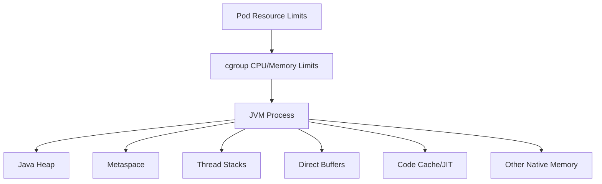
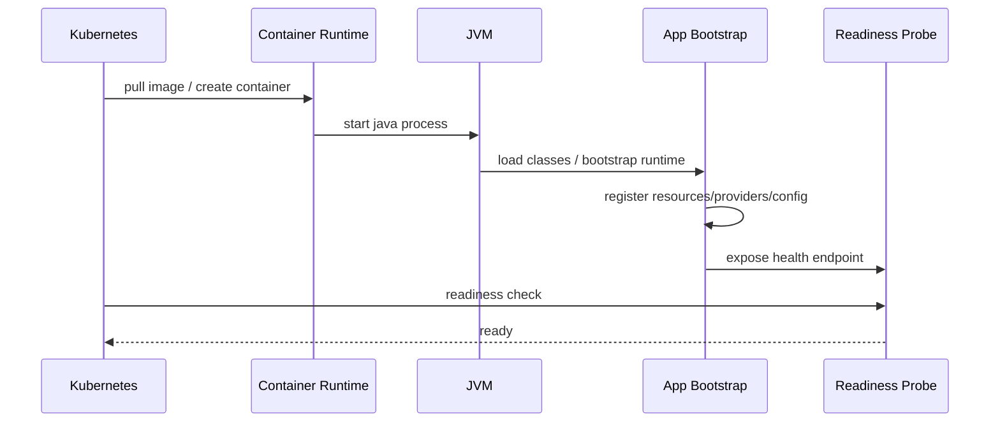

# Part 100 — JVM in Containers: Heap, Native Memory, GC, CPU, OOMKilled, Warmup

> Fokus part ini: memahami JVM di container sebagai runtime yang hidup di bawah cgroup limits, bukan sebagai proses bebas di server besar. Heap hanyalah satu bagian dari memory. CPU limit memengaruhi GC, JIT, thread scheduling, latency, dan startup. OOMKilled sering bukan Java `OutOfMemoryError`, tetapi keputusan kernel/platform.

Catatan penting:

```text
This part does not assume CSG uses a specific JVM distribution, GC algorithm,
heap percentage, Kubernetes resource policy, Java base image, container runtime,
or performance tuning standard.

Treat JVM flags, container limits, GC policy, memory sizing, CPU limits,
heap dump policy, and production diagnostics as internal verification items.
```

Container membuat JVM lebih predictable jika dikonfigurasi benar.

Container juga membuat JVM lebih mudah gagal jika memory/CPU dipahami secara dangkal.

Kesalahan umum:

```text
memory limit = heap size
CPU limit = harmless quota
OOMKilled = Java heap leak
more threads = more throughput
liveness failure = app bug
fast startup locally = fast startup in Kubernetes
```

Senior engineer harus melihat JVM containerized service sebagai sistem dengan beberapa budget:

```text
heap budget
native memory budget
thread stack budget
metaspace budget
code cache budget
direct buffer budget
GC CPU budget
JIT warmup budget
startup deadline budget
```

---

## 1. Mental Model: Container Limit Outside, JVM Budgets Inside



The container memory limit applies to the process as a whole.

It includes:

```text
Java heap
metaspace
thread stacks
direct byte buffers
mapped files
JIT code cache
GC structures
JNI/native libraries
class metadata
JVM internal allocations
application native allocations
```

Therefore:

```text
-Xmx must be smaller than container memory limit.
```

But “smaller” is not enough.

You need headroom for everything outside heap.

---

## 2. JVM Container Awareness

Modern JVMs are container-aware: they can read cgroup CPU and memory limits and adjust defaults.

But do not rely blindly on defaults.

Why:

```text
platform resource policies differ
container base image may use different JVM build
memory limit may be absent in local Docker
CPU limit can distort available processor count
JVM defaults may not match latency goals
native memory may be high for your workload
```

Verification commands conceptually:

```bash
java -XX:+PrintFlagsFinal -version | grep -E "MaxHeapSize|MaxRAM|UseContainerSupport|ActiveProcessorCount"
java -XshowSettings:system -version
java -XshowSettings:vm -version
```

Inside a running pod, check:

```text
what memory limit Kubernetes set
what CPU request/limit Kubernetes set
what JVM thinks the max heap is
what JVM thinks available processors are
```

---

## 3. Heap Sizing: Xmx vs MaxRAMPercentage

Two common approaches:

```text
fixed heap size: -Xmx1024m
percentage-based: -XX:MaxRAMPercentage=70
```

Fixed heap is explicit:

```yaml
env:
  - name: JAVA_TOOL_OPTIONS
    value: "-Xms512m -Xmx1024m"
```

Pros:

```text
predictable
simple to reason about
stable across environments
```

Cons:

```text
must align manually with container limit
bad if same manifest runs under different limits
can waste memory in small environments
```

Percentage-based heap adapts to container memory:

```yaml
env:
  - name: JAVA_TOOL_OPTIONS
    value: "-XX:InitialRAMPercentage=25 -XX:MaxRAMPercentage=70"
```

Pros:

```text
adapts to memory limit
useful across environments
less duplication between deployment and JVM flags
```

Cons:

```text
native memory headroom must still be modeled
percentage may be too aggressive for high-thread/direct-buffer apps
less obvious during review unless documented
```

Review rule:

```text
Heap sizing must be derived from container memory limit and non-heap headroom,
not copied from another service.
```

---

## 4. Native Memory Is Real Memory

Non-heap memory can be significant.

Sources:

```text
thread stacks
metaspace
code cache
direct buffers
NIO/network buffers
TLS/native crypto
compression libraries
JDBC driver/native allocations
Netty/Grizzly/Tomcat buffers if applicable
mapped files
JVM internal structures
```

Approximate model:

```text
container_memory_limit
  = heap
  + metaspace
  + thread_stack_total
  + direct_buffers
  + code_cache
  + JVM native overhead
  + OS/process overhead
  + safety margin
```

If memory limit is 1 GiB and `-Xmx` is 950 MiB, the container is likely fragile.

A safer starting shape could be:

```text
memory limit: 1024 MiB
heap max:     600-750 MiB
headroom:     274-424 MiB
```

But the correct value depends on workload.

Measure, do not guess.

---

## 5. Metaspace

Metaspace stores class metadata.

It grows with:

```text
number of loaded classes
frameworks and reflection
JAX-RS providers/resources
JSON/XML libraries
CDI/HK2 proxies
generated classes
classloader leaks
application server deployment model
```

Failure mode:

```text
java.lang.OutOfMemoryError: Metaspace
```

Container failure mode:

```text
process memory grows due to metaspace
kernel kills container before Java throws clear OOME
```

You can cap metaspace:

```text
-XX:MaxMetaspaceSize=256m
```

But capping too low causes startup/runtime failure.

Review questions:

```text
Is classloading stable after startup?
Does redeploy/reload happen in-process?
Are dynamic proxies/generated classes used heavily?
Is metaspace monitored?
```

---

## 6. Thread Stack Memory

Each Java thread consumes stack memory.

Default stack size depends on platform/JVM.

If a service creates many threads, memory rises outside heap.

Sources of threads:

```text
HTTP request workers
Jersey/Servlet container pools
Kafka consumers
JDBC pool housekeeper
scheduler threads
async executors
resilience library schedulers
OpenTelemetry exporters
GC threads
JIT compiler threads
```

Thread stack estimate:

```text
thread_stack_total = number_of_threads * stack_size
```

If 500 threads use 1 MiB stack each:

```text
~500 MiB native memory potential
```

You can configure stack size:

```text
-Xss512k
```

But too-small stack can cause:

```text
StackOverflowError
framework recursion failure
deep serialization/deserialization failure
```

Better first step:

```text
control thread pool sizes
avoid unbounded executors
measure thread count
```

---

## 7. Direct Buffers and Network I/O

Direct buffers are allocated outside Java heap.

They may be used by:

```text
NIO
HTTP clients
server connectors
Kafka clients
PostgreSQL/JDBC internals
TLS stacks
Netty-based libraries
file streaming
compression
```

Failure symptoms:

```text
java.lang.OutOfMemoryError: Direct buffer memory
container OOMKilled
latency spikes during streaming
memory not visible in heap histogram
```

Possible cap:

```text
-XX:MaxDirectMemorySize=128m
```

But capping too low can break high-throughput network or streaming workloads.

Senior review:

```text
If service streams files, handles multipart, uses Kafka, or heavy HTTP clients,
non-heap buffer budget must be considered.
```

---

## 8. Code Cache and JIT Memory

JIT compiles hot methods into native code stored in code cache.

Code cache matters for:

```text
long-running service throughput
warmup behavior
CPU usage after startup
latency stabilization
```

Failure symptoms:

```text
CodeCache is full warning
performance degradation
higher CPU
less optimized hot path
```

Usually you do not tune code cache first.

But for container memory budgeting, remember:

```text
JIT is not free.
```

---

## 9. Java 17 GC Options: Choosing for Workload

Java 17 commonly defaults to G1 GC for server workloads.

Common GC choices:

| GC | Use Case | Trade-off |
|---|---|---|
| G1 | balanced general-purpose service | good default, tunable pauses |
| ZGC | low-latency larger heaps | more advanced, verify support/perf |
| Shenandoah | low-latency workloads on supported builds | JVM distribution dependent |
| Serial | small/simple containers | low overhead, poor for larger services |

For enterprise JAX-RS services, first principles matter more than fashion:

```text
What is latency SLO?
What heap size?
What allocation rate?
What CPU limit?
What pause tolerance?
What throughput requirement?
```

Example G1 flag:

```text
-XX:+UseG1GC
-XX:MaxGCPauseMillis=200
```

But `MaxGCPauseMillis` is a goal, not a guarantee.

Do not tune GC without GC logs and latency measurements.

---

## 10. GC Logging in Containers

GC logs are essential for diagnosing memory and pause behavior.

Java 17 unified logging example:

```text
-Xlog:gc*,safepoint:file=/app/logs/gc.log:time,level,tags:filecount=5,filesize=20M
```

But file logging inside container needs explicit storage/rotation.

Alternative:

```text
-Xlog:gc*:stdout:time,level,tags
```

Trade-off:

```text
stdout integrates with platform logging
file logs can be easier to download/analyze but require volume/rotation
```

Review questions:

```text
Are GC logs enabled in performance environments?
Can they be enabled in production during incident?
Where do they go?
Can operators correlate GC pauses with request latency?
```

---

## 11. CPU Requests, Limits, and JVM Behavior

CPU request and limit are different.

```text
request = scheduling reservation signal
limit   = maximum CPU quota before throttling
```

CPU throttling affects:

```text
request latency
GC duration
JIT compilation
thread scheduling
startup time
Kafka polling
timeout behavior
```

Failure mode:

```text
Service has enough memory but high latency.
CPU throttling delays GC and request handling.
Timeouts trigger retries.
Retries increase CPU.
System enters cascading failure.
```

Review checklist:

```text
Is CPU limit set?
Is throttling monitored?
Does JVM see correct processor count?
Are GC/JIT threads too many for CPU quota?
Are timeouts calibrated for throttled environment?
```

Sometimes removing CPU limits while keeping requests can improve latency predictability, depending on platform policy.

Do not change this casually; verify internal Kubernetes standard.

---

## 12. ActiveProcessorCount

The JVM uses available processor count for internal sizing.

This can affect:

```text
GC threads
JIT compiler threads
ForkJoinPool parallelism
common pool behavior
framework defaults
```

You can override:

```text
-XX:ActiveProcessorCount=2
```

This is useful when:

```text
container CPU quota is interpreted unexpectedly
framework defaults create too many threads
performance tests need deterministic CPU model
```

But override is dangerous if copied blindly.

Review question:

```text
Is ActiveProcessorCount set because of measured behavior or cargo-cult tuning?
```

---

## 13. OOMKilled vs Java OutOfMemoryError

These are not the same.

Java `OutOfMemoryError` happens inside JVM:

```text
java.lang.OutOfMemoryError: Java heap space
java.lang.OutOfMemoryError: Metaspace
java.lang.OutOfMemoryError: Direct buffer memory
unable to create native thread
```

`OOMKilled` happens outside JVM:

```text
kernel/container runtime kills process because cgroup memory limit is exceeded
```

In Kubernetes:

```text
Last State: Terminated
Reason: OOMKilled
Exit Code: 137
```

If kernel kills the process, Java may not produce heap dump or clean logs.

Therefore:

```text
No heap dump does not mean no memory problem.
No Java OOME does not mean JVM was not memory-related.
```

---

## 14. OOM Diagnosis Workflow

When pod is OOMKilled:

```text
1. Check pod status and exit code
2. Check memory limit and actual memory usage
3. Check JVM heap max
4. Check GC logs if available
5. Check thread count
6. Check direct buffer/native memory indicators
7. Check recent traffic/file streaming/batch workload
8. Check deployment change: flags, image, dependency, config
9. Check whether heap dump exists
10. Check node pressure events
```

Kubernetes evidence:

```bash
kubectl describe pod <pod>
kubectl top pod <pod>
kubectl logs <pod> --previous
```

JVM evidence if process is still alive:

```bash
jcmd <pid> VM.native_memory summary
jcmd <pid> GC.heap_info
jcmd <pid> Thread.print
```

Native Memory Tracking requires enabling:

```text
-XX:NativeMemoryTracking=summary
```

It has overhead. Verify production policy.

---

## 15. Heap Dumps in Containers

Heap dumps are useful but dangerous.

They can contain:

```text
PII
access tokens
secrets
customer data
pricing data
request payloads
```

Common flags:

```text
-XX:+HeapDumpOnOutOfMemoryError
-XX:HeapDumpPath=/app/dumps
```

Container concern:

```text
heap dump can exceed ephemeral storage
heap dump path may not be writable
OOMKilled may prevent dump from being written
heap dump must be protected as sensitive artifact
```

Review checklist:

```text
Is heap dump enabled?
Where does it write?
Is there enough storage?
Is access controlled?
Is retention defined?
Is PII/security handling documented?
```

---

## 16. ExitOnOutOfMemoryError

For production services, continuing after OOME is often unsafe.

Flag:

```text
-XX:+ExitOnOutOfMemoryError
```

Benefit:

```text
process exits clearly
Kubernetes can restart
service avoids corrupted/unstable state
```

Risk:

```text
restart loop if root cause persists
heap dump may need time/storage before exit
can hide slow memory leak if observability is weak
```

Prefer fail-fast with observability:

```text
record reason
emit metrics/logs if possible
capture dump if policy allows
restart cleanly
page if repeated
```

---

## 17. Startup Time

Startup time in Kubernetes includes more than Java `main()`.

```text
image pull
container creation
JVM startup
classpath scan
DI/bootstrap
JAX-RS resource/provider registration
configuration fetch
secret access
database pool initialization
Kafka client initialization
cache warmup
readiness probe success
```



Startup failure can come from:

```text
slow image pull
CPU throttling
classloading/JIT
misconfigured probes
remote dependency during startup
schema migration at startup
secret/config service latency
```

---

## 18. Startup Probe vs Liveness Probe

Startup probe protects slow-starting apps from premature liveness kill.

Bad setup:

```text
liveness starts too early
JVM still warming/bootstrap
Kubernetes kills container
CrashLoopBackOff begins
```

Better:

```yaml
startupProbe:
  httpGet:
    path: /health/startup
    port: 8080
  failureThreshold: 30
  periodSeconds: 10

livenessProbe:
  httpGet:
    path: /health/live
    port: 8080
  periodSeconds: 10

readinessProbe:
  httpGet:
    path: /health/ready
    port: 8080
  periodSeconds: 5
```

Readiness should reflect ability to serve traffic.

Liveness should reflect whether restart helps.

Startup should reflect bootstrap completion.

---

## 19. Warmup and JIT Behavior

Java performance changes after startup.

Early requests may be slower due to:

```text
classloading
JIT compilation
connection pool establishment
TLS handshake/cache
DNS cache
JAX-RS provider initialization
JSON serializer cache
database prepared statement cache
branch/profile collection
```

Warmup strategies:

```text
startup warmup endpoint calls
synthetic internal requests
preload serializers/mappers
initialize connection pools lazily or eagerly by policy
use readiness only after minimum warmup
canary before full traffic
```

But warmup can backfire:

```text
startup becomes too slow
warmup hammers dependencies
warmup masks lazy initialization bugs
readiness delayed unnecessarily
```

Senior principle:

```text
Warm only what is needed to make first real traffic safe and predictable.
```

---

## 20. CPU Throttling and Timeout Cascades

CPU throttling can trigger false dependency failures.

Example chain:

```text
CPU limit too low
JVM throttled during GC
request latency rises
HTTP client timeouts fire
callers retry
traffic increases
CPU pressure worsens
circuit breakers open
service appears unhealthy
```

This is not just performance tuning.

It is resilience engineering.

When investigating timeout spikes, check:

```text
CPU throttling metrics
GC pause metrics
thread pool queue depth
request rate
retry rate
pod restarts
node pressure
```

---

## 21. Thread Pools in Containerized JVM

Thread pools must respect CPU and memory budgets.

Problem patterns:

```text
unbounded executor
large servlet thread pool
large Kafka concurrency
large DB pool
common ForkJoinPool overuse
blocking calls inside async executor
```

If CPU limit is 2 cores, a 500-thread request pool does not create 500-core capacity.

It creates:

```text
context switching
memory pressure
queueing
timeout amplification
harder debugging
```

Review alignment:

```text
HTTP worker threads
DB pool size
Kafka consumer concurrency
outbound HTTP pool
executor pools
CPU limit/request
latency SLO
```

---

## 22. Database Pool vs Container Resources

Connection pool size affects JVM and database.

Too small:

```text
request queueing
slow throughput
false timeout
```

Too large:

```text
database overload
more memory per connection
more threads blocked
transaction contention
connection storms during rollout
```

Container perspective:

```text
More request threads than DB connections can create waiting.
More DB connections than CPU can create overload.
More pods can multiply total DB connections.
```

Formula to review:

```text
total_db_connections = pods * max_pool_size
```

Always compare with database capacity.

---

## 23. Kafka and Container Resource Interaction

Kafka clients are sensitive to resource starvation.

CPU/memory issues can cause:

```text
poll loop delay
rebalance
consumer lag
duplicate processing
commit delay
producer timeout
batch memory pressure
```

Review:

```text
consumer concurrency vs CPU
max.poll.interval.ms vs worst-case processing time
producer buffer.memory vs container memory
compression CPU cost
retry settings vs throttled CPU
```

A pod that is CPU-throttled may look like a bad Kafka consumer even if logic is correct.

---

## 24. File Streaming and Container Memory

Streaming endpoints can still consume memory.

Hidden buffering can happen in:

```text
JAX-RS provider
servlet container
reverse proxy
gateway
HTTP client
cloud SDK
compression layer
logging filter
```

Container risks:

```text
direct buffer growth
temp file growth
ephemeral storage exhaustion
heap pressure from accidental byte[] buffering
slow client tying up worker thread
```

Review:

```text
max file size
streaming implementation
buffer size
proxy buffering
read/write timeout
client disconnect handling
ephemeral storage limit
```

---

## 25. Memory Requests vs Limits

Kubernetes memory request and limit are different.

```text
request = scheduling hint/reservation
limit   = hard-ish cgroup cap that can trigger OOMKill
```

If request is much lower than actual usage:

```text
pod may be scheduled on crowded node
node pressure may increase eviction risk
performance may vary
```

If limit is too close to normal usage:

```text
small spikes kill the pod
heap dump may fail
GC cannot recover native memory spikes
```

Review:

```text
normal memory usage
peak memory usage
heap max
native headroom
ephemeral spike behavior
node pressure policy
```

---

## 26. Memory Leak vs Memory Growth

Not all memory growth is leak.

Possible healthy growth:

```text
JIT warmup
class loading
cache warmup
connection pool initialization
serializer cache
thread pool startup
```

Leak indicators:

```text
memory grows without bound
heap after full GC trends upward
thread count keeps increasing
direct memory grows after traffic stops
metaspace grows after redeploy/reload
cache ignores size/TTL
```

Evidence:

```text
heap usage after GC
native memory summary
thread dump over time
cache metrics
GC logs
allocation profiling
```

---

## 27. Observability Signals for JVM Containers

Minimum useful signals:

```text
container memory working set
container memory limit
container CPU usage
container CPU throttling
pod restart count
OOMKilled events
JVM heap used/max
JVM non-heap used
GC pause duration/count
thread count
class count/metaspace
HTTP latency/error rate
DB pool usage
Kafka lag
```

For alerting, avoid single-signal panic.

Better:

```text
memory near limit + rising trend + GC pressure
CPU throttling + latency increase + retry increase
restarts + OOMKilled reason
DB pool saturation + request timeout
```

---

## 28. Practical Starting Point for Java 17 Service

A reasonable starting JVM option set might include:

```text
-XX:MaxRAMPercentage=70
-XX:InitialRAMPercentage=25
-XX:+ExitOnOutOfMemoryError
-Xlog:gc*:stdout:time,level,tags
-Djava.security.egd=file:/dev/urandom
-Duser.timezone=UTC
```

But this is not universal.

You must verify:

```text
container memory limit
native memory needs
thread counts
GC behavior
startup time
latency target
file streaming behavior
framework/runtime overhead
```

Do not copy JVM flags from another service without understanding its workload.

---

## 29. Anti-Patterns

```text
[ ] Set -Xmx equal to container memory limit
[ ] Ignore native memory
[ ] Use huge thread pools because requests are slow
[ ] Tune GC without GC logs
[ ] Disable CPU limits or change memory limits without platform review
[ ] Treat OOMKilled as normal restart behavior
[ ] Store heap dumps in ephemeral filesystem without size/security policy
[ ] Use liveness probe as dependency health check
[ ] Mark pod ready before app can serve real traffic
[ ] Run performance tests only outside container
[ ] Assume local Docker behavior equals Kubernetes behavior
[ ] Ignore CPU throttling during timeout incidents
```

---

## 30. PR Review Checklist

For JVM/container changes:

```text
[ ] Are memory request/limit changed?
[ ] Is heap sizing aligned with memory limit?
[ ] Is non-heap headroom considered?
[ ] Are JVM flags visible and documented?
[ ] Is Java version/distribution changed?
[ ] Is GC changed? Is evidence provided?
[ ] Are GC logs enabled in performance/diagnostic environments?
[ ] Is Native Memory Tracking needed or enabled?
[ ] Are CPU request/limit changed?
[ ] Is CPU throttling monitored?
[ ] Are thread pool sizes aligned with CPU/memory?
[ ] Is DB pool size aligned with pod count and DB capacity?
[ ] Is startup/readiness/liveness behavior affected?
[ ] Is warmup behavior explicit?
[ ] Is OOM handling configured?
[ ] Is heap dump path writable, sized, and secured?
[ ] Are file streaming/temp storage implications considered?
[ ] Are canary/performance results attached for tuning changes?
```

---

## 31. Internal Verification Checklist

For CSG Quote & Order or any internal enterprise service, verify:

```text
[ ] Which JVM distribution is used?
[ ] Which Java version is used in runtime image?
[ ] Are JVM flags set in Dockerfile, Kubernetes manifest, Helm values, GitOps config, or platform default?
[ ] Is `JAVA_TOOL_OPTIONS` used?
[ ] Is `JDK_JAVA_OPTIONS` used?
[ ] What memory request/limit is configured per environment?
[ ] What CPU request/limit is configured per environment?
[ ] What is actual max heap at runtime?
[ ] Is heap fixed with -Xmx or percentage-based?
[ ] What non-heap headroom is expected?
[ ] Are GC logs enabled anywhere?
[ ] Which GC is used?
[ ] Are CPU throttling metrics available?
[ ] Are OOMKilled events alerted?
[ ] Are heap dumps enabled? Where do they go?
[ ] Is heap dump access controlled due to PII/secrets?
[ ] Is Native Memory Tracking allowed in production?
[ ] What is typical thread count under load?
[ ] What are HTTP worker, DB pool, Kafka consumer, and executor sizes?
[ ] Is startup probe configured?
[ ] Does readiness wait for true service readiness?
[ ] Are performance tests run in container/Kubernetes-like limits?
[ ] Are warmup or canary strategies used?
[ ] Are JVM/container dashboards available?
```

---

## 32. Debugging Playbooks

### 32.1 Pod OOMKilled

```text
1. Confirm exit code 137/OOMKilled.
2. Check memory limit and usage trend.
3. Check max heap.
4. Check GC logs for heap pressure.
5. Check thread count and direct/native memory.
6. Check recent rollout/config change.
7. Check traffic spike, file upload, batch job, Kafka replay.
8. Check heap dump availability.
9. Decide: rollback, increase limit, reduce heap, reduce concurrency, fix leak.
```

### 32.2 High Latency with No Errors

```text
1. Check CPU throttling.
2. Check GC pauses.
3. Check request thread saturation.
4. Check DB pool saturation.
5. Check outbound dependency latency.
6. Check retries.
7. Check canary vs baseline pods.
8. Check node pressure.
```

### 32.3 Slow Startup / CrashLoopBackOff

```text
1. Check previous logs.
2. Check startup probe timing.
3. Check config/secret fetch.
4. Check CPU throttling during startup.
5. Check classpath scan/DI bootstrap.
6. Check remote dependency at startup.
7. Check liveness killing app before startup completes.
```

---

## 33. Senior-Level Heuristics

```text
Heap is not container memory.
CPU limit is not free.
Thread count is memory and scheduling pressure.
GC tuning without evidence is superstition.
OOMKilled is platform evidence, not an application exception.
Readiness protects users; liveness protects the platform.
Warmup is part of rollout design, not only performance tuning.
Every JVM flag in production should have an owner and a reason.
```

A senior engineer should be able to answer:

```text
Why is memory limit this value?
Why is heap this percentage?
How much native headroom do we expect?
What happens on OOM?
How do we get evidence?
What signal tells us CPU throttling is hurting latency?
Can this service survive canary traffic before full rollout?
```

---

## 34. Key Takeaways

```text
1. Container memory limit includes heap and non-heap memory.
2. Heap sizing must leave headroom for native memory, thread stacks, metaspace, direct buffers, and JVM internals.
3. OOMKilled is external to JVM and may not produce heap dumps or Java exceptions.
4. CPU throttling can cause latency, GC delay, timeout, retry storm, and Kafka instability.
5. Java 17 GC defaults are good starting points, not a substitute for measurement.
6. Startup, readiness, liveness, warmup, and canary strategy must be aligned.
7. JVM/container tuning must be reviewed with observability evidence and rollback strategy.
```

The next part moves from JVM/container internals into Kubernetes workload lifecycle: Pods, Deployments, StatefulSets, Jobs, CronJobs, rollout, and termination behavior.
