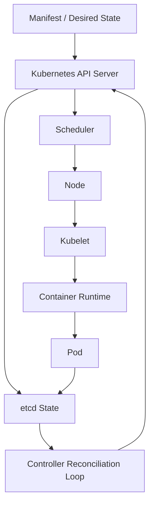
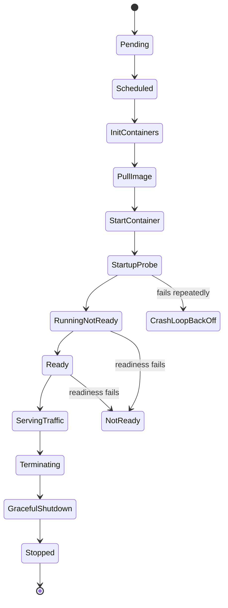
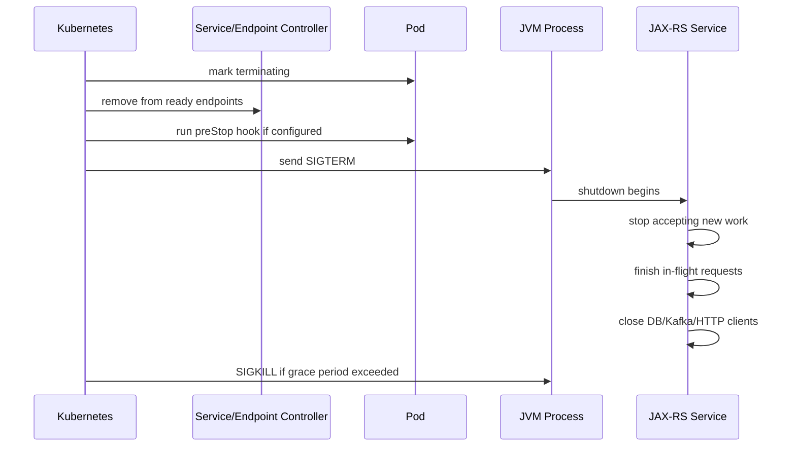
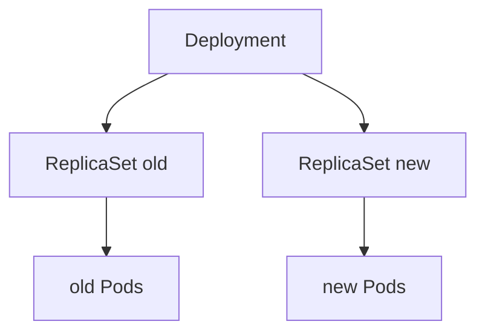

# Part 101 — Kubernetes Pod Lifecycle and Workloads

> Fokus part ini: memahami Kubernetes bukan sebagai “server tempat container berjalan”, tetapi sebagai reconciliation system. Kubernetes terus membandingkan desired state dengan observed state, lalu membuat, mengganti, menghentikan, atau menjadwalkan Pod agar state cluster mendekati deklarasi yang kita tulis.

Catatan penting:

```text
This part does not assume CSG Quote & Order uses a specific Kubernetes version,
managed platform, workload controller, deployment strategy, Helm chart,
GitOps controller, service mesh, or runtime convention.

Treat Kubernetes version, workload type, rollout strategy, lifecycle hooks,
probe endpoints, resource policy, job model, and operational runbooks as
internal verification items.
```

Untuk Java/JAX-RS service, Kubernetes lifecycle sangat menentukan:

```text
startup behavior
readiness behavior
traffic eligibility
graceful shutdown
request draining
connection pool cleanup
consumer/worker stop behavior
job retry semantics
rollout blast radius
```

Kesalahan paling umum:

```text
container running = service ready
pod deleted = request langsung berhenti
Deployment = always safe for every workload
Job retry = harmless
CronJob schedule = exactly once
StatefulSet = just Deployment with volume
liveness probe = health check for dependencies
readiness probe = same as liveness probe
```

Senior engineer perlu melihat setiap Kubernetes object dari tiga sisi:

```text
desired state: apa yang dideklarasikan manifest
observed state: apa yang benar-benar terjadi di cluster
control loop: siapa yang mencoba memperbaiki selisihnya
```

---

## 1. Core Mental Model: Reconciliation, Not Remote Execution

Kubernetes tidak “menjalankan command” seperti SSH ke server.

Kubernetes menerima deklarasi:

```yaml
apiVersion: apps/v1
kind: Deployment
spec:
  replicas: 3
```

Lalu control plane dan controller terus berusaha membuat observed state mendekati deklarasi tersebut.



Implikasinya:

```text
manual change akan cenderung dikembalikan oleh controller
Pod yang mati dapat diganti jika controller menginginkan replica tetap ada
rollout adalah perubahan desired state yang direkonsiliasi bertahap
```

Untuk engineer aplikasi, pertanyaan penting bukan hanya:

```text
Apakah container saya bisa jalan?
```

Tetapi:

```text
Apa yang terjadi saat Pod dibuat?
Apa yang terjadi saat Pod belum ready?
Apa yang terjadi saat Pod diganti saat ada request berjalan?
Apa yang terjadi saat node hilang?
Apa yang terjadi saat rollout gagal di tengah?
Apa yang terjadi saat Job retry menjalankan logic yang sama dua kali?
```

---

## 2. Pod Is the Scheduling Unit

Pod adalah unit scheduling Kubernetes.

Container berjalan di dalam Pod.

Pod dapat berisi:

```text
one main application container
init containers
sidecar containers
shared network namespace
shared volume mounts
shared lifecycle boundary
```

Untuk Java/JAX-RS service, Pod biasanya berisi satu application container.

Namun dalam enterprise platform, Pod bisa juga memiliki sidecar untuk:

```text
service mesh proxy
log shipper
secret agent
certificate agent
metrics exporter
runtime security agent
```

Jangan menganggap hanya ada satu container.

Debug command:

```bash
kubectl get pod <pod-name> -n <namespace>
kubectl describe pod <pod-name> -n <namespace>
kubectl get pod <pod-name> -n <namespace> -o yaml
kubectl logs <pod-name> -n <namespace> -c <container-name>
```

Jika Pod punya sidecar, log aplikasi mungkin bukan log default container.

---

## 3. Pod Phase Is Coarse, Conditions Are More Useful

Pod phase memberikan status kasar:

```text
Pending
Running
Succeeded
Failed
Unknown
```

Tetapi untuk production debugging, phase saja tidak cukup.

Lebih penting melihat conditions:

```text
PodScheduled
Initialized
ContainersReady
Ready
```

Contoh masalah:

```text
Running tetapi Ready=false
```

Artinya container mungkin hidup, tetapi belum eligible menerima traffic.

Penyebab umum:

```text
readiness probe gagal
application belum selesai warmup
dependency health check terlalu ketat
sidecar belum siap
config missing tetapi process belum crash
```

Command:

```bash
kubectl get pod <pod-name> -n <namespace> -o jsonpath='{.status.phase}'
kubectl get pod <pod-name> -n <namespace> -o jsonpath='{.status.conditions}'
kubectl describe pod <pod-name> -n <namespace>
```

---

## 4. Pod Lifecycle for Java/JAX-RS Service

Lifecycle sederhana:



Untuk JAX-RS service, mapping lifecycle ke aplikasi biasanya:

| Kubernetes lifecycle | Java/JAX-RS concern |
|---|---|
| Image pulled | image size, registry access, pull secret |
| Container started | JVM flags, classpath, config loading |
| Startup probe | slow startup, migration check, warmup |
| Readiness probe | endpoint eligible menerima traffic |
| Serving traffic | request handling, connection pool, thread pool |
| SIGTERM | graceful shutdown mulai |
| preStop | optional draining delay/hook |
| termination grace period | budget untuk request selesai dan resource ditutup |
| SIGKILL | proses dipaksa mati jika melebihi grace period |

Critical invariant:

```text
A Java service must be safe during startup, safe during steady state, and safe during termination.
```

---

## 5. Init Containers

Init container berjalan sebelum application container.

Use case:

```text
wait for dependency bootstrap
render config template
fetch certificate/config artifact
run lightweight preflight check
prepare shared volume
```

Anti-pattern:

```text
long migration in init container
business data repair in init container
external dependency wait with no timeout
complex shell script with hidden failure mode
```

Untuk JAX-RS service, init container dapat membuat startup tampak lambat padahal JVM belum mulai.

Debug:

```bash
kubectl describe pod <pod-name> -n <namespace>
kubectl logs <pod-name> -n <namespace> -c <init-container-name>
```

PR review questions:

```text
Apakah init container punya timeout?
Apakah failure-nya jelas?
Apakah idempotent?
Apakah seharusnya ini menjadi Job terpisah?
Apakah init container membuat startup service bergantung pada dependency eksternal yang tidak perlu?
```

---

## 6. Startup, Readiness, and Liveness in Workload Lifecycle

Walaupun detail probe dibahas lebih lanjut di part operations, lifecycle Pod tidak bisa dipahami tanpa probe.

Mental model:

```text
startupProbe: beri waktu aplikasi boot/warmup sebelum liveness menilai
readinessProbe: boleh menerima traffic atau tidak
livenessProbe: perlu restart karena stuck atau unrecoverable
```

Untuk Java/JAX-RS:

```text
startupProbe cocok untuk slow classloading, DI bootstrap, schema cache, warmup
readinessProbe cocok untuk traffic eligibility
livenessProbe harus shallow dan tidak tergantung dependency eksternal berat
```

Anti-pattern:

```text
liveness check query database
readiness selalu 200 walaupun app belum bisa melayani request
startupProbe terlalu pendek untuk cold start JVM
probe endpoint memakai thread pool yang sama dan bisa starvation
```

Failure mode:

```text
startupProbe too aggressive -> CrashLoopBackOff during normal warmup
liveness too deep -> restart storm during downstream outage
readiness too shallow -> broken pods receive traffic
```

---

## 7. Termination Lifecycle and Graceful Shutdown

Saat Pod dihentikan, Kubernetes mengirim termination signal ke container.

Secara konseptual:



Aplikasi Java harus memperlakukan SIGTERM sebagai bagian normal lifecycle.

Shutdown yang buruk menyebabkan:

```text
request terputus di tengah
Kafka offset committed sebelum work selesai
DB transaction abort tidak jelas
file upload rusak
outbox publisher duplicate
connection pool leak sampai forced kill
```

Checklist graceful shutdown:

```text
stop accepting new traffic via readiness=false
stop scheduling new internal jobs
stop consuming new Kafka/RabbitMQ messages
finish or safely cancel in-flight request
flush telemetry/logs if needed
close DB pool, HTTP clients, producer/consumer
respect terminationGracePeriodSeconds
```

---

## 8. Deployment: Default Choice for Stateless JAX-RS Services

Deployment mengelola ReplicaSet, lalu ReplicaSet mengelola Pod replicas.



Deployment cocok untuk:

```text
stateless HTTP API service
JAX-RS service with external database/cache/message broker
horizontally scalable service
interchangeable replicas
```

Deployment kurang cocok jika:

```text
replica identity penting
stable network identity per replica diperlukan
persistent volume per replica harus dipertahankan
ordered startup/shutdown diperlukan
```

Untuk kebanyakan JAX-RS API service, Deployment adalah baseline.

Namun “stateless” bukan berarti tidak punya dependency state.

Stateless artinya:

```text
Pod lokal bisa diganti kapan saja tanpa kehilangan source-of-truth state.
```

Bukan:

```text
service tidak pernah menyimpan data apa pun.
```

---

## 9. Rolling Update and Rollout Risk

Rolling update mengganti Pod lama dengan Pod baru secara bertahap.

Parameter penting:

```yaml
strategy:
  type: RollingUpdate
  rollingUpdate:
    maxUnavailable: 0
    maxSurge: 1
```

Trade-off:

| Setting | Effect |
|---|---|
| `maxUnavailable: 0` | capacity tidak turun, butuh extra capacity |
| `maxUnavailable: 1` | bisa kehilangan sebagian capacity saat rollout |
| `maxSurge: 1` | butuh resource ekstra sementara |
| high surge | rollout cepat, risk resource pressure |
| low surge | rollout lambat, safer capacity |

Rollout bisa gagal karena:

```text
image pull failure
bad config
startup probe failure
readiness never true
crash loop
insufficient resources
quota exceeded
node scheduling constraint
```

Command:

```bash
kubectl rollout status deployment/<name> -n <namespace>
kubectl rollout history deployment/<name> -n <namespace>
kubectl describe deployment <name> -n <namespace>
kubectl get rs -n <namespace>
```

Rollback command:

```bash
kubectl rollout undo deployment/<name> -n <namespace>
```

Dalam GitOps, rollback manual via `kubectl` mungkin dikembalikan oleh controller. Verifikasi internal deployment model.

---

## 10. Replica Count, Availability, and PodDisruptionBudget

Replica count bukan hanya throughput.

Replica count juga menentukan survival terhadap:

```text
Pod restart
node drain
rolling update
availability zone disruption
brief dependency warmup
```

PodDisruptionBudget membantu membatasi voluntary disruption.

Contoh:

```yaml
apiVersion: policy/v1
kind: PodDisruptionBudget
metadata:
  name: quote-api-pdb
spec:
  minAvailable: 2
  selector:
    matchLabels:
      app: quote-api
```

PR review questions:

```text
Apakah service punya cukup replica untuk rollout?
Apakah PDB sesuai dengan replica count?
Apakah HPA dapat menurunkan replica di bawah safe minimum?
Apakah service dependency juga highly available?
```

---

## 11. StatefulSet: Stable Identity and Persistent State

StatefulSet cocok untuk workload yang membutuhkan:

```text
stable network identity
stable ordinal identity
persistent volume per replica
ordered rollout/startup/shutdown semantics
```

Contoh umum:

```text
database cluster
message broker cluster
stateful coordination component
```

Untuk Java/JAX-RS service, StatefulSet biasanya bukan default.

Jika aplikasi JAX-RS memakai StatefulSet, tanyakan:

```text
Mengapa replica identity penting?
Apa state lokal yang harus dipertahankan?
Apakah state itu seharusnya pindah ke DB/cache/object storage?
Bagaimana backup/restore dilakukan?
Bagaimana rolling update memengaruhi state?
```

Anti-pattern:

```text
menggunakan StatefulSet hanya karena butuh disk temporary
menyimpan business source-of-truth di local volume Pod
menganggap volume otomatis membuat aplikasi reliable
```

---

## 12. Job: Run-to-Completion Workload

Job cocok untuk pekerjaan yang harus selesai.

Use case:

```text
one-off data repair
migration assistant
backfill
bulk export
report generation
batch reconciliation
manual operational task
```

Semantics penting:

```text
Job may retry Pods
Job can run same logic more than once
success means desired completions reached
failure depends on backoffLimit and pod failures
```

Untuk enterprise correctness:

```text
Job logic must be idempotent
Job must have progress marker
Job must have observable output
Job must support safe resume or safe rerun
```

Anti-pattern:

```text
Job writes side effects without idempotency key
Job scans full production table without limit/batch
Job has no owner/runbook
Job success only means process exited 0, not business result reconciled
```

---

## 13. CronJob: Scheduled Job, Not Exactly-Once Scheduler

CronJob membuat Job berdasarkan jadwal.

Use case:

```text
cleanup job
retry stuck records
archival job
reconciliation job
scheduled report
catalog/pricing sync
```

Critical fields:

```yaml
apiVersion: batch/v1
kind: CronJob
metadata:
  name: quote-reconciliation
spec:
  schedule: "*/15 * * * *"
  concurrencyPolicy: Forbid
  startingDeadlineSeconds: 300
  successfulJobsHistoryLimit: 3
  failedJobsHistoryLimit: 5
  jobTemplate:
    spec:
      backoffLimit: 2
      template:
        spec:
          restartPolicy: Never
          containers:
            - name: job
              image: example/quote-reconciliation:1.0.0
```

Key fields:

| Field | Why it matters |
|---|---|
| `schedule` | cadence |
| `concurrencyPolicy` | allow/forbid/replace overlapping runs |
| `startingDeadlineSeconds` | missed schedule tolerance |
| `backoffLimit` | retry attempts |
| `restartPolicy` | container restart behavior |
| history limits | cleanup old Job objects |

Failure modes:

```text
overlapping runs process same data
missed schedule after controller downtime
long-running job piles up
retry duplicates side effects
job succeeds technically but reconciliation incomplete
```

---

## 14. Workload Selection Matrix

| Workload type | Use when | Avoid when |
|---|---|---|
| Deployment | stateless JAX-RS API service | stable identity required |
| StatefulSet | stable identity and per-replica storage required | ordinary stateless API |
| Job | finite task must complete | continuously serving traffic |
| CronJob | scheduled finite task | exactly-once scheduling required |
| DaemonSet | one Pod per node for node-local function | normal application scaling |

For CSG Quote & Order style services, expected baseline is often:

```text
Deployment for HTTP APIs
Job/CronJob for reconciliation/backfill/cleanup
StatefulSet for platform dependencies, not ordinary API service
```

But this must be verified internally.

---

## 15. Java/JAX-RS Shutdown Design

A JAX-RS service should be designed so Kubernetes termination is safe.

Possible shutdown sequence:

```text
1. readiness becomes false
2. load balancer stops sending new requests
3. service stops accepting long-running internal work
4. in-flight requests complete within grace period
5. background publishers/consumers stop safely
6. resources close
7. process exits cleanly
```

For Jersey/JAX-RS, verify:

```text
how HTTP server handles SIGTERM
whether runtime supports graceful shutdown
whether request thread pool drains
whether DB pool closes
whether Kafka consumers stop polling
whether telemetry flushes
```

Example conceptual shutdown hook:

```java
public final class ApplicationShutdown {
    private final AtomicBoolean shuttingDown = new AtomicBoolean(false);

    public void beginShutdown() {
        if (!shuttingDown.compareAndSet(false, true)) {
            return;
        }

        // Stop accepting background work first.
        // Let in-flight request handling finish if platform supports graceful drain.
        // Close clients/pools after work is stopped.
    }

    public boolean isReady() {
        return !shuttingDown.get();
    }
}
```

Do not hide shutdown behavior inside random static hooks.

Make it observable.

---

## 16. Failure Mode: Pending Pod

Symptoms:

```text
Pod stays Pending
Deployment rollout stuck
no new replica becomes ready
```

Common causes:

```text
insufficient CPU/memory
node selector cannot match
taint not tolerated
PVC cannot bind
image pull secret missing
quota exceeded
```

Debug:

```bash
kubectl describe pod <pod-name> -n <namespace>
kubectl get events -n <namespace> --sort-by=.lastTimestamp
kubectl describe node <node-name>
kubectl get quota -n <namespace>
```

Senior interpretation:

```text
Pending is usually scheduling/resource/platform constraint, not application code failure.
```

---

## 17. Failure Mode: CrashLoopBackOff

Symptoms:

```text
Pod repeatedly starts and crashes
restart count increases
rollout does not complete
```

Common causes:

```text
missing config
bad secret
startup exception
JVM exits due to invalid flags
port binding failure
startup probe too aggressive
```

Debug:

```bash
kubectl logs <pod-name> -n <namespace> --previous
kubectl describe pod <pod-name> -n <namespace>
kubectl get pod <pod-name> -n <namespace> -o jsonpath='{.status.containerStatuses}'
```

Important:

```text
Always inspect previous logs for crashing containers.
Current logs may only show the latest short failed attempt.
```

---

## 18. Failure Mode: ImagePullBackOff

Common causes:

```text
wrong image tag
image not pushed
registry unavailable
image pull secret missing
network path to registry broken
architecture mismatch
```

Debug:

```bash
kubectl describe pod <pod-name> -n <namespace>
kubectl get secret -n <namespace>
kubectl get serviceaccount <sa-name> -n <namespace> -o yaml
```

PR review:

```text
Is image tag immutable?
Is registry accessible from cluster?
Is pull secret/platform identity configured?
Is promotion process copying images across environments?
```

---

## 19. Failure Mode: Rollout Stuck

Rollout stuck usually means new Pod cannot become Ready.

Check:

```bash
kubectl rollout status deployment/<name> -n <namespace>
kubectl describe deployment <name> -n <namespace>
kubectl get rs -n <namespace>
kubectl get pod -n <namespace> -l app=<app>
```

Common causes:

```text
readiness probe failing
new config incompatible
new DB migration not applied
new image crash loop
new version cannot talk to dependency
resource pressure
```

Senior rule:

```text
Never debug rollout only from Deployment object.
Follow Deployment -> ReplicaSet -> Pod -> Container -> Logs -> Events.
```

---

## 20. Failure Mode: Terminating Pod Stuck

Common causes:

```text
finalizer blocks deletion
volume detach issue
container ignores SIGTERM
preStop hangs
application never exits
node unreachable
```

Debug:

```bash
kubectl describe pod <pod-name> -n <namespace>
kubectl get pod <pod-name> -n <namespace> -o yaml
kubectl logs <pod-name> -n <namespace>
```

Application review:

```text
Does the Java process handle SIGTERM?
Does preStop have a bounded timeout?
Does terminationGracePeriodSeconds match worst-case request duration?
Are long-running requests cancelled or drained safely?
```

---

## 21. Failure Mode: Job Duplicate Side Effects

Jobs and CronJobs may retry.

Therefore the same business operation can run more than once.

Dangerous examples:

```text
send invoice twice
publish duplicate event without idempotency key
recalculate pricing and overwrite newer value
archive records while active transaction still uses them
delete records without checkpoint
```

Safer design:

```text
use job_run_id
use batch checkpoint
use idempotency key
use unique constraint
use reconciliation table
write progress before/after side effect deliberately
make rerun safe
```

For CPQ/order systems, reconciliation jobs must be especially careful with:

```text
order state
quote version
catalog effective date
pricing effective date
tenant boundary
currency rounding
outbox/inbox state
```

---

## 22. Example Deployment Skeleton for Java/JAX-RS

```yaml
apiVersion: apps/v1
kind: Deployment
metadata:
  name: quote-api
spec:
  replicas: 3
  strategy:
    type: RollingUpdate
    rollingUpdate:
      maxUnavailable: 0
      maxSurge: 1
  selector:
    matchLabels:
      app: quote-api
  template:
    metadata:
      labels:
        app: quote-api
    spec:
      terminationGracePeriodSeconds: 45
      containers:
        - name: app
          image: registry.example.com/quote-api:1.2.3
          ports:
            - containerPort: 8080
          resources:
            requests:
              cpu: "500m"
              memory: "768Mi"
            limits:
              memory: "1024Mi"
          startupProbe:
            httpGet:
              path: /health/startup
              port: 8080
            failureThreshold: 30
            periodSeconds: 2
          readinessProbe:
            httpGet:
              path: /health/ready
              port: 8080
            periodSeconds: 5
          livenessProbe:
            httpGet:
              path: /health/live
              port: 8080
            periodSeconds: 10
```

This is illustrative, not a recommended internal CSG default.

Verify actual health endpoint paths, probe semantics, resource policy, image registry, and deployment standard internally.

---

## 23. Debugging Flow: From Symptom to Object

```text
Traffic failing?
  -> Check endpoint/service/ingress later in networking part
Rollout failing?
  -> Deployment -> ReplicaSet -> Pod -> Container -> Logs/Events
Pod pending?
  -> Scheduler/resource/node/quota/PVC
Pod crashing?
  -> previous logs + env/config/secrets/JVM flags
Pod running but not receiving traffic?
  -> readiness condition + Service endpoints
Job duplicate?
  -> Job retry/concurrency/idempotency/checkpoint
```

Commands:

```bash
kubectl get deploy,rs,pod -n <namespace>
kubectl describe deploy <name> -n <namespace>
kubectl describe pod <pod-name> -n <namespace>
kubectl logs <pod-name> -n <namespace> --all-containers=true
kubectl logs <pod-name> -n <namespace> --previous
kubectl get events -n <namespace> --sort-by=.lastTimestamp
```

---

## 24. PR Review Checklist

Review workload changes with these questions:

```text
Is Deployment/StatefulSet/Job/CronJob the correct workload type?
Is the application stateless enough for Deployment?
Is the replica count compatible with rollout and availability needs?
Are startup/readiness/liveness probes semantically correct?
Is terminationGracePeriodSeconds aligned with shutdown behavior?
Does the app handle SIGTERM safely?
Are resource requests/limits declared and realistic?
Can rollout fail safely?
Can rollback work with current DB/API/event compatibility?
For Jobs: is logic idempotent and resumable?
For CronJobs: is concurrencyPolicy explicit?
For sidecars: is lifecycle dependency understood?
Are labels/selectors stable and non-ambiguous?
Are dashboards/alerts tied to rollout and Pod health?
```

Red flags:

```text
no readiness probe
liveness probe depends on DB/downstream
single replica for critical service
CronJob with Allow concurrency for mutating reconciliation
Job with no idempotency story
termination grace too short for request duration
manual kubectl rollout in GitOps-managed environment
```

---

## 25. Internal Verification Checklist

Verify in CSG/internal environment:

```text
Kubernetes version and managed platform
standard workload controller for JAX-RS services
whether Helm, Kustomize, GitOps, or custom deployment tooling is used
standard labels/selectors/annotations
standard probe endpoints and semantics
standard terminationGracePeriodSeconds
whether preStop hooks are used
whether service runtime supports graceful shutdown
whether PodDisruptionBudget is required
replica count policy per environment
HPA/VPA usage
Job/CronJob standards
allowed concurrencyPolicy for CronJobs
runbook for failed rollout
runbook for failed Job/CronJob
monitoring dashboards for Deployment, Pod, Job, and CronJob
ownership boundary between application team and platform team
```

---

## 26. Senior Engineer Takeaway

Kubernetes workload design is not YAML decoration.

It defines application lifecycle.

For a Java/JAX-RS production service, the core invariant is:

```text
Every Pod can be created, made ready, removed from traffic, terminated,
replaced, retried, and rolled back without corrupting business state or
causing uncontrolled user impact.
```

If that invariant is false, the problem is not only Kubernetes configuration.

It is application architecture.
