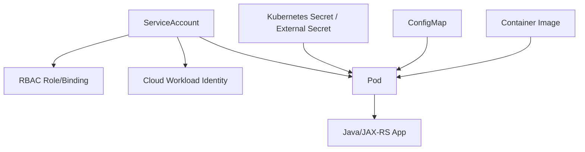
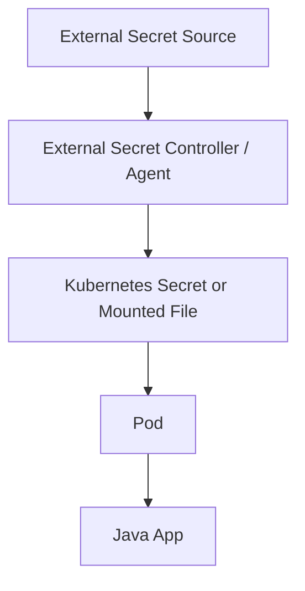
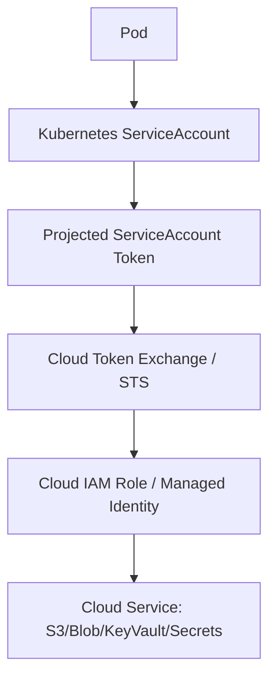

# Part 102 — Kubernetes Config, Secret, Identity, and RBAC

> Fokus part ini: memahami bagaimana Pod mendapatkan configuration, secret, dan identity di Kubernetes. Untuk service enterprise, bug konfigurasi dan akses sering terlihat seperti application bug, padahal root cause-nya ada pada ConfigMap, Secret, ServiceAccount, RBAC, projected token, external secret, atau cloud workload identity.

Catatan penting:

```text
This part does not assume CSG uses native Kubernetes Secrets, External Secrets,
Vault, AWS Secrets Manager, Azure Key Vault, IRSA, EKS Pod Identity, AKS Workload
Identity, service mesh identity, or a specific RBAC baseline.

Treat configuration source, secret source, identity model, RBAC policy,
rotation strategy, and platform security baseline as internal verification items.
```

Core idea:

```text
A container image should be environment-agnostic.
A Pod receives environment-specific behavior through config, secret, identity,
network policy, and runtime platform integration.
```

Kesalahan umum:

```text
ConfigMap is safe for secrets
Kubernetes Secret means secret is automatically secure forever
env var config updates automatically refresh application behavior
default ServiceAccount is harmless
RBAC only matters for platform teams
all pods need Kubernetes API access
cloud permissions are just environment variables
secret rotation is solved by mounting a new value
```

Senior engineer harus menanyakan:

```text
Where does this value come from?
Who can read it?
Can it rotate?
Does the app reload it?
Is it environment-specific, tenant-specific, or secret?
Does the Pod need Kubernetes API permission?
Does this identity also map to cloud permissions?
```

---

## 1. Mental Model: Runtime Inputs to a Pod



The application sees runtime inputs through:

```text
environment variables
mounted files
service account token
DNS/service discovery
cloud metadata/identity provider
sidecar agent
application config library
```

A production issue can come from any layer.

---

## 2. ConfigMap: Non-Secret Configuration

ConfigMap is for non-sensitive configuration.

Examples:

```text
feature defaults
endpoint URLs
timeout values
log level
profile name
tenant routing config pointer
catalog config location
non-secret integration metadata
```

Not for:

```text
passwords
private keys
tokens
client secrets
signing keys
PII
```

Example:

```yaml
apiVersion: v1
kind: ConfigMap
metadata:
  name: quote-api-config
data:
  APP_PROFILE: "prod"
  HTTP_CLIENT_TIMEOUT_MS: "2000"
  FEATURE_RULE_ENGINE_V2: "false"
```

Consume as env:

```yaml
envFrom:
  - configMapRef:
      name: quote-api-config
```

Consume as specific env:

```yaml
env:
  - name: HTTP_CLIENT_TIMEOUT_MS
    valueFrom:
      configMapKeyRef:
        name: quote-api-config
        key: HTTP_CLIENT_TIMEOUT_MS
```

Consume as volume:

```yaml
volumes:
  - name: app-config
    configMap:
      name: quote-api-config
containers:
  - name: app
    volumeMounts:
      - name: app-config
        mountPath: /etc/app/config
        readOnly: true
```

---

## 3. Env Var vs Mounted File

| Method | Strength | Risk |
|---|---|---|
| env var | simple, easy for Java config libraries | does not update inside running process automatically |
| mounted file | can update on filesystem eventually | app must watch/reload safely |
| sidecar/agent | can integrate external secret/config | more moving parts |
| application fetch | explicit reload/control | app needs cloud/platform credentials |

For Java/JAX-RS service:

```text
env vars are good for startup config
mounted config can support reload only if app explicitly supports reload
runtime reload must be designed, not assumed
```

Important:

```text
Updating ConfigMap does not magically reconfigure already-created Java objects.
```

If config is injected into singleton during startup, changing the ConfigMap may not change runtime behavior until restart.

---

## 4. Config Precedence and Drift

Configuration often comes from multiple layers:

```text
default application properties
profile-specific properties
ConfigMap
environment variables
command-line args
secret manager
feature flag service
tenant-specific config
runtime override
```

Danger:

```text
same logical key defined in multiple places
local environment differs from production
tenant-specific override hides global default
runtime reload changes only some nodes
GitOps manifest differs from live object
```

Recommended discipline:

```text
document precedence order
fail fast on missing required config
avoid silent defaults for critical behavior
log config source, not secret value
validate config at startup
expose safe config diagnostics
```

Do not log secret values.

Do log config shape/version/checksum where safe.

---

## 5. Kubernetes Secret: Sensitive Small Data Object

Kubernetes Secret stores sensitive small data such as:

```text
password
token
key
certificate
client secret
```

Example:

```yaml
apiVersion: v1
kind: Secret
metadata:
  name: quote-api-db-secret
type: Opaque
stringData:
  DB_USERNAME: "quote_app"
  DB_PASSWORD: "replace-me"
```

Consume as env:

```yaml
env:
  - name: DB_PASSWORD
    valueFrom:
      secretKeyRef:
        name: quote-api-db-secret
        key: DB_PASSWORD
```

Consume as mounted file:

```yaml
volumes:
  - name: db-secret
    secret:
      secretName: quote-api-db-secret
containers:
  - name: app
    volumeMounts:
      - name: db-secret
        mountPath: /etc/app/secrets/db
        readOnly: true
```

Security warning:

```text
Kubernetes Secret is an API object. Access control, encryption at rest,
audit policy, namespace isolation, and external secret integration still matter.
```

---

## 6. Secret Rotation Is a Lifecycle Problem

Secret rotation has several steps:

```text
new secret generated
secret stored in source system
Kubernetes object or mounted value updated
application observes new value
existing connection/client refreshed
old secret revoked after safe overlap
```

Failure modes:

```text
secret object updated but app keeps old DB pool connection
mounted file changes but app never reloads it
env var cannot change without Pod restart
old and new credential not valid during overlap
some replicas use old value, some use new value
rollback points to secret no longer valid
```

Safe rotation questions:

```text
Does the application need restart or hot reload?
Can DB/client pool refresh credentials?
Is there an overlap window?
How is rotation tested?
How are failures detected?
Can rollback still authenticate?
```

For Java services, startup-only secret loading is common.

That is acceptable if rotation process includes controlled restart/rollout.

---

## 7. External Secrets and Secret Managers

Many enterprise platforms do not want humans or pipelines writing raw secrets directly into Kubernetes manifests.

Common models:

```text
External Secrets Operator syncs from cloud secret manager
Vault agent injects mounted secret
CSI driver mounts secret from external store
application fetches secret at runtime using workload identity
```

Conceptual flow:



Review questions:

```text
Is the source of truth Kubernetes or external manager?
Who can change the secret?
How often is it synced?
What happens if sync fails?
Is secret value ever committed to Git?
Does the controller need broad permissions?
```

---

## 8. ServiceAccount: Pod Identity Inside Kubernetes

A ServiceAccount identifies processes running in Pods.

It is not just a label.

It can be used for:

```text
authentication to Kubernetes API
RBAC authorization decision
projected token for in-cluster clients
cloud workload identity mapping
service mesh identity integration
```

Example:

```yaml
apiVersion: v1
kind: ServiceAccount
metadata:
  name: quote-api
```

Attach to Pod:

```yaml
spec:
  serviceAccountName: quote-api
```

Security baseline:

```text
Use a dedicated ServiceAccount per workload.
Do not rely on default ServiceAccount for production services.
Disable token automount if the Pod does not need Kubernetes API access.
```

Example:

```yaml
spec:
  serviceAccountName: quote-api
  automountServiceAccountToken: false
```

But do not blindly set `false` if cloud workload identity or in-cluster API access requires projected token. Verify platform model.

---

## 9. RBAC: Role, ClusterRole, RoleBinding, ClusterRoleBinding

Kubernetes RBAC answers:

```text
Who can do what to which Kubernetes resources?
```

Objects:

| Object | Scope | Purpose |
|---|---|---|
| Role | namespace | permissions inside one namespace |
| ClusterRole | cluster | cluster-wide or reusable permissions |
| RoleBinding | namespace | bind Role/ClusterRole to subject in namespace |
| ClusterRoleBinding | cluster | bind ClusterRole cluster-wide |

Example Role:

```yaml
apiVersion: rbac.authorization.k8s.io/v1
kind: Role
metadata:
  namespace: quote
  name: quote-api-config-reader
rules:
  - apiGroups: [""]
    resources: ["configmaps"]
    verbs: ["get", "list"]
```

Example binding:

```yaml
apiVersion: rbac.authorization.k8s.io/v1
kind: RoleBinding
metadata:
  name: quote-api-config-reader-binding
  namespace: quote
subjects:
  - kind: ServiceAccount
    name: quote-api
    namespace: quote
roleRef:
  kind: Role
  name: quote-api-config-reader
  apiGroup: rbac.authorization.k8s.io
```

Most JAX-RS services should not need to read Kubernetes API directly.

If they do, ask why.

---

## 10. Least Privilege for Application Pods

Good default:

```text
application Pod gets no Kubernetes API permission unless explicitly needed
application Pod uses dedicated ServiceAccount
application Pod cannot read all Secrets in namespace
application Pod cannot create Pods/Jobs unless it is a controller/operator
application Pod cannot list cluster-wide resources unless justified
```

Dangerous permissions:

```text
verbs: ["*"]
resources: ["*"]
ClusterRoleBinding to service account
permission to read secrets broadly
permission to create pods/exec into pods
permission to impersonate users/service accounts
```

PR review questions:

```text
Does this Java service need Kubernetes API access?
Can permission be narrowed to one resource name?
Is namespace-scoped Role enough?
Why is ClusterRole required?
Can list/watch be avoided?
Can token automount be disabled?
```

---

## 11. Cloud Workload Identity

In managed Kubernetes, ServiceAccount can map to cloud identity.

Examples:

```text
AWS EKS IRSA or EKS Pod Identity
Azure AKS Workload Identity
GCP Workload Identity
platform-specific service identity
```

Conceptual flow:



Important:

```text
Kubernetes RBAC and cloud IAM are separate authorization systems.
```

A Pod may have no Kubernetes API permissions but still have cloud permissions through workload identity.

Debugging cloud access requires checking both:

```text
Kubernetes ServiceAccount annotations/configuration
cloud IAM role/policy/managed identity assignment
```

---

## 12. ConfigMap and Secret Reload Semantics

High-level rules:

```text
env var injection is fixed for process lifetime
mounted ConfigMap/Secret can update on disk eventually
application must reload file value explicitly
subPath mounts do not receive updates like normal projected volumes
external secret sync has its own delay/failure mode
```

For Java/JAX-RS:

```text
if config is read during startup into immutable object, Pod restart is required
if runtime reload is supported, reload must be atomic and validated
partial reload can create inconsistent behavior
```

Safe reload design:

```text
load new config into new immutable object
validate fully
swap atomically
emit config version/checksum metric
keep old config if validation fails
avoid reloading secrets in random request thread
```

---

## 13. Checksums and Rollout on Config Change

Common pattern:

```text
change ConfigMap/Secret -> update Pod template annotation checksum -> Deployment rollout
```

Example:

```yaml
spec:
  template:
    metadata:
      annotations:
        checksum/config: "sha256-of-rendered-config"
```

Why:

```text
Deployment creates new ReplicaSet only when Pod template changes.
Changing a referenced ConfigMap alone may not restart Pods.
```

PR review:

```text
Does config change trigger rollout when needed?
Does secret change trigger rollout when needed?
Is checksum generated from rendered config?
Is rollout safe with compatibility constraints?
```

---

## 14. Environment-Specific and Tenant-Specific Configuration

Enterprise configuration often has layers:

```text
global default
environment override
tenant override
product/catalog override
pricing/rules override
emergency override
feature flag override
```

Do not flatten all of them into one ConfigMap without model.

For CSG Quote & Order style systems, verify:

```text
tenant config source
tenant routing key
catalog config source
pricing/rule config source
effective date handling
fallback/default behavior
```

Bad failure mode:

```text
missing tenant-specific config silently falls back to global behavior and produces wrong quote/order result
```

Safer behavior:

```text
fail closed for tenant identity and permission
fail explicit for missing critical pricing/catalog config
emit audit/debug event for config resolution path
```

---

## 15. Security Context Is Related but Separate

Do not confuse:

```text
ServiceAccount / RBAC = identity and API authorization
securityContext = process/container Linux security settings
```

Security context examples:

```yaml
securityContext:
  runAsNonRoot: true
  allowPrivilegeEscalation: false
  readOnlyRootFilesystem: true
  capabilities:
    drop:
      - ALL
```

This part focuses on config/secret/identity/RBAC, but PR reviews should connect them:

```text
Does the Pod run as non-root?
Can it write only where needed?
Does it mount tokens/secrets unnecessarily?
Can compromised app read broader secrets?
```

---

## 16. Failure Mode: Missing Config

Symptoms:

```text
CrashLoopBackOff
startup exception
readiness never true
wrong environment behavior
```

Debug:

```bash
kubectl describe pod <pod-name> -n <namespace>
kubectl get configmap <name> -n <namespace> -o yaml
kubectl get deploy <name> -n <namespace> -o yaml
kubectl logs <pod-name> -n <namespace> --previous
```

Common causes:

```text
wrong ConfigMap name
missing key
wrong namespace
Helm value not rendered
GitOps drift
profile mismatch
```

Application design:

```text
required config should fail fast with clear key name
optional config should have explicit safe default
secret values must not be printed
```

---

## 17. Failure Mode: Stale Config

Symptoms:

```text
manifest updated but behavior unchanged
some replicas use old behavior
config shown in cluster differs from app behavior
```

Common causes:

```text
env var config requires restart
checksum annotation not updated
runtime reload unsupported
multiple config sources with precedence confusion
Pod not rolled out
```

Debug:

```bash
kubectl rollout history deploy/<name> -n <namespace>
kubectl get pod <pod-name> -n <namespace> -o yaml
kubectl exec <pod-name> -n <namespace> -- printenv | sort
```

Use `kubectl exec` carefully and only where allowed internally.

---

## 18. Failure Mode: Secret Rotated but App Still Fails

Symptoms:

```text
authentication to DB/cloud/downstream fails after rotation
some Pods work, some fail
restart fixes the issue
rollback still fails
```

Common causes:

```text
app loaded env var secret at startup
connection pool keeps old credentials
secret rotation did not update all environments
old credential revoked too early
external secret sync failed
mounted file changed but app did not reload
```

Debug:

```bash
kubectl describe externalsecret <name> -n <namespace>   # if used
kubectl get secret <name> -n <namespace> -o yaml
kubectl describe pod <pod-name> -n <namespace>
```

Do not print decoded secret values in shared channels or tickets.

---

## 19. Failure Mode: RBAC Forbidden

Symptoms:

```text
HTTP 403 from Kubernetes API
client library says forbidden
controller/operator cannot list/watch resource
external secret cannot sync
```

Debug:

```bash
kubectl auth can-i get configmaps \
  --as=system:serviceaccount:<namespace>:<serviceaccount> \
  -n <namespace>

kubectl auth can-i list secrets \
  --as=system:serviceaccount:<namespace>:<serviceaccount> \
  -n <namespace>
```

Interpretation:

```text
Forbidden means identity was recognized but not authorized.
Unauthorized means authentication/token problem.
```

---

## 20. Failure Mode: Over-Permissioned Workload

Symptoms may not appear until incident.

Risk:

```text
compromised application can read secrets
compromised application can create Pods
compromised application can escalate via service account token
compromised application can list resources across namespaces
```

Review:

```bash
kubectl get role,rolebinding,clusterrole,clusterrolebinding -n <namespace>
kubectl describe rolebinding <name> -n <namespace>
kubectl describe clusterrolebinding <name>
```

Senior mindset:

```text
No incident is not proof of safe RBAC.
Least privilege must be designed before compromise.
```

---

## 21. Example Deployment Snippet

```yaml
apiVersion: apps/v1
kind: Deployment
metadata:
  name: quote-api
spec:
  template:
    metadata:
      annotations:
        checksum/config: "example-checksum"
    spec:
      serviceAccountName: quote-api
      automountServiceAccountToken: false
      containers:
        - name: app
          image: registry.example.com/quote-api:1.2.3
          env:
            - name: APP_PROFILE
              valueFrom:
                configMapKeyRef:
                  name: quote-api-config
                  key: APP_PROFILE
            - name: DB_PASSWORD
              valueFrom:
                secretKeyRef:
                  name: quote-api-db-secret
                  key: DB_PASSWORD
          volumeMounts:
            - name: app-config
              mountPath: /etc/app/config
              readOnly: true
      volumes:
        - name: app-config
          configMap:
            name: quote-api-config
```

This is illustrative.

Verify whether internal platform prefers env vars, mounted files, external secret injection, sidecar agents, or application-level config fetch.

---

## 22. Application-Side Configuration Pattern

Prefer typed immutable config.

Example:

```java
public record HttpClientConfig(
        Duration connectTimeout,
        Duration readTimeout,
        int maxConnections,
        URI baseUri
) {
    public HttpClientConfig {
        if (connectTimeout.isNegative() || connectTimeout.isZero()) {
            throw new IllegalArgumentException("connectTimeout must be positive");
        }
        if (readTimeout.isNegative() || readTimeout.isZero()) {
            throw new IllegalArgumentException("readTimeout must be positive");
        }
        if (maxConnections <= 0) {
            throw new IllegalArgumentException("maxConnections must be positive");
        }
    }
}
```

Benefits:

```text
fail fast
central validation
clear dependency
safe logging of non-secret shape
reduced stringly-typed behavior
```

Do not pass raw config maps across the codebase.

---

## 23. Secret Handling in Java Code

Avoid:

```java
log.info("DB password: {}", password);
throw new IllegalStateException("Failed with secret " + token);
```

Prefer:

```java
log.info("DB credential loaded from source={}, usernamePresent={}, passwordPresent={}",
        sourceName,
        username != null,
        password != null);
```

Guidelines:

```text
never log secret value
never expose secret via health endpoint
never include secret in exception message
avoid storing secrets in static mutable global state
prefer clear ownership for credential refresh
```

---

## 24. PR Review Checklist

Review Kubernetes config/secret/identity changes with these questions:

```text
Is this value config, secret, or runtime-derived identity?
Is secret value committed to Git anywhere?
Is ConfigMap used only for non-sensitive data?
Does config change require Pod restart?
If yes, does checksum/rollout mechanism exist?
If reload is supported, is reload atomic and validated?
Does the service use a dedicated ServiceAccount?
Can automountServiceAccountToken be disabled?
Does the Pod need Kubernetes API permissions?
Are RBAC permissions namespace-scoped and minimal?
Is ClusterRole/ClusterRoleBinding justified?
Can the workload read Secrets broadly?
Is cloud identity mapped through platform-approved mechanism?
Does secret rotation have overlap, rollout, and rollback plan?
Are config source and version observable without leaking sensitive data?
Are tenant-specific config and defaults safe?
```

Red flags:

```text
ConfigMap contains password/token/key
Secret value rendered into manifest committed to Git
default ServiceAccount used by production workload
ClusterRoleBinding for ordinary API service
verbs/resources wildcard
app reads all secrets in namespace
secret rotation requires manual emergency patching
critical config has silent unsafe default
runtime reload exists but no validation/rollback
```

---

## 25. Internal Verification Checklist

Verify in CSG/internal environment:

```text
standard config source for Java/JAX-RS services
whether config is env var, mounted file, config service, or combination
config precedence order
required vs optional config convention
runtime reload support
config drift detection
standard secret source
whether External Secrets/Vault/cloud secret manager is used
secret rotation process
whether Pod restart is required after secret update
standard ServiceAccount naming
whether token automount is disabled by default
RBAC baseline for application workloads
cloud workload identity mechanism
who owns cloud IAM policy
whether app workloads may call Kubernetes API
secret redaction standard
PII handling and log redaction policy
tenant-specific config source
feature flag/config override integration
GitOps/Helm/Kustomize rendering convention
security review process for RBAC and secret changes
```

---

## 26. Senior Engineer Takeaway

Configuration, secret, and identity are not deployment details.

They are part of service correctness.

For a production Java/JAX-RS service, the invariant is:

```text
Every runtime value has a clear source, precedence, owner, validation rule,
rotation behavior, visibility boundary, and failure mode.
```

For Kubernetes identity, the invariant is:

```text
A Pod has only the identity and permissions required for its job, no more.
```

If these invariants are not true, failures will appear as random startup issues, authentication errors, cross-tenant bugs, secret leaks, or incident-time confusion.
