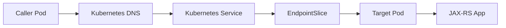
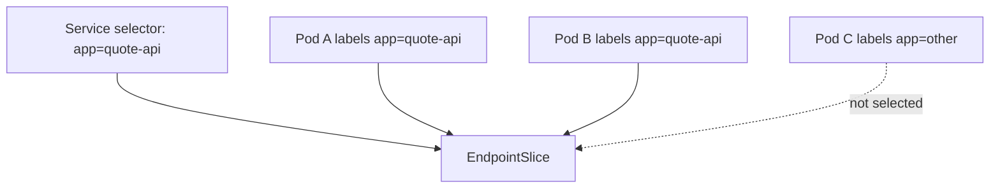
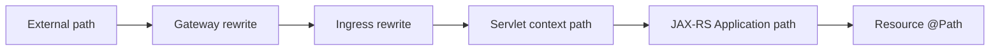

# Part 103 — Kubernetes Networking, Traffic Flow, Ingress, L4/L7 Load Balancing

> Fokus part ini: memahami jalur traffic dari client sampai resource method JAX-RS ketika service berjalan di Kubernetes. Banyak bug yang terlihat seperti bug JAX-RS sebenarnya terjadi sebelum request mencapai aplikasi: DNS, load balancer, ingress, service selector, endpoint, network policy, TLS, path rewrite, timeout, body limit, atau proxy header.

Catatan penting:

```text
This part does not assume CSG uses EKS, AKS, NGINX Ingress, AWS Load Balancer
Controller, Azure Application Gateway Ingress Controller, Istio, Linkerd,
Kong, APIM, API Gateway, service mesh, or a specific network plugin.

Treat ingress controller, service mesh, cloud load balancer, DNS, TLS,
network policy, proxy header convention, and timeout/body limits as internal
verification items.
```

Core idea:

```text
A JAX-RS endpoint is not directly exposed to the world.

A request reaches it through a chain of network hops. Each hop can mutate,
terminate, reject, retry, buffer, compress, decompress, timeout, or hide
failure signals.
```

Senior engineer mental model:

```text
When an endpoint fails, do not start from the resource method.
Start from the traffic path.

Can the client resolve the name?
Can the client connect?
Does TLS terminate correctly?
Does the request reach the ingress?
Does the ingress route to the right service?
Does the service select ready pods?
Does the pod receive the path and headers the application expects?
Does the JAX-RS resource match the final path/method/media type?
```

---

## 1. End-to-End Traffic Flow

Typical external traffic flow:

```mermaid
flowchart LR
    Client[Client]
    DNS[DNS]
    LB[Cloud / Platform Load Balancer]
    Gateway[API Gateway / Ingress Controller]
    Ingress[Ingress Rule]
    Service[Kubernetes Service]
    EndpointSlice[EndpointSlice]
    Pod[Pod IP]
    Container[Container Port]
    Runtime[Servlet / Jersey Runtime]
    Resource[JAX-RS Resource Method]

    Client --> DNS
    DNS --> LB
    LB --> Gateway
    Gateway --> Ingress
    Ingress --> Service
    Service --> EndpointSlice
    EndpointSlice --> Pod
    Pod --> Container
    Container --> Runtime
    Runtime --> Resource
```



Internal service-to-service traffic can be shorter:



What matters:

```text
The URL observed by the client is not always the URL observed by JAX-RS.
The protocol observed by the client is not always the protocol observed by the pod.
The remote IP observed by the app is often a proxy IP, not the original client IP.
The timeout observed by the client may come from gateway, ingress, service mesh, or app.
```

---

## 2. Kubernetes Service Mental Model

A Kubernetes Service gives stable access to a changing set of Pods.

Pods are ephemeral:

```text
Pod IP changes after restart.
Pod can be recreated during rollout.
Pod can become unready.
Pod can move to another node.
```

Service provides:

```text
stable DNS name
stable virtual IP for ClusterIP service
target selection using labels
load distribution across ready endpoints
```

Core relationship:



Failure pattern:

```text
Service exists but has no endpoints.

Common causes:
selector does not match Pod labels
Pods are not ready
Pods are crash looping
readiness probe fails
Deployment rolled out bad labels
namespace mismatch
```

Debug direction:

```bash
kubectl get svc -n <ns>
kubectl describe svc <service-name> -n <ns>
kubectl get endpointslice -n <ns> -l kubernetes.io/service-name=<service-name>
kubectl get pods -n <ns> --show-labels
```

---

## 3. Service Types

Common Service types:

```text
ClusterIP
NodePort
LoadBalancer
ExternalName
```

### ClusterIP

Default internal-only service type.

Use it when:

```text
traffic originates inside the cluster
Ingress/Gateway routes to the service
service-to-service communication happens through Kubernetes DNS
```

Example:

```yaml
apiVersion: v1
kind: Service
metadata:
  name: quote-api
spec:
  type: ClusterIP
  selector:
    app: quote-api
  ports:
    - name: http
      port: 8080
      targetPort: 8080
```

Key distinction:

```text
port is the Service port.
targetPort is the container port.
```

Misconfiguration:

```text
Service port 8080 -> targetPort 8080
but container listens on 8081

Symptom:
connection refused, 502, no response, probe failure, or ingress backend error.
```

### NodePort

Exposes a port on each node.

Usually not the main abstraction for enterprise HTTP APIs, but can exist behind load balancers or legacy setup.

Risk:

```text
opens node-level port
harder to govern
less expressive than ingress/gateway for HTTP
```

### LoadBalancer

Asks the cloud/provider platform to provision an external or internal load balancer.

Use it when:

```text
L4 exposure is enough
platform convention uses Service type LoadBalancer
an ingress controller itself needs external exposure
```

Important:

```text
LoadBalancer behavior is provider-specific.
Annotations often control internal/external scheme, health checks, TLS, source ranges,
idle timeout, target type, and protocol behavior.
```

Internal verification:

```text
Which Service annotations are approved?
Is LoadBalancer allowed for application teams?
Does platform prefer Ingress/Gateway/API gateway instead?
```

### ExternalName

Maps a Kubernetes service name to an external DNS name.

Use with caution:

```text
not a load balancer
no selector
DNS alias only
can hide dependency direction
can break TLS hostname expectation if misused
```

---

## 4. DNS and Service Discovery

Inside cluster, services are usually addressed as:

```text
<service-name>
<service-name>.<namespace>
<service-name>.<namespace>.svc
<service-name>.<namespace>.svc.cluster.local
```

Example:

```text
http://quote-api.quote.svc.cluster.local:8080
```

DNS failure modes:

```text
wrong namespace
wrong service name
CoreDNS issue
network policy blocks DNS
service exists but no endpoint
ExternalName points to unavailable target
split-horizon DNS mismatch
private endpoint DNS not resolved inside cluster
```

Debug examples:

```bash
kubectl run -it --rm debug --image=busybox:1.36 --restart=Never -- nslookup quote-api.quote.svc.cluster.local
kubectl run -it --rm debug --image=curlimages/curl --restart=Never -- curl -v http://quote-api.quote.svc:8080/health
```

Senior habit:

```text
Prove DNS separately from connectivity.
Prove connectivity separately from HTTP routing.
Prove HTTP routing separately from JAX-RS matching.
```

---

## 5. Ingress Mental Model

Ingress is an L7 routing abstraction for HTTP/HTTPS.

It typically maps:

```text
host + path -> Kubernetes Service + port
```

Example:

```yaml
apiVersion: networking.k8s.io/v1
kind: Ingress
metadata:
  name: quote-api
spec:
  rules:
    - host: quote-api.example.internal
      http:
        paths:
          - path: /quote
            pathType: Prefix
            backend:
              service:
                name: quote-api
                port:
                  number: 8080
```

But Ingress itself is only the API object.

Actual behavior is implemented by an ingress controller:

```text
NGINX Ingress
AWS Load Balancer Controller
Azure Application Gateway Ingress Controller
Traefik
Kong
Istio ingress gateway
other platform controller
```

Important:

```text
Ingress annotations are implementation-specific.
Do not assume behavior across controllers.
```

Examples of controller-specific behavior:

```text
path rewrite
backend protocol
TLS policy
body size limit
idle timeout
read timeout
proxy buffering
CORS handling
compression
health check path
source IP handling
header injection
```

---

## 6. L4 vs L7 Load Balancing

L4 load balancing operates at connection/transport level.

It generally understands:

```text
IP
port
TCP/UDP
connection
```

L7 load balancing operates at application protocol level.

It generally understands:

```text
HTTP method
host
path
headers
cookies
TLS/SNI
HTTP status
```

Comparison:

| Concern | L4 Load Balancer | L7 Load Balancer / Ingress |
|---|---:|---:|
| Route by path | No | Yes |
| Route by host | Limited/SNI | Yes |
| Terminate TLS | Sometimes | Common |
| Add request headers | No | Yes |
| Enforce body size | No/limited | Yes |
| HTTP retry | No/limited | Possible |
| HTTP timeout semantics | Limited | Richer |
| WebSocket/SSE handling | Pass-through | Needs explicit support/config |
| JAX-RS path impact | Low | High |

For JAX-RS service, L7 behavior matters because it can change the request seen by resource matching.

---

## 7. Path Rewrite and Context Path Risk

Common production bug:

```text
Client calls: /api/quote/v1/orders
Ingress rewrites to: /v1/orders
JAX-RS Application path is: /api
Resource path is: /quote/v1/orders

Result: 404 or wrong endpoint.
```

Path parts can come from many layers:

```text
external API prefix
API gateway base path
Ingress path
rewrite rule
Servlet context path
JAX-RS application path
resource class @Path
resource method @Path
```

Mental model:



Debug method:

```text
Log the path observed at each layer when possible.
Compare:
client URL
load balancer/gateway access log
ingress access log
application access log
JAX-RS resource path expectation
```

JAX-RS-specific check:

```java
@Context
jakarta.ws.rs.core.UriInfo uriInfo;

// During debugging only; avoid logging sensitive query parameters blindly.
String requestPath = uriInfo.getPath();
```

Do not permanently log full URLs with tokens, PII, or sensitive query parameters.

---

## 8. TLS Termination and Re-Encryption

TLS can terminate at different layers:

```text
external load balancer
API gateway
Ingress controller
service mesh sidecar
application container
```

Common patterns:

```text
TLS termination at edge, HTTP to pod
TLS termination at edge, TLS re-encryption to ingress/backend
mTLS between sidecars
application-level TLS directly in container
```

Failure modes:

```text
certificate expired
wrong hostname/SNI
missing intermediate certificate
TLS policy mismatch
backend expects HTTPS but ingress sends HTTP
backend expects HTTP but ingress sends HTTPS
client sees HTTPS but app believes request is HTTP
redirect loop because app generates http:// absolute URL
```

Header convention matters:

```text
X-Forwarded-Proto
X-Forwarded-Host
X-Forwarded-For
Forwarded
```

Risk:

```text
If application trusts forwarded headers from untrusted sources, attacker can spoof
scheme, host, or client IP.
```

Senior rule:

```text
Forwarded headers must be trusted only from controlled proxy layers.
```

Internal verification:

```text
Where is TLS terminated?
Is backend HTTP or HTTPS?
Is mTLS used between services?
Which forwarded header convention is trusted?
Does the app generate absolute URLs?
```

---

## 9. Source IP and Client Identity

The application may see the IP address of:

```text
node
load balancer
ingress controller
service mesh sidecar
NAT gateway
actual client
```

Do not build authorization or tenant isolation on raw remote IP unless the platform explicitly guarantees and signs/protects that signal.

Safer identity sources:

```text
validated JWT claims
mTLS service identity
trusted gateway-injected identity headers
service mesh identity
application authorization context
```

Client IP can still be useful for:

```text
rate limiting
fraud detection
audit enrichment
geo/regional routing
security investigation
```

But only when provenance is clear.

---

## 10. NetworkPolicy

NetworkPolicy controls allowed traffic between Pods/namespaces/IP blocks, depending on the network plugin.

Example intent:

```text
Only API gateway namespace can call quote-api.
Only quote-api can call pricing-api.
Only quote-api can connect to PostgreSQL.
```

Example shape:

```yaml
apiVersion: networking.k8s.io/v1
kind: NetworkPolicy
metadata:
  name: quote-api-ingress
spec:
  podSelector:
    matchLabels:
      app: quote-api
  policyTypes:
    - Ingress
  ingress:
    - from:
        - namespaceSelector:
            matchLabels:
              name: gateway
      ports:
        - protocol: TCP
          port: 8080
```

Important:

```text
NetworkPolicy enforcement depends on the CNI/plugin.
A manifest existing does not guarantee enforcement if the plugin does not support it.
```

Failure modes:

```text
DNS blocked
ingress allowed but egress denied
pod-to-pod blocked across namespace
health checks blocked
service mesh sidecar port not allowed
cloud private endpoint blocked
```

Debug direction:

```text
Can the caller resolve DNS?
Can it connect to Service IP?
Can it connect to Pod IP?
Does policy allow namespace/pod labels?
Does policy allow DNS egress?
Are health check sources allowed?
```

---

## 11. Service Mesh Considerations

A service mesh can add:

```text
sidecar proxy
mTLS
traffic routing
retries
timeouts
circuit breaking
telemetry
policy enforcement
```

It also adds another layer where failure can occur.

Failure modes:

```text
sidecar not injected
sidecar injected but app not ready
mTLS policy mismatch
mesh timeout shorter than app timeout
mesh retry causes duplicate commands
tracing context overwritten
port excluded incorrectly
large streaming response buffered or reset
```

JAX-RS implication:

```text
Application-level idempotency and timeout design still matter.
Do not assume the mesh makes unsafe endpoints safe.
```

Internal verification:

```text
Is a service mesh used?
Which namespace/workload has sidecar injection?
Who owns mesh retry/timeout policy?
Are command endpoints excluded from unsafe retries?
How are trace headers propagated?
```

---

## 12. HTTP Timeouts, Body Limits, and Buffering Across the Path

Timeouts may exist at:

```text
client
external load balancer
API gateway
Ingress controller
service mesh
Kubernetes Service path
application server
JAX-RS client/server code
downstream dependency
```

Body limits may exist at:

```text
API gateway
ingress controller
proxy sidecar
Servlet container
JAX-RS multipart provider
application validation
```

Buffering may occur at:

```text
proxy request buffering
proxy response buffering
multipart provider
logging filter
compression layer
client library
```

Danger:

```text
A streaming endpoint can accidentally become buffered at proxy or filter layer.
A file upload limit can fail at gateway before JAX-RS sees the request.
A long-running request can timeout at ingress while the server continues work.
```

Production invariant:

```text
Timeouts and body limits should be intentional, documented, and aligned from
client to gateway to ingress to app to downstream dependencies.
```

---

## 13. Health Checks and Traffic Eligibility

Traffic should only reach Pods that are ready.

Readiness controls Service endpoint eligibility.

If readiness is wrong:

```text
ready too early -> traffic reaches app before dependencies are initialized
ready too late -> rollout stalls or capacity is reduced
always ready -> broken pods receive traffic
always unready -> service has no endpoints
```

For JAX-RS services, health endpoints should be explicit:

```text
liveness: is process alive enough to be restarted if stuck?
readiness: can this instance serve real traffic?
startup: should kubelet wait before applying liveness?
```

Avoid:

```text
readiness endpoint that always returns 200
liveness endpoint that fails when a downstream dependency is temporarily down
expensive health check that overloads DB/cache
health endpoint with auth requirements that probes cannot satisfy
```

---

## 14. External API Gateway vs Kubernetes Ingress

Enterprise systems often have both:

```text
external API gateway / APIM / cloud gateway
Kubernetes ingress controller
application service
```

The API gateway may own:

```text
public/external contract
authentication
rate limiting
WAF
request validation
API product exposure
consumer keys
analytics
external CORS
```

Ingress may own:

```text
cluster entry routing
host/path routing
TLS to cluster
internal load balancing
backend service mapping
```

Do not duplicate policy blindly.

Example risk:

```text
Gateway strips a header that app needs.
Ingress rewrites path differently from OpenAPI contract.
Gateway timeout is 30s, app timeout is 120s.
Gateway retries POST, causing duplicate order command.
```

Senior review question:

```text
Which layer owns this policy?
```

---

## 15. JAX-RS Impact: What the Resource Method Actually Sees

By the time request reaches JAX-RS, many properties may have changed:

```text
path
scheme
host
remote IP
headers
body encoding
content length
transfer encoding
correlation headers
auth headers
```

JAX-RS resource matching depends on:

```text
HTTP method
post-rewrite path
Content-Type
Accept
path parameters
query parameters
```

Common symptom mapping:

| Symptom | Possible Network/Ingress Cause |
|---|---|
| 404 | Path rewrite, wrong context path, wrong ingress path, wrong service |
| 405 | Method changed/blocked, wrong route to different app |
| 406 | Accept header changed or unsupported by provider |
| 415 | Content-Type missing/rewritten, body handled by wrong provider |
| 413 | Gateway/ingress body limit |
| 502 | No backend, backend port wrong, app connection refused |
| 503 | No ready endpoints, upstream unavailable, circuit/open gateway |
| 504 | Gateway/ingress timeout |
| Redirect loop | Forwarded proto/host mismatch |
| Missing correlation | Header not propagated across gateway/ingress |

---

## 16. Debugging Traffic Flow Systematically

Use a layered approach.

### Step 1: DNS

```bash
nslookup <host>
dig <host>
```

Inside cluster:

```bash
kubectl run -it --rm dns-debug --image=busybox:1.36 --restart=Never -- nslookup quote-api.quote.svc.cluster.local
```

### Step 2: Service and endpoints

```bash
kubectl get svc -n <ns>
kubectl describe svc <svc> -n <ns>
kubectl get endpointslice -n <ns> -l kubernetes.io/service-name=<svc>
```

### Step 3: Pod readiness

```bash
kubectl get pods -n <ns>
kubectl describe pod <pod> -n <ns>
kubectl logs <pod> -n <ns>
```

### Step 4: In-cluster curl

```bash
kubectl run -it --rm curl-debug --image=curlimages/curl --restart=Never -- \
  curl -v http://quote-api.quote.svc:8080/health
```

### Step 5: Ingress/gateway logs

Check:

```text
host matched
path matched
backend selected
upstream status
upstream latency
request size
response size
timeout/error code
```

### Step 6: Application logs/traces

Check:

```text
did request reach app?
what path did app observe?
what correlation/trace ID did app see?
what status did JAX-RS return?
```

---

## 17. Example: Path Rewrite Failure

Symptom:

```text
Client receives 404 from /api/quote/v1/orders.
Application logs show no matching JAX-RS resource.
```

Possible cause:

```text
Ingress strips /api/quote.
JAX-RS expects /api/quote/v1/orders.
Application receives /v1/orders.
```

Debug:

```text
compare ingress path rule
compare rewrite annotation
compare Servlet context path
compare JAX-RS Application path
compare @Path on resource class/method
log UriInfo.getPath() temporarily or inspect access logs
```

Fix options:

```text
remove rewrite
adjust JAX-RS application/resource path
move prefix ownership to gateway
standardize base path convention
update OpenAPI contract to match actual external path
```

Avoid fixing blindly in the resource method. The bug is often contract ownership.

---

## 18. Example: 503 No Ready Endpoints

Symptom:

```text
Ingress returns 503.
Service exists.
Pods exist.
```

Possible causes:

```text
readiness probe failing
selector mismatch
container port mismatch
Pods crash looping
rollout has zero available replicas
NetworkPolicy blocks health check
```

Debug:

```bash
kubectl describe svc quote-api -n quote
kubectl get endpointslice -n quote -l kubernetes.io/service-name=quote-api
kubectl describe pod <pod> -n quote
kubectl get events -n quote --sort-by=.lastTimestamp
```

Senior check:

```text
Is readiness checking actual serving capability?
Did a label/template change break selection?
Did deployment strategy allow zero availability?
```

---

## 19. Example: 504 Gateway Timeout but App Keeps Working

Symptom:

```text
Client receives 504 after 30 seconds.
App later writes database row or emits event.
Retry causes duplicate operation.
```

Cause pattern:

```text
gateway timeout < application operation time
application does not observe cancellation
action is not idempotent
client retries after timeout
```

Fix direction:

```text
make command idempotent
use idempotency key
align gateway/app/downstream timeout
move long-running operation to async job/workflow
return 202 Accepted with operation resource
cancel work when client disconnect if safe and supported
```

This connects directly to earlier parts on idempotency, timeout, and safe rollout.

---

## 20. Production Design Rules

For Kubernetes HTTP exposure:

```text
One layer should own external API contract.
One layer should own authentication boundary.
One layer should own path prefixing/rewrite.
Timeouts must be aligned across every hop.
Retries must not be enabled blindly for unsafe methods.
Streaming endpoints need explicit buffering and timeout review.
File endpoints need explicit body limit review.
Forwarded headers must have a trust boundary.
Readiness must control traffic eligibility.
NetworkPolicy must allow only intended flows.
```

For JAX-RS specifically:

```text
The path and media type seen by the resource method must match the published contract.
The app should not depend on untrusted proxy headers.
The app should expose cheap, correct health endpoints.
The app should log enough request metadata to debug routing without leaking secrets.
```

---

## 21. PR Review Checklist

When reviewing Kubernetes networking changes, check:

```text
Does the Service selector match Pod labels?
Does targetPort match the container listen port?
Is the Service type justified?
Is Ingress host/path correct?
Is pathType correct?
Is path rewrite intentional and documented?
Does external path match OpenAPI contract?
Is TLS termination location clear?
Is backend protocol correct?
Are forwarded headers trusted safely?
Are body size limits aligned with API contract?
Are timeout values aligned across gateway/ingress/app?
Are unsafe retries disabled or guarded by idempotency?
Are WebSocket/SSE/streaming endpoints explicitly supported by the proxy?
Does NetworkPolicy allow required ingress/egress only?
Are DNS names and namespaces correct?
Are health check paths reachable and cheap?
Are correlation/trace headers propagated?
Are ingress/controller-specific annotations platform-approved?
```

Red flags:

```text
wildcard host with no clear reason
path rewrite not reflected in app/OpenAPI
Service selector changed without rollout verification
LoadBalancer service created for ordinary internal app
no readiness endpoint but service exposed to production traffic
large file endpoint without ingress body limit review
POST retry enabled at gateway/mesh without idempotency
forwarded headers trusted directly from public internet
network policy disabled because debugging was hard
```

---

## 22. Internal Verification Checklist

Verify in CSG/internal environment:

```text
standard ingress controller or gateway technology
whether API gateway/APIM exists before Kubernetes ingress
standard external and internal DNS naming convention
standard Service type for application workloads
approved ingress annotations
approved timeout/body size limits
path prefix and rewrite ownership
TLS termination and re-encryption model
mTLS/service mesh usage
forwarded header trust convention
source IP preservation policy
standard correlation/trace header propagation
standard health endpoint path
readiness/liveness expectations
network plugin/CNI
whether NetworkPolicy is enforced
standard network policy templates
service-to-service routing convention
cloud load balancer controller usage
internal vs external load balancer policy
WAF/API gateway policy ownership
SSE/WebSocket/streaming support policy
file upload/download proxy limits
debugging tools allowed in cluster
runbook for 502/503/504/404 routing incidents
```

---

## 23. Senior Engineer Takeaway

A JAX-RS endpoint is only the last step in a traffic chain.

Production API correctness depends on this invariant:

```text
The external contract, gateway behavior, ingress routing, Kubernetes service
selection, pod readiness, runtime path, and JAX-RS resource mapping all describe
the same request.
```

When that invariant breaks, the failure may look like an application bug, but the real defect is usually ownership drift between layers.

A senior engineer does not debug Kubernetes networking by guessing.

They prove each hop.
