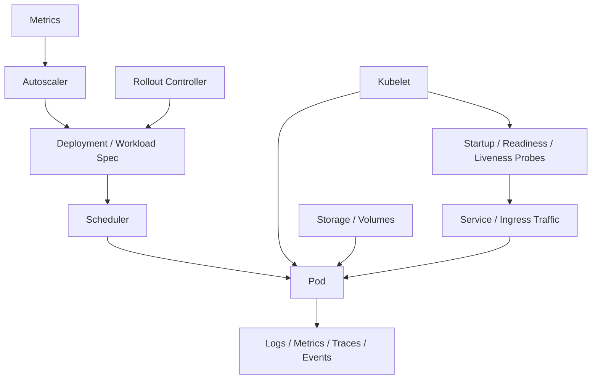
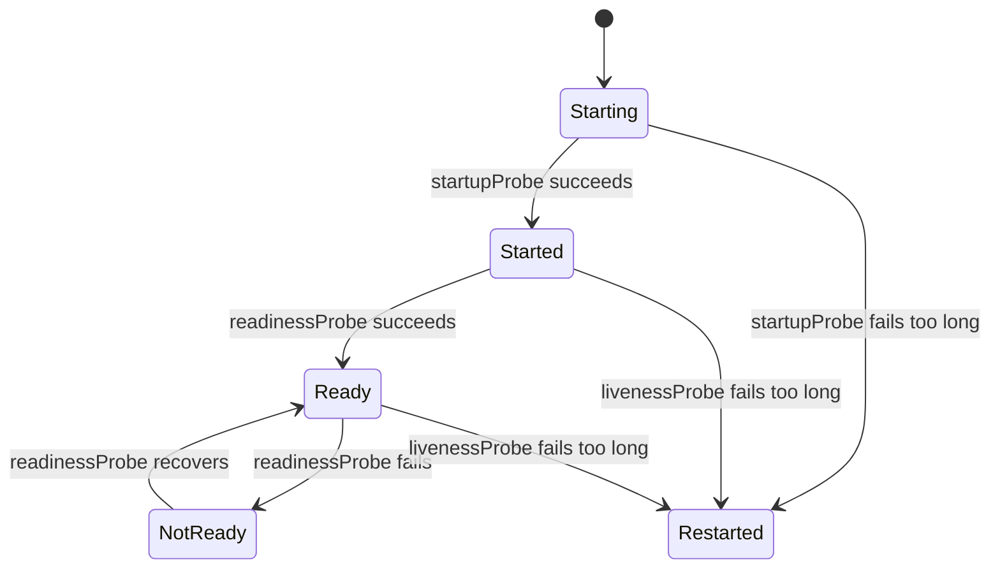
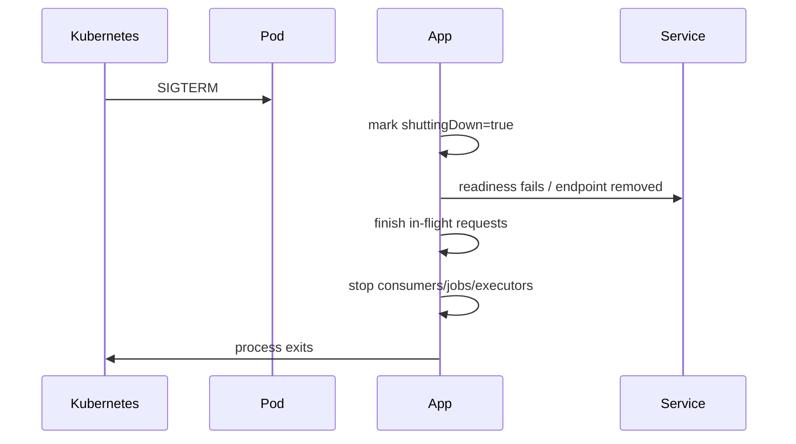

# Part 104 — Kubernetes Storage, Scaling, Probes, Rollouts, Operations, and Observability

> Fokus part ini: memahami operational mechanics Kubernetes yang menentukan apakah Java/JAX-RS service benar-benar siap production: storage, probes, resource requests/limits, autoscaling, rollout/rollback, graceful termination, observability, dan debugging. Part ini menyambungkan desain aplikasi dengan realitas runtime cluster.

Catatan penting:

```text
This part does not assume CSG uses HPA, VPA, KEDA, Argo Rollouts, Flux, Argo CD,
Prometheus, Grafana, OpenTelemetry Collector, CloudWatch, Azure Monitor,
EBS, EFS, Azure Disk, Azure Files, or a specific storage class.

Treat storage class, autoscaling strategy, rollout controller, observability stack,
probe standard, resource sizing policy, and production runbooks as internal
verification items.
```

Core idea:

```text
A Kubernetes Deployment is not production-ready just because the Pod is Running.

It is production-ready only when storage, probes, resources, scaling, rollout,
termination, and observability match the workload's real behavior.
```

Senior engineer asks:

```text
Can this Pod start reliably?
Can it become ready only when it can serve traffic?
Can it fail without corrupting work?
Can it scale without overload or duplicate processing?
Can it roll out without downtime?
Can it shut down without dropping in-flight requests?
Can operators see what is happening before customers report it?
```

---

## 1. Operational Model

A production workload is controlled by multiple feedback loops:



The app participates in these loops through:

```text
listen port
startup behavior
health endpoints
resource consumption
shutdown behavior
log/metric/trace emission
storage access
backpressure behavior
```

---

## 2. Storage Mental Model

Kubernetes storage has different lifetimes.

| Storage Type | Lifetime | Common Use | Risk |
|---|---|---|---|
| Container filesystem | Container lifetime | temporary process files | lost on restart |
| `emptyDir` | Pod lifetime | temp files, scratch space | lost when Pod removed |
| ConfigMap/Secret volume | config/secret projection | runtime input | not general storage |
| PersistentVolume/PVC | independent of Pod | durable data | attachment, performance, backup concerns |
| Object storage | external service | files/blobs/artifacts | network/credential dependency |

For stateless Java/JAX-RS API services, prefer:

```text
no local durable state
external source of truth
object storage for large files
DB for transactional state
Redis/Kafka only for their intended semantics
```

Avoid:

```text
writing critical state to container filesystem
assuming local temp files survive rollout
storing uploaded files in Pod filesystem without external handoff
using shared filesystem as hidden coordination layer
```

---

## 3. Ephemeral Storage and Temp File Risk

Even stateless services use disk accidentally:

```text
multipart upload temp files
JVM temp directory
large response buffering
generated reports
log files if not stdout/stderr
native libraries
heap dumps
thread dumps
```

Failure modes:

```text
ephemeral storage full
Pod evicted due to node disk pressure
temp file leak
file upload consumes node storage
heap dump fills filesystem after OOM
```

Production rule:

```text
If the service handles files or large payloads, ephemeral storage is a capacity
concern, not an implementation detail.
```

Checklist:

```text
Where do multipart temp files go?
Is max upload size enforced before temp storage exhaustion?
Are temp files deleted on success and failure?
Can heap dumps be written safely?
Are logs emitted to stdout/stderr, not unbounded local files?
Are ephemeral storage requests/limits configured if needed?
```

---

## 4. Persistent Volumes and Stateful Workloads

Most JAX-RS API services should be stateless.

Persistent volumes are justified when:

```text
workload is stateful by design
local durable data is required
platform-managed stateful component is deployed
shared file integration is explicitly required
```

For ordinary API service, PVC usage deserves scrutiny.

Questions:

```text
Why does an API Pod need persistent disk?
What happens during rollout?
Can multiple replicas mount it safely?
Is access mode ReadWriteOnce, ReadOnlyMany, or ReadWriteMany?
Who backs it up?
How is restore tested?
What is the performance profile?
What is the failure domain?
```

Red flags:

```text
PVC used as queue
PVC used as lock
PVC used as database substitute
multiple replicas writing shared files with no coordination
business-critical files stored without backup/retention policy
```

---

## 5. Probes: Startup, Readiness, Liveness

Kubernetes probes influence lifecycle and traffic eligibility.

```text
startupProbe: gives slow-starting app time before liveness begins
readinessProbe: controls whether Pod receives Service traffic
livenessProbe: restarts process if it is stuck/broken beyond recovery
```

Mental model:



JAX-RS service implication:

```text
Health endpoints are part of runtime contract.
They are not random debug endpoints.
```

---

## 6. Probe Design for Java/JAX-RS

Example endpoints:

```text
/live
/ready
/startup
```

Possible meanings:

```text
/live: JVM and HTTP server event loop/request handling alive
/ready: service can serve real traffic with required local initialization complete
/startup: service completed slow initialization, classloading, migrations check, config validation
```

Avoid liveness checks that depend on unstable downstreams:

```text
DB briefly unavailable -> liveness fails -> Pod restarts -> connection storm -> outage worsens
```

Readiness can include critical dependency checks, but must be cheap and intentional.

Good readiness signals:

```text
config loaded and validated
server accepting requests
required local resources initialized
connection pool initialized
critical dependency mode known
not in graceful shutdown
```

Dangerous readiness signals:

```text
full DB query on every probe
expensive external API call
deep dependency tree check
check that fails during harmless transient blip
```

---

## 7. Probe Configuration Example

Example shape:

```yaml
startupProbe:
  httpGet:
    path: /health/startup
    port: 8080
  failureThreshold: 30
  periodSeconds: 2

readinessProbe:
  httpGet:
    path: /health/ready
    port: 8080
  initialDelaySeconds: 5
  periodSeconds: 5
  timeoutSeconds: 2
  failureThreshold: 3

livenessProbe:
  httpGet:
    path: /health/live
    port: 8080
  initialDelaySeconds: 20
  periodSeconds: 10
  timeoutSeconds: 2
  failureThreshold: 3
```

This is not a universal config.

Internal verification must decide:

```text
standard health paths
allowed probe timeout
startup budget for Java warmup
whether probes pass through service mesh
whether health endpoints require auth bypass
```

---

## 8. Resource Requests and Limits

Kubernetes scheduling and runtime behavior depend on resource requests and limits.

```text
request: amount used for scheduling and capacity planning
limit: maximum allowed by runtime enforcement
```

For Java services, memory limit must align with:

```text
heap
metaspace
thread stacks
native memory
direct buffers
JIT/code cache
GC overhead
agent overhead
```

CPU limit can cause:

```text
throttling
long GC pauses
slow startup
probe failures
high tail latency
misleading low CPU usage graphs
```

Production invariant:

```text
JVM sizing and Kubernetes resource sizing must be designed together.
```

Example manifest fragment:

```yaml
resources:
  requests:
    cpu: "500m"
    memory: "1Gi"
  limits:
    cpu: "2"
    memory: "2Gi"
```

Do not cargo-cult values.

Base them on:

```text
load test
production telemetry
heap/native memory analysis
GC behavior
thread count
file/stream workload
startup behavior
SLO target
```

---

## 9. OOMKilled, Eviction, and Node Pressure

Different memory/disk failures look similar from the outside.

| Symptom | Possible Cause |
|---|---|
| `OOMKilled` | container exceeded memory limit |
| `Evicted` | node pressure: memory/disk/PID |
| repeated restart | liveness failure, crash, OOM, bad config |
| readiness flapping | dependency issue, startup too slow, CPU throttling |
| 503 during rollout | no ready endpoints |

Debug commands:

```bash
kubectl describe pod <pod> -n <ns>
kubectl get events -n <ns> --sort-by=.lastTimestamp
kubectl logs <pod> -n <ns> --previous
kubectl top pod -n <ns>
kubectl top node
```

For JVM:

```text
Check container memory limit.
Check heap percentage / Xmx.
Check native memory.
Check thread count.
Check direct buffer use.
Check GC logs.
Check heap dump policy.
```

---

## 10. Horizontal Scaling and HPA

Horizontal Pod Autoscaler usually scales based on metrics such as CPU, memory, or custom/external metrics.

API service scaling considerations:

```text
request rate
latency
CPU saturation
connection pool capacity
DB bottleneck
Kafka producer/consumer behavior
cache pressure
external API limits
```

HPA can help only if adding replicas increases real capacity.

It may not help when bottleneck is:

```text
single database lock
connection pool limit too high per replica
external downstream rate limit
shared Redis hot key
Kafka partition count too low for consumer scaling
global synchronized job
```

Senior scaling question:

```text
What is the bottleneck, and does adding Pods relieve it or amplify it?
```

---

## 11. Scaling Failure Modes

Common failure patterns:

```text
HPA scales up after latency already spikes
new replicas create DB connection storm
all replicas warm cache simultaneously
all replicas run same startup migration/check
Kafka consumers exceed partition count
scheduled jobs run in every replica
rate limiter state not shared correctly
```

Mitigations:

```text
connection pool sizing per replica
startup jitter
cache warmup control
readiness gate until ready for traffic
singleton jobs moved to CronJob or leader election
Kafka consumer concurrency aligned with partition count
rate limit at gateway or shared state
```

---

## 12. Rollouts and Rollbacks

Deployment rollout updates Pods gradually.

Important knobs:

```text
replicas
maxUnavailable
maxSurge
progressDeadlineSeconds
minReadySeconds
revisionHistoryLimit
```

Example:

```yaml
strategy:
  type: RollingUpdate
  rollingUpdate:
    maxUnavailable: 0
    maxSurge: 1
minReadySeconds: 10
progressDeadlineSeconds: 600
```

Trade-off:

```text
maxUnavailable: 0 preserves capacity but may need extra resources.
maxSurge: 1 adds temporary capacity but may exceed quota.
minReadySeconds prevents immediate traffic confidence from a briefly-ready Pod.
```

Rollback is not always safe.

Rollback can fail if:

```text
DB migration is not backward-compatible
Kafka event schema changed incompatibly
feature flag default changed globally
new version wrote data old version cannot read
external dependency contract changed
```

Thus rollout safety depends on earlier parts:

```text
API compatibility
expand-contract migration
event compatibility
feature flags
observability
```

---

## 13. Graceful Shutdown

During termination:

```text
Pod receives SIGTERM
readiness should fail or Pod should be removed from endpoints
app stops accepting new work
in-flight requests finish within grace period
background workers stop safely
process exits before SIGKILL
```

Mental model:



Failure modes:

```text
Pod killed before request finishes
Kafka consumer commits incorrectly during shutdown
executor keeps accepting work
readiness remains true during termination
preStop sleeps but app still accepts traffic
terminationGracePeriodSeconds too short
```

JAX-RS service checklist:

```text
Does app stop accepting new requests during shutdown?
Does readiness reflect shutdown state?
Are executor pools shut down?
Are HTTP clients closed?
Are Kafka consumers/producers closed?
Are DB pools closed?
Is shutdown timeout shorter than terminationGracePeriodSeconds?
```

---

## 14. PodDisruptionBudget and Availability

PodDisruptionBudget protects against voluntary disruptions removing too many Pods.

Example:

```yaml
apiVersion: policy/v1
kind: PodDisruptionBudget
metadata:
  name: quote-api-pdb
spec:
  minAvailable: 2
  selector:
    matchLabels:
      app: quote-api
```

Use when:

```text
service has multiple replicas
node drain/upgrade should preserve capacity
availability matters during platform maintenance
```

Risk:

```text
PDB too strict can block node maintenance.
PDB with too few replicas gives false confidence.
PDB does not protect against involuntary crashes or OOM.
```

---

## 15. Observability: Four Kubernetes Signals

For operations, combine:

```text
application logs
application metrics
distributed traces
Kubernetes events/status
```

Kubernetes-specific signals:

```text
Pod phase
container restart count
last termination reason
readiness/liveness failures
OOMKilled/Evicted
rollout status
HPA scaling events
node pressure
image pull errors
volume mount errors
```

Application-specific signals:

```text
request rate
latency histogram
error rate
saturation
DB pool usage
HTTP client pool usage
Kafka lag
cache hit/miss
thread count
GC pause
heap/native memory
```

Senior rule:

```text
Dashboards must connect Kubernetes symptoms with application symptoms.
```

A restart count without GC/memory context is weak.
A latency graph without rollout/HPA context is weak.

---

## 16. Logs in Kubernetes

Preferred pattern:

```text
write structured logs to stdout/stderr
collector ships logs to central platform
correlation/trace IDs included
sensitive fields redacted
```

Avoid:

```text
writing application logs only to local files
unbounded logs filling disk
logging full request/response body by default
logging secrets from env/config
losing previous container logs after crash investigation
```

Debug:

```bash
kubectl logs <pod> -n <ns>
kubectl logs <pod> -n <ns> --previous
kubectl logs deploy/<deployment> -n <ns> --since=30m
```

Production reality:

```text
kubectl logs is a debugging tool, not the observability strategy.
```

---

## 17. Metrics and Autoscaling Signals

Metrics must be selected carefully.

Bad autoscaling signal examples:

```text
CPU only for I/O-bound service
memory only for service with stable heap
request count without latency/error context
queue length without worker capacity context
Kafka lag without partition/consumer understanding
```

Better signal thinking:

```text
Scale API service by CPU only if CPU is bottleneck.
Scale worker by lag/backlog if workers can drain independently.
Scale cautiously if downstream dependency is already saturated.
```

For Java/JAX-RS service, useful metrics:

```text
HTTP request rate by endpoint family
latency histogram
error rate by class
in-flight requests
executor queue size
DB pool active/idle/wait
HTTP client pool active/wait
Kafka producer error/retry
Kafka consumer lag
Redis latency/error
JVM heap/non-heap/thread/GC
container CPU throttle
container memory working set
```

---

## 18. Rollout Observability

During rollout, watch:

```text
new Pod startup time
readiness time
restart count
probe failure
latency/error rate by version
traffic distribution by version
DB migration status
Kafka event compatibility
feature flag state
```

Commands:

```bash
kubectl rollout status deploy/<deployment> -n <ns>
kubectl rollout history deploy/<deployment> -n <ns>
kubectl describe deploy/<deployment> -n <ns>
kubectl get rs -n <ns>
kubectl get pods -n <ns> -w
```

Rollback command:

```bash
kubectl rollout undo deploy/<deployment> -n <ns>
```

But remember:

```text
Kubernetes rollback only rolls back workload spec.
It does not automatically roll back database, external config, emitted events,
object storage writes, or downstream side effects.
```

---

## 19. Operational Debugging Playbook

### Symptom: 503 after deployment

Check:

```text
readiness failures
no endpoints
bad Service selector
deployment unavailable replicas
quota/resource scheduling issue
new app startup failure
```

Commands:

```bash
kubectl get deploy,pod,svc,endpointslice -n <ns>
kubectl describe pod <pod> -n <ns>
kubectl get events -n <ns> --sort-by=.lastTimestamp
```

### Symptom: slow latency after scale-up

Check:

```text
CPU throttling
cold JVM/JIT warmup
cache warmup
DB connection storm
new pods not actually ready
load balancer imbalance
```

### Symptom: repeated restarts

Check:

```text
last termination state
OOMKilled
probe failure
bad config/secret
image/startup command
application exception
```

### Symptom: rollout stuck

Check:

```text
image pull error
insufficient resources
readiness never succeeds
progress deadline exceeded
PDB/quota constraints
volume mount failure
```

---

## 20. Java/JAX-RS Specific Operational Concerns

JAX-RS services often have these hidden operational dependencies:

```text
ResourceConfig initialization time
provider scanning time
Jackson/JAXB initialization
connection pool warmup
JIT warmup
classloading
schema/migration check
HTTP client initialization
secret/config fetch at startup
Kafka producer metadata fetch
Redis connection initialization
```

Operational risks:

```text
startupProbe too aggressive
readiness true before dependencies initialized
liveness kills during GC pause or CPU throttling
rollout sends traffic before JIT warmup
all replicas warm up expensive caches at once
shutdown kills in-flight requests or background tasks
```

Mitigation:

```text
explicit startup probe
readiness state machine
bounded initialization
lazy but safe client initialization
connection pool warmup if needed
jittered warmup
correct graceful shutdown
versioned dashboards during rollout
```

---

## 21. Manifest Review Example

Example workload fragment:

```yaml
apiVersion: apps/v1
kind: Deployment
metadata:
  name: quote-api
spec:
  replicas: 3
  strategy:
    type: RollingUpdate
    rollingUpdate:
      maxUnavailable: 0
      maxSurge: 1
  template:
    metadata:
      labels:
        app: quote-api
        version: v1
    spec:
      terminationGracePeriodSeconds: 45
      containers:
        - name: quote-api
          image: registry.example/quote-api:1.2.3
          ports:
            - containerPort: 8080
          resources:
            requests:
              cpu: "500m"
              memory: "1Gi"
            limits:
              cpu: "2"
              memory: "2Gi"
          startupProbe:
            httpGet:
              path: /health/startup
              port: 8080
            failureThreshold: 30
            periodSeconds: 2
          readinessProbe:
            httpGet:
              path: /health/ready
              port: 8080
            periodSeconds: 5
            timeoutSeconds: 2
          livenessProbe:
            httpGet:
              path: /health/live
              port: 8080
            periodSeconds: 10
            timeoutSeconds: 2
```

Review questions:

```text
Do resources match JVM sizing?
Does startupProbe account for Java startup/warmup?
Does readiness reflect real traffic capability?
Does liveness avoid dependency-induced restart storms?
Is termination grace long enough for in-flight requests and shutdown hooks?
Is rollout strategy safe for required availability?
Are labels compatible with Service selector and observability dimensions?
```

---

## 22. PR Review Checklist

When reviewing Kubernetes operations changes, check:

```text
Are resource requests/limits set and justified?
Do JVM heap/native settings fit memory limit?
Is CPU limit likely to cause throttling under expected load?
Are startup/readiness/liveness probes present and semantically correct?
Are probe timeouts/failure thresholds realistic for Java service behavior?
Does readiness fail during graceful shutdown?
Is terminationGracePeriodSeconds aligned with app shutdown timeout?
Is rollout strategy safe for availability?
Is PDB needed and correctly set?
Is HPA present if service needs autoscaling?
Does HPA metric reflect real bottleneck?
Could scale-out overload DB/cache/downstream systems?
Is ephemeral storage use understood?
Are PVCs justified if present?
Are logs structured and emitted to stdout/stderr?
Are metrics/traces available by version and instance?
Are dashboards and alerts updated with the deployment change?
Can rollback safely handle DB/event/config changes?
```

Red flags:

```text
no readiness probe for production HTTP service
liveness depends on DB/external API
startupProbe missing for slow Java service
CPU/memory copied from another service with no evidence
Xmx equals container memory limit
HPA scales on CPU for a DB-bound service
all replicas run the same scheduled job
PVC attached to stateless API with no explanation
rollout strategy can reduce replicas to zero
no previous logs checked after crash loop
rollback assumed safe despite DB migration
```

---

## 23. Internal Verification Checklist

Verify in CSG/internal environment:

```text
standard health endpoint paths
probe semantics expected by platform
startup budget for Java/JAX-RS services
resource request/limit sizing policy
JVM container sizing standard
CPU limit policy
OOMKilled diagnosis runbook
ephemeral storage request/limit policy
whether PVCs are allowed for API services
approved storage classes
backup/restore ownership for persistent storage
HPA/VPA/KEDA usage standard
autoscaling metric conventions
connection pool sizing rules under HPA
rollout controller and strategy standard
canary/blue-green/progressive delivery integration
PDB policy
terminationGracePeriodSeconds standard
graceful shutdown implementation pattern
log collection platform
metrics stack
tracing stack
Kubernetes event retention/access
standard dashboards for Java services
alert severity rules
runbook for CrashLoopBackOff, OOMKilled, 503, rollout stuck
rollback and roll-forward playbook
```

---

## 24. Senior Engineer Takeaway

Kubernetes operations are not separate from application design.

For production Java/JAX-RS service, the invariant is:

```text
The application lifecycle and Kubernetes lifecycle must agree.
```

That means:

```text
startupProbe matches app startup
readiness matches ability to serve traffic
liveness detects unrecoverable process failure
resources match JVM behavior
scaling matches real bottleneck
rollout matches compatibility guarantees
shutdown matches in-flight work behavior
observability exposes every important lifecycle transition
```

When these are aligned, Kubernetes is a reliable operating substrate.

When they are not, Kubernetes becomes a failure amplifier.
