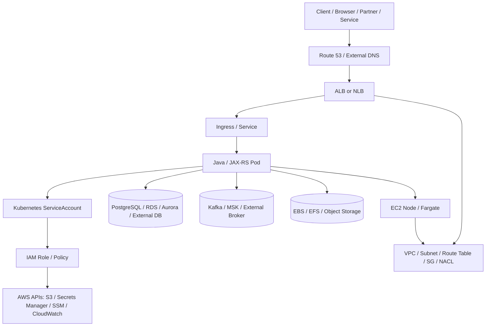
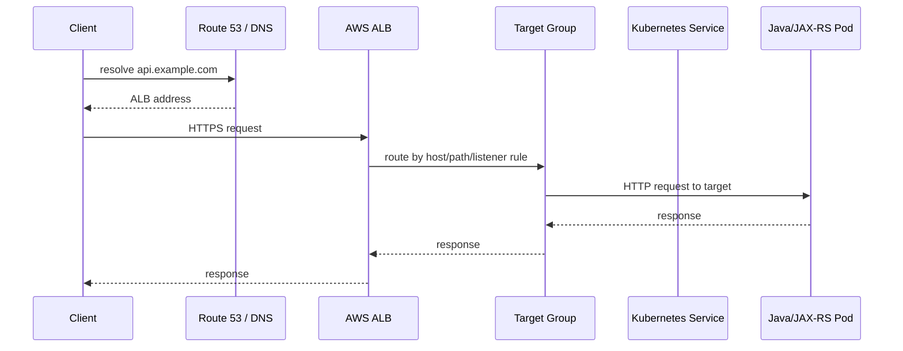
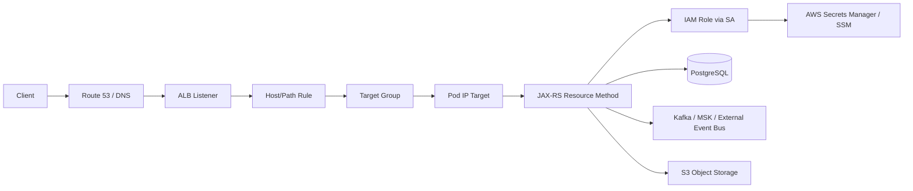

# Part 105 — AWS EKS Integration: IAM, Storage, Load Balancer, External Secrets, Nodes, Traffic

> Fokus part ini: memahami bagaimana Java/JAX-RS service berjalan di Amazon EKS secara production-oriented: identity, IAM, storage, load balancer, secret/config access, node management, VPC networking, traffic flow, failure mode, debugging, dan PR review.

Catatan penting:

```text
This part does not assume CSG uses Amazon EKS, IRSA, EKS Pod Identity,
AWS Load Balancer Controller, EBS CSI, EFS CSI, External Secrets Operator,
Secrets Store CSI, AWS Secrets Manager, Systems Manager Parameter Store,
Karpenter, Managed Node Groups, Fargate, CloudWatch, Prometheus, Grafana,
or any specific AWS account/network topology.

Treat all AWS/EKS details as internal verification items.
```

Core idea:

```text
EKS is Kubernetes plus AWS identity, AWS networking, AWS storage, AWS load
balancing, AWS observability, AWS IAM, AWS account boundaries, and AWS failure modes.

A service can be correct as a Kubernetes workload and still fail in EKS because
IAM, VPC, DNS, node capacity, security groups, target groups, or cloud add-ons
are wrong.
```

Senior engineer asks:

```text
Which identity does this Pod use?
Which IAM permissions does that identity have?
Can the Pod reach STS, Secrets Manager, SSM, S3, RDS, Kafka, or internal endpoints?
Which load balancer terminates TLS?
Which target group health check decides readiness?
Which storage system backs the PVC?
Which node type runs the Pod?
Which AWS account, VPC, subnet, route table, and security group are in path?
Can we debug this from Kubernetes events, controller logs, AWS APIs, and CloudTrail?
```

---

## 1. Where EKS Fits in the Stack

A Java/JAX-RS service on EKS normally sits across these layers:



Kubernetes gives:

```text
Pod
Deployment
Service
Ingress
ConfigMap
Secret
ServiceAccount
RBAC
StorageClass
PVC
Node scheduling
```

EKS/AWS adds:

```text
IAM
STS
EKS Pod Identity or IRSA
VPC CNI
subnets
security groups
route tables
NAT gateways
VPC endpoints
ALB/NLB
target groups
EBS/EFS CSI drivers
ECR
CloudWatch
CloudTrail
managed node groups
Fargate profiles
AWS account boundaries
```

The senior mistake is to debug all failures as Kubernetes failures.

Many EKS failures are actually AWS control plane, IAM, networking, or add-on failures.

---

## 2. EKS Responsibility Split

EKS is a managed Kubernetes service, but not a fully managed application runtime.

| Area | Owned by AWS/EKS | Usually owned by platform/team |
|---|---|---|
| Kubernetes control plane | managed by AWS | version selection, upgrade timing, API usage |
| Worker nodes | managed partially if MNG/Fargate | sizing, AMI, labels, taints, autoscaling, disruption |
| Pod identity | supported by EKS/IAM | role design, service account mapping, least privilege |
| Load balancing | AWS ALB/NLB | ingress/service annotations, TLS, health checks |
| Storage | EBS/EFS services | CSI driver, StorageClass, PVC design, backups |
| Secrets/config | AWS services available | access pattern, rotation, refresh, redaction |
| Observability | CloudWatch/CloudTrail available | metrics, logs, traces, dashboards, alerts |
| Network | AWS VPC primitives | subnet selection, routing, SG, NACL, endpoint design |

Production ownership means understanding which team owns which lever.

---

## 3. Pod Identity Mental Model

A Pod should not carry long-lived AWS keys.

Preferred production model:

```text
Pod -> Kubernetes ServiceAccount -> AWS IAM role -> temporary credentials -> AWS API
```

There are two common EKS-native models:

| Model | Mental model | Notes |
|---|---|---|
| IRSA | ServiceAccount is federated through cluster OIDC to assume IAM role | mature, cluster OIDC provider involved |
| EKS Pod Identity | EKS maps ServiceAccount to IAM role through Pod Identity association and node agent | simpler operational model in many cases |

Do not assume which one is used.

Verify from:

```bash
kubectl get sa -n <ns> <service-account> -o yaml
kubectl describe pod -n <ns> <pod>
aws eks list-pod-identity-associations --cluster-name <cluster>
aws eks describe-addon --cluster-name <cluster> --addon-name eks-pod-identity-agent
```

For IRSA, look for annotations such as:

```yaml
apiVersion: v1
kind: ServiceAccount
metadata:
  name: quote-order-api
  namespace: quote-order
  annotations:
    eks.amazonaws.com/role-arn: arn:aws:iam::<account-id>:role/quote-order-api-role
```

For EKS Pod Identity, the mapping may not be visible only from the ServiceAccount. Verify the EKS association:

```bash
aws eks list-pod-identity-associations \
  --cluster-name <cluster> \
  --namespace quote-order \
  --service-account quote-order-api
```

Inside a diagnostic Pod, a useful check is:

```bash
aws sts get-caller-identity
```

But interpret it carefully:

```text
Success proves the Pod has some AWS identity.
It does not prove the identity is the intended one.
It does not prove the permissions are least-privilege.
It does not prove all required service calls will work.
```

---

## 4. IAM Design for Java/JAX-RS Services

A JAX-RS API may need AWS permissions for:

```text
read config from SSM Parameter Store
read secret from Secrets Manager
read/write object to S3
emit metrics/logs
publish events
call KMS decrypt
access ECR indirectly through node/pull identity
read from SQS/SNS/MSK-related APIs
```

IAM policy should be built from operation-level needs.

Bad policy smell:

```json
{
  "Effect": "Allow",
  "Action": "*",
  "Resource": "*"
}
```

Better shape:

```json
{
  "Effect": "Allow",
  "Action": [
    "secretsmanager:GetSecretValue",
    "ssm:GetParameter",
    "kms:Decrypt"
  ],
  "Resource": [
    "arn:aws:secretsmanager:ap-southeast-1:123456789012:secret:quote-order/*",
    "arn:aws:ssm:ap-southeast-1:123456789012:parameter/quote-order/*",
    "arn:aws:kms:ap-southeast-1:123456789012:key/<key-id>"
  ]
}
```

Senior review questions:

```text
Is permission scoped to namespace/service/environment?
Is it tied to a ServiceAccount, not node role?
Can one compromised Pod access another service's secrets?
Does policy allow wildcard read across all secrets?
Does KMS policy also allow the role?
Does CloudTrail show the correct role as caller?
Are cross-account calls intentional and documented?
```

---

## 5. EKS Pod Identity Failure Modes

Common symptoms:

| Symptom | Possible cause |
|---|---|
| `AccessDeniedException` | role lacks action/resource/KMS permission |
| `NoCredentialProviders` | SDK cannot discover credentials |
| `ExpiredToken` | refresh path broken or time skew |
| works on one Pod but not another | ServiceAccount mismatch, association mismatch, node agent issue |
| works locally but not in cluster | local profile differs from Pod role |
| credentials resolve to node role | IMDS exposure or Pod identity not configured correctly |
| cannot reach credential endpoint | proxy/no_proxy issue, node agent issue, network policy |

Operational checks:

```bash
kubectl get pod -n <ns> <pod> -o jsonpath='{.spec.serviceAccountName}'
kubectl get sa -n <ns> <sa> -o yaml
kubectl logs -n kube-system -l app.kubernetes.io/name=eks-pod-identity-agent
aws cloudtrail lookup-events --lookup-attributes AttributeKey=Username,AttributeValue=<role-name>
```

In Java, avoid hardcoding credentials:

```java
// Prefer provider chain from SDK runtime environment.
// Do not commit access keys or inject static long-lived credentials.
var s3 = S3Client.builder()
    .region(Region.AP_SOUTHEAST_1)
    .build();
```

The SDK should resolve credentials from the runtime environment.

---

## 6. Storage on EKS: EBS, EFS, Object Storage

Storage choice is a workload decision.

| Storage | Kubernetes shape | Access pattern | Good fit | Risk |
|---|---|---|---|---|
| EBS | PVC / block volume | usually single-node attach | database-like single writer, durable disk | AZ attachment, RWO semantics, failover delay |
| EFS | PVC / network file system | multi-pod shared access | shared files, reports, imports/exports | NFS latency, permissions, SG/DNS issues |
| S3 | app-level object storage | API-based object access | large files, artifacts, documents | not POSIX filesystem unless special layer used |
| `emptyDir` | Pod-local scratch | temporary | temp file processing | lost on Pod deletion |
| container FS | container-local | temporary | avoid except ephemeral | lost on restart, disk pressure |

For most Java/JAX-RS API services:

```text
transactional state -> PostgreSQL / database
large binary object -> S3 / object storage
temporary scratch -> emptyDir with size discipline
shared file system -> EFS only if semantics require it
block volume -> usually not for stateless API Pods
```

Example PVC intent:

```yaml
apiVersion: v1
kind: PersistentVolumeClaim
metadata:
  name: report-export-workspace
spec:
  accessModes:
    - ReadWriteMany
  storageClassName: efs-sc
  resources:
    requests:
      storage: 20Gi
```

Do not cargo-cult PVCs into stateless services.

A PVC adds:

```text
provisioning dependency
attach/mount lifecycle
backup/retention questions
performance characteristics
security permissions
cleanup responsibility
```

---

## 7. EBS CSI Design Notes

EBS behaves like cloud block storage.

Senior implications:

```text
EBS volume is attached to a node/AZ.
A Pod scheduled to the wrong zone may not mount it.
RWO workloads need careful disruption planning.
StorageClass parameters affect type, encryption, IOPS, throughput, expansion.
Snapshots/backups are not automatic application correctness.
```

Failure modes:

| Failure | Diagnostic path |
|---|---|
| PVC Pending | check StorageClass, CSI driver, IAM permissions, events |
| Pod stuck ContainerCreating | check mount/attach events |
| volume zone mismatch | check node AZ and PV node affinity |
| slow I/O | check EBS type, IOPS, throughput, application pattern |
| cannot detach | check node health, force detach risk, in-flight writes |

Commands:

```bash
kubectl get storageclass
kubectl describe pvc -n <ns> <pvc>
kubectl describe pv <pv>
kubectl describe pod -n <ns> <pod>
kubectl logs -n kube-system -l app=ebs-csi-controller
```

---

## 8. EFS CSI Design Notes

EFS behaves like a network file system.

Good use cases:

```text
shared report/export/import directory
multi-pod read/write shared files
legacy component that expects filesystem semantics
```

Poor use cases:

```text
high-throughput low-latency database storage
coordination/locking substitute without careful semantics
hot path per-request small file operations
```

Failure modes:

| Failure | Possible cause |
|---|---|
| mount timeout | security group, NFS port, subnet, DNS |
| permission denied | POSIX uid/gid, access point config |
| high latency | NFS path in request hot path, throughput mode, burst credits |
| file corruption | concurrent writes without application-level discipline |

Debugging:

```bash
kubectl describe pvc -n <ns> <pvc>
kubectl describe pod -n <ns> <pod>
kubectl logs -n kube-system -l app=efs-csi-controller
nslookup <efs-dns-name>
```

---

## 9. AWS Load Balancing Model

EKS traffic often reaches Pods through:

```text
DNS -> ALB/NLB -> Kubernetes Service/Ingress -> Pod
```

Two common load balancer types:

| AWS LB | Kubernetes object | Layer | Typical use |
|---|---|---|---|
| ALB | Ingress | L7 HTTP/HTTPS | path/host routing, TLS, HTTP health checks |
| NLB | Service type LoadBalancer | L4 TCP/TLS/UDP | high-performance TCP, static IP-ish patterns, private services |

Typical ALB flow:



Critical choices:

```text
internet-facing vs internal
TLS termination point
target type: instance vs ip
health check path
listener rules
path rewrite behavior
security groups
WAF integration
idle timeout
HTTP/2 behavior
access logs
```

Example Ingress annotations are platform-specific and must be verified:

```yaml
apiVersion: networking.k8s.io/v1
kind: Ingress
metadata:
  name: quote-order-api
  annotations:
    alb.ingress.kubernetes.io/scheme: internal
    alb.ingress.kubernetes.io/target-type: ip
    alb.ingress.kubernetes.io/healthcheck-path: /health/ready
    alb.ingress.kubernetes.io/listen-ports: '[{"HTTPS":443}]'
spec:
  ingressClassName: alb
  rules:
    - host: quote-order.internal.example.com
      http:
        paths:
          - path: /
            pathType: Prefix
            backend:
              service:
                name: quote-order-api
                port:
                  number: 8080
```

Do not copy annotations without understanding platform standards.

---

## 10. Load Balancer Failure Modes

| Symptom | Likely area |
|---|---|
| DNS resolves but connection times out | security group, subnet route, internal/external mismatch |
| ALB returns 503 | no healthy targets, readiness mismatch, target group health check failure |
| ALB returns 404 | listener rule/path/host mismatch, ingress class mismatch |
| TLS error | certificate, SNI, listener, trust chain |
| request reaches wrong service | host/path rule conflict, shared ingress group issue |
| health check fails but app works manually | health path/status/header mismatch |
| large upload fails | ALB/gateway/body timeout, app multipart limits |
| streaming broken | idle timeout, buffering, proxy behavior |

Debugging path:

```bash
kubectl get ingress -n <ns>
kubectl describe ingress -n <ns> <ingress>
kubectl get svc -n <ns>
kubectl get endpointslice -n <ns>
kubectl get pods -n <ns> -o wide
kubectl logs -n kube-system deployment/aws-load-balancer-controller
aws elbv2 describe-load-balancers
aws elbv2 describe-target-health --target-group-arn <arn>
```

Senior habit:

```text
Always compare three health concepts:
1. Kubernetes readiness
2. AWS target group health
3. Application business readiness
```

They are related but not identical.

---

## 11. External Secrets and Runtime Secret Access

A Java/JAX-RS service may consume secrets through several patterns:

| Pattern | How app reads secret | Pros | Risks |
|---|---|---|---|
| Kubernetes Secret synced by operator | env/volume | app simple | stale secret, sync failure, K8s Secret exposure |
| Secrets Store CSI volume | mounted file | avoids env var, rotation possible | app must reload/read file safely |
| SDK call to Secrets Manager/SSM | app code | dynamic, explicit | IAM, latency, startup dependency |
| Config service wrapper | internal abstraction | consistent | hidden failure mode |

Do not assume a Secret is safe because it is a Kubernetes Secret.

Production questions:

```text
Where is the source of truth?
How is it rotated?
How does the app detect rotation?
Is secret value logged during config dump?
Is the secret injected as env var or mounted file?
Does restart pick up a new secret?
Does runtime reload pick up a new secret?
Can old and new credential work during rotation window?
```

Example shape using an external secret operator may look like:

```yaml
apiVersion: external-secrets.io/v1beta1
kind: ExternalSecret
metadata:
  name: quote-order-db-secret
spec:
  refreshInterval: 1h
  secretStoreRef:
    name: aws-secrets-manager
    kind: ClusterSecretStore
  target:
    name: quote-order-db-secret
  data:
    - secretKey: password
      remoteRef:
        key: /quote-order/prod/db
        property: password
```

This is not a recommendation to use this exact CRD.

It is a model to help you recognize the pattern.

---

## 12. Node Management on EKS

The Pod runs on some compute substrate:

```text
managed node group
self-managed node group
Fargate profile
Karpenter-provisioned node
specialized node pool
```

Node-level concerns for Java services:

```text
CPU throttling
memory pressure
OOMKilled
ephemeral storage pressure
image pull latency
JIT warmup
node drain behavior
spot interruption
AZ spread
ENI/IP exhaustion
max Pods per node
node security group
kernel/network behavior
```

Example scheduling intent:

```yaml
apiVersion: apps/v1
kind: Deployment
metadata:
  name: quote-order-api
spec:
  template:
    spec:
      serviceAccountName: quote-order-api
      topologySpreadConstraints:
        - maxSkew: 1
          topologyKey: topology.kubernetes.io/zone
          whenUnsatisfiable: ScheduleAnyway
          labelSelector:
            matchLabels:
              app: quote-order-api
      containers:
        - name: app
          image: <account>.dkr.ecr.<region>.amazonaws.com/quote-order-api:<tag>
          resources:
            requests:
              cpu: "500m"
              memory: "1Gi"
            limits:
              memory: "2Gi"
```

CPU limits need careful review for JVM workloads.

Memory limits need alignment with:

```text
heap
metaspace
thread stacks
direct buffers
JIT/code cache
native libraries
TLS/compression buffers
observability agent overhead
```

---

## 13. EKS VPC Networking

EKS networking is usually not abstract Kubernetes networking only.

You must know:

```text
VPC
subnets
route tables
NAT gateway
VPC endpoints
security groups
NACLs
VPC CNI behavior
pod IP allocation
DNS resolver path
private hosted zones
cross-account/cross-VPC connectivity
```

Common EKS-specific network questions:

```text
Do Pods get VPC IPs?
Which subnet do Pods run in?
Can Pods reach private RDS/MSK/internal APIs?
Can Pods reach AWS APIs without public internet?
Are VPC endpoints used for STS, S3, Secrets Manager, SSM, ECR, CloudWatch?
Is DNS split-horizon involved?
Do security groups allow pod/node/LB paths?
Is network policy enforced by the CNI or another plugin?
```

A private cluster often requires explicit endpoints/routes for:

```text
ECR API
ECR Docker registry
S3
STS
Secrets Manager
SSM
CloudWatch Logs
KMS
```

Failure pattern:

```text
Application startup fails while reading secret.
The exception says timeout.
Root cause is not the Java SDK.
Root cause is no route to Secrets Manager endpoint or wrong proxy/no_proxy.
```

---

## 14. ECR and Image Pulling

Image pull path:

```text
kubelet on node -> ECR auth/token -> ECR registry -> image layers -> container runtime
```

Typical failures:

| Symptom | Possible cause |
|---|---|
| `ImagePullBackOff` | image tag missing, ECR permission, network path, registry auth |
| slow rollout | large image, cold node cache, slow pull, too many parallel rollouts |
| works in dev not prod | different account/region/ECR policy |
| node cannot pull | node role missing ECR permissions or no VPC endpoint/NAT |

Debugging:

```bash
kubectl describe pod -n <ns> <pod>
aws ecr describe-images --repository-name <repo> --image-ids imageTag=<tag>
```

Senior review:

```text
Is the tag immutable?
Is digest pinning used where required?
Is image signed/scanned?
Is rollback image still available?
Is image pull path private and reliable?
```

---

## 15. Observability on EKS

Minimum observable surface:

```text
Kubernetes events
Pod logs
application metrics
application traces
node metrics
container restart/OOM metrics
ALB/NLB metrics
target group health
CloudTrail IAM events
controller logs
EBS/EFS metrics if used
```

Do not rely only on application logs.

When a request fails before reaching Java, the answer is outside the JVM:

```text
Route 53
ALB/NLB listener
target group
security group
ingress controller
service/endpoints
node/pod network
DNS
TLS
```

When AWS access fails:

```text
IAM policy
role association
STS
credential provider chain
endpoint/network
KMS policy
resource policy
CloudTrail
```

---

## 16. End-to-End Request Flow in EKS



Debug by boundary:

| Boundary | Evidence |
|---|---|
| DNS to LB | DNS record, ALB address, TLS cert |
| LB to target | target group health, listener rules, security groups |
| target to Pod | endpoints, readiness, pod IP, node SG |
| Pod to app | container logs, health endpoint, port binding |
| app to AWS API | IAM role, CloudTrail, SDK error, endpoint route |
| app to DB/Kafka | network path, credentials, client metrics, server logs |

---

## 17. EKS-Specific Production Failure Modes

### 17.1 IAM Permission Drift

A deployment works until a new code path calls a new AWS API action.

Symptom:

```text
AccessDeniedException in one endpoint only.
```

Senior response:

```text
Do not broaden to wildcard.
Map exact call -> action -> resource -> KMS/resource policy -> role.
Add least-privilege permission with test evidence.
```

### 17.2 Target Group Health Mismatch

Pod readiness passes, but ALB target is unhealthy.

Possible causes:

```text
wrong health path
wrong port
security group blocks LB
app requires Host header
health endpoint returns 401/403
path rewrite mismatch
startup too slow
```

### 17.3 Private Subnet AWS API Timeout

Pod cannot call Secrets Manager, SSM, STS, or ECR.

Possible causes:

```text
no NAT gateway
missing VPC endpoint
endpoint security group blocks traffic
DNS private hosted zone issue
proxy/no_proxy incorrect
```

### 17.4 EBS AZ Mismatch

Pod cannot mount a PVC after rescheduling.

Possible causes:

```text
PV bound to zone A
Pod scheduled to zone B
storage class WaitForFirstConsumer not used
node affinity not respected
```

### 17.5 Node IP/ENI Exhaustion

Pods stay Pending even though CPU/memory looks available.

Possible causes:

```text
VPC CNI IP exhaustion
subnet too small
ENI limit reached
max pods per node reached
```

### 17.6 ALB Rule Conflict

Multiple Ingress resources share group/name and accidentally override/reroute traffic.

Possible causes:

```text
shared ingress group
host/path overlap
annotation conflict
team boundary not enforced
```

---

## 18. Debugging Playbook

Start from symptom.

### 18.1 Pod Cannot Start

```bash
kubectl get pod -n <ns> <pod> -o wide
kubectl describe pod -n <ns> <pod>
kubectl logs -n <ns> <pod> --previous
kubectl get events -n <ns> --sort-by=.lastTimestamp
```

Check:

```text
image pull
config/secret mount
service account
volume mount
node scheduling
OOMKilled
startup probe
```

### 18.2 Pod Cannot Access AWS API

```bash
kubectl exec -n <ns> <pod> -- env | sort
kubectl exec -n <ns> <pod> -- aws sts get-caller-identity
kubectl get sa -n <ns> <sa> -o yaml
aws cloudtrail lookup-events --lookup-attributes AttributeKey=EventName,AttributeValue=AssumeRole
```

Check:

```text
role identity
policy action/resource
KMS/resource policy
SDK credential chain
STS endpoint
proxy/no_proxy
CloudTrail caller
```

### 18.3 Ingress Works but Service Fails

```bash
kubectl describe ingress -n <ns> <ingress>
kubectl get svc -n <ns> <svc> -o yaml
kubectl get endpointslice -n <ns>
kubectl logs -n kube-system deployment/aws-load-balancer-controller
aws elbv2 describe-target-health --target-group-arn <arn>
```

Check:

```text
target group health
listener rule
security groups
readiness endpoint
service selector
pod labels
container port
```

### 18.4 PVC Cannot Mount

```bash
kubectl describe pvc -n <ns> <pvc>
kubectl describe pod -n <ns> <pod>
kubectl get storageclass
kubectl logs -n kube-system -l app.kubernetes.io/name=aws-ebs-csi-driver
kubectl logs -n kube-system -l app.kubernetes.io/name=aws-efs-csi-driver
```

Check:

```text
CSI driver installed
IAM permission
storage class
AZ/node affinity
security groups for EFS
volume attachment
```

---

## 19. PR Review Checklist

For any EKS deployment change, review:

```text
ServiceAccount is explicit.
IAM role is least-privilege.
No static AWS credentials are embedded.
IRSA/Pod Identity association is documented.
KMS/resource policies are compatible with IAM role.
Config/secret source of truth is clear.
Secret rotation behavior is defined.
Ingress/Service annotations match platform standard.
ALB/NLB is internal/external intentionally.
TLS termination is explicit.
Health check path matches readiness semantics.
Security groups allow exactly required paths.
StorageClass/PVC semantics match workload.
No durable state is hidden in container filesystem.
Node scheduling constraints are intentional.
Resource requests/limits align with JVM sizing.
Topology spread / AZ resilience is considered.
Image tag/digest rollback path exists.
Observability covers app, Pod, LB, IAM, and AWS API calls.
Runbook includes AWS-side debugging, not only kubectl.
```

---

## 20. Internal Verification Checklist

Verify in internal CSG codebase/platform docs:

```text
Is the workload actually deployed on EKS?
Which AWS accounts/environments are used?
Which regions are used?
Which cluster names and namespaces map to quote/order services?
Is IRSA or EKS Pod Identity used?
Are AWS SDKs using default credential chain?
Which IAM roles map to which Kubernetes ServiceAccounts?
Are node roles still over-privileged?
Is IMDS restricted from Pods?
Are any Pods using hostNetwork?
Which AWS Load Balancer Controller version is installed?
Are ALB/NLB annotations standardized by platform team?
Is ingress shared across teams?
Which TLS termination model is used?
Are WAF/API Gateway/CloudFront in front of ALB?
Which StorageClasses exist?
Is EBS used by application Pods?
Is EFS used for shared storage?
Are S3 buckets accessed directly by app?
Are VPC endpoints used for AWS APIs?
Is traffic private-only or internet-facing?
Which subnets host nodes and load balancers?
Which security groups control LB -> node/pod and pod -> dependency?
Is VPC CNI using security groups for pods?
Is Karpenter, Managed Node Groups, Fargate, or self-managed nodes used?
How are node upgrades/drains handled?
How are external secrets synced or mounted?
Which secrets/config services are source of truth?
How is secret rotation tested?
Where are ALB/NLB metrics and access logs stored?
Where are CloudTrail events reviewed?
What is the incident runbook for AccessDenied, target unhealthy, image pull, PVC mount, and AWS API timeout?
```

---

## 21. Senior Mental Model

Think of EKS as four overlapping planes:

```text
Kubernetes plane:
  Deployment, Pod, Service, Ingress, PVC, ServiceAccount

AWS identity plane:
  IAM role, policy, STS, CloudTrail, KMS, resource policy

AWS network plane:
  VPC, subnet, route table, NAT, endpoint, SG, NACL, DNS

AWS operations plane:
  add-ons, nodes, controllers, CloudWatch, target groups, storage, ECR
```

When production fails, do not stop at:

```text
kubectl get pods
```

A senior engineer follows the request and credential path end to end:

```text
client -> DNS -> LB -> target group -> service -> pod -> JVM -> JAX-RS -> IAM role -> AWS API / DB / Kafka
```

That is the operational map you need before reviewing or owning an EKS-hosted Java/JAX-RS service.
