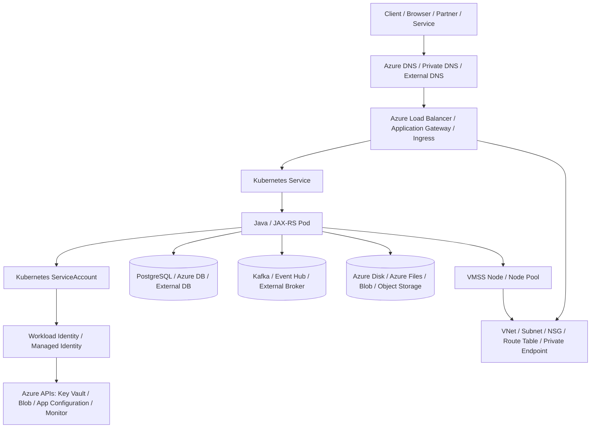
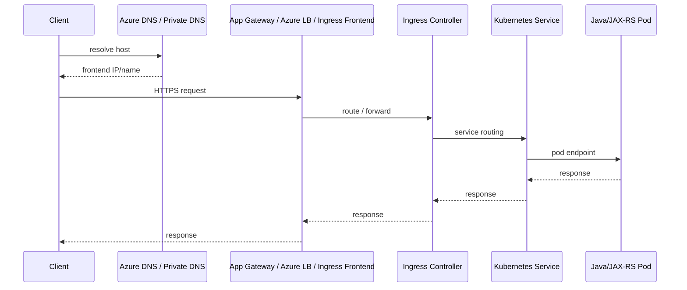
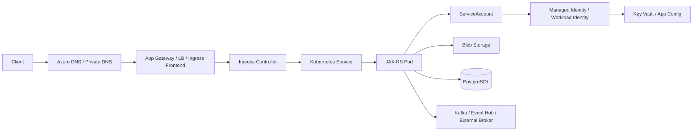

# Part 106 — Azure AKS Integration: Identity, Storage, Load Balancer, External Secrets, Nodes, Traffic

> Fokus part ini: memahami bagaimana Java/JAX-RS service berjalan di Azure Kubernetes Service secara production-oriented: identity, Azure RBAC, managed identity, Workload Identity, storage, load balancing, Key Vault integration, node pools, networking, traffic flow, failure mode, debugging, dan PR review.

Catatan penting:

```text
This part does not assume CSG uses Azure AKS, Microsoft Entra Workload ID,
managed identity, Azure Key Vault CSI driver, External Secrets Operator,
Azure Disk CSI, Azure Files CSI, Azure Blob CSI, Azure Load Balancer,
Application Gateway Ingress Controller, NGINX Ingress, Azure Monitor,
Managed Prometheus, Managed Grafana, Azure CNI, kubenet, private clusters,
or any specific Azure subscription/network topology.

Treat all AKS/Azure details as internal verification items.
```

Core idea:

```text
AKS is Kubernetes plus Azure identity, Azure networking, Azure storage,
Azure load balancing, Azure Monitor, Azure RBAC, Azure subscription/resource group
boundaries, and Azure failure modes.

A workload can be a valid Kubernetes Deployment and still fail in AKS because
managed identity, federated credentials, Key Vault permissions, subnet routes,
private DNS, NSG rules, ingress controller, or node pool configuration are wrong.
```

Senior engineer asks:

```text
Which identity does this Pod use?
Which Azure principal is allowed to read Key Vault, Blob, App Configuration, or ACR?
Is the ServiceAccount federated to a managed identity?
Can the Pod resolve and reach private endpoints?
Which load balancer or ingress controller receives traffic?
Where does TLS terminate?
Which storage class backs the PVC?
Which node pool runs the Pod?
Can we debug this from Kubernetes events, Azure activity logs, Entra sign-in/audit logs,
Key Vault diagnostics, load balancer health, and Azure Monitor?
```

---

## 1. Where AKS Fits in the Stack

A Java/JAX-RS service on AKS normally crosses these layers:



Kubernetes gives:

```text
Pod
Deployment
Service
Ingress
ConfigMap
Secret
ServiceAccount
RBAC
StorageClass
PVC
Node scheduling
```

AKS/Azure adds:

```text
Microsoft Entra ID
managed identity
Workload Identity / OIDC federation
Azure RBAC
VNet
subnet
NSG
route table
private endpoint
private DNS zone
Azure Load Balancer
Application Gateway
Azure Disk
Azure Files
Azure Blob
Azure Key Vault
Azure App Configuration
Azure Container Registry
Azure Monitor
VM Scale Sets
node pools
resource groups
subscriptions
```

---

## 2. AKS Responsibility Split

| Area | Managed/provided by Azure/AKS | Usually owned by platform/team |
|---|---|---|
| Kubernetes control plane | managed by Azure | version, upgrade window, API usage |
| Node pools | VMSS-backed, managed by AKS | size, labels, taints, autoscaler, image upgrade |
| Workload identity | Entra/OIDC/managed identity support | identity design, federation, RBAC, least privilege |
| Load balancing | Azure LB/App Gateway integration | ingress/service spec, TLS, WAF, private/public exposure |
| Storage | Azure Disk/Files/Blob services | CSI driver, StorageClass, PVC, backup/retention |
| Secrets | Key Vault available | CSI/operator pattern, rotation, access policy/RBAC |
| Observability | Azure Monitor options | app instrumentation, dashboards, alerts, logs, traces |
| Network | VNet primitives | subnet, NSG, route table, DNS, private endpoint design |

Senior ownership means tracing a failure across both Kubernetes and Azure planes.

---

## 3. Identity Mental Model on AKS

Production Pods should not carry long-lived Azure client secrets.

Preferred model:

```text
Pod -> Kubernetes ServiceAccount -> federated identity / managed identity -> Azure token -> Azure API
```

Common models:

| Model | Mental model | Use case |
|---|---|---|
| Workload Identity | ServiceAccount federates through OIDC to Microsoft Entra application/user-assigned managed identity | modern Pod-level identity |
| User-assigned managed identity | identity assigned and referenced by workload/access mechanism | stable identity across resources |
| System-assigned managed identity | identity tied to an Azure resource lifecycle | useful for infrastructure, less portable |
| Service principal secret | app stores client secret | avoid unless explicitly required and controlled |

Do not assume which one is used.

Verify from:

```bash
kubectl get sa -n <ns> <service-account> -o yaml
kubectl describe pod -n <ns> <pod>
az aks show --resource-group <rg> --name <cluster> --query "oidcIssuerProfile"
az identity show --resource-group <rg> --name <identity>
az ad app federated-credential list --id <app-or-client-id>
```

A ServiceAccount using Workload Identity often has labels/annotations similar to:

```yaml
apiVersion: v1
kind: ServiceAccount
metadata:
  name: quote-order-api
  namespace: quote-order
  labels:
    azure.workload.identity/use: "true"
  annotations:
    azure.workload.identity/client-id: "<managed-identity-client-id>"
```

Exact annotations and platform conventions must be verified internally.

---

## 4. Azure SDK Credential Model in Pods

Java code should usually rely on the environment credential chain, not hardcoded credentials.

Example shape:

```java
import com.azure.identity.DefaultAzureCredentialBuilder;
import com.azure.security.keyvault.secrets.SecretClientBuilder;

var credential = new DefaultAzureCredentialBuilder().build();

var client = new SecretClientBuilder()
    .vaultUrl("https://<vault-name>.vault.azure.net/")
    .credential(credential)
    .buildClient();
```

Senior review questions:

```text
Which credential does DefaultAzureCredential resolve inside AKS?
Is Workload Identity enabled on the cluster?
Is the ServiceAccount annotated correctly?
Is the federated credential subject correct?
Does the identity have Azure RBAC role assignment or Key Vault access policy?
Are local dev credentials clearly separated from cluster credentials?
Does the app fail fast if it resolves the wrong identity?
```

Diagnostic idea inside a Pod:

```bash
printenv | sort | grep -E 'AZURE|IDENTITY|TENANT|CLIENT'
```

If Azure CLI is available in a diagnostic image:

```bash
az account show
```

But do not rely only on this.

The stronger check is resource access evidence:

```text
Can the Pod read exactly the intended Key Vault secret?
Can it not read another service's secret?
Do Azure activity/diagnostic logs show the intended identity?
```

---

## 5. Azure Authorization: RBAC, Key Vault, and Resource Scope

Azure permissions can be granted at multiple scopes:

```text
management group
subscription
resource group
resource
Key Vault data plane
storage account/container
ACR registry
```

For service identity, prefer minimum required scope.

Bad smell:

```text
Contributor at subscription scope for application Pod identity.
```

Better shape:

```text
Key Vault Secrets User on one vault
Storage Blob Data Contributor on one container/account if required
AcrPull on one ACR for node/kubelet identity if required
Monitoring Metrics Publisher only if explicitly needed
```

Senior review questions:

```text
Is role assignment scoped narrowly?
Is data-plane permission handled separately from management-plane permission?
Can this workload list all secrets or only read named secrets?
Does the identity have write/delete where read is enough?
Is Key Vault firewall/private endpoint compatible with AKS subnet?
Is secret access logged?
```

---

## 6. Key Vault and External Secrets

AKS workloads commonly consume secrets through:

| Pattern | How app reads secret | Pros | Risks |
|---|---|---|---|
| Key Vault CSI driver | mounted files from Key Vault | avoids env var, integrates with identity | app reload complexity, mount failure |
| External Secrets Operator | syncs Key Vault secret to Kubernetes Secret | app simple | stale sync, K8s Secret exposure |
| Azure SDK direct read | app calls Key Vault | dynamic and explicit | latency, startup dependency, IAM/network failure |
| Azure App Configuration references | config points to Key Vault | centralized config | hidden dependency chain |

Example `SecretProviderClass` shape:

```yaml
apiVersion: secrets-store.csi.x-k8s.io/v1
kind: SecretProviderClass
metadata:
  name: quote-order-keyvault
spec:
  provider: azure
  parameters:
    usePodIdentity: "false"
    useVMManagedIdentity: "false"
    clientID: "<managed-identity-client-id>"
    keyvaultName: "<keyvault-name>"
    tenantId: "<tenant-id>"
    objects: |
      array:
        - |
          objectName: db-password
          objectType: secret
```

This is a recognizable pattern, not a mandate.

Secret rotation questions:

```text
Does mounted file update automatically?
Does the app reload it?
Is restart required?
Can old and new secret work during rotation?
Are secrets redacted from logs and config dumps?
Is Key Vault access private or public?
```

---

## 7. Storage on AKS: Azure Disk, Azure Files, Azure Blob

Storage choice is a semantics decision.

| Storage | Kubernetes shape | Access pattern | Good fit | Risk |
|---|---|---|---|---|
| Azure Disk | PVC / block volume | usually single Pod/node attach | durable single-writer state | zone attachment, RWO semantics |
| Azure Files | PVC / SMB/NFS share | multi-pod shared access | shared files/import/export | latency, permissions, protocol behavior |
| Azure Blob | app-level object storage or CSI if used | object/blob access | documents, artifacts, large files | not normal POSIX semantics by default |
| `emptyDir` | Pod-local scratch | temporary | temp files | lost on Pod deletion |

For Java/JAX-RS API services:

```text
transactional state -> PostgreSQL / database
large files -> Blob Storage / object storage
temporary files -> emptyDir with size limits
shared files -> Azure Files only when required
block volume -> avoid for stateless APIs unless justified
```

Example PVC shape:

```yaml
apiVersion: v1
kind: PersistentVolumeClaim
metadata:
  name: import-export-share
spec:
  accessModes:
    - ReadWriteMany
  storageClassName: azurefile-csi
  resources:
    requests:
      storage: 100Gi
```

---

## 8. Azure Disk Design Notes

Azure Disk behaves like cloud block storage.

Senior implications:

```text
Disk is attached to node/zone.
RWO semantics constrain scheduling and failover.
StorageClass defines SKU, replication, expansion, reclaim behavior.
Backups/snapshots do not replace application-level consistency.
```

Failure modes:

| Failure | Diagnostic path |
|---|---|
| PVC Pending | StorageClass, CSI driver, quota, region/SKU |
| Pod stuck ContainerCreating | mount/attach event, node zone, disk state |
| slow I/O | SKU/performance tier, app access pattern |
| detach stuck | node failure, volume attachment state |

Commands:

```bash
kubectl get storageclass
kubectl describe pvc -n <ns> <pvc>
kubectl describe pod -n <ns> <pod>
kubectl get volumeattachment
kubectl logs -n kube-system -l app=csi-azuredisk-controller
```

---

## 9. Azure Files Design Notes

Azure Files gives shared file semantics through SMB or NFS depending on configuration.

Good use cases:

```text
multi-pod shared import/export directory
reports or generated files that need shared access
legacy file-oriented integration
```

Risky use cases:

```text
high-QPS request path
database-like storage
distributed lock substitute
large numbers of tiny synchronous file operations
```

Failure modes:

| Failure | Possible cause |
|---|---|
| mount timeout | storage firewall, private endpoint, DNS, NSG |
| permission denied | SMB/NFS identity/permission mismatch |
| high latency | request hot path uses network file I/O |
| file conflict | multiple writers without app-level locking |

Commands:

```bash
kubectl describe pvc -n <ns> <pvc>
kubectl describe pod -n <ns> <pod>
kubectl logs -n kube-system -l app=csi-azurefile-controller
```

---

## 10. Load Balancing and Ingress on AKS

AKS traffic may flow through several models:

| Model | Kubernetes object | Azure component | Typical use |
|---|---|---|---|
| Service `LoadBalancer` | Service | Azure Load Balancer | L4 TCP/UDP exposure |
| Ingress Controller | Ingress | NGINX, AGIC, other controller | L7 HTTP routing |
| Application Gateway Ingress Controller | Ingress | Azure Application Gateway | L7 routing, TLS, WAF integration |
| API Management in front | external platform | Azure API Management | API governance, auth, throttling |

Do not assume the ingress controller.

Verify:

```bash
kubectl get ingressclass
kubectl get ingress -A
kubectl get svc -A --field-selector spec.type=LoadBalancer
kubectl get pods -A | grep -Ei 'ingress|gateway|nginx|agic'
```

Typical HTTP path:



Critical choices:

```text
public vs internal frontend
TLS termination point
WAF policy
host/path routing
path rewrite
health probe path
backend protocol
private DNS
NSG rules
idle timeout
client IP preservation
```

---

## 11. Load Balancer Failure Modes

| Symptom | Likely area |
|---|---|
| DNS resolves but connection times out | NSG, route, internal/public mismatch, private endpoint/DNS |
| 502/503 from gateway | backend unhealthy, service selector, readiness failure |
| 404 from ingress | host/path rule mismatch, ingress class mismatch |
| TLS error | certificate, SNI, gateway listener, trust chain |
| wrong backend | overlapping ingress rules or shared gateway config |
| upload/stream fails | timeout, body limit, buffering, gateway policy |
| health probe fails | wrong path/port/protocol/status expectation |

Debugging path:

```bash
kubectl describe ingress -n <ns> <ingress>
kubectl get svc -n <ns> <service> -o yaml
kubectl get endpointslice -n <ns>
kubectl describe pod -n <ns> <pod>
kubectl logs -n <ingress-namespace> <ingress-controller-pod>
az network application-gateway show --resource-group <rg> --name <gateway>
az network lb show --resource-group <rg> --name <lb>
```

Senior habit:

```text
Compare Kubernetes readiness, ingress/controller health, Azure backend health,
and application business readiness.
```

---

## 12. AKS Networking: VNet, Subnet, NSG, Route, Private Endpoint

AKS networking is not just Kubernetes `Service` networking.

You must understand:

```text
VNet
subnets
route tables
NSG
Azure CNI / kubenet / overlay
private cluster endpoint
private DNS zones
private endpoints
NAT gateway / egress path
firewall/proxy
service endpoint/private endpoint policy
```

Common questions:

```text
Do Pods receive VNet-routable IPs?
Which subnet hosts nodes?
Which subnet hosts private endpoints?
Can Pods reach Key Vault/Storage/App Configuration privately?
Does DNS resolve public or private endpoint IP?
Does NSG allow node/pod -> dependency?
Is outbound forced through firewall/proxy?
Is the cluster private?
```

Private endpoint failure pattern:

```text
The app times out calling Key Vault or Storage.
IAM is correct.
Root cause is private DNS or NSG/routing, not the Java SDK.
```

DNS checks from a diagnostic Pod:

```bash
nslookup <vault-name>.vault.azure.net
nslookup <storage-account>.blob.core.windows.net
curl -vk https://<vault-name>.vault.azure.net/
```

Interpret carefully:

```text
DNS response must match expected private/public path.
HTTP 401/403 may prove network path works but identity/authorization fails.
Timeout usually points to network/routing/firewall.
```

---

## 13. ACR and Image Pulling

Image pull path:

```text
kubelet/node identity -> Azure Container Registry -> image layers -> container runtime
```

Typical failures:

| Symptom | Possible cause |
|---|---|
| `ImagePullBackOff` | tag missing, ACR permission, network path, private endpoint/DNS |
| works in dev not prod | different registry/subscription/role assignment |
| slow rollout | large image, cold node, network bottleneck |
| unauthorized | kubelet/node identity lacks `AcrPull` or registry auth incorrect |

Debugging:

```bash
kubectl describe pod -n <ns> <pod>
az acr repository show-tags --name <acr-name> --repository <repo>
az role assignment list --assignee <identity-client-or-principal-id> --scope <acr-resource-id>
```

Senior review:

```text
Is image tag immutable?
Is rollback image retained?
Is ACR access private if required?
Is image scanned and signed if platform requires it?
Is node/kubelet identity granted only AcrPull?
```

---

## 14. Node Pools and Scheduling

AKS runs workloads on node pools backed by Azure VM Scale Sets.

Node pool concerns:

```text
system vs user node pool
VM size
CPU/memory ratio
ephemeral OS disk
availability zones
node image version
upgrade surge
cluster autoscaler
labels/taints
spot node pool
GPU/specialized node pool
max pods per node
subnet IP capacity
```

Java/JAX-RS concerns:

```text
JVM memory sizing vs container limit
CPU throttling
JIT warmup
startup probe delay
node drain graceful termination
OOMKilled diagnosis
thread count vs memory stack
observability agent overhead
```

Example scheduling intent:

```yaml
apiVersion: apps/v1
kind: Deployment
metadata:
  name: quote-order-api
spec:
  template:
    spec:
      serviceAccountName: quote-order-api
      nodeSelector:
        workload: api
      topologySpreadConstraints:
        - maxSkew: 1
          topologyKey: topology.kubernetes.io/zone
          whenUnsatisfiable: ScheduleAnyway
          labelSelector:
            matchLabels:
              app: quote-order-api
      containers:
        - name: app
          image: <acr-name>.azurecr.io/quote-order-api:<tag>
          resources:
            requests:
              cpu: "500m"
              memory: "1Gi"
            limits:
              memory: "2Gi"
```

Do not use node selectors or tolerations without documenting intent.

---

## 15. Azure Monitor and Observability

Minimum AKS observability surface:

```text
Kubernetes events
Pod logs
container restart/OOM metrics
node metrics
application metrics
application traces
ingress/load balancer metrics
Application Gateway backend health if used
Key Vault diagnostic logs
Azure activity logs
Azure Monitor / Managed Prometheus / Grafana if enabled
```

When a request fails before reaching Java, check:

```text
DNS
Application Gateway / Azure LB
ingress controller
backend health
NSG
service/endpoints
pod readiness
TLS certificate
path rewrite
```

When Azure API access fails, check:

```text
resolved identity
federated credential
role assignment
Key Vault access model
private endpoint/DNS
firewall/NSG
Azure diagnostic logs
```

---

## 16. End-to-End Request Flow in AKS



Debug by boundary:

| Boundary | Evidence |
|---|---|
| DNS to frontend | DNS record, private/public IP, TLS cert |
| frontend to ingress | gateway/backend health, listener/rule, NSG |
| ingress to service | ingress class, controller logs, service selector |
| service to Pod | EndpointSlice, readiness, labels, port |
| Pod to Azure API | identity, role assignment, token acquisition, diagnostic logs |
| Pod to private endpoint | DNS, route, NSG, firewall, private endpoint status |
| Pod to DB/Kafka | network path, credentials, client metrics, server logs |

---

## 17. AKS-Specific Production Failure Modes

### 17.1 Wrong Identity Resolved

Symptom:

```text
Pod can authenticate, but as the wrong Azure principal.
```

Possible causes:

```text
ServiceAccount annotation wrong
federated credential subject mismatch
local credential fallback in non-cluster environment
old aad-pod-identity pattern mixed with Workload Identity
```

Senior response:

```text
Prove identity from Azure logs and resource access.
Do not assume annotation equals effective principal.
```

### 17.2 Key Vault Permission or Network Failure

Symptoms:

```text
403 from Key Vault -> identity/authorization/access policy problem
Timeout -> DNS/private endpoint/NSG/firewall/routing problem
SecretProviderClass mount failure -> CSI/identity/Key Vault path problem
```

### 17.3 Backend Unhealthy Behind Gateway

Possible causes:

```text
readiness path mismatch
wrong service port
path rewrite issue
backend protocol mismatch
NSG blocks gateway subnet
application returns 401 on health probe
```

### 17.4 PVC Mount Failure

Possible causes:

```text
Azure Disk zone mismatch
Azure Files private endpoint/DNS failure
CSI driver issue
quota/SKU unavailable
identity permission issue
```

### 17.5 Subnet IP Exhaustion

Symptoms:

```text
Pods Pending or nodes cannot allocate Pod IPs.
Autoscaler adds nodes but workloads still fail scheduling.
```

Possible causes:

```text
Azure CNI IP allocation consumes subnet capacity
subnet too small
max pods per node too high
node pool expansion not planned
```

### 17.6 ACR Pull Failure

Possible causes:

```text
AcrPull missing
private endpoint DNS wrong
registry firewall
image tag does not exist
cross-subscription role assignment missing
```

---

## 18. Debugging Playbook

### 18.1 Pod Cannot Start

```bash
kubectl get pod -n <ns> <pod> -o wide
kubectl describe pod -n <ns> <pod>
kubectl logs -n <ns> <pod> --previous
kubectl get events -n <ns> --sort-by=.lastTimestamp
```

Check:

```text
image pull
config/secret mount
ServiceAccount
SecretProviderClass
volume mount
node scheduling
OOMKilled
startup probe
```

### 18.2 Pod Cannot Access Azure API

```bash
kubectl get sa -n <ns> <sa> -o yaml
kubectl exec -n <ns> <pod> -- printenv | sort | grep -E 'AZURE|CLIENT|TENANT|IDENTITY'
az role assignment list --assignee <principal-id>
az keyvault show --name <vault>
az keyvault secret show --vault-name <vault> --name <secret>
```

Check:

```text
identity resolved
federated credential
role assignment scope
Key Vault access model
private endpoint path
DNS resolution
firewall/NSG
```

### 18.3 Ingress or Load Balancer Failure

```bash
kubectl get ingressclass
kubectl describe ingress -n <ns> <ingress>
kubectl get svc -n <ns> <svc> -o yaml
kubectl get endpointslice -n <ns>
kubectl logs -n <ingress-ns> <controller-pod>
az network application-gateway show-backend-health --resource-group <rg> --name <gateway>
```

Check:

```text
host/path rule
ingress class
service selector
target/backend health
NSG
TLS certificate
health probe path
```

### 18.4 PVC Cannot Mount

```bash
kubectl get storageclass
kubectl describe pvc -n <ns> <pvc>
kubectl describe pod -n <ns> <pod>
kubectl get volumeattachment
kubectl logs -n kube-system -l app=csi-azuredisk-controller
kubectl logs -n kube-system -l app=csi-azurefile-controller
```

Check:

```text
CSI driver
StorageClass
quota
zone
private endpoint
DNS
identity
```

---

## 19. PR Review Checklist

For any AKS deployment change, review:

```text
ServiceAccount is explicit.
Workload identity/managed identity mapping is documented.
No static Azure secrets are embedded.
Role assignments are least-privilege and scoped narrowly.
Key Vault access model is clear.
Secret rotation behavior is defined.
Config/secret source of truth is clear.
Ingress controller is known and intentional.
Public/internal exposure is intentional.
TLS termination point is explicit.
Health probe path matches readiness semantics.
Application Gateway/Azure LB/Ingress annotations match platform standard.
NSG/routing/private endpoint path is understood.
StorageClass/PVC semantics match workload.
No durable state hides in container filesystem.
Node pool selection is intentional.
Resource requests/limits align with JVM sizing.
Topology spread / zone resilience is considered.
Image tag/digest rollback path exists.
ACR access uses least privilege.
Observability covers app, Pod, ingress, Azure identity, Key Vault, storage, and network.
Runbook includes Azure-side debugging, not only kubectl.
```

---

## 20. Internal Verification Checklist

Verify in internal CSG codebase/platform docs:

```text
Is the workload actually deployed on AKS?
Which Azure subscriptions/resource groups/environments are used?
Which regions are used?
Which cluster names and namespaces map to quote/order services?
Is Microsoft Entra Workload ID enabled?
Is managed identity used directly or through Workload Identity federation?
Which ServiceAccounts map to which managed identities?
Are Azure SDKs using DefaultAzureCredential or custom credential wiring?
Are static service principal secrets used anywhere?
Which Key Vaults store application secrets?
Is Key Vault access through RBAC or access policies?
Is Key Vault accessed through private endpoint?
How are secrets mounted/synced/read?
Is Azure App Configuration used?
Which StorageClasses exist?
Is Azure Disk used by application Pods?
Is Azure Files used for shared storage?
Is Blob Storage accessed directly by app?
Which ingress controller is used: AGIC, NGINX, App Routing, or other?
Is Azure API Management in front of AKS?
Where does TLS terminate?
Which DNS zones are public/private?
Which VNets/subnets host nodes and private endpoints?
Which NSG rules control frontend -> node/pod and pod -> dependency?
Is outbound forced through firewall/proxy?
Is the cluster private?
Which node pools run Java/JAX-RS APIs?
How are node image upgrades/drains handled?
Is cluster autoscaler enabled?
How is ACR access granted?
Where are Azure Monitor metrics/logs/traces reviewed?
Are Key Vault diagnostic logs enabled?
What is the incident runbook for identity failure, Key Vault 403, private endpoint timeout, backend unhealthy, image pull, and PVC mount failure?
```

---

## 21. Senior Mental Model

Think of AKS as four overlapping planes:

```text
Kubernetes plane:
  Deployment, Pod, Service, Ingress, PVC, ServiceAccount

Azure identity plane:
  Microsoft Entra ID, managed identity, federated credential, Azure RBAC,
  Key Vault access, diagnostic logs

Azure network plane:
  VNet, subnet, NSG, route table, private endpoint, private DNS, firewall

Azure operations plane:
  node pools, CSI drivers, ingress controllers, Azure Monitor, ACR, storage,
  Key Vault, Application Gateway, Load Balancer
```

When production fails, do not stop at:

```text
kubectl get pods
```

A senior engineer follows the request and identity path end to end:

```text
client -> DNS -> gateway/LB -> ingress -> service -> pod -> JVM -> JAX-RS -> managed identity -> Azure API / DB / Kafka
```

That is the operational map you need before reviewing or owning an AKS-hosted Java/JAX-RS service.
