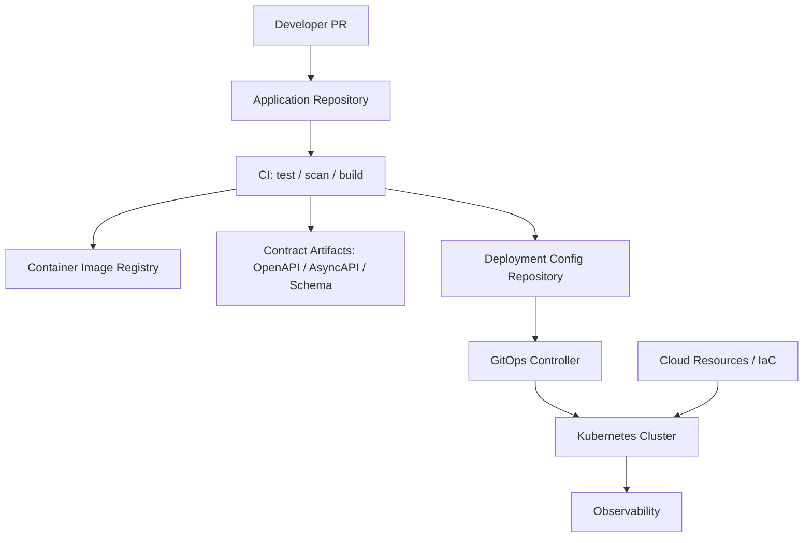
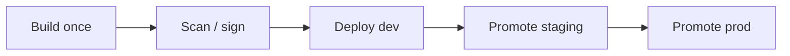
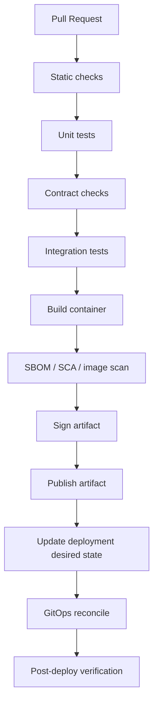
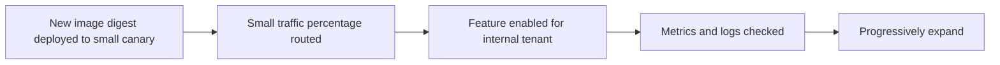

# Part 107 — GitOps and IaC Deployment Model

> Fokus part ini: memahami bagaimana perubahan Java/JAX-RS service bergerak dari source code ke runtime production melalui CI/CD, image registry, Kubernetes manifests, GitOps reconciliation, IaC, promotion, rollback, drift detection, dan environment governance.

Catatan penting:

```text
This part does not assume CSG uses Argo CD, Flux CD, Jenkins, GitHub Actions,
GitLab CI, Azure DevOps, Helm, Kustomize, Terraform, Pulumi, Crossplane,
Atlantis, Backstage, Spinnaker, Harness, or any specific internal deployment platform.

Treat every tool, repository, pipeline, approval gate, promotion rule,
and runtime ownership model as an internal verification item.
```

Core idea:

```text
In production engineering, deployment is not "run kubectl apply".
Deployment is a controlled state transition from source intent to runtime state.

GitOps and IaC make that transition reviewable, reproducible, auditable,
and recoverable.
```

Senior engineer asks:

```text
Where is the desired state declared?
Who can change it?
What validates it before merge?
What reconciles it after merge?
How do we know the cluster actually matches Git?
How do we promote the same artifact across environments?
How do we rollback safely when API, DB, Kafka, config, and feature flags changed?
What is controlled by application team versus platform team?
```

---

## 1. Mental Model: Source State, Desired State, Observed State

There are three states you must separate:

```text
Source state
  Code, tests, build files, migration scripts, API contracts, event contracts.

Desired runtime state
  Kubernetes manifests, Helm values, Kustomize overlays, config references,
  image tags/digests, resource limits, rollout strategy, ingress rules.

Observed runtime state
  What the cluster, cloud, database, gateway, and monitoring systems actually run.
```

GitOps is about declaring desired state in Git and using an agent/controller to reconcile observed state toward it.

IaC is about declaring infrastructure resources as code: networks, clusters, identities, registries, databases, policies, secrets references, DNS, gateways, load balancers, and observability wiring.

A common enterprise pipeline looks like this:



The important distinction:

```text
CI builds and verifies artifacts.
CD/GitOps reconciles desired runtime state.
IaC provisions platform resources used by runtime state.
```

Do not mix them mentally.

---

## 2. GitOps Principles in Practical Terms

GitOps usually implies these production properties:

| Principle | Practical meaning |
|---|---|
| Declarative desired state | Runtime should be described as data, not manual commands |
| Versioned and immutable | Every change has history, diff, author, review, and rollback point |
| Pulled automatically | A controller pulls desired state from Git and applies it |
| Continuously reconciled | Runtime drift is detected and corrected or reported |

For a Java/JAX-RS service, desired state can include:

```yaml
apiVersion: apps/v1
kind: Deployment
metadata:
  name: quote-order-api
spec:
  replicas: 4
  strategy:
    type: RollingUpdate
  template:
    spec:
      serviceAccountName: quote-order-api
      containers:
        - name: app
          image: registry.example.com/quote-order-api@sha256:...
          ports:
            - containerPort: 8080
          envFrom:
            - configMapRef:
                name: quote-order-api-config
          resources:
            requests:
              cpu: "500m"
              memory: "1Gi"
            limits:
              cpu: "2"
              memory: "2Gi"
          readinessProbe:
            httpGet:
              path: /ready
              port: 8080
          livenessProbe:
            httpGet:
              path: /live
              port: 8080
```

This manifest is not just deployment syntax. It encodes production assumptions:

```text
How much memory the JVM may consume.
How many replicas can serve traffic.
Which identity the Pod uses.
How readiness is detected.
Which image is trusted.
Which config source is mounted.
How rollout happens.
```

A senior engineer reviews manifests as part of application correctness.

---

## 3. GitOps Repository Models

There are several repository structures.

### 3.1 Application repo owns manifests

```text
quote-order-service/
  src/
  pom.xml
  Dockerfile
  deploy/
    base/
    overlays/dev/
    overlays/staging/
    overlays/prod/
```

Pros:

```text
App and deployment changes are close together.
Developer can reason about code + runtime together.
Simple for small teams.
```

Cons:

```text
Harder to centralize platform governance.
App developers may accidentally own too much platform detail.
Promotion may require code repo commits.
```

### 3.2 Separate environment/config repo

```text
quote-order-service/
  src/
  pom.xml
  Dockerfile

platform-deployments/
  services/
    quote-order-service/
      dev/
      staging/
      prod/
```

Pros:

```text
Clear separation between build artifact and runtime desired state.
Environment changes are auditable.
Platform team can own common deployment controls.
```

Cons:

```text
Developers must understand two repositories.
Traceability from code commit to deployment commit must be designed.
```

### 3.3 Mono-repo platform desired state

```text
clusters/
  eks-prod-us-east-1/
    namespaces/
      quote-order/
        quote-order-api/
  aks-prod-eastus/
    namespaces/
      quote-order/
        quote-order-api/
```

Pros:

```text
Cluster state is explicit.
Good for platform governance.
Easy to detect drift against cluster ownership.
```

Cons:

```text
High blast radius if repo permissions are weak.
Needs strong CODEOWNERS and policy validation.
```

Internal verification must identify which model is actually used.

---

## 4. Artifact Promotion: Image Tag vs Digest

A weak deployment model says:

```yaml
image: quote-order-api:latest
```

A stronger model says:

```yaml
image: quote-order-api:1.42.7
```

A production-grade model often pins immutable digest:

```yaml
image: registry.example.com/quote-order-api@sha256:abc123...
```

Why digest matters:

```text
Tags can be overwritten.
Digest identifies exact artifact bytes.
Rollback becomes deterministic.
Incident RCA can prove what code actually ran.
Supply chain scanning/signing can bind to immutable artifact identity.
```

Promotion should ideally move the same artifact through environments:



Bad pattern:

```text
Rebuild separately for dev, staging, and prod.
```

Why bad:

```text
You are not testing the same artifact you deploy.
Dependency resolution, build plugin behavior, timestamps, generated code,
or base image changes can create environment-specific artifacts.
```

---

## 5. Helm, Kustomize, and Plain YAML

### 5.1 Plain YAML

Good when:

```text
Service is small.
Duplication is low.
Environment variation is minimal.
```

Risk:

```text
Copy-paste drift across environments.
Manual patching.
No shared abstraction for common labels, probes, policies, resource defaults.
```

### 5.2 Kustomize

Common model:

```text
deploy/
  base/
    deployment.yaml
    service.yaml
    ingress.yaml
  overlays/
    dev/
      kustomization.yaml
      patch-replicas.yaml
    prod/
      kustomization.yaml
      patch-resources.yaml
```

Good when:

```text
You want Kubernetes-native overlay/patch behavior.
You want base + environment overlay without templating language.
```

Risk:

```text
Patch stacking can become hard to reason about.
Generated output must be inspected in CI.
```

### 5.3 Helm

Common model:

```text
chart/
  templates/
    deployment.yaml
    service.yaml
    ingress.yaml
  values.yaml
  values-prod.yaml
```

Good when:

```text
You need parameterized reusable deployment package.
You have many services with similar structure.
```

Risk:

```text
Templating hides rendered Kubernetes state.
Values sprawl becomes a second programming language.
Invalid combinations can render dangerous manifests.
```

Senior rule:

```text
Review rendered manifests, not only templates or values.
```

CI should run:

```bash
helm template ./chart -f values-prod.yaml > rendered.yaml
kubeconform -strict rendered.yaml
conftest test rendered.yaml
```

or equivalent platform checks.

---

## 6. Terraform, Pulumi, and IaC Boundary

Kubernetes manifests usually define application runtime state.
IaC usually defines platform resources.

Examples of IaC-owned resources:

```text
VPC / VNet
subnets
route tables
security groups / NSG
EKS / AKS clusters
node groups / node pools
container registries
IAM roles / managed identities
DNS zones
load balancers / gateways
PostgreSQL instances
Kafka clusters
Redis clusters
S3 / Blob buckets
Key Vault / Secrets Manager
monitoring workspaces
private endpoints
```

Examples of application GitOps-owned resources:

```text
Deployment
Service
Ingress
ConfigMap
ExternalSecret
ServiceAccount
HorizontalPodAutoscaler
PodDisruptionBudget
NetworkPolicy
```

Boundary can vary by company.
The important thing is ownership clarity:

```text
Who owns the network?
Who owns the namespace?
Who owns the ServiceAccount/IAM binding?
Who owns the ExternalSecret definition?
Who owns DB schema migration?
Who owns API gateway route?
Who owns rollout gate?
```

Bad boundary:

```text
Application team changes Terraform network rules through emergency PRs
without platform review.
```

Also bad:

```text
Platform team changes app resource limits without service owner visibility.
```

---

## 7. CI/CD Pipeline as Control System

A mature pipeline is not just a script. It is a control system.

Example stages:



For Java/JAX-RS service, pipeline should validate:

```text
Maven build reproducibility
unit tests
JAX-RS endpoint tests
OpenAPI lint/diff
AsyncAPI/schema compatibility
DB migration safety
container image security
SBOM generation
signature/provenance
Kubernetes manifest policy
resource requests/limits
probe existence
secret reference correctness
feature flag default state
observability instrumentation
```

If a pipeline only builds an image and deploys it, it is not enough for enterprise production.

---

## 8. Environment Promotion and Parity

Environment differences are necessary.
Environment surprises are dangerous.

Valid differences:

```text
replica count
resource size
external endpoint hostnames
feature flag targeting
rate limits
log level within allowed policy
cloud account/subscription/project
secret values
```

Dangerous differences:

```text
different code artifact
different database migration history
different API contract
different event schema compatibility mode
different authorization policy
different JSON serialization config
different retry timeout behavior
different timezone/currency behavior
different feature flag default semantics
```

Promotion should answer:

```text
Which artifact was tested?
Which digest is being promoted?
Which config changed between staging and prod?
Which migrations already ran?
Which feature flags are enabled?
What is the rollback path?
```

---

## 9. Drift Detection

Drift means observed state differs from desired state.

Examples:

```text
Someone manually changed replicas with kubectl scale.
A hotfix changed a ConfigMap directly in cluster.
A Secret was rotated outside the declared path.
A platform controller mutated ingress annotations.
An HPA changed replica count as designed.
A cloud load balancer changed IP or health state.
```

Not all differences are bad.
Some fields are expected to be managed by controllers.

You need a drift policy:

```text
What should GitOps correct automatically?
What should GitOps alert but not auto-correct?
What fields are ignored because controllers own them?
What manual operations are allowed during incident?
How are emergency changes reconciled back to Git?
```

Bad pattern:

```text
Production incident fixed manually.
Git not updated.
Next reconciliation or rollout removes the fix.
```

Good pattern:

```text
Emergency manual change is documented, time-limited, and backported to desired state.
```

---

## 10. Rollback Is Not One Thing

There are multiple rollback dimensions:

| Dimension | Rollback question |
|---|---|
| Image | Can we run previous image digest? |
| Manifest | Can we revert deployment config? |
| Config | Can we restore previous safe config? |
| Feature flag | Can we disable behavior quickly? |
| Database | Is schema backward-compatible? |
| Event schema | Can old and new consumers coexist? |
| API contract | Will old clients still work? |
| Gateway route | Can routing be reverted safely? |
| Cloud/IaC | Can infra change be rolled back without downtime? |

Simple image rollback is not enough if a migration already dropped a column.

Production release should prefer:

```text
backward-compatible application deployment
backward-compatible database migration
feature flag controlled behavior
roll-forward-first mindset for data changes
explicit rollback playbook for runtime-only changes
```

---

## 11. Database Migration and GitOps Coordination

Database migration is not always safe to run as a side effect of application startup.

Risky pattern:

```text
Every Pod starts.
Every Pod tries to run migration.
One Pod succeeds.
Others fail or block.
Application rollout becomes migration coordination mechanism.
```

Safer patterns:

```text
Dedicated migration Job before deployment.
Pipeline-controlled migration stage.
DB migration service with lock and explicit approval.
Expand-contract migration across releases.
```

Example release choreography:

```text
Release N:
  expand schema: add nullable column / new table / compatible index
  deploy app that can read old and new

Release N+1:
  backfill data
  enable new behavior via feature flag

Release N+2:
  stop writing old field
  verify no old readers

Release N+3:
  contract schema: remove old column only after compatibility window
```

GitOps must coordinate with migration ownership. It should not hide database risk behind a Deployment change.

---

## 12. Config, Secret, and Feature Flag Release Coordination

Config changes can be as dangerous as code changes.

Examples:

```text
Reducing timeout can break slow downstream calls.
Changing retry count can overload dependencies.
Changing feature flag default can expose unfinished behavior.
Changing tenant config can isolate or leak tenant behavior.
Changing Kafka topic name can silently stop event processing.
Changing DB pool size can saturate database.
```

Treat config PR like code PR:

```text
owner review
environment diff
policy validation
rollout plan
rollback plan
observability expectation
```

Secret changes need separate controls:

```text
rotation schedule
dual-read/dual-write where needed
old secret expiry window
credential usage dashboard
failed authentication alert
```

---

## 13. Progressive Delivery in GitOps

Progressive delivery can be integrated with GitOps through rollout controllers or traffic routers.

Patterns:

```text
canary by replica percentage
canary by traffic weight
blue-green deployment
header-based routing
tenant-based rollout
region-based rollout
feature-flag-based behavior enablement
```

Key distinction:

```text
Deployment rollout controls which binary serves traffic.
Feature flags control which behavior path executes.
Gateway traffic splitting controls which route receives traffic.
```

Do not confuse them.

Safe release often combines all three:



---

## 14. Policy as Code

Policy as code catches unsafe deployment before it reaches cluster.

Example checks:

```text
No latest image tag.
All containers must have resource requests and limits.
Readiness probe required.
Liveness probe must not hit dependency-heavy endpoint.
No privileged container unless approved.
No hostPath unless approved.
No plaintext secret in ConfigMap.
Ingress must use approved TLS policy.
ExternalSecret must reference allowed secret store.
ServiceAccount must be least privilege.
Production namespace requires CODEOWNERS approval.
```

Example conceptual policy:

```rego
package kubernetes.admission

deny[msg] {
  input.kind == "Deployment"
  container := input.spec.template.spec.containers[_]
  endswith(container.image, ":latest")
  msg := sprintf("container %s uses mutable latest tag", [container.name])
}
```

Tools vary. The invariant matters more than the tool:

```text
unsafe desired state must fail before merge or before admission.
```

---

## 15. Observability for Deployment Itself

Deployment needs observability too.

Track:

```text
build duration
test duration
failed quality gates
artifact digest
SBOM generation
scan result
deployment commit
GitOps sync status
reconciliation latency
rollout progress
pod readiness time
restart count after deployment
error rate after deployment
latency after deployment
customer-impacting alerts after deployment
rollback frequency
change failure rate
mean time to restore
```

Deployment metadata should appear in telemetry:

```text
service.name
service.version
image.digest
git.commit
build.id
deployment.environment
cluster.name
namespace
release.id
```

Without deployment metadata, incident analysis becomes guesswork.

---

## 16. Debugging Deployment Failure

Use layered debugging.

### 16.1 CI failure

Ask:

```text
Did Maven fail?
Did tests fail?
Did contract diff fail?
Did image build fail?
Did scanner block?
Did artifact signing fail?
Did manifest validation fail?
```

Commands/examples:

```bash
mvn -version
mvn -DskipTests=false verify
mvn dependency:tree
```

### 16.2 GitOps sync failure

Ask:

```text
Did controller see the desired state commit?
Did rendered manifest validate?
Did admission controller reject it?
Did RBAC block apply?
Did namespace quota block it?
Did CRD exist?
Did sync wave/order fail?
```

Examples:

```bash
kubectl get events -n quote-order --sort-by=.metadata.creationTimestamp
kubectl describe deployment quote-order-api -n quote-order
kubectl get pods -n quote-order
kubectl describe pod <pod> -n quote-order
```

### 16.3 Rollout failure

Ask:

```text
Did image pull fail?
Did container start?
Did readiness pass?
Did app bind to correct port?
Did JVM OOM before ready?
Did config/secret mount fail?
Did DB migration block startup?
Did network policy block dependencies?
```

### 16.4 Post-deploy regression

Ask:

```text
Did error rate increase?
Did latency increase?
Did downstream calls fail?
Did DB pool saturate?
Did Kafka lag grow?
Did feature flag enable risky path?
Did only one tenant/region fail?
```

---

## 17. Common Failure Modes

### 17.1 Drift masked by manual fix

Symptom:

```text
Issue disappears after manual kubectl edit, then reappears after sync.
```

Root cause:

```text
Runtime changed outside desired state.
```

Fix:

```text
Backport emergency change to Git or revert manual change explicitly.
```

### 17.2 Mutable image tag rollback failure

Symptom:

```text
Rollback to previous tag still runs wrong binary.
```

Root cause:

```text
Tag was overwritten.
```

Fix:

```text
Pin immutable digest and preserve artifact history.
```

### 17.3 Environment config drift

Symptom:

```text
Works in staging, fails in prod.
```

Root cause:

```text
Different timeout, auth issuer, DB pool, topic, schema compatibility, or feature flag.
```

Fix:

```text
Generate environment diff and validate allowed differences.
```

### 17.4 Unsafe migration with fast rollback

Symptom:

```text
Image rollback breaks because schema is already contracted.
```

Root cause:

```text
Database migration was not backward-compatible.
```

Fix:

```text
Use expand-contract and roll-forward strategy.
```

### 17.5 GitOps controller has excessive permission

Symptom:

```text
A bad manifest change affects many namespaces/clusters.
```

Root cause:

```text
Controller scope or repo permissions are too broad.
```

Fix:

```text
Limit scope, use CODEOWNERS, policy gates, environment separation.
```

---

## 18. PR Review Checklist

When reviewing deployment or IaC changes, check:

```text
Artifact
  Is image pinned by digest or immutable version?
  Is SBOM/scanning/signing complete?
  Is the same artifact promoted across environments?

Kubernetes manifest
  Are resource requests/limits reasonable?
  Are readiness/liveness/startup probes correct?
  Does rollout strategy match service behavior?
  Is termination grace period compatible with request processing?
  Are ServiceAccount and RBAC least privilege?

Config
  Are config changes explicit?
  Are environment differences expected and documented?
  Are safe defaults defined?
  Can config be rolled back?

Secret
  Are secrets referenced, not embedded?
  Is rotation considered?
  Are logs redacted?

Network
  Are ingress/DNS/TLS changes understood?
  Are private endpoint and network policy effects reviewed?

Database
  Is migration backward-compatible?
  Is migration ordering clear?
  Is rollback/roll-forward strategy defined?

Event/API contracts
  Are OpenAPI/AsyncAPI/schema changes compatible?
  Are generated clients affected?
  Are consumers identified?

Operations
  Is there a dashboard/alert for rollout?
  Is rollback playbook updated?
  Is customer impact understood?
```

---

## 19. Internal Verification Checklist

Verify in CSG/internal codebase and platform:

```text
Repository model
  Where are Kubernetes manifests stored?
  Is there separate app repo and deployment repo?
  Who owns environment overlays?

GitOps controller
  Is Argo CD, Flux, or another tool used?
  Which clusters/namespaces does it reconcile?
  What is the sync policy?
  Is auto-sync enabled?
  Is prune enabled?
  Are manual changes allowed?

IaC
  Is Terraform, Pulumi, Crossplane, CloudFormation, Bicep, or ARM used?
  Which team owns cloud network, cluster, database, registry, gateway, and identity?

Artifact promotion
  Are images promoted by tag or digest?
  Are artifacts signed?
  Is SBOM generated?
  Is the same artifact used in dev/staging/prod?

Validation
  Are manifests rendered in CI?
  Is OpenAPI/AsyncAPI/schema checked?
  Are policy-as-code checks used?
  Are resource/probe/security policies enforced?

Migration
  How are Liquibase/Flyway migrations executed?
  Are migrations part of app startup, CI/CD, Job, or separate process?
  Is expand-contract required?

Release strategy
  Is canary/blue-green/progressive delivery supported?
  Are feature flags tied to releases?
  What is the rollback playbook?

Observability
  Are deployment metadata attached to logs/traces/metrics?
  Is GitOps sync status observable?
  Are rollout failures alerted?
```

---

## 20. Senior Mental Model

GitOps and IaC are not just platform buzzwords.

They answer enterprise production questions:

```text
Can we prove what changed?
Can we reproduce it?
Can we review it?
Can we promote it safely?
Can we detect drift?
Can we rollback or roll forward?
Can we explain an incident from artifact to runtime?
```

For a senior Java/JAX-RS engineer, deployment literacy is part of backend correctness.

A JAX-RS endpoint is not production-ready just because unit tests pass.
It is production-ready when its code, image, config, secrets, identity, network path, database migrations, event contracts, rollout strategy, telemetry, and rollback plan are coherent.

---

## References

- OpenGitOps principles: https://opengitops.dev/
- Kubernetes workloads: https://kubernetes.io/docs/concepts/workloads/
- Helm: https://helm.sh/docs/
- Kustomize: https://kubectl.docs.kubernetes.io/references/kustomize/
- Terraform: https://developer.hashicorp.com/terraform/docs
- Pulumi: https://www.pulumi.com/docs/
