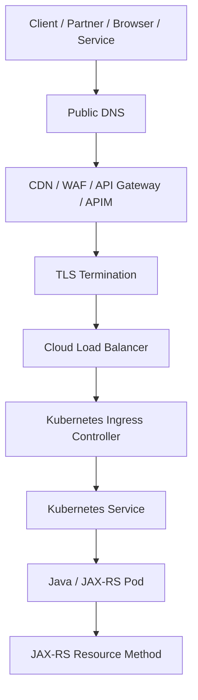
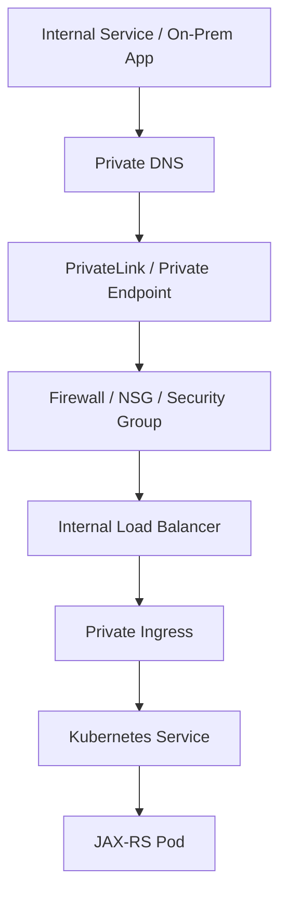
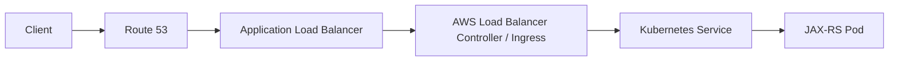
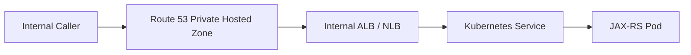
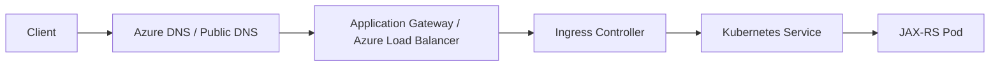
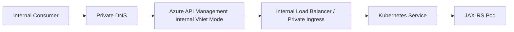

# Part 108 — AWS/Azure Networking: VPC, VNet, DNS, TLS, Load Balancer, Gateway, APIM

> Fokus part ini: memahami jalur traffic dari client/API consumer sampai Java/JAX-RS service di cloud enterprise, termasuk AWS VPC, Azure VNet, subnet, routing, DNS, TLS, load balancer, API Gateway, Azure API Management, private routing, failure modes, debugging, dan PR review.

Catatan penting:

```text
This part does not assume CSG uses AWS, Azure, EKS, AKS, Route 53,
Azure DNS, AWS API Gateway, Azure API Management, ALB, NLB,
Azure Load Balancer, Application Gateway, CloudFront, Front Door,
PrivateLink, Private Endpoint, Transit Gateway, VPN, ExpressRoute,
Direct Connect, or any specific cloud topology.

Treat every cloud networking detail as an internal verification item.
```

Core idea:

```text
A JAX-RS endpoint is not just reached by HTTP.
It is reached through DNS, TLS, routing, firewall rules, load balancers,
ingress controllers, service discovery, Kubernetes Services, Pods,
identity policies, and sometimes API management layers.

When an endpoint fails, the resource method may not even have been invoked.
```

Senior engineer asks:

```text
What is the full traffic path?
Where does DNS resolve?
Where does TLS terminate?
Which load balancer receives traffic?
Is the path public, private, or hybrid?
Is there an API gateway or APIM policy in front?
Which headers are added, removed, or rewritten?
Which network policy, security group, NSG, route table, or firewall can block traffic?
Can we prove whether the request reached the Pod?
```

---

## 1. End-to-End Traffic Mental Model

A typical request path may look like this:



A private enterprise path may look like this:



Debugging starts by locating the failing hop.

---

## 2. AWS VPC Mental Model

AWS VPC is a logically isolated network boundary for AWS resources.

Important components:

```text
VPC CIDR
subnet
route table
internet gateway
NAT gateway
security group
network ACL
VPC endpoint
private hosted zone
load balancer
Transit Gateway / peering / VPN / Direct Connect
```

For Java/JAX-RS service running on EKS or EC2, VPC decides:

```text
Can clients reach the service?
Can Pods reach databases, Kafka, Redis, S3, Secrets Manager, or external APIs?
Does traffic leave the private network?
Is egress controlled?
Can DNS resolve private endpoints?
Which security group allows inbound/outbound traffic?
```

Typical EKS service path in AWS:



Typical internal AWS path:



---

## 3. Azure VNet Mental Model

Azure Virtual Network is the logical network boundary for Azure resources.

Important components:

```text
VNet address space
subnet
route table / UDR
network security group
private endpoint
private DNS zone
Azure Load Balancer
Application Gateway
Azure Firewall
VNet peering
VPN Gateway
ExpressRoute
Azure API Management
```

For Java/JAX-RS service on AKS or VMs, VNet decides:

```text
Can clients reach the service?
Can Pods reach Key Vault, Blob, PostgreSQL, Kafka/Event Hubs, Redis, or private APIs?
Does traffic go through NAT/firewall?
Can private endpoint DNS resolve to private IP?
Can APIM reach backend privately?
Which NSG blocks traffic?
```

Typical AKS public ingress path:



Typical internal APIM path:



---

## 4. DNS Is Part of Application Availability

DNS failure often looks like application failure.

DNS responsibilities:

```text
map hostnames to public or private IPs
route to gateways/load balancers
support internal names through private zones
support failover or weighted routing where configured
support certificate validation through hostname/SAN matching
```

AWS examples:

```text
Route 53 public hosted zone
Route 53 private hosted zone
alias record to ALB/NLB/API Gateway/CloudFront
private DNS for VPC endpoints
```

Azure examples:

```text
Azure DNS public zone
Azure Private DNS zone
private endpoint DNS zone
custom DNS resolver
APIM internal endpoint DNS records
```

Failure modes:

```text
wrong public/private zone
stale DNS cache
split-horizon DNS mismatch
record points to old load balancer
certificate hostname mismatch
private endpoint resolves to public endpoint
APIM internal mode missing private DNS record
client resolver cannot reach private DNS
```

Debugging commands:

```bash
nslookup api.example.com
dig api.example.com
curl -v https://api.example.com/health
openssl s_client -connect api.example.com:443 -servername api.example.com
```

In Kubernetes:

```bash
kubectl run dns-debug --rm -it --image=busybox:1.36 -- nslookup api.example.com
kubectl run curl-debug --rm -it --image=curlimages/curl -- curl -vk https://api.example.com/health
```

---

## 5. TLS Termination and Certificate Boundaries

TLS can terminate at different layers:

```text
CDN / edge gateway
API Gateway / APIM
cloud load balancer
Kubernetes ingress controller
service mesh sidecar
application container itself
```

Each choice changes the security and debugging model.

Questions:

```text
Where does HTTPS terminate?
Is traffic re-encrypted to backend?
Is mTLS used between gateway and service?
Who manages certificates?
What hostname is on the certificate?
What TLS policy/cipher is allowed?
How are certificates rotated?
Does the application see original scheme via X-Forwarded-Proto?
```

Common JAX-RS impact:

```text
Generated absolute links may use http instead of https.
Security filters may misread scheme or host.
CORS origin matching may fail.
Redirects may point to internal hostnames.
Audit logs may show load balancer IP instead of client IP.
```

Headers to verify:

```text
X-Forwarded-For
X-Forwarded-Proto
X-Forwarded-Host
Forwarded
X-Request-ID
traceparent
```

Never blindly trust forwarded headers from the public internet. The trusted proxy boundary must be explicit.

---

## 6. Load Balancer Types and Their Consequences

### 6.1 L4 load balancer

L4 operates at TCP/UDP level.

Typical examples:

```text
AWS Network Load Balancer
Azure Load Balancer
```

Good for:

```text
high-throughput TCP
static IP use cases
protocols beyond HTTP
TLS pass-through
```

Limitations:

```text
less HTTP-aware routing
no path/header-based routing unless combined with another layer
health check semantics may be basic
```

### 6.2 L7 load balancer

L7 understands HTTP.

Typical examples:

```text
AWS Application Load Balancer
Azure Application Gateway
Ingress controller with HTTP routing
API Gateway / APIM
```

Good for:

```text
path-based routing
host-based routing
TLS termination
HTTP header manipulation
WAF integration
redirects
HTTP health checks
```

Risks:

```text
header rewriting
body size limits
idle timeout
connection draining behavior
compression behavior
HTTP/2 to HTTP/1.1 translation
unexpected 413/502/503/504
```

For JAX-RS, L7 behavior can change application-visible semantics.

---

## 7. API Gateway and Azure API Management

API gateways are not just reverse proxies.
They can enforce policy.

Common gateway/APIM capabilities:

```text
authentication
JWT validation
subscription key validation
rate limiting
quota
request/response transformation
header injection/removal
CORS policy
request size limit
routing
backend selection
mTLS
OpenAPI import
developer portal
analytics
mocking
versioning
```

Risks:

```text
Gateway validates auth differently from backend.
Gateway status code differs from service status code.
Gateway strips required headers.
Gateway times out before backend timeout.
Gateway retries non-idempotent request.
Gateway transforms body and breaks signature.
Gateway rate limit hides backend capacity issue.
Gateway CORS differs from service CORS.
```

Senior rule:

```text
The effective API contract is gateway policy + network behavior + JAX-RS implementation.
```

You cannot review only resource methods.

---

## 8. Private Connectivity Patterns

Private connectivity avoids public internet exposure.

AWS patterns:

```text
private subnets
internal ALB/NLB
VPC endpoint / PrivateLink
private hosted zone
Transit Gateway
VPC peering
VPN
Direct Connect
```

Azure patterns:

```text
private endpoint
Private Link
private DNS zone
internal Load Balancer
APIM internal VNet mode
VNet peering
VPN Gateway
ExpressRoute
Azure Firewall
```

Private does not mean automatically secure.
You still need:

```text
authentication
authorization
mTLS or transport policy where required
least-privilege routing
firewall/SG/NSG rules
DNS governance
audit logs
```

Common private networking bug:

```text
Private endpoint exists, but DNS still resolves public endpoint.
```

Another common bug:

```text
DNS resolves private IP, but route table/NSG/security group blocks it.
```

---

## 9. Routing and Firewall Layers

Traffic can be blocked by many layers.

AWS layers:

```text
route table
security group
network ACL
VPC endpoint policy
load balancer security group
target group health check
AWS WAF
API Gateway resource policy
egress firewall/proxy
```

Azure layers:

```text
route table / UDR
NSG
Azure Firewall
private endpoint network policy
load balancer rule
Application Gateway health probe
APIM policy
WAF policy
egress NAT/firewall
```

Kubernetes layers:

```text
NetworkPolicy
Service selector
EndpointSlice
Ingress rule
Ingress controller config
service mesh policy
Pod readiness
```

Debugging requires proving hop by hop.

---

## 10. Health Checks Are Routing Decisions

Load balancers and gateways often route only to healthy targets.

Health check mistakes:

```text
Health path hits database and fails during DB maintenance.
Readiness endpoint returns 200 before app is ready.
Liveness endpoint is too aggressive and restarts slow JVM during warmup.
Gateway health check uses wrong Host header.
Backend requires auth for health endpoint but LB cannot provide token.
Health check port differs from container port.
```

For JAX-RS service:

```text
/livez should indicate process is alive.
/readyz should indicate service can accept traffic.
/deep-health should be separate and usually not used for liveness.
```

Gateway/LB health checks must align with Kubernetes readiness.
Otherwise traffic can reach Pods that Kubernetes does not consider ready, or vice versa.

---

## 11. HTTP Semantics Across Network Layers

Network layers can alter HTTP behavior:

```text
method restrictions
header size limits
body size limits
idle timeout
request timeout
response buffering
compression
decompression
HTTP/2 termination
chunked transfer handling
connection reuse
keep-alive behavior
CORS preflight handling
WebSocket upgrade handling
SSE buffering
```

Failure examples:

```text
Large multipart upload fails at gateway body limit before JAX-RS sees it.
SSE appears broken because proxy buffers response.
Long polling returns 504 because gateway timeout is shorter than server wait.
Idempotent retry policy in gateway retries POST without idempotency key.
Header required for tenant routing is stripped.
```

Review the full path, not only Java code.

---

## 12. Traffic Flow Debugging: Did Request Reach the Pod?

Start with this binary question:

```text
Did the request reach the JAX-RS application process?
```

Evidence that it reached app:

```text
application access log
JAX-RS request filter log
trace span from service
metric counter increment
audit event
correlation ID in service logs
```

Evidence it failed before app:

```text
DNS failure
TLS handshake failure
gateway 401/403/429
load balancer 502/503/504
ingress controller log without app log
Kubernetes Service has no endpoints
target group unhealthy
network timeout before Pod logs
```

Debug sequence:

```bash
# From client side
curl -vk https://api.example.com/path

# DNS
nslookup api.example.com

# TLS
openssl s_client -connect api.example.com:443 -servername api.example.com

# Kubernetes service mapping
kubectl get ingress -n quote-order
kubectl get svc -n quote-order
kubectl get endpointslice -n quote-order
kubectl get pods -n quote-order -o wide

# Ingress/controller logs
kubectl logs -n ingress-nginx deploy/ingress-nginx-controller

# App logs
kubectl logs -n quote-order deploy/quote-order-api
```

Cloud-specific commands vary by platform and must be verified internally.

---

## 13. Common Status Codes by Layer

| Code | Often produced by | Meaning to investigate |
|---|---|---|
| 400 | Gateway / app | malformed request, policy failure, validation |
| 401 | Gateway / app | missing/invalid identity |
| 403 | Gateway / app / WAF | denied by policy, authz, resource policy, IP rule |
| 404 | Gateway / ingress / app | route/path mismatch, wrong base path, API version issue |
| 405 | app/gateway | method not allowed or policy blocks method |
| 413 | gateway/ingress/app | body too large |
| 415 | app | unsupported media type |
| 429 | gateway/app/rate limiter | quota/rate limit |
| 499 | proxy-specific | client disconnected before response |
| 502 | gateway/LB/ingress | upstream invalid response, connection refused |
| 503 | gateway/LB/ingress/app | no healthy target, service unavailable |
| 504 | gateway/LB/ingress | upstream timeout |

Do not assume every 5xx is an application exception.

---

## 14. Header Strategy Across Proxies

Critical headers:

```text
Host
X-Forwarded-Host
X-Forwarded-Proto
X-Forwarded-For
Forwarded
Authorization
Cookie
traceparent
tracestate
baggage
X-Correlation-ID
X-Request-ID
X-Tenant-ID
Idempotency-Key
```

Questions:

```text
Which headers are client-controlled?
Which headers are gateway-generated?
Which headers are stripped before backend?
Which headers are trusted by application?
Which headers carry tenant or identity context?
Which headers are logged/redacted?
```

Security warning:

```text
If a client can spoof X-Tenant-ID, X-Forwarded-For, or identity headers,
you may have tenant isolation or audit integrity failure.
```

Gateway must normalize trusted context.
Backend must validate trust boundary.

---

## 15. AWS Networking Review Anchors

For AWS-hosted service, verify:

```text
VPC CIDR and subnet layout
public/private subnet separation
route tables
NAT gateway / egress path
security groups
network ACLs
Route 53 public/private hosted zones
ALB/NLB type and scheme
target group protocol/port/health check
AWS WAF if present
API Gateway type: edge/regional/private
VPC endpoints / PrivateLink
certificate source and rotation
CloudWatch/load balancer logs
Transit Gateway / peering / Direct Connect if hybrid
```

AWS-specific failure examples:

```text
ALB target group unhealthy because readiness path returns non-200.
Security group allows LB to node but not Pod security group.
Private hosted zone not associated with caller VPC.
API Gateway private endpoint missing correct resource policy.
NAT gateway missing, so private subnet Pods cannot reach public dependency.
```

---

## 16. Azure Networking Review Anchors

For Azure-hosted service, verify:

```text
VNet address space and subnet layout
AKS subnet and node pool subnet
NSG rules
UDR / route table
Azure Firewall / NAT Gateway
Azure DNS / Private DNS zones
Application Gateway / Azure Load Balancer
APIM public/internal/external mode
private endpoints and DNS zone links
certificate source and rotation
Azure Monitor / diagnostic logs
VNet peering / VPN / ExpressRoute if hybrid
```

Azure-specific failure examples:

```text
Private endpoint exists but Private DNS zone not linked to VNet.
APIM internal mode missing required DNS records.
NSG blocks health probe or backend traffic.
Application Gateway backend health probe uses wrong host/path.
UDR sends traffic to firewall that lacks allow rule.
```

---

## 17. API Gateway/APIM and JAX-RS Contract Alignment

The API seen by consumers may differ from the backend JAX-RS API.

Gateway may:

```text
strip base path
rewrite path
add version prefix
validate JWT
inject tenant header
transform request body
transform response body
map backend status code
apply CORS
apply rate limit
apply request size limit
perform schema validation
```

Therefore review contract at two levels:

```text
External contract
  What consumer sees through gateway/APIM.

Backend contract
  What JAX-RS service exposes behind gateway.
```

Mismatch examples:

```text
OpenAPI says /v1/orders, backend exposes /orders, gateway rewrites path.
Gateway accepts field that backend rejects.
Gateway timeout is 30s, backend timeout is 60s.
Gateway returns 401 before backend auth filter runs.
```

Both contracts must be documented.

---

## 18. Production Failure Modes

### 18.1 DNS split-brain

Symptom:

```text
Some clients reach old service, others reach new service.
```

Root cause:

```text
Public/private DNS zones differ or resolver path differs.
```

Debug:

```text
Compare DNS answer from client network, Pod, bastion, and gateway subnet.
```

### 18.2 TLS hostname mismatch

Symptom:

```text
Client fails handshake or reports certificate error.
```

Root cause:

```text
Certificate SAN does not match hostname or SNI not passed correctly.
```

Debug:

```bash
openssl s_client -connect host:443 -servername host
```

### 18.3 Gateway timeout before backend timeout

Symptom:

```text
Client receives 504 while app continues processing.
```

Root cause:

```text
Gateway/LB idle timeout shorter than backend operation.
```

Fix:

```text
Align timeout hierarchy and design async/long-running operation pattern.
```

### 18.4 Upload blocked before app

Symptom:

```text
Large file upload returns 413 and app logs nothing.
```

Root cause:

```text
Gateway/ingress body limit.
```

Fix:

```text
Set explicit upload limits across gateway, ingress, app, and storage.
```

### 18.5 Header spoofing

Symptom:

```text
Wrong tenant/user appears in logs or authorization context.
```

Root cause:

```text
Application trusts client-supplied forwarded/tenant headers.
```

Fix:

```text
Only trust headers inserted by controlled gateway; strip untrusted incoming headers.
```

---

## 19. PR Review Checklist

When reviewing networking-related change, check:

```text
Traffic path
  Is full client-to-pod path understood?
  Is path public, private, or hybrid?
  Does request reach gateway, ingress, service, and pod?

DNS
  Are public/private DNS records correct?
  Are private DNS zones linked to correct VPC/VNet?
  Is TTL acceptable for rollout/rollback?

TLS
  Where does TLS terminate?
  Is certificate hostname correct?
  Is re-encryption/mTLS required?
  Is rotation handled?

Load balancing
  Is LB L4 or L7?
  Are health checks correct?
  Is idle timeout aligned with app timeout?
  Is connection draining configured?

Gateway/APIM
  Are policies documented?
  Are auth/rate limit/CORS/body limits aligned with backend?
  Are path rewrites and header mutations clear?

Security
  Are SG/NSG/firewall rules least privilege?
  Are forwarded headers trusted safely?
  Is tenant identity protected?

Observability
  Are gateway/LB/ingress logs enabled?
  Can correlation ID cross gateway to backend?
  Can we distinguish gateway 5xx from app 5xx?

Rollback
  Can DNS/gateway/ingress change be reverted?
  Are old and new paths compatible during transition?
```

---

## 20. Internal Verification Checklist

Verify in CSG/internal environment:

```text
Cloud/platform
  Is the service deployed on AWS, Azure, both, on-prem, or hybrid?
  Is it behind EKS, AKS, VM, managed platform, or internal gateway?

DNS
  Which DNS provider is authoritative?
  Are private hosted zones/private DNS zones used?
  Who owns DNS records?
  What is the TTL policy?

TLS
  Where does TLS terminate?
  Which cert manager or cloud certificate service is used?
  Is mTLS required internally?

Gateway
  Is AWS API Gateway, Azure APIM, Kong, NGINX, Envoy, Apigee, or another gateway used?
  Are policies defined as code?
  Are OpenAPI specs imported into gateway?

Load balancer
  Which LB type is used?
  Are health checks aligned with readiness?
  What are idle timeout/body size/header size limits?

Kubernetes ingress
  Which ingress controller is used?
  Are path rewrites configured?
  Are forwarded headers trusted?

Security
  Which SG/NSG/firewall/network policy controls traffic?
  Is tenant context inserted by trusted gateway?
  Are WAF rules enabled?

Private connectivity
  Are PrivateLink/Private Endpoint/VPC Endpoint used?
  Are private DNS zones linked correctly?
  How is hybrid/on-prem connectivity handled?

Observability
  Where are gateway/LB/access logs stored?
  Are trace/correlation headers propagated?
  Are network errors dashboarded?
```

---

## 21. Senior Mental Model

Networking is not outside backend engineering.

For a senior Java/JAX-RS engineer:

```text
API correctness includes gateway policy.
Security includes trusted network/header boundaries.
Reliability includes DNS, TLS, LB health, and timeout alignment.
Debugging includes proving the request path hop by hop.
Performance includes network latency, connection reuse, and proxy buffering.
Compatibility includes path rewrite, versioning, CORS, and body/header limits.
```

When production fails, do not jump directly to the resource method.
First prove the request reached it.

A production-ready JAX-RS service has a known and observable traffic path from consumer to resource method, with explicit DNS, TLS, load balancing, gateway policy, timeout, header, security, and rollback behavior.

---

## References

- AWS VPC documentation: https://docs.aws.amazon.com/vpc/
- Amazon Route 53 documentation: https://docs.aws.amazon.com/Route53/latest/DeveloperGuide/Welcome.html
- AWS Elastic Load Balancing documentation: https://docs.aws.amazon.com/elasticloadbalancing/
- AWS API Gateway documentation: https://docs.aws.amazon.com/apigateway/
- Azure networking documentation: https://learn.microsoft.com/en-us/azure/networking/
- Azure Virtual Network documentation: https://learn.microsoft.com/en-us/azure/virtual-network/
- Azure Load Balancer documentation: https://learn.microsoft.com/en-us/azure/load-balancer/
- Azure Application Gateway documentation: https://learn.microsoft.com/en-us/azure/application-gateway/
- Azure API Management documentation: https://learn.microsoft.com/en-us/azure/api-management/
- Azure Private Link documentation: https://learn.microsoft.com/en-us/azure/private-link/
