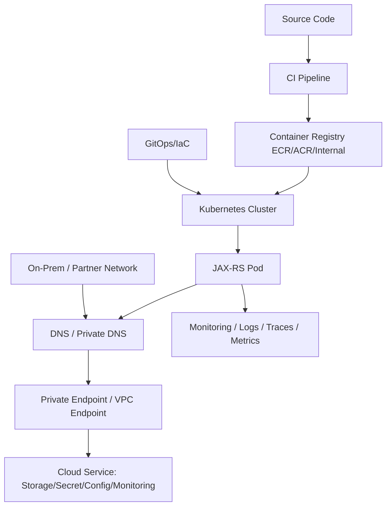
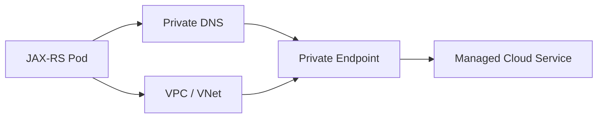
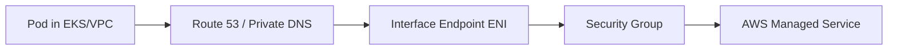
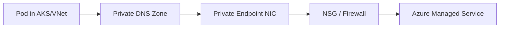
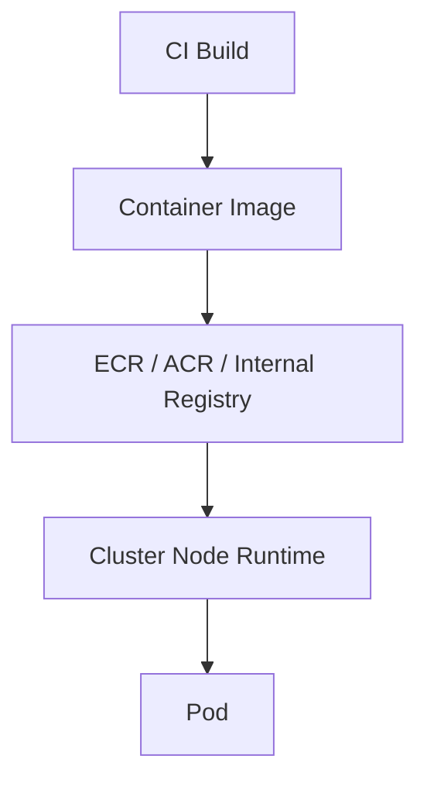
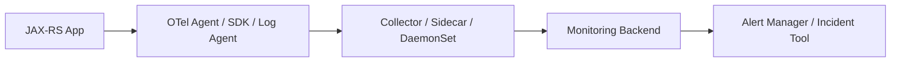
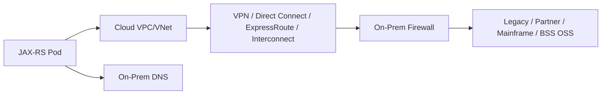
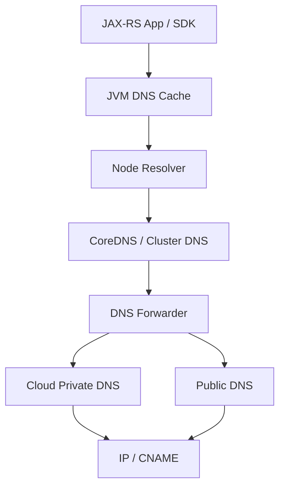
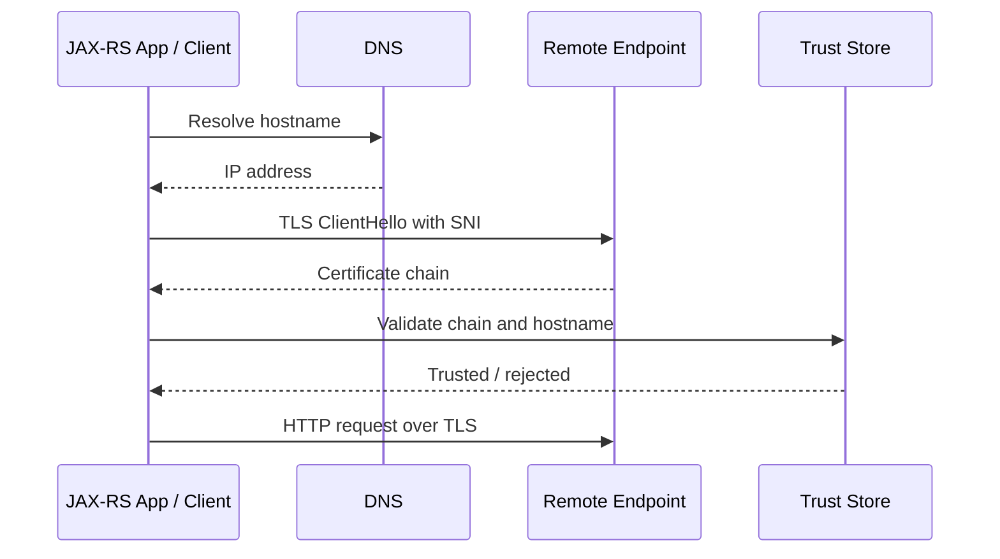

# Part 109 — Private Endpoints, Registries, Monitoring, Hybrid Connectivity, DNS/TLS Failure Modes

> Fokus part ini: memahami integrasi platform cloud/on-prem di sekitar Java/JAX-RS service: private endpoint, container registry, monitoring, hybrid connectivity, DNS, TLS, dan failure mode yang sering terlihat seperti bug aplikasi padahal penyebabnya berada di platform/network layer.

Catatan penting:

```text
This part does not assume CSG uses AWS PrivateLink, VPC Endpoint,
Azure Private Endpoint, Azure Private Link, ECR, ACR, CloudWatch,
Azure Monitor, VPN, Direct Connect, ExpressRoute, Transit Gateway,
Azure Virtual WAN, private DNS zone, split-horizon DNS, service mesh,
or any specific hybrid connectivity model.

Treat every platform and network detail as an internal verification item.
```

Core idea:

```text
A production JAX-RS service is not only a Java process.
It is a participant in a platform graph:

image registry -> CI/CD -> cluster -> pod identity -> private endpoint -> DNS -> TLS -> monitoring -> incident workflow

When this graph breaks, the Java code may be correct but the service is still unavailable.
```

Senior engineer asks:

```text
Can the pod pull the image?
Can the pod resolve private DNS names?
Can the pod reach private endpoints?
Can cloud services authenticate the workload identity?
Can telemetry leave the cluster?
Can on-prem systems reach the service path?
Can the service validate TLS certificates?
Can we prove where the request or connection failed?
```

---

## 1. Platform Integration Mental Model

A Java/JAX-RS service normally depends on more than its own container:



The dangerous assumption:

```text
"The application is failing because the code is wrong."
```

The better model:

```text
A production request can fail before Java sees it.
A dependency call can fail before the SDK sends a valid request.
A deployment can fail before a container starts.
An incident can be caused by DNS, TLS, registry auth, routing, firewall,
identity binding, or observability pipeline failure.
```

For a senior engineer, the work is not just fixing Java code. The work is finding the failed boundary.

---

## 2. Private Endpoint Mental Model

A private endpoint gives access to a service through a private network path instead of a public internet path.

Generic model:



Examples of services that often use private endpoints:

- object storage
- database service
- secret manager
- config service
- message broker
- container registry
- monitoring ingestion endpoint
- internal API gateway
- partner/on-prem endpoint

Key point:

```text
Private endpoint is not only routing.
It usually requires correct DNS, network policy, firewall, identity, and TLS.
```

A pod may have network access but still fail because DNS resolves to the public endpoint. A pod may resolve private IP but still fail because route tables or firewall rules block it. A pod may connect but fail TLS because the certificate name does not match the endpoint being used.

---

## 3. AWS-style Private Connectivity Concepts

Do not assume these are used internally. Use this as vocabulary for verification.

Common AWS-side concepts:

- VPC Endpoint
- Gateway Endpoint
- Interface Endpoint
- PrivateLink
- private hosted zone
- Route 53 resolver
- security group
- route table
- network ACL
- Transit Gateway
- Site-to-Site VPN
- Direct Connect
- ECR private registry access
- CloudWatch endpoint access

Typical private access path:



Questions to verify:

```text
Is traffic using public internet, NAT gateway, gateway endpoint, or interface endpoint?
Is private DNS enabled for the endpoint?
Does the pod subnet route to the endpoint ENI?
Does the endpoint security group allow source traffic?
Does IAM allow the action after network succeeds?
Does the SDK endpoint override point to the intended service endpoint?
```

Failure signatures:

| Symptom | Likely boundary |
|---|---|
| DNS resolves public IP unexpectedly | private DNS not configured or wrong resolver path |
| connection timeout | route/security group/NACL/firewall |
| connection refused | endpoint/service listener not reachable |
| TLS hostname mismatch | wrong endpoint hostname or certificate path |
| 403 after successful connection | IAM/resource policy |
| image pull fails | ECR auth/network/registry policy |
| telemetry missing | CloudWatch/collector endpoint blocked |

---

## 4. Azure-style Private Connectivity Concepts

Do not assume these are used internally. Use this as vocabulary for verification.

Common Azure-side concepts:

- Azure Private Endpoint
- Azure Private Link
- private DNS zone
- VNet integration
- Network Security Group
- route table / UDR
- Azure Firewall
- Application Gateway
- Azure API Management internal mode
- Azure Container Registry private endpoint
- Azure Monitor private link scope
- VPN Gateway
- ExpressRoute
- Azure Bastion / jump host pattern

Typical private access path:



Questions to verify:

```text
Is the service exposed through public endpoint, private endpoint, or both?
Is the private DNS zone linked to the VNet?
Does AKS use Azure CNI, overlay, or another network model?
Are NSG/firewall/UDR rules allowing traffic?
Is ACR reachable privately by the node/pod path?
Is Azure Monitor ingestion available from the cluster network?
```

Failure signatures:

| Symptom | Likely boundary |
|---|---|
| DNS returns public IP | private DNS zone not linked or not used |
| timeout to private IP | NSG/firewall/UDR path issue |
| image pull error | ACR identity/private endpoint/network issue |
| 401/403 from service | workload identity/managed identity/RBAC issue |
| TLS error | wrong DNS name, private endpoint alias, custom domain issue |
| metrics/logs absent | Azure Monitor/collector/private link issue |

---

## 5. Container Registry as Production Dependency

A deployment cannot start if nodes cannot pull the image.

Registry path:



Common registry failure modes:

- image tag does not exist
- wrong digest
- image pull secret missing
- registry authentication expired
- node identity lacks pull permission
- private endpoint/DNS path broken
- registry blocked by firewall
- image scanning policy blocks promotion
- signed image verification fails
- architecture mismatch, for example amd64 vs arm64
- mutable tag points to unexpected image

Production rule:

```text
Deploy by immutable digest when possible.
Do not rely only on mutable tags for regulated or high-risk production rollout.
```

Example deployment snippet:

```yaml
containers:
  - name: quote-order-api
    image: registry.example.com/csg/quote-order-api@sha256:abc123...
    imagePullPolicy: IfNotPresent
```

Internal verification checklist:

```text
[ ] Which registry is used: ECR, ACR, internal registry, or another registry?
[ ] Is image promotion tag-based, digest-based, or both?
[ ] Are images scanned before promotion?
[ ] Are images signed?
[ ] Are base images governed?
[ ] Can cluster nodes pull via private network?
[ ] Is imagePullSecret or workload/node identity used?
[ ] Is rollback image still available?
[ ] Is registry access observable during deployment failure?
```

---

## 6. Monitoring and Observability Platform Connectivity

Observability is also a dependency. When observability is broken, incidents become longer.

Telemetry flow:



Important distinction:

```text
Application is healthy != telemetry is healthy.
Telemetry is flowing != telemetry is useful.
```

Telemetry connectivity failure modes:

- collector cannot resolve backend
- collector cannot reach private ingestion endpoint
- TLS trust issue between collector and backend
- tenant/project/workspace key invalid
- rate limit or ingestion throttling
- metric cardinality explosion
- log volume throttling
- trace sampling unexpectedly too aggressive
- namespace/resource labels missing
- service name inconsistent across deployments

Operational impact:

```text
If telemetry path is broken, mean time to detection and mean time to recovery increase.
If telemetry labels are inconsistent, dashboard queries silently miss affected pods.
If telemetry is too noisy, real incidents drown in irrelevant alerts.
```

Internal verification checklist:

```text
[ ] Where do logs go?
[ ] Where do metrics go?
[ ] Where do traces go?
[ ] Is OpenTelemetry collector used?
[ ] Is telemetry egress public or private?
[ ] Are service.name, environment, cluster, namespace, and tenant labels standardized?
[ ] Are telemetry endpoints reachable from all node pools/subnets?
[ ] Are ingestion failures monitored?
[ ] Are alerts tied to SLOs or only infrastructure symptoms?
```

---

## 7. Hybrid Connectivity Mental Model

Hybrid connectivity connects cloud workloads with on-prem systems, partner systems, or private enterprise networks.

Generic model:



Hybrid integration adds failure modes that normal cloud-only systems do not have:

- asymmetric routing
- overlapping CIDR ranges
- MTU fragmentation
- firewall state timeout
- TLS interception
- enterprise proxy requirement
- DNS forwarding loop
- stale route propagation
- on-prem maintenance window
- partner allowlist not updated
- NAT source IP mismatch

Senior review question:

```text
Does this service have a dependency path outside the cluster/cloud region?
If yes, what is the routing, DNS, TLS, firewall, identity, timeout, retry, and runbook model?
```

---

## 8. DNS Failure Modes

DNS is often invisible until it fails.

Resolution path:



Common DNS failure modes:

| Failure | Consequence |
|---|---|
| wrong private DNS zone | traffic goes public or nowhere |
| missing VPC/VNet link | private endpoint name resolves incorrectly |
| stale JVM DNS cache | app keeps using old IP |
| CoreDNS overloaded | intermittent lookup timeout |
| split-horizon mismatch | pod and local workstation resolve different IPs |
| CNAME chain too long/wrong | SDK endpoint failure |
| search domain surprise | wrong internal hostname is used |

Java-specific concern:

```text
The JVM may cache DNS lookups.
If DNS changes during failover, a running process may not immediately observe it,
depending on JVM/networkaddress.cache.ttl/security configuration and runtime behavior.
```

Debug checklist from inside pod:

```bash
kubectl exec -n <namespace> <pod> -- nslookup <host>
kubectl exec -n <namespace> <pod> -- dig <host>
kubectl exec -n <namespace> <pod> -- getent hosts <host>
kubectl exec -n <namespace> <pod> -- cat /etc/resolv.conf
```

Application-level debugging:

```text
Log dependency hostnames at startup.
Log resolved endpoint family only when safe and non-sensitive.
Avoid logging secrets, tokens, signed URLs, or full connection strings.
Expose dependency readiness only if it does not create cascading startup failure.
```

---

## 9. TLS Failure Modes

TLS problems frequently appear as vague client errors.

TLS path:



Common TLS failure modes:

| Symptom | Possible cause |
|---|---|
| certificate unknown | CA missing from truststore |
| hostname mismatch | DNS name does not match certificate SAN |
| handshake timeout | network/firewall/proxy issue |
| protocol version error | TLS version/cipher mismatch |
| mTLS handshake fail | client cert missing/expired/wrong CA |
| works locally, fails in pod | different truststore, proxy, DNS, or egress path |
| works public, fails private | private endpoint custom DNS/cert mismatch |

Java-specific TLS checks:

```bash
# From local or debug container if openssl exists
openssl s_client -connect example.internal:443 -servername example.internal -showcerts

# For Java-level debugging in non-production reproduction only
-Djavax.net.debug=ssl,handshake
```

Do not enable verbose TLS debugging in high-volume production without a controlled plan. It can expose sensitive metadata and overwhelm logs.

Internal verification checklist:

```text
[ ] Which truststore is used by the JVM?
[ ] Are internal CA certificates injected into the image or mounted at runtime?
[ ] Is mTLS used for service-to-service traffic?
[ ] Where does TLS terminate inbound traffic?
[ ] Is TLS re-encrypted between gateway/ingress/service?
[ ] Are certificates rotated automatically?
[ ] Are certificate expiration alerts configured?
[ ] Is SNI required by downstream endpoints?
```

---

## 10. Private Endpoint + DNS + TLS Interaction

The hardest failures often combine DNS and TLS.

Example:

```text
The pod resolves storage.company.internal to a private IP.
The TLS certificate is issued for storage.cloudprovider.com.
The app connects using storage.company.internal.
TLS hostname validation fails.
```

Another example:

```text
The SDK expects account.blob.core.windows.net or bucket.s3.region.amazonaws.com.
Internal DNS overrides the name to a private endpoint.
The private IP is correct, but firewall blocks the subnet.
The app reports timeout.
```

Decision rule:

```text
Do not "fix" TLS by disabling certificate validation.
Fix DNS name, certificate, trust chain, endpoint configuration, or SDK endpoint usage.
```

Bad pattern:

```java
// Do not approve this in production PRs.
// Trust-all TLS clients turn network misconfiguration into security exposure.
```

Senior PR review should block:

- trust-all certificate managers
- hostname verifier that always returns true
- disabled TLS validation
- hardcoded private IP endpoints
- logged connection strings
- silent fallback to public endpoint without approval

---

## 11. Monitoring the Platform Graph

Platform dependencies should be observable explicitly.

Useful platform-level signals:

| Signal | What it protects |
|---|---|
| image pull error count | deployment reliability |
| pod pending time | scheduling/storage/registry issues |
| DNS lookup latency/error | dependency resolution |
| TLS handshake failure | trust/cert/hostname issues |
| connection timeout by dependency | routing/firewall/private endpoint |
| 401/403 dependency response | identity/RBAC/IAM/policy issue |
| telemetry ingestion error | incident visibility |
| certificate expiry days | outage prevention |
| registry scan failures | supply chain gate |
| deployment rollout duration | release health |

Application metrics should separate:

```text
request latency != dependency latency
HTTP 500 != network timeout
auth failure != network failure
DNS failure != TLS failure
connection timeout != response timeout
```

Suggested error tags:

```text
dependency.name
dependency.operation
failure.boundary = dns | connect | tls | auth | authorization | timeout | throttling | protocol | application
retryable = true | false
```

Be careful with cardinality. Do not put raw URL, customer ID, tenant ID, quote ID, order ID, or full exception message as metric label.

---

## 12. Runbook: Dependency Call Fails from Pod

When a Java/JAX-RS service cannot call a dependency:

```text
1. Identify dependency name, host, port, protocol, and operation.
2. Check whether failure is DNS, connect, TLS, auth, authorization, timeout, or application response.
3. Exec into same namespace/pod class when safe.
4. Resolve DNS from inside cluster.
5. Test TCP connectivity.
6. Test TLS handshake with SNI.
7. Check network policies, security groups, NSG, firewall, route table.
8. Check workload identity/IAM/RBAC/resource policy.
9. Check dependency-side logs/audit trail.
10. Check recent deployment/config/DNS/cert/network changes.
11. Decide rollback, config fix, route fix, credential fix, or dependency escalation.
```

Example commands:

```bash
kubectl get pods -n <namespace>
kubectl describe pod -n <namespace> <pod>
kubectl logs -n <namespace> <pod> --previous
kubectl exec -n <namespace> <pod> -- getent hosts <host>
kubectl exec -n <namespace> <pod> -- nc -vz <host> 443
kubectl exec -n <namespace> <pod> -- curl -vk https://<host>/health
```

In locked-down production clusters, these tools may not exist in app images. Use approved debug pod or ephemeral container process if allowed by internal policy.

---

## 13. Runbook: Image Pull Failure

Symptoms:

```text
ImagePullBackOff
ErrImagePull
unauthorized: authentication required
manifest unknown
x509 certificate signed by unknown authority
connection timeout to registry
```

Triage sequence:

```text
1. Confirm image reference and tag/digest.
2. Confirm image exists in registry.
3. Confirm namespace has correct pull secret or node/workload identity.
4. Confirm registry policy allows cluster identity.
5. Confirm private DNS resolves registry endpoint.
6. Confirm network path from node/subnet to registry.
7. Confirm image architecture matches node architecture.
8. Confirm admission controller/signature/scanning policy did not block pull.
9. Confirm rollback image still exists.
```

Senior PR review should ask:

```text
Can this image be pulled by production clusters before rollout begins?
Is the tag immutable or is digest pinned?
Is there a rollback artifact?
Is the image signed/scanned according to policy?
```

---

## 14. Runbook: Monitoring Missing During Incident

Symptoms:

- app appears down but no logs
- metrics stop for one namespace
- traces missing for new deployment
- alert does not fire despite customer impact
- collector restart loop
- ingestion quota exceeded

Triage:

```text
1. Check whether app is producing telemetry locally.
2. Check agent/sidecar/collector logs.
3. Check collector queue/drop metrics.
4. Check egress/private endpoint to observability backend.
5. Check credentials/workspace/project key.
6. Check service.name/environment labels.
7. Check sampling config.
8. Check metric cardinality/relabeling/drop rules.
9. Check alert query changed or labels drifted.
10. Add incident note that observability gap affected MTTR.
```

Corrective action examples:

- add collector health alert
- add telemetry ingestion SLO
- standardize labels
- block deployment if service name missing
- define fallback log access path
- add synthetic check independent from app telemetry

---

## 15. Hybrid Connectivity Review

When a JAX-RS service depends on on-prem/partner systems, PR and design review must cover the network path.

Checklist:

```text
[ ] What systems are reached outside cloud/cluster?
[ ] Is dependency synchronous or asynchronous?
[ ] Is route public, private, VPN, Direct Connect, ExpressRoute, or partner link?
[ ] Are source IPs allowlisted?
[ ] Is NAT involved?
[ ] Is DNS cloud-owned, on-prem-owned, or split?
[ ] Who owns certificate lifecycle?
[ ] Are maintenance windows known?
[ ] What timeout/retry budget protects the service?
[ ] What fallback exists if on-prem system is unavailable?
[ ] Is customer impact documented?
```

Critical rule:

```text
Hybrid dependencies are often slower and less elastic than cloud-native dependencies.
Do not apply aggressive retry or high concurrency without explicit capacity agreement.
```

---

## 16. Common Anti-Patterns

### Anti-pattern 1 — Assuming DNS is stable forever

Bad:

```text
Hardcode resolved IP or rely on indefinite JVM DNS cache.
```

Better:

```text
Use stable DNS names, controlled TTL, verified private DNS, and dependency reconnect behavior.
```

### Anti-pattern 2 — Trust-all TLS to "fix" connectivity

Bad:

```text
Disable certificate and hostname validation.
```

Better:

```text
Fix truststore, certificate SAN, SNI, DNS, or endpoint selection.
```

### Anti-pattern 3 — Registry is not treated as production dependency

Bad:

```text
Deployment assumes image pull will work because CI pushed successfully.
```

Better:

```text
Verify registry access from cluster, image immutability, scan status, and rollback artifact.
```

### Anti-pattern 4 — Observability is best-effort only

Bad:

```text
Telemetry failure is invisible until incident.
```

Better:

```text
Monitor collector health, ingestion failure, label quality, and alert query coverage.
```

### Anti-pattern 5 — Private endpoint without DNS ownership

Bad:

```text
Endpoint exists, but workloads still resolve public hostname or wrong private zone.
```

Better:

```text
Treat private endpoint, DNS, route, firewall, identity, and TLS as one deployable capability.
```

---

## 17. PR Review Checklist

For changes involving private endpoint, registry, monitoring, DNS, TLS, or hybrid connectivity:

```text
[ ] Does the change alter DNS names, private zones, endpoint hostnames, or service discovery?
[ ] Does the change alter TLS certificate, truststore, mTLS, or SNI behavior?
[ ] Does the change alter registry path, image tag, digest, signing, or scan policy?
[ ] Does the change alter telemetry destination, service name, labels, or collector config?
[ ] Does the change introduce public egress where private path is expected?
[ ] Does the change introduce private endpoint dependency without DNS verification?
[ ] Does the change affect on-prem/partner allowlist or routing?
[ ] Does the change include rollback strategy?
[ ] Does the change include runbook or operational note?
[ ] Can we validate the path from inside the cluster before production traffic uses it?
```

Block PR if:

```text
[ ] TLS validation is disabled.
[ ] Private IPs are hardcoded.
[ ] Secrets/connection strings are logged.
[ ] No rollback artifact exists for deployment change.
[ ] Monitoring labels drift from dashboard/alert expectations.
[ ] Hybrid dependency has no timeout/retry/fallback model.
```

---

## 18. Internal Verification Checklist

For CSG Quote & Order or any enterprise JAX-RS production service, verify:

```text
Runtime/platform:
[ ] Which cloud(s) are used: AWS, Azure, both, on-prem, hybrid?
[ ] Which clusters run the service: EKS, AKS, OpenShift, other Kubernetes, VM, app server?
[ ] Is traffic public, private, or hybrid?

Private endpoints:
[ ] Are AWS VPC Endpoints/PrivateLink used?
[ ] Are Azure Private Endpoints/Private Link used?
[ ] Which dependencies require private access?
[ ] Who owns private DNS zones?
[ ] How are endpoint policies/firewalls reviewed?

Registry:
[ ] Which registry is used: ECR, ACR, internal?
[ ] Are image tags immutable?
[ ] Are deployments digest-pinned?
[ ] Is image signing enforced?
[ ] Is vulnerability scanning a hard gate?

Monitoring:
[ ] Which logging backend is used?
[ ] Which metrics backend is used?
[ ] Which tracing backend is used?
[ ] Is OpenTelemetry collector used?
[ ] Are telemetry ingestion failures alerted?

Hybrid:
[ ] Does service call on-prem or partner systems?
[ ] What network path is used?
[ ] Are source IPs allowlisted?
[ ] Is DNS split-horizon?
[ ] What is the escalation path when hybrid link fails?

DNS/TLS:
[ ] Is JVM DNS cache policy defined?
[ ] Are private DNS zones linked to service networks?
[ ] Are internal CA certs managed centrally?
[ ] Are certificate expiry alerts configured?
[ ] Is mTLS used anywhere?
```

---

## 19. Senior Mental Model

For this part, the senior-level takeaway is:

```text
Application availability is an emergent property of code + runtime + network + identity + DNS + TLS + registry + telemetry + operations.

A Java/JAX-RS service can be perfectly implemented and still fail because the platform graph is broken.
```

When reviewing or debugging production systems, do not stop at:

```text
Does the code compile?
Does the endpoint work locally?
Does the unit test pass?
```

Ask:

```text
Can production pull it?
Can production resolve it?
Can production reach it?
Can production trust it?
Can production authenticate it?
Can production observe it?
Can production roll it back?
Can production explain customer impact when it fails?
```

That is the real boundary between application development and production engineering.
