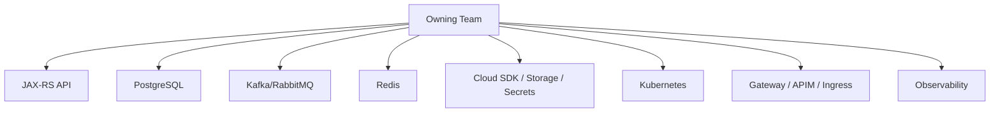
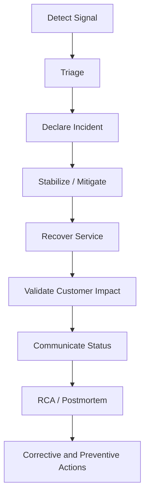
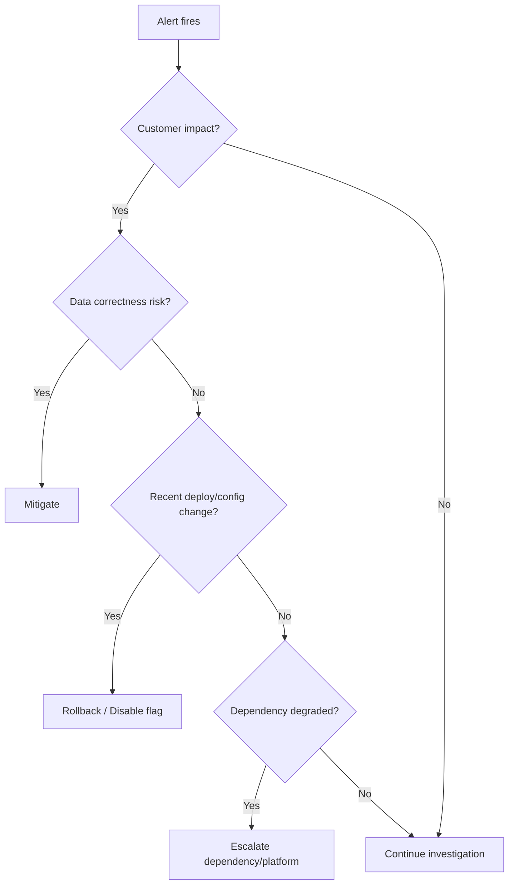

# Part 110 — Production Operations and Incident Response

> Fokus part ini: memahami bagaimana senior engineer mengoperasikan Java/JAX-RS enterprise service di production: runbook, alert triage, SLO/SLA, error budget, incident severity, timeline, RCA, corrective/preventive action, rollback playbook, customer impact assessment, dan post-incident backlog.

Catatan penting:

```text
This part does not assume CSG's internal incident process, severity model,
SLO/SLA definitions, on-call rotation, customer communication process,
rollback mechanism, observability stack, ticketing system, or RCA template.

All operational process details must be verified internally.
```

Core idea:

```text
Production ownership is not only writing correct code.
Production ownership means the team can detect, triage, mitigate, explain,
repair, and prevent failures under real customer pressure.
```

Senior engineer asks:

```text
How do we know the service is unhealthy?
Who gets paged?
What is the customer impact?
What is the fastest safe mitigation?
What evidence do we have?
What changed recently?
What should we roll back, disable, shed, or degrade?
How do we prevent recurrence without blaming individuals?
```

---

## 1. Production Operations Mental Model

A production service has two lifecycles:

```text
1. Software lifecycle
   code -> review -> build -> test -> deploy -> operate -> change again

2. Incident lifecycle
   signal -> triage -> declare -> mitigate -> recover -> analyze -> improve
```

Incident response begins before the incident. It depends on:

- clear service ownership
- useful alerts
- reliable runbooks
- dashboards that answer real questions
- rollback capability
- safe feature flags/kill switches
- dependency map
- SLO/SLA definitions
- escalation path
- post-incident learning loop

Production anti-pattern:

```text
"We will figure it out when it happens."
```

Production-grade posture:

```text
"We know the likely failure modes, we know what signals detect them,
we know how to mitigate them, and we continuously improve after incidents."
```

---

## 2. Service Ownership Model

Every production service needs explicit ownership.

Ownership includes:

```text
[ ] Source code ownership
[ ] Runtime ownership
[ ] Alert ownership
[ ] Dashboard ownership
[ ] Runbook ownership
[ ] Deployment ownership
[ ] Data ownership
[ ] Dependency ownership
[ ] Customer impact ownership
[ ] Post-incident action ownership
```

For a JAX-RS service, ownership boundaries include:



A senior engineer does not need to personally own every platform. But they must know:

```text
Who owns it?
How do we escalate?
What evidence do they need?
What is the dependency contract?
What is our mitigation while waiting?
```

---

## 3. SLO, SLA, and Error Budget

Definitions:

```text
SLI: Service Level Indicator
A measurement of service behavior.
Example: successful request ratio, p95 latency, message processing lag.

SLO: Service Level Objective
Target level for an SLI over a time window.
Example: 99.9% of quote creation requests succeed over 30 days.

SLA: Service Level Agreement
External/customer/legal commitment, often with business consequences.

Error budget:
The allowed unreliability within an SLO window.
```

Example:

```text
SLO: 99.9% successful quote submission over 30 days.
Error budget: 0.1% failed quote submissions.
```

Important:

```text
An SLA is not the same as an SLO.
An SLO should guide engineering decisions.
An SLA may guide customer/legal obligations.
```

Useful JAX-RS service SLIs:

| Area | Example SLI |
|---|---|
| API availability | percentage of non-5xx responses for eligible requests |
| API latency | p95/p99 latency by endpoint class |
| validation quality | validation failure ratio after release |
| DB health | query latency, lock wait, connection pool saturation |
| messaging | consumer lag, DLQ rate, processing success ratio |
| cache | hit ratio, Redis latency, timeout rate |
| rollout | deployment success, rollback frequency |
| jobs | job success ratio, reconciliation backlog |

Do not define SLO only on infrastructure uptime. Users experience business operations, not pods.

---

## 4. Alert Design and Triage

Good alerts are actionable.

Bad alert:

```text
CPU > 80%
```

Better alert:

```text
Quote creation p95 latency > SLO threshold for 10 minutes
and successful request ratio below target.
```

Alert should answer:

```text
What is broken?
Who is affected?
How urgent is it?
What is the first runbook?
What dashboard should I open?
What changed recently?
```

Alert categories:

| Category | Example |
|---|---|
| symptom alert | customer-facing API availability/latency |
| cause alert | DB pool saturation, Kafka lag, Redis timeout |
| burn-rate alert | error budget burning too fast |
| deployment alert | rollout stuck, crash loop, image pull failure |
| data correctness alert | reconciliation drift, duplicate processing, stuck saga |
| observability alert | telemetry ingestion failing |

Triage principle:

```text
Start with customer-facing symptoms.
Use cause alerts to explain and mitigate.
Do not page humans for non-actionable noise.
```

---

## 5. Incident Severity Model

Every organization may use different labels. Verify internal process.

Generic severity model:

| Severity | Meaning | Example |
|---|---|---|
| SEV1 | critical customer/business impact | quote/order submission globally unavailable |
| SEV2 | major partial impact | subset of tenants cannot submit orders |
| SEV3 | degraded service | latency high, workaround exists |
| SEV4 | low impact | non-critical job delayed |

Severity should consider:

```text
customer impact
revenue/business impact
data correctness risk
security/compliance risk
duration
blast radius
availability of workaround
regulatory/reporting obligations
```

Do not under-classify incidents because the system is technically "up".

Example:

```text
API returns 200 but writes incorrect pricing data.
This may be more severe than a clean 500 failure.
```

---

## 6. Incident Lifecycle

Incident lifecycle:



The important distinction:

```text
Mitigation is not root cause fix.
Recovery is not prevention.
RCA is not complete until actions are owned and tracked.
```

Incident roles may include:

- incident commander
- technical lead
- communications lead
- scribe/timeline owner
- customer/support liaison
- platform escalation owner
- subject matter expert

In small teams one person may hold multiple roles, but the responsibilities still exist.

---

## 7. First 15 Minutes of an Incident

The first minutes should reduce confusion.

Checklist:

```text
[ ] Confirm signal is real.
[ ] Identify affected service/tenant/region/environment.
[ ] Check customer-facing symptoms first.
[ ] Declare incident if threshold is met.
[ ] Open incident channel/bridge if internal process requires it.
[ ] Assign incident commander and scribe.
[ ] Freeze unrelated deploys if needed.
[ ] Identify recent changes.
[ ] Open primary dashboard and logs.
[ ] Decide first mitigation path.
[ ] Communicate initial status.
```

Avoid:

```text
[ ] Everyone debugging silently.
[ ] Multiple people applying fixes without coordination.
[ ] Jumping to root cause before confirming impact.
[ ] Restarting everything without evidence.
[ ] Hiding uncertainty.
```

Good incident statement:

```text
We are seeing elevated 5xx and p95 latency on quote submission in production
starting at 10:42 UTC. Impact appears limited to tenant group A based on current
dashboards. We are checking recent deployment and DB connection pool saturation.
Next update in the incident channel after mitigation decision.
```

---

## 8. Alert Triage Decision Tree



Triage questions by signal:

### API 5xx spike

```text
Which endpoint?
Which status codes?
Which exception classes?
Which tenants?
Was there a deployment/config change?
Is DB/cache/downstream dependency failing?
```

### Latency spike

```text
Is latency server-side, gateway-side, or client-side?
Is thread pool saturated?
Is DB query slow?
Is connection pool saturated?
Is downstream call timing out?
Is CPU throttled?
```

### Kafka lag

```text
Which consumer group?
Which partitions?
Did consumer crash or slow down?
Is a poison message blocking progress?
Is downstream dependency slow?
Was partition count or assignment changed?
```

### DB lock/deadlock

```text
Which query/table?
Which transaction is blocking?
Was a migration deployed?
Is a batch job running?
Is isolation level changed?
```

### OOMKilled / CrashLoopBackOff

```text
Was memory limit changed?
Did traffic increase?
Is there large payload or buffering?
Did GC behavior change?
Is native memory/thread count high?
```

---

## 9. Runbook Structure

A useful runbook is precise and executable under stress.

Recommended structure:

```text
1. Purpose
2. Symptoms covered
3. Severity criteria
4. Dashboards
5. Logs and queries
6. First checks
7. Mitigation options
8. Rollback options
9. Escalation path
10. Validation steps
11. Customer impact notes
12. Known false positives
13. Post-incident follow-up
```

Example runbook skeleton:

```md
# Runbook: Quote Submission 5xx Spike

## Symptoms
- 5xx ratio above threshold for quote submission endpoint
- error budget burn alert

## First checks
- Dashboard: API availability by endpoint
- Logs: error_code, exception_class, tenant, correlation_id
- Deployment: last release/config change
- Dependencies: DB pool, Redis, Kafka, downstream pricing service

## Mitigation
- Disable feature flag <flag-name> if new path is involved
- Roll back deployment <deployment-name> if release correlated
- Shed low-priority traffic if saturation is confirmed
- Escalate DB/platform if dependency-level outage

## Validation
- 5xx returns to baseline
- p95 latency returns to target
- customer support confirms no new reports
- reconciliation job shows no data drift
```

Runbooks should be versioned like code. Stale runbooks create false confidence.

---

## 10. Rollback, Roll-Forward, and Kill Switch

Mitigation choices:

| Option | Use when | Risk |
|---|---|---|
| rollback deployment | bad code release likely | incompatible DB/event/config change may block rollback |
| roll-forward fix | root cause understood and small fix safe | slow if build/test/release pipeline long |
| disable feature flag | flagged behavior caused issue | flag may not cover all side effects |
| activate kill switch | stop harmful integration/job/path quickly | business capability degraded |
| scale out | capacity issue and dependency can handle it | may amplify downstream overload |
| load shed | overload threatens core path | some users/requests intentionally rejected |
| pause consumer/job | processing causes harm | backlog grows |

Rollback is not always safe.

Dangerous rollback cases:

```text
DB schema was contracted.
Event schema changed incompatibly.
New version wrote data old version cannot read.
Feature flag only controls read path, not write side effect.
External dependency contract changed.
```

Senior rule:

```text
Every production change should have a mitigation plan before deployment.
Rollback is one mitigation option, not the only strategy.
```

---

## 11. Customer Impact Assessment

Incident response is incomplete without impact analysis.

Questions:

```text
Who was affected?
Which tenants/customers/regions?
Which business operations failed or degraded?
How many requests failed?
Were any successful responses actually incorrect?
Was data lost, duplicated, delayed, or corrupted?
Was there security or privacy exposure?
Is reconciliation required?
Do customers need notification or support action?
```

For quote/order systems, impact may include:

- quote cannot be created
- quote created with wrong price
- quote submitted twice
- order state stuck
- catalog version mismatch
- pricing effective date wrong
- event published but DB transaction rolled back
- DB committed but event not published
- downstream provisioning not triggered

Availability incident and correctness incident are different.

```text
A clean failure is often easier to recover than a silent incorrect success.
```

---

## 12. Incident Timeline

A timeline is evidence, not storytelling.

Capture:

```text
[ ] when first bad signal appeared
[ ] when alert fired
[ ] when human acknowledged
[ ] when incident was declared
[ ] recent deployments/config changes
[ ] mitigation actions and exact times
[ ] customer impact windows
[ ] recovery time
[ ] validation time
[ ] communication updates
```

Example:

```text
10:42 UTC - 5xx begins on POST /quotes
10:45 UTC - burn-rate alert fires
10:47 UTC - on-call acknowledges
10:50 UTC - incident declared SEV2
10:55 UTC - recent deployment identified
11:02 UTC - feature flag disabled
11:07 UTC - 5xx returns to baseline
11:20 UTC - reconciliation confirms no duplicate quotes
11:45 UTC - RCA draft started
```

Good timeline practice:

```text
Use absolute times and timezone.
Do not rely on vague phrases like "earlier" or "a bit later".
```

---

## 13. RCA / Postmortem

RCA should explain system behavior, not assign blame.

Good RCA covers:

```text
1. What happened?
2. What was the customer impact?
3. How was it detected?
4. Why did it happen?
5. Why was it not prevented?
6. Why was it not detected earlier?
7. What mitigated it?
8. What corrective actions will reduce recurrence?
9. What preventive actions will reduce blast radius?
10. What follow-up items have owners and due dates?
```

Weak RCA:

```text
Developer made a mistake.
```

Better RCA:

```text
The API accepted a backward-incompatible enum value because contract tests did not
cover older generated clients. The release pipeline did not run compatibility
diff against the published OpenAPI contract. The canary did not include traffic
from the affected client type.
```

This points to system improvements:

- add compatibility gate
- add canary traffic coverage
- improve generated client matrix
- update PR checklist
- add runtime metric for unknown enum mapping

---

## 14. Corrective and Preventive Actions

Corrective action fixes damage or immediate bug.

Preventive action reduces recurrence or blast radius.

Examples:

| Incident | Corrective action | Preventive action |
|---|---|---|
| bad DB migration | restore schema/data | expand-contract policy and migration test |
| retry storm | reduce retry config | retry budget and circuit breaker standard |
| missing logs | fix logger config | telemetry health alert and CI config check |
| wrong price rounding | patch calculation | rounding policy tests and BigDecimal review checklist |
| Kafka duplicate processing | reconcile duplicate rows | idempotency key and inbox table |
| TLS cert expired | rotate cert | expiry alert and automated rotation |

Action item quality:

```text
Bad: Improve testing.
Good: Add contract test that verifies old v1 client can parse new quote response.

Bad: Add monitoring.
Good: Add burn-rate alert for quote submission 5xx with dashboard link and runbook.
```

Every post-incident action should have:

```text
owner
priority
due date
acceptance criteria
tracking issue/link
```

---

## 15. Operational Readiness in Daily Engineering

Incident response is not separate from normal engineering.

Every meaningful PR should consider:

```text
How will we know this change is unhealthy?
Can we disable it?
Can we roll it back?
Can old and new versions coexist?
Can DB schema support both versions?
Can event consumers handle the change?
Can support/customer teams understand the impact?
Is the runbook updated?
```

For senior PR review:

```text
No observability plan -> not production-ready.
No rollback/mitigation plan -> risky deployment.
No compatibility check -> possible consumer incident.
No data correction plan -> dangerous for quote/order flows.
```

---

## 16. Operational Debugging Patterns for JAX-RS Services

### Pattern 1 — Start at the edge, then move inward

```text
gateway -> ingress -> service -> pod -> JAX-RS filter -> resource method -> service layer -> DB/Kafka/downstream
```

Do not assume the request reached the resource method.

### Pattern 2 — Correlate by ID

Use:

```text
trace_id
correlation_id
causation_id
request_id
tenant when allowed
operation name
```

Avoid:

```text
raw payload
PII
secret
full token
high-cardinality metric labels
```

### Pattern 3 — Separate symptom from cause

Symptom:

```text
POST /quotes returns 500.
```

Possible causes:

```text
validation mapper bug
DB lock timeout
Redis timeout
Kafka publish failure
pricing service timeout
feature flag config mismatch
JVM OOMKilled
wrong tenant routing
```

### Pattern 4 — Confirm mitigation worked

Mitigation is not complete until:

```text
customer-facing SLI recovers
error budget burn stops
dependency pressure falls
backlog is understood
no hidden data correctness issue remains
```

---

## 17. Incident Communication

Communication should be factual, calm, and time-bounded.

Good communication includes:

```text
current status
known impact
unknowns
mitigation underway
next update expectation
owner/channel
```

Avoid:

```text
speculation presented as fact
blame
technical overload for non-technical audience
silence during uncertainty
promising root cause too early
```

Example internal update:

```text
We have confirmed elevated 5xx on quote submission for production starting 10:42 UTC.
Current evidence points to DB connection pool saturation after the latest deployment,
but root cause is not final. We disabled the new pricing enrichment flag at 11:02 UTC.
5xx is decreasing. Next update after validation and reconciliation check.
```

Example customer/support-oriented update:

```text
We are investigating degraded quote submission affecting a subset of customers.
A mitigation has been applied and we are validating recovery. We will provide
an update when validation is complete.
```

---

## 18. Production Operations Checklist

For a Java/JAX-RS enterprise service, verify:

```text
Service ownership:
[ ] Owner team is documented.
[ ] On-call/escalation path is documented.
[ ] Dependencies and owners are documented.

SLO/SLA:
[ ] Customer-facing SLIs are defined.
[ ] SLO targets and windows are defined.
[ ] Error budget policy is known.
[ ] SLA obligations are understood if applicable.

Alerting:
[ ] Symptom alerts exist.
[ ] Cause alerts support triage.
[ ] Alerts have dashboard links.
[ ] Alerts have runbook links.
[ ] Noise/non-actionable alerts are controlled.

Runbooks:
[ ] Runbooks exist for top failure modes.
[ ] Runbooks are tested or reviewed.
[ ] Rollback/kill-switch procedures are documented.
[ ] Data reconciliation procedures are documented.

Incident response:
[ ] Severity model is defined.
[ ] Incident roles are known.
[ ] Timeline process exists.
[ ] RCA/postmortem process exists.
[ ] Action items are tracked.

Customer impact:
[ ] Impact assessment template exists.
[ ] Tenant/customer blast radius can be queried.
[ ] Correctness incidents trigger reconciliation.
[ ] Communication path to support/customer teams exists.
```

---

## 19. Internal Verification Checklist

For CSG Quote & Order or similar enterprise systems, verify:

```text
Incident process:
[ ] What severity levels are used internally?
[ ] Who declares incidents?
[ ] Which channel/tool is used?
[ ] Who communicates customer impact?
[ ] What is the RCA/postmortem template?

Operational ownership:
[ ] Which team owns Quote & Order runtime?
[ ] Which team owns database/platform/network dependencies?
[ ] Which team owns Kafka/RabbitMQ/Redis dependencies?
[ ] Which team owns cloud/Kubernetes/GitOps pipeline?

SLO/SLA:
[ ] Are there formal SLOs?
[ ] Are there external SLAs?
[ ] What are the critical business operations?
[ ] Which endpoints/jobs/events map to those operations?

Dashboards and alerts:
[ ] Where are service dashboards?
[ ] Which alerts page the team?
[ ] Are alerts tied to runbooks?
[ ] Are burn-rate alerts used?
[ ] Are deployment events visible in dashboards?

Mitigation:
[ ] How is rollback done?
[ ] Are feature flags/kill switches available?
[ ] Can Kafka consumers/jobs be paused safely?
[ ] Can traffic be shed safely?
[ ] Is reconciliation available after partial failure?

Data correctness:
[ ] How are duplicate quotes/orders detected?
[ ] How are stuck workflows detected?
[ ] How is pricing/catalog correctness validated?
[ ] Which reconciliation jobs exist?
[ ] Who approves manual correction?
```

---

## 20. Senior PR Review Checklist for Operability

Every risky production PR should answer:

```text
[ ] What customer-facing behavior changes?
[ ] What telemetry proves it works?
[ ] What telemetry proves it is failing?
[ ] What alert/runbook needs update?
[ ] What is the rollback or mitigation plan?
[ ] Does DB/event/API compatibility hold during rollout?
[ ] Can old and new versions run together?
[ ] Is there a feature flag or kill switch for risky behavior?
[ ] Is there a reconciliation plan if partial failure occurs?
[ ] Is customer impact measurable?
```

Block or challenge PR when:

```text
[ ] It changes production behavior without observable signal.
[ ] It changes DB schema without expand-contract safety.
[ ] It changes event contract without compatibility proof.
[ ] It introduces retry without retry budget.
[ ] It adds scheduled job without idempotency/locking/monitoring.
[ ] It changes auth/tenant logic without negative tests and audit trail.
[ ] It depends on manual rollback that is not documented.
```

---

## 21. Production Incident Simulation Exercises

Useful drills:

```text
[ ] API 5xx spike after deployment
[ ] DB connection pool exhaustion
[ ] PostgreSQL deadlock storm
[ ] Kafka consumer lag with poison message
[ ] Redis unavailable
[ ] cloud secret rotation failure
[ ] DNS private endpoint misresolution
[ ] TLS certificate expiry
[ ] bad feature flag configuration
[ ] reconciliation finds duplicate orders
```

A drill should test:

```text
detection
triage
communication
mitigation
rollback/flag disable
dashboard usefulness
runbook accuracy
post-incident action tracking
```

Do not wait for real incidents to discover that runbooks are incomplete.

---

## 22. Senior Mental Model

Production operations is the engineering discipline of reducing surprise.

```text
Good code reduces defects.
Good tests reduce escaped defects.
Good observability reduces diagnosis time.
Good runbooks reduce chaos.
Good rollout strategy reduces blast radius.
Good incident response reduces customer harm.
Good RCA reduces recurrence.
```

For a senior engineer, the standard is not:

```text
I implemented the feature.
```

The standard is:

```text
I implemented the feature, made it observable, made it safe to roll out,
made it safe to disable, documented how it fails, and ensured the team can
recover when reality disagrees with our assumptions.
```

That is production ownership.
