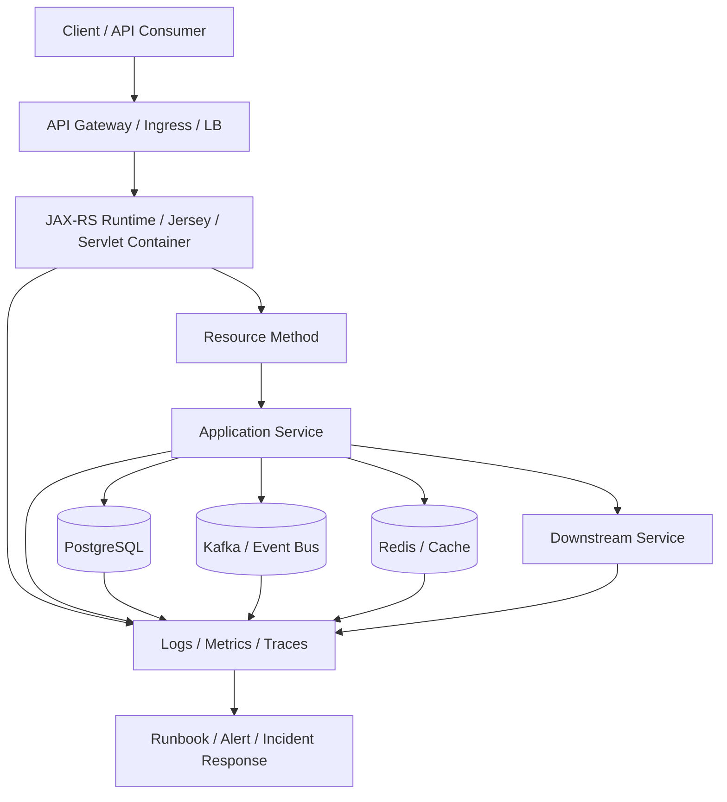

# Part 111 — Production Readiness, ORR, Observability, Failure, Threat, and Performance Reviews

> Fokus part ini: membangun cara berpikir senior/principal engineer ketika menilai apakah Java/JAX-RS enterprise service siap masuk production, siap dioperasikan, siap gagal secara terkendali, siap diamati, siap diamankan, dan siap diskalakan.

Catatan penting:

```text
This part does not assume CSG's internal production readiness template,
operational readiness process, observability stack, SLO/SLA definitions,
security review process, threat model format, performance benchmark standard,
or release approval workflow.

All internal governance details must be verified in the actual team/platform context.
```

Core idea:

```text
Production readiness is not a final checklist before go-live.
It is evidence that the service can survive real traffic, real failures,
real dependency issues, real operators, real audits, and real future changes.
```

A senior engineer should not ask only:

```text
Does it work?
```

A senior engineer asks:

```text
Can we prove it works under expected load?
Can we detect when it stops working?
Can we degrade safely?
Can we roll back safely?
Can we explain customer impact?
Can we isolate tenant impact?
Can we preserve compatibility?
Can we recover data and event consistency?
Can another engineer operate this at 03:00?
```

---

## 1. Production Readiness Mental Model

A production-ready service has five major capabilities:

```text
1. Correctness
   It produces the right result for normal, boundary, and failure cases.

2. Compatibility
   It does not unexpectedly break API consumers, event consumers, database readers,
   automation, reports, or operational tools.

3. Operability
   Engineers can observe, debug, mitigate, and recover it in production.

4. Resilience
   It can absorb common dependency, load, data, and platform failures.

5. Governance
   It satisfies security, compliance, release, ownership, and support expectations.
```

Production readiness is not only application code. It includes:

- API contract
- event contract
- database schema
- migration path
- configuration
- secrets
- feature flags
- rollout strategy
- Kubernetes manifests
- cloud networking
- observability
- alerts
- runbooks
- dashboards
- security posture
- on-call process
- support process

For a JAX-RS service, production readiness starts at the resource method but does not end there.



Readiness means every important edge in this diagram has known behavior, known failure modes, known telemetry, and known operational action.

---

## 2. Production Readiness vs Operational Readiness

They overlap, but they are not identical.

```text
Production readiness:
Can this change safely serve real users and real traffic?

Operational readiness:
Can the team operate this safely after deployment?
```

Production readiness covers:

- correctness
- compatibility
- security
- performance
- scale
- migration safety
- deployment safety
- rollout strategy
- rollback/roll-forward
- data safety
- tenant isolation
- dependency behavior

Operational readiness covers:

- alerts
- dashboards
- runbooks
- on-call ownership
- escalation
- incident triage
- logs/traces/metrics
- customer impact detection
- mitigation playbooks
- maintenance tasks
- backup/restore/replay/reconciliation

A feature can pass functional testing and still fail operational readiness.

Example:

```text
The endpoint returns correct JSON in integration tests,
but it has no latency metric, no error alert, no correlation ID,
no runbook, no timeout to downstream pricing service,
and no rollback plan for the schema change.

That is not production-ready.
```

---

## 3. Readiness Review Scope for JAX-RS Enterprise Service

A useful review should cover at least these layers:

| Layer | Review question |
|---|---|
| HTTP/API | Is the endpoint compatible, explicit, secure, and governed? |
| Runtime | Does JAX-RS/Jersey/container lifecycle behave predictably? |
| DI/config | Are dependencies, scopes, config, and secrets safe? |
| Data | Are transactions, locks, indexes, migrations, and precision safe? |
| Events | Are event contracts, ordering, duplicates, replay, and DLQ handled? |
| Resilience | Are timeout, retry, backpressure, circuit breaker, and fallback controlled? |
| Observability | Can we see request, dependency, tenant, latency, errors, and saturation? |
| Security | Are identity, authorization, secrets, PII, audit, and supply chain controlled? |
| Kubernetes/cloud | Are deployment, probes, resources, networking, identity, and storage correct? |
| Operations | Are alerts, dashboards, runbooks, rollback, and incident process ready? |

The review should produce decisions, not vague opinions.

Bad review output:

```text
Looks okay.
```

Good review output:

```text
Approved with conditions:
- add p95/p99 latency dashboard for POST /quotes/{id}/submit
- add alert for 5xx rate > 2% for 10 minutes
- prove migration is expand-contract safe with old and new app versions
- add replay procedure for QuoteSubmitted event
- document kill switch and rollback owner
```

---

## 4. Operational Readiness Review, ORR

An ORR is a structured review that answers:

```text
Can this system be operated safely by the team after release?
```

A practical ORR covers:

1. ownership
2. architecture context
3. service dependencies
4. customer impact model
5. SLO/SLA
6. dashboards
7. alerts
8. runbooks
9. deployment and rollback
10. data migration
11. event replay/reconciliation
12. security/audit
13. support escalation
14. known risks
15. open action items

### ORR artifact structure

```md
# Operational Readiness Review — <service/change>

## Scope
What is being launched or changed?

## Ownership
Who owns service, API, data, events, alerts, and support?

## Customer impact
Which users, tenants, APIs, workflows, or downstream systems are affected?

## Dependencies
What services, databases, queues, caches, cloud services, gateways, and jobs are involved?

## SLO/SLA
What reliability/latency/availability target applies?

## Observability
Which dashboards, metrics, logs, traces, and audit events exist?

## Alerts
Which symptoms page humans? Which only create tickets?

## Runbooks
How to triage, mitigate, rollback, replay, reconcile, or disable?

## Rollout strategy
Canary, blue-green, progressive delivery, feature flag, kill switch.

## Rollback/roll-forward
What is reversible? What is not? Who decides?

## Security and compliance
Identity, authorization, PII, audit, retention, secrets.

## Risks and mitigations
Known failure modes and controls.

## Approval
Required sign-offs and unresolved action items.
```

---

## 5. Production Readiness Checklist

Use this checklist as a starting point. Internal CSG standards may be stricter.

### 5.1 API readiness

Check:

- endpoint path is stable and meaningful
- HTTP method matches operation semantics
- safe/idempotent behavior is documented
- status code strategy is consistent
- error response shape is stable
- request DTO validation exists
- response DTO is backward-compatible
- pagination/filtering/sorting are bounded
- payload size limits are enforced
- CORS/cache/compression behavior is known if relevant
- OpenAPI is updated
- API linting passes
- generated client/server impact is understood
- deprecation policy is followed

Review questions:

```text
What breaks if a consumer retries this request?
What breaks if an old client sends the previous payload shape?
What breaks if a proxy caches this response?
What breaks if a tenant sends a large query/filter?
```

### 5.2 Runtime readiness

Check:

- actual runtime is verified: Jersey/Servlet/GlassFish/Grizzly/Tomcat/Jetty/etc.
- resource registration is explicit or scanning is understood
- filters/providers/interceptors are ordered correctly
- exception mapper precedence is known
- DI scope is correct
- startup failures fail fast
- shutdown is graceful
- thread pools are bounded
- request context propagation is tested

Review questions:

```text
Can we explain exactly how an HTTP request reaches this method?
Can we explain what happens before and after the resource method?
Can we explain which thread executes the work?
Can we explain what happens during shutdown while requests are in-flight?
```

### 5.3 Data readiness

Check:

- transaction boundary is explicit
- isolation level is understood
- connection pool sizing is justified
- locking behavior is safe
- deadlock handling exists where relevant
- indexes support expected queries
- migrations are backward-compatible
- expand-contract strategy is used when needed
- rollback or roll-forward is documented
- data migration is idempotent
- reconciliation is possible
- precision/currency/timezone rules are explicit

Review questions:

```text
Can old app version run against new schema?
Can new app version run against old schema during rollout?
What happens if migration succeeds but deployment fails?
What happens if event publish fails after database commit?
```

### 5.4 Event readiness

Check:

- topic/event naming follows convention
- event owner is known
- schema is registered and compatible
- event versioning is clear
- producer compatibility is checked
- consumer compatibility is checked
- duplicate policy exists
- ordering policy exists
- DLQ/retry policy exists
- replay contract exists
- inbox/outbox pattern is used where needed
- reconciliation job exists for eventual consistency gaps

Review questions:

```text
Can a consumer ignore new fields?
Can a producer emit both old and new event shape during migration?
Can we replay safely?
Can we detect stuck DLQ or poisoned messages?
Can we recover a missed event without manual database surgery?
```

### 5.5 Resilience readiness

Check:

- inbound timeout is known
- outbound timeout is known
- retry is bounded
- retry budget is defined
- circuit breaker behavior is documented
- bulkheads isolate dependency failures
- rate limit exists where needed
- backpressure exists for queues/streams/thread pools
- load shedding behavior is safe
- fallback does not hide data correctness failures
- hedged request is used only when justified
- retry storm/thundering herd is considered

Review questions:

```text
What happens when downstream is slow, not down?
What happens when PostgreSQL pool is exhausted?
What happens when Kafka publish is slow?
What happens when Redis is unavailable?
What prevents one tenant from exhausting shared capacity?
```

### 5.6 Observability readiness

Check:

- structured logs exist
- correlation ID propagates
- trace ID/span ID propagates
- causation ID exists for async/event flows
- MDC is cleared after request
- OpenTelemetry instrumentation is active if platform standard
- metrics include request rate, error rate, duration, saturation
- dependency metrics exist for DB/Kafka/Redis/HTTP/cloud SDK
- dashboards answer operational questions
- alert thresholds are actionable
- high-cardinality labels are controlled
- sampling strategy is known

Review questions:

```text
Can we find all logs for one customer-impacting operation?
Can we connect HTTP request to Kafka event and async worker?
Can we distinguish service failure from dependency failure?
Can we detect saturation before total outage?
```

### 5.7 Security readiness

Check:

- authentication is enforced
- authorization is enforced at correct boundary
- service-to-service auth is verified
- token issuer/audience/expiry/skew are checked
- mTLS is verified if required
- secrets are not in repo/image/logs
- secret rotation is possible
- PII is classified and redacted
- audit trail exists for sensitive actions
- retention policy is followed
- dependency scanning passes
- container scanning passes
- SBOM/provenance/signing requirements are met if internal standard

Review questions:

```text
What prevents tenant A from reading tenant B data?
What prevents an internal service from calling an endpoint it should not call?
What happens when signing keys rotate?
What sensitive data appears in logs, traces, metrics, and audit events?
```

### 5.8 Kubernetes/cloud readiness

Check:

- requests/limits are set
- JVM sizing matches container limits
- readiness/liveness/startup probes are correct
- termination grace period is enough
- rollout strategy is safe
- pod identity is configured
- secrets/config are mounted safely
- ingress/service routing is correct
- TLS termination is understood
- network policy/firewall is known
- private endpoints resolve correctly
- storage class/PVC behavior is understood
- node pool constraints are known
- platform monitoring receives signals

Review questions:

```text
Can a pod be killed without losing data or corrupting state?
Can the service start under cold cache/cold JVM conditions?
Can we explain the path from API gateway to pod?
Can the pod access only the cloud resources it needs?
```

---

## 6. Observability Review

An observability review asks:

```text
Can we answer production questions using evidence from the system?
```

Not all telemetry is equal. Useful telemetry is tied to decisions.

Bad metric:

```text
service.requests.total
```

Better metric:

```text
http.server.duration
labels: route, method, status_class, tenant_tier, outcome
```

Bad log:

```text
Error happened
```

Better log:

```json
{
  "level": "ERROR",
  "event": "quote_submit_failed",
  "quoteId": "q-123",
  "tenantIdHash": "...",
  "correlationId": "...",
  "causationId": "...",
  "errorCode": "QUOTE_PRICE_EXPIRED",
  "retryable": false
}
```

### 6.1 Observability review dimensions

| Dimension | What to verify |
|---|---|
| Logs | Structured, searchable, redacted, correlated |
| Metrics | RED/USE signals, dependency latency, saturation |
| Traces | Inbound, outbound, DB, Kafka, async propagation |
| Audit | Sensitive business/security actions are recorded |
| Dashboards | Answer triage questions, not vanity charts |
| Alerts | Actionable, owned, severity-aligned |
| Runbooks | Linked from alerts and kept current |

### 6.2 Required telemetry by layer

```text
HTTP server:
- request count
- error count
- latency histogram
- payload size where safe
- route/method/status

JAX-RS runtime:
- exception mapper output
- validation failures
- auth failures
- provider/filter failures

PostgreSQL:
- pool active/idle/pending
- query latency
- slow query count
- lock wait
- deadlock count
- transaction failure

Kafka:
- producer send latency
- producer error
- consumer lag
- processing latency
- retry/DLQ count
- rebalance count

Redis:
- operation latency
- timeout count
- cache hit/miss
- lock acquisition failure
- stale/duplicate guard result

Outbound HTTP/cloud SDK:
- request count
- latency
- timeout
- retry
- circuit breaker state
- downstream status class
```

### 6.3 Observability failure modes

Common failures:

- logs exist but cannot be correlated
- traces stop at executor boundary
- Kafka event loses causation ID
- metrics use high-cardinality labels
- dashboard shows averages only
- alert pages on symptoms nobody can act on
- audit logs leak PII
- sampling hides rare critical failures
- errors are logged at multiple layers causing noise
- exception mapper returns generic error without diagnostic code

Senior review question:

```text
What exact query would you run during incident triage?
```

If nobody can answer, observability is not ready.

---

## 7. Failure Modelling Review

Failure modelling is a structured way to ask:

```text
How can this system fail, and what happens next?
```

A good failure model covers:

- trigger
- blast radius
- user impact
- detection
- mitigation
- recovery
- prevention
- residual risk

### 7.1 Failure model template

```md
## Failure mode
<short name>

## Trigger
What causes it?

## Immediate effect
What fails first?

## Propagation
What breaks next?

## Blast radius
One request, one tenant, one service, one region, all customers?

## Detection
Metric/log/trace/alert/query.

## Mitigation
Rollback, kill switch, load shedding, replay, reconcile, scale, disable feature.

## Recovery
How to restore correct state?

## Prevention
Code/config/test/platform control.

## Residual risk
What remains acceptable?
```

### 7.2 Example: downstream pricing service slow

```text
Trigger:
Pricing service p99 latency grows from 200 ms to 8 s.

Immediate effect:
Quote calculation endpoint threads block waiting for outbound HTTP.

Propagation:
JAX-RS request threads saturate.
Connection pool to pricing service saturates.
Retries increase load.
Other endpoints using same executor slow down.

Blast radius:
Could affect all tenants if shared thread pool and no bulkhead.

Detection:
Outbound HTTP latency metric, circuit breaker state, request queue depth,
JAX-RS endpoint p95/p99 latency, thread pool saturation.

Mitigation:
Shorten timeout, open circuit breaker, disable pricing-refresh flag,
serve stale read-only quote price if business allows, shed non-critical calls.

Recovery:
Re-enable gradually after pricing service healthy.
Reconcile quotes affected by fallback/stale calculation.

Prevention:
Timeout, bulkhead, retry budget, fallback policy, dependency SLO, load test.
```

### 7.3 Failure classes to review

For JAX-RS enterprise backend, review at least:

- API consumer sends duplicate command
- API gateway retries mutation
- downstream HTTP service is slow
- PostgreSQL connection pool exhausted
- PostgreSQL deadlock or lock wait
- Kafka broker unavailable
- Kafka consumer lag grows
- Kafka event duplicated
- Redis unavailable or stale
- feature flag misconfigured
- tenant config missing
- secret rotation breaks auth
- migration partially applied
- pod OOMKilled
- Kubernetes readiness probe wrong
- DNS private endpoint fails
- certificate expires
- observability pipeline unavailable
- audit trail missing
- rollback incompatible with schema

---

## 8. Threat Modelling Review

Threat modelling asks:

```text
How can this system be abused, bypassed, leaked, or tampered with?
```

It is not only for security specialists. Senior backend engineers must be able to reason about security-critical flows.

### 8.1 Threat modelling scope

For JAX-RS service, include:

- public/internal endpoint exposure
- authentication
- authorization
- tenant isolation
- input validation
- object-level access control
- service-to-service identity
- secrets
- logs/traces/metrics
- audit trail
- data retention
- file upload/download
- webhook/callback if any
- event publication/consumption
- admin endpoints
- feature flags/kill switches
- CI/CD and artifact supply chain

### 8.2 Practical threat questions

Ask:

```text
Can a user call this endpoint without auth?
Can a valid user access another tenant's data?
Can a service token intended for service A call service B?
Can stale JWT signing keys allow invalid tokens?
Can clock skew reject valid tokens or accept expired tokens?
Can file upload poison storage or exhaust memory?
Can logs leak PII, secrets, or authorization tokens?
Can replayed event mutate state twice?
Can generated clients accidentally expose deprecated fields?
Can CI pull an untrusted dependency or base image?
```

### 8.3 STRIDE-style mapping

| Threat type | Backend example |
|---|---|
| Spoofing | forged token, wrong audience, weak service identity |
| Tampering | modified request body, unsigned webhook, altered event payload |
| Repudiation | missing audit trail for sensitive quote/order action |
| Information disclosure | cross-tenant leak, PII in logs, overbroad response DTO |
| Denial of service | unbounded pagination, file upload, retry storm, expensive filter |
| Elevation of privilege | role bypass, object-level auth gap, admin endpoint exposure |

Threat modelling should produce engineering tasks, not only risk statements.

Example:

```text
Risk:
Tenant ID is accepted from query parameter and passed to repository.

Engineering control:
Resolve tenant from authenticated identity or trusted gateway header.
Reject explicit tenant override unless endpoint is admin-only.
Add object-level authorization tests.
Add audit event for tenant-scoped access.
```

---

## 9. Performance and Scalability Review

Performance review asks:

```text
Can the system meet latency and throughput targets under realistic conditions?
```

Scalability review asks:

```text
What happens as traffic, tenants, data, events, jobs, or dependencies grow?
```

### 9.1 Performance dimensions

| Dimension | Question |
|---|---|
| Latency | What are p50, p95, p99 under expected and peak load? |
| Throughput | How many requests/events/jobs per second can it sustain? |
| Saturation | Which resource saturates first: CPU, memory, threads, DB pool, Kafka, Redis? |
| Tail behavior | What causes p99 spikes? |
| Cold start | How long until pod becomes truly ready? |
| Warmup | Does JIT/cache/pool warmup affect initial traffic? |
| Payload | What happens with large request/response body? |
| Dependency | Which dependency dominates latency? |
| Tenant | Can one tenant degrade others? |

### 9.2 Scalability dimensions

Review:

- horizontal scaling of stateless pods
- sticky session risk
- DB connection pool multiplication across pods
- Kafka consumer group scaling vs partition count
- Redis connection and hot key risk
- cache invalidation scale
- query index selectivity as data grows
- pagination strategy at large offsets
- event replay duration
- batch job runtime growth
- Kubernetes HPA signal quality
- cloud quota limits
- API gateway limits

### 9.3 Example capacity reasoning

```text
Assume:
- 20 pods
- each pod has DB pool size 30
- PostgreSQL max connections 600

Total possible app DB connections = 20 * 30 = 600

Problem:
This leaves no room for migrations, admin sessions, monitoring, or other services.

Senior review:
Either reduce pool size, use PgBouncer if appropriate, increase DB capacity,
separate workloads, or define scaling guardrail.
```

### 9.4 Performance anti-patterns

Watch for:

- unbounded list endpoint
- expensive filtering without index
- dynamic SQL that disables index usage
- N+1 query hidden behind mapper/service layer
- synchronous event publication inside request path without timeout
- large JSON serialization on request thread
- full object graph returned to API
- `BigDecimal` or date/time conversion repeated in hot loop
- cache stampede
- retry storm
- connection pool too large per pod
- readiness probe marks pod ready before warmup
- p99 ignored because average looks good

---

## 10. API Compatibility Review

API compatibility is not only about URI version.

A change may be breaking if it:

- removes field
- renames field
- changes field type
- changes enum values unexpectedly
- changes nullability
- changes default value
- changes error code
- changes status code
- changes pagination shape
- changes sorting behavior
- changes validation strictness
- changes authentication/authorization requirement
- changes idempotency semantics
- changes timeout behavior
- changes deprecation headers

Compatibility review should include:

```text
OpenAPI diff
Consumer inventory
Generated client impact
Backward-compatible DTO evolution
Error contract evolution
Deprecation window
Runtime compatibility during rollout
Rollback compatibility
```

Senior test:

```text
Can old clients and new clients both work during deployment and rollback?
```

---

## 11. Event Compatibility Review

Event compatibility requires producer and consumer reasoning.

Check:

- schema registry compatibility mode
- event owner
- consumer list
- optional vs required fields
- default value
- enum evolution
- versioning policy
- deprecation policy
- replay contract
- duplicate policy
- ordering policy
- DLQ impact
- generated class impact
- old producer/new consumer compatibility
- new producer/old consumer compatibility

Risk example:

```text
A producer starts emitting new enum value: QUOTE_REPRICED_BY_POLICY.
Old consumers deserialize successfully but treat unknown value as fatal.
Consumer group stops.
DLQ grows.
Order workflow stalls.
```

Mitigation:

```text
- document enum compatibility rule
- require unknown value handling
- add contract test
- introduce value behind feature flag
- notify consumers
- monitor DLQ and consumer lag
```

---

## 12. Database Migration Review

Production migration review should ask:

```text
Can this schema/data change be deployed safely with old and new application versions?
```

Review migration for:

- expand-contract sequence
- backward-compatible reads
- backward-compatible writes
- nullable/default field strategy
- index creation lock impact
- long-running migration
- data backfill idempotency
- trigger/function/procedure compatibility
- rollback/roll-forward strategy
- migration lock contention
- backup/restore expectation
- read replica/reporting impact

### 12.1 Expand-contract example

```text
Step 1: Expand
Add nullable column new_status.
Deploy app that writes both old_status and new_status.
Backfill new_status.

Step 2: Switch
Deploy app that reads new_status but can fallback to old_status.

Step 3: Contract
After all versions and consumers are migrated, remove old_status.
```

Bad migration:

```sql
ALTER TABLE quote ALTER COLUMN status TYPE integer;
```

Risk:

```text
Old app expects string.
New app expects integer.
Rollback becomes unsafe.
Consumers break during partial deployment.
```

---

## 13. Kubernetes Deployment Review

Review Kubernetes manifests as production code.

Check:

- image tag immutable
- resource requests/limits
- JVM container sizing
- readiness/liveness/startup probes
- graceful shutdown
- termination grace period
- preStop behavior if used
- rolling update max unavailable/surge
- PodDisruptionBudget
- HPA/VPA behavior
- config/secret source
- service account
- RBAC
- ingress/service routing
- network policy
- volume/storage requirements
- node affinity/toleration if used
- topology spread
- observability annotations/sidecars/agents

Review questions:

```text
What happens when node drains?
What happens when config changes?
What happens when pod starts slowly due to JVM warmup?
What happens if liveness probe kills a slow but recoverable pod?
What happens if readiness probe passes before dependencies are usable?
```

---

## 14. Readiness Decision Matrix

Use this to make review outcomes explicit.

| Status | Meaning | Example |
|---|---|---|
| Approved | Evidence sufficient; risks acceptable | All required checks pass |
| Approved with conditions | Can proceed after specific small fixes | Add dashboard/alert before rollout |
| Limited rollout only | Safe only behind flag/canary | Unknown p99 under full load |
| Blocked | Risk unacceptable | Migration not rollback-compatible |
| Needs design review | Change affects architecture boundary | New event contract or tenant model |
| Needs security review | Sensitive auth/data path affected | New admin endpoint or PII export |
| Needs platform review | Deployment/network/cloud behavior affected | New private endpoint or ingress |

Avoid vague decision language.

Bad:

```text
Probably fine.
```

Good:

```text
Limited rollout only. Canary to one internal tenant for 24h.
Block full rollout until p99 latency dashboard and rollback playbook exist.
```

---

## 15. Senior-Level Review Heuristics

### 15.1 Evidence over confidence

Confidence is not a control.

Bad:

```text
I think it should work.
```

Good:

```text
Integration test proves old and new schema compatibility.
Load test shows p99 under target at 2x expected traffic.
Dashboard exists for error rate and DB pool saturation.
Rollback tested in staging.
```

### 15.2 Failure path over happy path

Happy path correctness is necessary but insufficient.

Ask:

```text
What fails if dependency returns timeout?
What fails if duplicate command arrives?
What fails if event is replayed?
What fails if feature flag config is missing?
What fails if pod is killed mid-request?
```

### 15.3 Runtime truth over diagram truth

Architecture diagrams can be stale.

Verify:

- actual dependency tree
- actual runtime container
- actual Kubernetes manifest
- actual gateway route
- actual config source
- actual secret source
- actual dashboard/alert
- actual DB schema
- actual event topic/schema

### 15.4 Compatibility over elegance

In enterprise systems, elegant breaking changes are still breaking changes.

Prefer:

- additive API evolution
- expand-contract database migration
- tolerant event consumers
- explicit deprecation
- generated client compatibility check
- old/new version coexistence

### 15.5 Operability over cleverness

A clever design that cannot be debugged is a production liability.

Ask:

```text
Can the on-call engineer understand this at 03:00?
Can logs/traces prove what happened?
Can we mitigate without code change?
Can we recover without manual risky surgery?
```

---

## 16. Internal Verification Checklist

Use this checklist inside actual CSG context.

### Production governance

- [ ] Is there an official production readiness checklist?
- [ ] Is there an official ORR process?
- [ ] Who approves production readiness?
- [ ] Is approval required per service, feature, API, or release?
- [ ] Are there regulated/compliance-specific gates?

### Observability

- [ ] What logging platform is used?
- [ ] What metrics platform is used?
- [ ] What tracing/OpenTelemetry platform is used?
- [ ] Are dashboards service-owned or platform-owned?
- [ ] Are alert thresholds standardized?
- [ ] Are high-cardinality labels restricted?
- [ ] Are tenant/customer identifiers allowed in telemetry?

### SLO/SLA

- [ ] Are SLOs defined for Quote & Order services?
- [ ] Are SLOs endpoint-specific or service-level?
- [ ] Is there an error budget policy?
- [ ] Are customer-facing SLAs mapped to internal SLOs?
- [ ] Who owns SLO breach review?

### Release and rollback

- [ ] Is deployment canary, blue-green, rolling, or another model?
- [ ] Are feature flags required for risky changes?
- [ ] Is rollback tested?
- [ ] Are database migrations rollback-compatible?
- [ ] Is roll-forward preferred over rollback for some changes?

### Security and compliance

- [ ] Is there an internal threat model template?
- [ ] Is security review required for new endpoints?
- [ ] Are PII fields classified?
- [ ] Is audit logging required for quote/order state changes?
- [ ] Are SBOM/SCA/image scans mandatory?

### Data and event recovery

- [ ] Is outbox/inbox used internally?
- [ ] Is event replay allowed in production?
- [ ] Who can trigger replay?
- [ ] Are reconciliation jobs available?
- [ ] How are duplicate events detected?
- [ ] How are DLQ messages handled?

### Platform

- [ ] Which Kubernetes platform is used: EKS, AKS, on-prem, hybrid?
- [ ] Which ingress/controller/gateway is used?
- [ ] Which identity model is used for pods?
- [ ] Which secret/config model is used?
- [ ] Which cloud networking/private endpoint model is used?

---

## 17. PR Review Checklist

When reviewing a production readiness change, check:

- [ ] Is the customer/business impact clear?
- [ ] Is the operational owner clear?
- [ ] Is the API/event/database compatibility story explicit?
- [ ] Are failure modes documented?
- [ ] Are timeouts/retries/backpressure bounded?
- [ ] Are logs/metrics/traces/audit events sufficient?
- [ ] Are alerts actionable?
- [ ] Are runbooks linked?
- [ ] Is rollback/roll-forward defined?
- [ ] Are migrations expand-contract safe?
- [ ] Are secrets/config/feature flags safe?
- [ ] Are tenant boundaries protected?
- [ ] Are security controls verified?
- [ ] Are Kubernetes resources/probes/shutdown correct?
- [ ] Are test results attached?
- [ ] Are unresolved risks explicitly accepted?

A senior review comment should be precise:

```text
Blocking: this migration drops column quote_status in the same release that changes app reads.
During rolling deployment, old pods may still read quote_status.
Please split into expand-contract sequence and prove old/new app compatibility.
```

---

## 18. Common Anti-Patterns

### Anti-pattern: readiness by checklist theater

Symptoms:

- many boxes checked
- no evidence linked
- dashboards not useful
- runbook says “check logs” only
- failure modes copied generically

Fix:

```text
Require evidence: test result, dashboard link, runbook step, config diff,
query, alert definition, rollback command, or architecture decision.
```

### Anti-pattern: observability after launch

Symptoms:

- code ships first
- dashboards created after incident
- alerts added after customer complaint

Fix:

```text
Telemetry is part of implementation acceptance criteria.
```

### Anti-pattern: rollback assumed but not tested

Symptoms:

- database schema changed irreversibly
- event schema changed incompatibly
- generated clients incompatible
- feature flag cannot disable data migration

Fix:

```text
Prefer expand-contract and roll-forward plan.
Test rollback path before production.
```

### Anti-pattern: one review for all risk types

Symptoms:

- security risk hidden in general PR
- platform change hidden in app code PR
- event contract change hidden in mapper update

Fix:

```text
Route changes to the right review path: API, security, data, event, platform, operations.
```

### Anti-pattern: no owner for residual risk

Symptoms:

- known risk documented but nobody owns mitigation
- action items never close
- same incident recurs

Fix:

```text
Every accepted risk needs owner, expiry/review date, and mitigation trigger.
```

---

## 19. Production Readiness Summary

Production readiness is not a yes/no checkbox. It is a body of evidence.

A production-ready Java/JAX-RS enterprise service should be:

```text
Correct enough to serve real workflows.
Compatible enough to survive rolling deployment and old consumers.
Observable enough to explain failures.
Resilient enough to degrade under dependency stress.
Secure enough to protect identity, tenant data, secrets, and audit trails.
Operable enough for another engineer to triage and recover.
Governed enough to evolve safely over time.
```

The most important senior habit:

```text
Do not approve based only on implementation quality.
Approve based on runtime behavior, failure behavior, evidence, and operability.
```

---

## 20. Practical Exercises

1. Pick one existing JAX-RS endpoint. Build a production readiness mini-review:
   - API contract
   - validation
   - error model
   - telemetry
   - dependency timeout
   - DB/event side effects
   - rollback risk

2. Pick one database migration. Classify it:
   - additive
   - backward-compatible
   - breaking
   - expand-contract ready
   - rollback-safe or roll-forward only

3. Pick one Kafka event. Document:
   - producer
   - consumers
   - schema compatibility
   - duplicate policy
   - ordering policy
   - replay contract

4. Pick one alert. Check:
   - what it detects
   - who receives it
   - what runbook is linked
   - what customer impact it implies
   - what mitigation step exists

5. Pick one service dependency. Model failure:
   - slow
   - unavailable
   - returns invalid data
   - partial timeout
   - rate limited
   - stale cache
