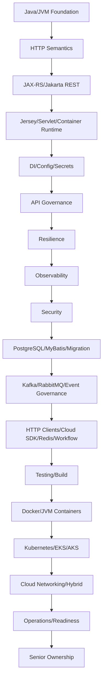

# Part 112 — Senior PR Review, ADR, Technical Design, Ownership, and 30/60/90 Plan

> Fokus part ini: menutup seluruh seri dengan playbook praktis untuk beroperasi sebagai Senior Java Software Engineer di enterprise JAX-RS backend: cara mereview PR, menulis/menilai ADR, menyusun technical design, mengambil ownership, mentoring, dan membangun kontribusi 30/60/90 hari.

Catatan penting:

```text
This final part does not assume CSG's internal PR review process,
architecture governance, ADR template, technical design template,
team topology, Scrum implementation, ownership model, promotion criteria,
or onboarding expectations.

All internal standards must be verified inside the team.
```

Core idea:

```text
Senior engineering is not only solving hard tickets.
Senior engineering is reducing system risk, improving decision quality,
raising team standards, and making production behavior more predictable.
```

A senior engineer adds leverage by improving:

- correctness
- review quality
- operational safety
- architecture clarity
- migration safety
- API/event compatibility
- security posture
- debugging speed
- team learning
- documentation of decisions
- ownership continuity

---

## 1. The Senior Engineer Operating Model

A senior engineer operates at multiple layers at the same time.

```text
Code layer:
Does this implementation work?

Design layer:
Is this the right shape of solution?

Runtime layer:
How will this behave under real traffic and failure?

Operations layer:
Can the team detect, mitigate, and recover?

Governance layer:
Does this preserve compatibility, security, and ownership?

People/process layer:
Will this make future work easier and safer?
```

A mid-level review often catches local bugs.

A senior review catches systemic risk.

Example:

```text
Local bug:
Null pointer when request field is missing.

Systemic risk:
Endpoint accepts duplicate mutation without idempotency key,
uses retrying API gateway, writes DB before event publish,
and has no reconciliation path if event publish fails.
```

---

## 2. Senior PR Review Philosophy

PR review is not a style contest. It is risk management.

Senior review should answer:

```text
What can this change break?
Can we detect it?
Can we roll it back?
Can old and new versions coexist?
Can another engineer maintain it?
Is the risk proportional to the evidence?
```

A good review comment is:

- specific
- grounded in failure mode
- actionable
- proportional
- respectful
- tied to production or maintainability impact

Bad comment:

```text
I don't like this structure.
```

Better comment:

```text
This resource method now owns validation, authorization, transaction control,
and event publishing. That makes failure behavior hard to test and review.
Please split request validation, domain command handling, and event publication
so we can test duplicate command and publish failure independently.
```

---

## 3. PR Review Risk Map

When reviewing any change, classify the risk domain first.

| Change type | Primary risk |
|---|---|
| JAX-RS resource method | API compatibility, validation, security, latency |
| ExceptionMapper | Error contract, observability, client behavior |
| Filter/interceptor | auth, context propagation, logging, performance |
| DTO change | API compatibility, generated client impact |
| Mapper change | data loss, wrong transformation, null semantics |
| SQL/MyBatis change | query performance, lock, correctness, SQL injection |
| Migration | compatibility, rollback, downtime, data loss |
| Kafka producer | event compatibility, duplicates, ordering |
| Kafka consumer | idempotency, retry, DLQ, lag, replay safety |
| Redis cache | staleness, stampede, tenant leak |
| Redis lock | stale lock, split brain, duplicate processing |
| Config change | environment drift, unsafe defaults, tenant impact |
| Secret change | rotation failure, auth outage, leak |
| Kubernetes manifest | rollout, resource saturation, probes, identity |
| Cloud networking | DNS/TLS/private endpoint failure |
| Feature flag | wrong default, stale flag, inconsistent behavior |
| Security change | auth bypass, privilege escalation, PII leak |

Senior habit:

```text
Do not review every PR with the same lens.
Identify the risk class, then apply the right checklist.
```

---

## 4. JAX-RS Endpoint PR Review Checklist

Use this when reviewing resource/controller-level changes.

### API shape

- [ ] Is the URI resource-oriented and stable?
- [ ] Is the HTTP method semantically correct?
- [ ] Is safe/idempotent behavior explicit?
- [ ] Are status codes consistent with API strategy?
- [ ] Are headers correct and intentional?
- [ ] Are pagination/filtering/sorting bounded if applicable?
- [ ] Is partial response behavior documented if supported?
- [ ] Is request/response media type explicit?
- [ ] Is OpenAPI updated?

### Request handling

- [ ] Are path/query/header/form params validated?
- [ ] Are defaults safe?
- [ ] Are unknown/extra fields handled intentionally?
- [ ] Are payload size limits enforced where relevant?
- [ ] Are file/stream inputs memory-safe?
- [ ] Are date/time/currency fields precise and timezone-safe?

### Response and error

- [ ] Is response shape backward-compatible?
- [ ] Are error codes stable and meaningful?
- [ ] Are domain errors distinct from technical errors?
- [ ] Is retryable/non-retryable behavior clear?
- [ ] Is sensitive data excluded from error body?

### Security

- [ ] Is authentication required?
- [ ] Is authorization checked at object/resource level?
- [ ] Is tenant isolation enforced?
- [ ] Are audit events emitted for sensitive action?
- [ ] Are logs redacted?

### Resilience and operations

- [ ] Are timeouts bounded?
- [ ] Are retries safe and bounded?
- [ ] Is duplicate command handling defined?
- [ ] Are DB/event side effects atomic or recoverable?
- [ ] Are logs/metrics/traces sufficient?
- [ ] Is correlation/causation propagated?
- [ ] Is rollback/kill switch possible?

---

## 5. Database and Migration PR Review Checklist

Review database changes as production-risk changes.

### SQL/query

- [ ] Does query use indexes effectively?
- [ ] Is dynamic SQL safe from injection?
- [ ] Is pagination scalable?
- [ ] Does sorting align with index/order requirement?
- [ ] Are locks understood?
- [ ] Is transaction boundary clear?
- [ ] Is isolation level appropriate?
- [ ] Are timeout and deadlock errors handled?

### Migration

- [ ] Is migration backward-compatible?
- [ ] Is expand-contract needed?
- [ ] Can old and new app versions coexist?
- [ ] Is rollback possible or roll-forward documented?
- [ ] Is backfill idempotent?
- [ ] Does index creation block writes?
- [ ] Does migration affect large tables?
- [ ] Are triggers/functions/procedures versioned safely?
- [ ] Is data precision preserved?

Blocking review example:

```text
Blocking: this migration renames column price_amount to amount in one step.
During rolling deployment, old pods still read price_amount.
Please split into additive column, dual write/backfill, read switch, then contract.
```

---

## 6. Event and Messaging PR Review Checklist

### Producer changes

- [ ] Is event owner clear?
- [ ] Is topic/event name standard?
- [ ] Is schema registered?
- [ ] Is compatibility mode satisfied?
- [ ] Are required fields stable?
- [ ] Are new fields additive and optional/defaulted?
- [ ] Are event keys chosen for ordering?
- [ ] Is publish failure recoverable?
- [ ] Is outbox/CDC used where consistency matters?

### Consumer changes

- [ ] Is processing idempotent?
- [ ] Is duplicate event policy explicit?
- [ ] Is ordering assumption documented?
- [ ] Is retry bounded?
- [ ] Is DLQ behavior useful?
- [ ] Is poison message handling safe?
- [ ] Is replay safe?
- [ ] Is consumer lag observable?
- [ ] Are partial side effects recoverable?

Review comment example:

```text
This consumer writes order state before acknowledging Kafka offset,
but it does not appear idempotent. If the pod dies after DB commit and before commit offset,
the same event can be processed again. Please add inbox/dedupe key or prove the write is idempotent.
```

---

## 7. Kubernetes and Cloud PR Review Checklist

### Kubernetes manifest

- [ ] Image tag is immutable
- [ ] Resource requests/limits are set
- [ ] JVM sizing matches memory limit
- [ ] Readiness probe checks real readiness
- [ ] Liveness probe is not too aggressive
- [ ] Startup probe handles cold start/warmup
- [ ] Graceful shutdown is supported
- [ ] Termination grace period is enough
- [ ] HPA signal is meaningful
- [ ] Config/secret source is correct
- [ ] ServiceAccount/RBAC is least privilege
- [ ] Ingress/service routing is understood
- [ ] Network policy is correct
- [ ] Observability annotations/agent are present if required

### Cloud/platform

- [ ] Pod identity model is correct
- [ ] Private endpoint/DNS behavior is verified
- [ ] TLS certificate ownership/renewal is known
- [ ] Load balancer annotations are intentional
- [ ] Storage class/PVC behavior is safe
- [ ] External secret sync is reliable
- [ ] Cloud quota/limits are considered
- [ ] Monitoring/alerting integrates with platform standard

Review comment example:

```text
Blocking: readiness probe only checks /health/live and does not validate required config.
A pod with missing pricing config can enter rotation and return 500s.
Please add readiness check for mandatory config load or fail fast during startup.
```

---

## 8. Security PR Review Checklist

- [ ] Token issuer is validated
- [ ] Token audience is validated
- [ ] Token expiry and clock skew are handled
- [ ] Key rotation/JWK cache behavior is understood
- [ ] Service identity is verified
- [ ] mTLS is used if platform standard
- [ ] Authorization is object-level, not only route-level
- [ ] Tenant boundary cannot be user-controlled
- [ ] PII is not logged/traced/metric-labeled
- [ ] Audit trail exists for sensitive action
- [ ] Secret is not exposed in code/image/env/log
- [ ] Dependency/container scan is clean or risk accepted
- [ ] SBOM/provenance/signing requirements are satisfied

Review comment example:

```text
This endpoint checks role QUOTE_ADMIN but does not verify tenant access to quoteId.
A user with admin role in tenant A may access quoteId from tenant B if guessed.
Please add object-level tenant authorization and negative test.
```

---

## 9. Architecture Decision Record, ADR

An ADR captures a decision and why it was made.

It should not be a long essay. It should preserve decision context.

### ADR template

```md
# ADR-<number>: <decision title>

## Status
Proposed | Accepted | Deprecated | Superseded

## Context
What problem are we solving?
What constraints exist?
What is changing?

## Decision
What did we choose?

## Alternatives considered
What else did we consider?
Why not?

## Consequences
Positive, negative, and neutral consequences.

## Operational impact
How does this affect deployment, observability, incident response, support?

## Compatibility impact
API, event, database, client, migration, rollback.

## Security/compliance impact
Identity, authorization, data, audit, secrets, retention.

## Follow-up actions
Concrete tasks, owners, and deadlines.
```

### ADR should exist when

Create or request an ADR for:

- changing API versioning strategy
- adopting Jersey-specific feature deeply
- changing DI framework or scope model
- introducing new event contract governance
- adding a workflow engine
- introducing Redis lock/idempotency strategy
- changing database migration strategy
- choosing Kafka vs RabbitMQ vs Redis Streams
- introducing cloud-specific identity pattern
- changing deployment/rollout strategy
- introducing multi-tenancy boundary
- changing security model

### ADR anti-patterns

Bad ADR:

```text
We chose Kafka because Kafka is scalable.
```

Better ADR:

```text
We chose Kafka for QuoteSubmitted event propagation because consumers require replay,
partitioned ordering by quoteId, retention-based recovery, and multiple independent consumers.
RabbitMQ was rejected because replay/event log semantics are central to the requirement.
Redis Streams was rejected because event contract governance and long retention are platform requirements.
```

---

## 10. Technical Design Document, TDD

A TDD explains how a significant change will work.

An ADR says:

```text
What decision did we make and why?
```

A TDD says:

```text
How will we implement, deploy, operate, and evolve it?
```

### TDD template

```md
# Technical Design — <feature/system/change>

## Summary
Short explanation of the change.

## Goals
What must be achieved.

## Non-goals
What is intentionally out of scope.

## Current state
How the system works today.

## Proposed design
Architecture, components, API, data, events, config, runtime.

## API contract
Endpoint, method, request/response, errors, compatibility.

## Data model and migration
Tables, indexes, transactions, migration sequence, rollback/roll-forward.

## Event model
Topics, schemas, producers, consumers, compatibility, replay.

## Security model
AuthN, AuthZ, tenant isolation, PII, audit.

## Resilience model
Timeout, retry, circuit breaker, idempotency, backpressure, fallback.

## Observability model
Logs, metrics, traces, audit, dashboards, alerts.

## Deployment and rollout
Feature flags, canary, blue-green, migration ordering, rollback.

## Testing strategy
Unit, integration, contract, performance, migration, chaos/failure testing.

## Operational plan
Runbook, alert triage, support, reconciliation, incident scenarios.

## Risks and mitigations
Known risks and explicit controls.

## Alternatives considered
Rejected approaches and trade-offs.

## Open questions
Unresolved issues and owners.
```

A good TDD makes PRs smaller and reviews faster.

A poor TDD hides key risk until implementation.

---

## 11. Architecture Review: What Senior Engineers Should Challenge

Challenge assumptions, not people.

### 11.1 Challenge unclear ownership

Ask:

```text
Who owns this API after release?
Who owns the event contract?
Who owns the dashboard and alert?
Who owns reconciliation if data diverges?
Who owns deprecated fields?
```

### 11.2 Challenge hidden coupling

Ask:

```text
Does resource layer depend on persistence details?
Does API DTO leak database entity shape?
Does event schema mirror internal table structure?
Does tenant config leak into generic service logic?
Does runtime config depend on undocumented environment variables?
```

### 11.3 Challenge implicit failure behavior

Ask:

```text
What happens on duplicate request?
What happens on Kafka publish failure?
What happens on partial DB commit?
What happens on downstream timeout?
What happens on cache miss/stale value?
What happens when pod is killed mid-operation?
```

### 11.4 Challenge unbounded work

Ask:

```text
Is pagination bounded?
Is query cost bounded?
Is batch size bounded?
Is retry bounded?
Is queue size bounded?
Is thread pool bounded?
Is memory use bounded?
```

### 11.5 Challenge operational ambiguity

Ask:

```text
How do we know this is failing?
Where is the dashboard?
What alert fires?
What is the first mitigation?
What does support tell customers?
How do we recover corrupt or missing state?
```

---

## 12. Mentoring and Raising Team Standards

Senior ownership includes raising the team's default behavior.

Good mentoring is not showing superiority. It creates reusable clarity.

### 12.1 Mentoring through PRs

Instead of:

```text
Wrong. Fix this.
```

Say:

```text
This retry is currently unbounded. In production, if the downstream service is slow,
all callers can amplify load and create a retry storm. Please add max attempts,
backoff, timeout, and metric for retry count. See the resilience pattern used in <internal example>.
```

### 12.2 Mentoring through examples

Create small internal examples:

- good JAX-RS endpoint shape
- good error mapper
- good validation pattern
- good MapStruct mapper
- good MyBatis query test
- good Kafka idempotent consumer
- good feature flag cleanup
- good migration expand-contract sequence
- good Kubernetes probe setup
- good ADR
- good TDD

### 12.3 Mentoring through checklists

A checklist should be:

- short enough to use
- tied to real failure modes
- updated after incidents
- owned by team
- integrated into PR/release flow

Bad checklist:

```text
- code quality okay?
- tests okay?
- logs okay?
```

Good checklist:

```text
- Is mutation idempotent or explicitly non-retryable?
- Can old and new app versions coexist with this schema?
- Is tenant boundary enforced at repository query?
- Does this consumer handle duplicate event replay?
```

---

## 13. Ownership Model for Senior Engineers

Ownership does not mean owning everything personally.

Ownership means ensuring the system has:

- clear owners
- clear boundaries
- clear standards
- clear evidence
- clear escalation
- clear improvement path

### 13.1 Areas to own or influence

A senior engineer on JAX-RS enterprise backend may own or influence:

- API design standards
- JAX-RS/Jersey usage guidelines
- error contract
- observability conventions
- resilience standards
- database migration safety
- event governance
- tenant isolation patterns
- security review hygiene
- local development workflow
- testing strategy
- Kubernetes deployment patterns
- production readiness checklist
- incident learning loop

### 13.2 Ownership signals

Good ownership looks like:

```text
I noticed our quote-submit endpoint has three implementations of idempotency.
I will propose a standard idempotency module and migrate one endpoint as reference.
```

```text
Our migrations are reviewed inconsistently.
I will draft an expand-contract checklist and apply it to the next schema change.
```

```text
Our Kafka consumers do not consistently propagate causation ID.
I will write a small propagation wrapper and document the standard.
```

Bad ownership looks like:

```text
Not my ticket.
```

or:

```text
I fixed it locally, but the same class of bug will happen again elsewhere.
```

---

## 14. 30/60/90-Day Learning and Contribution Plan

This plan assumes you are joining a complex enterprise Java/JAX-RS backend team.
Adjust based on actual onboarding, team priorities, and manager expectations.

## First 30 Days — Learn the Real System

Goal:

```text
Build an accurate map of the system from evidence.
```

### Understand runtime and codebase

Do:

- identify Java version
- identify Jakarta/JAX-RS version
- identify Jersey or alternative implementation
- identify runtime: Servlet container, GlassFish, Grizzly, embedded, etc.
- identify DI model: HK2, CDI, Spring, manual, hybrid
- map resource packages
- map filters/providers/interceptors
- map exception mappers
- map configuration sources
- map secrets sources
- map local dev workflow

Evidence to collect:

```text
pom.xml
entrypoint/main class
Application/ResourceConfig
Dockerfile
Kubernetes manifests
pipeline files
startup logs
internal onboarding docs
recent PRs
```

### Understand production operation

Do:

- find dashboards
- find alerts
- find runbooks
- find incident history
- find SLO/SLA expectations
- find deployment process
- find rollback process
- find feature flag/kill switch process

### Understand data and integration

Do:

- identify PostgreSQL access layer
- identify JDBC/MyBatis usage
- identify migration tool
- identify Kafka/RabbitMQ usage
- identify event schemas/catalog
- identify Redis usage
- identify outbound HTTP clients
- identify cloud SDK integrations

### 30-day outputs

Produce:

- system map
- runtime verification notes
- local setup notes
- glossary of internal terms
- top 10 operational questions
- top 5 risk areas observed
- one small PR that improves clarity/test/logging/docs

Avoid:

```text
Do not propose large refactor before understanding operational constraints.
Do not assume public docs equal internal implementation.
Do not optimize before mapping failure modes.
```

---

## Days 31–60 — Contribute Safely and Improve Feedback Loops

Goal:

```text
Deliver meaningful changes while improving reviewability, testing, and operability.
```

### Contribution targets

Pick one or more:

- improve one endpoint's validation/error contract
- add missing endpoint tests
- improve one integration test
- add missing structured logs/correlation fields
- add metric for key dependency
- fix flaky test
- improve migration safety checklist
- improve local Docker Compose setup
- document one internal runtime pattern
- improve one runbook
- add one useful dashboard panel
- clean stale feature flag

### Review behavior

Start giving reviews that catch:

- compatibility risk
- migration risk
- event duplicate risk
- timeout/retry risk
- tenant isolation risk
- observability gap
- test gap

Use comments like:

```text
Can we add an integration test proving old and new schema coexist?
```

```text
This event consumer writes state but does not appear idempotent. What prevents duplicate replay from double-applying the action?
```

```text
This endpoint now returns 404 instead of 403 for unauthorized object access. Is that part of the API/security policy?
```

### 60-day outputs

Produce:

- 2–4 production-quality PRs
- one internal note/checklist improvement
- one reviewed design or ADR contribution
- one operational improvement
- one mapped dependency/failure scenario

---

## Days 61–90 — Own a Slice of System Quality

Goal:

```text
Take ownership of a small but important system quality area.
```

Possible ownership slices:

- API compatibility and OpenAPI hygiene
- error code taxonomy
- observability standard for resource methods
- Kafka consumer idempotency standard
- database migration review standard
- local developer workflow
- feature flag cleanup discipline
- tenant isolation checklist
- Kubernetes readiness/probe standard
- production readiness checklist

### 90-day contribution patterns

Deliver one of:

1. A design improvement

```text
Example: standardize idempotency key handling for mutation endpoints.
```

2. A production safety improvement

```text
Example: add dashboard/alert/runbook for DB pool saturation and slow quote submission.
```

3. A compatibility improvement

```text
Example: introduce OpenAPI diff check or event schema compatibility gate.
```

4. A team leverage improvement

```text
Example: write internal handbook page for JAX-RS resource lifecycle and Jersey provider order.
```

5. A reliability improvement

```text
Example: make one Kafka consumer replay-safe with inbox/dedupe table and reconciliation job.
```

### 90-day outputs

Produce:

- one owned quality area
- one meaningful design/ADR/TDD
- one production-readiness improvement
- one mentoring artifact
- one concrete next-quarter improvement proposal

---

## 15. Personal Knowledge Map for This Series

After completing this series, your mental map should look like this:



The point is not to memorize every library.

The point is to reason about:

```text
lifecycle
boundaries
contracts
state
failure
compatibility
security
observability
operations
ownership
```

---

## 16. Final Senior Engineer Review Framework

For any change, run this mental checklist:

```text
1. Contract
   What external/internal contract changes?

2. Lifecycle
   When is this created, called, retried, committed, published, cleaned up?

3. State
   What state changes? Where is source of truth?

4. Failure
   What can fail before, during, and after state change?

5. Compatibility
   Can old/new versions and consumers coexist?

6. Security
   Who can do this? Which tenant/data boundary applies?

7. Observability
   Can we prove what happened in production?

8. Resilience
   What prevents overload, retry storm, duplicate processing, or cascade?

9. Operations
   Can we rollback, roll forward, disable, replay, reconcile, or recover?

10. Ownership
   Who owns the code, contract, data, event, alert, and future evolution?
```

If you can answer these ten questions, your review is likely senior-level.

If you cannot, do not fake certainty. Ask for evidence.

---

## 17. Internal Verification Checklist

Use this checklist to align with actual CSG/team standards.

### Engineering process

- [ ] What is the official PR review expectation?
- [ ] Are there mandatory reviewers by domain?
- [ ] Are architecture reviews required for certain changes?
- [ ] Is there an internal ADR template?
- [ ] Is there an internal technical design template?
- [ ] Where are design docs stored?
- [ ] How are decisions discovered later?

### Team ownership

- [ ] Who owns each service?
- [ ] Who owns API contracts?
- [ ] Who owns event contracts?
- [ ] Who owns database schemas?
- [ ] Who owns operational dashboards/alerts?
- [ ] Who owns runbooks?
- [ ] Who owns production incidents?

### Scrum/team operating model

- [ ] How does the team plan work?
- [ ] How are technical risks surfaced during refinement?
- [ ] How are production-readiness tasks tracked?
- [ ] How are incident follow-ups prioritized?
- [ ] How are spikes/design tasks represented?
- [ ] How are dependencies with platform/security/other teams coordinated?

### Standards and templates

- [ ] Is there an API style guide?
- [ ] Is there an event naming/schema guide?
- [ ] Is there a migration guide?
- [ ] Is there a security baseline?
- [ ] Is there a Kubernetes deployment standard?
- [ ] Is there an observability standard?
- [ ] Is there a release checklist?
- [ ] Is there a production readiness checklist?

### Personal onboarding

- [ ] Which code areas should I understand first?
- [ ] Which recent incidents should I study?
- [ ] Which PRs are examples of high-quality changes?
- [ ] Which internal docs are authoritative?
- [ ] Which systems are most business-critical?
- [ ] Which failure modes worry the team most?
- [ ] Where can I make a safe early contribution?

---

## 18. Final Anti-Patterns to Avoid

### Anti-pattern: framework expert, system novice

Knowing JAX-RS annotations is not enough.

You must also understand:

- runtime
- lifecycle
- configuration
- dependency behavior
- data consistency
- event semantics
- deployment
- operations

### Anti-pattern: local correctness only

A method can be locally correct and systemically dangerous.

Example:

```text
The code saves order state correctly,
but event publication can fail afterward with no outbox or reconciliation.
```

### Anti-pattern: review style instead of risk

Style matters, but risk matters more.

Prefer comments about:

- compatibility
- failure mode
- security
- observability
- migration
- testability
- lifecycle

### Anti-pattern: premature architecture purity

Enterprise systems have constraints:

- legacy integrations
- release windows
- on-prem/cloud hybrid
- consumer compatibility
- compliance
- operational tooling
- platform standards

Architecture must work within these constraints.

### Anti-pattern: undocumented decisions

If a decision affects future engineers, document it.

Especially:

- API versioning
- event schema evolution
- DB migration pattern
- tenant isolation
- workflow engine
- Redis locking
- cloud identity
- deployment strategy

---

## 19. Final Practical Exercises

1. Pick one recent PR and classify its risk domain.
   - API
   - DB
   - event
   - security
   - Kubernetes
   - config
   - resilience
   - observability

2. Rewrite one review comment to be more senior-level.
   - add failure mode
   - add concrete action
   - add evidence requirement

3. Draft a one-page ADR for a real team decision.

4. Draft a mini technical design for a small endpoint or event change.

5. Build your 30/60/90 plan using actual internal information.

6. Choose one quality area to improve over the next quarter.

---

## 20. Series Completion

This is the final part of:

```text
Cheatsheet Tech Stack for JAX-RS Enterprise Backend:
Java 17+, Jakarta RESTful Web Services, Jersey, Dependency Injection,
PostgreSQL, Kafka, Kubernetes, Cloud, and Production Engineering
```

The series started from Java-only mental model and ended at senior ownership because that is the real path in enterprise backend engineering:

```text
You begin by learning how code executes.
You mature by learning how systems fail.
You become senior by making failure, compatibility, security, and operations explicit.
```

Final principle:

```text
A senior engineer does not merely deliver features.
A senior engineer improves the probability that the whole system continues to work,
continues to evolve safely, and remains understandable by the next engineer.
```
