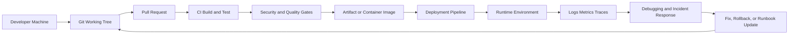
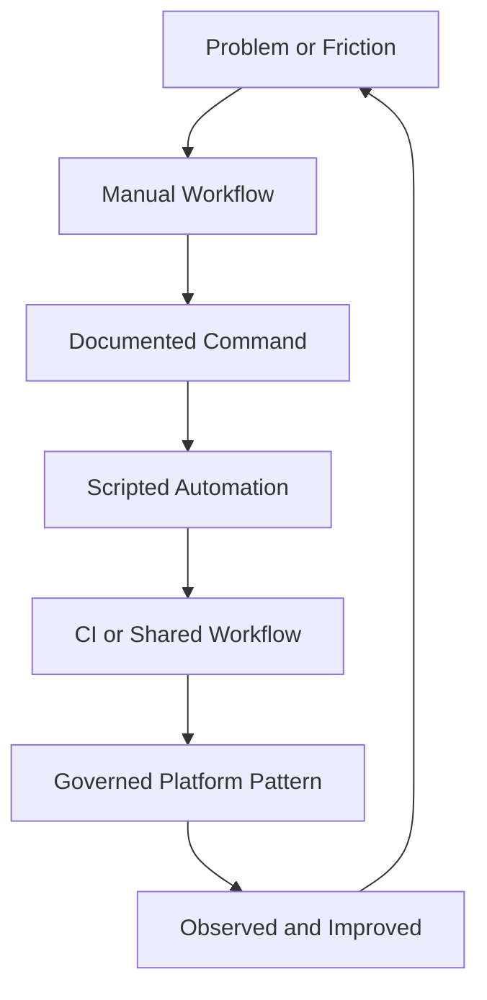

# Engineering Tooling Foundation

## 1. Tujuan Part Ini

Tooling bukan aksesori. Untuk senior backend engineer, tooling adalah bagian dari sistem produksi.

Kode aplikasi menentukan business behavior. Tooling menentukan apakah behavior itu bisa dibangun, diuji, direview, dikirim, diamati, dipulihkan, dan diaudit dengan aman.

Part ini membangun fondasi mental model sebelum masuk ke Bash, Linux, Git, GitHub, Maven, CI/CD, release, dan debugging. Targetnya bukan hafal command, tetapi mampu melihat workflow engineering sebagai sistem yang punya invariant, lifecycle, failure mode, risk surface, dan governance.

Setelah membaca part ini, kamu harus bisa menjawab:

- Apakah workflow ini reproducible?
- Apakah script ini idempotent?
- Apakah pipeline ini aman untuk production release?
- Apakah debugging command ini read-only atau destructive?
- Apakah perubahan tooling ini akan mempercepat tim atau membuat hidden coupling baru?
- Apakah evidence dari CI/local/prod cukup untuk mengambil keputusan?
- Apakah ada audit trail dari source code sampai deployment?

---

## 2. Tooling vs Coding

Coding menjawab: "Apa behavior aplikasi?"

Tooling menjawab: "Bagaimana behavior itu dibuat, diverifikasi, dikirim, dioperasikan, dan dipulihkan?"

Dalam enterprise Java/JAX-RS system, tooling biasanya menyentuh area berikut:

| Area | Contoh | Dampak |
|---|---|---|
| Local workflow | `mvn test`, Docker Compose, seed data, shell script | Kecepatan onboarding dan debugging |
| Build workflow | Maven lifecycle, dependency resolution, plugin execution | Correctness artifact |
| Source control | Git branch, commit, tag, PR | Traceability dan collaboration |
| CI workflow | GitHub Actions/Jenkins/GitLab pipeline | Quality gate dan automation |
| Release workflow | version bump, tag, artifact publish, image push | Deployment traceability |
| Runtime workflow | logs, env, process, config, healthcheck | Production support readiness |
| Security workflow | secret handling, token permission, dependency scan | Supply-chain safety |
| Documentation workflow | README, runbook, ADR, troubleshooting guide | Knowledge transfer |

Senior engineer tidak hanya menulis business logic. Senior engineer menjaga agar seluruh jalur dari ide sampai production tetap reliable.

---

## 3. Core Mental Model

Tooling dapat dipandang sebagai pipeline besar yang menghubungkan developer machine, source control, CI/CD, artifact repository, runtime environment, observability, dan recovery process.



Setiap node punya correctness concern:

- Developer machine harus tidak menjadi single source of truth.
- Git history harus dapat menjelaskan perubahan.
- PR harus reviewable.
- CI harus deterministic dan tidak hanya "green by luck".
- Artifact harus traceable ke commit dan dependency set.
- Deployment harus punya rollback atau recovery path.
- Runtime harus observable.
- Incident response harus menghasilkan learning, bukan hanya firefighting.

---

## 4. Tooling Properties yang Harus Dicari Senior Engineer

### 4.1 Reproducibility

Reproducibility berarti hasil bisa diulang dengan input yang sama.

Dalam Java/Maven service, input minimal meliputi:

- source commit
- Java version
- Maven version
- Maven wrapper version
- dependency versions
- plugin versions
- Maven profile
- OS/runner environment
- environment variables
- repository credentials
- build command

Contoh pertanyaan review:

- Apakah `mvn verify` di local menjalankan hal yang sama dengan CI?
- Apakah dependency version dipin atau bergantung pada transitive drift?
- Apakah build memakai SNAPSHOT yang bisa berubah?
- Apakah artifact mengandung timestamp atau generated content yang berubah tanpa source change?
- Apakah pipeline tergantung cache yang tidak terdokumentasi?

Failure mode umum:

- Build hijau di laptop tetapi gagal di CI.
- Build hijau kemarin tetapi gagal hari ini tanpa code change.
- Release artifact tidak bisa direkonstruksi dari tag.
- Developer baru tidak bisa setup local karena hidden dependency.

### 4.2 Automation

Automation bukan sekadar membuat script. Automation yang baik mengubah proses manual yang rawan salah menjadi workflow yang repeatable, observable, dan safe.

Automation yang buruk hanya membungkus command berbahaya dalam script yang lebih mudah dijalankan.

Checklist automation yang sehat:

- Ada tujuan jelas.
- Ada input dan output jelas.
- Ada exit code yang bermakna.
- Ada logging yang cukup.
- Ada `--help` atau dokumentasi.
- Ada dry-run untuk operasi destruktif.
- Ada validasi environment.
- Ada guard untuk production.
- Bisa dijalankan ulang tanpa merusak state.
- Tidak menyembunyikan failure.

### 4.3 Debuggability

Workflow yang debugable memberi engineer cukup evidence untuk memahami kegagalan.

Debuggability dalam tooling mencakup:

- command yang bisa di-copy dan dijalankan ulang
- log yang tidak terlalu noisy tetapi cukup informatif
- error message yang menunjukkan root cause candidate
- artifact build/test report yang tersimpan
- correlation ID atau trace ID untuk runtime issue
- pipeline step yang granular
- dependency tree yang bisa diinspeksi

Anti-pattern:

```bash
./build.sh || echo "failed"
```

Script seperti ini menghilangkan konteks. Lebih baik script memberi informasi command mana yang gagal, working directory, profile, Java/Maven version, dan lokasi report.

### 4.4 Idempotency

Idempotency berarti command bisa dijalankan lebih dari sekali tanpa menghasilkan efek samping yang tidak terkontrol.

Contoh:

- Membuat directory dengan `mkdir -p` lebih idempotent daripada `mkdir` biasa.
- Menghapus container by name sebelum membuat ulang bisa idempotent jika guard-nya benar.
- Menjalankan migration database tidak otomatis idempotent; harus ada schema history dan rollback/forward plan.
- Deploy manifest yang sama melalui GitOps biasanya lebih idempotent daripada kubectl patch manual.

Pertanyaan review:

- Apa yang terjadi jika command ini dijalankan dua kali?
- Apa yang terjadi jika command berhenti di tengah?
- Apakah ada partial state?
- Bagaimana mendeteksi state sebelum dan sesudah?
- Apakah cleanup aman?

### 4.5 Safety

Safety adalah kemampuan tooling untuk mencegah blast radius.

Safety concern:

- command destructive tanpa confirmation
- command production tanpa context check
- secret tercetak di log
- `rm -rf` dengan variable kosong
- `kubectl` context salah
- AWS/Azure account salah
- force push ke shared branch
- tag release ditimpa
- deployment tanpa approval
- pipeline token terlalu luas permission-nya

Prinsip senior:

> Default workflow harus aman. Escape hatch boleh ada, tetapi harus eksplisit, terdokumentasi, dan bisa diaudit.

### 4.6 Auditability

Auditability berarti perubahan bisa dijawab dengan evidence:

- Siapa mengubah apa?
- Kapan berubah?
- PR mana yang menyetujui?
- Commit mana yang membangun artifact?
- Dependency apa yang masuk?
- Pipeline mana yang publish artifact?
- Image mana yang dideploy?
- Environment mana yang terkena?
- Jika incident terjadi, apa change paling mungkin terkait?

Git, GitHub, Maven, CI/CD, artifact repository, container registry, Kubernetes deployment event, dan release note harus saling nyambung.

### 4.7 Developer Experience

Developer experience bukan kenyamanan kosmetik. DX yang buruk menciptakan defect.

Gejala DX buruk:

- onboarding butuh banyak tanya manual
- build local lambat tanpa alasan jelas
- test sering flaky
- script tidak jelas input/output-nya
- dokumentasi tidak sesuai real workflow
- command release hanya diketahui satu orang
- CI failure sulit direproduce

DX yang baik mempercepat feedback loop dan mengurangi cognitive load.

### 4.8 Operational Excellence

Operational excellence berarti tooling mendukung operasi real production:

- read-only first debugging
- command evidence capture
- rollback-aware release
- observability integration
- incident timeline
- post-incident learning
- runbook update
- security-conscious workflow

Tooling yang hanya nyaman di local tetapi tidak membantu production support belum cukup untuk senior-level engineering.

---

## 5. Tiga Workflow Utama

### 5.1 Local Workflow

Local workflow adalah jalur paling sering dipakai engineer.

Biasanya mencakup:

```bash
git clone <repo>
./mvnw verify
docker compose up
./scripts/run-local.sh
curl localhost:8080/health
```

Yang perlu dijaga:

- setup harus terdokumentasi
- command harus minim asumsi hidden state
- dependency local harus bisa dibuat ulang
- test selection harus jelas
- debug mode harus mudah
- secret local tidak boleh tercampur ke Git
- local behavior tidak boleh terlalu jauh dari CI/runtime

Failure mode:

| Symptom | Kemungkinan Penyebab |
|---|---|
| Build local gagal, CI hijau | Java/Maven version mismatch, profile berbeda, local cache corrupt |
| Service local start tapi request gagal | env var missing, port conflict, DB/broker belum siap |
| Test local flaky | dependency eksternal, timing issue, parallel test conflict |
| Developer baru stuck | README outdated, hidden credential, script tidak portable |

### 5.2 CI Workflow

CI workflow adalah quality gate otomatis.

Minimal untuk Java/JAX-RS service:

- checkout source
- setup Java
- restore Maven cache
- run formatting/lint/static analysis jika ada
- run unit test
- run integration test jika feasible
- generate test report
- build package
- run dependency/security scan
- publish artifact atau image jika branch/tag sesuai

Quality concern:

- CI harus fail saat quality gate gagal.
- CI harus memberi report yang mudah dibaca.
- CI tidak boleh bergantung pada secret untuk PR yang tidak perlu secret.
- CI tidak boleh memberi permission berlebih ke workflow token.
- CI harus membedakan PR validation dan release pipeline.

### 5.3 Production Support Workflow

Production support workflow tidak boleh dimulai dengan command destructive.

Urutan aman:

1. Baca symptom.
2. Identifikasi environment dan waktu kejadian.
3. Ambil evidence read-only.
4. Korelasikan dengan deploy/config/data/dependency change.
5. Tentukan scope blast radius.
6. Pilih mitigasi: rollback, roll-forward, config revert, traffic shift, feature flag, atau hotfix.
7. Simpan evidence untuk RCA.
8. Update runbook.

Contoh read-only commands:

```bash
kubectl get pods -n <namespace>
kubectl describe pod <pod> -n <namespace>
kubectl logs <pod> -n <namespace> --since=30m
kubectl rollout history deployment/<name> -n <namespace>
```

Contoh command yang harus hati-hati:

```bash
kubectl delete pod <pod>
kubectl rollout restart deployment/<name>
kubectl patch deployment/<name> ...
aws s3 rm ...
az resource delete ...
```

---

## 6. Tooling Lifecycle

Tooling juga punya lifecycle seperti software.



### 6.1 Manual Workflow

Awal workflow biasanya manual: engineer menjalankan beberapa command untuk solve problem.

Risiko:

- hasil tergantung operator
- step mudah terlewat
- evidence tidak tersimpan
- tidak scalable ke tim

### 6.2 Documented Command

Command mulai ditulis di README/runbook.

Kualitas command dokumentasi:

- bisa di-copy dengan placeholder jelas
- menjelaskan expected output
- menjelaskan failure umum
- menjelaskan environment yang aman

### 6.3 Scripted Automation

Jika workflow sering diulang, script bisa dibuat.

Syarat:

- input divalidasi
- error handling jelas
- dry-run untuk action berisiko
- idempotent semaksimal mungkin
- dependency tool dicek
- tidak menyembunyikan detail penting

### 6.4 CI or Shared Workflow

Jika automation menjadi quality gate atau shared operation, pindahkan ke CI/shared workflow.

Risiko baru:

- permission terlalu luas
- secret exposure
- cache poisoning
- third-party action risk
- branch/tag trigger salah
- workflow sulit didebug

### 6.5 Governed Platform Pattern

Tooling yang berdampak lintas repo/tim perlu governance:

- owner jelas
- versioning jelas
- compatibility policy
- migration guide
- deprecation policy
- rollback path

---

## 7. Dampak ke Java/JAX-RS Backend

Tooling yang buruk mudah berubah menjadi bug aplikasi.

### 7.1 Build dan Dependency

Pada Java service, runtime behavior sangat dipengaruhi oleh build:

- dependency version menentukan classpath
- plugin Maven menentukan artifact
- profile menentukan config/build path
- test plugin menentukan coverage validasi
- shade/assembly dapat mengubah class/resource resolution
- parent POM/BOM menentukan alignment framework

Contoh failure:

- JAX-RS provider tidak ter-load karena dependency transitive berubah.
- Runtime memakai versi library berbeda dari yang diasumsikan test.
- CI skip integration test sehingga issue container config baru ketahuan di staging.
- Maven profile local mengaktifkan behavior yang tidak ada di CI.

### 7.2 Runtime Configuration

Java backend sering bergantung pada env var, system property, config file, secret, dan service discovery.

Tooling harus membantu menjawab:

- config mana yang aktif?
- profile mana yang aktif?
- secret berasal dari mana?
- endpoint dependency mengarah ke mana?
- timeout/retry value apa yang dipakai?
- log level apa yang aktif?

### 7.3 Operational Debugging

JAX-RS service pada akhirnya adalah process Linux yang:

- bind port
- membuka socket ke database/broker/cache
- membaca file/config
- menulis log
- memakai heap/off-heap memory
- menerima signal shutdown
- berjalan di container/Kubernetes

Tooling senior harus bisa men-debug dari dua sisi:

- application-level: HTTP status, exception, request ID, domain state
- runtime-level: process, env, fd, DNS, TLS, port, CPU, memory, container limit

---

## 8. Dampak ke Docker, Kubernetes, AWS, Azure, dan GitOps

### 8.1 Docker

Tooling build menentukan image:

- base image
- user permission
- copied files
- entrypoint
- environment variable
- healthcheck
- exposed port
- layer cache
- dependency download

Failure mode:

- image berjalan sebagai root
- file permission salah
- `ENTRYPOINT` tidak forward signal
- build tidak reproducible karena dependency latest
- image terlalu besar sehingga deploy lambat
- local Docker Compose berbeda jauh dari runtime Kubernetes

### 8.2 Kubernetes

Kubernetes memperkenalkan runtime control plane:

- Pod lifecycle
- readiness/liveness probe
- ConfigMap/Secret
- resource request/limit
- Service/DNS
- rollout strategy
- logs/events
- namespace/context

Tooling yang baik mencegah:

- deploy ke namespace salah
- manual change yang menabrak GitOps
- restart tanpa evidence
- secret tercetak di terminal
- command `kubectl` destructive di cluster salah

### 8.3 AWS/Azure

Cloud CLI menambah risiko context:

- account/subscription salah
- region salah
- permission berbeda
- secret manager path salah
- private endpoint/network policy
- container registry credential
- object storage lifecycle

Prinsip:

> Sebelum menjalankan command cloud, validasi identity, account/subscription, region, resource, dan blast radius.

### 8.4 GitOps

Dalam GitOps, desired state ada di Git. Manual change di cluster bisa menjadi drift.

Review question:

- Apakah perubahan deployment dilakukan via GitOps repo?
- Apakah ada PR dan approval?
- Apakah rollout bisa ditelusuri ke commit?
- Apakah manual hotfix akan ditimpa reconciler?
- Apakah rollback dilakukan dengan revert commit atau manual patch?

---

## 9. Failure Modes Umum Tooling

| Area | Failure Mode | Detection | Mitigation |
|---|---|---|---|
| Local setup | README outdated | developer baru gagal setup | update setup guide, script validation |
| Bash script | unquoted variable | error pada path dengan spasi atau variable kosong | shellcheck, strict review |
| Git | force push merusak shared branch | history hilang/PR berubah | branch protection, force-with-lease discipline |
| GitHub PR | PR terlalu besar | review dangkal | split PR, draft early |
| Maven | transitive dependency conflict | runtime ClassNotFound/NoSuchMethod | dependency tree, enforcer |
| CI | cache stale | CI flaky | cache key benar, clean rebuild path |
| Release | tag tidak immutable | artifact traceability rusak | signed/annotated tag, tag protection |
| Kubernetes | context salah | command kena cluster salah | context prompt, preflight check |
| Cloud CLI | account salah | resource salah berubah | explicit profile/subscription validation |
| Security | secret masuk log/history | scanning alert atau incident | secret scanning, redaction, rotation |
| Incident | evidence tidak lengkap | RCA spekulatif | evidence bundle dan timeline |

---

## 10. Debugging Philosophy untuk Tooling

Saat workflow gagal, jangan langsung retry tanpa model.

Gunakan struktur:

```text
Symptom -> Scope -> Recent Change -> Evidence -> Hypothesis -> Experiment -> Fix -> Prevention
```

### 10.1 Symptom

Apa yang terlihat?

- command gagal?
- test gagal?
- build timeout?
- deployment stuck?
- service crash loop?
- API 500?
- dependency tidak resolve?

### 10.2 Scope

Siapa yang terdampak?

- hanya laptop sendiri?
- semua developer?
- hanya CI?
- hanya branch tertentu?
- hanya staging?
- production?

### 10.3 Recent Change

Apa yang baru berubah?

- source code
- dependency
- parent POM
- Maven profile
- GitHub workflow
- base image
- secret/config
- infrastructure
- Kubernetes manifest
- cloud permission

### 10.4 Evidence

Evidence harus bisa dikirim ke reviewer/teammate:

```bash
java -version
./mvnw -version
git rev-parse HEAD
git status --short
./mvnw -X verify
kubectl get pods -n <namespace>
kubectl logs <pod> -n <namespace> --since=15m
```

Jangan kirim secret, token, full env dump, atau log berisi PII tanpa redaction.

### 10.5 Hypothesis

Hypothesis harus testable:

Buruk:

```text
Mungkin CI aneh.
```

Lebih baik:

```text
CI memakai Java 21, sedangkan local memakai Java 17. Error compiler muncul setelah plugin compiler membaca release target yang berbeda.
```

### 10.6 Experiment

Experiment harus minimal dan safe:

- jalankan command yang sama dengan CI di local
- matikan cache sementara
- print effective POM
- bandingkan dependency tree
- cek env var aktif
- gunakan read-only kubectl command

### 10.7 Fix and Prevention

Fix tanpa prevention biasanya membuat masalah kembali.

Prevention bisa berupa:

- update README
- tambah preflight check
- pin version
- tambah CI check
- tambah runbook entry
- split script
- perbaiki error message
- tambah branch protection

---

## 11. Correctness Concern

Tooling correctness berarti workflow menjalankan hal yang benar, pada input yang benar, di environment yang benar, dengan output yang benar.

Pertanyaan:

- Apakah command build menjalankan test yang diwajibkan?
- Apakah profile yang aktif benar?
- Apakah artifact berasal dari commit yang direview?
- Apakah image memakai artifact yang baru dibangun?
- Apakah release note sesuai perubahan?
- Apakah deployment manifest menunjuk versi benar?
- Apakah rollback mengarah ke versi aman?

Correctness bug tooling sering lebih berbahaya daripada bug aplikasi karena bisa membuat seluruh tim percaya pada hasil yang salah.

---

## 12. Productivity Concern

Tooling produktif bukan berarti paling singkat. Tooling produktif berarti mempercepat feedback loop tanpa menghilangkan safety.

Trade-off:

| Keputusan | Benefit | Risiko |
|---|---|---|
| Cache dependency | Build lebih cepat | Stale/corrupt cache |
| Skip integration test local | Feedback cepat | Bug telat ditemukan |
| One-command setup | Onboarding mudah | Script terlalu kompleks |
| Auto-fix formatting | PR bersih | Unexpected file changes |
| Large shared script | Konsisten | Sulit dimodifikasi |
| Strict CI gate | Quality tinggi | PR bottleneck jika flaky |

Senior engineer harus membedakan productivity improvement dari shortcut yang memindahkan biaya ke production.

---

## 13. Security Concern

Tooling sering menyentuh credential.

Risk surface:

- shell history
- terminal scrollback
- local `.env`
- Git commit
- CI logs
- GitHub Actions secret
- Maven repository credential
- Docker registry credential
- Kubernetes Secret
- AWS/Azure CLI token
- clipboard
- screenshot/debug attachment

Prinsip:

- jangan print secret
- jangan commit secret
- jangan taruh token di command argument jika bisa masuk history
- gunakan least privilege
- gunakan scoped token
- gunakan OIDC jika tersedia
- rotate credential setelah leakage
- redaction sebelum share evidence

---

## 14. Reproducibility Concern

Build dan debug harus bisa diulang.

Minimal evidence untuk reproduksi build:

```bash
git rev-parse HEAD
java -version
./mvnw -version
./mvnw -P<profile> -DskipTests=false verify
```

Minimal evidence untuk reproduksi API bug:

```bash
curl -v \
  -X POST "https://<host>/<path>" \
  -H "Content-Type: application/json" \
  -H "X-Correlation-Id: <id>" \
  --data @payload.json
```

Minimal evidence untuk reproduksi deployment issue:

```bash
kubectl get deploy <name> -n <namespace> -o yaml
kubectl rollout history deploy/<name> -n <namespace>
kubectl describe pod <pod> -n <namespace>
kubectl logs <pod> -n <namespace> --since=30m
```

---

## 15. Release Concern

Tooling release harus menjawab:

- version apa yang dirilis?
- commit mana yang menjadi source?
- PR mana yang masuk?
- artifact mana yang dipublish?
- image mana yang dideploy?
- environment mana yang sudah menerima?
- migration apa yang berjalan?
- config apa yang berubah?
- rollback ke mana?

Release tanpa traceability adalah operational debt.

---

## 16. Observability and Incident-Support Concern

Tooling harus membantu membuat incident lebih cepat dipahami.

Checklist evidence incident:

- waktu kejadian dengan timezone
- environment
- service/component
- version/tag/image digest
- recent deployment
- recent config change
- logs dengan correlation ID
- metrics sebelum/sesudah
- trace jika ada
- command yang dijalankan
- mitigasi yang dilakukan
- link PR/release/deployment

---

## 17. PR Review Checklist untuk Tooling Changes

Gunakan checklist ini saat mereview perubahan script, POM, workflow, release command, atau local tooling.

### Correctness

- Apakah command menjalankan target yang benar?
- Apakah input divalidasi?
- Apakah output jelas?
- Apakah exit code benar?
- Apakah failure tidak disembunyikan?

### Safety

- Apakah ada command destructive?
- Apakah ada dry-run?
- Apakah environment production terlindungi?
- Apakah context Kubernetes/cloud divalidasi?
- Apakah secret bisa bocor?

### Reproducibility

- Apakah version dipin?
- Apakah local dan CI konsisten?
- Apakah dependency pada cache/network jelas?
- Apakah command bisa dijalankan ulang?

### Debuggability

- Apakah log cukup?
- Apakah error message actionable?
- Apakah report disimpan?
- Apakah command bisa di-copy untuk reproduksi?

### Maintainability

- Apakah script sederhana?
- Apakah struktur jelas?
- Apakah dokumentasi update?
- Apakah ada owner?
- Apakah perubahan terlalu spesifik untuk satu mesin/developer?

### Security

- Apakah token permission minimal?
- Apakah third-party action dipin?
- Apakah secret tidak muncul di log?
- Apakah dependency scan tidak dilemahkan?

### Release and Operations

- Apakah release traceability terjaga?
- Apakah rollback path jelas?
- Apakah observability/runbook terdampak?
- Apakah perubahan ini bisa menyebabkan downtime atau productivity regression?

---

## 18. Internal Verification Checklist

Bagian ini wajib diverifikasi di internal CSG/team. Jangan mengarang detail internal.

### Repository and Documentation

- Di mana repository utama Quote & Order service berada?
- Apakah ada README yang authoritative?
- Apakah ada CONTRIBUTING?
- Apakah ada local setup guide?
- Apakah ada troubleshooting guide?
- Apakah ada runbook production support?
- Apakah ada release guide?

### Git and GitHub

- Branch strategy apa yang dipakai?
- Apakah trunk-based, Gitflow, release branch, atau hybrid?
- Merge strategy apa yang diperbolehkan?
- Apakah commit signing diwajibkan?
- Apakah tag release dilindungi?
- Apakah CODEOWNERS dipakai?
- Required checks apa saja?
- Siapa reviewer wajib untuk build/release/security changes?

### Maven and Java Build

- Apakah repo memakai Maven wrapper?
- Java version apa yang diwajibkan?
- Maven version apa yang dipakai CI?
- Apakah ada parent POM internal?
- BOM apa yang dipakai?
- Artifact repository apa yang dipakai?
- Bagaimana snapshot/release dipublish?
- Dependency scanning tool apa yang dipakai?

### CI/CD

- Platform CI/CD apa yang dipakai: GitHub Actions, Jenkins, GitLab, Azure DevOps, atau internal?
- Apa trigger PR validation?
- Apa trigger release?
- Bagaimana image dibuat dan dipush?
- Bagaimana deployment ke environment dilakukan?
- Apakah GitOps dipakai?
- Bagaimana rollback dilakukan?

### Runtime and Operations

- Service berjalan di Kubernetes, VM, atau hybrid?
- Cloud provider: AWS, Azure, on-prem, atau mixed?
- Bagaimana config/secret dikelola?
- Observability tools apa yang digunakan?
- Bagaimana correlation ID/trace ID dikelola?
- Apa incident escalation path?

### Security

- Secret scanning aktif atau tidak?
- Dependabot/SCA aktif atau tidak?
- Policy token dan credential helper seperti apa?
- Apakah OIDC dipakai untuk cloud deployment?
- Apakah ada security approval untuk workflow change?

---

## 19. Practice: Tooling Inventory untuk Repo Baru

Saat join repo baru, lakukan inventory berikut.

### 19.1 Repository Map

```bash
find . -maxdepth 2 -type f | sort | sed 's#^./##'
```

Cari:

- `README.md`
- `CONTRIBUTING.md`
- `pom.xml`
- `.mvn/`
- `mvnw`
- `.github/workflows/`
- `scripts/`
- `Dockerfile`
- `docker-compose.yml`
- `k8s/`, `helm/`, `deploy/`
- `docs/`

### 19.2 Build Map

```bash
./mvnw -version
./mvnw help:effective-pom -DskipTests
./mvnw dependency:tree -DskipTests
```

Catat:

- Java version
- Maven version
- parent POM
- profiles
- plugins
- dependency management
- repository config

### 19.3 CI Map

Cek workflow/pipeline:

- PR validation
- unit test
- integration test
- static analysis
- dependency scan
- package
- artifact publish
- image build
- deployment trigger

### 19.4 Runtime Map

Cari:

- entrypoint service
- port
- health endpoint
- config source
- secret source
- log format
- dependency endpoint
- Docker/Kubernetes manifest

---

## 20. Anti-Patterns yang Harus Diwaspadai

### 20.1 "Works on My Machine" sebagai Root Cause

Itu bukan root cause. Itu symptom dari environment drift.

Cari:

- Java version mismatch
- Maven version mismatch
- OS difference
- shell difference
- profile difference
- missing env var
- local cache issue
- hidden dependency

### 20.2 Script Tanpa Exit Discipline

Script yang selalu return success membuat CI bohong.

```bash
command_that_may_fail
echo "done"
```

Harus ada error handling dan exit code jelas.

### 20.3 Pipeline Terlalu Monolitik

Satu step besar seperti `./ci.sh` tanpa log granular sulit didebug.

Lebih baik pipeline punya step terpisah:

- setup
- compile
- unit test
- integration test
- package
- scan
- publish

### 20.4 Secret via Copy-Paste

Token yang sering di-copy ke terminal rawan masuk history, screenshot, clipboard manager, atau log.

### 20.5 Manual Production Change Tanpa Audit

Manual patch mungkin perlu saat incident, tetapi harus:

- dicatat
- disetujui sesuai process
- direkonsiliasi ke GitOps/source of truth
- dimasukkan ke RCA

### 20.6 Skipping Tests sebagai Default

`-DskipTests` boleh untuk kasus tertentu, tetapi tidak boleh menjadi default release path tanpa quality gate lain.

### 20.7 Tag Release yang Bisa Diubah

Mutable tag merusak traceability. Release tag sebaiknya immutable dan, jika policy mendukung, signed/protected.

---

## 21. Decision Framework: Kapan Membuat Tooling Baru?

Buat tooling baru jika:

- workflow sering diulang
- manual step sering salah
- onboarding lambat
- evidence debugging tidak konsisten
- release butuh banyak koordinasi manual
- CI failure sering sulit dianalisis
- security/compliance membutuhkan guardrail

Jangan membuat tooling baru jika:

- problem belum dipahami
- hanya mengoptimalkan kasus pribadi
- menambah abstraction yang menyembunyikan failure
- tidak ada owner
- tidak ada dokumentasi
- tidak ada rollback path

Pertanyaan sebelum merge tooling baru:

```text
Apa invariant yang dijaga?
Apa failure mode baru yang diperkenalkan?
Bagaimana user tahu command berhasil/gagal?
Bagaimana command ini dipakai di local dan CI?
Bagaimana behavior di production-sensitive context?
Siapa owner-nya?
Bagaimana cara debug tooling ini sendiri?
```

---

## 22. Ringkasan Part 001

Tooling adalah sistem pendukung engineering yang menghubungkan local development, source control, build, CI/CD, release, runtime, security, observability, dan incident response.

Senior engineer harus melihat tooling melalui property berikut:

- reproducibility
- automation
- debuggability
- idempotency
- safety
- auditability
- developer experience
- operational excellence

Untuk konteks enterprise Java/JAX-RS, tooling berdampak langsung ke:

- dependency correctness
- artifact correctness
- environment consistency
- runtime observability
- release traceability
- production recovery
- team productivity
- supply-chain security

Prinsip utama:

> Tooling yang baik membuat hal benar menjadi mudah, hal salah menjadi sulit, dan failure menjadi cepat dipahami.

---

## 23. Apa yang Akan Dilanjutkan di Part 002

Part berikutnya masuk ke Linux foundation untuk backend engineer: kernel vs user space, process, filesystem, permission, signal, environment variable, network stack, service manager, logs, container, Kubernetes node, dan bagaimana semuanya memengaruhi Java/JAX-RS service di production.
