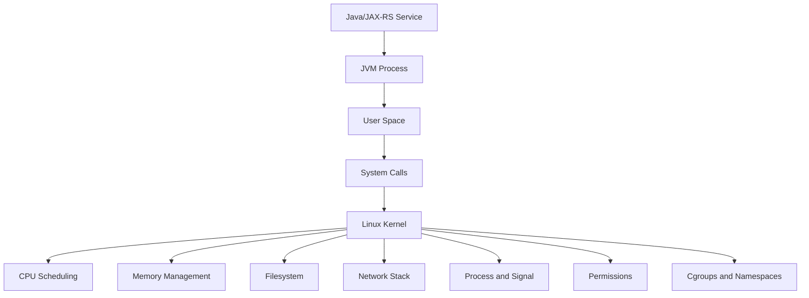
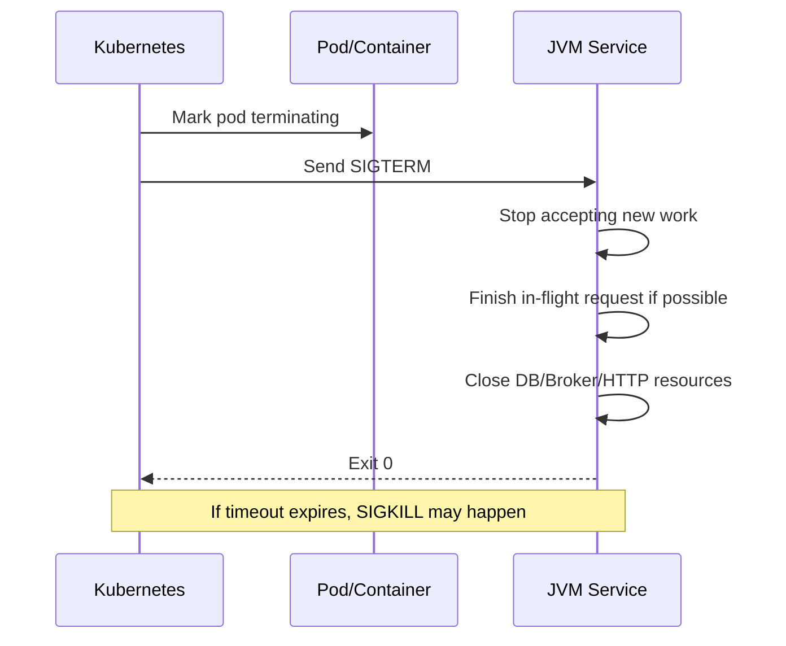

# Linux Foundation for Backend Engineers

## 1. Tujuan Part Ini

Backend Java/JAX-RS service tidak berjalan di ruang abstrak. Service berjalan sebagai process Linux, membaca file, membuka socket, memakai memory, membuat thread, menerima signal, menulis log, dan hidup di bawah batasan container atau host.

Part ini membangun mental model Linux untuk senior backend engineer. Fokusnya bukan menjadi Linux administrator penuh, tetapi memahami Linux sebagai runtime environment untuk:

- local development
- CI runner
- Docker container
- Kubernetes pod
- production debugging
- release verification
- incident support

Setelah membaca part ini, kamu harus mampu melihat error aplikasi dari perspektif runtime:

- Apakah process benar-benar berjalan?
- Apakah port listen?
- Apakah permission file benar?
- Apakah env var aktif?
- Apakah DNS resolve?
- Apakah TLS handshake berhasil?
- Apakah memory limit tercapai?
- Apakah process menerima SIGTERM dan shutdown dengan benar?
- Apakah log yang dibaca berasal dari container/pod/version yang benar?

---

## 2. Linux Mental Model

Linux dapat dilihat sebagai lapisan runtime yang menyediakan primitive untuk aplikasi.



Aplikasi Java tidak langsung mengatur CPU, memory, disk, dan network. JVM meminta layanan ke OS melalui system calls. Container dan Kubernetes menambahkan pembatasan lewat cgroups, namespaces, filesystem mounts, dan network abstraction.

Mental model sederhana:

```text
Application behavior = Code + JVM + OS primitives + Container constraints + Runtime configuration + External dependencies
```

Jika production issue muncul, jangan hanya melihat code. Lihat juga primitive Linux di bawahnya.

---

## 3. Kernel vs User Space

### 3.1 Kernel

Kernel adalah inti OS yang mengelola resource:

- process scheduling
- memory allocation
- filesystem access
- network stack
- device I/O
- permissions
- signals
- cgroups/namespaces

Aplikasi tidak boleh sembarangan mengakses hardware/resource. Aplikasi meminta kernel melakukan operasi melalui system call.

Contoh operasi yang melibatkan kernel:

- membuka file config
- bind port HTTP
- connect ke PostgreSQL/Kafka/RabbitMQ/Redis
- membaca environment
- membuat thread
- menerima signal shutdown
- menulis log ke stdout/file

### 3.2 User Space

User space adalah area tempat program biasa berjalan:

- shell
- Java process
- Maven
- Git
- curl
- kubectl
- system tools
- application binaries

Sebagian besar command yang kamu jalankan berada di user space, tetapi hasilnya bergantung pada kernel.

Contoh:

```bash
curl https://example.com
```

`curl` adalah program user space. Tetapi DNS lookup, socket connect, TLS data transfer, dan network I/O bergantung pada kernel dan library di bawahnya.

---

## 4. Shell sebagai Interface ke Linux

Shell adalah command interpreter. Untuk backend engineer, shell adalah interface utama ke OS, local workflow, CI, container, dan production debugging.

Shell melakukan banyak hal sebelum command dijalankan:

- variable expansion
- quote parsing
- glob expansion
- command substitution
- redirection
- pipeline setup
- exit status propagation

Contoh:

```bash
grep "$TRACE_ID" app.log | tail -n 20
```

Yang terjadi:

1. Shell membaca variable `TRACE_ID`.
2. Shell menjalankan `grep`.
3. Shell membuat pipe ke `tail`.
4. Shell mengembalikan exit status pipeline sesuai shell behavior.

Failure mode:

- variable kosong karena belum diexport
- quote salah sehingga glob/space merusak argument
- pipeline gagal tetapi exit code yang terbaca hanya command terakhir
- command berjalan di shell berbeda antara local dan CI

---

## 5. Filesystem Mental Model

Linux melihat banyak hal sebagai file atau file-like object.

Objek penting:

- regular file
- directory
- symlink
- device file
- socket
- pipe
- `/proc`
- `/dev`
- `/etc`
- `/tmp`
- mount point

Untuk Java backend, filesystem dipakai untuk:

- config file
- certificate/truststore/keystore
- uploaded file
- temporary file
- log file jika tidak stdout-only
- generated artifact
- mounted secret/config
- classpath/resource

Command dasar untuk inspeksi:

```bash
pwd
ls -la
readlink -f <path>
stat <path>
du -sh <path>
df -h
mount | head
```

### 5.1 Permission

Permission menentukan siapa bisa read/write/execute.

Contoh failure:

```text
java.io.FileNotFoundException: /app/config/app.yaml (Permission denied)
```

Kemungkinan penyebab:

- file ada tetapi user process tidak punya read permission
- directory parent tidak executable
- container berjalan sebagai non-root tetapi file dimiliki root
- mounted secret punya permission tertentu
- readonly filesystem

Debugging awal:

```bash
id
whoami
ls -ld /app /app/config
ls -l /app/config/app.yaml
```

### 5.2 Temporary Directory

Java sering memakai temp directory untuk upload, extraction, report, generated file, atau library behavior.

Perhatikan:

- `java.io.tmpdir`
- `/tmp` writable atau tidak
- disk usage
- cleanup policy
- container filesystem ephemeral

Debug:

```bash
java -XshowSettings:properties -version 2>&1 | grep 'java.io.tmpdir'
df -h /tmp
ls -ld /tmp
```

---

## 6. Process Mental Model

Process adalah instance program yang sedang berjalan.

Java service biasanya terlihat sebagai satu process JVM yang memiliki banyak thread.

Konsep penting:

- PID: process ID
- PPID: parent process ID
- process tree
- foreground/background
- exit code
- signal
- environment
- open file descriptors
- working directory
- user/group

Command inspeksi:

```bash
ps -ef | grep java
ps -o pid,ppid,user,stat,etime,cmd -p <pid>
top -p <pid>
```

### 6.1 Java Process

JVM process membawa:

- heap memory
- metaspace
- thread pool
- GC threads
- file descriptors
- sockets
- system properties
- env variables
- classpath/module path
- signal handlers

Debugging Java process tidak cukup dengan melihat log aplikasi. Perlu tahu process context.

Contoh pertanyaan:

- User apa yang menjalankan process?
- Working directory apa?
- Command line JVM apa?
- JVM option apa aktif?
- Port mana yang listen?
- Berapa thread aktif?
- File descriptor berapa banyak?
- Process sudah berjalan berapa lama?

### 6.2 Exit Code

Exit code adalah contract antara process dan caller.

Umum:

- `0`: success
- non-zero: failure
- `130`: terminated by Ctrl+C/SIGINT dalam banyak shell context
- `137`: sering terlihat saat process dibunuh SIGKILL atau OOMKill di container context
- `143`: sering terlihat saat SIGTERM

Dalam CI, exit code menentukan job success/failure. Script yang menelan exit code akan membuat pipeline tidak dapat dipercaya.

---

## 7. Thread Awareness

Linux menjadwalkan execution unit. JVM membuat thread OS-level untuk banyak aktivitas:

- HTTP worker
- DB connection pool worker
- Kafka consumer thread
- RabbitMQ listener thread
- scheduler thread
- GC thread
- async executor
- logging async appender

Gejala thread issue:

- CPU tinggi
- request timeout
- deadlock
- pool starvation
- Kafka consumer lag
- RabbitMQ consumer stuck
- blocked DB call

Linux-level command memberi sinyal awal:

```bash
top -H -p <pid>
ps -L -p <pid> -o pid,tid,pcpu,pmem,stat,comm
```

Untuk Java-level, biasanya perlu tool seperti `jstack`, `jcmd`, atau profiler, tergantung image/runtime internal.

Internal verification diperlukan karena container production mungkin tidak memiliki JDK tools.

---

## 8. File Descriptor Mental Model

File descriptor adalah handle yang dipakai process untuk file, socket, pipe, dan resource I/O lain.

Java backend memakai file descriptor untuk:

- HTTP server socket
- outbound HTTP connection
- PostgreSQL connection
- Kafka connection
- RabbitMQ connection
- Redis connection
- log file
- temp file
- certificate file

Failure mode:

```text
Too many open files
java.net.SocketException: Too many open files
```

Kemungkinan penyebab:

- connection leak
- file stream tidak ditutup
- log file descriptor leak
- terlalu banyak concurrent socket
- limit `ulimit` terlalu rendah

Debugging awal:

```bash
ulimit -n
ls /proc/<pid>/fd | wc -l
lsof -p <pid> | head
lsof -p <pid> | awk '{print $5}' | sort | uniq -c | sort -nr | head
```

Di container/Kubernetes, limit bisa berasal dari node/runtime/security context. Perlu verifikasi internal.

---

## 9. Permission and Identity

Linux permission bergantung pada identity.

Cek identity:

```bash
id
whoami
groups
```

Untuk container modern, service sebaiknya tidak berjalan sebagai root kecuali ada alasan kuat.

Trade-off non-root container:

| Benefit | Risiko/konsekuensi |
|---|---|
| Mengurangi privilege runtime | File permission harus benar |
| Lebih aman jika compromised | Debugging/exec mungkin lebih terbatas |
| Selaras dengan security baseline | Build image harus set ownership benar |

Failure mode umum:

- service tidak bisa membaca mounted config
- service tidak bisa menulis temp directory
- startup script tidak executable
- certificate file tidak readable
- Docker image build sukses, runtime gagal

Review Dockerfile:

```Dockerfile
USER appuser
COPY --chown=appuser:appuser target/app.jar /app/app.jar
```

---

## 10. Signal and Shutdown

Signal adalah mekanisme OS untuk memberi notifikasi ke process.

Signal penting:

- `SIGTERM`: minta process berhenti dengan graceful
- `SIGKILL`: paksa berhenti, tidak bisa ditangkap process
- `SIGHUP`: historically reload/hangup, tergantung aplikasi
- `SIGINT`: interrupt dari Ctrl+C

Kubernetes saat terminating pod umumnya mengirim SIGTERM, menunggu grace period, lalu SIGKILL jika process belum berhenti.

Flow sederhana:



Production concern:

- Apakah JAX-RS server graceful shutdown?
- Apakah Kafka/RabbitMQ consumer stop dengan aman?
- Apakah in-flight order/quote operation bisa partial?
- Apakah readiness probe turun sebelum process mati?
- Apakah termination grace period cukup?

Internal verification checklist wajib untuk shutdown behavior karena sangat bergantung framework dan deployment config.

---

## 11. Environment Variables

Environment variable adalah key-value yang diwariskan ke process saat start.

Cek env process sendiri:

```bash
env | sort
```

Cek env process tertentu:

```bash
tr '\0' '\n' < /proc/<pid>/environ | sort
```

Hati-hati: command ini bisa mengekspos secret. Jangan share output mentah.

Environment variable umum untuk Java/Maven/backend:

- `JAVA_HOME`
- `PATH`
- `MAVEN_OPTS`
- `JAVA_TOOL_OPTIONS`
- `SPRING_PROFILES_ACTIVE` jika service memakai Spring
- config endpoint
- DB URL
- broker URL
- Redis URL
- log level
- region/cloud config

Failure mode:

- env var tidak diexport
- typo variable
- local shell punya env, CI tidak
- Kubernetes Secret key salah
- value mengandung newline/space tidak diquote benar
- secret tercetak di log
- env var override config file tanpa disadari

---

## 12. Package Manager Awareness

Package manager berbeda per distribution:

| Distro family | Package manager |
|---|---|
| Debian/Ubuntu | `apt` |
| RHEL/CentOS/Fedora | `yum`/`dnf` |
| Alpine | `apk` |

Dalam container, package manager menentukan:

- tool debugging tersedia atau tidak
- libc yang dipakai
- certificate store
- image size
- CVE surface

Contoh trade-off:

| Image | Benefit | Risiko |
|---|---|---|
| Full Ubuntu/Debian | Debug tools mudah | Lebih besar, CVE surface lebih luas |
| Alpine | Kecil | musl/glibc difference, package difference |
| Distroless | Lebih minimal | Sulit shell debugging |

Internal verification:

- base image apa yang digunakan?
- apakah production image punya shell?
- apakah debugging memakai ephemeral container?
- bagaimana certificate truststore dikelola?

---

## 13. Network Stack Awareness

Backend service hidup dari network I/O.

Primitive penting:

- IP address
- port
- socket
- DNS
- route
- firewall/network policy
- TLS
- proxy
- connection timeout
- read timeout
- keepalive

Command awal:

```bash
ss -lntp
ss -antp
lsof -i -P -n
dig <host>
nslookup <host>
curl -v <url>
openssl s_client -connect <host>:443 -servername <host>
```

### 13.1 Bind vs Connect

Service melakukan dua jenis networking:

1. Bind/listen: menerima traffic inbound.
2. Connect: membuat koneksi outbound ke dependency.

JAX-RS service biasanya:

- listen pada HTTP port
- connect ke PostgreSQL
- connect ke Kafka/RabbitMQ
- connect ke Redis
- connect ke service internal lain
- connect ke identity/security service

Failure mode:

| Symptom | Kemungkinan Layer |
|---|---|
| Connection refused | service tidak listen, port salah, pod belum ready |
| Connection timeout | network policy, route, firewall, dependency down |
| Unknown host | DNS/service discovery |
| TLS handshake failed | certificate, truststore, SNI, protocol mismatch |
| 401/403 | auth/token/permission, bukan network murni |
| 5xx | upstream app issue atau gateway issue |

---

## 14. Service Manager Awareness

Di VM atau host tradisional, service sering dikelola oleh systemd.

Command awareness:

```bash
systemctl status <service>
journalctl -u <service> --since "30 minutes ago"
```

Dalam Kubernetes, systemd biasanya bukan interface utama untuk aplikasi. Interface utama adalah Kubernetes API:

```bash
kubectl get pods
kubectl describe pod <pod>
kubectl logs <pod>
```

Namun CI runner, build agent, atau VM internal mungkin tetap memakai service manager.

Prinsip:

- Jangan asumsikan semua runtime adalah Kubernetes.
- Jangan asumsikan semua runtime punya systemd.
- Verifikasi runtime environment internal.

---

## 15. Logs Mental Model

Log bisa berasal dari banyak tempat:

- stdout/stderr process
- file log aplikasi
- container log
- Kubernetes aggregated log
- sidecar/proxy log
- ingress/access log
- system log
- CI job log

Untuk incident, log harus dikaitkan dengan:

- timestamp dan timezone
- service
- version/image
- pod/container
- namespace/environment
- correlation ID
- trace ID
- request path/method/status
- error stacktrace

Command:

```bash
tail -f app.log
grep '<correlation-id>' app.log
kubectl logs <pod> -n <namespace> --since=30m
kubectl logs deploy/<deployment> -n <namespace> --since=30m
```

Failure mode:

- membaca log pod lama
- timezone salah
- log rotated
- structured log rusak
- secret/PII muncul di log
- sampling membuat event tidak terlihat
- multiline stacktrace sulit diparse

---

## 16. Linux in Container

Container bukan VM kecil. Container adalah process yang berjalan dengan isolation.

Primitive container:

- namespace: isolasi process/network/mount/user tertentu
- cgroups: limit resource
- layered filesystem
- image entrypoint
- environment injection
- volume mount
- user/security context

### 16.1 PID 1 Problem

Process utama container sering menjadi PID 1. PID 1 punya behavior signal/zombie handling khusus.

Concern:

- Apakah shell wrapper sebagai entrypoint forward signal ke JVM?
- Apakah child process menjadi zombie?
- Apakah SIGTERM diterima JVM?

Bad pattern:

```Dockerfile
ENTRYPOINT sh -c "java -jar app.jar"
```

Pattern ini bisa mengganggu signal forwarding jika tidak hati-hati.

Lebih eksplisit:

```Dockerfile
ENTRYPOINT ["java", "-jar", "/app/app.jar"]
```

Namun detail final tergantung kebutuhan runtime dan script internal.

### 16.2 Cgroups and Limits

Container resource limit memengaruhi JVM.

Concern:

- heap sizing aware terhadap container limit?
- CPU throttling terjadi?
- OOMKill terjadi?
- file descriptor limit cukup?

Command awareness:

```bash
cat /proc/meminfo | head
cat /proc/self/cgroup
```

Di Kubernetes, lihat:

```bash
kubectl describe pod <pod> -n <namespace>
kubectl top pod <pod> -n <namespace>
```

---

## 17. Linux in Kubernetes Node

Kubernetes menambahkan abstraction:

- Pod
- Container
- Namespace
- Service
- ConfigMap
- Secret
- Volume
- Probe
- Event
- Deployment
- ReplicaSet
- Node

Linux primitive tetap ada, tetapi diakses melalui Kubernetes API.

Mapping mental model:

| Linux concept | Kubernetes view |
|---|---|
| process | container process |
| process group | pod containers |
| env var | pod spec env/envFrom |
| filesystem mount | volume mount |
| log stdout/stderr | `kubectl logs` |
| signal termination | pod termination lifecycle |
| port listen | containerPort/service/endpoint |
| resource usage | requests/limits/cgroups |
| DNS | cluster DNS/service discovery |

Kubernetes debugging harus memperhatikan:

- current context
- namespace
- pod version
- rollout state
- events
- image tag/digest
- env/config mounted
- readiness/liveness status

---

## 18. Linux in CI Runner

CI runner juga Linux environment, tetapi sering berbeda dari laptop dan production.

Perbedaan umum:

- fresh workspace
- ephemeral filesystem
- non-interactive shell
- limited permission
- preinstalled tools berbeda
- network egress policy
- secret availability terbatas
- cache restored conditionally
- containerized job environment

Debugging CI harus mulai dari environment evidence:

```bash
uname -a
whoami
pwd
ls -la
java -version
./mvnw -version
env | sort
```

Jangan print secret. Gunakan masking dan pilih variable aman.

Failure mode:

- script mengasumsikan interactive shell
- command memakai tool yang tidak tersedia
- path berbeda
- permission file executable hilang
- line ending Windows membuat script gagal
- cache stale/corrupt
- network ke artifact repository gagal

---

## 19. Java/JAX-RS Runtime Implications

### 19.1 HTTP Port and Binding

JAX-RS service harus bind port.

Failure mode:

- port already in use
- bind ke `127.0.0.1` padahal harus `0.0.0.0` dalam container
- Kubernetes service menunjuk targetPort salah
- readiness probe salah path/port

Debug:

```bash
ss -lntp
curl -v http://localhost:<port>/health
kubectl describe service <service> -n <namespace>
kubectl get endpoints <service> -n <namespace>
```

### 19.2 Database/Broker/Cache Connectivity

Service biasanya connect ke:

- PostgreSQL
- Kafka
- RabbitMQ
- Redis
- internal HTTP service

Linux-level symptom:

- DNS fail
- TCP fail
- TLS fail
- connection refused
- timeout
- too many open files
- ephemeral port exhaustion

Application-level symptom:

- connection pool exhausted
- transaction timeout
- consumer lag
- message redelivery
- cache timeout
- API 5xx

Senior debugging menggabungkan dua layer.

### 19.3 JVM Memory and CPU

Linux melihat memory process, container melihat cgroup limit, JVM melihat heap/non-heap.

Failure mode:

- Java heap OOM
- container OOMKill
- CPU throttling
- GC pressure
- thread explosion
- native memory leak

Linux command hanya memberi sinyal awal; Java tooling diperlukan untuk diagnosis detail.

---

## 20. Production-Safe Linux Debugging Workflow

Gunakan alur ini saat masuk environment production-like.

### 20.1 Confirm Context

```bash
hostname
whoami
date -Iseconds
kubectl config current-context
kubectl config view --minify
```

Pastikan environment, namespace, dan permission benar.

### 20.2 Read-Only First

Mulai dari command observasi:

```bash
kubectl get pods -n <namespace>
kubectl describe pod <pod> -n <namespace>
kubectl logs <pod> -n <namespace> --since=30m
kubectl get events -n <namespace> --sort-by=.lastTimestamp
```

Jangan langsung delete/restart/patch.

### 20.3 Capture Evidence

Simpan:

- timestamp
- command
- output penting
- pod/deployment name
- image version
- correlation ID
- recent deploy/config change

### 20.4 Form Hypothesis

Contoh hypothesis baik:

```text
Pod restart karena OOMKill setelah deployment image X. Memory limit 512Mi, log menunjukkan batch job baru membaca payload besar. Perlu bandingkan metric memory sebelum dan sesudah release tag Y.
```

### 20.5 Minimal Intervention

Jika perlu tindakan:

- pilih mitigasi yang paling rendah blast radius
- ikuti runbook internal
- komunikasikan environment dan command
- catat hasil
- rekonsiliasi perubahan manual ke source of truth

---

## 21. Failure Mode Map

| Symptom | Linux Layer | Useful Evidence | Next Step |
|---|---|---|---|
| `Permission denied` | filesystem/user | `id`, `ls -l`, `stat` | cek ownership/mount/securityContext |
| `No such file` | filesystem/path | `pwd`, `ls`, `readlink` | cek working dir/config path |
| `Address already in use` | network/process | `ss -lntp`, `lsof -i` | cari process pemakai port |
| `Connection refused` | network/listen | `curl -v`, `ss`, service endpoint | cek dependency ready/listen |
| `Connection timeout` | network path | `curl --connect-timeout`, `traceroute`, events | cek firewall/network policy |
| `UnknownHostException` | DNS | `dig`, `nslookup`, `/etc/resolv.conf` | cek service DNS/config |
| TLS handshake error | TLS/cert | `openssl s_client` | cek truststore/SNI/cert expiry |
| OOMKilled | cgroup/memory | `kubectl describe pod`, metrics | cek heap/limit/recent change |
| High CPU | scheduler/JVM | `top`, `top -H`, metrics | thread dump/profiler |
| Too many open files | fd limit/leak | `ulimit -n`, `/proc/<pid>/fd`, `lsof` | cek connection/file leak |
| CI shell script fails | shell/OS | `uname`, shell, permissions | cek shebang, line ending, executable bit |

---

## 22. Correctness Concern

Linux-level correctness untuk backend berarti:

- process berjalan sebagai user yang benar
- file/config yang dibaca benar
- env var yang aktif benar
- port yang listen benar
- dependency endpoint benar
- signal shutdown ditangani benar
- resource limit selaras dengan JVM setting
- log berasal dari process/version yang benar

Correctness issue sering muncul sebagai "bug aplikasi", padahal root cause-nya runtime mismatch.

---

## 23. Productivity Concern

Linux fluency mempercepat:

- menemukan file/config/log
- memahami process state
- membedakan DNS/TLS/HTTP issue
- membaca CI failure
- membuat local setup reproducible
- memberi evidence pada PR atau incident

Namun productivity command harus tetap aman.

Contoh risky shortcut:

```bash
kill -9 $(ps -ef | grep java | awk '{print $2}')
```

Masalah:

- bisa membunuh process yang salah
- grep juga bisa match command sendiri
- SIGKILL tidak graceful
- tidak ada evidence

Lebih aman:

```bash
ps -ef | grep '[j]ava'
kill -TERM <pid>
```

---

## 24. Security Concern

Linux tooling bisa membocorkan data.

Hati-hati dengan:

- `env` output berisi secret
- command argument berisi token
- shell history
- log file berisi PII
- `/proc/<pid>/cmdline` memperlihatkan argument process
- world-readable config file
- container running as root
- writable mounted secret/config
- debug tool yang memberi akses luas

Review:

```bash
ls -l <secret-or-config-path>
ps -ef | grep <process>
history | tail
```

Jangan membagikan output mentah jika ada credential, token, customer data, atau internal endpoint sensitif.

---

## 25. Reproducibility Concern

Linux environment memengaruhi reproducibility.

Catat minimal:

```bash
uname -a
cat /etc/os-release 2>/dev/null || true
whoami
pwd
java -version
./mvnw -version
```

Untuk container:

```bash
cat /etc/os-release 2>/dev/null || true
id
env | sort
```

Untuk Kubernetes:

```bash
kubectl get pod <pod> -n <namespace> -o wide
kubectl describe pod <pod> -n <namespace>
kubectl get deploy <deployment> -n <namespace> -o yaml
```

Redact secret sebelum share.

---

## 26. Release Concern

Linux runtime harus mendukung release assumptions.

Pertanyaan release:

- Apakah image memakai OS/base image yang disetujui?
- Apakah Java runtime version sesuai?
- Apakah user non-root?
- Apakah entrypoint menerima signal?
- Apakah port/config/healthcheck benar?
- Apakah certificate store benar?
- Apakah resource limit sesuai JVM?
- Apakah log ke stdout/stderr sesuai platform logging?
- Apakah image memiliki debugging support yang sesuai policy?

Release artifact bukan hanya JAR. Dalam containerized deployment, artifact operational adalah kombinasi JAR + image + manifest + runtime config.

---

## 27. Observability and Incident-Support Concern

Linux memberi data mentah untuk incident:

- process uptime
- restart count
- exit code
- resource usage
- open ports
- DNS behavior
- file permission
- mounted config
- logs
- events

Kubernetes dan cloud platform memberi abstraction, tetapi saat incident sulit, pemahaman Linux membantu membedakan:

- aplikasi crash karena bug
- crash karena config missing
- crash karena permission
- crash karena OOMKill
- timeout karena network
- TLS fail karena truststore
- readiness fail karena port/path salah

---

## 28. Internal Verification Checklist

Detail berikut harus dicek di internal CSG/team.

### Runtime Environment

- Service berjalan di Kubernetes, VM, atau hybrid?
- Base image apa yang dipakai?
- Apakah image berbasis Debian/Ubuntu/Alpine/distroless/internal?
- Apakah production image punya shell/debug tools?
- Apakah ada ephemeral debug container policy?

### Java Runtime

- Java runtime version apa yang dipakai production?
- Build JDK dan runtime JDK sama atau berbeda?
- JVM option apa yang default?
- Heap sizing ditentukan di mana?
- Apakah container awareness JVM dikonfigurasi?

### Process and Signal

- Entrypoint container seperti apa?
- Apakah JVM menerima SIGTERM langsung?
- Apakah graceful shutdown sudah diuji?
- Berapa termination grace period?
- Apakah readiness turun sebelum shutdown?

### Filesystem and Permission

- Service berjalan sebagai root atau non-root?
- Direktori mana yang writable?
- Apakah root filesystem read-only?
- Bagaimana ConfigMap/Secret/volume dimount?
- Apakah ada file certificate/truststore/keystore?

### Networking

- Port service apa?
- Bind address apa?
- Service discovery/DNS pattern apa?
- Apakah memakai proxy, service mesh, ingress, atau API gateway?
- Apakah mTLS/client certificate digunakan?

### Logs and Observability

- Log ke stdout/stderr atau file?
- Format log plain text atau JSON?
- Correlation ID/trace ID header apa?
- Log dikirim ke platform apa?
- Retention dan redaction policy seperti apa?

### CI Runner

- CI runner OS apa?
- Shell default apa?
- Tool apa yang preinstalled?
- Apakah runner ephemeral?
- Bagaimana cache dan workspace dikelola?

### Access and Safety

- Siapa boleh `kubectl exec` ke pod?
- Command apa yang butuh approval?
- Apakah production debugging harus lewat bastion/jumpbox?
- Bagaimana audit command dilakukan?
- Apakah ada runbook read-only-first?

---

## 29. PR Review Checklist untuk Linux/Runtime Changes

Gunakan checklist ini saat PR mengubah Dockerfile, startup script, Kubernetes manifest, CI runner setup, env config, atau operational script.

### Runtime Correctness

- Apakah process start command benar?
- Apakah working directory benar?
- Apakah port benar?
- Apakah env var wajib terdokumentasi?
- Apakah file/config path benar?

### Permission and Security

- Apakah container berjalan sebagai non-root jika memungkinkan?
- Apakah file ownership sesuai runtime user?
- Apakah secret tidak tercetak di log?
- Apakah permission file tidak terlalu longgar?
- Apakah debug tool tidak memperluas attack surface berlebihan?

### Signal and Shutdown

- Apakah entrypoint forward signal?
- Apakah SIGTERM graceful?
- Apakah termination grace period cukup?
- Apakah consumer/worker berhenti aman?
- Apakah readiness/liveness probe selaras?

### Resource and Performance

- Apakah CPU/memory request/limit masuk akal?
- Apakah JVM heap sesuai container limit?
- Apakah file descriptor limit cukup?
- Apakah temp directory cukup dan writable?

### Networking

- Apakah bind address benar untuk container?
- Apakah DNS/service name benar?
- Apakah TLS truststore/certificate path benar?
- Apakah timeout/retry config ada?

### Debuggability

- Apakah log ke stdout/stderr?
- Apakah health endpoint bisa dicek?
- Apakah image terlalu minimal untuk debugging tanpa alternatif?
- Apakah runbook update?

### Reproducibility

- Apakah base image dipin?
- Apakah OS/package install deterministic?
- Apakah local/CI/runtime environment didokumentasikan?

---

## 30. Practice: Linux Runtime Snapshot

Untuk service local atau container non-production, buat snapshot runtime.

### 30.1 Basic Host Snapshot

```bash
set -o errexit
set -o nounset
set -o pipefail

printf '== time ==\n'
date -Iseconds

printf '\n== os ==\n'
uname -a
cat /etc/os-release 2>/dev/null || true

printf '\n== identity ==\n'
id
whoami

printf '\n== java ==\n'
java -version

printf '\n== disk ==\n'
df -h

printf '\n== memory ==\n'
free -h || true
```

### 30.2 Process Snapshot

```bash
PID=<java-pid>

ps -o pid,ppid,user,stat,etime,cmd -p "$PID"
ls /proc/"$PID"/fd | wc -l
tr '\0' ' ' < /proc/"$PID"/cmdline; echo
```

Jangan dump environment mentah jika berisi secret.

### 30.3 Network Snapshot

```bash
ss -lntp
ss -antp | head -n 50
```

### 30.4 Kubernetes Snapshot

```bash
NS=<namespace>
APP=<deployment>

kubectl get deploy "$APP" -n "$NS"
kubectl get pods -n "$NS" -l app="$APP" -o wide
kubectl describe deploy "$APP" -n "$NS"
kubectl get events -n "$NS" --sort-by=.lastTimestamp | tail -n 30
```

Sesuaikan label selector dengan internal convention.

---

## 31. Anti-Patterns

### 31.1 Menganggap Container Sama dengan VM

Container berbagi kernel host dan dibatasi namespace/cgroup. Jangan asumsikan semua tool tersedia atau systemd berjalan.

### 31.2 Menggunakan `kill -9` sebagai Default

SIGKILL tidak memberi kesempatan cleanup. Gunakan SIGTERM dulu kecuali ada alasan jelas.

### 31.3 Debugging dengan Mengubah State Terlalu Cepat

Restart/delete/patch sebelum evidence membuat root cause hilang.

### 31.4 Mengabaikan Timezone

Log tanpa timezone atau salah interpretasi timezone membuat incident timeline kacau.

### 31.5 Membaca Log dari Pod yang Salah

Di Kubernetes, beberapa replica dan rollout membuat log source harus diverifikasi.

### 31.6 Mencetak `env` Mentah ke Ticket

Environment sering berisi secret. Redact sebelum share.

### 31.7 Mengabaikan Permission di Dockerfile

Image build sukses belum menjamin runtime user bisa membaca/menulis file yang diperlukan.

---

## 32. Ringkasan Part 002

Linux adalah runtime substrate untuk backend Java/JAX-RS.

Konsep utama yang harus dikuasai:

- kernel vs user space
- shell sebagai command interface
- filesystem dan permission
- process, thread, signal, exit code
- file descriptor
- environment variable
- package manager awareness
- network stack
- logs
- service manager awareness
- container namespaces/cgroups
- Kubernetes abstraction
- CI runner environment

Prinsip utama:

> Production bug sering terlihat sebagai application error, tetapi root cause bisa berada di process, filesystem, permission, env, DNS, TLS, memory limit, signal handling, atau container runtime.

Senior backend engineer harus mampu men-debug dua layer sekaligus: application behavior dan Linux runtime behavior.

---

## 33. Apa yang Akan Dilanjutkan di Part 003

Part berikutnya akan masuk lebih detail ke filesystem dan permissions: path, absolute/relative path, directory, file, symlink, hard link, permission bits, `chmod`, `chown`, `umask`, user, group, sticky bit, setuid/setgid awareness, temporary directory, disk usage, mount, dan filesystem debugging untuk Java backend/container/Kubernetes.
