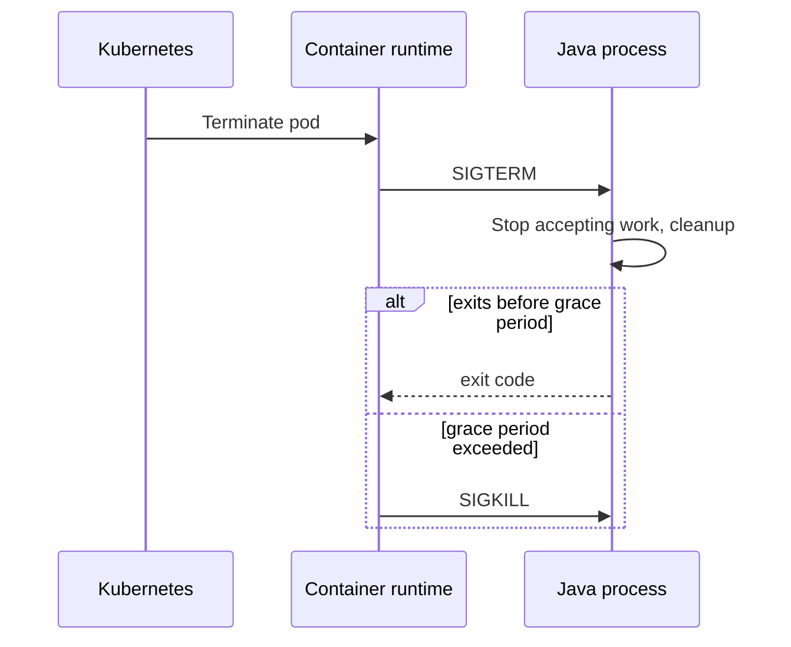

# Part 004 — Process, Signal, and Runtime Diagnosis

Backend Java service pada akhirnya adalah Linux process. JAX-RS endpoint, dependency injection, database pool, Kafka consumer, RabbitMQ listener, Redis client, HTTP server, scheduler, health check, dan metrics exporter semuanya hidup di dalam process. Jika process tidak start, restart loop, tidak shutdown graceful, CPU tinggi, memory bocor, port tidak listen, thread stuck, atau menerima signal yang salah, maka semua abstraksi aplikasi runtuh ke level runtime Linux.

Part ini membahas process dan signal sebagai mental model production debugging. Tujuannya bukan hanya bisa menjalankan `ps` atau `kill`, tetapi memahami lifecycle process, hubungan parent-child, signal, exit code, graceful shutdown, container termination, systemd awareness, dan cara mendiagnosis Java process dengan aman.

---

## 1. Core Mental Model

Process adalah instance program yang sedang berjalan. Program adalah file executable atau command. Process memiliki state runtime:

- PID;
- parent PID;
- user/group;
- current working directory;
- environment variables;
- open file descriptors;
- memory space;
- CPU scheduling state;
- signal handlers;
- exit code saat selesai;
- child processes jika ada.

Java service berjalan sebagai process `java`.

Contoh:

```bash
java -jar service.jar
```

Dari sisi Linux, ini adalah process biasa. JVM di dalamnya menjalankan banyak thread, tetapi semua tetap berada dalam satu process ID utama.

Dalam Docker/Kubernetes, process utama container biasanya adalah PID 1 di dalam namespace container. Ini memiliki implikasi khusus untuk signal handling dan zombie reaping.

---

## 2. Process ID and Parent Process

Setiap process punya PID.

Command:

```bash
ps -ef
ps aux
pgrep -af java
```

Contoh output:

```text
UID          PID    PPID  C STIME TTY          TIME CMD
app            1       0  2 10:00 ?        00:01:23 java -jar /app/service.jar
```

- `PID`: process ID.
- `PPID`: parent process ID.
- `CMD`: command yang dijalankan.

Process tree:

```bash
pstree -ap
```

Atau:

```bash
ps -eo pid,ppid,user,stat,etime,cmd --forest
```

### Why PPID matters

Parent process bertanggung jawab untuk menunggu child process selesai dan mengambil exit status-nya. Jika parent tidak melakukan reap child process, zombie bisa muncul.

Dalam shell script, command yang dipanggil bisa menjadi child process. Dalam container, wrapper script yang tidak melakukan `exec` dapat mengganggu signal propagation.

Contoh problem Docker entrypoint:

```bash
#!/usr/bin/env bash
java -jar /app/service.jar
```

Script menjadi PID 1, Java menjadi child. Jika signal dikirim ke PID 1, belum tentu diteruskan dengan benar ke Java process.

Pattern lebih baik:

```bash
#!/usr/bin/env bash
set -euo pipefail
exec java -jar /app/service.jar
```

`exec` mengganti shell dengan process Java, sehingga Java menjadi process utama dan menerima signal langsung.

---

## 3. Process State

`ps` dapat menunjukkan state process.

```bash
ps -eo pid,ppid,user,stat,etime,pcpu,pmem,cmd | head
```

State umum:

- `R`: running/runnable;
- `S`: sleeping interruptible;
- `D`: uninterruptible sleep, biasanya I/O wait;
- `T`: stopped/traced;
- `Z`: zombie;
- `I`: idle kernel thread;
- `+`: foreground process group;
- `l`: multi-threaded;
- `<`: high priority;
- `N`: low priority.

Untuk Java service, state `S` normal ketika menunggu network/request. State `R` terus-menerus dengan CPU tinggi perlu dicek. State `D` bisa menunjukkan stuck I/O, disk, network filesystem, atau kernel-level wait.

---

## 4. Zombie and Orphan Process

### Zombie process

Zombie adalah child process yang sudah selesai, tetapi parent belum mengambil exit status-nya.

Tanda:

```bash
ps aux | grep ' Z '
```

Zombie tidak memakai CPU signifikan, tetapi memakai entry process table. Banyak zombie menunjukkan parent process buruk dalam child reaping.

Dalam container, ini sering terjadi jika process PID 1 bukan init yang benar dan aplikasi/script membuat child process.

Mitigasi:

- gunakan `exec` di entrypoint script;
- gunakan minimal init seperti `tini` jika perlu;
- hindari shell wrapper yang spawning background process tanpa wait;
- pastikan process manager melakukan reap child.

### Orphan process

Orphan adalah process yang parent-nya mati. Biasanya akan diadopsi oleh init process.

Dalam container, orphan handling bergantung pada PID namespace dan PID 1.

Senior concern: startup script yang membuat background process bisa meninggalkan orphan yang tidak termonitor.

---

## 5. Foreground and Background Process

Di shell:

```bash
java -jar service.jar
```

Process berjalan foreground.

Background:

```bash
java -jar service.jar &
```

Lihat jobs:

```bash
jobs
fg %1
bg %1
```

Untuk production service, menjalankan process dengan `&` dalam script sering code smell kecuali benar-benar dikontrol dengan `wait`, signal trap, dan lifecycle management.

Problem umum:

```bash
java -jar service.jar &
echo "started"
```

Script selesai, container bisa exit, atau process menjadi orphan, tergantung konteks. CI step juga bisa “sukses” padahal service belum siap.

Untuk service readiness, gunakan health check atau wait loop eksplisit, bukan background command tanpa kontrol.

---

## 6. Signals

Signal adalah mekanisme Linux untuk memberi notifikasi ke process.

Signal penting:

- `SIGTERM` — request termination secara graceful;
- `SIGKILL` — paksa terminate, tidak bisa ditangkap;
- `SIGHUP` — terminal hangup/reload convention untuk beberapa daemon;
- `SIGINT` — interrupt dari keyboard, biasanya Ctrl+C;
- `SIGQUIT` — quit, pada JVM dapat menghasilkan thread dump ke stdout;
- `SIGUSR1`/`SIGUSR2` — custom signal untuk beberapa aplikasi;
- `SIGSTOP`/`SIGCONT` — stop/continue process.

Command:

```bash
kill -TERM <pid>
kill -KILL <pid>
kill -INT <pid>
kill -QUIT <pid>
```

Default `kill <pid>` adalah `SIGTERM`.

### SIGTERM vs SIGKILL

`SIGTERM` memberi kesempatan aplikasi cleanup:

- stop menerima request baru;
- close HTTP server;
- stop Kafka/RabbitMQ consumer;
- flush log/metrics;
- close DB connection;
- finish in-flight request jika diizinkan;
- release lock;
- exit dengan code tertentu.

`SIGKILL` langsung dihentikan oleh kernel. Aplikasi tidak bisa cleanup.

Senior rule: gunakan SIGTERM dulu kecuali ada alasan kuat. SIGKILL adalah last resort.

---

## 7. Exit Code

Process yang selesai mengembalikan exit code.

Di shell:

```bash
echo $?
```

Convention:

- `0`: success;
- non-zero: failure;
- `1`: general error;
- `2`: misuse/bad usage dalam banyak command;
- `126`: command found but not executable;
- `127`: command not found;
- `128+n`: process terminated by signal n.

Contoh jika process mati oleh SIGKILL signal 9:

```text
137 = 128 + 9
```

Ini sering terlihat di container/Kubernetes sebagai exit code 137, biasanya terkait OOMKill atau kill paksa.

SIGTERM signal 15:

```text
143 = 128 + 15
```

Dalam CI, exit code menentukan step success/failure. Dalam Kubernetes, exit code membantu memahami crash loop.

Debug Kubernetes:

```bash
kubectl describe pod -n <namespace> <pod>
kubectl get pod -n <namespace> <pod> -o jsonpath='{.status.containerStatuses[*].lastState}'
```

---

## 8. Commands for Process Inspection

### `ps`

```bash
ps -ef
ps aux
ps -eo pid,ppid,user,stat,etime,pcpu,pmem,cmd
```

Useful for:

- melihat process;
- melihat parent-child relation;
- melihat command line;
- melihat elapsed time;
- melihat CPU/memory basic.

### `pgrep`

```bash
pgrep -af java
pgrep -u app -af service.jar
```

Useful for mencari PID berdasarkan command.

### `top` and `htop`

```bash
top
htop
```

Useful for live CPU/memory observation.

Dalam container minimal, `htop` sering tidak tersedia.

### `pidstat`

Jika tersedia:

```bash
pidstat -p <pid> 1
pidstat -t -p <pid> 1
```

Useful untuk CPU per process/thread.

### `/proc`

Linux exposes process info via `/proc/<pid>`.

```bash
ls -la /proc/<pid>
cat /proc/<pid>/cmdline | tr '\0' ' '
cat /proc/<pid>/environ | tr '\0' '\n'
ls -l /proc/<pid>/cwd
ls -l /proc/<pid>/exe
ls -l /proc/<pid>/fd
cat /proc/<pid>/status
cat /proc/<pid>/limits
```

`/proc` adalah sumber evidence yang sangat kuat saat debugging production runtime.

Caution: `/proc/<pid>/environ` dapat berisi secret.

---

## 9. File Descriptors and Process

Process berinteraksi dengan file, socket, pipe, dan device melalui file descriptor.

Cek FD:

```bash
ls -l /proc/<pid>/fd
```

Atau:

```bash
lsof -p <pid>
```

FD penting untuk debugging:

- log file masih terbuka;
- deleted file masih memakan disk;
- socket connection banyak;
- file descriptor leak;
- limit terlalu rendah;
- process tidak bisa membuka file/socket baru.

Cek limit:

```bash
cat /proc/<pid>/limits
ulimit -n
```

Symptom:

```text
Too many open files
```

Untuk Java backend, FD digunakan oleh:

- network socket HTTP server/client;
- DB connection;
- Kafka/RabbitMQ connection;
- Redis connection;
- log file;
- JAR/resource file;
- temp file;
- epoll/kqueue related descriptor.

---

## 10. Nice and Renice

Linux scheduler menggunakan priority. `nice` menjalankan process dengan priority tertentu.

```bash
nice -n 10 command
renice 10 -p <pid>
```

Semakin tinggi nice value, semakin rendah priority CPU.

Untuk backend application, manual `renice` jarang menjadi solusi utama. Jika CPU issue terjadi di Kubernetes, biasanya lebih relevan melihat:

- CPU request/limit;
- throttling;
- thread pool;
- GC;
- hot loop;
- noisy neighbor;
- autoscaling;
- load pattern.

Gunakan `nice/renice` sebagai awareness, bukan default fix.

---

## 11. nohup and Long-Running Commands

`nohup` membuat command tetap berjalan setelah terminal hangup.

```bash
nohup long-command > output.log 2>&1 &
```

Ini berguna untuk admin task tertentu, tetapi dalam engineering workflow modern:

- service production sebaiknya dikelola systemd/container orchestrator;
- CI job sebaiknya eksplisit lifecycle-nya;
- background task manual harus punya audit trail;
- jangan menjalankan long-running production mutation secara manual tanpa runbook.

Senior concern: `nohup` bisa membuat process liar yang tidak terobservasi dan sulit dihubungkan ke change record.

---

## 12. systemd Awareness

Di VM/bare metal, service sering dikelola systemd.

Command:

```bash
systemctl status <service>
systemctl start <service>
systemctl stop <service>
systemctl restart <service>
journalctl -u <service>
journalctl -u <service> -f
```

systemd mengelola:

- service start/stop;
- restart policy;
- environment;
- working directory;
- user/group;
- resource limit;
- log via journald;
- dependency antar service.

Untuk cloud-native Kubernetes, systemd mungkin tidak langsung mengelola aplikasi, tetapi tetap relevan di node, CI runner, atau on-prem deployment.

Internal verification penting: apakah CSG/team menjalankan service hanya di Kubernetes, atau ada on-prem/systemd-style deployment juga.

---

## 13. Java Process Diagnosis

Java process perlu dilihat dari dua layer:

1. Linux process layer;
2. JVM/application layer.

Linux layer menjawab:

- process hidup?
- PID berapa?
- user siapa?
- command line apa?
- env apa?
- cwd mana?
- port listen?
- CPU/memory berapa?
- FD berapa?
- signal/exit code apa?

JVM layer menjawab:

- thread apa yang running/stuck?
- heap usage?
- GC behavior?
- classpath/module issue?
- deadlock?
- lock contention?
- connection pool stuck?
- request thread pool penuh?

Command Java tools jika tersedia:

```bash
jps -lv
jcmd <pid> VM.command_line
jcmd <pid> VM.system_properties
jcmd <pid> Thread.print
jcmd <pid> GC.heap_info
jstack <pid>
jmap -histo <pid>
```

Caution:

- tidak semua image production memiliki JDK tools;
- heap dump bisa besar dan mengandung sensitive data;
- thread dump bisa mengandung request data;
- command diagnostic bisa memberi overhead;
- beberapa command butuh permission user yang sama.

### Thread dump via SIGQUIT

Pada JVM, signal `SIGQUIT` dapat memicu thread dump ke stdout/stderr.

```bash
kill -QUIT <pid>
```

Di Kubernetes, output biasanya masuk container log.

Gunakan hati-hati. Pastikan log tidak membocorkan data sensitive.

---

## 14. Port and Listening Process

Backend service biasanya expose HTTP port dan membuka outbound connection ke dependency.

Cek port:

```bash
ss -ltnp
ss -tpn
lsof -iTCP -sTCP:LISTEN -P -n
lsof -i :8080
```

Failure mode:

- port conflict;
- service bind ke `127.0.0.1` bukan `0.0.0.0`;
- process listen tetapi health check path gagal;
- container port tidak sama dengan service port;
- Kubernetes Service targetPort salah;
- readiness belum ready;
- outbound connection stuck.

Untuk Java service local:

```bash
lsof -i :8080
kill -TERM <pid>
```

Jangan langsung `kill -9` kecuali process tidak responsif dan aman untuk dipaksa mati.

---

## 15. Container PID 1 Problem

Dalam container, process utama adalah PID 1 dalam PID namespace container. PID 1 punya perilaku khusus:

- signal handling default bisa berbeda;
- harus reap zombie child process;
- wrapper shell sebagai PID 1 bisa menghambat signal propagation;
- graceful shutdown Kubernetes bergantung pada signal diterima dengan benar.

Bad pattern:

```dockerfile
CMD sh -c "java -jar /app/service.jar"
```

Better pattern:

```dockerfile
ENTRYPOINT ["java", "-jar", "/app/service.jar"]
```

Atau jika perlu script:

```bash
#!/usr/bin/env bash
set -euo pipefail
# setup validation here
exec java -jar /app/service.jar
```

Kubernetes termination flow simplified:



Review concern:

- Does Java process receive SIGTERM?
- Does application stop consumers gracefully?
- Is termination grace period enough?
- Does readiness become false before shutdown?
- Are in-flight requests drained?

---

## 16. Graceful Shutdown for Java/JAX-RS Service

Graceful shutdown bukan hanya process berhenti. Untuk backend service, shutdown harus mempertimbangkan:

- HTTP server stops accepting new requests;
- in-flight requests diberi waktu selesai;
- DB transaction tidak ditinggalkan setengah jalan;
- Kafka/RabbitMQ consumer berhenti consume message baru;
- message in-flight di-ack/nack sesuai semantics;
- Redis lock/cache update tidak corrupt;
- scheduler berhenti;
- metrics/log flush;
- readiness berubah sebelum termination;
- shutdown timeout jelas.

Failure mode:

- SIGTERM tidak diterima karena shell wrapper;
- process mati karena SIGKILL setelah grace period;
- message duplicate karena consumer mati saat processing;
- order/quote workflow partial update;
- health check masih ready saat shutdown;
- connection pool close terlalu awal;
- deployment rolling update menyebabkan request gagal.

Senior review question:

> Jika pod menerima SIGTERM saat sedang memproses order/quote critical operation, apa yang terjadi?

---

## 17. Crash Loop Diagnosis

Di Kubernetes, process yang gagal start bisa menyebabkan CrashLoopBackOff.

Command:

```bash
kubectl get pods -n <namespace>
kubectl describe pod -n <namespace> <pod>
kubectl logs -n <namespace> <pod>
kubectl logs -n <namespace> <pod> --previous
```

`--previous` penting untuk melihat log container instance sebelumnya yang sudah crash.

Checklist:

- exit code apa?
- reason apa? `Error`, `OOMKilled`, `Completed`?
- log startup menunjukkan apa?
- command/args benar?
- env/config/secret ada?
- port bind gagal?
- permission denied?
- dependency external required saat startup down?
- liveness probe membunuh terlalu cepat?
- resource limit terlalu kecil?

Common exit codes:

- `1`: application error umum;
- `126`: command tidak executable;
- `127`: command tidak ditemukan;
- `137`: killed, sering OOMKill atau SIGKILL;
- `143`: terminated by SIGTERM.

---

## 18. Production-Safe Process Debugging

Prinsip utama:

1. read-only first;
2. capture evidence before action;
3. understand blast radius;
4. prefer graceful signal;
5. avoid killing unknown process;
6. avoid changing priority/resource manually without runbook;
7. preserve audit trail;
8. coordinate before production mutation.

Safe-ish read-only commands:

```bash
ps -ef
pgrep -af java
top -b -n 1
cat /proc/<pid>/status
cat /proc/<pid>/limits
ls -l /proc/<pid>/fd | head
ss -ltnp
```

Potentially sensitive commands:

```bash
cat /proc/<pid>/environ
jcmd <pid> VM.system_properties
jcmd <pid> Thread.print
jmap -dump:...
```

Mutating commands:

```bash
kill -TERM <pid>
kill -KILL <pid>
renice ...
systemctl restart ...
kubectl delete pod ...
kubectl rollout restart ...
```

Mutating commands need context, authorization, and rollback/impact awareness.

---

## 19. Debugging Playbook: Java Process Not Running

Symptom:

- service unavailable;
- port not listening;
- pod crash;
- CI service step failed;
- local app immediately exits.

Steps:

1. Check process existence.
2. Check startup log.
3. Check exit code.
4. Check command line.
5. Check working directory.
6. Check env/config/secret.
7. Check permission/file path.
8. Check Java/Maven artifact exists.
9. Check port conflict.
10. Check resource limit/OOM.

Commands:

```bash
pgrep -af java
ps -ef | grep java
ss -ltnp
```

Kubernetes:

```bash
kubectl describe pod -n <namespace> <pod>
kubectl logs -n <namespace> <pod> --previous
```

---

## 20. Debugging Playbook: Process Won't Stop

Symptom:

- deployment stuck terminating;
- local process ignores Ctrl+C;
- pod stuck Terminating;
- shutdown takes too long.

Steps:

1. Send/observe SIGTERM.
2. Check whether process receives signal.
3. Check wrapper script and PID 1.
4. Capture thread dump if Java stuck.
5. Check in-flight request/consumer shutdown.
6. Check blocked I/O or deadlock.
7. If timeout exceeded and approved, SIGKILL may be needed.

Commands:

```bash
kill -TERM <pid>
sleep 5
ps -p <pid> -o pid,stat,etime,cmd
kill -QUIT <pid>   # JVM thread dump, use carefully
```

Kubernetes:

```bash
kubectl describe pod -n <namespace> <pod>
kubectl logs -n <namespace> <pod> --since=10m
```

Review startup script for missing `exec`.

---

## 21. Debugging Playbook: High CPU

Steps:

1. Identify process.
2. Identify whether CPU is process-level or thread-level.
3. Capture thread dump.
4. Map OS thread ID to JVM thread if needed.
5. Check recent deploy/config/load change.
6. Check GC logs/metrics.
7. Check hot loop, serialization, regex, retry storm, polling loop, decompression, JSON processing, logging explosion.

Commands:

```bash
top -H -p <pid>
ps -L -p <pid> -o pid,tid,pcpu,pmem,stat,comm
jcmd <pid> Thread.print
```

Mapping thread ID:

```bash
printf '%x\n' <tid>
```

JVM thread dump uses hex `nid` for native thread ID.

Production caution: capture evidence first, avoid restart unless mitigation is approved.

---

## 22. Debugging Playbook: Memory/OOM

Symptoms:

- exit code 137;
- Kubernetes reason `OOMKilled`;
- high memory;
- GC overhead;
- `OutOfMemoryError`;
- container restart.

Steps:

1. Check container/pod last state.
2. Check memory limit.
3. Check JVM heap settings.
4. Check native memory/direct buffer/metaspace.
5. Check recent deploy/load.
6. Check heap dump policy.
7. Capture safe evidence.

Commands:

```bash
ps -o pid,rss,vsz,pmem,cmd -p <pid>
cat /proc/<pid>/status | grep -E 'VmRSS|VmSize|Threads'
jcmd <pid> GC.heap_info
jcmd <pid> VM.native_memory summary   # only if NMT enabled
```

Kubernetes:

```bash
kubectl describe pod -n <namespace> <pod>
kubectl top pod -n <namespace> <pod>
```

Caution: heap dump can contain PII, tokens, customer data, quote/order data, payloads, and secrets.

---

## 23. Process Lifecycle in CI

CI job is also process orchestration.

Common issues:

- test starts service in background but does not stop it;
- port remains occupied between steps;
- background process hides failure;
- pipeline succeeds while child process failed;
- missing `set -e` or `pipefail` masks error;
- logs not captured;
- process killed by CI timeout;
- signal handling bad on job cancellation.

Example bad script:

```bash
java -jar service.jar &
mvn verify
```

Better pattern:

```bash
#!/usr/bin/env bash
set -euo pipefail

java -jar service.jar > service.log 2>&1 &
SERVICE_PID=$!

cleanup() {
  kill -TERM "$SERVICE_PID" 2>/dev/null || true
  wait "$SERVICE_PID" 2>/dev/null || true
}
trap cleanup EXIT

./wait-for-health.sh http://localhost:8080/health
mvn verify
```

Even better: use test framework/Testcontainers or CI service container when appropriate.

---

## 24. Process and Messaging Systems

For Kafka/RabbitMQ consumers, process shutdown affects delivery semantics.

Questions:

- Does consumer stop polling before process exits?
- Are offsets committed before shutdown?
- Are messages acknowledged only after durable processing?
- What happens if SIGKILL occurs mid-message?
- Is duplicate processing safe?
- Is operation idempotent?
- Are order/quote state transitions protected from partial processing?

Process lifecycle is directly connected to business correctness. Signal handling is not only ops concern.

---

## 25. Process and Database Connections

On shutdown or crash:

- DB connections close;
- transactions rollback if connection closes before commit;
- connection pool shutdown order matters;
- long-running transaction may hold locks;
- abrupt kill can leave external side effects half-complete;
- migration process must not be killed mid-flight without recovery plan.

Debug commands may show process, but database-level evidence must also be checked using DB tooling. This series will keep DB internals outside this part, but process lifecycle must be considered in DB-impacting changes.

---

## 26. PR Review Checklist for Process/Signal Changes

Use this when PR touches Dockerfile, entrypoint script, startup command, shutdown hook, consumer lifecycle, scheduler, health checks, CI script, deployment manifest, or resource limits.

### Correctness

- Does process start command run the intended Java artifact?
- Is `exec` used in wrapper script?
- Does process receive SIGTERM?
- Are exit codes preserved?
- Are background processes waited and cleaned up?
- Is readiness/liveness compatible with startup and shutdown lifecycle?

### Production safety

- Is graceful shutdown implemented and tested?
- Is termination grace period sufficient?
- What happens to in-flight HTTP requests?
- What happens to Kafka/RabbitMQ messages in progress?
- What happens to DB transactions?
- Is SIGKILL a last resort only?

### Debuggability

- Can process command line be inspected?
- Are startup logs clear?
- Are exit reasons visible in Kubernetes/CI?
- Are thread dumps possible or documented?
- Are logs captured when CI background service fails?

### Security

- Does process run as non-root if required?
- Are env vars with secrets exposed in debug output?
- Are diagnostic dumps handled as sensitive data?
- Does startup script avoid printing secrets?

### Reproducibility

- Is local startup command same as CI/container where possible?
- Are Java/JVM options deterministic?
- Are process lifecycle scripts idempotent?
- Does CI cleanup background processes?

---

## 27. Internal Verification Checklist

Verifikasi hal berikut di internal repo, deployment, runbook, atau diskusi dengan senior/platform/SRE/security:

- Startup command service.
- Dockerfile `ENTRYPOINT`/`CMD`.
- Apakah entrypoint script memakai `exec`.
- User yang menjalankan process di container.
- Kubernetes termination grace period.
- Readiness/liveness/startup probe behavior.
- Shutdown hook framework/application.
- Consumer lifecycle untuk Kafka/RabbitMQ.
- Scheduler/background worker lifecycle.
- CI script yang menjalankan service background.
- Exit code yang sering muncul di incident.
- OOMKill history dan memory limit policy.
- Thread dump/heap dump runbook.
- Diagnostic data handling policy.
- Apakah `kubectl exec`, `kubectl debug`, atau JVM tools tersedia/diizinkan.
- systemd/on-prem deployment jika masih ada.

---

## 28. Practical Command Reference

```bash
# List process
ps -ef
ps aux
ps -eo pid,ppid,user,stat,etime,pcpu,pmem,cmd
pgrep -af java
pstree -ap

# Inspect process details
cat /proc/<pid>/cmdline | tr '\0' ' '
cat /proc/<pid>/environ | tr '\0' '\n'   # sensitive
ls -l /proc/<pid>/cwd
ls -l /proc/<pid>/exe
ls -l /proc/<pid>/fd
cat /proc/<pid>/status
cat /proc/<pid>/limits

# Live resource observation
top
top -H -p <pid>
htop
ps -L -p <pid> -o pid,tid,pcpu,pmem,stat,comm

# Signals
kill -TERM <pid>
kill -INT <pid>
kill -QUIT <pid>
kill -KILL <pid>

# Ports and sockets
ss -ltnp
ss -tpn
lsof -i :8080
lsof -p <pid>

# Java diagnostics if available
jps -lv
jcmd <pid> VM.command_line
jcmd <pid> VM.system_properties
jcmd <pid> Thread.print
jcmd <pid> GC.heap_info
jstack <pid>

# Kubernetes process/runtime diagnosis
kubectl get pods -n <namespace>
kubectl describe pod -n <namespace> <pod>
kubectl logs -n <namespace> <pod>
kubectl logs -n <namespace> <pod> --previous
kubectl exec -n <namespace> <pod> -- ps -ef
kubectl exec -n <namespace> <pod> -- ss -ltnp
```

---

## 29. Senior Engineer Summary

Process and signal diagnosis menghubungkan aplikasi Java dengan realitas runtime Linux. Banyak production issue tidak bisa dipahami hanya dari code:

- container tidak shutdown karena PID 1 salah;
- message duplicate karena SIGKILL saat consumer memproses;
- CI flaky karena background process tidak dibersihkan;
- pod CrashLoop karena config missing;
- exit code 137 karena memory limit;
- port conflict karena process lama belum mati;
- disk space tidak kembali karena deleted file masih dipegang FD;
- debugging gagal karena evidence diambil setelah restart.

Senior backend engineer harus mampu bergerak dari symptom ke process evidence: PID, PPID, command, user, cwd, env, FD, port, signal, exit code, log, thread dump, dan orchestrator state.

Runtime diagnosis yang baik selalu mengutamakan evidence, graceful action, minimal blast radius, dan auditability.
