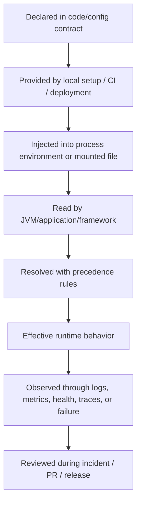

# Environment Variables and Runtime Configuration

Environment variables are one of the most common places where enterprise backend systems hide behavior.

A Java/JAX-RS service may look identical in source code, but behave differently because one runtime has a different `JAVA_HOME`, JVM option, feature flag, database URL, Kafka bootstrap server, Redis host, TLS truststore path, timezone, active profile, proxy setting, or secret reference.

For a senior backend engineer, runtime configuration is not just "things in env vars". It is the boundary between:

- source code and deployed behavior
- build-time assumptions and runtime reality
- local setup and CI execution
- container image and Kubernetes deployment
- safe default and environment-specific override
- reproducibility and "works on my machine"

This part focuses on environment variables and runtime configuration as a debugging, review, and production-safety discipline.

---

## 1. Core Concept

An environment variable is a key-value pair inherited by a process from its parent process.

A Java process does not magically know its configuration. It receives configuration through a combination of:

- command-line arguments
- JVM system properties
- environment variables
- files mounted into the filesystem
- application config files
- config servers
- secrets managers
- Kubernetes ConfigMaps and Secrets
- CI variables
- default values in code
- framework-specific profile resolution

In a production-grade service, the question is not only:

> What value is configured?

The better question is:

> From which source did the runtime receive the value, which source has precedence, who controls it, and how can we prove what value was effective at runtime?

---

## 2. Why Runtime Configuration Exists

Runtime configuration exists because one build artifact should usually be deployable into multiple environments.

A good system avoids rebuilding the application just to change:

- database endpoint
- message broker endpoint
- Redis endpoint
- API base URL
- log level
- feature flag
- timeout
- retry count
- thread pool size
- TLS truststore
- credentials
- external integration endpoint
- deployment region
- environment name
- observability exporter

This is especially important for Java/JAX-RS services running in microservices environments where the same artifact may move through:

```text
local -> CI -> dev -> test -> staging -> preprod -> production
```

The artifact should be stable. The runtime context changes.

---

## 3. Environment Variable Lifecycle

A runtime config value usually follows this lifecycle:



A senior engineer should know where a value enters the system and how to trace it to effective behavior.

---

## 4. Environment Variables in Linux

In Linux, every process has an environment.

Common commands:

```bash
env
printenv
printenv PATH
echo "$PATH"
export APP_ENV=local
APP_ENV=local ./run-service.sh
```

Important distinction:

```bash
APP_ENV=local
```

This creates a shell variable, not automatically visible to child processes.

```bash
export APP_ENV=local
```

This exports the variable so child processes can inherit it.

One-shot process environment:

```bash
APP_ENV=local LOG_LEVEL=debug java -jar app.jar
```

This sets variables only for that command execution.

---

## 5. Shell Variable vs Environment Variable

Example:

```bash
APP_ENV=local
java -jar app.jar
```

The Java process may not see `APP_ENV`.

Correct:

```bash
export APP_ENV=local
java -jar app.jar
```

Or:

```bash
APP_ENV=local java -jar app.jar
```

Debug with:

```bash
printenv APP_ENV
```

For a running process, environment can sometimes be inspected through `/proc`:

```bash
tr '\0' '\n' < /proc/<pid>/environ
```

Be careful: this may expose secrets.

---

## 6. PATH

`PATH` controls where the shell searches for executable commands.

Example:

```bash
echo "$PATH"
which java
which mvn
command -v java
command -v mvn
```

A common failure mode:

```text
Local uses Java 21.
CI uses Java 17.
Container runtime uses Java 17.
Developer shell accidentally uses Java 11.
```

The command `java` is not an abstract concept. It resolves to a concrete executable on disk.

```bash
readlink -f "$(command -v java)"
java -version
```

For Maven:

```bash
command -v mvn
mvn -version
./mvnw -version
```

A senior engineer should avoid relying on "whatever `mvn` means on my machine" when the repository provides Maven Wrapper.

---

## 7. JAVA_HOME

`JAVA_HOME` usually points to the root directory of a JDK installation.

Example:

```bash
echo "$JAVA_HOME"
"$JAVA_HOME/bin/java" -version
```

Common failure modes:

- `JAVA_HOME` points to a JRE instead of a JDK.
- `JAVA_HOME` points to Java 8 while project requires Java 17 or 21.
- `PATH` uses a different Java than `JAVA_HOME`.
- IDE uses one JDK, terminal uses another.
- CI uses another JDK entirely.
- Docker build image uses a different JDK from runtime image.

Debug:

```bash
java -version
javac -version
echo "$JAVA_HOME"
readlink -f "$(command -v java)"
readlink -f "$(command -v javac)"
```

For Maven builds:

```bash
mvn -version
./mvnw -version
```

Maven reports the Java runtime it is using. That value matters more than what you think your shell is using.

---

## 8. MAVEN_OPTS

`MAVEN_OPTS` configures JVM options for the Maven process itself.

Example:

```bash
export MAVEN_OPTS="-Xmx2g -Dhttps.proxyHost=proxy.example.com"
mvn verify
```

This is not the same as configuring JVM options for your application at runtime.

`MAVEN_OPTS` affects:

- Maven memory
- Maven JVM system properties
- Maven proxy behavior
- TLS truststore used by Maven
- plugin execution environment

It does not automatically configure the service launched later unless that service is executed inside the same Maven process or plugin context.

Common failure modes:

- Maven build fails with OOM because `MAVEN_OPTS` too small.
- Maven dependency resolution fails due to proxy/truststore mismatch.
- CI sets `MAVEN_OPTS`, local does not.
- Local shell profile sets hidden `MAVEN_OPTS` that changes test behavior.

Debug:

```bash
echo "$MAVEN_OPTS"
mvn -version
mvn -X validate
```

Use `mvn -X` carefully because debug logs may expose sensitive values.

---

## 9. JVM Options

JVM options control the Java process.

Examples:

```bash
java -Xms512m -Xmx2g -jar app.jar
java -Dapp.env=local -jar app.jar
java -Duser.timezone=UTC -jar app.jar
java -Djavax.net.ssl.trustStore=/path/to/truststore.jks -jar app.jar
```

Common categories:

| Category | Examples | Risk |
|---|---|---|
| Memory | `-Xms`, `-Xmx`, `MaxRAMPercentage` | OOM, underutilization, container mismatch |
| GC | `-XX:+UseG1GC`, GC logging | latency, CPU overhead |
| System property | `-Dkey=value` | hidden config precedence |
| Security/TLS | truststore, keystore | broken outbound TLS |
| Debugging | JDWP | remote debug exposure |
| Observability | Java agent, exporter | startup failure, performance overhead |
| Encoding/timezone | `file.encoding`, `user.timezone` | data/time bugs |

For Java services in containers, JVM memory settings must be reviewed together with Kubernetes memory limits.

Example problem:

```text
Pod memory limit: 512Mi
JVM max heap: 1g
Result: container OOMKilled
```

---

## 10. Application Profile

Many Java services use profiles, such as:

- `local`
- `dev`
- `test`
- `staging`
- `prod`
- `integration-test`

The exact mechanism depends on the framework and codebase.

For a JAX-RS/Jakarta RESTful service, the profile might be handled by:

- application config library
- dependency injection framework
- MicroProfile Config
- Spring if used elsewhere
- custom internal config loader
- Maven profile for build-time behavior
- environment variable for runtime behavior

Do not assume the profile mechanism. Verify it.

Typical profile failure modes:

- wrong profile in CI
- local profile accidentally points to shared environment
- production profile missing required default
- test profile disables auth or external integration
- profile name exists in docs but not in code
- Maven profile confused with runtime profile

A Maven profile and an application runtime profile are different concepts.

---

## 11. Config Precedence

Config precedence means: when the same logical setting appears in multiple places, which value wins?

Example sources:

1. default value in code
2. default config file
3. environment-specific config file
4. mounted config file
5. environment variable
6. JVM system property
7. command-line argument
8. config server value
9. secret manager value

The order is not universal. It depends on the application framework and internal conventions.

A robust system should document precedence explicitly.

Bad situation:

```text
README says APP_TIMEOUT controls timeout.
Kubernetes sets APP_TIMEOUT=5000.
JVM starts with -Dapp.timeout=1000.
Code default is 30000.
Nobody knows which wins.
```

Senior-level review question:

> Can we prove the effective value used by the running process?

---

## 12. Local Config

Local config should be:

- easy to bootstrap
- safe by default
- isolated from shared environments
- explicit about secrets
- not committed with personal values
- close enough to CI behavior
- documented in README or local setup guide

Common local config files:

```text
.env
.env.example
application-local.yml
local.properties
docker-compose.yml
scripts/run-local.sh
```

Risk areas:

- `.env` accidentally committed
- local profile connects to staging database
- developer-specific absolute path
- missing `.env.example`
- stale setup instructions
- secrets copied into shell history

Recommended pattern:

```text
.env.example      committed, non-secret template
.env              ignored, developer-specific
README.md         explains how to obtain values safely
scripts/check-env.sh validates required variables
```

---

## 13. CI Config

CI config should be deterministic and reviewable.

CI variables often include:

- Java version
- Maven options
- artifact repository credentials
- registry credentials
- test database connection
- scan tokens
- deployment role
- environment name
- build metadata
- commit SHA
- branch name
- tag name

Failure modes:

- CI uses secret not available to fork PRs
- CI variable shadowed by workflow env
- branch-specific variable missing
- environment approval not configured
- stale secret breaks deploy
- cached config masks problem
- different Java/Maven version from local

Debug CI config carefully. Never print secrets. Print only safe metadata.

Safe-ish example:

```bash
echo "Java:"
java -version

echo "Maven:"
./mvnw -version

echo "Branch: ${GITHUB_REF_NAME:-unknown}"
echo "Commit: ${GITHUB_SHA:-unknown}"
```

Avoid:

```bash
env
printenv
```

in CI logs unless sanitized. It may expose sensitive values.

---

## 14. Container Config

In containers, environment variables are often injected at container start.

Example:

```bash
docker run \
  -e APP_ENV=local \
  -e LOG_LEVEL=debug \
  my-service:local
```

Inspect:

```bash
docker inspect <container>
docker exec <container> printenv APP_ENV
```

Important distinction:

- Docker image build-time arguments are not the same as runtime environment variables.
- A value baked into an image is harder to change safely.
- A runtime env var can change behavior without changing the image.

Dockerfile example:

```dockerfile
ARG BUILD_VERSION
ENV APP_HOME=/app
```

`ARG` exists during image build. `ENV` persists into the image runtime environment.

Failure modes:

- secret accidentally baked into image layer
- build-time arg mistaken for runtime config
- runtime env missing in Kubernetes
- env var name mismatch
- default in image masks missing deployment config

---

## 15. Kubernetes Environment Variables

Kubernetes may inject config through:

- `env`
- `envFrom`
- ConfigMap
- Secret
- Downward API
- mounted files
- projected volumes
- service account tokens
- Helm/Kustomize rendered manifests
- GitOps-managed deployment values

Example:

```yaml
env:
  - name: APP_ENV
    value: "prod"
  - name: DATABASE_URL
    valueFrom:
      secretKeyRef:
        name: my-service-db
        key: url
```

Debug:

```bash
kubectl describe pod <pod-name>
kubectl exec <pod-name> -- printenv APP_ENV
kubectl get deploy <deployment-name> -o yaml
```

Be careful with `kubectl describe` and `kubectl get ... -o yaml` because secrets may be referenced or exposed depending on object type and access.

Do not casually dump secrets in terminal logs, screenshots, or chat.

---

## 16. ConfigMap vs Secret

A ConfigMap is for non-sensitive configuration.

A Secret is for sensitive data, but Kubernetes Secrets are not magical security. They require correct RBAC, encryption-at-rest configuration, and operational discipline.

Use Secret for:

- passwords
- API tokens
- private keys
- client secrets
- database credentials
- signing keys

Use ConfigMap for:

- endpoint names
- feature toggles that are not sensitive
- log level
- timeout values
- thread pool settings
- non-secret config templates

Failure modes:

- secret stored in ConfigMap
- secret printed in startup logs
- secret passed in command-line argument visible via process listing
- secret committed in Helm values
- secret copied into incident notes
- overly broad RBAC can read secrets

---

## 17. Secrets in Environment Variables

Secrets in env vars are common, but risky.

Risks:

- visible through process environment to sufficiently privileged users
- dumped by `env`
- accidentally logged by debug tooling
- inherited by child processes
- exposed in CI logs
- captured in crash diagnostics
- copied into support screenshots

Alternatives may include:

- mounted secret files
- cloud secrets manager
- external secrets operator
- workload identity/OIDC
- short-lived credentials
- service mesh identity
- IAM/RBAC-based access

Senior-level stance:

> Environment variables are acceptable for some secrets only if the platform has accepted that risk and compensating controls exist. Do not invent secret handling patterns locally.

---

## 18. Runtime Configuration in Java/JAX-RS

In Java/JAX-RS services, configuration may influence:

- base URL routing
- resource class behavior
- dependency injection wiring
- database connection pool
- transaction timeout
- Kafka producer/consumer config
- RabbitMQ connection/channel config
- Redis client config
- HTTP client timeout
- TLS truststore
- auth token validation
- OpenAPI exposure
- logging format and level
- tracing exporter
- feature flags

Example failure:

```text
A JAX-RS endpoint works locally.
In Kubernetes, it returns 500.
Root cause: runtime profile did not load the expected database schema config.
```

Another example:

```text
Kafka consumer lag grows in staging.
Root cause: consumer group ID accidentally same as another environment due to env var reuse.
```

Runtime config is part of application correctness.

---

## 19. Impact on Docker, Kubernetes, AWS, Azure, and GitOps

### Docker

Config must not be confused with image content.

Review question:

> Can this image be promoted unchanged across environments?

### Kubernetes

Config must be explicit in manifests, Helm values, or GitOps overlays.

Review question:

> Is the effective config visible through deployment manifests or controlled by hidden manual state?

### AWS/Azure

Config may come from:

- Secrets Manager / Key Vault
- Parameter Store / App Configuration
- IAM/RBAC
- managed identity
- private endpoints
- DNS zones
- container registry
- cloud logging/monitoring

Review question:

> Is this config tied to the right account, subscription, region, tenant, and identity?

### GitOps

GitOps expects desired state to be stored in Git.

Review question:

> Is runtime config represented declaratively, or changed manually in the cluster?

---

## 20. Failure Modes

Common runtime configuration failure modes:

| Failure Mode | Typical Symptom |
|---|---|
| Missing env var | startup failure, null config, default fallback |
| Wrong env var name | value ignored |
| Wrong profile | wrong endpoint, wrong feature behavior |
| Wrong Java version | build/runtime mismatch |
| Wrong `JAVA_HOME` | Maven uses unexpected JDK |
| Wrong `PATH` | wrong tool invoked |
| Wrong secret | auth failure, connection failure |
| Expired secret | sudden production failure |
| ConfigMap not rolled out | pod still uses old value |
| Kubernetes Secret changed but pod not restarted | old env value remains |
| Maven profile confused with runtime profile | local/CI mismatch |
| JVM option conflicts with container limit | OOMKill or throttling |
| TLS truststore path wrong | outbound HTTPS failure |
| Proxy env missing | dependency download or API call failure |
| Timezone mismatch | date bug, scheduling bug |
| Region/subscription mismatch | cloud resource not found |

---

## 21. How to Detect Configuration Failure

Start with evidence.

Useful checks:

```bash
# Java and Maven
java -version
javac -version
./mvnw -version

# Environment
printenv APP_ENV
printenv JAVA_HOME
printenv MAVEN_OPTS

# Process
ps -ef | grep java

# Container
docker exec <container> printenv

# Kubernetes
kubectl describe pod <pod>
kubectl logs <pod>
kubectl exec <pod> -- printenv APP_ENV
kubectl get deploy <deployment> -o yaml
```

Application-level evidence:

- startup logs
- config validation errors
- health endpoint
- readiness failure
- connection pool logs
- Kafka/RabbitMQ client logs
- Redis connection logs
- TLS handshake error
- structured log fields
- metrics labels
- trace resource attributes

Important: do not log full secrets while debugging.

---

## 22. Debugging Env Mismatch

A reliable workflow:

1. Identify the exact symptom.
2. Identify the environment where it happens.
3. Capture version metadata:
   - commit SHA
   - artifact version
   - image tag
   - deployment timestamp
   - runtime profile
4. Compare effective config between working and failing environment.
5. Check config source and precedence.
6. Check secret age/rotation.
7. Check whether pods restarted after config change.
8. Check whether CI/deploy pipeline injected different values.
9. Reproduce with minimal command.
10. Document the root cause and fix.

Example comparison:

```bash
# Local
java -version
./mvnw -version
printenv APP_ENV
printenv JAVA_HOME

# Kubernetes
kubectl exec <pod> -- java -version
kubectl exec <pod> -- printenv APP_ENV
kubectl exec <pod> -- printenv JAVA_HOME
```

For sensitive values, compare hashes or existence, not raw values:

```bash
kubectl exec <pod> -- sh -c 'test -n "$DATABASE_URL" && echo "DATABASE_URL present"'
```

---

## 23. Correctness Concerns

Runtime configuration affects correctness when it changes:

- business rule thresholds
- feature flags
- validation strictness
- integration endpoint
- database schema target
- message topic/queue/exchange
- tenant/customer routing
- idempotency key store
- retry/backoff behavior
- timeout behavior
- timezone and locale
- serialization compatibility
- API compatibility flags

Senior review questions:

- What is the safe default?
- What happens when the value is absent?
- Is invalid config detected at startup?
- Is there fail-fast validation?
- Is fallback behavior safe?
- Can the effective value be observed?
- Does config change require restart?
- Is the config backward compatible?

---

## 24. Productivity Concerns

Bad configuration design slows engineers down.

Symptoms:

- onboarding requires undocumented environment variables
- local setup depends on tribal knowledge
- CI and local use different commands
- error message says "connection failed" but not which config key
- scripts silently use defaults
- developers copy secrets into shell profiles
- `.env.example` is stale
- config changes require multiple repositories
- one missing env var causes misleading runtime error

Good productivity patterns:

- `check-env` script
- `.env.example`
- clear README
- fail-fast validation
- safe local defaults
- explicit profile names
- minimal required secrets for local
- reproducible local dependency setup

---

## 25. Security Concerns

Configuration is a major security surface.

Risk areas:

- secret in Git
- secret in shell history
- secret in logs
- secret in CI output
- secret in Docker layer
- secret in ConfigMap
- overprivileged service account
- long-lived static token
- exposed debug port
- insecure TLS flag
- disabled certificate validation
- production endpoint used from local
- shared credentials across environments

Dangerous examples:

```bash
curl -H "Authorization: Bearer $TOKEN" ...
```

This may be stored in shell history depending on shell settings.

More dangerous:

```bash
export TOKEN=my-secret-value
env
```

The secret may be printed, copied, or logged.

Safer approach:

- use secret manager
- use short-lived credentials
- avoid printing full values
- use read-only credentials for debugging
- avoid committing local config
- rotate secrets after leakage
- follow internal security policy

---

## 26. Reproducibility Concerns

A workflow is not reproducible if behavior depends on:

- hidden shell profile
- unpinned Java version
- unpinned Maven version
- local-only environment variable
- stale `.env`
- local cache
- timezone
- locale
- OS-specific path
- manually edited Kubernetes config
- untracked secret value
- CI variable not visible in code review

Reproducibility review questions:

- Can a new engineer reproduce this from documentation?
- Can CI reproduce local behavior?
- Can staging reproduce production behavior?
- Can we identify the exact config used for a release?
- Can we rebuild the artifact with the same tool versions?
- Can we explain all environment-specific differences?

---

## 27. Release Concerns

Release failures often come from configuration mismatch, not code.

Examples:

- new required env var not added to deployment manifests
- feature flag default unsafe
- secret missing in target environment
- config key renamed without backward compatibility
- Kubernetes Secret updated but pods not restarted
- Helm values changed but GitOps did not sync
- release note forgot config migration
- rollback incompatible with new config shape
- old version cannot run with new config

Release checklist:

- Are new config keys documented?
- Are defaults safe?
- Are required keys validated at startup?
- Are all environments updated?
- Is rollback compatible?
- Are secrets provisioned?
- Is config represented in GitOps?
- Are config changes included in release notes?
- Is there a smoke test that validates config path?

---

## 28. Observability and Incident-Support Concerns

During incident response, engineers need to know effective runtime state.

Do expose:

- application version
- commit SHA
- runtime profile
- environment name
- safe feature flag state
- non-sensitive endpoint labels
- dependency health
- config validation status
- JVM version
- startup arguments with secrets redacted

Do not expose:

- passwords
- access tokens
- private keys
- raw connection strings with credentials
- full secret-mounted files
- internal customer-sensitive payloads

Good operational pattern:

```text
/service/info
/service/health
/service/config-diagnostics   # if allowed, redacted and access-controlled
```

Whether such endpoints exist depends on internal policy.

---

## 29. PR Review Checklist

When reviewing a change involving runtime config, ask:

- Is this build-time config or runtime config?
- Is the config key name consistent?
- Is the default safe?
- Is invalid config rejected early?
- Is the config documented?
- Is `.env.example` updated?
- Is Kubernetes/Helm/GitOps config updated?
- Is CI config updated?
- Are secrets handled correctly?
- Is rollback compatible?
- Are tests updated?
- Is the effective config observable?
- Does this change affect local setup?
- Does this affect release notes?
- Does this introduce environment-specific behavior?
- Could this config drift between local, CI, staging, and production?

---

## 30. Internal Verification Checklist

Verify these in the actual CSG/team context instead of assuming:

- Required Java version.
- Required Maven version.
- Whether Maven Wrapper is mandatory.
- Runtime profile mechanism.
- Config precedence rules.
- Required environment variables.
- `.env.example` or equivalent template.
- Local setup guide.
- Secret injection mechanism.
- Whether secrets are env vars, mounted files, cloud secret references, or something else.
- Kubernetes ConfigMap/Secret pattern.
- Helm/Kustomize/GitOps layout.
- CI variables and protected environment variables.
- Artifact/image promotion model.
- Feature flag mechanism.
- Observability endpoint exposing safe runtime metadata.
- Policy for printing config diagnostics.
- Policy for handling secret leakage.
- Release checklist for config changes.
- Rollback compatibility expectations.

---

## 31. Practical Commands

Local:

```bash
java -version
javac -version
echo "$JAVA_HOME"
readlink -f "$(command -v java)" 2>/dev/null || command -v java

./mvnw -version
echo "$MAVEN_OPTS"

printenv | sort
```

Be careful with `printenv | sort` if secrets are present.

Container:

```bash
docker exec <container> printenv APP_ENV
docker inspect <container>
```

Kubernetes:

```bash
kubectl get deploy <name> -o yaml
kubectl describe pod <pod>
kubectl exec <pod> -- printenv APP_ENV
kubectl logs <pod>
```

GitHub Actions:

```yaml
- name: Print safe runtime metadata
  run: |
    java -version
    ./mvnw -version
    echo "branch=${GITHUB_REF_NAME}"
    echo "sha=${GITHUB_SHA}"
```

---

## 32. Senior Mental Model

Runtime configuration is a contract.

It connects:

```text
Code expectation
-> build artifact
-> deployment manifest
-> platform secret/config source
-> process environment
-> JVM/application config resolution
-> runtime behavior
-> observability evidence
-> incident/debug/release review
```

When that contract is vague, production behavior becomes accidental.

A senior engineer should make runtime configuration:

- explicit
- validated
- documented
- observable
- secure
- reproducible
- rollback-aware
- reviewable
- owned

The best configuration system is not the one with the most knobs. It is the one where every knob has a clear owner, default, validation rule, lifecycle, and operational consequence.
