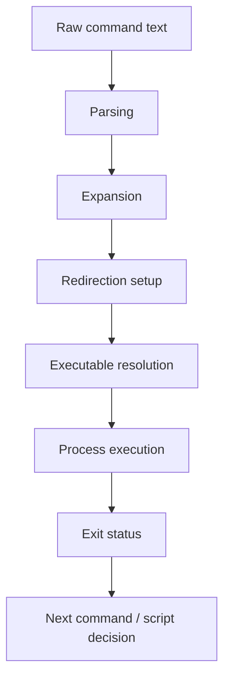

# Shell Fundamentals

The shell is the command execution layer most engineers use every day but often understand only partially.

For a senior backend engineer, this is dangerous. A shell command can:

- start a Java service
- delete generated files
- rewrite a Git branch
- deploy an artifact
- inspect production logs
- copy secrets into logs
- run a CI step
- modify Kubernetes resources
- patch release metadata
- mask a failed command inside a pipeline

Shell fluency is not about memorizing many commands. It is about understanding how the shell transforms text into process execution.

This part focuses on Bash and shell fundamentals needed for safe daily work, automation, CI/CD, debugging, and production support.

---

## 1. Core Concept

A shell is a program that reads commands, expands them, resolves executables, starts processes, connects input/output streams, and returns exit status.

When you type:

```bash
grep "ERROR" app.log | tail -20
```

the shell does more than pass text to `grep`.

It:

1. parses the command line
2. applies quoting rules
3. expands variables
4. expands globs
5. resolves executables
6. creates pipes
7. starts processes
8. connects stdout/stdin
9. waits for command completion
10. returns an exit status

Most shell bugs come from misunderstanding one of those steps.

---

## 2. Why Shell Fundamentals Matter

Shell mistakes are disproportionately costly because shell sits at high-leverage points:

| Area | Shell Impact |
|---|---|
| Local development | run, build, test, clean, seed data |
| CI/CD | build steps, deploy steps, scan steps |
| Release | tagging, packaging, publishing |
| Debugging | logs, network checks, process inspection |
| Kubernetes | `kubectl` scripts and one-liners |
| Security | secrets, tokens, file permissions |
| Git | branch cleanup, rebase helpers, hooks |
| Maven | build commands, profile activation, wrapper usage |

A wrong shell assumption can become:

- deleted local work
- skipped test
- hidden CI failure
- leaked secret
- wrong environment deployment
- invalid release artifact
- misleading incident evidence

---

## 3. Shell Lifecycle

A shell command roughly follows this lifecycle:



Important: expansion happens before execution.

That means a command may behave differently than it visually appears.

---

## 4. Bash vs Shell

"Shell" is a category. Bash is a specific shell.

Common shells:

- `sh`
- `bash`
- `zsh`
- `dash`
- `fish`
- PowerShell

In many CI/container environments, `/bin/sh` may not be Bash.

Example:

```bash
#!/usr/bin/env bash
```

This explicitly asks for Bash.

Example:

```bash
#!/bin/sh
```

This asks for POSIX shell, which may be `dash`, `ash`, or another implementation.

Bash-specific features may fail under `sh`:

```bash
[[ "$name" == foo* ]]
array=(a b c)
set -o pipefail
```

Senior rule:

> If a script uses Bash features, declare Bash explicitly.

---

## 5. Command Resolution

When you type:

```bash
mvn verify
```

the shell resolves `mvn` using `PATH`.

Check:

```bash
command -v mvn
type mvn
which mvn
```

Prefer:

```bash
command -v mvn
```

because it is shell-aware and usually more reliable than `which`.

For Java/Maven projects, prefer repository-provided wrapper when available:

```bash
./mvnw verify
```

This avoids depending on whichever Maven version is installed globally.

---

## 6. Variables

Shell variable:

```bash
APP_ENV=local
echo "$APP_ENV"
```

Environment variable:

```bash
export APP_ENV=local
java -jar app.jar
```

One-command variable:

```bash
APP_ENV=local java -jar app.jar
```

Variable expansion:

```bash
echo "$APP_ENV"
```

Default value:

```bash
echo "${APP_ENV:-local}"
```

Require value:

```bash
: "${APP_ENV:?APP_ENV is required}"
```

This is useful in scripts to fail fast when required configuration is missing.

---

## 7. Quoting

Quoting is one of the most important shell skills.

### No quote

```bash
echo $NAME
```

Risk:

- word splitting
- glob expansion
- empty variable surprises

### Double quote

```bash
echo "$NAME"
```

Allows variable expansion but prevents word splitting and glob expansion.

Usually correct for variables.

### Single quote

```bash
echo '$NAME'
```

Literal text. No variable expansion.

### Escape

```bash
echo "\$NAME"
```

Escapes a special character.

Senior default:

> Quote variables unless you intentionally want word splitting or glob expansion.

---

## 8. Quoting Failure Example

Bad:

```bash
rm -rf $BUILD_DIR/*
```

If `BUILD_DIR` is empty, this may become:

```bash
rm -rf /*
```

or behave dangerously depending on shell and command safeguards.

Better:

```bash
: "${BUILD_DIR:?BUILD_DIR is required}"
rm -rf "$BUILD_DIR"/*
```

Even better for destructive script:

```bash
: "${BUILD_DIR:?BUILD_DIR is required}"

case "$BUILD_DIR" in
  /tmp/my-project-build/*) rm -rf "$BUILD_DIR"/* ;;
  *) echo "Refusing to clean unsafe BUILD_DIR=$BUILD_DIR" >&2; exit 1 ;;
esac
```

Shell safety is about explicit guardrails, not confidence.

---

## 9. Word Splitting

Unquoted variables are split on whitespace.

Example:

```bash
FILE="my log.txt"
cat $FILE
```

The shell sees:

```bash
cat my log.txt
```

Correct:

```bash
cat "$FILE"
```

This matters for:

- file paths
- Maven arguments
- Git branch names
- commit messages
- JSON values
- Kubernetes context names
- secret values
- URLs with query parameters

---

## 10. Globbing

Globs are shell filename patterns:

```bash
ls *.log
rm *.tmp
```

Common patterns:

| Pattern | Meaning |
|---|---|
| `*` | any string |
| `?` | one character |
| `[abc]` | one of characters |
| `[0-9]` | range |

Globbing happens before command execution.

Example:

```bash
grep ERROR *.log
```

The shell expands `*.log` into matching filenames before `grep` runs.

Failure modes:

- pattern matches too many files
- pattern matches no files
- unexpected file names containing spaces
- destructive command with broad glob
- different behavior across shell options

In Bash, if no match exists, the pattern may remain literal unless `nullglob` is set.

---

## 11. Command Substitution

Command substitution captures command output:

```bash
CURRENT_BRANCH="$(git branch --show-current)"
echo "$CURRENT_BRANCH"
```

Prefer `$(...)` over backticks:

```bash
# Avoid
CURRENT_BRANCH=`git branch --show-current`
```

Command substitution strips trailing newlines.

Be careful with multi-line output:

```bash
FILES="$(find . -name '*.java')"
```

This is often unsafe because filenames can contain spaces/newlines.

Better patterns may involve arrays in Bash or null-delimited streams.

---

## 12. Exit Status

Every command exits with a status code.

Convention:

```text
0     success
non-0 failure
```

Check last exit status:

```bash
echo "$?"
```

Example:

```bash
grep "ERROR" app.log
echo "$?"
```

In scripts:

```bash
if grep -q "ERROR" app.log; then
  echo "Errors found"
else
  echo "No errors found"
fi
```

Do not parse command output when exit status is the intended signal.

---

## 13. Pipes

A pipe connects stdout of one process to stdin of another.

```bash
cat app.log | grep ERROR | tail -20
```

Often simpler:

```bash
grep ERROR app.log | tail -20
```

Pipelines are powerful for logs and evidence extraction:

```bash
kubectl logs deploy/my-service \
  | grep "correlationId=abc123" \
  | tail -50
```

But pipelines have subtle failure behavior.

By default, in many shells, the pipeline exit status is the exit status of the last command.

Example:

```bash
false | true
echo "$?"
```

This may output `0`.

In Bash scripts, use:

```bash
set -o pipefail
```

so the pipeline fails if any command fails.

---

## 14. Redirection

Redirection controls stdin, stdout, and stderr.

```bash
command > output.txt       # stdout to file, overwrite
command >> output.txt      # stdout to file, append
command 2> error.txt       # stderr to file
command > all.txt 2>&1     # stdout and stderr to same file
command < input.txt        # stdin from file
```

Modern Bash supports:

```bash
command &> all.txt
```

But `&>` is Bash-specific, not POSIX shell.

Common safe pattern:

```bash
mvn verify > build.log 2>&1
```

Then inspect:

```bash
tail -100 build.log
```

Be careful redirecting secrets into files.

---

## 15. File Descriptors

Standard file descriptors:

| FD | Name | Meaning |
|---|---|---|
| 0 | stdin | input |
| 1 | stdout | normal output |
| 2 | stderr | error output |

This matters because many tools write diagnostics to stderr, not stdout.

Example:

```bash
curl -sS https://example.com > response.json
```

- `-s` silent
- `-S` still show errors
- response body goes to file
- errors remain visible

For debugging:

```bash
curl -v https://example.com > response.txt 2> debug.txt
```

---

## 16. Here Document

A here document feeds multi-line input to a command.

```bash
cat <<EOF
Hello
World
EOF
```

Useful for generated config, SQL, JSON, or scripts.

Variable expansion happens unless delimiter is quoted.

Expands variables:

```bash
cat <<EOF
APP_ENV=$APP_ENV
EOF
```

Literal:

```bash
cat <<'EOF'
APP_ENV=$APP_ENV
EOF
```

For scripts that generate YAML or JSON, quoted heredocs are often safer when you do not want shell expansion.

---

## 17. Subshell

Parentheses run commands in a subshell:

```bash
(
  cd service-a
  ./mvnw test
)
```

After the subshell exits, the parent shell remains in the original directory.

Without subshell:

```bash
cd service-a
./mvnw test
cd ..
```

If `./mvnw test` fails, `cd ..` may not run depending on script settings.

Subshells are useful for isolated directory changes.

---

## 18. Grouping Commands

Curly braces group commands in the current shell:

```bash
{
  echo "start"
  echo "end"
} > output.txt
```

Difference:

```bash
(cd service-a && ./mvnw test)   # subshell
{ cd service-a && ./mvnw test; } # current shell
```

In scripts, prefer clarity over clever grouping.

---

## 19. Logical Operators

Run next command only if previous succeeds:

```bash
mvn test && echo "tests passed"
```

Run fallback if previous fails:

```bash
mvn test || echo "tests failed"
```

Common pattern:

```bash
mkdir -p build && cp app.jar build/
```

Be careful:

```bash
dangerous_command || true
```

This suppresses failure. It may be valid only when failure is expected and documented.

Bad CI pattern:

```bash
mvn test || true
```

This hides test failure.

---

## 20. Shell Options

Useful Bash options:

```bash
set -e
set -u
set -o pipefail
set -x
```

Meaning:

| Option | Meaning |
|---|---|
| `set -e` | exit on unhandled command failure |
| `set -u` | error on unset variable |
| `set -o pipefail` | pipeline fails if any segment fails |
| `set -x` | print commands before execution |

Common script header:

```bash
#!/usr/bin/env bash
set -euo pipefail
```

But strict mode has caveats. Do not use it blindly without understanding conditionals, pipelines, subshells, and expected failures.

Use `set -x` carefully. It may print secrets.

---

## 21. Interactive vs Non-Interactive Shell

Interactive shell:

- terminal session
- reads shell profile
- has prompt
- often has aliases/functions
- may have developer-specific environment

Non-interactive shell:

- script
- CI step
- Docker command
- SSH command execution
- cron job

A command that works interactively may fail in CI because:

- aliases are unavailable
- PATH differs
- shell profile not loaded
- current directory differs
- env vars missing
- shell is `sh`, not Bash
- permissions differ

Senior rule:

> Scripts must not depend on interactive shell customization unless explicitly sourced and documented.

---

## 22. Shell Profiles

Common files:

```text
~/.bashrc
~/.bash_profile
~/.profile
~/.zshrc
```

These may configure:

- PATH
- aliases
- Java version managers
- Maven options
- cloud CLI profiles
- Git prompt
- shell functions

Risk:

```text
Build passes locally because ~/.bashrc sets MAVEN_OPTS.
CI fails because MAVEN_OPTS is absent.
```

Do not hide project-critical setup only in personal shell profile.

Repository setup should be documented or scripted.

---

## 23. Aliases and Functions

Alias:

```bash
alias k='kubectl'
```

Function:

```bash
klogs() {
  kubectl logs "$@"
}
```

Aliases improve personal productivity but should not be used in shared scripts.

Bad shared script:

```bash
k get pods
```

Good shared script:

```bash
kubectl get pods
```

Shared automation should use explicit commands.

---

## 24. Arrays in Bash

Bash arrays are useful for safe argument handling.

Bad:

```bash
ARGS="-DskipTests -P local"
mvn $ARGS verify
```

This relies on word splitting.

Better:

```bash
args=(-DskipTests -P local verify)
./mvnw "${args[@]}"
```

Arrays preserve argument boundaries.

Useful when constructing commands conditionally:

```bash
args=(verify)

if [[ "${SKIP_TESTS:-false}" == "true" ]]; then
  args+=(-DskipTests)
fi

./mvnw "${args[@]}"
```

This is Bash-specific.

---

## 25. Test Command and Conditionals

POSIX test:

```bash
if [ -f pom.xml ]; then
  echo "Maven project"
fi
```

Bash extended test:

```bash
if [[ -f pom.xml ]]; then
  echo "Maven project"
fi
```

Common checks:

```bash
[ -f file ]       # file exists and is regular file
[ -d dir ]        # directory exists
[ -n "$VAR" ]     # non-empty
[ -z "$VAR" ]     # empty
[ "$A" = "$B" ]   # string equality
```

Prefer `[[ ... ]]` in Bash scripts because it avoids some quoting hazards and supports richer expressions.

But if using `[[ ... ]]`, script must be Bash.

---

## 26. Exit Code Discipline in Scripts

A script should use meaningful exit codes.

Simple pattern:

```bash
if ! ./mvnw verify; then
  echo "Build failed" >&2
  exit 1
fi
```

For validation:

```bash
if [[ ! -f pom.xml ]]; then
  echo "pom.xml not found. Run from repository root." >&2
  exit 2
fi
```

CI relies on exit status. Humans rely on error messages.

A script that prints "failed" but exits `0` is dangerous.

A script that exits non-zero with no explanation is painful.

---

## 27. Working Directory

Many scripts assume current directory.

Bad:

```bash
./mvnw verify
```

This fails if run from another directory.

Better:

```bash
script_dir="$(cd "$(dirname "${BASH_SOURCE[0]}")" && pwd)"
repo_root="$(cd "$script_dir/.." && pwd)"

cd "$repo_root"
./mvnw verify
```

This pattern lets scripts work from any current directory.

Review question:

> Does this script depend on where the user happened to run it?

---

## 28. Shell and CI/CD

In CI, each step may run in its own shell.

Example:

```yaml
- run: export APP_ENV=test
- run: echo "$APP_ENV"
```

The second step may not see the variable because it runs in a separate process/session.

Correct patterns depend on CI platform.

For GitHub Actions:

```yaml
- run: echo "APP_ENV=test" >> "$GITHUB_ENV"
- run: echo "$APP_ENV"
```

For a single step:

```yaml
- run: |
    export APP_ENV=test
    ./mvnw verify
```

Senior review question:

> Does this variable need to exist in one command, one step, one job, or the whole workflow?

---

## 29. Shell and Maven

Common Maven commands:

```bash
./mvnw clean verify
./mvnw -pl service-a -am test
./mvnw -DskipTests package
./mvnw -DskipITs verify
```

Shell concerns:

- quote properties with special characters
- avoid hidden global `mvn`
- avoid aliases in scripts
- pass profiles explicitly
- understand env var vs Maven property
- do not hide test failures

Example:

```bash
./mvnw -Dapp.env="$APP_ENV" verify
```

Be clear whether `APP_ENV` is intended for Maven build-time behavior or runtime behavior.

---

## 30. Shell and Git

Common Git shell pitfalls:

```bash
git branch | grep feature
```

Better:

```bash
git branch --list '*feature*'
```

Branch names can contain slashes:

```bash
BRANCH="$(git branch --show-current)"
echo "$BRANCH"
```

Avoid scripts that assume branch names have no spaces or special characters unless enforced.

Dangerous:

```bash
git branch -D $BRANCH
```

Safer:

```bash
git branch -D "$BRANCH"
```

Even better: validate branch before destructive operation.

---

## 31. Shell and Kubernetes

Common commands:

```bash
kubectl get pods
kubectl logs deploy/my-service
kubectl exec deploy/my-service -- printenv APP_ENV
```

Pitfalls:

- wrong context
- wrong namespace
- command modifies production accidentally
- secret printed into terminal
- ambiguous resource selection
- `kubectl exec` command interpreted by local shell vs remote shell

Example:

```bash
kubectl exec "$pod" -- sh -c 'echo "$APP_ENV"'
```

The single quotes prevent local shell from expanding `$APP_ENV`. The remote shell expands it inside the container.

If written as:

```bash
kubectl exec "$pod" -- sh -c "echo $APP_ENV"
```

your local shell may expand `$APP_ENV` before the command is sent to the pod.

This is a critical debugging detail.

---

## 32. Shell and JSON/YAML

Use `jq` for JSON:

```bash
curl -sS "$URL" | jq '.status'
```

Quote variables:

```bash
jq --arg id "$CUSTOMER_ID" '.customers[] | select(.id == $id)' data.json
```

Do not build JSON with naive string concatenation:

```bash
# Bad
body="{\"name\":\"$NAME\"}"
```

Better:

```bash
body="$(jq -n --arg name "$NAME" '{name: $name}')"
curl -sS -H 'Content-Type: application/json' -d "$body" "$URL"
```

For YAML, use `yq` if available. Otherwise be cautious with text manipulation.

---

## 33. Shell Security Concerns

Shell security risks:

- unquoted variables
- command injection
- secret leakage through `set -x`
- secrets in history
- broad `rm -rf`
- unsafe temp files
- executing downloaded scripts
- running commands in wrong Kubernetes context
- using `eval`
- trusting unvalidated input
- printing env vars in CI

Avoid `eval` unless there is a very strong reason.

Dangerous:

```bash
eval "$USER_INPUT"
```

If user input contains shell syntax, it can execute arbitrary commands.

Safer design:

- use arrays
- validate input
- avoid dynamic code execution
- restrict allowed values
- fail closed

---

## 34. Shell Correctness Concerns

Shell correctness issues often come from:

- unquoted variables
- unexpected current directory
- hidden aliases
- missing `pipefail`
- command substitution losing newlines
- improper error handling
- assuming GNU tools on macOS
- assuming Bash when running under `sh`
- assuming env vars persist across CI steps
- assuming glob pattern always matches
- ignoring exit status

Correctness review question:

> What exactly will the shell execute after expansion?

---

## 35. Shell Productivity Concerns

Good shell usage improves productivity when it creates:

- repeatable commands
- easy log slicing
- quick build/test loops
- reusable debugging snippets
- readable scripts
- reliable local setup
- helpful error messages
- consistent command interface

Bad shell usage hurts productivity when it creates:

- mysterious one-liners
- tribal knowledge
- non-idempotent setup
- hidden dependencies
- scripts that only work for the author
- commands that silently succeed after failure
- logs polluted with irrelevant noise

A senior engineer optimizes for team repeatability, not just personal speed.

---

## 36. Shell Reproducibility Concerns

A shell workflow is not reproducible if it depends on:

- personal aliases
- personal shell profile
- unpinned tool versions
- implicit current directory
- local-only environment variables
- commands not documented
- hidden files outside repository
- OS-specific behavior
- manual command ordering
- values copied from chat or memory

Better:

- repository scripts
- documented commands
- explicit environment validation
- wrapper tools
- deterministic working directory
- CI reuse
- dry-run support
- clear output

---

## 37. Shell Release Concerns

Release automation must be boring.

A release shell script should avoid:

- implicit environment
- unvalidated branch
- unvalidated tag
- hidden credentials
- mutable artifact references
- force-push behavior
- manual copy/paste
- broad cleanup
- unlogged critical actions
- skipping tests silently
- deploying from dirty working tree

Release script guard examples:

```bash
git diff --quiet || {
  echo "Working tree is dirty. Refusing release." >&2
  exit 1
}

branch="$(git branch --show-current)"
if [[ "$branch" != "main" ]]; then
  echo "Refusing release from branch: $branch" >&2
  exit 1
fi
```

Internal process may differ. Verify before applying.

---

## 38. Shell Observability and Incident Support

During incidents, shell commands are often used to gather evidence.

Good evidence command:

```bash
kubectl logs deploy/my-service --since=30m \
  | grep 'correlationId=abc123' \
  > incident-abc123-logs.txt
```

Better if redaction is needed:

```bash
sed -E 's/(Authorization: Bearer )[A-Za-z0-9._-]+/\1<redacted>/g' raw.log \
  > redacted.log
```

Incident shell discipline:

- capture commands used
- capture timestamps
- avoid modifying state unless approved
- prefer read-only commands first
- redact sensitive data
- save evidence in a structured location
- document environment/context
- avoid command history leakage of secrets

---

## 39. Common Failure Modes

| Failure Mode | Example | Impact |
|---|---|---|
| Unquoted variable | `rm -rf $DIR/*` | destructive behavior |
| Missing `pipefail` | `cmd1 | cmd2` succeeds despite `cmd1` failing | hidden CI failure |
| Wrong shell | Bash script run with `sh` | syntax error |
| Hidden alias | script depends on `k` alias | fails in CI |
| PATH mismatch | wrong Java/Maven used | build mismatch |
| Local expansion instead of remote | `kubectl exec ... "echo $VAR"` | wrong debugging result |
| Secret in `set -x` | token printed | security incident |
| CI step env assumption | exported var not persisted | broken pipeline |
| Unsafe glob | `rm *.tmp` in wrong dir | data loss |
| Missing working directory handling | script fails outside repo root | onboarding pain |

---

## 40. Debugging Shell Problems

When a shell command behaves unexpectedly:

1. Identify which shell is running.

```bash
echo "$SHELL"
ps -p "$$"
```

In scripts:

```bash
echo "BASH_VERSION=${BASH_VERSION:-not bash}"
```

2. Check command resolution.

```bash
command -v java
command -v mvn
command -v kubectl
```

3. Print safe variables.

```bash
printf 'APP_ENV=%s\n' "${APP_ENV:-<unset>}"
```

4. Use `set -x` carefully.

```bash
set -x
# command
set +x
```

Do not use around secrets.

5. Check exit status.

```bash
command
status=$?
echo "status=$status"
```

6. Simplify the command.

Break long pipelines into steps and inspect intermediate files.

---

## 41. Practical Patterns

### Require command availability

```bash
require_cmd() {
  command -v "$1" >/dev/null 2>&1 || {
    echo "Required command not found: $1" >&2
    exit 1
  }
}

require_cmd java
require_cmd git
require_cmd jq
```

### Require variable

```bash
: "${APP_ENV:?APP_ENV is required}"
```

### Resolve repo root

```bash
script_dir="$(cd "$(dirname "${BASH_SOURCE[0]}")" && pwd)"
repo_root="$(cd "$script_dir/.." && pwd)"
cd "$repo_root"
```

### Safe temp directory

```bash
tmp_dir="$(mktemp -d)"
trap 'rm -rf "$tmp_dir"' EXIT
```

### Safe logging

```bash
log() {
  printf '[%s] %s\n' "$(date -u +%Y-%m-%dT%H:%M:%SZ)" "$*" >&2
}
```

---

## 42. PR Review Checklist

When reviewing shell commands or scripts, ask:

- Is the intended shell explicit?
- Are variables quoted?
- Are required variables validated?
- Are required commands checked?
- Does the script depend on current directory?
- Does it use personal aliases?
- Does it hide errors with `|| true`?
- Does it need `pipefail`?
- Does it print secrets?
- Does it use `set -x` safely?
- Is destructive behavior guarded?
- Is there dry-run support for risky operations?
- Does it work in CI and local?
- Does it work on Linux/macOS/Windows/WSL if needed?
- Is output clear enough for incident/debug use?
- Does it return correct exit codes?
- Is `eval` avoided?
- Are temp files handled safely?
- Is the script idempotent?

---

## 43. Internal Verification Checklist

Verify these in the actual CSG/team context:

- Default shell used in developer machines.
- Shell used in CI runner.
- Whether shared scripts use Bash or POSIX `sh`.
- Whether macOS/Linux/Windows/WSL are supported.
- Required command-line tools.
- Whether `jq`, `yq`, `rg`, `fd`, `make`, `task`, Docker, and kubectl are expected.
- Repository script conventions.
- Whether `Makefile`, `Taskfile`, or `scripts/` is standard.
- Approved way to handle `.env`.
- Policy on printing environment variables in CI.
- Secret handling policy in shell.
- Kubernetes context/namespace safety conventions.
- Release script guardrails.
- Pre-commit or shellcheck usage.
- Whether ShellCheck is required or recommended.
- Existing incident/runbook command examples.

---

## 44. Minimal Shell Standard for Team Scripts

A reasonable default for Bash scripts:

```bash
#!/usr/bin/env bash
set -euo pipefail

log() {
  printf '[%s] %s\n' "$(date -u +%Y-%m-%dT%H:%M:%SZ)" "$*" >&2
}

require_cmd() {
  command -v "$1" >/dev/null 2>&1 || {
    log "Required command not found: $1"
    exit 1
  }
}

script_dir="$(cd "$(dirname "${BASH_SOURCE[0]}")" && pwd)"
repo_root="$(cd "$script_dir/.." && pwd)"
cd "$repo_root"
```

This is not universal, but it is a strong starting point.

Do not cargo-cult it. Understand each line.

---

## 45. Senior Mental Model

The shell is an interpreter between your intent and operating-system process execution.

A senior engineer should always ask:

```text
What shell is running?
What expansion happens before execution?
What executable is resolved?
What environment is inherited?
What directory is active?
What output goes where?
What exit status controls the next step?
What happens if a value is empty?
What happens if a command fails?
What happens if this runs in CI?
What happens if this runs in production context?
```

Shell expertise is not about clever one-liners. It is about reliable command execution under pressure.

The more critical the workflow, the less clever the shell should be.
