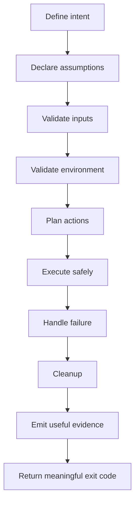

# Bash Scripting Discipline

Bash scripting is one of the highest-leverage skills in backend engineering because it sits between humans, source code, build systems, CI/CD, containers, Kubernetes, cloud CLIs, and production debugging.

A Bash script can be a productivity accelerator.

It can also be an incident generator.

This part is not about collecting Bash tricks. It is about writing scripts that are readable, debuggable, idempotent, safe, CI-friendly, and production-aware.

For a senior Java/JAX-RS backend engineer, Bash scripts commonly appear in:

- local setup
- build wrappers
- Maven commands
- database initialization
- Docker image build helpers
- Kubernetes diagnostics
- CI/CD workflow steps
- release automation
- log extraction
- incident evidence collection
- migration validation
- dependency/security scanning
- developer productivity helpers

The goal is to treat Bash as engineering code, not disposable glue.

---

## 1. Core Concept

A Bash script is an executable operational contract.

It should clearly define:

- what it does
- what inputs it expects
- what environment it assumes
- what files/resources it reads
- what files/resources it writes
- what external commands it calls
- what failure means
- whether it is safe to retry
- whether it is safe in CI
- whether it is safe near production

A senior-level Bash script is not merely "works on my machine" automation. It is a controlled workflow with explicit assumptions and failure behavior.

---

## 2. Why Bash Scripting Discipline Matters

Bash scripts usually operate at system boundaries.

| Boundary | Example Script Risk |
|---|---|
| Filesystem | Deletes wrong directory because variable is empty |
| Git | Pushes wrong branch or rewrites shared history |
| Maven | Skips tests accidentally or publishes wrong artifact |
| Docker | Builds image with wrong tag or stale context |
| Kubernetes | Deletes resource in wrong namespace |
| Cloud | Uses wrong AWS profile or Azure subscription |
| Security | Prints secret into logs or shell history |
| CI/CD | Hides failed command in pipeline |
| Release | Tags wrong commit or publishes inconsistent artifact |
| Incident support | Captures misleading or incomplete evidence |

Because Bash is close to operations, small mistakes can have large blast radius.

A disciplined script makes the safe path easy and the dangerous path explicit.

---

## 3. Script Lifecycle

A production-safe script should have a lifecycle similar to application code:



Most weak scripts skip validation and jump directly from intent to execution.

That is where failure modes hide.

---

## 4. When Bash Is the Right Tool

Bash is good for orchestration around existing CLI tools.

Good Bash use cases:

- run a sequence of Maven commands
- check required tools exist
- prepare local environment
- call `curl` and parse response with `jq`
- wrap Docker Compose commands
- collect logs and diagnostics
- validate environment variables
- run simple CI glue logic
- call `kubectl` read-only diagnostics
- create repeatable command recipes

Bash is weak for complex business logic.

Avoid Bash for:

- deeply nested data transformations
- complex JSON manipulation without `jq`
- long-running services
- concurrency-heavy workflows
- complex retry/backoff state machines
- domain rules
- large configuration generation
- cross-platform GUI/desktop flows
- large test frameworks

For complex logic, use a more structured language such as Java, Python, Go, or a purpose-built build/deployment tool.

Senior rule:

> Use Bash to compose tools. Do not rebuild a platform in Bash.

---

## 5. Script File Naming and Placement

Common locations:

```text
scripts/
bin/
tools/
ci/
.github/scripts/
deployment/scripts/
```

Recommended naming style:

```text
scripts/dev-start.sh
scripts/dev-test.sh
scripts/ci-build.sh
scripts/release-check.sh
scripts/collect-evidence.sh
scripts/k8s-readonly-diagnostics.sh
```

A script name should answer:

- who uses it?
- what does it do?
- is it local, CI, release, or operational?
- is it read-only or mutating?

Avoid vague names:

```text
run.sh
helper.sh
do.sh
fix.sh
deploy2.sh
new-script.sh
```

Ambiguous names create operational risk.

---

## 6. Shebang

Use an explicit shebang.

For Bash-specific scripts:

```bash
#!/usr/bin/env bash
```

This resolves Bash from `PATH` and is often more portable than hardcoding `/bin/bash`.

For strict POSIX shell scripts:

```sh
#!/bin/sh
```

Do not use Bash-only syntax in `/bin/sh` scripts.

Bash-only examples:

```bash
[[ "$name" == service-* ]]
items=(api worker batch)
mapfile -t lines < file.txt
set -o pipefail
```

Senior rule:

> If the script uses Bash features, declare Bash. If it declares `sh`, keep it POSIX-compatible.

---

## 7. Minimal Safe Script Template

A strong starting template:

```bash
#!/usr/bin/env bash
set -Eeuo pipefail

SCRIPT_DIR="$(cd "$(dirname "${BASH_SOURCE[0]}")" && pwd)"
REPO_ROOT="$(cd "${SCRIPT_DIR}/.." && pwd)"

log() {
  printf '[%s] %s\n' "$(date -u +'%Y-%m-%dT%H:%M:%SZ')" "$*" >&2
}

fail() {
  log "ERROR: $*"
  exit 1
}

usage() {
  cat <<'USAGE'
Usage:
  script-name.sh [--dry-run] [--env ENV]

Options:
  --dry-run    Print actions without executing mutating commands
  --env ENV    Target environment name
  -h, --help   Show help
USAGE
}

DRY_RUN=false
TARGET_ENV=""

while [[ $# -gt 0 ]]; do
  case "$1" in
    --dry-run)
      DRY_RUN=true
      shift
      ;;
    --env)
      TARGET_ENV="${2:-}"
      [[ -n "$TARGET_ENV" ]] || fail "--env requires a value"
      shift 2
      ;;
    -h|--help)
      usage
      exit 0
      ;;
    *)
      fail "Unknown argument: $1"
      ;;
  esac
done

[[ -n "$TARGET_ENV" ]] || fail "Missing --env"

main() {
  log "Starting script for env=${TARGET_ENV}, dry_run=${DRY_RUN}"
  # implementation here
  log "Done"
}

main "$@"
```

This template establishes:

- explicit interpreter
- strict-ish mode
- deterministic script path
- logging
- failure helper
- usage output
- argument parsing
- dry-run option
- main function

It is not universal, but it is much safer than unstructured command piles.

---

## 8. Strict Mode

Common strict mode:

```bash
set -Eeuo pipefail
```

Meaning:

| Option | Meaning |
|---|---|
| `-e` | Exit when a command fails in many contexts |
| `-E` | Inherit ERR trap in functions/subshells where applicable |
| `-u` | Treat unset variables as errors |
| `-o pipefail` | Pipeline fails if any command in the pipeline fails |

Strict mode catches many mistakes.

But it is not magic.

---

## 9. `set -e` Caveats

`set -e` does not behave like exceptions in Java.

It has surprising exceptions in conditions, boolean lists, pipelines, and command substitutions.

Example:

```bash
set -e

if grep -q "READY" app.log; then
  echo "ready"
fi
```

A non-zero `grep` inside `if` does not exit the script because the command is being used as a condition.

Example:

```bash
set -e

maybe_fails || echo "ignored"
```

The failure is intentionally handled by `||`, so script continues.

Dangerous example:

```bash
set -e

count=$(grep -c "ERROR" missing.log)
echo "count=$count"
```

Depending on the command and context, command substitution behavior can be surprising. Be explicit when failure matters.

Better:

```bash
if [[ ! -f missing.log ]]; then
  fail "missing.log not found"
fi

count=$(grep -c "ERROR" missing.log || true)
echo "count=$count"
```

Senior rule:

> Use `set -e` as a guardrail, not as your only error-handling strategy.

---

## 10. `set -u` Caveats

`set -u` fails when an unset variable is referenced.

Example:

```bash
set -u

echo "$ENV_NAME"
```

If `ENV_NAME` is unset, the script exits.

Use required variable validation:

```bash
: "${ENV_NAME:?ENV_NAME is required}"
```

Use optional variable default:

```bash
LOG_LEVEL="${LOG_LEVEL:-INFO}"
```

Use empty default when acceptable:

```bash
EXTRA_ARGS="${EXTRA_ARGS:-}"
```

Be careful with arrays and optional positional arguments:

```bash
value="${1:-}"
```

Instead of:

```bash
value="$1"
```

Senior rule:

> Treat unset variables as configuration errors unless explicitly optional.

---

## 11. `pipefail`

Without `pipefail`, a pipeline returns the exit code of the last command.

Dangerous:

```bash
grep "ERROR" app.log | head -20
```

If `grep` fails because `app.log` does not exist, the pipeline may still look successful depending on downstream behavior.

Use:

```bash
set -o pipefail
```

Then a pipeline fails if any command in the pipeline fails.

But there are legitimate cases where non-zero is expected:

```bash
if grep -q "ERROR" app.log; then
  echo "errors found"
else
  echo "no errors found"
fi
```

Do not blindly append `|| true` everywhere. That hides failure.

Use `|| true` only when non-zero is expected and documented.

```bash
error_count=$(grep -c "ERROR" app.log || true)
```

---

## 12. Quoting Discipline

Always quote variable expansions unless you intentionally want word splitting or glob expansion.

Bad:

```bash
rm -rf $BUILD_DIR
```

Good:

```bash
rm -rf "$BUILD_DIR"
```

Bad:

```bash
for file in $FILES; do
  echo "$file"
done
```

Better with arrays:

```bash
files=("service-a.log" "service b.log")
for file in "${files[@]}"; do
  echo "$file"
done
```

Bad:

```bash
kubectl -n $NAMESPACE logs $POD
```

Good:

```bash
kubectl -n "$NAMESPACE" logs "$POD"
```

Senior rule:

> Unquoted variables are bugs waiting for whitespace, empty strings, or globs.

---

## 13. Argument Parsing

For simple scripts, a `while/case` parser is usually enough.

```bash
while [[ $# -gt 0 ]]; do
  case "$1" in
    --service)
      SERVICE="${2:-}"
      [[ -n "$SERVICE" ]] || fail "--service requires value"
      shift 2
      ;;
    --dry-run)
      DRY_RUN=true
      shift
      ;;
    -h|--help)
      usage
      exit 0
      ;;
    *)
      fail "Unknown argument: $1"
      ;;
  esac
done
```

Argument parsing should reject unknown input.

Bad:

```bash
# silently ignore unknown args
shift
```

Unknown arguments often mean typos.

In release/deployment scripts, typo tolerance is dangerous.

---

## 14. Usage Output

Every non-trivial script should support:

```bash
-h
--help
```

Good usage output includes:

- purpose
- syntax
- options
- environment variables
- examples
- safety notes
- whether command is mutating

Example:

```bash
usage() {
  cat <<'USAGE'
Usage:
  collect-evidence.sh --namespace NAMESPACE --pod POD --since 30m --out DIR

Description:
  Collects read-only Kubernetes diagnostics for a single pod.

Options:
  --namespace NAMESPACE  Kubernetes namespace
  --pod POD              Pod name
  --since DURATION       Log window, for example 30m or 2h
  --out DIR              Output directory for evidence bundle
  -h, --help             Show help

Safety:
  This script is read-only. It does not modify Kubernetes resources.
USAGE
}
```

A script without help output becomes tribal knowledge.

---

## 15. Required Tool Checks

Validate external commands before execution.

```bash
require_cmd() {
  command -v "$1" >/dev/null 2>&1 || fail "Required command not found: $1"
}

require_cmd git
require_cmd jq
require_cmd curl
require_cmd ./mvnw
```

For repository-local executables, check file presence and executable bit:

```bash
[[ -x "${REPO_ROOT}/mvnw" ]] || fail "mvnw not found or not executable"
```

For version-sensitive tools:

```bash
java -version
./mvnw -version
kubectl version --client
```

Do not assume developer machines and CI runners have the same tools.

---

## 16. Environment Validation

Validate environment variables explicitly.

```bash
: "${JAVA_HOME:?JAVA_HOME is required}"
: "${TARGET_ENV:?TARGET_ENV is required}"
```

For optional env vars:

```bash
MAVEN_ARGS="${MAVEN_ARGS:-}"
LOG_LEVEL="${LOG_LEVEL:-INFO}"
```

For dangerous target selection:

```bash
case "$TARGET_ENV" in
  dev|test|staging)
    ;;
  prod)
    [[ "${ALLOW_PROD:-false}" == "true" ]] || fail "prod requires ALLOW_PROD=true"
    ;;
  *)
    fail "Invalid TARGET_ENV: $TARGET_ENV"
    ;;
esac
```

Do not let an empty env variable become a production incident.

---

## 17. Working Directory Discipline

Scripts should not depend on the caller's current directory unless explicitly documented.

Weak:

```bash
mvn verify
```

Better:

```bash
cd "$REPO_ROOT"
./mvnw verify
```

Or avoid changing global working directory:

```bash
(cd "$REPO_ROOT" && ./mvnw verify)
```

A script should be runnable from anywhere:

```bash
./scripts/ci-build.sh
(cd /tmp && /path/to/repo/scripts/ci-build.sh)
```

This prevents path-dependent failures in CI and local tooling.

---

## 18. Main Function Pattern

Use a `main` function for structure.

```bash
main() {
  parse_args "$@"
  validate_env
  validate_tools
  run_build
}

main "$@"
```

Benefits:

- easier to read
- easier to test manually
- easier to add traps
- easier to keep globals controlled
- easier to reuse functions

Avoid huge top-level scripts with interleaved parsing, validation, and execution.

---

## 19. Functions

Functions should have a clear responsibility.

Good:

```bash
run_unit_tests() {
  log "Running unit tests"
  (cd "$REPO_ROOT" && ./mvnw test)
}
```

Good:

```bash
collect_pod_logs() {
  local namespace="$1"
  local pod="$2"
  local out_dir="$3"

  kubectl -n "$namespace" logs "$pod" --timestamps > "${out_dir}/${pod}.log"
}
```

Avoid hidden dependencies on globals unless intentional.

Bad:

```bash
collect_pod_logs() {
  kubectl -n $NAMESPACE logs $POD > logs.txt
}
```

Better to pass important values as parameters.

---

## 20. Local Variables

Use `local` inside functions.

```bash
build_image() {
  local image_name="$1"
  local image_tag="$2"

  docker build -t "${image_name}:${image_tag}" .
}
```

Without `local`, variables are global by default in Bash functions.

This can create accidental coupling between functions.

Senior rule:

> Globals are configuration. Locals are computation.

---

## 21. Exit Codes

Exit codes are part of the script contract.

Common convention:

| Exit Code | Meaning |
|---:|---|
| `0` | Success |
| `1` | General failure |
| `2` | Usage/input error |
| `126` | Command found but not executable |
| `127` | Command not found |
| `130` | Interrupted by Ctrl+C |

You do not need a large taxonomy for every script, but failure should be meaningful.

Example:

```bash
usage_error() {
  log "USAGE ERROR: $*"
  usage
  exit 2
}
```

CI/CD uses exit codes to decide whether the pipeline passes.

Do not hide failures.

---

## 22. Error Handling

Bad:

```bash
mvn verify
docker build -t app .
docker push app
```

If the script has no strict mode and no explicit checks, failure may be missed or later commands may continue.

Better:

```bash
run() {
  log "+ $*"
  "$@"
}

run ./mvnw verify
run docker build -t "$IMAGE" .
run docker push "$IMAGE"
```

For commands that need shell features, use explicit Bash execution:

```bash
run_shell() {
  log "+ $*"
  bash -c "$*"
}
```

Use this carefully because `bash -c` can reintroduce quoting/injection risk.

---

## 23. ERR Trap

An ERR trap can add useful diagnostics.

```bash
trap 'log "Command failed at line ${LINENO}: ${BASH_COMMAND}"' ERR
```

Example:

```bash
#!/usr/bin/env bash
set -Eeuo pipefail

log() { printf '[%s] %s\n' "$(date -u +'%Y-%m-%dT%H:%M:%SZ')" "$*" >&2; }
trap 'log "Failed at line ${LINENO}: ${BASH_COMMAND}"' ERR

main() {
  ./mvnw verify
}

main "$@"
```

Be careful not to print secrets through `${BASH_COMMAND}`.

If commands may contain tokens, avoid generic command echoing or redact.

---

## 24. Cleanup Trap

Use cleanup for temporary files, locks, or background processes.

```bash
TMP_DIR="$(mktemp -d)"

cleanup() {
  rm -rf "$TMP_DIR"
}

trap cleanup EXIT
```

For background process cleanup:

```bash
PIDS=()

cleanup() {
  for pid in "${PIDS[@]:-}"; do
    kill "$pid" 2>/dev/null || true
  done
}

trap cleanup EXIT INT TERM
```

Cleanup must be safe if partially initialized.

Use defaults:

```bash
TMP_DIR="${TMP_DIR:-}"
[[ -n "$TMP_DIR" && -d "$TMP_DIR" ]] && rm -rf "$TMP_DIR"
```

---

## 25. Temporary Files

Use `mktemp` instead of predictable names.

Bad:

```bash
TMP=/tmp/output.txt
```

Good:

```bash
TMP_FILE="$(mktemp)"
```

For directories:

```bash
TMP_DIR="$(mktemp -d)"
```

Predictable temp files can cause race conditions, collisions, or security problems.

Do not put secrets in temp files unless necessary. If necessary, restrict permissions and cleanup aggressively.

---

## 26. Logging

Scripts should log to stderr so stdout remains usable for machine-readable output.

```bash
log() {
  printf '[%s] %s\n' "$(date -u +'%Y-%m-%dT%H:%M:%SZ')" "$*" >&2
}
```

Use UTC timestamps for incident evidence.

Good logs include:

- script name
- target environment
- current Git commit
- command stage
- output location
- failure reason

Avoid logging:

- passwords
- tokens
- cookies
- Authorization headers
- private keys
- customer data
- full connection strings with secrets

---

## 27. Command Echoing

Command echoing helps debugging but can leak secrets.

Simple option:

```bash
set -x
```

Problem: `set -x` prints expanded commands, including secret values.

Safer pattern:

```bash
DEBUG="${DEBUG:-false}"

if [[ "$DEBUG" == "true" ]]; then
  set -x
fi
```

Never enable `set -x` around secret-handling commands.

```bash
set +x
# secret-sensitive command here
set -x
```

In CI, debug output may be persisted and visible to more people than expected.

---

## 28. Dry-Run Mode

Mutating scripts should support dry-run when practical.

```bash
DRY_RUN=false

run_mutating() {
  if [[ "$DRY_RUN" == "true" ]]; then
    log "DRY RUN: $*"
  else
    log "+ $*"
    "$@"
  fi
}

run_mutating kubectl -n "$NAMESPACE" rollout restart deployment "$DEPLOYMENT"
```

Dry-run should show:

- target environment
- target resource
- planned action
- skipped mutation

Dry-run should not pretend to verify results that only exist after mutation.

---

## 29. Confirmation Prompts

For dangerous operations, require confirmation.

```bash
confirm() {
  local prompt="$1"
  read -r -p "$prompt [y/N] " answer
  [[ "$answer" == "y" || "$answer" == "Y" ]]
}

if [[ "$TARGET_ENV" == "prod" ]]; then
  confirm "Restart production deployment ${DEPLOYMENT}?" || fail "Aborted"
fi
```

In CI, prompts are usually bad because they hang jobs.

Use explicit flags for CI:

```bash
--yes-i-understand
--allow-prod
```

But make them intentionally verbose for dangerous operations.

---

## 30. Idempotency

An idempotent script can be safely run multiple times with the same intended result.

Good examples:

```bash
mkdir -p "$OUT_DIR"
```

```bash
git fetch --tags --prune
```

```bash
kubectl apply -f manifest.yaml
```

Non-idempotent examples:

```bash
echo "setting=true" >> config.properties
```

```bash
kubectl create namespace "$NAMESPACE"
```

Better:

```bash
kubectl get namespace "$NAMESPACE" >/dev/null 2>&1 || kubectl create namespace "$NAMESPACE"
```

But even this should be reviewed carefully in GitOps-controlled environments.

Senior rule:

> Retry safety is a design property, not a nice-to-have.

---

## 31. Destructive Command Safety

Dangerous commands:

```bash
rm -rf
find -delete
git reset --hard
git clean -fdx
kubectl delete
aws s3 rm --recursive
az resource delete
```

Guard destructive commands.

Bad:

```bash
rm -rf "$TARGET_DIR"
```

Better:

```bash
[[ -n "$TARGET_DIR" ]] || fail "TARGET_DIR is empty"
[[ "$TARGET_DIR" == "$REPO_ROOT/build/"* ]] || fail "Refusing to delete outside build directory: $TARGET_DIR"
rm -rf "$TARGET_DIR"
```

For Git cleanup:

```bash
git clean -fdx --dry-run
```

before:

```bash
git clean -fdx
```

For Kubernetes:

```bash
kubectl -n "$NAMESPACE" get deployment "$DEPLOYMENT"
```

before mutating it.

---

## 32. Namespace, Context, Account, and Environment Guards

Scripts that touch Kubernetes or cloud resources must print and validate target context.

```bash
current_context="$(kubectl config current-context)"
log "kubectl context: $current_context"
log "namespace: $NAMESPACE"

[[ "$current_context" == *"dev"* ]] || fail "Refusing non-dev context: $current_context"
```

Cloud guard example:

```bash
aws sts get-caller-identity
aws configure get region
```

Azure guard example:

```bash
az account show --query '{name:name, id:id, tenantId:tenantId}' -o table
```

Never let a script silently run against whichever context happens to be active.

---

## 33. Read-Only First Principle

For production support, start with read-only evidence collection.

Read-only examples:

```bash
kubectl get pods
kubectl describe pod "$POD"
kubectl logs "$POD"
curl -sS -I "$URL"
dig "$HOST"
ss -ltnp
```

Mutating examples:

```bash
kubectl delete pod
kubectl rollout restart
aws autoscaling set-desired-capacity
az resource delete
git push --force
```

Operational scripts should clearly label themselves:

```text
read-only diagnostics
mutating remediation
release action
cleanup action
```

This matters during incidents when humans are under pressure.

---

## 34. Secrets Handling

Avoid passing secrets as command-line arguments.

Command-line arguments may appear in process lists, logs, shell history, CI output, or audit trails.

Risky:

```bash
curl -H "Authorization: Bearer $TOKEN" https://api.example.com
```

Sometimes unavoidable, but be aware of exposure.

Safer patterns:

- use short-lived tokens
- avoid `set -x`
- avoid echoing commands with secrets
- read secrets from approved secret manager
- do not write secrets to files unless necessary
- delete temp files securely when applicable
- prefer CI secret masking, but do not rely on it completely

Do not commit `.env` files containing secrets.

Do not print full JDBC URLs if they contain credentials.

---

## 35. Bash and Maven

Common Maven script goals:

- standardize build command
- enforce wrapper usage
- select test profile
- collect logs/test reports
- validate Java version
- reduce local/CI mismatch

Example:

```bash
#!/usr/bin/env bash
set -Eeuo pipefail

REPO_ROOT="$(cd "$(dirname "${BASH_SOURCE[0]}")/.." && pwd)"
cd "$REPO_ROOT"

[[ -x "./mvnw" ]] || { echo "mvnw is required" >&2; exit 1; }

./mvnw \
  --batch-mode \
  --no-transfer-progress \
  clean verify
```

For CI, prefer:

```bash
./mvnw --batch-mode --no-transfer-progress verify
```

Avoid hiding test skips inside scripts:

```bash
./mvnw verify -DskipTests
```

If tests are skipped, make it explicit and justified.

---

## 36. Bash and Docker

Docker scripts should make image identity explicit.

```bash
IMAGE_NAME="quote-order-service"
IMAGE_TAG="${IMAGE_TAG:-$(git rev-parse --short HEAD)}"
FULL_IMAGE="${IMAGE_NAME}:${IMAGE_TAG}"

docker build -t "$FULL_IMAGE" .
```

Useful validations:

```bash
git diff --quiet || fail "Working tree has uncommitted changes"
```

or less strict:

```bash
log "Git commit: $(git rev-parse HEAD)"
log "Git status:"
git status --short >&2
```

For release images, never rely only on `latest`.

Use immutable tags derived from commit SHA, release version, or build metadata.

---

## 37. Bash and Kubernetes

Kubernetes scripts should be context-aware, namespace-aware, and ideally read-only unless intentionally operational.

Read-only evidence example:

```bash
kubectl -n "$NAMESPACE" get pod "$POD" -o wide
kubectl -n "$NAMESPACE" describe pod "$POD"
kubectl -n "$NAMESPACE" logs "$POD" --since=30m --timestamps
```

Port-forward scripts should cleanup background processes:

```bash
kubectl -n "$NAMESPACE" port-forward svc/quote-order 8080:8080 &
PF_PID=$!
trap 'kill "$PF_PID" 2>/dev/null || true' EXIT

sleep 2
curl -fsS http://localhost:8080/health
```

Do not write scripts that mutate live clusters without explicit guardrails.

---

## 38. Bash and Git

Git scripts should protect user work.

Before destructive Git operations:

```bash
if ! git diff --quiet || ! git diff --cached --quiet; then
  fail "Working tree has uncommitted changes"
fi
```

Use `--force-with-lease`, not plain `--force`, when force push is truly necessary:

```bash
git push --force-with-lease origin "$BRANCH"
```

But many enterprise repositories disallow force push.

Internal policy must win over personal preference.

For release tagging:

```bash
git rev-parse --verify "$TAG" >/dev/null 2>&1 && fail "Tag already exists: $TAG"
git tag -a "$TAG" -m "Release $TAG"
```

Do not silently overwrite tags.

---

## 39. Bash in CI/CD

CI Bash should be deterministic and non-interactive.

Good CI practices:

- use `--batch-mode` for Maven
- avoid prompts
- print tool versions
- fail fast on missing env vars
- upload artifacts/logs when possible
- avoid relying on developer-specific config
- avoid writing secrets to logs
- keep commands reproducible locally

Example:

```bash
log "Java version"
java -version

log "Maven version"
./mvnw -version

log "Git commit"
git rev-parse HEAD

./mvnw --batch-mode --no-transfer-progress verify
```

CI scripts should not require hidden machine state.

If a CI script works only on one runner because of preinstalled magic, document it or remove the magic.

---

## 40. Debugging Bash Scripts

Useful techniques:

```bash
bash -n script.sh
```

Syntax check only.

```bash
bash -x script.sh
```

Trace execution.

```bash
DEBUG=true ./script.sh
```

Controlled debug mode.

Add line tracing:

```bash
export PS4='+ ${BASH_SOURCE}:${LINENO}:${FUNCNAME[0]:-main}: '
set -x
```

Use ShellCheck where available:

```bash
shellcheck scripts/*.sh
```

ShellCheck catches many quoting, portability, and error-handling problems.

For larger scripts, consider Bats tests, especially for argument parsing and safety guards.

---

## 41. Common Bash Failure Modes

| Failure Mode | Symptom | Detection | Safer Pattern |
|---|---|---|---|
| Unquoted variable | Spaces break command | ShellCheck, weird file errors | Quote variables |
| Empty variable in path | Deletes wrong directory | Guard non-empty path | Validate target path |
| Missing `pipefail` | CI passes incorrectly | Failed upstream command hidden | `set -o pipefail` |
| Wrong interpreter | Works locally, fails in CI | `/bin/sh` vs Bash error | Explicit shebang |
| Hidden env dependency | Works on one machine only | Fresh machine/CI fails | Validate env/tools |
| Secret in logs | Token appears in CI output | Review logs | Disable tracing around secrets |
| Wrong kubectl context | Command hits wrong cluster | Print current context | Validate context |
| Non-idempotent append | Duplicate config entries | Re-run changes file repeatedly | Replace/update safely |
| Ignored command failure | Later step fails mysteriously | Missing exit checks | Strict mode + explicit checks |
| Cleanup missing | Temp files/processes remain | Disk/process leak | `trap cleanup EXIT` |

---

## 42. Failure Detection Strategy

When a Bash script fails, diagnose in this order:

1. What line failed?
2. What command failed?
3. What was the exit code?
4. What input values were used?
5. What current directory was used?
6. What environment variables were required?
7. What external command version was used?
8. Did the command run in local, CI, container, or production shell?
9. Was a pipeline hiding the real failure?
10. Was the failure expected but not handled?

Avoid randomly adding `|| true` or removing strict mode.

That usually converts visible failure into hidden corruption.

---

## 43. Production-Safe Script Design

For scripts that may touch production-adjacent systems, require:

- explicit target environment
- explicit namespace/account/subscription
- read-only mode where possible
- dry-run support for mutation
- confirmation or approval gate
- evidence logging
- no secrets in logs
- clear exit codes
- idempotent operation
- rollback note if mutation occurs
- owner and documentation

Production-safe scripts should be boring.

Boring is good.

Surprising automation is dangerous automation.

---

## 44. Correctness Concerns

Correctness questions for Bash scripts:

- Are all inputs validated?
- Are all variables quoted?
- Are expected failures handled explicitly?
- Are unexpected failures surfaced?
- Is the working directory deterministic?
- Is the target environment explicit?
- Is the script idempotent?
- Does it preserve user work?
- Does it preserve release traceability?
- Does it fail before mutation when assumptions are invalid?

A script that "usually works" is not enough for senior-level tooling.

---

## 45. Productivity Concerns

A good script should reduce cognitive load.

Productivity questions:

- Is the script easier than the manual steps?
- Does it document the workflow?
- Does it produce actionable errors?
- Does it work from a clean checkout?
- Does it work in CI and local environments consistently?
- Does it avoid unnecessary rebuilds?
- Does it expose useful flags?
- Does it avoid over-automation?

Bad automation makes failures harder to understand.

Good automation makes the workflow easier to trust.

---

## 46. Security Concerns

Security questions:

- Can secrets appear in command line arguments?
- Can secrets appear in logs?
- Can secrets appear in temp files?
- Does `set -x` expose sensitive values?
- Does the script use least privilege?
- Does it fetch remote scripts and execute them?
- Does it pin external tools/actions where relevant?
- Does it validate downloaded artifacts?
- Does it write to Git or artifact repositories safely?

Avoid:

```bash
curl https://example.com/install.sh | bash
```

unless the source, integrity, and trust model are explicitly accepted.

---

## 47. Reproducibility Concerns

Reproducibility questions:

- Does the script depend on local machine state?
- Does it depend on current directory?
- Does it depend on globally installed Maven?
- Does it depend on current Git branch silently?
- Does it depend on current kubectl context silently?
- Does it depend on unpinned Docker image tags?
- Does it depend on network availability at build time?
- Does it produce stable output paths?
- Can another engineer run it and get the same result?

The answer should be visible from the script or its help output.

---

## 48. Release Concerns

Release-related scripts must be stricter than local helper scripts.

Questions:

- Does the script validate clean working tree?
- Does it validate branch/tag/version?
- Does it use immutable artifact identifiers?
- Does it prevent overwriting tags?
- Does it record commit SHA?
- Does it produce changelog/release metadata?
- Does it publish to the correct repository?
- Does it distinguish snapshot and release?
- Does it support rollback or recovery documentation?

A release script without traceability is a compliance and debugging problem.

---

## 49. Observability and Incident-Support Concerns

Evidence collection scripts should:

- be read-only by default
- record timestamps in UTC
- record command versions
- record Git SHA or release tag if relevant
- capture logs with timestamps
- preserve raw evidence
- redact sensitive data
- avoid modifying live systems
- produce a clear output directory
- include a manifest of collected files

Example evidence manifest:

```bash
{
  echo "timestamp_utc=$(date -u +'%Y-%m-%dT%H:%M:%SZ')"
  echo "namespace=$NAMESPACE"
  echo "pod=$POD"
  echo "kubectl_context=$(kubectl config current-context)"
} > "${OUT_DIR}/manifest.txt"
```

Evidence without context is often useless.

---

## 50. Bash Script PR Review Checklist

Use this checklist when reviewing scripts:

### Intent and Scope

- [ ] Script purpose is clear.
- [ ] Script name reflects action and risk.
- [ ] Read-only vs mutating behavior is obvious.
- [ ] Target environment is explicit.

### Structure

- [ ] Shebang matches actual shell features.
- [ ] Strict mode is used or omission is justified.
- [ ] Script has usage/help output.
- [ ] Main function or clear structure exists.
- [ ] Functions have focused responsibilities.

### Input and Environment

- [ ] Required arguments are validated.
- [ ] Unknown arguments are rejected.
- [ ] Required env vars are validated.
- [ ] Tool dependencies are checked.
- [ ] Working directory is deterministic.

### Safety

- [ ] Variables are quoted.
- [ ] Destructive commands have guards.
- [ ] Production targets require explicit confirmation/approval.
- [ ] Dry-run exists for risky mutation where practical.
- [ ] Script is idempotent or non-idempotency is documented.

### CI/CD

- [ ] Script is non-interactive in CI mode.
- [ ] Exit codes are meaningful.
- [ ] Pipeline failures are not hidden.
- [ ] Tool versions are visible in logs.
- [ ] Output artifacts/logs are easy to find.

### Security

- [ ] Secrets are not printed.
- [ ] `set -x` does not expose secrets.
- [ ] Tokens are not passed unnecessarily in argv.
- [ ] Temp files are safe.
- [ ] Permissions are least-privilege.

### Reproducibility

- [ ] Script works from clean checkout.
- [ ] Script avoids hidden machine state.
- [ ] Wrapper tools are preferred where available.
- [ ] External downloads are pinned/verified where relevant.
- [ ] Output is deterministic enough for its purpose.

---

## 51. Internal Verification Checklist

For CSG/team-specific usage, verify rather than assume:

- [ ] Where official scripts live: `scripts/`, `bin/`, `.github/scripts/`, deployment repo, or platform repo.
- [ ] Whether Bash or POSIX shell is the team standard.
- [ ] Required local shell environment for developers.
- [ ] Whether ShellCheck or script linting runs in CI.
- [ ] Whether Makefile/Taskfile/wrapper commands are preferred over direct scripts.
- [ ] Which scripts are safe for local only.
- [ ] Which scripts are used by CI/CD.
- [ ] Which scripts can touch shared/dev/staging/prod environments.
- [ ] What approvals are required for mutating operational scripts.
- [ ] How secrets must be sourced locally and in CI.
- [ ] Whether production support scripts are read-only by policy.
- [ ] Whether Kubernetes/cloud CLI commands are allowed from developer machines.
- [ ] Whether GitOps prohibits direct cluster mutation.
- [ ] How release scripts are owned and reviewed.
- [ ] Where incident evidence scripts/runbooks are documented.
- [ ] Who owns shared tooling changes: backend, platform, SRE, DevOps, or security.

---

## 52. Senior Mental Model

A Bash script is not harmless because it is short.

Evaluate it by the authority it has:

- Can it delete files?
- Can it mutate Git history?
- Can it publish artifacts?
- Can it restart services?
- Can it access secrets?
- Can it deploy to environments?
- Can it hide failed tests?
- Can it generate misleading evidence?

The more authority a script has, the more discipline it needs.

For senior backend engineering, Bash mastery means designing small, explicit, auditable operational workflows that improve productivity without weakening correctness, security, reproducibility, or release safety.
