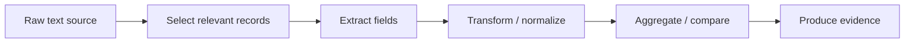
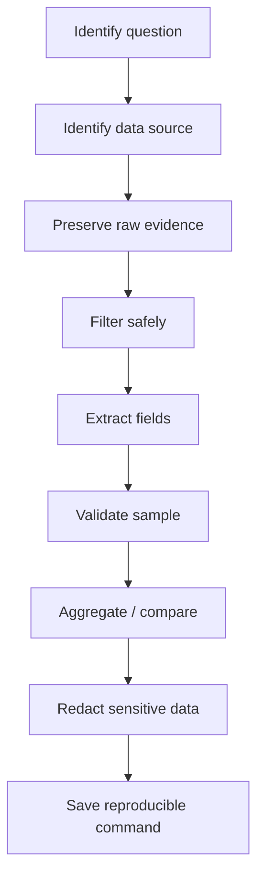

# Text Processing CLI

Backend engineering is full of text.

Not just source code, but:

- logs
- stack traces
- JSON responses
- YAML manifests
- Maven POM files
- dependency trees
- CI output
- test reports
- Kubernetes events
- Docker inspect output
- Git diffs
- release notes
- configuration files
- incident evidence bundles

Text processing CLI skill is the ability to extract signal from noisy operational data quickly, safely, and reproducibly.

This part focuses on command-line text processing for senior backend engineers working with Java/JAX-RS services, microservices, Maven, Docker, Kubernetes, CI/CD, PostgreSQL, Kafka, RabbitMQ, Redis, AWS, Azure, and production support workflows.

The goal is not to memorize every flag.

The goal is to build reliable evidence extraction habits.

---

## 1. Core Concept

Text processing is a pipeline:



Examples:

```bash
kubectl logs pod/quote-order --since=30m \
  | grep "correlationId=abc-123" \
  | grep "ERROR"
```

```bash
curl -sS "$URL" \
  | jq '.items[] | {id, status, updatedAt}'
```

```bash
./mvnw dependency:tree \
  | grep -E "jackson|jersey|jakarta"
```

Good text processing is:

- reproducible
- narrow enough to avoid noise
- careful with timestamps/timezones
- safe with sensitive data
- explicit about filters
- useful as evidence in PRs/incidents

---

## 2. Why Text Processing Matters

Senior backend engineers constantly need to answer questions like:

- Which request failed?
- Did this error start after a deployment?
- Which dependency version is actually used?
- Which pod is restarting?
- Which endpoint returns 500?
- Which CI step failed first?
- Which config value is active?
- Which release tag introduced behavior change?
- Which Kafka/RabbitMQ connection error appeared?
- Which Redis timeout correlates with application errors?
- Which Kubernetes event explains the restart?

Manual scanning does not scale.

Structured CLI extraction lets you create a repeatable diagnostic path.

---

## 3. Text Processing Lifecycle

A disciplined text-processing workflow follows this lifecycle:



Do not start with the command.

Start with the question.

Weak question:

> Check the logs.

Better question:

> For correlation ID `abc-123`, find all WARN/ERROR records between 10:00 and 10:15 UTC, grouped by service and exception type.

The second question produces evidence.

---

## 4. Read-Only First

Most text-processing commands should be read-only.

Read-only commands:

```bash
cat file
less file
grep pattern file
jq '.field' file.json
yq '.metadata.name' manifest.yaml
sort file
uniq -c file
wc -l file
```

Mutating commands:

```bash
sed -i 's/foo/bar/g' file
patch -p1 < change.patch
find . -delete
xargs rm
```

During debugging or incident support, start read-only.

Write transformed output to a new file:

```bash
grep "ERROR" app.log > evidence/errors.log
```

Avoid changing original evidence unless you are intentionally editing a file under source control.

---

## 5. Viewing Files: `cat`, `less`, `head`, `tail`

### `cat`

Use `cat` for small files or piping.

```bash
cat README.md
cat app.log | grep "ERROR"
```

But this is usually better:

```bash
grep "ERROR" app.log
```

Avoid `cat` on huge logs unless you intend to stream everything.

### `less`

Use `less` for interactive inspection.

```bash
less app.log
less -S app.log
```

Useful keys:

| Key | Meaning |
|---|---|
| `/pattern` | Search forward |
| `?pattern` | Search backward |
| `n` | Next match |
| `N` | Previous match |
| `G` | End of file |
| `g` | Start of file |
| `q` | Quit |

`less -S` disables line wrapping, useful for structured logs.

### `head`

Inspect first lines:

```bash
head app.log
head -50 app.log
```

Useful for checking format.

### `tail`

Inspect last lines:

```bash
tail app.log
tail -100 app.log
```

Follow live file:

```bash
tail -f app.log
```

For Kubernetes logs:

```bash
kubectl logs -f deployment/quote-order
```

Prefer bounded windows during incidents:

```bash
kubectl logs deployment/quote-order --since=30m --timestamps
```

---

## 6. Searching Text: `grep`

`grep` is the default search tool.

Basic:

```bash
grep "ERROR" app.log
```

Case-insensitive:

```bash
grep -i "timeout" app.log
```

Line numbers:

```bash
grep -n "NullPointerException" app.log
```

Context:

```bash
grep -C 3 "Exception" app.log
grep -A 10 "Caused by" app.log
grep -B 5 "ERROR" app.log
```

Extended regex:

```bash
grep -E "ERROR|WARN" app.log
```

Invert match:

```bash
grep -v "healthcheck" access.log
```

Count matches:

```bash
grep -c "ERROR" app.log
```

Recursive search:

```bash
grep -R "TODO" src/main/java
```

Exclude directories:

```bash
grep -R "password" . --exclude-dir=target --exclude-dir=.git
```

Senior caution:

> `grep` works line-by-line. Multi-line stack traces require context flags or another strategy.

---

## 7. `grep` for Backend Debugging

Search by correlation ID:

```bash
grep "correlationId=abc-123" app.log
```

Search errors excluding health checks:

```bash
grep "ERROR" app.log | grep -v "health"
```

Search HTTP 5xx access logs:

```bash
grep -E '" 5[0-9][0-9] ' access.log
```

Search Java exception classes:

```bash
grep -E "Exception|Error|Caused by" app.log
```

Search messaging connectivity issues:

```bash
grep -Ei "kafka|rabbit|amqp|redis|timeout|connection refused|broker" app.log
```

Search database issues:

```bash
grep -Ei "postgres|jdbc|sqlstate|connection pool|deadlock|timeout" app.log
```

---

## 8. Modern Search Awareness: `rg`

Many teams use `ripgrep` (`rg`) for source search because it is fast and respects `.gitignore` by default.

```bash
rg "QuoteService" src
rg "@Path" src/main/java
rg "jakarta.ws.rs" .
```

Search with context:

```bash
rg -C 3 "dependencyManagement" pom.xml
```

Search hidden files too:

```bash
rg --hidden "CODEOWNERS" .
```

This part focuses on standard tools, but `rg` is worth adopting for productivity if allowed by team setup.

Internal verification: check whether `rg` is part of recommended developer tooling.

---

## 9. Extracting Columns: `cut`

`cut` extracts fields by delimiter.

Example CSV-ish input:

```text
service,status,count
quote-order,500,12
catalog,200,531
```

Extract first column:

```bash
cut -d',' -f1 metrics.csv
```

Extract status:

```bash
cut -d',' -f2 metrics.csv
```

Caveat: `cut` is not a real CSV parser.

It breaks on quoted commas:

```csv
id,name
1,"Doe, Jane"
```

For real CSV, use a CSV-aware tool or a language/library.

---

## 10. Transforming Lines: `tr`

`tr` translates or deletes characters.

Uppercase:

```bash
echo "quote-order" | tr '[:lower:]' '[:upper:]'
```

Replace spaces with newlines:

```bash
echo "$PATH" | tr ':' '\n'
```

Delete carriage returns:

```bash
tr -d '\r' < file.txt > file.normalized.txt
```

Useful for Windows line ending issues in scripts.

---

## 11. Sorting and Counting: `sort`, `uniq`, `wc`

Count lines:

```bash
wc -l app.log
```

Sort values:

```bash
sort services.txt
```

Unique values:

```bash
sort services.txt | uniq
```

Count occurrences:

```bash
sort errors.txt | uniq -c | sort -nr
```

Example: count exception types from logs:

```bash
grep -Eo '[A-Za-z0-9_.]+Exception' app.log \
  | sort \
  | uniq -c \
  | sort -nr
```

This quickly identifies dominant failure types.

---

## 12. `awk` for Field Extraction and Aggregation

`awk` is useful for column-oriented text.

Print first column:

```bash
awk '{print $1}' app.log
```

Print line number and matching field:

```bash
awk '/ERROR/ {print NR, $0}' app.log
```

Use delimiter:

```bash
awk -F',' '{print $1, $3}' metrics.csv
```

Sum a field:

```bash
awk -F',' 'NR > 1 {sum += $3} END {print sum}' metrics.csv
```

Count by status:

```bash
awk '{count[$9]++} END {for (status in count) print status, count[status]}' access.log
```

For complex parsing, prefer structured logs and `jq` where possible.

`awk` is powerful, but dense `awk` scripts can become unreadable.

---

## 13. `sed` for Stream Editing

`sed` transforms text streams.

Replace first occurrence per line:

```bash
sed 's/foo/bar/' file.txt
```

Replace all occurrences per line:

```bash
sed 's/foo/bar/g' file.txt
```

Print specific line range:

```bash
sed -n '100,150p' app.log
```

Delete blank lines:

```bash
sed '/^$/d' file.txt
```

Redact token-like value:

```bash
sed -E 's/(Authorization: Bearer )[A-Za-z0-9._-]+/\1REDACTED/g' headers.txt
```

Be careful with in-place edits.

GNU sed:

```bash
sed -i 's/foo/bar/g' file.txt
```

macOS/BSD sed often requires:

```bash
sed -i '' 's/foo/bar/g' file.txt
```

Cross-platform scripts should avoid unreviewed `sed -i` or handle OS differences.

---

## 14. Finding Files: `find`

Find files by name:

```bash
find . -name "*.log"
```

Find Maven POM files:

```bash
find . -name pom.xml
```

Find large files:

```bash
find . -type f -size +100M
```

Find recently modified files:

```bash
find . -type f -mtime -1
```

Find shell scripts:

```bash
find . -type f -name "*.sh"
```

Exclude directories:

```bash
find . -path './target' -prune -o -name '*.java' -print
```

Dangerous:

```bash
find . -name "*.tmp" -delete
```

Safer:

```bash
find . -name "*.tmp" -print
```

Review output first, then delete if intended.

---

## 15. Batch Operations: `xargs`

`xargs` turns input lines into command arguments.

Example:

```bash
find . -name "*.log" -print | xargs grep "ERROR"
```

Problem: spaces in filenames can break this.

Safer null-delimited version:

```bash
find . -name "*.log" -print0 | xargs -0 grep "ERROR"
```

Limit command size or parallelize carefully:

```bash
find . -name "*.json" -print0 | xargs -0 -n 1 jq empty
```

Dangerous:

```bash
find . -name "*.tmp" | xargs rm
```

Safer:

```bash
find . -name "*.tmp" -print0 | xargs -0 -n 1 echo rm
```

Then remove `echo` only after verifying.

---

## 16. Comparing Files: `diff`

Compare two files:

```bash
diff old.txt new.txt
```

Unified diff:

```bash
diff -u old.txt new.txt
```

Compare directories:

```bash
diff -ru config-old config-new
```

Use cases:

- compare generated config
- compare release manifests
- compare dependency trees before/after a change
- compare CI output snapshots
- compare OpenAPI specs if text-based

Example:

```bash
./mvnw dependency:tree > before.txt
# change POM
./mvnw dependency:tree > after.txt
diff -u before.txt after.txt
```

This creates reviewable dependency evidence.

---

## 17. Applying Changes: `patch`

Apply a patch:

```bash
patch -p1 < fix.patch
```

Dry-run first:

```bash
patch --dry-run -p1 < fix.patch
```

Patch files are useful for:

- sharing small changes
- applying vendor fixes
- reviewing generated diffs
- backporting when Git remote access is limited

But in normal GitHub PR workflows, prefer branches and pull requests.

Patch workflow should not bypass review governance.

---

## 18. JSON Processing with `jq`

`jq` is essential for modern backend debugging.

Pretty print JSON:

```bash
jq . response.json
```

Extract field:

```bash
jq '.status' response.json
```

Raw string output:

```bash
jq -r '.status' response.json
```

Extract nested field:

```bash
jq -r '.data.order.id' response.json
```

Iterate array:

```bash
jq -r '.items[] | .id' response.json
```

Select items:

```bash
jq '.items[] | select(.status == "FAILED")' response.json
```

Create smaller objects:

```bash
jq '.items[] | {id, status, updatedAt}' response.json
```

Count:

```bash
jq '.items | length' response.json
```

Group statuses:

```bash
jq -r '.items[].status' response.json | sort | uniq -c | sort -nr
```

---

## 19. `jq` with `curl`

Common API debugging pattern:

```bash
curl -sS "$URL" | jq .
```

Fail on HTTP error and show body separately when needed:

```bash
curl -fsS "$URL" | jq .
```

Capture headers and body:

```bash
curl -sS -D headers.txt -o body.json "$URL"
jq . body.json
```

Extract request IDs from response headers:

```bash
grep -i "x-request-id" headers.txt
```

Extract domain-relevant fields:

```bash
jq '.quote | {id, status, customerId, version}' body.json
```

For incident evidence, save raw body before filtering:

```bash
curl -sS -D headers.txt -o raw-response.json "$URL"
jq '.items[] | {id, status}' raw-response.json > filtered-response.json
```

Raw evidence should be preserved, then redacted if needed.

---

## 20. `jq` for Structured Logs

If logs are JSON lines:

```json
{"timestamp":"2026-07-11T02:00:00Z","level":"ERROR","traceId":"abc","message":"failed"}
```

Filter errors:

```bash
jq 'select(.level == "ERROR")' app.jsonl
```

Filter by trace ID:

```bash
jq 'select(.traceId == "abc")' app.jsonl
```

Extract fields:

```bash
jq -r '[.timestamp, .level, .traceId, .message] | @tsv' app.jsonl
```

Count by exception:

```bash
jq -r 'select(.level == "ERROR") | .exception // "unknown"' app.jsonl \
  | sort \
  | uniq -c \
  | sort -nr
```

Structured logs are easier to process than free text logs.

If the team controls logging format, prefer structured logging for production systems.

---

## 21. YAML Processing with `yq`

`yq` is useful for Kubernetes, GitHub Actions, Helm values, and config files.

Read metadata name:

```bash
yq '.metadata.name' deployment.yaml
```

Read image:

```bash
yq '.spec.template.spec.containers[].image' deployment.yaml
```

Read GitHub Actions jobs:

```bash
yq '.jobs | keys' .github/workflows/ci.yml
```

Read Maven-related workflow command:

```bash
yq '.jobs.build.steps[].run' .github/workflows/ci.yml
```

Caution: there are multiple `yq` implementations with different syntax.

Internal verification: confirm which `yq` implementation the team uses, if any.

---

## 22. YAML and Kubernetes Debugging

Extract images from manifests:

```bash
yq '.spec.template.spec.containers[].image' k8s/deployment.yaml
```

Extract resource limits:

```bash
yq '.spec.template.spec.containers[].resources' k8s/deployment.yaml
```

Extract env vars:

```bash
yq '.spec.template.spec.containers[].env' k8s/deployment.yaml
```

Compare intended manifest to live object:

```bash
kubectl -n "$NAMESPACE" get deployment quote-order -o yaml > live.yaml
diff -u deployment.yaml live.yaml
```

In GitOps environments, live drift must be interpreted carefully.

Do not manually patch live resources unless internal process allows it.

---

## 23. Maven Text Processing

Dependency tree analysis:

```bash
./mvnw dependency:tree > dependency-tree.txt
```

Search for key libraries:

```bash
grep -E "jersey|jakarta|jackson|slf4j|logback" dependency-tree.txt
```

Find duplicate versions:

```bash
grep "jackson-databind" dependency-tree.txt
```

Compare before/after dependency change:

```bash
./mvnw dependency:tree > after.txt
diff -u before.txt after.txt
```

Effective POM:

```bash
./mvnw help:effective-pom > effective-pom.xml
```

Search effective plugin versions:

```bash
grep -n "maven-surefire-plugin" effective-pom.xml
```

For XML-aware parsing, use proper XML tools when available. Grep is useful for quick inspection, not complete XML semantics.

---

## 24. Git Text Processing

Inspect changed files:

```bash
git diff --name-only main...HEAD
```

Group changed file types:

```bash
git diff --name-only main...HEAD \
  | sed -E 's|.*/||' \
  | sed -E 's|.*\.||' \
  | sort \
  | uniq -c \
  | sort -nr
```

Search diffs for risky changes:

```bash
git diff main...HEAD | grep -E "skipTests|kubectl delete|rm -rf|password|secret"
```

Show commits compactly:

```bash
git log --oneline --decorate --graph -20
```

Find files changed by a commit:

```bash
git show --name-only --oneline COMMIT_SHA
```

This is useful during PR review and incident correlation.

---

## 25. CI Log Processing

CI logs are often noisy. Extract the first real failure.

Search for failure markers:

```bash
grep -n -E "ERROR|FAILURE|BUILD FAILURE|Tests run:|There are test failures" ci.log
```

Maven failure context:

```bash
grep -n -A 30 -B 10 "BUILD FAILURE" ci.log
```

Surefire report references:

```bash
grep -n "surefire-reports" ci.log
```

Dependency resolution failure:

```bash
grep -n -i -E "Could not resolve|Failed to collect dependencies|transfer failed|401|403|not authorized" ci.log
```

Java version mismatch:

```bash
grep -n -i -E "release version|invalid target release|UnsupportedClassVersionError" ci.log
```

Save useful snippets for PR comments instead of posting huge logs.

---

## 26. Log Slicing by Time

Time filtering depends heavily on log format.

If ISO timestamp starts each line:

```bash
awk '$1 >= "2026-07-11T10:00:00Z" && $1 <= "2026-07-11T10:15:00Z"' app.log
```

If logs include timezone offsets or multiline stack traces, this gets harder.

For Kubernetes logs, prefer server/client options when available:

```bash
kubectl logs deployment/quote-order --since=30m --timestamps
```

Use absolute timestamps in incident notes:

```text
Window analyzed: 2026-07-11 03:00:00Z to 2026-07-11 03:30:00Z
```

Do not mix local time, UTC, pod time, and browser time without labeling them.

---

## 27. Multi-Line Stack Traces

Java stack traces are multi-line, but many CLI tools operate line-by-line.

Search with context:

```bash
grep -n -A 40 -B 5 "NullPointerException" app.log
```

Extract blocks can be tricky.

If logs are structured JSON and stack trace is a field, use `jq`.

```bash
jq 'select(.exception == "java.lang.NullPointerException") | {timestamp, traceId, stackTrace}' app.jsonl
```

For plain logs, capture a wide context window and manually verify.

Do not over-trust regex extraction for multi-line exceptions.

---

## 28. Redaction

Before sharing logs, redact sensitive fields.

Common sensitive data:

- access tokens
- refresh tokens
- cookies
- Authorization headers
- passwords
- private keys
- API keys
- JDBC URLs with credentials
- customer identifiers if regulated
- personal data

Example redaction:

```bash
sed -E 's/(Authorization: Bearer )[A-Za-z0-9._-]+/\1REDACTED/g' raw.log > redacted.log
```

Redact JSON fields with `jq`:

```bash
jq 'del(.token, .password, .authorization)' raw.json > redacted.json
```

Or replace values:

```bash
jq '.token="REDACTED" | .password="REDACTED"' raw.json > redacted.json
```

Always preserve raw evidence in a secure location if required for incident analysis. Share only redacted evidence broadly.

---

## 29. Reproducible Evidence Bundles

A useful evidence bundle includes:

```text
evidence/
  manifest.txt
  raw/
    app.log
    headers.txt
    response.json
  derived/
    errors-only.log
    status-counts.txt
    dependency-diff.txt
  commands.sh
  redacted/
    shareable-errors.log
```

Create manifest:

```bash
mkdir -p evidence/raw evidence/derived evidence/redacted

{
  echo "timestamp_utc=$(date -u +'%Y-%m-%dT%H:%M:%SZ')"
  echo "git_commit=$(git rev-parse HEAD 2>/dev/null || true)"
  echo "user=$(whoami)"
  echo "host=$(hostname)"
} > evidence/manifest.txt
```

Save commands:

```bash
cat > evidence/commands.sh <<'COMMANDS'
# Commands used to derive evidence
kubectl logs deployment/quote-order --since=30m --timestamps > raw/app.log
grep "ERROR" raw/app.log > derived/errors-only.log
COMMANDS
```

Evidence without commands is hard to trust.

---

## 30. Text Processing for API Bug Reports

A strong API bug report can be built from CLI evidence:

```bash
curl -sS -D headers.txt -o response.json \
  -H "X-Correlation-ID: debug-abc-123" \
  "$URL"

jq '{status, errorCode, message, traceId}' response.json

grep -i "x-correlation-id" headers.txt
```

Include:

- request method
- URL/path, with sensitive parameters removed
- headers that matter
- response status
- response body excerpt
- correlation ID
- timestamp UTC
- relevant server logs
- expected vs actual result

Do not include tokens, cookies, or customer-sensitive payload unless approved and secure.

---

## 31. Text Processing for PR Review

Useful PR review commands:

Changed files:

```bash
git diff --name-only main...HEAD
```

POM changes:

```bash
git diff main...HEAD -- '**/pom.xml'
```

Workflow changes:

```bash
git diff main...HEAD -- '.github/workflows/*'
```

Script changes:

```bash
git diff main...HEAD -- 'scripts/*' '*.sh'
```

Search for risky strings:

```bash
git diff main...HEAD \
  | grep -E "skipTests|set \+e|set -x|rm -rf|kubectl delete|password|secret|latest"
```

Dependency diff:

```bash
./mvnw dependency:tree > dependency-tree-after.txt
diff -u dependency-tree-before.txt dependency-tree-after.txt
```

This turns review concerns into evidence.

---

## 32. Text Processing for Kubernetes Operations

List pods:

```bash
kubectl -n "$NAMESPACE" get pods -o wide
```

Get JSON and process with `jq`:

```bash
kubectl -n "$NAMESPACE" get pods -o json \
  | jq -r '.items[] | [.metadata.name, .status.phase] | @tsv'
```

Find non-running pods:

```bash
kubectl -n "$NAMESPACE" get pods -o json \
  | jq -r '.items[] | select(.status.phase != "Running") | .metadata.name'
```

Extract restart counts:

```bash
kubectl -n "$NAMESPACE" get pods -o json \
  | jq -r '.items[] | .metadata.name as $pod | .status.containerStatuses[]? | [$pod, .name, .restartCount] | @tsv'
```

Events sorted by time:

```bash
kubectl -n "$NAMESPACE" get events --sort-by=.lastTimestamp
```

Senior caution:

> `kubectl get ... -o json | jq ...` is read-only and good for diagnostics. Mutation commands require stronger process controls.

---

## 33. Text Processing for Docker

Inspect image metadata:

```bash
docker inspect "$IMAGE" | jq '.[0] | {Id, Created, RepoTags, Config}'
```

List image IDs and tags:

```bash
docker images --format '{{.Repository}} {{.Tag}} {{.ID}} {{.CreatedSince}}'
```

Check container logs:

```bash
docker logs "$CONTAINER" 2>&1 | grep "ERROR"
```

Find exposed ports:

```bash
docker inspect "$CONTAINER" | jq '.[0].NetworkSettings.Ports'
```

Check environment variables, carefully:

```bash
docker inspect "$CONTAINER" | jq '.[0].Config.Env'
```

Be careful: env output may contain secrets.

---

## 34. Text Processing for Cloud CLI Output

Prefer JSON output when using cloud CLIs.

AWS example:

```bash
aws sts get-caller-identity --output json | jq .
```

Azure example:

```bash
az account show -o json | jq '{name, id, tenantId}'
```

Resource filtering:

```bash
az resource list -o json | jq -r '.[] | [.name, .type, .resourceGroup] | @tsv'
```

Cloud output often includes IDs, names, regions, and metadata that are easy to mix up.

Always confirm account/subscription/region before interpreting results.

---

## 35. Handling Large Files

For large logs:

- avoid opening entire file in GUI editors
- use `less`
- use `grep` filters
- use `head`/`tail`
- split by time or size
- preserve raw file

Useful commands:

```bash
wc -l huge.log
```

```bash
grep -n "ERROR" huge.log | head
```

```bash
tail -10000 huge.log > recent.log
```

```bash
split -l 100000 huge.log huge.log.part-
```

Compress evidence:

```bash
tar -czf evidence.tar.gz evidence/
```

Be careful compressing sensitive logs. Treat archives as sensitive if raw logs are sensitive.

---

## 36. Locale and Sorting Pitfalls

Sort behavior can vary by locale.

For deterministic sorting:

```bash
LC_ALL=C sort file.txt
```

This matters for reproducible build scripts, generated files, and evidence comparisons.

Line endings also matter:

```bash
file script.sh
```

Remove carriage returns:

```bash
tr -d '\r' < script.sh > script.fixed.sh
```

Windows CRLF can break shell scripts with errors like:

```text
/bin/bash^M: bad interpreter
```

---

## 37. Failure Modes

| Failure Mode | Symptom | Detection | Safer Pattern |
|---|---|---|---|
| Grep misses multiline stack trace | Only first exception line captured | Compare with raw context | Use `-A/-B/-C` or structured logs |
| Grep pattern too broad | Too many false positives | Sample output | Add correlation ID/time/service filters |
| `sed -i` differs by OS | Script works on Linux, fails on macOS | CI/local mismatch | Avoid or branch by OS |
| CSV parsed with `cut` incorrectly | Quoted commas break fields | Bad output columns | Use CSV-aware tool |
| JSON parsed with grep | Fragile extraction | Field order/spacing breaks | Use `jq` |
| YAML parsed with grep | Wrong nested value | Multiple similar keys | Use `yq` |
| `xargs` breaks spaces | File not found or wrong args | Filenames with spaces | Use `-print0` and `xargs -0` |
| Evidence overwritten | Raw data lost | Missing raw file | Write derived outputs separately |
| Secret leaked in output | Token visible in shared logs | Review output | Redact before sharing |
| Timezone confusion | Wrong incident window | Conflicting timestamps | Normalize to UTC |

---

## 38. Debugging Text Pipelines

When a pipeline gives wrong output, debug stage by stage.

Instead of:

```bash
kubectl logs deploy/app | grep ERROR | awk '{print $1}' | sort | uniq -c
```

Break it down:

```bash
kubectl logs deploy/app > raw.log
```

```bash
head raw.log
```

```bash
grep ERROR raw.log > errors.log
```

```bash
head errors.log
```

```bash
awk '{print $1}' errors.log | head
```

This makes assumptions visible.

For pipelines in scripts, consider saving intermediate evidence when debugging production issues.

---

## 39. Correctness Concerns

Correctness questions:

- Is the input format actually line-based?
- Are timestamps comparable as strings?
- Is the timezone known?
- Are logs structured or free text?
- Is the pattern too broad?
- Is the pattern too narrow?
- Are multiline records handled?
- Is field position stable?
- Are JSON/YAML tools used instead of grep where appropriate?
- Is raw evidence preserved?

Text-processing output is only as good as the assumptions behind it.

---

## 40. Productivity Concerns

Good text-processing workflows should:

- shorten investigation time
- reduce repeated manual scanning
- create reusable command snippets
- produce shareable evidence
- support PR review
- support incident timeline building
- reduce dependence on one expert's memory

But over-complex one-liners can hurt productivity.

A 200-character readable pipeline is useful.

A 900-character unreadable pipeline should probably become a documented script.

---

## 41. Security Concerns

Security questions:

- Does the file contain secrets?
- Does the output contain customer data?
- Is the evidence safe to paste into Slack/Jira/GitHub?
- Are tokens redacted?
- Are cookies redacted?
- Are Authorization headers redacted?
- Are logs stored in a secure location?
- Are temporary files cleaned up?
- Are raw and redacted outputs separated?

Never assume logs are safe because they are "just logs".

---

## 42. Reproducibility Concerns

Reproducibility questions:

- Can someone rerun the command?
- Is the input file preserved?
- Is the time window explicit?
- Is the namespace/environment explicit?
- Are tool versions relevant?
- Does locale affect output?
- Does command output depend on current directory?
- Are intermediate transformations saved?
- Is the final output derived from documented commands?

For incident evidence, save commands next to outputs.

---

## 43. Release Concerns

Text processing often appears in release workflows:

- changelog generation
- version extraction
- manifest comparison
- dependency diff
- artifact list validation
- image tag validation
- release note generation

Release text processing must be deterministic.

Avoid fragile parsing of human-formatted output when machine-readable output is available.

Prefer:

```bash
git log --format='%H%x09%s'
```

over parsing default `git log` output.

Prefer JSON/YAML output from CLIs when possible.

---

## 44. Observability and Incident-Support Concerns

For incident support, text processing should help build a timeline.

Timeline fields:

- timestamp UTC
- service
- pod/container
- log level
- correlation ID
- trace ID
- endpoint/message/topic
- error class
- deployment version
- config/dependency if relevant

Example TSV extraction from structured logs:

```bash
jq -r '[.timestamp, .service, .level, .traceId, .message] | @tsv' app.jsonl \
  > timeline.tsv
```

TSV is often easier to sort, diff, and import into spreadsheets than raw JSON.

---

## 45. Text Processing Review Checklist

Use this checklist when reviewing scripts, runbooks, or PR comments that use text processing.

### Input

- [ ] Input source is clear.
- [ ] Raw input is preserved when evidence matters.
- [ ] Time window is explicit.
- [ ] Environment/namespace/service is explicit.
- [ ] Input format assumptions are stated.

### Filtering

- [ ] Filters are not too broad.
- [ ] Filters are not too narrow.
- [ ] Correlation ID/trace ID is used where possible.
- [ ] Health checks/noise are excluded only when justified.
- [ ] Multiline records are handled carefully.

### Parsing

- [ ] JSON is parsed with `jq`, not grep.
- [ ] YAML is parsed with `yq`, not grep, where practical.
- [ ] CSV parsing accounts for quoted fields or avoids fake CSV parsing.
- [ ] Field positions are stable or validated.
- [ ] Locale-sensitive operations are controlled if necessary.

### Output

- [ ] Output is understandable.
- [ ] Output can be reproduced.
- [ ] Derived files do not overwrite raw evidence.
- [ ] Counts/summaries include enough context.
- [ ] Commands are saved or documented.

### Security

- [ ] Secrets are redacted.
- [ ] Customer-sensitive data is handled according to policy.
- [ ] Raw evidence is stored securely.
- [ ] Shared snippets are safe.
- [ ] Temporary files are cleaned up when needed.

---

## 46. Internal Verification Checklist

For CSG/team-specific usage, verify rather than assume:

- [ ] Standard log format for Java/JAX-RS services.
- [ ] Whether logs are structured JSON or plain text.
- [ ] Correlation ID and trace ID field names.
- [ ] Timezone standard for logs and dashboards.
- [ ] Approved locations for storing incident evidence.
- [ ] Redaction rules for customer data, secrets, tokens, and identifiers.
- [ ] Whether `jq` and `yq` are installed in developer setup and CI runners.
- [ ] Which `yq` implementation/version is used.
- [ ] Whether `rg`, `fd`, or other modern CLI tools are recommended.
- [ ] Kubernetes log access rules.
- [ ] Cloud log access rules.
- [ ] CI log retention and artifact download process.
- [ ] Maven dependency analysis commands preferred by the team.
- [ ] PR review expectations for dependency diffs, workflow diffs, and script diffs.
- [ ] Incident/runbook examples that show accepted evidence format.

---

## 47. Senior Mental Model

Text processing is not about clever one-liners.

It is about controlled evidence extraction.

A senior engineer asks:

- What question am I answering?
- What source proves it?
- What did I filter out?
- What did I preserve?
- Can someone reproduce this?
- Did I leak anything sensitive?
- Is this command robust enough for a runbook or just a temporary investigation?

In enterprise backend systems, logs, configs, dependency trees, CI output, and Kubernetes resources are all evidence surfaces.

Mastering text-processing CLI gives you the ability to move from noise to proof quickly without losing safety, context, or auditability.
